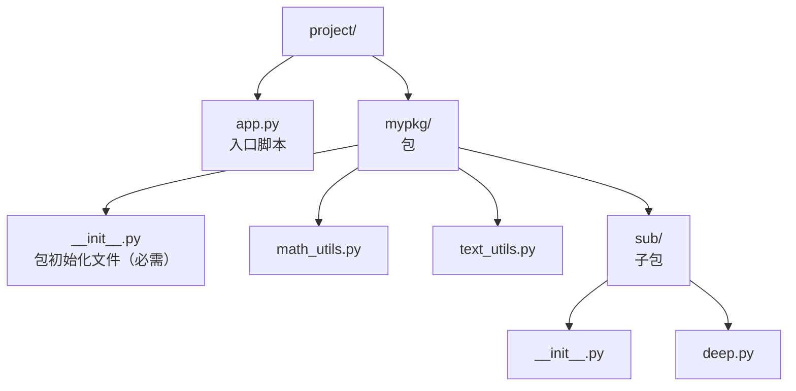
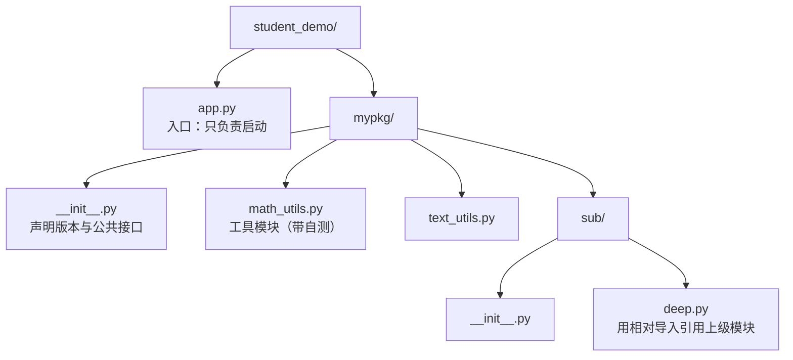
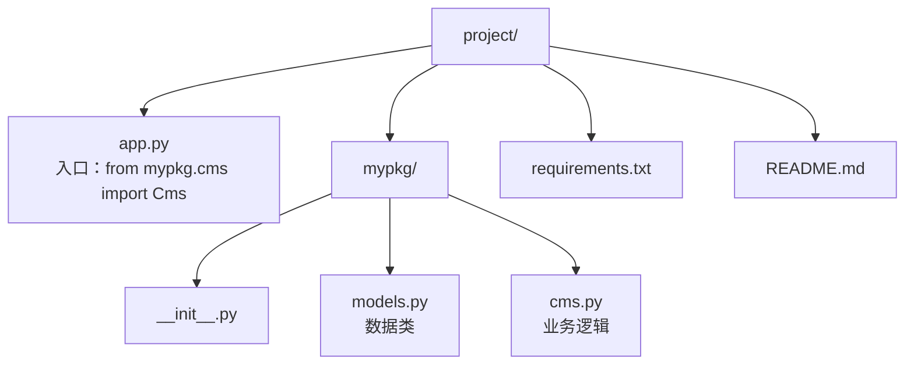

# 模块与包管理
> **一句话总结**：模块是 `.py` 文件，包是带 `__init__.py` 的目录；`import` 的三件事是"找到文件 → 执行一次并缓存到 `sys.modules` → 把名字绑定到当前命名空间"，把这套机制想清楚，循环导入、`if __name__ == "__main__"`、相对导入报错就都能解释。
> **前置知识**：函数与全局变量（02 篇）、类与对象（03 篇）、`try/except ImportError`（04 篇）。

> 1. 熟练使用 4 种 `import` 形式并说出各自的优缺点，能给模块和名字起别名；
> 2. 解释 `__name__` 在"直接运行"和"被导入"两种场景下的不同取值，正确使用 `if __name__ == "__main__":`；
> 3. 把一个单文件脚本拆成"包 + 模块 + 入口文件"的多文件工程，并用虚拟环境 + `requirements.txt` 管理依赖。

## 1. 核心概念
### 1.1 模块的三种来源
| 来源 | 说明 | 例子 |
| --- | --- | --- |
| 内置模块 built-in | 编译进解释器，随 Python 一起发布 | `sys`、`time`、`math`、`itertools` |
| 标准库 standard library | 随 Python 安装的一大批 `.py`/扩展模块 | `os`、`json`、`re`、`socket`、`pathlib` |
| 第三方包 third-party | 用 `pip` 从 PyPI 安装到 `site-packages` | `numpy`、`pandas`、`requests` |
| 自定义模块 | 你自己写的 `.py` 文件 | `A_module.py`、`student.py` |

**一个 `.py` 文件就是一个模块**；**一个包含 `__init__.py` 的目录就是一个包**。模块和包都是"命名空间容器"，用来把相关的函数、类、变量组织在一起。

### 1.2 四种导入形式对比
| 写法 | 命名空间效果 | 优点 | 缺点 |
| --- | --- | --- | --- |
| `import math` | 只有 `math` 一个名字 | 来源清晰，`math.sqrt` 一眼看出出处 | 调用时要写前缀 |
| `from math import sqrt` | 直接得到 `sqrt` | 调用简洁 | 名字来源不明确，可能被覆盖 |
| `from math import *` | 导入所有公开名字 | 写起来最短 | **污染命名空间**，与本地名字冲突难排查 |
| `import numpy as np` | 得到 `np` | 短前缀 + 来源清晰 | 需要记住别名约定 |
| `from math import sqrt as sq` | 得到 `sq` | 解决命名冲突、统一接口名 | 可能有多个名字指向同一实现 |
```python
import math
print(math.sqrt(16)) # 4.0

from math import sqrt
print(sqrt(16)) # 4.0

import math as m
print(m.sqrt(16)) # 4.0

from math import sqrt as sq
print(sq(16)) # 4.0
```
**实践建议**：生产代码优先用 `import 模块` 或 `import 模块 as 别名`；`from ... import *` 只应该出现在 `__init__.py` 的受控导出里（配合 `__all__`）。

**别名约定（读别人的代码必备）**：

| 约定 | 包 |
| --- | --- |
| `np` | numpy |
| `pd` | pandas |
| `plt` | matplotlib.pyplot |
| `sns` | seaborn |
| `tf` / `torch` | tensorflow / pytorch |

### 1.3 `import` 背后到底做了什么
`import mypkg.math_utils` 大致分四步：

1. **查找**：按 `sys.modules`（已导入缓存）→ `sys.path`（模块搜索路径）→ 内置模块的顺序找；
2. **加载**：找到 `mypkg/math_utils.py`，**从上到下执行整个文件**（这就是为什么模块顶层的 `print` 会被打印）；
3. **缓存**：把"模块名 → 模块对象"存进 `sys.modules`；
4. **绑定**：在当前命名空间绑定名字 `mypkg`，并把 `math_utils` 设为 `mypkg` 的一个属性。

关键结论：

- **同一个模块在一个进程里只会被执行一次**，之后 `import` 直接复用 `sys.modules` 里的对象 —— 所以"模块级代码有副作用"很危险（如读文件、连数据库、起线程），改成函数调用。
- `sys.path` 的第一个元素是**入口脚本所在目录**（或 `-m` 时的当前工作目录），了解这一点才能解释"为什么在 A 目录能 import，在 B 目录就不行"。

### 1.4 模块搜索路径 `sys.path`
```python
import sys
print(sys.path)
# ['<入口脚本目录>', ... 标准库路径 ..., ... site-packages ...]
```
| 查找顺序 | 位置 |
| --- | --- |
| 1 | 入口脚本所在目录 / `-m` 时的当前工作目录 |
| 2 | 环境变量 `PYTHONPATH` 中的目录 |
| 3 | 标准库目录 |
| 4 | `site-packages`（pip 安装的第三方包） |
| 5 | `.pth` 文件追加的路径 |

临时追加路径：`sys.path.append("/some/dir")`（**注意顺序**：`append` 放最后，`insert(0, ...)` 会**遮蔽**同名官方模块，很危险）。规范做法是把项目根目录作为入口运行，或用 `pip install -e .` 做可编辑安装。

### 1.5 `__name__` 与 `if __name__ == "__main__":`
每个模块都有一个 `__name__` 属性：

| 场景 | `__name__` 的值 |
| --- | --- |
| 直接运行 `python app.py` | `"__main__"` |
| 被导入 `import app` | `"app"` |
| 用 `python -m mypkg.math_utils` 运行 | `"__main__"` |
| 包 `mypkg/__init__.py` | `"mypkg"` |
```python
# student.py
if __name__ == "__main__":
 s = Student("乔峰", 33, "男", "13800138000", "丐帮帮主")
 print(s)
```
**作用**：让这个文件既能当"库"被别人 `import`（不执行测试代码），又能当"脚本"自己跑。的 `student.py`、`main.py`、`08-异常处理.py` 都用了这个写法，原因就在这里。

> 补充：`__name__` 与包名是两个概念。包里的 `__init__.py` 的 `__name__` 就是包名本身，所以那里写 `if __name__ == "__main__":` 永远不会为真。

### 1.6 包（package）与 `__init__.py`


**读图要点**：

| 观察 | 含义 |
| --- | --- |
| `__init__.py` 在两层各出现一次 | 每一级目录都要有自己的初始化文件，才能被当成普通包导入 |
| `app.py` 与 `mypkg/` 平级 | 入口脚本放在包外，`sys.path[0]` 才是 `project/`，`import mypkg` 才一定能成功 |
| 子包 `sub/` 是包里的包 | 子包内部要用相对导入时得多写一层，例如 `from ..math_utils import add` |
| 目录名就是导入时写的包名 | 重命名目录等于重命名包，所有引用它的 import 语句都要跟着改 |

`__init__.py` 的作用：

| 作用 | 说明 |
| --- | --- |
| 标识目录为包 | Python 2 必需；Python 3.3+ 有"命名空间包"可省略，但**普通包仍建议保留** |
| 包被导入时执行一次 | 做初始化、设置 `__version__` |
| 组织公共接口 | 在里面 `from .math_utils import add`，外部就能写 `from mypkg import add` |
| 控制 `import *` 的行为 | 定义 `__all__ = ["math_utils", "text_utils"]` |

**绝对导入 vs 相对导入**：

| 形式 | 写法 | 适用 |
| --- | --- | --- |
| 绝对导入 | `from mypkg.math_utils import add` | 入口脚本、跨包引用，**推荐** |
| 相对导入 | `from .math_utils import add`（`.` 当前包，`..` 上级包） | 包内部模块互相引用 |

**相对导入的硬性限制**：它依赖 `__package__` / `__name__`，只有当模块**作为包的一部分被导入**时才有效。直接 `python mypkg/sub/deep.py` 会立刻失败：
```text
ImportError: attempted relative import with no known parent package
```
正确做法是从项目根目录用 `python -m mypkg.sub.deep` 运行，或改用绝对导入。

### 1.7 `pip`、虚拟环境与依赖管理
| 任务 | 命令 |
| --- | --- |
| 创建虚拟环境 | `python -m venv .venv` |
| 激活（Windows PowerShell） | `.\.venv\Scripts\Activate.ps1` |
| 激活（macOS/Linux） | `source .venv/bin/activate` |
| 安装 | `pip install numpy` / `pip install numpy==2.3.5` |
| 查看已装 | `pip list` / `pip show numpy` |
| 导出依赖 | `pip freeze > requirements.txt` |
| 按清单安装 | `pip install -r requirements.txt` |
| 卸载 | `pip uninstall numpy` |

**为什么必须用虚拟环境**：不同项目的依赖版本常常冲突（A 项目要 pandas 1.x，B 项目要 pandas 3.x），装在全局环境里只能有一个版本。虚拟环境为每个项目隔离一套 `site-packages`。

`requirements.txt` 建议写**直接依赖 + 版本约束**，而不是 `pip freeze` 出来的全量清单（那会把间接依赖也钉死，升级时很痛苦）：
```text
numpy>=2.0,<3.0
pandas>=2.2
```
### 1.8 模块设计原则
| 原则 | 说明 |
| --- | --- |
| 一个模块一个职责 | `student.py` 只放 `Student` 类，`student_cms.py` 只放管理逻辑 |
| 顶层只做"定义" | 不要在模块顶层做耗时/有副作用的操作 |
| 用 `__all__` 声明公共接口 | 明确哪些名字是给外部用的 |
| 避免循环导入 | A 导入 B、B 又导入 A，会得到"半初始化"的模块 |
| 依赖单向 | `main → cms → model`，反向依赖说明分层错了 |

## 2. 最小可运行示例
把的"学员管理系统"拆成标准的多文件工程结构：


**读图要点**：

| 观察 | 含义 |
| --- | --- |
| 入口与包分列两个分支 | `app.py` 属于应用层，`mypkg/` 属于库，这条分界线决定了什么可以被打包发布 |
| 每个文件都有单一职责 | `math_utils` 与 `text_utils` 平级且互不依赖，新增能力是加文件而不是改文件 |
| `sub/deep.py` 是唯一使用相对导入的模块 | 它必须通过包被导入才有效，直接 `python mypkg/sub/deep.py` 会立刻报错 |
| 包内可以嵌套子包 | 嵌套带来分层，也带来更长的相对导入路径，层级不宜过深 |

**`mypkg/__init__.py`**
```python
"""mypkg 的包初始化文件：包被导入时执行，用来定义包的公共接口。"""
__all__ = ["math_utils", "text_utils"]
__version__ = "1.0.0"
```
**`mypkg/math_utils.py`**
```python
"""数学工具模块"""

PI = 3.14159

def add(a, b):
 """求和"""
 return a + b

if __name__ == "__main__":
 # 只有"直接运行本文件"时才执行；被 import 时不执行
 print("math_utils 自测:", add(1, 2))
```
**`mypkg/text_utils.py`**
```python
def shout(text):
 return text.upper() + "!"
```
**`mypkg/sub/deep.py`**
```python
from ..math_utils import add # 相对导入：.. 表示上一级包

def double_add(a, b):
 return add(a, b) * 2
```
**`app.py`（入口，放在 `student_demo/` 根目录）**
```python
import sys

import mypkg # 导入整个包
from mypkg import math_utils # 从包里导入模块
from mypkg.math_utils import add as plus # 导入名字并起别名
from mypkg.sub.deep import double_add # 导入子包中的函数

print("包版本:", mypkg.__version__) # 1.0.0
print("模块方式:", math_utils.add(1, 2)) # 3
print("别名方式:", plus(3, 4)) # 7
print("相对导入:", double_add(1, 2)) # 6
print("__name__ =", __name__) # __main__
print("sys.path[0] =", sys.path[0]) # .../student_demo

import mypkg.math_utils as m2
print("重复导入是同一个对象:", m2 is math_utils) # True
```
在 `student_demo/` 目录下运行 `python app.py`，真实输出：
```text
包版本: 1.0.0
模块方式: 3
别名方式: 7
相对导入: 6
__name__ = __main__
sys.path[0] = C:\...\_staging\_scratch\mod_demo
重复导入是同一个对象: True
```
再运行 `python -m mypkg.math_utils`，输出：
```text
math_utils 自测: 3
```
而如果**直接**运行子包里的文件：
```powershell
python mypkg/sub/deep.py
```
得到：
```text
ImportError: attempted relative import with no known parent package
```
**关键点说明**

| 位置 | 关键点 |
| --- | --- |
| `mypkg/__init__.py` | 包被导入时执行，`__version__` 挂在包对象上，可用 `mypkg.__version__` 读 |
| `math_utils.py` 尾部 | `__name__ == "__main__"` 让自测代码只在直接运行时执行 |
| `from ..math_utils import add` | `..` 表示"上一级包"，只在包内导入时有效 |
| `python -m mypkg.math_utils` | `-m` 把模块当主程序跑，`__name__` 同样是 `"__main__"` |
| `sys.path[0]` | 入口脚本所在目录被自动加入搜索路径，这决定了 `import mypkg` 能否成功 |
| `m2 is math_utils` | 模块只加载一次，两次 `import` 拿到同一个对象 |

## 3. 常见坑
| 坑 | 现象 | 原因 | 正确做法 |
| --- | --- | --- | --- |
| 直接运行包内模块 | `ImportError: attempted relative import with no known parent package` | 相对导入需要"包上下文"，直接运行脚本时 `__package__` 为空 | 从项目根用 `python -m pkg.mod`，或改用绝对导入 |
| 把模块命名成标准库名 | `import json` 拿到的是自己的文件，标准库失效 | `sys.path[0]` 优先于标准库 | 不要用 `json.py`、`random.py`、`types.py`、`test.py` 当模块名 |
| `from m import *` 覆盖本地名字 | 函数行为"莫名其妙"变了 | 星号导入把模块里所有公开名塞进当前命名空间 | 用 `import m` 或用 `__all__` 受控导出 |
| 循环导入 | `ImportError: cannot import name 'X' from partially initialized module` | A 导入 B 的同时 B 又导入 A，双方都还没执行完 | 把公共部分抽到第三个模块；或把 `import` 移到函数内部；或用 `import module` 而非 `from module import name` |
| 模块顶层写执行代码 | 一 `import` 就打印/联网/起线程 | 导入时会执行模块顶层所有语句 | 顶层只放定义，动作放进函数，并用 `if __name__ == "__main__":` 保护 |
| 改代码后不生效 | 修改没反应 | 模块已缓存在 `sys.modules`，进程内不会重新加载 | 重启进程；调试时用 `importlib.reload(mod)` |
| 在不同目录运行结果不同 | 同样的代码有时能 import 有时报 `ModuleNotFoundError` | `sys.path` 随入口脚本位置变化 | 固定从项目根目录运行；或配置 `PYTHONPATH` / 安装为包 |
| `sys.path.insert(0, ...)` 放错目录 | 内置/标准库模块被自己的同名文件遮蔽 | 自己的目录排到了标准库前面 | 用 `append` 而不是 `insert(0, ...)`；换掉冲突的文件名 |
| 包目录缺 `__init__.py` | 老 `ImportError: No module named pkg` | Python 3.3 之前必须有该文件 | 显式创建 `__init__.py`（也便于放 `__all__`） |
| `__init__.py` 里做重活 | 导入包变慢、甚至启动即报错 | 包初始化时机是所有子模块之前 | `__init__.py` 只做轻量声明，重活放下层模块 |
| 忘记加 `requirements.txt` | 换台机器跑不起来 | 依赖没记录 | `pip freeze > requirements.txt` 或手写直接依赖 |
| 把依赖装进全局环境 | 项目之间版本互相踩踏 | 共用同一套 `site-packages` | 每个项目一个 `venv` |
| 用 `pip` 却装到了别的解释器 | `import numpy` 报 `ModuleNotFoundError` | `pip` 和 `python` 不是同一个环境 | 统一用 `python -m pip install ...` |
| `__name__` 判断写成 `if __name__ = "__main__":` | `SyntaxError` | 把比较写成了赋值 | 用 `==`，双下划线不要漏 |
| 包名与模块名同名 | 导入到意想不到的层 | 名字冲突 | 包名用复数或加前缀（`utils/`、`mypkg_utils`） |

## 4. 面试问答
<details markdown="1">
<summary markdown="1"><strong>Q1：`if __name__ == "__main__":` 有什么用？原理是什么？</strong></summary>

作用：让一个 `.py` 文件**既可作为脚本直接运行，又可作为模块被导入**。直接运行时执行 `if` 块里的测试/启动代码；被 `import` 时不执行，避免"一导入就跑起来"。

原理：每个模块对象都有一个 `__name__` 属性。Python 在启动时把"被当作主程序执行的那个文件"的 `__name__` 设为字符串 `"__main__"`；而通过 `import` 加载的模块，`__name__` 是它的模块名（如 `"student"` 或 `"mypkg.math_utils"`）。所以这个判断等价于"我是不是主程序"。

补充两点：`python -m pkg.mod` 也把 `mod` 的 `__name__` 设为 `"__main__"`，所以 `-m` 方式同样会执行 `if` 块；包的 `__init__.py` 的 `__name__` 就是包名，所以那里写这个判断永远为假。

</details>

<details markdown="1">
<summary markdown="1"><strong>Q2：为什么会出现循环导入？怎么解决？</strong></summary>

循环导入指 A 模块导入 B，B 模块又导入 A。Python 的导入是"执行整个文件 + 缓存"，所以在执行到 A 的第 3 行 `import B` 时，A 自己的模块对象只构建了一半就被挂进 `sys.modules`；B 执行到 `from A import something` 时找不到那个还没定义的名字，就会报 `ImportError: cannot import name 'something' from partially initialized module 'A'`（`from ... import ...` 比 `import ...` 更容易触发，因为它要求属性此刻已存在）。

常见解决方案：

1. **重构分层**：把双方共用的部分抽到第三个更底层的模块，让依赖变成单向；
2. **延迟导入**：把 `import` 从模块顶层移到真正用到它的函数/方法内部；
3. **改成 `import A`**，只在调用时才用 `A.func`，避开"导入时就要属性存在"的约束；
4. **用类型注解的救急写法**：`from typing import TYPE_CHECKING` + `if TYPE_CHECKING: import A`，只让静态检查器看到。

根本解法是 1 —— 循环导入通常是分层设计有问题的信号。

</details>

<details markdown="1">
<summary markdown="1"><strong>Q3：`import module` 和 `from module import name` 有什么区别（除了写法）？</strong></summary>

三点区别：

1. **命名空间绑定不同**：`import module` 只把模块对象绑定到当前命名空间，之后必须写 `module.name`；`from module import name` 直接把对象绑定到当前命名空间，调用更短，但**看不出它来自哪个模块**，也更容易被后来的赋值覆盖。
2. **对循环导入的容忍度不同**：`import module` 只要求模块对象存在（此时哪怕模块还没执行完也不报错），`from module import name` 要求 `name` 此刻已被定义，所以更容易在循环导入时炸掉。
3. **可打补丁性/可测试性**：`import module` 之后在测试里 `monkeypatch.setattr(module, "name", fake)` 才能生效；`from module import name` 拿到的是一份独立引用，patch 原模块不会影响已导入的名字。这也是"用 `from x import y` 会让 mock 更麻烦"的原因。

结论：库/框架内部互相引用优先 `import module`；对外暴露的公共 API 可以在 `__init__.py` 里用 `from .x import y` 精简。

</details>

## 5. 自测题
<details markdown="1">
<summary markdown="1">1. 建一个包时，`__init__.py` 可以为空吗？为什么建议保留它？</summary>

可以为空。Python 3.3+ 引入了**命名空间包（namespace package）**，目录里没有 `__init__.py` 也能被当作包导入。

但仍建议保留，原因：① 明确表达"这是包"的意图，工具链（打包、静态检查、IDE）识别更可靠；② 可以放 `__all__` 声明公共接口、放 `__version__` 元信息；③ 可以做轻量初始化（如注册插件、设置日志）；④ 部分老工具和老版本（Python 2、部分打包后端）仍然要求它存在。

</details>

<details markdown="1">
<summary markdown="1">2. 为什么把文件命名为 `json.py` 会导致标准库 `json` 用不了？</summary>

因为 `sys.path` 的**第一个元素是入口脚本所在目录**，而它在标准库路径之前被搜索。当你有 `json.py` 时，`import json` 找到的是你的文件，标准库的 `json` 永远轮不到。

现象通常是 `AttributeError: module 'json' has no attribute 'loads'` 而不是 `ImportError`，很有迷惑性。解决办法是改文件名（推荐，如 `my_json.py`）；如果确实要保留，就必须用 `append` 而不是 `insert(0, ...)` 调整路径，但那只是掩盖问题。

</details>

<details markdown="1">
<summary markdown="1">3. 同一模块被 `import` 两次，模块顶层代码会执行几次？</summary>

一次。模块第一次被导入时会执行顶层代码并把模块对象放进 `sys.modules`；后续任何 `import`（无论从哪个文件、用哪种写法）都直接返回缓存中的同一个对象。可以用 `m2 is math_utils` 验证（结果为 `True`）。

推论：① 想"每次调用都重新执行"的逻辑必须写在函数里，不能靠模块顶层；② 修改模块源码后已运行的进程不会自动更新，需要重启进程或显式 `importlib.reload`；③ 模块顶层的"副作用"（连接数据库、起线程、读大文件）在整个程序生命周期内只发生一次，但仍然应该在导入时就避免。

</details>

<details markdown="1">
<summary markdown="1">4. 写出把单文件脚本拆成"入口 + 包"的目录结构，并说明入口脚本为什么放在包外面。</summary>



**读图要点**：

| 观察 | 含义 |
| --- | --- |
| 入口脚本 `app.py` 放在包外 | `sys.path[0]` 是 `project/`，因此 `import mypkg` 一定能成功 |
| 包内部可以自由使用相对导入 | 前提是模块始终作为包的一部分被导入，而不是被直接执行 |
| 依赖声明与说明文档和代码平级 | `requirements.txt`、`README.md` 属于工程文件，不需要也不能进包 |
| `mypkg/` 是一个干净的库 | 入口脚本属于应用层，不进库；打包发布时直接拿走 `mypkg/` 即可 |

入口放在包外面有三点好处：① `sys.path[0]` 是 `project/`，因此 `import mypkg` 一定能成功；② 包内部可以自由使用相对导入；③ 打包发布时 `mypkg` 是干净的库，入口脚本属于应用层，不进库。这正好对应 `main.py`（入口）+ `student.py`（模型）+ `student_cms.py`（逻辑）的拆分思路。

</details>

## 6. 延伸阅读
- Python 官方 · 模块（`__name__`、搜索路径、包的完整说明）：<https://docs.python.org/zh-cn/3/tutorial/modules.html>
- Python 官方参考 · import 系统（导入机制规范）：<https://docs.python.org/zh-cn/3/reference/import.html>
- `sys` 模块（`sys.path`、`sys.modules`）：<https://docs.python.org/zh-cn/3/library/sys.html>
- Python 官方 · 虚拟环境与包管理（`venv` / `pip`）：<https://docs.python.org/zh-cn/3/tutorial/venv.html>
- PyPA · `requirements.txt` 与依赖声明规范：<https://pip.pypa.io/en/stable/reference/requirements-file-format/>

---

[⬅️ 返回 Python 目录](README.md)
