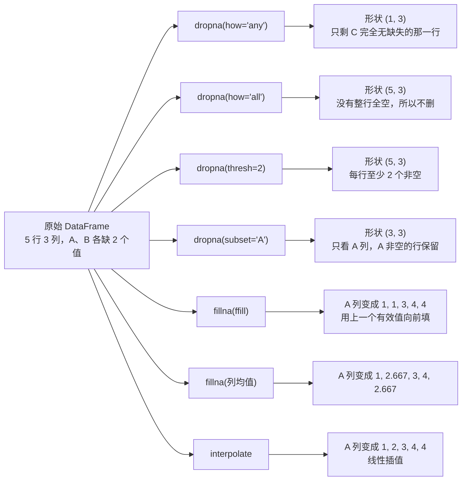

# Pandas 数据处理
> **一句话总结**：`Series` 是"带索引的一维数组"，`DataFrame` 是"共享同一行索引的多个 Series"；Pandas 的全部操作都围绕**索引对齐**展开，而"选数据（loc/iloc/query）→ 洗数据（缺失值/类型）→ 拼数据（concat/merge）→ 分组统计（groupby/pivot_table）"就是数据分析的标准流水线。
> **前置知识**：NumPy 的 ndarray、广播与 `axis` 语义（11 篇）、列表/字典（01 篇）、文件读写与编码（04 篇）。

> 1. 用 `read_csv` / `read_excel` 读数据，用 `loc` / `iloc` / 布尔 / `query` 精确取数；
> 2. 处理缺失值（`isnull` / `dropna` / `fillna` / `interpolate`），并按"行键 / 列名"正确选择 `concat` 还是 `merge`；
> 3. 用 `groupby.agg` / `pivot_table` / `crosstab` 做分组聚合，独立完成一个 RFM 用户分层案例。

## 1. 核心概念
### 1.1 Series 与 DataFrame
| 对象 | 定义 | 关键属性 |
| --- | --- | --- |
| `Series` | 一维带标签数组 = ndarray + Index | `index` `values` `dtype` `name` |
| `DataFrame` | 二维表格 = 共享同一行索引的多个 Series | `index` `columns` `dtypes` `shape` `values` `T` |
| `Index` | 行/列的标签容器，**不可变**，可有名字 | `pd.Index`、`DatetimeIndex`、`MultiIndex` |
```python
s = pd.Series([1, 2, 3], index=["a", "b", "c"])
s["b"] # 按"标签"取 → 2
s.iloc[1] # 按"位置"取 → 2
s[s > 1] # 布尔筛选 → [2, 3]
```
**创建方式**：

| 数据 | Series | DataFrame |
| --- | --- | --- |
| 列表 | `pd.Series([1,2,3])` | `pd.DataFrame([[1,2],[3,4]])` |
| 字典 | `pd.Series({"a":1,"b":2})`（键→索引） | `pd.DataFrame({"a":[1,2],"b":[3,4]})`（键→列名） |
| 元组列表 | `pd.Series(("x","y"))` | `pd.DataFrame([(1,2),(3,4)], columns=["a","b"])` |
| ndarray | `pd.Series(arr, index=[...])` | `pd.DataFrame(arr, columns=[...], index=[...])` |

### 1.2 索引对齐：Pandas 最重要的一条规则
**两个 Series/DataFrame 做运算时，优先按"行索引 / 列名"匹配，而不是按位置**。匹配不上的位置自动填 `NaN`。
```python
a = pd.Series([1, 2, 3], index=["x", "y", "z"])
b = pd.Series([10, 20], index=["y", "z"])
(a + b).to_dict # {'x': nan, 'y': 12.0, 'z': 23.0}
a.add(b, fill_value=0).to_dict # {'x': 1.0, 'y': 12.0, 'z': 23.0}
```
| 场景 | 行为 |
| --- | --- |
| `Series + 标量` | 每个元素都参与运算 |
| `Series + Series` | 按索引对齐，不匹配 → `NaN` |
| `DataFrame + 标量` | 每个元素都参与运算 |
| `DataFrame + DataFrame` | 按**行索引 + 列名**双向对齐 |
| 想要"缺失当 0" | 用 `add` / `sub` / `mul` / `div` 的 `fill_value=` |

> 这条规则是很多"结果里莫名多出 NaN"的根因。合并前先 `print(a.index.equals(b.index))` 检查一下索引是否一致。

### 1.3 取数三件套：`[]` / `loc` / `iloc`
| 写法 | 含义 | 切片是否**包右** |
| --- | --- | --- |
| `df["col"]` | 取一列（Series） | — |
| `df[["c1","c2"]]` | 取多列（DataFrame） | — |
| `df[bool_series]` | 布尔过滤行 | — |
| `df.loc[行标签, 列名]` | **按标签**取数 | ✅ **包含右端点** |
| `df.iloc[行号, 列号]` | **按位置**取数 | ❌ 包左不包右（同 Python 切片） |
| `df.at[行, 列]` / `df.iat[行号, 列号]` | 取**单个标量**，最快 | — |
```python
stock.loc[stock.index[0], "open"] # 23.53 按标签
stock.iloc[0, 1] # 25.88 按位置
stock["open"][stock.index[0]] # 链式（先列后行）
stock.loc[:, "open":"low"].shape # 列切片：(643, 4)
```
| 常见误用 | 后果 |
| --- | --- |
| `df[0]` 想取第 0 列 | 按列名 `0` 查找，找不到就 `KeyError`；真正想取列要用 `df.iloc[:, 0]` 或列名 |
| `df[0:3]` 想按标签切片 | `[]` 里的整数切片是**按位置**的，不是 `loc` |
| 链式赋值 `df[df.a>1]["b"] = 1` | pandas 3.x 下**不会生效**并给出告警（CoW），必须用 `df.loc[df.a>1, "b"] = 1` |

**推荐固化的两个习惯**：① 取数据一律用 `loc`（标签）或 `iloc`（位置），不用裸 `[]` 做复杂索引；② 赋值一律用 `df.loc[条件, 列] = 值` 单步完成。

### 1.4 增删改查速查
| 目的 | 方法 | 是否改原数据 |
| --- | --- | --- |
| 新增/覆盖列 | `df["new"] = df["a"] * 2` | ✅ 原地 |
| 新增列（链式友好） | `df.assign(new=df["a"] * 2)` | ❌ 返回新对象 |
| 删除行/列 | `df.drop(index=[...])` / `df.drop(columns=[...])` / `df.drop("col", axis=1)` | ❌ 默认返回新对象 |
| 原地删除 | `del df["col"]` | ✅ |
| 改列名/索引名 | `df.rename(columns={...}, index={...})` | ❌（加 `inplace=True` 则原地） |
| 改索引 | `df.set_index("col")` / `df.reset_index` | ❌ |
| 替换值 | `df.replace({旧: 新})` / `s.replace(old, new)` | ❌ |
| 排序 | `df.sort_values(by, ascending=)` / `df.sort_index` | ❌ |
| 排名 | `df.rank(method="dense")` | ❌ |
| 去重 | `df.drop_duplicates(subset=, keep=)` | ❌ |
| 查前/后 n 行 | `df.head(n)` / `df.tail(n)` | ❌ |
```python
df.sort_values(["open", "high"], ascending=[True, False]) # 多列不同方向
df.rank(ascending=False, method="dense") # 等价 SQL 的 DENSE_RANK
```
### 1.5 过滤：布尔 / `query` / `isin`
| 写法 | 说明 |
| --- | --- |
| `df[df.open > 23]` | 布尔 Series 过滤 |
| `df[(df.a >= 1) & (df.b <= 2)]` | 复合条件必须用 `&` `\|` `~`，**每个条件都要加括号** |
| `df.query("open >= 23 and open <= 24")` | 字符串表达式，可读性最好 |
| `df.query("country in ['中国','美国']")` | `query` 里支持 `in` |
| `df[df.open.isin([23.80, 25.60])]` | 是否属于某个集合 |
| `df.between(23, 24)` | 闭区间判断 |

**常见错误**：用 `and` / `or` / `not` 连接布尔 Series 会抛 `ValueError: The truth value of a Series is ambiguous`。Python 的 `and` 要求结果是单个布尔值，而 Series 是"一串布尔值"。

### 1.6 缺失值处理
| 步骤 | 方法 | 关键参数 |
| --- | --- | --- |
| 检测 | `df.isnull` / `df.notnull` | 配合 `.sum` 看每列缺失个数 |
| 检测（整体） | `df.isnull.any / .all` | 哪些列有缺失 |
| 删除 | `df.dropna` | `axis`（0 行/1 列）、`how`（`any`/`all`）、`thresh`（至少几个非空）、`subset`（只看这些列） |
| 填充 | `df.fillna(value)` | `value`、`method`（`ffill`/`bfill`）、`limit`、按列传字典 |
| 插值 | `df.interpolate` | `method="linear"` 等，适合时间序列 |
| 类型标记转 NaN | `df.replace("?", np.nan)` | 原始数据常用 `?` `-` `999` 表示缺失 |

实测（5 行 3 列，A、B 各缺 2 个值）：

这张图回答：面对同一个缺值的 DataFrame，不同参数各自会留下几行、把 A 列填成什么样。



**读图要点**：

| 观察 | 含义 |
| --- | --- |
| 同一次删除，`how` 与 `thresh` 给出的形状完全不同 | `how='any'` 最激进（只剩 1 行）、`how='all'` 最宽松（不删），`thresh` 用「至少几个非空」做中间档 |
| `subset` 把判断限定在部分列 | 其他列缺不缺不影响行是否保留，适合「只关心关键字段」的场景 |
| 三种填充给出三种 A 列 | `ffill` 复制上一个有效值、均值填充会引入 2.667 这类非原始值、线性插值按趋势补 |
| 填充一定会改变分布 | `ffill` 让值重复、均值让方差变小，所以填充策略必须写进报告口径 |
| 删除与填充是两种不同的取舍 | 删除损失样本量，填充损失真实性；缺失比例高时还要额外加「是否缺失」的指示列 |

**"用均值填充"的三个前提**（默认这么做，但要知道风险）：

1. 该列是**数值型**且近似对称分布（否则均值会被极值带偏，应考虑中位数）；
2. 缺失是**随机**发生的（MCAR/MAR）；如果是"高收入人群不愿填收入"，均值填充会系统性低估；
3. 缺失比例不高（经验上超过 20~30% 就该考虑删除该列或建"是否缺失"的指示列）。

对**时间序列**，`ffill` / `interpolate` 通常比均值更合理；对**分类列**，用众数或单独建一个 `"Unknown"` 类别。

### 1.7 数据合并：`concat` vs `merge`
| 维度 | `pd.concat` | `pd.merge` |
| --- | --- | --- |
| 定位 | **拼接**（stack） | **连接**（join，类似 SQL JOIN） |
| 对象数量 | 可一次拼多个 | **一次只能两个** |
| 对齐依据 | `axis=0` 按**列名**；`axis=1` 按**行索引** | 按**关联键**（`on` / `left_on` / `right_on`） |
| 默认连接方式 | `join="outer"`（并集，缺失填 NaN） | `how="inner"`（交集） |
| 索引处理 | `ignore_index=True` 重置索引 | 结果索引默认重置 |

| `how` | 保留的键 | SQL 对应 |
| --- | --- | --- |
| `inner` | 两边都有的键 | `INNER JOIN` |
| `left` | 左表全部键 + 右表匹配到的 | `LEFT JOIN` |
| `right` | 右表全部键 + 左表匹配到的 | `RIGHT JOIN` |
| `outer` | 两边的键的并集 | `FULL OUTER JOIN` |
```python
pd.concat([left, right], ignore_index=True) # 纵向拼接（行增加）
pd.concat([left, right], axis=1) # 横向拼接（列增加，按行索引对齐）
pd.merge(left, right, how="left", on="key1")
pd.merge(l2, r2, left_on="k1", right_on="k1") # 左右键名不同
pd.merge(l3, r3, on="k", suffixes=("_x", "_y")) # 同名非键列加后缀
```
> **"合并后行数变多了"是正常的**：只要关联键在一侧有重复值，就会产生笛卡尔式的多对多匹配。合并后一定要用 `shape` / `value_counts` 检查行数变化，这是数据管道里最常见的隐性 bug。

### 1.8 分组聚合：split-apply-combine
```python
df.groupby(["city", "channel"]).agg({"revenue": "mean", "unit_cost": "sum"})
```
三阶段：**拆分**（按键分组）→ **应用**（每组做计算）→ **合并**（拼回结果表）。

| 方法 | 作用 | 返回形状 |
| --- | --- | --- |
| `gb.sum` / `.mean` / `.count` | 常用聚合 | 每组一行 |
| `gb.agg({列: 函数})` | 不同列用不同函数 | 每组一行 |
| `gb.agg(["sum", "mean"])` | 同列多函数 | 多层列索引 |
| `gb.first` / `.last` | 每组首/末行 | 每组一行 |
| `gb.get_group("上海")` | 取某一组的原始数据 | 原始行数 |
| `gb.filter(lambda x: 条件)` | **按组筛选，返回原始明细行** | 满足条件的全部分组 |
| `gb.transform("mean")` | **返回与原表等长**的结果，用于新增列 | 与输入等长 |
| `gb.apply(func)` | 最灵活，逐组传入 DataFrame | 视返回值而定 |
```python
# filter：保留"组均值 > 200"的所有原始行（等价于 SQL 的 having 子查询）
df.groupby("city").filter(lambda x: x["revenue"].mean > 200)

# transform：把组均值当作新列加回原表（做组内占比、组内中心化）
df["city_mean"] = df.groupby("city")["revenue"].transform("mean")
df["share"] = df["revenue"] / df.groupby("city")["revenue"].transform("sum")
```
**`agg` / `transform` / `apply` 的区别**（最常考）：

| 方法 | 输入 | 输出 | 典型用途 |
| --- | --- | --- | --- |
| `agg` | 每列一个 Series | **每组一行** | 汇总统计 |
| `transform` | 每列一个 Series | **与原表等长** | 新增派生列 |
| `apply` | 每组一个 DataFrame/Series | 任意 | 复杂自定义逻辑 |

### 1.9 透视表与交叉表
| 工具 | 用途 | 核心参数 |
| --- | --- | --- |
| `pd.crosstab(index, columns)` | 频数交叉表（计数） | `normalize=`（按行/列/全部求比例） |
| `df.pivot_table(...)` | 透视表（可聚合、可多值） | `index` `columns` `values` `aggfunc` `fill_value` `margins` |
```python
pd.crosstab(df["city"], df["channel"]) # 计数
df.pivot_table(index="city", columns="gender_group",
values="customer", aggfunc="sum") # 汇总
df.pivot_table(index=["city", "channel"],
values=["revenue", "unit_cost"],
aggfunc={"revenue": "mean", "unit_cost": "sum"}) # 多值多函数
```
> 一句话区分：`crosstab` 是"只数个数"的透视表，`pivot_table` 是"能算任何聚合"的交叉表。`pivot_table` 默认 `aggfunc="mean"`，不指定时求均值 —— 想要计数必须显式写 `aggfunc="count"`。

### 1.10 读写数据
| 格式 | 读 | 写 |
| --- | --- | --- |
| CSV | `pd.read_csv(path, sep=",", usecols=..., encoding=..., index_col=..., nrows=...)` | `df.to_csv(path, sep=",", columns=..., header=, index=, mode="w"/"a", encoding=)` |
| Excel | `pd.read_excel(path, sheet_name=, index_col=, usecols=)` | `df.to_excel(path, sheet_name=, index=False)` |
| JSON | `pd.read_json(path, orient="records", lines=True)` | `df.to_json(path, orient="records", lines=True)` |
| MySQL | `pd.read_sql("select ...", engine)` | `df.to_sql("表名", engine, index=False, if_exists="append"/"replace")` |

**必须记住的三个坑**：

1. **`encoding`**：国内 CSV/Excel 常是 `gbk`/`gb18030`，不写会 `UnicodeDecodeError`；写出时统一 `utf-8`（Excel 想直接打开用 `utf-8-sig`）；
2. **`index`**：`to_csv` 默认把行索引也写成第一列，重新读时会出现 `Unnamed: 0` 这种幽灵列 —— 要么写时 `index=False`，要么读时 `index_col=0`；
3. **`dtype` 推断**：手机号、身份证、邮编这类"数字形态但不该参与运算"的字段会被推断成 `int64`，前导 0 会丢。要写 `dtype={"mobile": str}`。

> 的一个细节值得单独记住：`stock_day.csv` 的表头只有 14 个列名，而每行有 15 个字段。Pandas 发现"数据比表头多一列"，会自动**把第一列当作行索引**。这就是为什么读进来 `df.index` 已经是日期。

## 2. 最小可运行示例
以的 **RFM 会员价值度模型**为例（本部分最有代表性的综合案例），完整跑通"读数据 → 清洗 → 分组汇总 → 分箱打分 → 合成与分层"。

```python
import numpy as np
import pandas as pd

# ---------- 1) 读数据（xlsx 用 read_excel，行索引设为 USERID） ----------
df_raw = pd.read_excel("sales.xlsx", index_col="USERID")
# ORDERDATE ORDERID AMOUNTINFO
# USERID
# 1 2023-05-01 11 1000.0
# 2 2023-04-02 22 2000.0

# ---------- 2) 清洗：去掉缺失行 + 过滤异常金额 ----------
sales_data = df_raw.dropna # 丢带 NaN 的行
sales_data = sales_data[sales_data["AMOUNTINFO"] > 1] # 丢弃金额 <= 1 的记录

# ---------- 3) 按用户汇总 R / F / M ----------
recency_value = sales_data["ORDERDATE"].groupby(sales_data.index).max # 最近一次购买
frequency_value = sales_data["ORDERDATE"].groupby(sales_data.index).count # 购买次数
monetary_value = sales_data["AMOUNTINFO"].groupby(sales_data.index).sum # 累计金额

# ---------- 4) 计算 R 间隔并分箱打分 ----------
deadline_date = pd.to_datetime("2024-05-01") # 基准时间点
r_interval = (deadline_date - recency_value).dt.days # 距今天数（.dt 访问器取天数）

# R 越小越好 → 标签倒序；F/M 越大越好 → 标签正序
# 用 qcut（等频分箱）比 cut（等宽分箱）稳健：cut 在数据偏斜时会出现空箱甚至报错
bins = 5
r_score = pd.qcut(r_interval, bins, labels=list(range(bins, 0, -1)))
f_score = pd.qcut(frequency_value.rank(method="first"), bins, labels=list(range(1, bins + 1)))
m_score = pd.qcut(monetary_value.rank(method="first"), bins, labels=list(range(1, bins + 1)))

# ---------- 5) 合成 RFM 表：三个 Series 纵向堆叠后转置 ----------
rfm_pd = pd.DataFrame(
np.array([r_score, f_score, m_score]).transpose,
dtype=np.int32,
columns=["r_score", "f_score", "m_score"],
index=frequency_value.index,
)

# ---------- 6) 策略一：加权得分（业务上更看重金额） ----------
rfm_pd["rfm_wscore"] = (rfm_pd["r_score"] * 0.2
+ rfm_pd["f_score"] * 0.2
+ rfm_pd["m_score"] * 0.6)

# ---------- 7) 策略二：RFM 组合分（如 "535"） ----------
tmp = rfm_pd[["r_score", "f_score", "m_score"]].astype(str)
rfm_pd["rfm_comb"] = tmp["r_score"].str.cat(tmp["f_score"]).str.cat(tmp["m_score"])

# ---------- 8) 按加权得分分层 ----------
rfm_pd["segment"] = pd.cut(rfm_pd["rfm_wscore"],
bins=[0, 2, 4, 5],
labels=["Low", "Medium", "High"])

print(rfm_pd)
print(rfm_pd["segment"].value_counts)
```

本机实测输出（的 9 行小样本，pandas 3.0.1）：

```text
 r_score f_score m_score rfm_wscore rfm_comb segment
USERID
1 5 1 1 1.8 511 Low
2 2 5 3 3.2 253 Medium
3 3 1 2 2.0 312 Low
4 4 2 4 3.6 424 Medium
5 5 3 5 4.6 535 High
6 1 4 1 1.6 141 Low

segment
Low 3
Medium 2
High 1
```

**关键点说明**

| 位置 | 关键点 |
| --- | --- |
| `index_col="USERID"` | 读 Excel 时直接设定行索引，后续 `groupby(index)` 就是"按用户归总" |
| `groupby(sales_data.index)` | 用索引分组，而不是 `groupby("USERID")`（USERID 已经是索引了） |
| `.dt.days` | 时间差用 `.dt` 访问器取天数；不用它拿到的是 `Timedelta` 对象 |
| `pd.qcut` vs `pd.cut` | `cut` 按**等宽**分箱（数据偏斜时会出现空箱、报"Bin edges must be unique"）；`qcut` 按**等频**分箱，每箱人数相近，更符合 RFM 的"五分位"定义 |
| `frequency_value.rank(method="first")` | `qcut` 要求边界唯一；有大量并列值（如频次都是 1）时必须先 `rank` 打散 |
| `labels=[5,4,3,2,1]` | R 是"距今天数"，**越小越好**，所以标签倒序 |
| `np.array([...]).transpose` | 三个 Series 纵向堆成 3×N，转置成 N×3 才能作为 DataFrame 的行 |
| `astype(str)` + `str.cat` | 拼出 `"535"` 组合分；直接相加会做数值加法（5+3+5=13）而不是拼接 |
| `pd.cut(bins=[0,2,4,5])` | 分层边界，区间是 `[0,2)`、`[2,4)`、`[4,5]`（最后一个为闭区间） |
| `to_csv(encoding="utf-8-sig")` | 带 BOM 的 utf-8，Excel 双击打开不乱码 |

**RFM 的业务含义**（表格来自，值得背）：

| R | F | M | 用户类别 | 运营策略 |
| --- | --- | --- | --- | --- |
| 高 | 高 | 高 | 重要价值用户 | 重点维护、VIP 服务 |
| 高 | 低 | 高 | 重要发展用户 | 提高频次（推荐、复购券） |
| 低 | 高 | 高 | 重要保持用户 | 唤回（提醒、专属优惠） |
| 低 | 低 | 高 | 重要挽留用户 | 主动触达、流失预警 |
| 高 | 高 | 低 | 一般价值用户 | 提升客单价 |
| 高 | 低 | 低 | 一般发展用户 | 培养习惯 |
| 低 | 高 | 低 | 一般保持用户 | 低价激活 |
| 低 | 低 | 低 | 一般挽留用户 | 低成本维护或放弃 |

> RFM 基于**一个固定时间点**计算，换基准日期结果就变，所以口径（截止日、时间窗、金额是否含退款）必须在报告里写清楚。

### 2.1 pandas 3.x 与老的差异（务必注意）

基于 pandas 1.x/2.x，本机是 **pandas 3.0.1**，以下写法已经变化：

| 老写法 | 现状 | 新写法 |
| --- | --- | --- |
| `df.append(other)` | ❌ **已移除**（实测 `hasattr(df,"append")` 为 `False`） | `pd.concat([df, other], ignore_index=True)` |
| `df.applymap(f)` | ❌ **已移除**（实测 `hasattr` 为 `False`） | `df.map(f)`（元素级） |
| `pd.errors.SettingWithCopyWarning` | ❌ 该类已不存在 | 用 Copy-on-Write 语义，见下 |
| 链式赋值 `df[mask]["col"] = v` | ⚠️ 不生效，并给出 `ChainedAssignmentError` 告警 | `df.loc[mask, "col"] = v` |
| `pd.options.mode.copy_on_write = False` | ⚠️ 弃用告警，pandas ≥ 3.0 **始终开启 CoW** | 不要再设置该选项 |
| 字符串列 `dtype` 是 `object` | 现在默认是新的 `str`（`StringDtype`） | `dtype == object` 的判断要更新 |

**Copy-on-Write（CoW）意味着什么**：任何从别的 DataFrame 派生出来的对象（切片、筛选、列选择）都是**惰性视图**，一旦被修改，pandas 会自动复制，因此**永远不会影响源数据**。两个后果：① `df[df.a > 1]["a"] = 99` 这类链式赋值**静默失效**（同时给出告警），必须改成单步 `loc` 赋值；② 以前为了消除 `SettingWithCopyWarning` 而到处写的 `.copy`，现在大多数情况可以省掉。

```python
df = pd.DataFrame({"a": [1, 2, 3], "b": [4, 5, 6]})
sub = df[df["a"] > 1]
sub["a"] = 99 # CoW：只改 sub，df 不受影响
df.loc[df["a"] > 1, "a"] = 88 # 正确：单步 loc 赋值，直接改 df
```

## 3. 常见坑
| 坑 | 现象 | 原因 | 正确做法 |
| --- | --- | --- | --- |
| 用 `and`/`or` 连接条件 | `ValueError: The truth value of a Series is ambiguous` | 布尔 Series 不是单个布尔值 | 用 `&` `\|` `~`，并给每个条件加括号 |
| 链式赋值 | 赋值"没生效"，或报 `ChainedAssignmentError` | pandas 3.x 的 CoW 语义 | `df.loc[条件, 列] = 值` 一步完成 |
| 读 CSV 中文乱码 | `UnicodeDecodeError` | 文件是 GBK，默认按 utf-8 读 | `encoding="gbk"` / `"gb18030"` |
| 写出后多出 `Unnamed: 0` | 多一列没用的编号 | `to_csv` 默认写出索引 | 写时 `index=False`，或读时 `index_col=0` |
| 手机号/邮编前导 0 丢失 | `"010"` 变成 `10` | 被推断成整数 | `read_csv(..., dtype={"zip": str})` |
| 以为 `df[0]` 取第一列 | `KeyError: 0` | `[]` 是按**列名**取列 | `df.iloc[:, 0]` 或列名 |
| 以为 `df.loc[0:3]` 是前 3 行 | 多了一行 | `loc` 切片**包含右端点** | 按位置用 `df.iloc[0:3]` |
| `loc` 切片返回空 | 结果 0 行且不报错 | 索引是**降序**的，而切片方向写反了 | 用 `sort_index` 先升序，或按索引实际顺序切 |
| 两表运算全是 NaN | 期望的运算结果不见了 | 索引/列名对不齐 | 先 `reindex` / `reset_index` 对齐，或用 `fill_value=` |
| `merge` 后行数暴涨 | 1000 行变 5000 行 | 关联键在一侧有重复 → 多对多匹配 | 合并前用 `drop_duplicates` 去重键，合并后核对 `shape` |
| `merge` 报 `KeyError: 'key'` | 找不到关联键 | 键名不同或已被 `set_index` | 用 `left_on` / `right_on`，或先 `reset_index` |
| 合并后同名列被加后缀 | 出现 `v_x` / `v_y` | 非键的同名列冲突 | 用 `suffixes=` 明确命名，或在合并前 `rename` |
| `agg` 与 `transform` 用混 | 想加回原表却得到汇总表 | `agg` 每组一行，`transform` 才等长 | 派生列用 `transform` |
| `groupby` 后取不到某组 | `KeyError` | 分组键是**元组**（多列分组） | `gb.get_group(("Female", "线上"))` |
| `pivot_table` 默认求均值 | 以为是计数 | 默认 `aggfunc="mean"` | 显式写 `aggfunc="count"` / `"sum"` |
| `pivot_table` 出现大量 NaN | 组合不存在 | 行列交叉后没有数据的格子 | `fill_value=0` |
| `qcut` 报"Bin edges must be unique" | `ValueError` | 数据里大量重复值，等频边界重合 | 先 `rank(method="first")`，或改用 `cut` 自定义边界 |
| `cut` 出现空箱 | 某些区间计数为 0 | 等宽分箱遇上偏斜数据 | 用 `qcut`，或手动指定 `bins` |
| 用均值填充缺失值 | 分布被拉向中心，方差变小 | 均值填充会人为制造"平均人" | 视情况用中位数/众数/前向填充；并记录填充比例 |
| `fillna` 后忘了 dtype 变化 | 整数列变浮点列 | 有 NaN 时整数列会被提升为 float | 填充后 `astype(int)`，或用可空整型 `Int64` |
| `inplace=True` 到处用 | 方法链断裂、难以调试、部分 API 已弃用 | `inplace` 返回 `None`，且不保证真的省内存 | 优先 `df = df.dropna` 这种重新赋值写法 |
| `read_csv` 大文件直接读 | 内存爆掉 | 一次性全量载入 | `nrows=` 采样、`usecols=` 只读需要的列、`chunksize=` 分块 |
| `describe` 看不到非数值列 | 输出只有 count/unique/top/freq | 需显式包含 | `df.describe(include="all")` |
| `SettingWithCopyWarning` 找不到 | 代码里 `import` 报错 | pandas 3.0 已移除该类 | 不再依赖它，改用 CoW 语义 + `loc` 赋值 |

## 4. 面试问答
<details>
<summary><strong>Q1：`loc`、`iloc`、`[]` 有什么区别？什么时候用哪个？</strong></summary>

| 写法 | 索引依据 | 切片是否含右端点 | 典型用途 |
| --- | --- | --- | --- |
| `df.loc[行标签, 列名]` | **标签** | ✅ 含 | 按日期/ID/列名取数（最常用） |
| `df.iloc[行号, 列号]` | **整数位置** | ❌ 不含（Python 切片语义） | 取第 n 行、前 n 列 |
| `df[...]` | 取**列**或**布尔过滤** | — | `df["a"]`、`df[["a","b"]]`、`df[df.a>1]` |

三个关键差异：① **切片端点**：`df.loc["2018-02-27":"2018-02-22"]` 会把两端都包含进来，而 `df.iloc[0:3]` 只给第 0、1、2 行；② **`[]` 的语义随参数变化**：传字符串取列，传布尔 Series 过滤行，传整数切片按位置取行 —— 容易误用，所以复杂索引一律用 `loc`/`iloc`；③ **赋值**：只有 `df.loc[条件, 列] = 值` 这种"单步"写法才能可靠地修改原数据，链式 `df[条件][列] = 值` 在 pandas 3.x 的 CoW 下不会生效。

补充：取单个标量时 `df.at[行, 列]` / `df.iat[行号, 列号]` 比 `loc` / `iloc` 更快，因为它跳过了对齐和类型推断。

</details>

<details>
<summary><strong>Q2：`concat` 和 `merge` 有什么区别？`how` 的四种取值各是什么？</strong></summary>

`concat` 是**拼接**，`merge` 是**连接**：

- `concat`：沿某个轴把多个对象堆起来。`axis=0`（默认）纵向堆叠，按**列名**对齐，缺的列填 NaN；`axis=1` 横向拼列，按**行索引**对齐。可一次拼多个对象，默认 `join="outer"`。
- `merge`：类似 SQL 的 JOIN，按**关联键**横向合并，**一次只能合并两个**，默认 `how="inner"`（内连接）。键名不同用 `left_on`/`right_on`，非键的同名列用 `suffixes=` 区分。

`how` 的四种取值：

| `how` | 保留的键 | SQL 等价 |
| --- | --- | --- |
| `inner` | 两边都有的键（交集） | INNER JOIN |
| `left` | 左表全部键 | LEFT JOIN |
| `right` | 右表全部键 | RIGHT JOIN |
| `outer` | 两边的并集 | FULL OUTER JOIN |

**实践中最重要的一点**：`merge` 后**行数可能增加**，因为多对多匹配会展开成笛卡尔积。数据管道里必须核对 `shape` 变化，并考虑先在关联前对键做 `drop_duplicates`。另外若两侧键的 dtype 不一致（一边 `int64` 一边 `object`），`merge` 会静默匹配不上，得到全 NaN —— 这也应该在做之前统一 dtype。

</details>

<details>
<summary><strong>Q3：`groupby` 的 `agg`、`transform`、`apply` 有什么区别？</strong></summary>

三者都是 split-apply-combine 的"apply"环节，区别在**输出形状**和**灵活性**：

| 方法 | 传入 | 返回 | 典型用途 |
| --- | --- | --- | --- |
| `agg`（`aggregate`） | 每列一个 Series | **每组一行**（行数 = 组数） | 汇总统计：`gb.agg({"revenue":"mean","unit_cost":"sum"})` |
| `transform` | 每列一个 Series | **与原表等长**，索引与输入一致 | 新增派生列：组内均值、组内占比、组内排名、填充组内缺失 |
| `apply` | 每组一个 DataFrame | 任意（由函数返回值决定） | 复杂自定义逻辑（如按组拟合、按组取 Top-N） |
```python
gb.agg("sum") # 每组一行
df["city_mean"] = gb["revenue"].transform("mean") # 等长，可直接赋回原表列
gb.apply(lambda sub: sub.nlargest(2, "revenue")) # 每组取 Top2
```
选择原则：**能汇总成一行就用 `agg`，需要"广播回每一行"用 `transform`，两者都办不到才用 `apply`**。`apply` 最灵活但最慢（它是 Python 层逐组调用），而且返回形状不确定，容易产生难以预料的多层索引。另外还有 `gb.filter(cond)`，它按组判定并返回**原始明细行**，等价于 SQL 的 `HAVING` 子查询。

</details>

## 5. 自测题
<details>
<summary>1. `df.loc[0:3]` 和 `df.iloc[0:3]` 返回的行数一样吗？</summary>

**不一定，通常不一样。**

- `df.loc[0:3]` 是**标签切片，包含右端点**：如果索引是默认的 `RangeIndex(0..n)`，它会返回标签为 0、1、2、3 的 **4 行**；
- `df.iloc[0:3]` 是**位置切片，包左不包右**：返回第 0、1、2 行，共 **3 行**。

如果索引不是整数（比如日期字符串），`df.loc[0:3]` 甚至可能报 `KeyError` 或返回空，因为它按标签查找。工作建议：**要"前 n 行"就统一用 `iloc[:n]` 或 `head(n)`**，`loc` 只用于明确知道标签范围的场景。这也是"数据有 643 行但取出来 644 行"这类离谱 bug 的来源。

</details>

<details>
<summary>2. 一张表某列有 30% 缺失，用该列均值填充合适吗？有哪些更好的选择？</summary>

**直接用均值填充通常不合适**，原因：① 30% 的缺失比例较高，均值填充会把 30% 的样本强行拉到中心，人为压缩方差、削弱特征与目标的相关性；② 如果缺失非随机（例如"高收入者不愿填收入"），均值填充会系统性低估；③ 均值对极值敏感，长尾分布下均值本身就不代表"典型值"。

更好的选择（按场景）：

| 场景 | 做法 |
| --- | --- |
| 分布对称、缺失随机 | 中位数/均值填充（中位数更抗极值） |
| 时间序列 | `ffill` / `bfill` / `interpolate` 线性插值 |
| 分类特征 | 众数填充，或单独建 `"Unknown"` 类别 |
| 与其他列强相关 | 用回归/模型预测填充（如 KNNImputer） |
| 缺失本身有信息 | **新增一列"是否缺失"的 0/1 指示特征**，保留缺失信号 |
| 缺失过多（>50%） | 考虑直接删除该列 |
| 用于树模型 | 许多 GBDT 实现可原生处理缺失，无需填充 |

核心原则：**填充策略要记录在案**（填充了哪些列、用什么值、比例多少），因为它会直接影响后续模型和结论的可比性。

</details>

<details>
<summary>3. 什么是 Copy-on-Write？它对链式赋值有什么影响？</summary>

Copy-on-Write（CoW）是 pandas 2.0 引入、**3.0 起始终开启**的内存语义：任何从现有 DataFrame 派生出的对象（切片 `df[1:3]`、筛选 `df[df.a>1]`、列选择 `df["a"]`）都只是**惰性视图**，不复制数据；只有当其中一方被修改时，pandas 才真正复制一份，从而保证**任何一方的修改都不会影响另一方**。

对链式赋值的影响：`df[df["a"] > 1]["a"] = 99` 这种写法**不再能修改 `df`**，而且在 pandas 3.0 会给出 `ChainedAssignmentError` 告警（旧的 `SettingWithCopyWarning` 已被移除，`pd.errors.SettingWithCopyWarning` 这个类都不存在了）。

正确写法永远是单步定位：
```python
df.loc[df["a"] > 1, "a"] = 99 # 明确"改 df 的哪些行哪些列"
```
附带好处：以前为了消除 `SettingWithCopyWarning` 而到处写的 `.copy` 现在大多可以省掉；但要注意 CoW 会让"链式赋值"从"有时生效有时不生效"变成"稳定地不生效"，所以**老代码升级到 pandas 3 时必须审查所有链式赋值**。

</details>

<details>
<summary>4. `read_csv` 读进来发现多了一列 `Unnamed: 0`，是什么原因？怎么修？</summary>

原因是**写出时把行索引也写进了文件**：`to_csv` 默认 `index=True`，行索引会作为无名（或空白表头）的第一列写入。读回来时 pandas 找不到表头名，就命名为 `Unnamed: 0`。

两种修法：① 源头修 —— 写出时 `df.to_csv(path, index=False)`；② 读取时修 —— `pd.read_csv(path, index_col=0)`，把这列当行索引（如果它确实就是原来的索引）。

顺带一个相关现象：如果 CSV 的**数据比表头多一列**，pandas 会自动把第一列当行索引。的 `stock_day.csv` 就是这样：表头 14 个列名、数据每行 15 个字段，所以 `read_csv` 之后日期直接成了 `df.index`。

</details>

<details>
<summary>5. 统计"每个城市每个渠道的销售额平均值和成本总和"，写出 `groupby` 与 `pivot_table` 两种写法。</summary>

```python
# 写法一：groupby + agg
df.groupby(["city", "channel"]).agg({"revenue": "mean", "unit_cost": "sum"})

# 写法二：pivot_table
df.pivot_table(index=["city", "channel"],
values=["revenue", "unit_cost"],
aggfunc={"revenue": "mean", "unit_cost": "sum"})
```
两者结果等价，都是"每组一行 + 两列统计量"。区别在于：

- `groupby.agg` 的分组键默认成为**多层行索引**（`MultiIndex`），想变回普通列要 `reset_index`；
- `pivot_table` 可以通过 `columns=` 把分组键"摊到列上"（例如 `columns="channel"`），做成二维报表，更接近 Excel 透视表的观感；还支持 `fill_value=`、`margins=True`（加合计行）；
- `pivot_table` 默认 `aggfunc="mean"`，当多列多函数时默认会对所有 `values` 应用所有函数，需要显式传字典或事后 `iloc` 选列。

</details>

## 6. 延伸阅读
- Pandas 官方 · 10 分钟入门（中文社区版铺垫）：<https://pandas.pydata.org/docs/user_guide/10min.html>
- Pandas 官方 · 索引与选择数据（`loc` / `iloc` / 布尔索引完整规则）：<https://pandas.pydata.org/docs/user_guide/indexing.html>
- Pandas 官方 · 合并连接（`merge` / `join` / `concat` 对照）：<https://pandas.pydata.org/docs/user_guide/merging.html>
- Pandas 官方 · Group by（split-apply-combine、`agg` / `transform` / `apply`）：<https://pandas.pydata.org/docs/user_guide/groupby.html>
- Pandas 官方 · 缺失数据处理：<https://pandas.pydata.org/docs/user_guide/missing_data.html>
- Pandas 官方 · Copy-on-Write 迁移指南（pandas 3.0 行为变化）：<https://pandas.pydata.org/docs/user_guide/copy_on_write.html>
- Pandas 官方 · IO 工具（`read_csv` 全部参数）：<https://pandas.pydata.org/docs/user_guide/io.html>

---

[⬅️ 返回 Python 目录](README.md)
