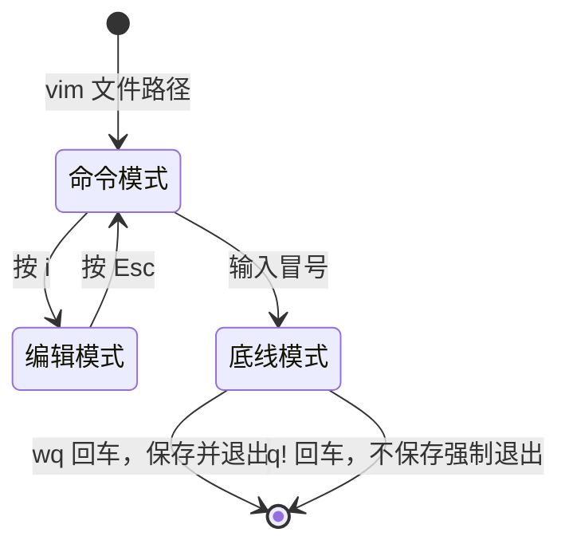

> **一句话总结**：Linux 的一切都是"目录树上的文件"，掌握 `命令 [-选项] [参数]` 这一条语法骨架，再把"定位 → 查看 → 操作 → 编辑 → 求助"五类命令记住，就能在服务器上自由行动。
> **前置知识**：无需编程基础；了解 Windows 的盘符、文件夹、快捷方式概念即可类比。
> **学完能做到**：1. 说清 Linux 目录结构与命令格式，独立在文件系统里定位任何路径；2. 用 ls/cd/mkdir/cp/mv/rm/find/grep/管道/重定向完成日常文件管理与日志分析；3. 用 vi 编辑配置文件、用 --help/man 自学任何命令、用 useradd/su/sudo 完成最小权限的账号操作。

## 1. 核心概念

### 1.1 Linux 目录结构：没有盘符，只有一棵树

Windows 是"森林结构"：有 C:、D: 等多个盘符，每棵树各自独立。
Linux 是"单根结构"：**只有一个根目录 `/`**，所有设备、分区都挂在同一棵树上。

| 目录 | 存放内容 | 记忆点 |
| --- | --- | --- |
| `/bin` | 基础命令（cd、mv、cp、ls…） | binary，普通用户可用 |
| `/sbin` | 系统管理类命令（ifconfig、reboot…） | super/user binary，多为 root 使用 |
| `/etc` | 系统与软件的配置文件 | 改配置基本都在这里，如 `/etc/hosts`、`/etc/profile` |
| `/root` | root 账号的家目录 | 超管专属 |
| `/home` | 普通账号的家目录集合 | 每个普通用户是 `/home/用户名` 一个子目录 |
| `/usr` | 用户级程序与资源（`/usr/share/fonts` 等） | 类似 Windows 的 Program Files |
| `/tmp` | 临时文件 | 重启可能被清理 |

### 1.2 命令的通用格式

```sh
command [-options] [parameter]
```

| 组成 | 含义 | 是否必写 |
| --- | --- | --- |
| `command` | 命令本体，如 `ls`、`cp` | 必写 |
| `-options` | 选项，控制行为，单字母可用 `-alh` 合并；长选项写作 `--help` | 可省略，省略即用默认行为 |
| `parameter` | 参数，通常是路径、文件名、关键字 | 可省略（有默认值时） |

名词约定：选项（option）控制"怎么干"，参数（parameter）说明"对谁干"。

### 1.3 路径与定位

| 写法 | 含义 | 示例 |
| --- | --- | --- |
| 绝对路径 | 以 `/` 开头，从根目录算起 | `cd /root/aa/bb` |
| 相对路径 | 相对"当前目录"算起 | `cd aa/bb` |
| `./` | 当前目录 | `cd ./` 等于什么都没做 |
| `../` | 上级目录；`../../` 为上上级 | `cd ../..` |
| `~` | 当前账号的家目录：root 是 `/root`，普通用户是 `/home/用户名` | `cd ~` |
| `-` | 在最近操作过的两个目录之间来回切换 | `cd -` |

> 注意：`~` 不是"`/home`"，而是"`/home/你的用户名`"（root 例外，是 `/root`）。这是新手最常见的误解。

### 1.4 命令速查表

| 命令 | 作用 | 常用选项 / 写法 |
| --- | --- | --- |
| `ls` | list，列出目录内容 | `-a` 显示隐藏文件；`-l` long 长格式；`-h` human 人性化大小；可合并为 `ls -alh`；`ll` 等价 `ls -l` |
| `pwd` | print work directory，打印当前所在目录 | 无参数 |
| `cd` | change directory，切换目录 | `cd /`、`cd ~`、`cd -` |
| `mkdir` | make directory，创建目录 | `-p` 递归创建多级目录，如 `mkdir -p aa/bb/cc` |
| `touch` | 创建空文件（或更新时间戳） | `touch 1.txt` |
| `cat` | 一次性输出文件全部内容 | 文件大时会刷屏 |
| `more` | 分页查看文件 | `b` 上一页、`d`/空格 下一页、回车 下一行、`q` 退出 |
| `cp` | copy，复制 | `-r` 递归复制目录（复制文件夹必须加） |
| `mv` | move，移动 / 重命名 | `mv 源 目标`，同目录下即为改名 |
| `rm` | remove，删除 | `-r` 递归、`-f` 强制不提示；**没有回收站** |
| `which` | 查看命令的可执行文件在哪 | `which python` |
| `find` | 按名字或大小查找文件 | `find / -name '*.txt'`、`find / -size +10M` |
| `grep` | 按关键字过滤行 | `-n` 显示行号，如 `grep -n python 1.txt` |
| `\|` | 管道：把前一个命令的输出当作后一个命令的输入 | `cat 1.txt \| grep python \| grep pandas` |
| `echo` | 输出内容到终端，类似 print | `echo hello` |
| `` ` `` | 反引号：把命令的执行结果嵌入到另一条命令里 | `echo \`pwd\`` 输出的是路径而非 "pwd" |
| `>` `>>` | 重定向：`>` 覆盖写，`>>` 追加写 | `ls / >> 1.txt` |
| `tail` | 查看文件末尾，常用于看日志 | `-n` 指定行数（默认 10）、`-f` 持续追踪；`tail -10f python.log` |
| `vi` / `vim` | 文本编辑器 | 三者模式 + `:wq` / `:q!` |
| `--help` | 查看命令帮助 | `ls --help` |
| `man` | 查看命令手册 | `man ls`、`man ls >> ls.txt` |

### 1.5 vi / vim 的三种模式

| 模式 | 进入方式 | 能做什么 |
| --- | --- | --- |
| 命令模式 | 打开文件后的默认模式；编辑模式下按 `Esc` 返回 | 移动光标、删除行、复制粘贴 |
| 编辑模式 | 命令模式下按 `i`（insert） | 正常输入文字 |
| 底线模式 | 命令模式下按 `:` | 执行保存/退出等指令：`:wq` 保存退出、`:q!` 强制退出不保存 |

最小可用流程：`vim 文件` → 按 `i` → 编辑 → 按 `Esc` → 输入 `:wq` 回车。

## 2. 可运行示例

一条主线：建目录 → 造文件 → 查内容 → 过滤 → 写日志 → 追踪 → 编辑 → 求助。以下命令可直接在 root 账号下依次执行。

```sh
# ---------- 1. 定位与创建 ----------
pwd # 查看当前目录，root 登录默认在 /root
mkdir -p aa/bb # 递归创建多级目录，不加 -p 会因 aa 不存在而报错
cd aa/bb # 相对路径进入
pwd # /root/aa/bb
cd - # 回到上一个目录 /root
cd ~ # 回到当前账号家目录

# ---------- 2. 造文件与查看 ----------
touch 1.txt 2.txt # 创建两个空文件
echo "python pandas numpy" >> 1.txt # 追加写入
echo "python mysql" >> 1.txt
echo "java hadoop" >> 2.txt
cat 1.txt # 一次性看全部内容
ls -alh # 长格式 + 隐藏文件 + 人性化大小
ll # 等价于 ls -l

# ---------- 3. 过滤与管道 ----------
grep -n python 1.txt # 只打印含 python 的行，并显示行号
cat 1.txt | grep python | grep numpy # 两级过滤：先 python，再 numpy
cat 1.txt 2.txt | wc -l # 统计总行数（wc = word count）

# ---------- 4. 查找 ----------
which python # 查看 python 命令放在哪个目录
find /root -name '*.txt' # 按文件名查找
find / -size +10M # 找大于 10MB 的文件（递归全盘，较慢）

# ---------- 5. 重定向与日志追踪 ----------
ls / >> 1.txt # 追加，不覆盖原内容
ls / > 3.txt # 覆盖写
tail -3 1.txt # 只看最后 3 行
tail -f 1.txt # 持续追踪（新写入内容会实时打印，Ctrl+C 退出）

# ---------- 6. 复制、移动、删除 ----------
cp 1.txt 1_bak.txt # 复制文件
cp -r aa aa_bak # 复制目录必须加 -r
mv 1_bak.txt 1_old.txt # 同目录下移动 = 改名
rm -rf aa_bak # 递归强制删除目录
# rm -rf /* ← 高危：删掉整个系统，任何情况下都不要执行

# ---------- 7. 编辑配置并求助 ----------
vim /etc/hosts # 按 i 输入，按 Esc，再输入 :wq 保存退出
ls --help # 快速看选项说明
man ls # 看完整手册，按 q 退出
man ls >> ls_manual.txt # 把手册存成文件慢慢看
```

预期输出片段（部分）：

```text
[root@mynode1 ~]# grep -n python 1.txt
1:python pandas numpy
2:python mysql
[root@mynode1 ~]# tail -3 1.txt
python pandas numpy
python mysql
bin
```

用户与权限的最小闭环（`sudo` 赋权）：

```sh
useradd zhangsan # 创建普通用户，默认同时创建一个同名用户组
passwd zhangsan # 为该用户设置密码
vim /etc/sudoers # 找到 root ALL=(ALL) ALL 那一行，仿写一行 zhangsan ALL=(ALL) ALL
su zhangsan # 切换用户
sudo mkdir /opt/test # 借调 root 权限执行；首次需要输入密码，之后短时间内免密
exit # 退回原用户
```

## 3. 常见坑

| 坑 | 现象 | 原因 | 正确做法 |
| --- | --- | --- | --- |
| 复制目录不加 `-r` | `cp: omitting directory 'aa'` | `cp` 默认只处理文件 | 目录一律 `cp -r 源 目标` |
| 直接 `rm -rf 目录` | 数据永久消失，无回收站 | Linux 删除不进入回收站 | 先 `ls` 确认路径，再删；生产上优先 `mv` 到临时目录 |
| 把 `-l` 记成 "line" | 理解不了它为什么输出一堆权限/大小/时间 | `-l` 是 **long**（长格式），不是 line | 记作 `ls -l` = 长格式列表 |
| 以为 `~` 就是 `/home` | `cd ~` 后 `pwd` 结果和预期不符 | `~` 是"当前用户的家目录" | root 是 `/root`，普通用户是 `/home/用户名` |
| 用 `>` 想保留原内容 | 原文件内容被清空 | `>` 是覆盖，`>>` 才是追加 | 需要保留旧内容就用 `>>` |
| `find /` 全盘搜索 | 命令卡很久 | 从根目录递归遍历所有文件 | 尽量指定范围，如 `find /root -name '*.txt'` |
| 多级目录 `mkdir` 报错 | `No such file or directory` | 上级目录不存在 | 加 `-p` 递归创建 |
| vi 里改完直接关窗口 | 内容没保存 | 没进入底线模式执行保存 | 按 `Esc` 后输入 `:wq` |
| 管道里写 `grep a | grep b` 顺序反了 | 结果为空 | 管道是逐步收窄，先宽后窄 | 先过滤大条件再过滤小条件 |

## 4. 面试问答

### Q1：`rm -rf /*` 为什么被称为"坐牢命令"？生产环境如何避免误删？

<details markdown="1"><summary markdown="1">参考答案</summary>

`rm` 是 remove，`-r` 递归删除目录及其内容，`-f` 强制删除不提示，`/*` 匹配根目录下所有文件。三者叠加等于"无提示递归删除系统全部文件"，执行后系统立即不可用，且 Linux 没有回收站，无法 undo，只能重装或从快照恢复。

生产环境的防护做法：

1. 危险命令前先 `pwd` + `ls` 确认自己所在目录和目标路径；
2. 能用精确路径就不用通配符，例如 `rm -rf /data/logs/2024-01-*` 而不是 `rm -rf /*`；
3. 重要目录用 `mv` 移到 `/tmp/trash/` 代替直接删除，保留反悔窗口；
4. 通过权限控制限制能使用 root 的人，普通账号用 `sudo` 借权并留审计日志；
5. 用快照（本章开篇讲的虚拟机快照）或备份做兜底，出问题可回滚。

</details>

### Q2：Linux 里为什么一定要区分绝对路径和相对路径？脚本里为什么推荐绝对路径？

<details markdown="1"><summary markdown="1">参考答案</summary>

绝对路径以 `/` 开头，从根目录出发；相对路径从"当前工作目录"出发，依赖 `pwd` 的结果。

风险在于：**相对路径的含义会随执行位置变化**。例如脚本里写 `cp data.csv /bak/`，在 `/home/user` 下手动执行能找到文件，但被 crontab（定时任务）或别的程序调用时，工作目录可能变成 `/` 或 `/root`，于是找不到文件而失败。所以：

- 交互操作可用相对路径，图省事；
- 脚本、定时任务、服务配置、软链接的目标路径，一律用绝对路径，保证与执行位置无关；
- 同理，软链接 `ln -s` 的源路径也建议写绝对路径，否则链接一旦被移动就会失效。

</details>

### Q3：`>` 和 `>>`、`cat` 和 `more`、`grep` 和 `find` 分别有什么区别？

<details markdown="1"><summary markdown="1">参考答案</summary>

- `>` 覆盖写入，会先清空目标文件；`>>` 追加写入，保留原内容。误用 `>` 会丢数据。
- `cat` 一次性把文件全部输出，适合小文件；`more`（或 `less`）分页显示，适合大文件，`b`/`d`/回车翻页、`q` 退出。
- `grep` 在**文件内容里**按关键字过滤出行；`find` 在**文件系统里**按文件名、大小、时间等属性查找文件。一个找"内容"，一个找"文件本身"。
- 补充：`grep` 与管道 `|` 组合是日志分析的主力，如 `cat app.log | grep -n ERROR`。

</details>

## 5. 自测题

### 1. 当前在 `/root`，要在 `/root/aa/bb/cc` 一次创建好三级目录并进入，写出命令。

<details markdown="1"><summary markdown="1">参考答案</summary>

```sh
mkdir -p aa/bb/cc # -p 递归创建多级目录
cd aa/bb/cc
```

也可以用绝对路径：`mkdir -p /root/aa/bb/cc && cd /root/aa/bb/cc`。
关键点是**必须加 `-p`**，否则上级目录不存在会直接报 `No such file or directory`。

</details>

### 2. `ls -l` 中 `-l` 是什么单词的缩写？`ls -alh` 三个选项分别是什么含义？

<details markdown="1"><summary markdown="1">参考答案</summary>

`-l` 是 **long**（长格式），不是 line。三个选项：

- `-a`：all，显示所有文件，**包括以 `.` 开头的隐藏文件**；
- `-l`：long，以长格式显示（权限、属主、属组、大小、时间、名字）；
- `-h`：human-readable，把大小从字节变成 K/M/G 便于阅读。

`ls -alh` 即"显示所有文件的详细信息、大小人性化"，是日常最常用的组合；`ll` 等价于 `ls -l`。

</details>

### 3. 从 `1.txt` 中过滤出同时包含 python 和 pandas 的行并显示行号，写出命令。

<details markdown="1"><summary markdown="1">参考答案</summary>

```sh
cat 1.txt | grep -n python | grep pandas
```

思路：管道把上一步结果当作下一步输入，逐步收窄；`grep -n` 显示行号。
等价写法（减少一次进程）：

```sh
grep -n python 1.txt | grep pandas
```

</details>

### 4. 想实时观察日志 `python.log` 的最新输出，应该用什么命令？怎么退出？

<details markdown="1"><summary markdown="1">参考答案</summary>

```sh
tail -f python.log # 默认看最后 10 行并持续追踪
tail -20f python.log # 先显示最后 20 行再持续追踪
```

`-f` = follow，文件被追加内容时会实时打印。退出用 `Ctrl + C`。

</details>

### 5. 说出 vi 打开文件后"输入文字"和"保存退出"的完整按键序列。

<details markdown="1"><summary markdown="1">参考答案</summary>



**读图要点**：

| 观察 | 含义 |
| --- | --- |
| 三个模式之间靠按键切换，不靠命令 | `i` 进编辑、`Esc` 回命令，这是 vim 最容易记错的一点 |
| 底线模式是唯一能退出的模式 | 保存退出与强制退出都从这里走，而且都要先敲一个冒号 |
| 编辑模式下敲的键都是文本 | 在编辑模式里敲 `:wq` 只会把字符写进文件，必须先按 `Esc` |
| 两条退出边终点相同 | 差别只在要不要写盘：`wq` 写盘，`q!` 丢弃修改 |
| 没有「保存」这一步 | vim 是「进入底线模式后下指令」，不存在独立的保存按钮或命令 |

记法：**i 进、Esc 出、冒号下指令**。

</details>

## 6. 延伸阅读

- [GNU Coreutils 手册（ls/cp/mv/rm/find 等命令的权威说明）](https://www.gnu.org/software/coreutils/manual/coreutils.html)
- [GNU Bash 参考手册（管道、重定向、变量与 Shell 语法）](https://www.gnu.org/software/bash/manual/bash.html)
- [Linux man-pages 项目（man 手册在线版）](https://www.kernel.org/doc/man-pages/)
- [Vim 官方文档](https://www.vim.org/docs.php)
- [The Linux Documentation Project：Introduction to Linux](https://tldp.org/LDP/intro-linux/html/index.html)

---

[⬅️ 返回数据处理目录](README.md)
