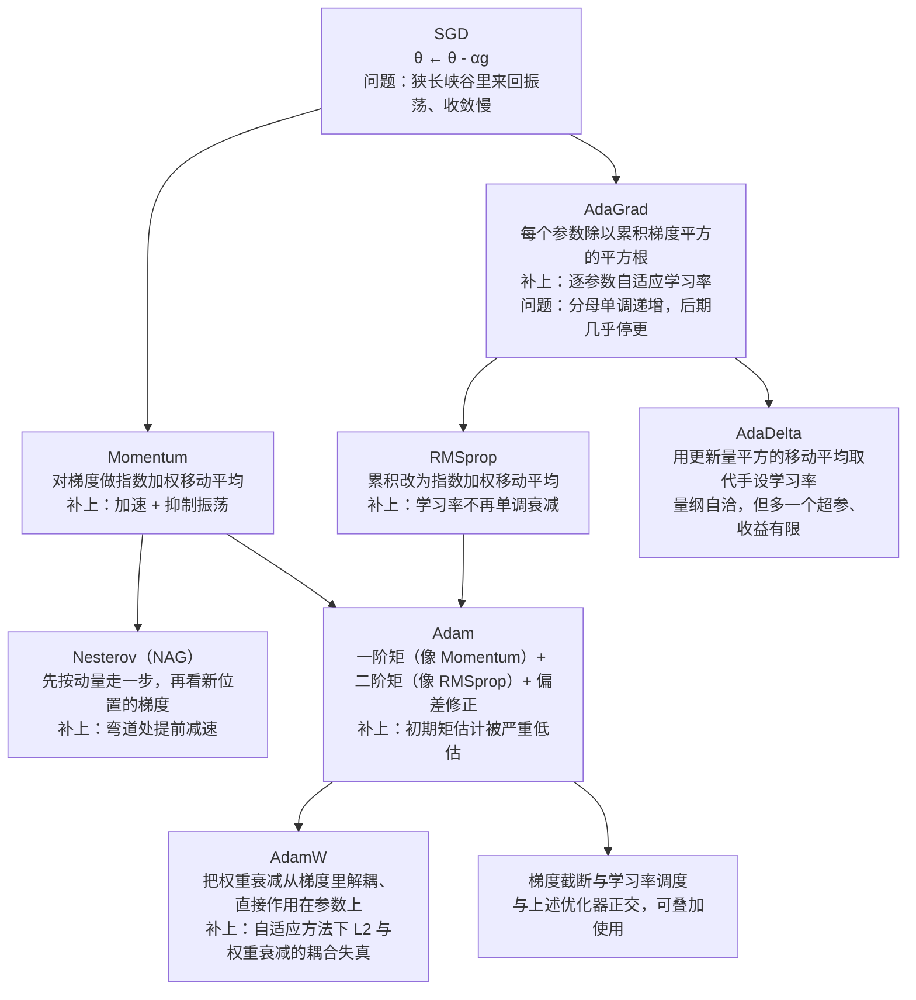

# -优化器与正则化


> **一句话总结**：深度网络优化的真正难点不是"陷进局部最小"而是"卡在鞍点"，所以要用**动量与自适应学习率**修正梯度估计、用**Xavier/He 初始化与逐层归一化**改善优化地形，最后再用 **L2/权重衰减、Dropout、提前停止、标签平滑**把解从"背下训练集"拉回到"能泛化"。
>
> **前置知识**：梯度下降与反向传播、链式法则、Hessian 矩阵与半正定、期望与方差、Softmax 与交叉熵、PyTorch 的 `nn.Module` / `optim` / `scheduler` 基本用法。
>
> **学完能做到**：1. 讲清鞍点、平坦/尖锐最小值与泛化的关系，以及高维下局部最小为何罕见；2. 手推 Momentum、Nesterov、AdaGrad、RMSprop、Adam 的更新式并解释每个超参数；3. 在 PyTorch 中正确组合初始化、BN/LN、Dropout、weight decay、梯度截断与学习率调度，并识别常见误用。

## 1. 核心思想

### 1.1 高维非凸优化的敌人是鞍点

低维非凸优化最麻烦的是**局部最小（local minima）**，掉进去就出不来。但深度网络有 $10^6\sim10^9$ 维参数，结论完全变了：驻点（stationary point，$\nabla_\theta\mathcal L=0$）要在**每一个方向上**都是极小点才算局部最小。设单方向上是极小值的概率 $p\approx0.5$、各方向近似独立，则 $P(\text{驻点是局部最小})\approx p^{\,n}$；取 $n=10^4$ 得 $0.5^{10000}\approx10^{-3010}$——这个数字没有物理意义。

因此高维空间里**几乎所有驻点都是鞍点（saddle point）**：梯度为 0，但 Hessian 特征值有正有负，某些方向是"谷底"、另一些方向是"山脊"。一阶方法在鞍点附近梯度趋零，会**长期停滞**，这才是训练卡住的常见原因。出路来自 SGD 的**噪声**：小批量梯度是无偏带噪估计，$\mathbb E[\tilde g]=g$、$\mathrm{Var}[\tilde g]=\Sigma/B$，在鞍点处 $g=0$ 而 $\tilde g\ne0$，噪声直接把参数推出去。这也解释了为什么"批量别太大、学习率别太小"在实践中往往更有益。

| 驻点类型 | 一阶条件 | 二阶条件 | 出现频率 | 一阶方法的行为 | 出路 |
| --- | --- | --- | --- | --- | --- |
| 局部最小 | $\nabla=0$ | $H\succ0$，特征值全正 | 高维下极低（$\sim p^n$） | 收敛后停滞，通常可接受 | 不必逃，往往已是好解 |
| 全局最小 | $\nabla=0$ | $H\succ0$ 且损失最低 | 一般无法验证 | 无法确认是否到达 | 实践中不追求 |
| **鞍点** | $\nabla=0$ | $H$ 不定，有正有负 | **绝大多数驻点** | 梯度趋零、**长期停滞** | SGD 噪声、动量、周期性增大学习率 |
| 平坦平台 | $\nabla\approx0$ | $H$ 近奇异 | 常见 | 下降极慢 | 归一化、换激活函数、残差连接 |

### 1.2 平坦最小值、"解等价性"与优化的四个抓手

**平坦最小值（flat minima）**指局部最小附近一整片区域损失都差不多；**尖锐最小值（sharp minima）**是个很窄的坑。落在平坦解上的模型抗参数扰动，即**鲁棒**，因此更可能泛化好；尖锐解对扰动敏感，分布稍偏就崩。这是经验规律（缺严格理论）。实验上（Keskar et al., 2016）：**批量越大越易收敛到尖锐最小值，批量越小越易收敛到平坦最小值**。另一个重要事实是**局部最小解的等价性**：过参数化大网络里绝大多数局部最小的训练损失都接近全局最小、测试性能相近，所以训练时**没必要**去找全局最小，找到了反而可能过拟合。

优化（让训练损失变小）与正则化（让测试误差变小）是一体两面：优化太狠会过拟合，正则太强会欠拟合，共同目标是期望风险最小化。改善神经网络优化的**四个抓手**：① 更好的优化算法（学习率衰减/warmup/周期性、动量、NAG、梯度截断）；② 更好的初始化与数据预处理（Xavier/He/正交；最小最大归一化、标准化、白化）；③ 修改网络结构改善**优化地形**（ReLU、残差连接、逐层归一化，让曲面更平滑、允许更大学习率）；④ 更好的超参数优化（网格/随机搜索、贝叶斯优化、逐次减半与 HyperBand、NAS）。

## 2. 算法细节

### 2.1 小批量梯度下降、批量大小与线性缩放规则

每次迭代抽 $B$ 个样本 $\mathcal B$，梯度取批内平均 $g_t=\mathfrak g(\theta_{t-1})=\frac1B\sum_{(x,y)\in\mathcal B}\partial\mathcal L(y,f(x;\theta))/\partial\theta$，更新 $\theta_t\leftarrow\theta_{t-1}-\alpha g_t$。教材区分两个量：$\mathfrak g$ 是**梯度**，$\Delta\theta_t\triangleq\theta_t-\theta_{t-1}$ 是**实际更新方向**；标准 SGD 下 $\Delta\theta_t=-\alpha g_t$，但在动量/Adam 里二者不再一致。

**批量大小的影响**：由 $\mathbb E[\tilde g]=g$、$\mathrm{Var}[\tilde g]=\Sigma/B$ 可知批量**不影响梯度期望、只影响方差**，噪声标准差 $\propto1/\sqrt B$。批量越大 → 噪声越小 → 训练越稳 → 可用更大学习率；批量小还用大学习率，噪声会把参数甩飞。**线性缩放规则（linear scaling rule）**：批量增大 $k$ 倍，学习率也增大 $k$ 倍。一个简洁推导是"每个 epoch 走过的总位移不变"——一个 epoch 有 $N/B$ 次迭代、位移量级为 $(N/B)\cdot\alpha$，令其不变即得

$$\frac{\alpha}{B}=\text{const}\ \Longrightarrow\ \alpha\propto B .$$

批量特别大时该规则失效（曲率让大步长越界），经验上改用 $\alpha\propto\sqrt B$ 并配 warmup。还要留意两点：以 epoch 为横轴比较时**小批量反而收敛更快**（一个 epoch 内更新次数更多）；有效权重衰减强度 $\alpha\lambda$ 会随 $\alpha$ 一起放大。

### 2.2 学习率调整：衰减、预热、周期性

直觉是"**先大后小**"：初期离最优点远，大学习率走得快；接近最优点时要小学习率避免来回振荡。设初始学习率 $\alpha_0$，常见衰减为：**分段常数衰减**（每经过 $t_1,t_2,\dots$ 次迭代乘 $\gamma_1,\gamma_2,\dots<1$，又称阶梯衰减）；**逆时衰减** $\alpha_t=\alpha_0/(1+kt)$（平滑、有长尾）；**指数衰减** $\alpha_t=\alpha_0k^t\ (0<k<1)$（衰减快、后期几乎不动）；**自然指数衰减** $\alpha_t=\alpha_0\exp(-kt)$；**余弦衰减** $\alpha_t=\frac12\alpha_0\big(1+\cos\frac{t\pi}{T}\big)$（前期缓降、中期快降、末期缓降，$T$ 为总迭代次数）。

**学习率预热（warmup）**：刚开始训练时参数随机初始化、梯度往往很大；若批量又大、初始学习率又大，一步就能把参数推到很糟的区域，训练不稳定甚至发散。做法是前 $t'$ 次迭代线性升温（**gradual warmup**），$\alpha_t'=\frac{t}{t'}\alpha_0\ (1\le t\le t')$，之后再切换到某种衰减策略；大 batch 与 Transformer 训练几乎必配 warmup。此外还有**周期性调整**：循环学习率（三角循环，在上下界间线性升降）与带热重启的随机梯度下降（SGDR，周期性把学习率重置为初值再余弦衰减，**参数不重置**）。周期性地增大学习率有助于逃离尖锐最小值和鞍点：短期可能损害优化，长期看能落到更好的解。

### 2.3 自适应学习率：AdaGrad / RMSprop / AdaDelta

核心思想：不同参数收敛速度差异大，给每个参数配自己的学习率。以下 $\odot$ 为逐元素乘，开方/除/加都是逐元素操作。

**AdaGrad**（累积梯度平方，借鉴 $\ell_2$ 正则化思想）取 $G_t=\sum_{\tau=1}^{t}g_\tau\odot g_\tau$，更新 $\Delta\theta_t=-\frac{\alpha}{\sqrt{G_t}+\epsilon}\odot g_t$。梯度一直很大的参数分母大、学习率被压小；很少更新的参数分母小、学习率相对大。**致命缺点**：$G_t$ 单调递增 → 有效学习率**单调递减** → 后期 $\alpha/\sqrt{G_t}\to0$，即使还没到最优点也几乎不再更新，即"提前罢工"。

**RMSprop** 把累积换成指数加权移动平均：

$$G_t=\beta G_{t-1}+(1-\beta)\,g_t\odot g_t=(1-\beta)\sum_{\tau=1}^{t}\beta^{\,t-\tau}g_\tau\odot g_\tau,\qquad \Delta\theta_t=-\frac{\alpha}{\sqrt{G_t}+\epsilon}\odot g_t ,$$

$\beta$ 一般 $0.9$、$\alpha$ 例如 $0.001$、$\epsilon$ 取 $10^{-8}$ 量级。旧梯度被指数遗忘，$G_t$ 可升可降，学习率**不再单调衰减**，修掉了 AdaGrad 的毛病。**AdaDelta** 进一步用更新量平方的移动平均取代手动设置的 $\alpha$：$\Delta x^2_{t-1}=\rho_1\Delta x^2_{t-2}+(1-\rho_1)\Delta\theta_{t-1}\odot\Delta\theta_{t-1}$，$\Delta\theta_t=-\frac{\sqrt{\Delta x^2_{t-1}+\epsilon}}{\sqrt{G_t+\epsilon}}\odot g_t$，量纲自洽、对学习率尺度不敏感，但多一个超参且实际收益有限，如今用得少。

### 2.4 梯度估计修正：动量法与 Nesterov

小批量梯度是真实梯度的带噪估计，用"最近一段时间的平均梯度"代替当前随机梯度可以显著提速。**动量法** $\Delta\theta_t=\rho\Delta\theta_{t-1}-\alpha g_t$（$\rho$ 通常 $0.9$），取 $\Delta\theta_0=0$ 展开：

$$\begin{aligned}\Delta\theta_1&=-\alpha g_1,\\ \Delta\theta_2&=\rho(-\alpha g_1)-\alpha g_2=-\alpha(\rho g_1+g_2),\\ \Delta\theta_3&=\rho\Delta\theta_2-\alpha g_3=-\alpha(\rho^2g_1+\rho g_2+g_3),\\ &\ \ \vdots\\ \Delta\theta_t&=-\alpha\sum_{\tau=1}^{t}\rho^{\,t-\tau}g_\tau .\end{aligned}$$

即对梯度做了一次系数和为 $\sum_{k=0}^{t-1}\rho^k\to\frac{1}{1-\rho}$ 的指数加权平均。两个推论：① **加速**——梯度长期同方向时（$g_\tau\equiv g$）有效步长为 $\alpha/(1-\rho)$，$\rho=0.9$ 时放大 10 倍，所以换成动量后常需把 $\alpha$ 调小；② **抑制振荡**——某方向梯度来回变号时交替项 $\sum_k\rho^k(-1)^k\to\frac{1}{1+\rho}$，幅度被压掉近一半，因此动量在狭长峡谷中沿长轴加速、沿短轴减速。

**Nesterov 加速梯度（NAG）**。动量法的更新可拆成"先按动量走到 $\hat\theta_t=\theta_{t-1}+\rho\Delta\theta_{t-1}$，再用 $\theta_{t-1}$ 处的梯度修正"：$\theta_t=\hat\theta_t-\alpha g(\theta_{t-1})$。第二步用的是**旧点**梯度，逻辑上不自然——人已经站在 $\hat\theta_t$，就该看 $\hat\theta_t$ 的梯度。改成"先看再走"：

$$\Delta\theta_t=\rho\Delta\theta_{t-1}-\alpha\,g\!\left(\theta_{t-1}+\rho\Delta\theta_{t-1}\right).$$

这就是 NAG，相当于提前"瞄一眼"前方坡度、弯道处提前减速。PyTorch 用等价的重参数化形式实现 `nesterov=True`（`buf = ρ·buf + g`，`d_p = g + ρ·buf`）；梯度变化缓慢时它与动量法一致，差异只在曲率大处体现。

### 2.5 Adam：动量 + RMSprop + 偏差修正

Adam 同时维护梯度的一阶矩（像动量）与二阶矩（像 RMSprop）：$m_t=\beta_1m_{t-1}+(1-\beta_1)g_t$，$v_t=\beta_2v_{t-1}+(1-\beta_2)g_t\odot g_t$。**偏差修正**：由 $m_0=0$ 展开得 $m_t=(1-\beta_1)\sum_{\tau\le t}\beta_1^{\,t-\tau}g_\tau$，权重之和只有 $1-\beta_1^{\,t}$ 而非 1，故梯度平稳时

$$\mathbb E[m_t]=(1-\beta_1^{\,t})\,\mathbb E[g],$$

即 $t$ 小时被严重低估（$\beta_1=0.9,t=1$ 时因子仅 $0.1$；$\beta_2=0.999$ 时二阶矩更严重，$t=1$ 的权重和只有 $0.001$）。因此

$$\hat m_t=\frac{m_t}{1-\beta_1^{\,t}},\qquad \hat v_t=\frac{v_t}{1-\beta_2^{\,t}},\qquad \Delta\theta_t=-\frac{\alpha\,\hat m_t}{\sqrt{\hat v_t}+\epsilon}.$$

一个漂亮性质：**第一步的更新幅度恰好等于 $\alpha$**——$t=1$ 时 $\hat m_1=g_1$、$\hat v_1=g_1^2$，$\hat m_1/\sqrt{\hat v_1}=\mathrm{sign}(g_1)$，于是 $\Delta\theta_1=-\alpha\,\mathrm{sign}(g_1)$。更一般地，只要梯度恒定就有 $\hat m_t\equiv g$、$\hat v_t\equiv g^2$，每步精确走 $\alpha$，这也是 Adam 对学习率尺度不敏感、却可能"步子过大"的原因。

超参数：原论文与主流框架默认 $\beta_1=0.9,\ \beta_2=0.999,\ \epsilon=10^{-8},\ \alpha=10^{-3}$。**教材 7.2.4.3 节写的是 $\beta_2=0.99$，与 Adam 原论文及 PyTorch 默认的 $0.999$ 不一致**；$0.99$ 对非平稳目标响应更快但噪声更大，复现论文结果请以 $0.999$ 为准。学习率也可衰减，如 $\alpha_t=\alpha_0/\sqrt t$；把 NAG 思想塞进 Adam 得到 Nadam。

**梯度截断（gradient clipping）**。RNN 或深网络中梯度偶尔突然爆炸，一步大更新就能把参数甩到很远的坏区域。**按值截断**逐元素限制到 $[a,b]$：$g=\max(\min(g,b),a)$；**按模截断**保持方向、只压缩长度：

$$g\leftarrow g\cdot\frac{\text{threshold}}{\|g\|_2}\quad\text{当}\ \|g\|_2>\text{threshold}.$$

实践中常用**全局范数截断**：所有参数梯度拼成一个向量算总范数，超过阈值就整体等比缩放（保持各层相对比例）。实验发现训练对阈值并不敏感，通常一个较小的阈值效果就很好，但截断必须放在 `loss.backward()` 之后、`optimizer.step` 之前。

### 2.6 统一公式与优化算法汇总

教材把所有一阶方法写成同一个模板 $\Delta\theta_t=-\frac{\alpha_t}{\sqrt{G_t}+\epsilon}M_t$，其中 $G_t=\phi(g_1,\dots,g_t)$ 是学习率缩放项、$M_t=\psi(g_1,\dots,g_t)$ 是参数更新方向：

| 类别 | 算法 | 学习率 $\alpha_t$ | $G_t$ | 更新方向 $M_t$ |
| --- | --- | --- | --- | --- |
| 固定/衰减学习率 | 小批量 SGD | 常数或衰减 | $1$（不缩放） | $g_t$ |
| 固定衰减学习率 | 分段常数 / 逆时 / （自然）指数 / 余弦衰减 | 见 2.2 | $1$ | $g_t$ |
| 周期性学习率 | 循环学习率、SGDR | 周期升降 | $1$ | $g_t$ |
| 自适应学习率 | AdaGrad | 常数 $\alpha$ | $\sum_{\tau\le t}g_\tau\odot g_\tau$ | $g_t$ |
| 自适应学习率 | RMSprop | 常数 $\alpha$ | $\beta G_{t-1}+(1-\beta)g_t\odot g_t$ | $g_t$ |
| 自适应学习率 | AdaDelta | 无初始 $\alpha$，用 $\sqrt{\Delta x^2_{t-1}+\epsilon}$ | 同 RMSprop | $g_t$ |
| 梯度估计修正 | 动量法 / Nesterov | $\alpha$ | $1$ | $\rho M_{t-1}+g_t$ ／ $\rho M_{t-1}+g(\theta_{t-1}+\rho\Delta\theta_{t-1})$ |
| 梯度估计修正 | 梯度截断 | $\alpha$ | $1$ | $\mathrm{clip}(g_t)$ |
| 综合方法 | Adam | $\alpha$（可衰减） | $\hat v_t$（带偏差修正的二阶矩） | $\hat m_t$（带偏差修正的一阶矩） |

这张图回答的是：从最朴素的 SGD 到 AdamW，每个优化器分别补上了前一个的哪个短板。



**读图要点**：

| 观察 | 含义 |
| --- | --- |
| SGD 之后有两条独立分支 | 一条修「更新方向」（动量与 Nesterov），一条修「每个参数的学习率尺度」（AdaGrad 及其后继），Adam 是两条分支的合流 |
| 动量的作用是「加速 + 抑制振荡」 | 梯度长期同方向时有效步长放大到 α/(1−ρ)，来回变号的方向幅度被压掉近一半，所以换动量后常要把 α 调小 |
| AdaGrad 的病根是分母单调递增 | 累积平方和只增不减，后期有效学习率趋零，「还没到最优点就提前罢工」；RMSprop 用指数加权移动平均修掉它 |
| Adam 真正新增的东西是偏差修正 | 一阶矩来自动量、二阶矩来自 RMSprop，`m_0=0` 造成的初期低估靠除以 1−β^t 修正，否则第一步几乎不动 |
| AdamW 修的是「L2 与权重衰减的耦合」 | 在自适应方法里 λθ 会先进入 m、v 再被逐参数缩放，正则强度失真；解耦后直接衰减参数，二者才重新等价 |

### 2.7 参数初始化

**为什么不能全零**：若 $W=0$（偏置也 0），第一遍前向时同层所有神经元输出完全相同，反向传播收到的梯度也完全相同，于是**永远保持相同**，等价于每层只有一个神经元——这叫**对称权重现象**。（偏置可以置 0，它不破坏对称性；LSTM 遗忘门偏置常初始化为 1 或 2 以增大时序梯度。）

**基于固定方差**：从 $N(0,\sigma^2)$ 或 $U[-r,r]$ 采样，由 $\mathrm{Var}[U]=r^2/3$ 得 $r=\sqrt{3\sigma^2}$。缺点是 $\sigma^2$ 与输入个数、激活函数、层数都无关：太小 → 信号逐层衰减、Sigmoid 落入近似线性区（丢掉非线性）；太大 → 净输入过大、Sigmoid 饱和、梯度消失。因此固定方差初始化一般要配逐层归一化。

**方差缩放（Xavier / Glorot）**。设第 $l$ 层净输入 $z^{(l)}=\sum_{i=1}^{n_{l-1}}w_i^{(l)}x_i^{(l-1)}$，各 $w_i,x_i$ 独立零均值，则

$$\mathrm{Var}\Big[\sum_i w_ix_i\Big]=\sum_i\mathrm{Var}[w_ix_i]=\sum_i\mathrm{Var}[w_i]\mathrm{Var}[x_i]=n_{l-1}\mathrm{Var}[w]\mathrm{Var}[x].$$

**前向**要方差不变需 $n_{l-1}\mathrm{Var}[w]=1$，即 $\mathrm{Var}[w]=1/n_{l-1}$；**反向**误差项 $\delta^{(l-1)}=(W^{(l)})^{\top}\delta^{(l)}$ 同理要求 $\mathrm{Var}[w]=1/n_l$。两者取折中得 $\mathrm{Var}[w^{(l)}]=\frac{2}{n_{l-1}+n_l}$，对应均匀分布区间半径 $\sqrt{6/(n_{l-1}+n_l)}$。推导假设激活为恒等函数，但对 Logistic/Tanh 也适用（参数与输入绝对值小时它们近似线性）；Logistic 线性区斜率约 $0.25$，故实践中常把方差再乘经验因子 $\rho$。**He / Kaiming 初始化**：ReLU 会零掉一半输出、使方差近似减半，故为补偿把方差翻倍：$\mathrm{Var}[w]=2/n_{l-1}$，均匀分布半径 $\sqrt{6/n_{l-1}}$。（高斯分布下 Xavier 的 $\sigma^2=\frac{2}{n_{l-1}+n_l}$、He 的 $\sigma^2=\frac{2}{n_{l-1}}$。）

**一个必须知道的陷阱**：PyTorch `nn.Linear` 的默认初始化是 `kaiming_uniform_(w, a=sqrt(5))`，算出来是 $U[-1/\sqrt{\text{fan\_in}},1/\sqrt{\text{fan\_in}}]$，方差只有 $\frac{1}{3n_{in}}$，即只有 He（$\frac{2}{n_{in}}$）的 $\frac16$。默认值对深层网络往往偏小，**显式指定初始化是常规操作**：

```python
nn.init.xavier_uniform_(w) # Tanh / Sigmoid
nn.init.kaiming_normal_(w, mode='fan_in', nonlinearity='relu') # ReLU 家族
nn.init.orthogonal_(w, gain=math.sqrt(2)) # RNN 循环权重
```

**正交初始化**：逐元素独立采样只在"平均意义"上保持范数，宽度不够时仍可能梯度爆炸/消失。直接要求 $W(W)^{\top}=I$ 就得到**范数保持性（norm-preserving）**：$\|\delta^{(l-1)}\|_2=\|(W^{(l)})^{\top}\delta^{(l)}\|_2=\|\delta^{(l)}\|_2$。实现两步：① 用 $N(0,1)$ 生成方阵；② 做奇异值分解，取 $U$（或 $V$）作为权重。常用于 RNN 循环权重，配 ReLU 时乘增益 $\sqrt2$。**预训练初始化**（加载大规模数据上训好的参数再 fine-tuning）同时提供好起点与正则效果，但灵活性差。

### 2.8 逐层归一化：BN 与 LN

**为什么有效**：① **更好的尺度不变性**——深层网络中前层参数一变、本层输入分布就漂移，本层参数得重新适应，这叫**内部协变量偏移（internal covariate shift）**，把每层输入拉回标准正态可让高层输入更稳定；② **更平滑的优化地形**——让多数神经元落在非饱和区，梯度更大更稳，**允许更大学习率**，收敛更快。

**批量归一化（Batch Normalization）** 的提出动机是解决内部协变量偏移，但后续研究（Santurkar et al., 2018）发现**主因是优化地形被平滑，而非真的消除了协变量偏移**——BN 甚至会放大某些层的分布变化却依然加速训练。给定小批量 $\mathcal B$（大小 $m$），对第 $l$ 层净输入 $z^{(l)}$ 的每一维取 $\boldsymbol\mu_{\mathcal B}=\frac1m\sum_{i=1}^mz^{(i)}$、$\boldsymbol\sigma^2_{\mathcal B}=\frac1m\sum_{i=1}^m(z^{(i)}-\boldsymbol\mu_{\mathcal B})\odot(z^{(i)}-\boldsymbol\mu_{\mathcal B})$，再标准化并做仿射恢复：

$$\hat z^{(l)}=\frac{z^{(l)}-\boldsymbol\mu_{\mathcal B}}{\sqrt{\boldsymbol\sigma^2_{\mathcal B}+\epsilon}}\odot\gamma+\boldsymbol\beta\ \triangleq\ \mathrm{BN}_{\gamma,\boldsymbol\beta}\big(z^{(l)}\big).$$

要点：① $\gamma,\boldsymbol\beta$ 是**可学习的**缩放/平移，没有它们把净输入强压到 0 附近会使 Sigmoid 型激活退化成近似线性、削弱表达能力；取 $\gamma=\sqrt{\sigma^2_{\mathcal B}},\boldsymbol\beta=\mu_{\mathcal B}$ 即恒等变换，说明标准归一化被包含在该参数族里。② BN 加在**仿射变换之后、激活函数之前**，因它自带平移 $\boldsymbol\beta$，前面的仿射层**不再需要偏置**（所以常写 `nn.Conv2d(..., bias=False)`）。③ $\mu_{\mathcal B},\sigma^2_{\mathcal B}$ 是净输入的**函数而非常量**，反向传播必须把它们的梯度也传过去。④ **训练用当前批统计量，推理用累积的移动平均**（PyTorch：$\text{running}\leftarrow(1-m)\text{running}+m\cdot\text{batch}$，`momentum` 默认 $0.1$）；忘记 `model.eval` 会让推理也用批统计量，结果依赖同批样本且抖动。⑤ 自带轻微正则：一个样本的预测依赖同批随机成员，模型难以"过拟合到某个特定样本"。

**层归一化（Layer Normalization）**。BN 要求批不能太小，且 RNN 这种净输入分布随时间动态变化的结构无法直接用 BN。LN 改为对**同一层所有神经元**在**单个样本内**求统计量：$\mu^{(l)}=\frac1M\sum_{i=1}^Mz_i^{(l)}$、$\sigma^{(l)2}=\frac1M\sum_{i=1}^M(z_i^{(l)}-\mu^{(l)})^2$、$\hat z^{(l)}=\frac{z^{(l)}-\mu^{(l)}}{\sqrt{\sigma^{(l)2}+\epsilon}}\odot\gamma+\boldsymbol\beta$。用矩阵语言说：小批量矩阵 $Z^{(l)}\in\mathbb R^{m\times M}$，**LN 对每一行（每个样本）归一化，BN 对每一列（每个特征维）归一化**。LN 与 batch 无关、batch size 可以取 1，天然适合 RNN/Transformer：$a_t=Wh_{t-1}+Ux_t$ 后接 $h_t=f(\mathrm{LN}_{\gamma,\beta}(a_t))$，可显著缓解沿时间累积的梯度爆炸/消失。

| 对比项 | Batch Normalization | Layer Normalization |
| --- | --- | --- |
| 归一化维度 | 跨样本，对每个特征维（矩阵的列） | 跨特征，对每个样本（矩阵的行） |
| 是否依赖批量 | 依赖，批太小统计量不准 | 不依赖，batch size = 1 也可 |
| 训练/推理是否一致 | **不一致**，需移动平均 + `eval` | 一致，无需额外统计量 |
| 适合 RNN/变长序列 | 不适合 | 适合 |
| 常见位置 | CNN 卷积层后、激活前 | RNN / Transformer 子层内 |
| 选用建议 | 批量足够大时一般更优 | 批量很小时用 LN |

**权重归一化（Weight Normalization）** 用再参数化把权重拆成"长度 × 方向"，$w_{i,:}=g_i\frac{v_i}{\|v_i\|}$（$g_i$ 标量、$v_i$ 与输入同维）；因为权重常被共享，参数量增加很少、开销小。**局部响应归一化（LRN）** 受生物侧抑制启发，用在卷积层**激活之后**，只对相邻特征映射做局部归一化且**不减均值**：$\hat x_i=x_i/(k+\alpha\sum_{j=\max(1,i-n/2)}^{\min(C,i+n/2)}x_j^2)^{\beta}$（AlexNet 用 $n=5,\alpha=10^{-4},\beta=0.75,k=2$）。它与最大汇聚的侧抑制不同：LRN 抑制**同一位置、相邻通道**，最大汇聚抑制**同一通道、相邻位置**。现代网络基本用 BN 取代了它。

### 2.9 网络正则化

**$\ell_1$ / $\ell_2$ 正则化**统一写作 $\theta^{\star}=\arg\min_\theta\frac1N\sum_{i=1}^N\mathcal L(y^{(i)},f(x^{(i)};\theta))+\lambda\Omega(\theta)$，其中 $\Omega_{\ell_1}=\sum_j|\theta_j|$、$\Omega_{\ell_2}=\sum_j\theta_j^2$。它**等价于**带约束的优化 $\min\frac1N\sum\mathcal L$ s.t. $\Omega(\theta)\le1/\lambda$：几何上 $\ell_1$ 的约束域是带尖角的菱形，最优点容易被顶到坐标轴上，因此产生**稀疏**解；$\ell_2$ 的约束域是球，只做整体收缩。（$\ell_1$ 在 0 点不可导，工程上用 $\sqrt{\theta^2+\delta}$ 近似或用次梯度。）两者折中即弹性网络。要注意在**过度参数化**的深度网络中，$\ell_1/\ell_2$ 的效果往往不如浅层模型显著。

**权重衰减与 $\ell_2$ 的关系**。权重衰减在每次更新时乘一个衰减系数 $\theta_t\leftarrow(1-w)\theta_{t-1}-\alpha g_t$；而在损失里加 $\frac\lambda2\|\theta\|^2$ 时梯度变成 $g_t+\lambda\theta_{t-1}$，朴素 SGD 更新为

$$\theta_t=\theta_{t-1}-\alpha(g_t+\lambda\theta_{t-1})=(1-\alpha\lambda)\theta_{t-1}-\alpha g_t .$$

逐项对照得 $w=\alpha\lambda$：**在（带动量的）SGD 里二者完全等价**，所以很多框架干脆用 $\ell_2$ 实现 weight decay。但在 **Adam 等自适应方法里二者不等价**：$\lambda\theta$ 会先进入 $m_t,v_t$，再被 $\sqrt{\hat v_t}$ **逐参数**缩放，有效正则强度随参数、随训练时刻变化（梯度小的参数被过度正则）。解决办法是把衰减从梯度里解耦、直接作用在参数上，即 **AdamW**：

```python
optim = torch.optim.AdamW(model.parameters(), lr=3e-3, weight_decay=1e-2) # 真·weight decay
# torch.optim.Adam(..., weight_decay=1e-2) 等价于在 loss 里加 L2（旧式，不推荐）
```

**提前停止（early stopping）**：留独立验证集，验证误差不再下降就停止，并**回滚到验证误差最好的 checkpoint**。本质是把参数限制在初始点附近的球内、限制有效容量，等价于一种隐式 $\ell_2$ 正则；实践上验证曲线常常先降后升，准则要按任务调（如"连续 $k$ 轮不提升"）。

**Dropout（丢弃法）**：训练时以概率 $p$ 随机把神经元（连同连接）置零。教材写的是"保留率"版本：设保留率 $1-p$，训练阶段 $\tilde a=\mathrm{mask}(a)=m\odot a$，$m\sim\mathrm{Bernoulli}(1-p)$，此时激活的神经元平均只有原来 $(1-p)$ 倍；推理阶段全部激活以保证输出一致，所以要**把输入乘回 $(1-p)$**。现代框架（含 PyTorch）实现的是 **inverted dropout**：训练时立刻把保留的激活**除以保留率**，推理时什么都不做：

$$\text{训练：}\ \tilde a=\frac{m\odot a}{1-p},\ m\sim\mathrm{Bernoulli}(1-p);\qquad \text{推理：}\ \tilde a=a .$$

这样训练与推理的**期望一致**（$\mathbb E[\tilde a]=a$），推理路径零开销。PyTorch 语义：`nn.Dropout(p=0.5)` 中 `p` 是**被丢弃**的概率，保留元素放大 $1/(1-p)=2$ 倍，且只在 `model.train` 时生效、`model.eval` 时自动关闭。① **集成视角**：每次丢弃相当于采出一个子网络，$n$ 个神经元可采出 $2^n$ 个子网络，它们**共享参数**、每次迭代训练一个，最终模型可近似看作指数级子网络的集成；推理用全部权重并按期望缩放，近似给出集成的平均预测（对单层线性/Softmax 单元，权重缩放恰好对应子网络预测的几何平均，其余情形是近似）。② **贝叶斯视角**：可解释为对参数 $\theta$ 做蒙特卡洛采样 $\mathbb E_{p(\theta)}[f]\approx\frac1T\sum_tf(x,\hat\theta_t)$。③ **超参数**：隐藏层保留率 $0.5$（子网络多样性最大）、**输入层保留率要接近 1**（丢输入相当于加噪声，太大信息就被毁）。④ **RNN 上**不能逐时刻独立丢弃隐状态，那会摧毁时间维记忆：做法是只对**非循环连接**丢弃，更严格的是**变分丢弃（variational dropout）**——对参数矩阵每个元素采样一次掩码，并在所有时刻复用**同一个掩码**。

**数据增强**：旋转、翻转、缩放、平移、加噪声；视觉上最有效，NLP 中相对困难（教材明确指出文本等类型上还没有太好的通用方法）。**标签平滑（label smoothing）** 用软目标代替 one-hot：$q=[0,\dots,1,\dots,0]^{\top}\to\tilde q=[\frac{\epsilon}{K-1},\dots,1-\epsilon,\dots,\frac{\epsilon}{K-1}]^{\top}$（$K$ 为类别数），交叉熵损失为 $\mathcal L=-(1-\epsilon)\log p_y-\frac{\epsilon}{K-1}\sum_{k\ne y}\log p_k$。PyTorch 的 `CrossEntropyLoss(label_smoothing=ε)` 用等价写法 $\tilde q=(1-\epsilon)q+\frac{\epsilon}{K}\mathbf 1$（$\epsilon$ 均摊到 $K$ 类而非 $K-1$ 个非目标类），两种写法在非目标类上的总概率质量都是 $\epsilon$。动机：one-hot 要求正确类 logit **远大于**其他类才能让概率趋近 1，会把权重推得越来越大；标签本身标错时过拟合更严重。加噪可避免输出过度自信，且通常不损害分类能力。

## 3. 可运行示例

### 3.1 PyTorch：同一任务上对比四种优化器 + 两个正则化开关

在同一个二维二分类任务（两轮交错半月形，噪声 0.35，800 训练 / 800 验证 / 两层 256 宽 MLP）上分别跑 SGD / Momentum / RMSprop / Adam，并对 Adam 开关 Dropout 与 weight decay。为保证可比性：固定种子、**先打散再切分**、只用训练集统计量标准化、统一余弦衰减与梯度截断。

```python
"""优化器与正则化对比。依赖 torch / numpy / matplotlib，CPU 约 2 分钟。
实测(150 epoch, torch 2.x) val_loss：SGD .2803 / Momentum .2815 / RMSprop .3150 / Adam .3163；
Adam 加 dropout=0.3 后 .2954（明显更好）；weight_decay=1e-2 几乎无变化（系数偏小，可试 1e-1）。"""
import numpy as np, torch, torch.nn as nn
import matplotlib; matplotlib.use("Agg"); import matplotlib.pyplot as plt # 无显示器也能存图

torch.manual_seed(0)
rng, n = np.random.default_rng(0), 800
t1, t2 = rng.uniform(0, np.pi, n), rng.uniform(0, np.pi, n)
X = np.concatenate([np.stack([np.cos(t1), np.sin(t1)], 1), # 上半圆
np.stack([1 - np.cos(t2), .5 - np.sin(t2)], 1)]) # 下半圆
X = torch.tensor(X + rng.normal(0, .35, X.shape), dtype=torch.float32)
Y = torch.tensor(np.concatenate([np.zeros(n), np.ones(n)]), dtype=torch.long)
p = torch.randperm(len(X), generator=torch.Generator.manual_seed(1))
X, Y = X[p], Y[p] # 必须先打散，否则切出的训练集只有一类
Xtr, Ytr, Xva, Yva = X[:800], Y[:800], X[800:], Y[800:]
mu, sd = Xtr.mean(0, keepdim=True), Xtr.std(0, keepdim=True) # 只用训练集统计量
Xtr, Xva = (Xtr - mu) / sd, (Xva - mu) / sd

class MLP(nn.Module):
    def __init__(self, p_drop=0., hidden=256):
        super.__init__
        self.f = nn.Sequential(nn.Linear(2, hidden), nn.ReLU, nn.Dropout(p_drop),
        nn.Linear(hidden, hidden), nn.ReLU, nn.Dropout(p_drop),
        nn.Linear(hidden, 2)) # 输出 logits，配 CrossEntropyLoss
        def forward(self, x):
            return self.f(x)

        LR = {"SGD": .1, "Momentum": .02, "RMSprop": .002, "Adam": .003}

        def build(name, model, wd):
            """权重衰减只作用在权重矩阵上，偏置不衰减（常规做法）。"""
            dec = [q for k, q in model.named_parameters if not k.endswith("bias")]
            nod = [q for k, q in model.named_parameters if k.endswith("bias")]
            g = [{"params": dec, "weight_decay": wd}, {"params": nod, "weight_decay": 0.}]
            if name == "SGD": return torch.optim.SGD(g, lr=LR[name])
            if name == "Momentum": return torch.optim.SGD(g, lr=LR[name], momentum=.9, nesterov=True)
            if name == "RMSprop": return torch.optim.RMSprop(g, lr=LR[name], alpha=.99) # α=平方梯度衰减率
            return torch.optim.AdamW(g, lr=LR[name], betas=(.9, .999), eps=1e-8) # AdamW=解耦权重衰减

        def run(name, p_drop=0., wd=0., epochs=150, bs=64):
            torch.manual_seed(0) # 各次运行初始化一致，对比才公平
            model, crit = MLP(p_drop), nn.CrossEntropyLoss
            opt = build(name, model, wd)
            sch = torch.optim.lr_scheduler.CosineAnnealingLR(opt, T_max=epochs)
            gen, hist = torch.Generator.manual_seed(0), {"train": [], "val": []}
            for _ in range(epochs):
                model.train # 开启 Dropout 的训练行为
                perm, tot, cnt = torch.randperm(len(Xtr), generator=gen), 0., 0
                for i in range(0, len(Xtr), bs):
                    idx = perm[i:i + bs]
                    opt.zero_grad(set_to_none=True)
                    loss = crit(model(Xtr[idx]), Ytr[idx])
                    loss.backward()
                    torch.nn.utils.clip_grad_norm_(model.parameters(), 5.) # 必须在 step 之前
                    opt.step; tot += loss.item * len(idx); cnt += len(idx)
                    sch.step
                    model.eval # 关 Dropout；BN 改用移动平均统计量
                    with torch.no_grad:
                        hist["train"].append(tot / cnt)
                        hist["val"].append(crit(model(Xva), Yva).item)
                        model.eval
                        with torch.no_grad:
                            acc = (model(Xva).argmax(1) == Yva).float.mean.item
                            return hist, acc

                        fig, ax = plt.subplots(1, 2, figsize=(12, 4.5))
                        for name in ["SGD", "Momentum", "RMSprop", "Adam"]:
                            h, acc = run(name)
                            print(f"{name:9s} val_loss={h['val'][-1]:.4f} val_acc={acc:.4f}")
                            ax[0].plot(h["val"], label=name); ax[0].plot(h["train"], ls=":", lw=1) # 点线=训练
                            for lab, p_drop, wd in [("none", 0., 0.), ("dropout .3", .3, 0.),
                            ("wd 1e-2", 0., 1e-2), ("dropout+wd", .3, 1e-2)]:
                                h, acc = run("Adam", p_drop, wd)
                                print(f"{lab:12s} val_loss={h['val'][-1]:.4f} val_acc={acc:.4f}")
                                ax[1].plot(h["val"], label=lab)
                                for a, t in zip(ax, ["optimizers", "regularization"]):
                                    a.set_xlabel("epoch"); a.set_ylabel("loss"); a.legend(fontsize=8); a.set_title(t)
                                    fig.tight_layout; fig.savefig("optimizer_regularization.png", dpi=120)
```

图里能看到两件事：左图中 **Adam/RMSprop 前期下降最快**（自适应学习率 + 动量），SGD 配余弦衰减在后期追上来且验证损失更低；右图中**加 Dropout 后验证损失明显更低**，同时训练损失变高——训练损失升高正是正则化在起作用的信号。而 `weight_decay=1e-2` 在这个规模下几乎看不出差别，说明**正则系数要跟着模型容量与数据量调**，通常在对数尺度上试 $10^{-4}\sim10^{-1}$。

### 3.2 numpy 手写 Adam：3 步数值示例

取 $\alpha=0.001,\beta_1=0.9,\beta_2=0.999,\epsilon=10^{-8}$、梯度恒为 $g=0.5$：

| $t$ | $g_t$ | $m_t$ | $v_t$ | $\hat m_t$ | $\hat v_t$ | $\Delta\theta_t$ |
| --- | --- | --- | --- | --- | --- | --- |
| 1 | 0.5 | 0.05 | $2.5\times10^{-4}$ | 0.5 | 0.25 | $-0.001$ |
| 2 | 0.5 | 0.095 | $4.9975\times10^{-4}$ | 0.5 | 0.25 | $-0.001$ |
| 3 | 0.5 | 0.1355 | $7.4925025\times10^{-4}$ | 0.5 | 0.25 | $-0.001$ |

手算第 1 步：$m_1=0.1\times0.5=0.05$，$\hat m_1=0.05/(1-0.9)=0.5$；$v_1=0.001\times0.25=2.5\times10^{-4}$，$\hat v_1=2.5\times10^{-4}/(1-0.999)=0.25$，$\sqrt{\hat v_1}=0.5$，故 $\Delta\theta_1=-0.001\times0.5/0.5=-0.001$。梯度恒定时可证 $\hat m_t\equiv g$、$\hat v_t\equiv g^2$，所以每一步都恰好走 $\alpha$——**Adam 的步长由学习率而非梯度大小决定**。

```python
import numpy as np

def adam(grads, alpha=1e-3, b1=.9, b2=.999, eps=1e-8):
    m = v = theta = 0.0 # 一阶矩 / 二阶矩 / 参数
    for t, g in enumerate(grads, start=1):
        m = b1 * m + (1 - b1) * g # 一阶矩：像动量
        v = b2 * v + (1 - b2) * g * g # 二阶矩：像 RMSprop
        m_hat, v_hat = m / (1 - b1 ** t), v / (1 - b2 ** t) # 偏差修正
        dtheta = -alpha * m_hat / (np.sqrt(v_hat) + eps)
        theta += dtheta
        print(f"t={t} g={g:<5} m={m:.6f} v={v:.3e} m_hat={m_hat:.6f} "
        f"v_hat={v_hat:.6f} dtheta={dtheta:.6f} theta={theta:.6f}")

        adam([0.5, 0.5, 0.5]) # 恒定梯度：每步恰好走 alpha，输出与上表一致
        adam([5.0, 0.05, 5.0]) # 梯度突变：更新幅度依然平稳
```

第二段里 $g$ 从 5.0 掉到 0.05，更新幅度并不同比例塌缩——因为 $g$ 同时进入 $\hat m_t$ 和 $\sqrt{\hat v_t}$，比值被"归一化"了，这就是自适应学习率的本质。对照之下纯 SGD（`theta -= 0.1 * g`）的位移完全被梯度量级主导，所以 SGD 需要小心调学习率，而 Adam 常被当作省心的默认选择。

## 4. 常见坑

| 坑 | 表现 | 原因 | 解法 |
| --- | --- | --- | --- |
| 把"局部最小"当主要敌人、忽略鞍点 | 损失长时间几乎不动，误以为要换更强的优化器 | 高维下 $p^n\to0$，绝大多数驻点是鞍点，一阶梯度在鞍点趋零 | 引入随机性（小批量、动量、周期性增大学习率）；用 ReLU/残差/归一化改善地形 |
| 大 batch 直接配大学习率 | 训练前期 loss 飞起、发散 | 线性缩放规则在批量很大时失效，初始梯度又大 | 加 warmup 线性升温；过大时改用 $\alpha\propto\sqrt B$ |
| 忘记 `model.eval` | 验证指标明显低于训练，且每次评估结果抖动 | Dropout 仍在随机丢弃，BN 仍用当前批统计量 | 评估前 `eval`、之后 `train`；注意 BN 的 running stats |
| 数据不标准化，或用验证集统计量标准化 | 收敛慢；或验证指标异常好（数据泄漏） | 尺度差异大会让梯度方向偏离最优方向；统计量泄漏 | 只用**训练集**的均值方差标准化，原样应用到验证/测试集 |
| 切分前不打散数据 | 验证准确率恰为类别比例（如 0.25），完全失效 | 数据按类别有序排列，切出的训练子集只有一类 | 先 `randperm` 打散再切分（或分层抽样） |
| 全部参数初始化为 0 | 训练损失不下降，各隐藏单元输出完全相同 | 对称权重现象，梯度相同 → 永远无法分化 | 随机初始化权重；偏置可置 0；按激活函数选 Xavier/He/正交 |
| 直接用 `nn.Linear` 默认初始化搭深层 ReLU 网络 | 深层难训、梯度偏小 | 默认 `kaiming_uniform_(a=√5)`，方差仅 He 的 $1/6$ | 显式 `kaiming_normal_(nonlinearity='relu')` 或 `xavier_uniform_` |
| 在 Adam 里指望 `weight_decay` 等同于 L2 | 正则几乎无效，或小梯度参数被过度收缩 | 自适应缩放会扭曲 $\lambda\theta$ 项，Adam 下二者不等价 | 用 `AdamW`（解耦权重衰减），且只对权重矩阵设衰减 |
| 以为 weight decay 越大越正则 | 加 `1e-2` 看不到变化，加大后又欠拟合 | 有效强度是 $\alpha\lambda$ 量级，与容量、数据量相关 | 在对数尺度搜 $10^{-4}\sim10^{-1}$，同时看训练/验证两条曲线 |
| Dropout 在输入层用大 $p$ | 训练几乎不收敛，输入信息被破坏 | 丢输入相当于把特征置零，$p$ 大则信息损失严重 | 输入层 $p$ 取很小（如 0.1）；隐藏层才用 0.5 |
| RNN 上逐时刻独立丢弃隐状态 | 长程依赖学不到，性能崩塌 | 破坏了时间维上的记忆一致性 | 只对非循环连接丢弃，或用变分丢弃（所有时刻共享同一掩码） |
| 梯度截断写在 `step` 之后 | 完全没有效果，梯度爆炸依旧 | 截断必须作用在即将用于更新的梯度上 | 顺序固定为 `loss.backward()` → `clip_grad_norm_` → `optimizer.step` |
| BN 前面的卷积忘了 `bias=False` | 多出无用的偏置参数，浪费且轻微损害性能 | BN 自带平移 $\boldsymbol\beta$，仿射偏置被完全抵消 | 紧接 BN 的 `nn.Conv2d` / `nn.Linear` 设 `bias=False` |
| 小批量（1 或 2）用 BN | 统计量噪声极大，训练不稳 | BN 用当前批均值方差估计总体统计量 | 改 LayerNorm/GroupNorm，或增大 batch、用梯度累积 |
| 学习率一直不衰减 | 后期 loss 在最优解附近来回振荡，验证指标徘徊 | 固定大步长在极小值附近必然过冲 | 余弦/分段/指数衰减，或 SGDR、`ReduceLROnPlateau` |
| 只盯训练损失调超参 | 训练损失完美，验证/测试很差 | 过参数化网络能把训练集背下来（随机标签也能拟合） | 始终以独立验证集为准；配 Dropout / 增强 / 提前停止 / 标签平滑 |

## 5. 面试问答

**Q1：为什么说深度网络优化的主要障碍是鞍点而不是局部最小？SGD 为什么能帮忙？**

<details markdown="1">
<summary markdown="1">参考答案</summary>

驻点要成为局部最小，必须在**所有** $n$ 个方向上都是极小点。设单方向概率 $p\approx0.5$ 且近似独立，概率为 $p^n$；$n=10^4$ 时约 $10^{-3010}$，实际不可能发生。所以高维空间里几乎所有驻点都是**鞍点**：$\nabla=0$ 但 Hessian 有正有负特征值，某些方向是谷底、另一些是山脊。一阶方法在鞍点附近梯度趋零、长期停滞，而这是**梯度本身**导致的，不是"陷进坑里"；二阶方法（牛顿法）理论上能用负曲率方向逃出，但 Hessian 是 $n\times n$，计算与存储都不可行。SGD/小批量带来两件事：① 批梯度是真实梯度的带噪无偏估计（$\mathbb E[\tilde g]=g$，$\mathrm{Var}=\Sigma/B$），鞍点处 $g=0$ 但 $\tilde g\ne0$，噪声直接把参数推出去；② 小批量噪声还倾向于把解推向**平坦最小值**，而平坦解鲁棒、泛化更好（Keskar et al. 发现大批量更易收敛到尖锐解）。此外动量、周期性增大学习率、以及"批量别太大"都能加速逃离鞍点。补充一点：真正该在意的往往不是"逃不逃得出局部最小"，而是"最终落到平坦还是尖锐的解"——训练损失维度上各局部最小常近似等价，差别主要在泛化。

</details>

**Q2：写出 Adam 的完整更新式并解释偏差修正为什么必要；Adam 与 SGD+Momentum 各有什么取舍？**

<details markdown="1">
<summary markdown="1">参考答案</summary>

$m_t=\beta_1m_{t-1}+(1-\beta_1)g_t$，$v_t=\beta_2v_{t-1}+(1-\beta_2)g_t\odot g_t$，$\hat m_t=\frac{m_t}{1-\beta_1^{\,t}}$，$\hat v_t=\frac{v_t}{1-\beta_2^{\,t}}$，$\Delta\theta_t=-\frac{\alpha\hat m_t}{\sqrt{\hat v_t}+\epsilon}$，默认 $\beta_1=0.9,\beta_2=0.999,\epsilon=10^{-8},\alpha=10^{-3}$（逐元素运算）。**偏差修正的必要性**：$m_0=0$，展开得 $m_t=(1-\beta_1)\sum_{\tau\le t}\beta_1^{t-\tau}g_\tau$，权重和只有 $1-\beta_1^{\,t}$（$t=1$ 时仅 $0.1$），故 $\mathbb E[m_t]=(1-\beta_1^{\,t})\mathbb E[g]$，初期被严重低估；二阶矩更严重（$\beta_2=0.999$ 时 $t=1$ 的权重和只有 $0.001$）。除以 $1-\beta^t$ 即得无偏估计。效果上 $t=1$ 时 $\hat m_1=g_1,\hat v_1=g_1^2$，于是 $\Delta\theta_1=-\alpha\,\mathrm{sign}(g_1)$；不修正的话第一步几乎不动。**取舍**：Adam 前期收敛快、对学习率尺度不敏感、对稀疏梯度友好，适合快速拿 baseline 和 Transformer 类模型；但它在某些视觉任务上最终精度不如调好的 SGD+Momentum，且"自适应 + L2"会互相干扰、需改用 AdamW，泛化上也存在争议（自适应方法可能偏向尖锐解）。SGD+Momentum 只有两个超参、行为可预测、常泛化更好，但需要仔细调学习率与衰减计划。实践建议：不确定时用 Adam/AdamW 快速迭代，追求极限精度时再切 SGD+Momentum + 余弦衰减精调。

</details>

**Q3：Batch Normalization 训练与推理的行为有何不同？它为什么有效，"减少内部协变量偏移"的解释为什么有争议？和 LN 怎么选？**

<details markdown="1">
<summary markdown="1">参考答案</summary>

**训练 vs 推理**：训练时用**当前小批量**的 $\mu_{\mathcal B},\sigma^2_{\mathcal B}$ 做标准化再做仿射变换，同时用移动平均累积全局统计量（PyTorch：$\text{running}\leftarrow(1-m)\text{running}+m\cdot\text{batch}$，$m=0.1$）；推理时不再有"批"的概念，改用累积的 running 统计量，$\gamma,\beta$ 是训练学到的固定值。因此**必须切换 `model.eval`**，否则推理结果依赖同批样本且抖动。另外 $\mu_{\mathcal B},\sigma^2_{\mathcal B}$ 是输入的非常量函数，反向传播要穿过它们。**为什么有效**：① 让各层净输入保持稳定尺度，多数神经元落在非饱和区，梯度更大更稳，从而**允许更大学习率、收敛更快**；② 使优化地形更平滑（梯度 Lipschitz 性更好）；③ 自带轻微正则（预测依赖同批随机成员）；④ 显著降低对初始化的敏感性。**争议**：原始解释是"减少内部协变量偏移（internal covariate shift）"，但 Santurkar et al. (2018) 发现即使**故意让 BN 之后的分布偏移更大**，BN 依然加速训练，而只保留 $\gamma,\beta$、去掉归一化则复现不出收益，因此主张真正原因是**平滑了优化地形**；教材也采纳了这一修正说法。**BN vs LN**：BN 跨样本、对每个特征维归一化，依赖批量大小、训练/推理行为不一致，不适合 RNN 与变长序列；LN 在单个样本内跨特征归一化，与 batch 无关（batch size 可 1）、训练推理一致，天然适合 RNN/Transformer。经验上批量足够大时 BN 更好，批量很小或用序列模型时选 LN。

</details>

## 6. 自测题

**1. 为什么批量大小增加 $k$ 倍时建议把学习率也增大 $k$ 倍？这个规则什么时候失效？**

<details markdown="1">
<summary markdown="1">参考答案</summary>

批梯度的期望与 $B$ 无关，但方差为 $\Sigma/B$、噪声标准差按 $1/\sqrt B$ 缩小，因此大批量能承受更大步长。简洁推导：保持每个 epoch 的总位移不变——$N$ 个样本、批量 $B$ 时一个 epoch 有 $N/B$ 次迭代、总位移量级为 $(N/B)\cdot\alpha$，令其不变得 $\alpha/B=\text{const}$，即 $\alpha\propto B$。**失效条件**：① 批量非常大时泰勒展开中被忽略的二阶项开始主导，大学习率一步就跨过曲率大的区域导致发散（Goyal et al. 因此必须配 warmup，并在超大 batch 时改用 $\alpha\propto\sqrt B$）；② 隐含前提是梯度平稳，若一开始梯度就很大（随机初始化），即使线性缩放也要先用 warmup 把学习率压小；③ 有效权重衰减强度 $\alpha\lambda$ 会随 $\alpha$ 一起放大，需要相应调 $\lambda$。

</details>

**2. 写出动量法的更新式并展开成加权和，解释它为什么既能加速又能抑制振荡；$\rho=0.9$ 时有效步长约是多少？**

<details markdown="1">
<summary markdown="1">参考答案</summary>

$\Delta\theta_t=\rho\Delta\theta_{t-1}-\alpha g_t$（$\Delta\theta_0=0$）。展开：$\Delta\theta_1=-\alpha g_1$；$\Delta\theta_2=\rho(-\alpha g_1)-\alpha g_2=-\alpha(\rho g_1+g_2)$；$\Delta\theta_3=-\alpha(\rho^2g_1+\rho g_2+g_3)$；归纳得 $\Delta\theta_t=-\alpha\sum_{\tau=1}^{t}\rho^{\,t-\tau}g_\tau$，即对梯度做系数和为 $\sum_{k<t}\rho^k$ 的指数加权平均。① **加速**：梯度方向长期一致的维度上系数和 $\to\frac{1}{1-\rho}$，有效步长放大到 $\alpha/(1-\rho)$，$\rho=0.9$ 时为 $10\alpha$（所以换成动量后常要适当调小 $\alpha$）。② **抑制振荡**：梯度来回变号的维度上交替级数 $\sum_k\rho^k(-1)^k\to\frac{1}{1+\rho}$，幅度被压缩，$\rho=0.9$ 时约 $0.53$ 倍。因此在狭长峡谷中动量沿长轴加速、沿短轴减速，等价于把搜索方向"拉直"。

</details>

**3. AdaGrad 和 RMSprop 的区别是什么？为什么 AdaGrad 会"提前罢工"？**

<details markdown="1">
<summary markdown="1">参考答案</summary>

AdaGrad 累积全部历史梯度平方 $G_t=\sum_{\tau\le t}g_\tau\odot g_\tau$，更新 $\Delta\theta_t=-\frac{\alpha}{\sqrt{G_t}+\epsilon}\odot g_t$；RMSprop 把累积换成指数加权移动平均 $G_t=\beta G_{t-1}+(1-\beta)g_t\odot g_t$（$\beta$ 通常 $0.9$），其余相同。AdaGrad 的 $G_t$ **单调不减**，因此每个参数的有效学习率 $\alpha/(\sqrt{G_t}+\epsilon)$ **单调递减**；几千步后 $G_t$ 累积得很大、学习率趋近 0，即使还没到最优点也几乎不再更新，这就是"提前罢工"。RMSprop 用指数衰减遗忘旧梯度，$G_t$ 可升可降、学习率不再单调衰减，从而修复该问题；代价是引入 $\beta$ 这个新超参，并失去 AdaGrad 在凸/稀疏场景下的理论保证。

</details>

**4. 为什么权重衰减在 SGD 中等价于 $\ell_2$ 正则化，在 Adam 中却不等价？该怎么处理？**

<details markdown="1">
<summary markdown="1">参考答案</summary>

损失加 $\frac\lambda2\|\theta\|^2$ 后梯度为 $g_t+\lambda\theta_{t-1}$，朴素 SGD 更新为 $\theta_t=\theta_{t-1}-\alpha(g_t+\lambda\theta_{t-1})=(1-\alpha\lambda)\theta_{t-1}-\alpha g_t$，与权重衰减式 $\theta_t=(1-w)\theta_{t-1}-\alpha g_t$ 逐项对照得 $w=\alpha\lambda$，即**完全等价**（带动量的 SGD 也等价，因为 $g+\lambda\theta$ 作为整体进入动量缓冲），所以框架里常用 $\ell_2$ 实现 weight decay。在 Adam 中，$\lambda\theta_{t-1}$ 与 $g_t$ 一起进入 $m_t,v_t$，再被 $\sqrt{\hat v_t}$ **逐参数**缩放：梯度大的参数衰减被削弱、梯度小的参数衰减被放大，有效正则强度随参数和训练时刻变化，不再是固定比例的收缩。**解法**是把衰减从梯度里解耦、直接乘在参数上，即 AdamW：$\theta_t\leftarrow(1-\alpha\lambda)\theta_{t-1}-\alpha\frac{\hat m_t}{\sqrt{\hat v_t}+\epsilon}$。工程上还常对偏置、归一化层的 $\gamma/\beta$ 不施加衰减。

</details>

**5. Dropout 的训练时缩放与推理时缩放哪种更好？PyTorch 用哪种？为什么隐藏层保留率常用 0.5？**

<details markdown="1">
<summary markdown="1">参考答案</summary>

教材描述的是**推理时缩放**（经典 dropout）：训练时 $\tilde a=m\odot a$、$m\sim\mathrm{Bernoulli}(1-p)$，激活神经元平均只剩 $(1-p)$ 倍，为让训练与推理输出期望一致，推理时要把该层输入乘回 $(1-p)$；缺点是推理多一次乘法，且忘记缩放会系统性偏移。**inverted dropout** 在训练时就除以保留率 $\tilde a=\frac{m\odot a}{1-p}$，推理时什么都不做；它的期望在训练时就已保持一致（$\mathbb E[\tilde a]=a$），推理路径零额外开销、也不容易写错。PyTorch 的 `nn.Dropout(p)` 就是 inverted dropout，`p` 是**被丢弃**的概率（保留概率 $1-p$），保留元素放大 $1/(1-p)$ 倍，只在 `model.train` 下生效，`model.eval` 时自动关闭。保留率取 $0.5$（即 $p=0.5$）时每个子网络恰好含随机一半神经元、**子网络结构多样性最大**，集成的"平均"效果最强。输入层不同：丢输入相当于给特征加噪声，$p$ 太大会直接损毁信息，所以保留率要接近 1（通常 $p\le0.2$）。RNN 上不能逐时刻独立丢弃隐状态，要用变分丢弃（所有时刻共享同一掩码）。

</details>

## 7. 延伸阅读

- 教材主页（邱锡鹏《神经网络与深度学习》）第 7 章：<https://nndl.github.io/>
- 《动手学深度学习》优化算法（SGD、Momentum、AdaGrad、RMSProp、Adam、学习率调度）：<https://zh.d2l.ai/chapter_optimization/index.html>
- 《动手学深度学习》Dropout 一节（含 inverted dropout 推导）：<https://zh.d2l.ai/chapter_multilayer-perceptrons/dropout.html>
- PyTorch `torch.optim` 文档（各优化器精确公式、默认值、weight decay 语义）：<https://pytorch.org/docs/stable/optim.html>
- PyTorch `clip_grad_norm_`：<https://pytorch.org/docs/stable/generated/torch.nn.utils.clip_grad_norm_.html>
- Adam 原论文（$\beta_2=0.999$ 的出处）：<https://arxiv.org/abs/1412.6980>
- Batch Normalization 原论文：<https://arxiv.org/abs/1502.03167>
- How Does Batch Normalization Help Optimization?（对内部协变量偏移解释的质疑）：<https://arxiv.org/abs/1805.11604>
- Layer Normalization 原论文：<https://arxiv.org/abs/1607.06450>
- Decoupled Weight Decay Regularization（AdamW）：<https://arxiv.org/abs/1711.05101>
- Dropout 原论文：<https://arxiv.org/abs/1207.0580>
- Identifying and Attacking the Saddle Point Problem（高维非凸优化中的鞍点）：<https://arxiv.org/abs/1406.2572>
- On Large-Batch Training（大批量收敛到尖锐最小值的实验）：<https://arxiv.org/abs/1609.04836>
- Accurate, Large Minibatch SGD（线性缩放规则与 warmup）：<https://arxiv.org/abs/1706.02677>
- 初始化与动量：He 初始化 <https://arxiv.org/abs/1502.01852> ｜ Xavier 初始化 <https://proceedings.mlr.press/v9/glorot10a/glorot10a.html> ｜ Nesterov 动量实验研究 <https://arxiv.org/abs/1212.0901>
- 梯度截断（RNN 梯度爆炸）：<https://arxiv.org/abs/1211.5063>

**关于范围的说明**：本篇主干（7.1 高维非凸优化的鞍点与平坦最小值、7.2 批量大小与线性缩放、五种学习率衰减与预热、AdaGrad/RMSprop/AdaDelta、动量法与 Nesterov、Adam 与梯度截断、统一公式与表 7.1、7.3 初始化与表 7.2、7.5 逐层归一化、7.7 正则化）全部来自本机 `_raw/nn_book.txt` 第 504–609 行（PDF 第 168–188 页），含公式 (7.1)–(7.73)。以下几处超出本机，来自公开教材与官方文档，文内已标注或修正：① **AdamW 与"解耦权重衰减"的具体做法**（教材只指出 Adam 下二者不等价，做法来自 Loshchilov & Hutter 2019）；② **$\beta_2$ 默认值**——教材写 $0.99$，与原论文及 PyTorch 默认的 $0.999$ 不符，本篇按后者并明确指出差异；③ **PyTorch 默认初始化 `kaiming_uniform_(a=√5)` 的方差只有 He 的 $1/6$**（来自 PyTorch 源码与文档，教材未涉及）；④ **inverted dropout 的实现细节**（教材给的是经典的在测试阶段缩放的版本，来自《动手学深度学习》与 PyTorch 文档）；⑤ **BN 的两处工程细节**——running 统计量系数 $0.1$、紧接 BN 的卷积应设 `bias=False`（来自 PyTorch 文档与 d2l）；⑥ **Xavier/He 均匀分布下界的显式取值**（教材表 7.2 只给了部分数值，本篇按方差公式补齐）；⑦ 第 3 节全部代码与数值表格为本篇自行编写，并在本机（Python 3.13 / torch 2.11 CPU）**实际运行验证**，教材中不含可运行代码。

---

[⬅️ 返回本目录索引](README.md)
