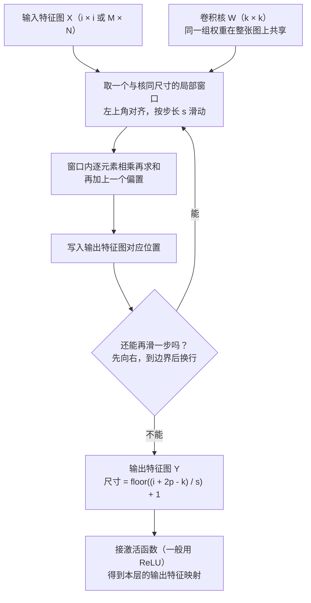

# -CNN卷积神经网络


> **一句话总结**：卷积神经网络用「局部连接 + 权重共享」把图像处理从"每个像素一条独立权重"变成"一个卷积核在整张图上滑动"，参数量与图像大小解耦，同时天然获得平移等局部不变性。
>
> **前置知识**：全连接前馈网络与反向传播（第 4 章）、梯度下降与 ReLU、张量的维度概念（NCHW）、numpy/PyTorch 基础张量操作。
>
> **学完能做到**：1. 手推一维/二维卷积的定义式，并说清卷积与互相关（cross-correlation）只差一次 180° 旋转，以及为什么框架实现的是互相关。 2. 独立写出输出尺寸公式 $o=\lfloor (i+2p-k)/s\rfloor+1$，并对任意卷积层算出参数量 $K\times K\times D\times D'+D'$。 3. 用 PyTorch 搭出含卷积层与汇聚层的小 CNN，跑通一个 batch 的 forward，并手工校验输出形状与参数量。

## 1. 核心思想

### 1.1 全连接网络处理图像的两个致命问题

教材第 5 章开篇给出的两个问题，是理解 CNN 全部设计动机的起点：

1. **参数太多**：输入图像 $100\times100\times3$（高 × 宽 × RGB 通道），若第一个隐藏层用全连接，则每个隐藏层神经元都要连到全部 $100\times100\times3=30000$ 个输入，即 30000 个互相独立的权重参数。隐藏层神经元一多，参数量爆炸，训练效率极低且极易过拟合。
2. **局部不变性特征难以提取**：自然图像中的物体具有尺度缩放、平移、旋转不变性——把猫从左上角挪到右下角，语义不变。全连接网络把每个像素当作一个独立维度，等价于假设"位置即身份"，很难学到这种不变性，只能靠**数据增强**（data augmentation）把各种平移/缩放后的样本喂进去硬扛。

两个问题的根源相同：**全连接层把图像的二维空间结构拍平了，并且对每个位置都配一套独立参数**。CNN 反过来利用图像的局部性与平移性——一个特征（比如边缘）在图像任何位置都以相同方式出现，所以可以用同一组权重（卷积核）扫过整张图。

### 1.2 感受野（receptive field）的生物学来源

CNN 的直接灵感来自神经科学。1959 年 David Hubel 与 Torsten Wiesel 在猫的初级视觉皮层（primary visual cortex）发现两类细胞，二人因此获得 1981 年诺贝尔生理学或医学奖：

| 细胞类型 | 感受野形态 | 响应特性 | 对应网络部件 |
| --- | --- | --- | --- |
| 简单细胞（simple cell）| 狭长型 | 只对感受野中**特定角度（orientation）**的光带敏感 | 卷积层：检测某个方向的边缘 |
| 复杂细胞（complex cell）| 更大 | 对感受野中**以特定方向移动**的某种角度的光带敏感 | 汇聚层：对位置做聚合，容忍小位移 |

**感受野**指"只有这个区域内的刺激才能激活该神经元"。它带来两个结构性结论：神经元的输入本来就只来自一个局部窗口（→ 局部连接）；同一类刺激在视野各处出现应由同类细胞处理（→ 权重共享）。受此启发，福岛邦彦 1980 年提出带卷积与子采样操作的新知机（Neocognitron），但当时没有反向传播，只能用无监督方式训练；LeCun 1989 年把反向传播引入卷积网络，1998 年的 LeNet-5 成为第一个真正成功的 CNN。

### 1.3 三种视角看同一个操作

| 视角 | 说法 | 得到什么 |
| --- | --- | --- |
| 信号处理 | 卷积 = 输入信号与滤波器的**延迟累积** | 滤波器即"系统冲激响应"，不同核提取不同频段 |
| 神经科学 | 卷积核 = 一个感受野上的**特征检测器** | 边缘、角点、纹理等局部特征 |
| 网络结构 | 卷积层 = **局部连接** + **权重共享** 的全连接层 | 参数从 $n_l n_{l-1}$ 降到 $n_l K$ |

理解 CNN 的关键，是随时能在"滑窗点积"和"带约束的全连接层"两种语言之间切换。

## 2. 算法细节

### 2.1 一维卷积：延迟累积的直觉

假设一个信号发生器每个时刻产生信号 $x_t$，信息的衰减率为 $w_k$（即经过 $k-1$ 个时间步后信息只剩原来的 $w_k$ 倍）。教材举的例子是 $w_1=1,\ w_2=1/2,\ w_3=1/4$，那么 $t$ 时刻收到的信号是当前时刻产生信息与以往延迟信息的叠加：

$$y_t = 1\cdot x_t + \frac{1}{2}x_{t-1} + \frac{1}{4}x_{t-2} = w_1 x_t + w_2 x_{t-1} + w_3 x_{t-2} = \sum_{k=1}^{3} w_k x_{t-k+1}.$$

这就是**一维离散卷积**的定义（输出下标从 $K$ 开始）：$y_t = \sum_{k=1}^{K} w_k\, x_{t-k+1}$，其中 $t = K, K+1, \dots, n$。把 $w_1,w_2,\dots,w_K$ 称为**滤波器（filter）**或**卷积核（convolution kernel）**，记 $\boldsymbol{y}=\boldsymbol{w}*\boldsymbol{x}$，一般 $K \ll n$。

**两个必须会手算的算例。** 取输入信号 $x = [2, 4, 6, 8, 10]$（$n=5$）。

- **低通 / 均值滤波**：$\boldsymbol{w}=[\tfrac13,\tfrac13,\tfrac13]$（即移动平均 MA，窗口大小 $K$）。计算得 $y_3 = \tfrac13(2+4+6)=4$，$y_4=\tfrac13(4+6+8)=6$，$y_5=\tfrac13(6+8+10)=8$。输入是稳定上升的斜坡，输出仍是同样的斜坡但被"抹平"了；若输入带随机抖动，抖动会被平均掉——这就是**检测低频信息**（信号变化不剧烈）。当滤波器取 $[1/n,\cdots,1/n]$ 时，卷积就是窗口大小为 $n$ 的简单移动平均。
- **高通 / 二阶微分**：$\boldsymbol{w}=[1,-2,1]$，输出 $y_t = x_t - 2x_{t-1} + x_{t-2}$。代入得 $y_3 = 6-2\times4+2 = 0$，$y_4 = 8-2\times6+4=0$，$y_5 = 10-2\times8+6=0$：线性斜坡上输出全 0。若把 $x_5$ 改成 20，则 $y_5 = 20-16+6=10 \neq 0$，突变被放大。**为什么是二阶微分**：令 $f(t)=x_t$ 看作关于时间的函数，则 $f''(t)\approx[f(t+1)-f(t)]-[f(t)-f(t-1)]=f(t+1)-2f(t)+f(t-1)$，与 $[1,-2,1]$ 的卷积式完全一致（教材公式 (5.6) 与习题 5-1）。因此它近似二阶微分算子，**检测高频信息**（信号变化剧烈，如边缘、突变）。

> 注意下标方向：教材的卷积式是 $x_{t-k+1}$（随 $k$ 增大取更早的样本），而 PyTorch 的 `Conv1d` 做的是 $x_{t+k-1}$。这不是错误，而是"真卷积"与"互相关"的区别，见 2.2。

### 2.2 二维卷积与互相关

给定图像 $X\in\mathbb{R}^{M\times N}$ 与卷积核 $W\in\mathbb{R}^{m\times n}$（一般 $m\ll M,\ n\ll N$），**二维卷积**为 $y_{ij} = \sum_{u=1}^{m}\sum_{v=1}^{n} w_{uv} x_{i-u+1,\, j-v+1}$，而**互相关（cross-correlation）**为 $y_{ij} = \sum_{u=1}^{m}\sum_{v=1}^{n} w_{uv} x_{i+u-1,\, j+v-1} = (\boldsymbol{W}\otimes \boldsymbol{X})_{ij}$。两者只差一次 180° 旋转：

$$\boldsymbol{Y} = \boldsymbol{W}\otimes \boldsymbol{X} = \mathrm{rot180}(\boldsymbol{W}) * \boldsymbol{X},$$

其中 $\mathrm{rot180}(\cdot)$ 表示上下、左右同时颠倒（即旋转 180°）。教材用 $\otimes$ 表示**不翻转卷积（互相关）**，用 $*$ 表示真正的翻转卷积。

**为什么框架实现互相关？** 因为卷积核是**可学习的参数**。"用 $W$ 做真卷积"与"用 $\mathrm{rot180}(W)$ 做互相关"得到完全相同的结果；既然 $W$ 的取值由训练决定，网络完全可以自己学出一个"已经翻转过"的核来等价替代。所以翻转与否**不改变模型能力**，只影响权重矩阵里参数的下标顺序。省掉翻转就省掉一次访存与拷贝，因此 PyTorch/TensorFlow 的 `conv2d` 全部是互相关。教材据此约定：**除非特别声明，本书的"卷积"都指互相关，符号记作 $\otimes$**。

这张图回答的是：卷积核在一张输入特征图上「怎么滑、每一步算什么、结果写到哪里」，以及输出尺寸是谁决定的。



**读图要点**：

| 观察 | 含义 |
| --- | --- |
| 卷积核在整张图上共享同一组权重 | 一个核就是一个特征检测器，要提取 D′ 种特征就得用 D′ 个核，而参数量与图像大小无关 |
| 每次只取一个与核同尺寸的局部窗口 | 这就是局部连接：连接数从 n_l × n_(l−1) 降到 n_l × K |
| 输出尺寸由 i、k、s、p 共同决定 | 公式必须取整，滑不完的剩余部分直接丢弃，这是「卷积后尺寸对不上」最常见的来源 |
| 多通道时输出通道必须看完全部输入通道 | 跨通道信息在求和这一步融合，因此第 p 个输出特征图的参数量是 k × k × D + 1 |
| 前向是互相关、反向要翻转 | 对输入的梯度需要对误差项做宽卷积并把核旋转 180°，这正是转置卷积的出发点 |

### 2.3 stride、zero padding 与输出尺寸

- **步长（stride）** $s$：卷积核滑动的时间间隔，$s=2$ 即隔一个位置滑一次，起下采样作用；$s<1$（微步卷积）见 2.8。
- **零填充（zero padding）** $p$：在输入两端各补 $p$ 个 0，用于控制输出尺寸、保住边缘信息。

设输入长度/边长 $i$、卷积核大小 $k$、步长 $s$、两端各补 $p$ 个零，则输出长度 $o = \lfloor (i + 2p - k)/s \rfloor + 1$。教材把该式写成 $(n-k+2p)/s+1$ 并强调"通常可以通过选择合适的卷积大小与步长使它是整数"。**工程上必须取整**：当 $(i+2p-k)$ 不能被 $s$ 整除时，不能滑到最后、剩余部分直接丢弃，所以框架内部向下取整（floor）。实际推算时用 `(i + 2*p - k)//s + 1`，高维情形对每个空间维度分别计算。常用三种变种（均取 $s=1$）：

| 名称 | 零填充 $p$ | 输出长度 | 特点 | 典型场景 |
| --- | --- | --- | --- | --- |
| 窄卷积（Narrow / Valid）| $0$ | $n-k+1$ | 输出变小，边缘信息被覆盖次数少 | 早期文献默认 |
| 宽卷积（Wide / Full）| $k-1$ | $n+k-1$ | 输出变大，常用于理论推导（交换性、求导）| 反向传播推导 |
| 等宽卷积（Equal-Width / Same）| $(k-1)/2$ | $n$ | 输出与输入同长，$k$ 一般取奇数 | 现代文献默认 |

以 $n=5,\ k=3$ 为例：窄卷积输出 $3$，等宽卷积 $p=1$ 输出 $5$，宽卷积 $p=2$ 输出 $7$。**约定俗成的坑**：早期文献默认窄卷积，现在默认等宽卷积；读到"卷积不改变尺寸"时先确认对方用的是哪种定义。

### 2.4 卷积的数学性质（与反向传播的关系）

**（1）宽卷积的交换性。** 对图像 $X$ 两端各补 $m-1$、$n-1$ 个零得到全填充（full padding）的 $\tilde{X}$，定义宽卷积 $\tilde{\boldsymbol{W}} \otimes \boldsymbol{X} \triangleq \boldsymbol{W}\otimes \tilde{\boldsymbol{X}}$，则当两个信号长度固定时宽卷积具有交换性：$\mathrm{rot180}(W)\ \tilde{\otimes}\ X = \mathrm{rot180}(X)\ \tilde{\otimes}\ W$（教材习题 5-2）。

**（2）梯度形式。** 设 $Y = W \otimes X$，$\mathcal{L}(\cdot)$ 为标量函数，教材公式 (5.14)–(5.21) 给出两条形状与含义都不同的式子：

$$\frac{\partial \mathcal{L}}{\partial W}=\frac{\partial \mathcal{L}}{\partial Y}\otimes X,\qquad \frac{\partial \mathcal{L}}{\partial X}=\mathrm{rot180}\left(\frac{\partial \mathcal{L}}{\partial Y}\right)\ \tilde{\otimes}\ W .$$

两条式子含义完全不同，这是卷积层反向传播最容易记错的地方：

- **对权重的梯度是互相关**：$\partial\mathcal{L}/\partial W$ 由"误差项 $\partial\mathcal{L}/\partial Y$ 与输入 $X$ 做互相关"得到，形状回落到 $m\times n$。直观理解：$Y$ 关于 $W$ 是线性的，$\partial Y_{ij}/\partial w_{uv}$ 就是那个被扫到的输入像素 $x_{i+u-1,j+v-1}$，把所有位置累加即互相关。
- **对输入的梯度必须是真卷积**：$\partial\mathcal{L}/\partial X$ 形状要还原成输入尺寸，需要对误差项做**宽卷积**（等价于对 $X$ 做 $p=(m-1,n-1)$ 的零填充后再互相关），并把核旋转 180°。这就是"前向是互相关、反向要翻转"的由来。

在 PyTorch 里你不需要手写这些：`loss.backward()` 会自动按上式算，但你必须知道"卷积层的前向计算与反向传播在形式上互为转置"（习题 5-7）——这正是转置卷积（2.8）的出发点。

### 2.5 用卷积代替全连接：局部连接 + 权重共享

全连接情形下，第 $l$ 层 $n_l$ 个神经元、第 $l-1$ 层 $n_{l-1}$ 个神经元，连接边数 $n_l\times n_{l-1}$，权重矩阵就有 $n_l n_{l-1}$ 个参数。改成卷积：$z^{(l)} = w^{(l)} \otimes a^{(l-1)} + b^{(l)}$，其中卷积核 $w^{(l)}\in\mathbb{R}^{K}$ 是可学习权重向量，$b^{(l)}\in\mathbb{R}$ 是可学习偏置。由此得到卷积层的两个核心性质：

| 性质 | 含义 | 效果 |
| --- | --- | --- |
| **局部连接（local connectivity）** | 每个神经元只与上一层某个局部窗口内的神经元相连 | 连接数从 $n_l\times n_{l-1}$ 降到 $n_l\times K$（$K$ 为核大小） |
| **权重共享（weight sharing）** | 同一个卷积核对第 $l$ 层所有神经元都是同一组参数 | 参数只有 $K+1$ 个，**与神经元数量无关** |

**为什么权重共享等价于"一个卷积核只捕捉一种局部特征"？** 因为整张图上每个位置都在用同一把"尺子"去匹配同一类模式。若一个核学到了"左上到右下的暗-亮过渡"，它在图像任何位置都会对同类过渡产生最大响应。所以**一个核 = 一个特征检测器**；要提取 $D'$ 种不同特征，就必须用 $D'$ 个不同的核（如果只用多组权重但不共享，就退回全连接的参数量）。多核也是逐层抽象的前提：底层核学边缘与颜色，中层组合成纹理与局部形状，高层组合成物体部件。此时第 $l$ 层神经元个数也不再自由，而是由卷积决定：默认 $s=1$、无零填充时 $n_l = n_{l-1}-K+1$。

### 2.6 卷积层的三维结构

图像是二维的，因此把神经元组织成"高 × 宽 × 深度"的三维张量，深度即**特征映射（feature map）**的个数。设输入特征映射组 $\boldsymbol{X}\in\mathbb{R}^{H\times W\times D}$（切片 $X^d\in\mathbb{R}^{H\times W}$，$1\le d\le D$）、输出 $\boldsymbol{Y}\in\mathbb{R}^{H'\times W'\times D'}$（切片 $Y^p$，$1\le p\le D'$）、卷积核 $\boldsymbol{W}\in\mathbb{R}^{K\times K\times D\times D'}$（切片 $W^{p,d}\in\mathbb{R}^{K\times K}$），则

$$Z^p = W^p \otimes \boldsymbol{X} + b^p = \sum_{d=1}^{D} W^{p,d}\otimes X^{d} + b^p,\qquad Y^p = f(Z^p),$$

其中 $f(\cdot)$ 为非线性激活函数，**一般用 ReLU**（左饱和、正区间导数恒为 1，缓解梯度消失，且计算只需加乘与比较）。核心语义：**输出通道 $p$ 必须看完所有输入通道 $d$ 才能算出**——跨通道信息在这里融合；同一个 $p$ 在所有空间位置共享 $W^{p,\cdot}$。每个输出特征映射需要 $D$ 个 $K\times K$ 卷积核加 1 个偏置，共 $D'$ 个输出映射，因此

$$\#\text{params} = K\times K\times D\times D' + D' = (K^2 D + 1)\,D' .$$

| 层 | 输入 | 核 | 输出 | 参数量计算 | 参数量 |
| --- | --- | --- | --- | --- | --- |
| LeNet-5 C1 | $32\times32\times1$ | $5\times5$，6 个 | $28\times28\times6$ | $5\cdot5\cdot1\cdot6+6$ | 156 |
| AlexNet conv1（单卡口径）| $224\times224\times3$ | $11\times11$，64 个 | $55\times55\times64$ | $11\cdot11\cdot3\cdot64+64$ | 23,296 |
| 教材口径：两个 $11\times11\times3\times48$ | $224\times224\times3$ | $11\times11$，$48\times2=96$ 个 | $2\times(55\times55\times48)$ | $11\cdot11\cdot3\cdot96+96$ | 34,944 |
| VGG16 首个卷积层 | $224\times224\times3$ | $3\times3$，64 个 | $224\times224\times64$ | $3\cdot3\cdot3\cdot64+64$ | 1,792 |
| $1\times1$ 降维：$256\to64$ | $100\times100\times256$ | $1\times1$，64 个 | $100\times100\times64$ | $1\cdot1\cdot256\cdot64+64$ | 16,448 |

对照 LeNet-5 的**连接数** $156\times784=122304$（教材数据），而参数量只有 156——这正是权重共享的威力：连接多、参数少。再对照 AlexNet 的三个全连接层：$4096\times(256\cdot6\cdot6+1)\approx 37.7\text{M}$ 个参数，**一个全连接层就比前面所有卷积层加起来还多几十倍**，这也解释了为什么现代网络趋势是减少全连接层、趋向全卷积网络（FCN）。

**感受野的成长**：$s=1$ 的 $L$ 层 $K\times K$ 卷积堆叠后，单个输出神经元的感受野为 $1+L(K-1)$。三层 $3\times3$ 的感受野是 $7\times7$，与一层 $7\times7$ 相当，但参数量 $3\cdot(3^2D^2)=27D^2$ 远小于 $49D^2$，且多了两次非线性——这就是 VGG 全面使用 $3\times3$ 堆叠的理由。

### 2.7 汇聚层（pooling layer）

卷积层虽然显著减少了**连接数**，但特征映射中的**神经元个数并没有显著减少**（等宽卷积输出尺寸不变）；若后面直接接分类器，输入维数依然很高，容易过拟合。因此在卷积层之后加**汇聚层**（也叫子采样层，subsampling layer）做下采样。把每个输入特征映射 $X^d\in\mathbb{R}^{H\times W}$ 划分为若干区域 $\mathcal{R}_{i,j}$（可重叠可不重叠），对每个区域下采样得到一个概括值：

$$Y^p_{i,j} = \max_{t\in \mathcal{R}_{i,j}} x_t \ \text{(最大汇聚)},\qquad Y^p_{i,j} = \frac{1}{|\mathcal{R}_{i,j}|}\sum_{t\in \mathcal{R}_{i,j}} x_t \ \text{(平均汇聚)} .$$

典型配置是把每个特征映射划分成 $2\times2$ 的**不重叠**区域做最大汇聚，即 `kernel_size=2, stride=2`。汇聚层可以看作一个特殊的卷积层：卷积核大小 $=k\times k$、步长 $=k\times k$、核函数是 max 或 mean。

| 作用 | 机理 |
| --- | --- |
| 特征选择、降低特征数量 | 每个区域只保留一个代表值，输出面积缩小到 $1/k^2$ |
| 减少参数、缓解过拟合 | 后续层的输入维数显著降低 |
| 一定程度的平移/局部形变不变性 | 区域内小位移不改变 max 的取值 |
| 增大后续单元的感受野 | 下采样后同样大小的核覆盖原图更大范围 |

**与增大步长的替代关系**：想降低特征维数，也可以直接让卷积的 stride $>1$（无参数的降采样）。目前主流网络中层数越来越深、卷积核越来越小（$1\times1$、$3\times3$），汇聚层的比例正在下降，结构趋向全卷积网络；DCGAN 等工作甚至明确提出"用带步长卷积替代汇聚层，以免损失信息"。最后注意：**汇聚层没有可学习参数**（只有形状超参数）；早期 LeNet-5 在汇聚层用 $Y' = f(w\cdot \text{pool} + b)$ 这种带可学习标量的形式，属于历史做法。

### 2.8 其他卷积方式

**空洞卷积（atrous / dilated convolution）**：想增大输出单元感受野，通常有三种办法——增大核、增加层数、先做汇聚；前两种增加参数量，第三种丢失信息。空洞卷积给出第四种：在卷积核每两个元素之间插入 $r-1$ 个"空洞"，使有效核大小为

$$K' = K + (K-1)(r-1),$$

其中 $r$ 为**膨胀率（dilation rate）**，$r=1$ 退化为普通卷积。参数量**完全不变**（还是 $K\times K$），感受野变成 $K'$：如 $K=3$ 时 $r=1\to K'=3$、$r=2\to K'=5$、$r=3\to K'=7$。代价是采样稀疏、可能产生网格化伪影（gridding），实践中常用叠加不同 $r$ 的方式（如 $1,2,5$）覆盖连续感受野；若要求等宽卷积，需要 $p=(K-1)r/2$（教材习题 5-8）。

**转置卷积（transposed convolution）**：卷积把高维映射到低维（$5$ 维输入、核大小 $3$ → $3$ 维输出），其仿射形式为 $y = Cx$，$C$ 是一个由卷积核元素构成的稀疏矩阵；低维到高维的反向映射用转置矩阵 $x = C^{\top}y$，对应 $x = \mathrm{rot180}(W)\ \tilde{\otimes}\ y$。它**不是卷积的逆运算**，两者只是形式上的转置关系（正如全连接层的前向与反向传播互为转置），所以"反卷积（deconvolution）"这个旧称并不恰当。当卷积 stride $s>1$ 时，其转置卷积的 stride 相当于 $1/s$（在输入元素间插入 $s-1$ 个 0 实现），称**微步卷积（fractionally-strided convolution）**，用于生成模型（如第 13.3.4 节 DCGAN 的生成网络）与语义分割的上采样。

### 2.9 典型卷积网络演进

| 网络 (年份) | 关键贡献 | 结构要点 | 解决的问题 |
| --- | --- | --- | --- |
| Neocognitron (1980) | 卷积 + 子采样雏形 | 无 BP，无监督训练 | 验证感受野启发可行 |
| LeNet-5 (1998) | 第一个成功 CNN，用于手写数字/支票识别 | 7 层：C1(6@5×5)–S2(平均汇聚)–C3(连接表,16@5×5)–S4–C5–F6(84)–RBF 输出（10 类）| BP + 卷积端到端训练 |
| AlexNet (2012) | 第一个现代深度 CNN，ImageNet 冠军 | 5 卷积 + 3 汇聚 + 3 全连接；**ReLU、Dropout、数据增强、GPU 并行**、LRN | 深度网络的过拟合与训练效率 |
| VGG (2014) | 全部用 $3\times3$ 小核堆叠 | 3 层 $3\times3$ ≈ 1 层 $7\times7$ 的感受野，参数更少、非线性更多 | 更深的统一结构设计 |
| NiN / Inception v1 (GoogLeNet, 2014) | $1\times1$ 卷积降维、多尺度并行 | 模块内并行 $1\times1/3\times3/5\times5$ + $3\times3$ max 汇聚，深度方向拼接；计算前先用 $1\times1$ 压低深度 | 核大小难选、计算量过大 |
| Inception v3 (2016) | 小核替换大核 | 两层 $3\times3$ 替换 $5\times5$；$n\times1$ 与 $1\times n$ 替换 $n\times n$；标签平滑 + BN | 保持感受野的同时减少计算与参数 |
| ResNet (2015) | 直连边（shortcut / residual connection）| 残差单元 = 若干等宽卷积 + 跨层直连边，输出经 ReLU | **深层退化问题** |

**ResNet 的推导（教材公式 (5.41)）。** 假设期望某个非线性单元 $f(x;\theta)$ 逼近目标函数 $h(x)$，把目标拆成恒等函数 + 残差函数：

$$h(x) = \underbrace{x}_{\text{恒等函数}} + \underbrace{\big(h(x)-x\big)}_{\text{残差函数}} .$$

根据通用近似定理，$f$ 逼近 $h(x)$ 或逼近 $h(x)-x$ 的能力都足够，但**实际中后者更容易学**。于是把优化目标改成让 $f(x;\theta)$ 去拟合残差 $h(x)-x$，再用 $f(x;\theta)+x$ 逼近 $h(x)$——网络只需要学"相对于恒等映射还差多少"。为什么能缓解退化/梯度消失：前向路径上存在一条恒等直连，反向传播时梯度可以沿这条 $+x$ 支路**无衰减地直接回传**到浅层，不必每层都乘一次 Jacobian（对照第 4.6.2 节，Sigmoid 型导数 $\le 0.25$，误差每传一层就衰减一次）。此外残差连接把优化地形变得更平滑。类似思想还有 Highway Network；LSTM 的门控线性连接、Transformer 的 Add & Norm 也属于同一类"线性捷径"。

## 3. 可运行示例

下面用 PyTorch 搭一个小 CNN，处理一个 batch 的 $32\times32$ 彩色图，并**在代码里按公式手工校验每一步的输出尺寸与参数量**。

```python
import torch
import torch.nn as nn

torch.manual_seed(0)


def conv_out(i, k, s=1, p=0, d=1):
    """卷积/汇聚层输出尺寸公式: o = floor((i + 2p - d*(k-1) - 1) / s) + 1
    当 d == 1 时等价于教材的 (i + 2p - k)//s + 1"""
    return (i + 2 * p - d * (k - 1) - 1) // s + 1


class SmallCNN(nn.Module):
    def __init__(self, num_classes=10):
        super().__init__()
        # 卷积层: 3 -> 16 通道, 3x3 核, stride=1, padding=1 => 输出空间尺寸不变
        self.conv1 = nn.Conv2d(3, 16, kernel_size=3, stride=1, padding=1)
        # 汇聚层: 2x2 不重叠最大汇聚, 空间尺寸减半
        self.pool = nn.MaxPool2d(kernel_size=2, stride=2)
        # 第二个卷积块: 16 -> 32 通道, stride=2 的卷积自带下采样(替代一次汇聚)
        self.conv2 = nn.Conv2d(16, 32, kernel_size=3, stride=2, padding=1)
        self.act = nn.ReLU(inplace=False)
        # 32x32 -> pool -> 16x16 -> conv2(s=2) -> 8x8, 通道 32
        self.fc = nn.Linear(32 * 8 * 8, num_classes)

        def forward(self, x, verbose=False):
            if verbose:
                print("input ", tuple(x.shape))
                x = self.act(self.conv1(x))
                if verbose:
                    print("after conv1 ", tuple(x.shape))
                    x = self.pool(x)
                    if verbose:
                        print("after pool ", tuple(x.shape))
                        x = self.act(self.conv2(x))
                        if verbose:
                            print("after conv2(s=2)", tuple(x.shape))
                            x = x.flatten(1) # (N, C, H, W) -> (N, C*H*W)
                            if verbose:
                                print("flatten ", tuple(x.shape))
                                return self.fc(x)


                            # ---------- 1) 按公式手工校验输出尺寸 ----------
                            i, k, s, p = 32, 3, 1, 1
                            print("[check] conv1: i=%d k=%d s=%d p=%d -> %d (期望 32)" % (i, k, s, p, conv_out(i, k, s, p)))
                            assert conv_out(32, 3, 1, 1) == 32
                            assert conv_out(32, 2, 2, 0) == 16 # MaxPool2d(2, 2): 32 -> 16
                            assert conv_out(16, 3, 2, 1) == 8 # conv2: 16 -> 8

                            # ---------- 2) 前向一个 batch, 用真实张量尺寸对照公式 ----------
                            model = SmallCNN()
                            x = torch.randn(4, 3, 32, 32) # NCHW: batch=4, 3 通道, 32x32
                            y = model(x, verbose=True)
                            print("logits ", tuple(y.shape))
                            assert y.shape == (4, 10)

                            # ---------- 3) 打印 conv.weight.shape, 说明参数量 ----------
                            for name, layer in [("conv1", model.conv1), ("conv2", model.conv2)]:
                                w, b = layer.weight, layer.bias
                                C_out, C_in, kh, kw = w.shape
                                manual = kh * kw * C_in * C_out + C_out # K*K*D*D' + D'
                                print(f"{name}: weight.shape={tuple(w.shape)}, bias.shape={tuple(b.shape)}, "
                                f"参数量={w.numel() + b.numel()} (公式 K*K*D*D'+D' = {manual})")
                                assert w.numel() + b.numel() == manual

                                # conv1: 3*3*3*16 + 16 = 448 ; conv2: 3*3*16*32 + 32 = 4640
                                print("模型可训练参数总量:", sum(p.numel() for p in model.parameters() if p.requires_grad))

                                # ---------- 4) 权重共享的实证: 同一核在整张图滑动 ----------
                                with torch.no_grad():
                                    model.conv1.weight.zero_()
                                    model.conv1.bias.zero_()
                                    model.conv1.weight[0, 0, 1, 1] = 1.0 # 第 0 个核 = 取单点
                                    probe = torch.zeros(1, 3, 5, 5)
                                    probe[0, 0, 2, 3] = 7.0
                                    out = model.conv1(probe) # 等宽卷积: 5x5 -> 5x5
                                    pos = (out[0, 0] == out[0, 0].max()).nonzero()[0].tolist()
                                    print("等宽卷积输出形状:", tuple(out.shape), "最大值出现在", tuple(pos))
                                    assert out.shape[-2:] == (5, 5)

                                    # ---------- 5) 转置卷积: 上采样, 输出尺寸 = (i-1)*s - 2p + k + output_padding ----------
                                    deconv = nn.ConvTranspose2d(16, 8, kernel_size=3, stride=2, padding=1, output_padding=1)
                                    up = deconv(torch.randn(1, 16, 8, 8))
                                    print("ConvTranspose2d: 8 ->", tuple(up.shape[-2:]), "(期望 16)")
                                    assert up.shape[-2:] == (16, 16)

                                    print("\nall checks passed")
```

**代码里几个必须知道的细节**：(1) `nn.Conv2d` 的权重形状是 `(out_channels, in_channels, kH, kW)`，**不是** `(kH, kW, in, out)`——教材的四维张量 $\boldsymbol{W}\in\mathbb{R}^{K\times K\times D\times D'}$ 是数学记法，落到 PyTorch 要换轴序；(2) `nn.MaxPool2d(2, 2)` 不做上取整，$32\to16$，若输入是奇数（如 31）会按 floor 变成 15；(3) `flatten(1)` 只压平 $C,H,W$ 三维并保留 batch 维；(4) 转置卷积要精确翻倍（$8\to16$）时，当 $k=3,s=2,p=1$ 必须加 `output_padding=1`，否则得到 $15$；(5) 手动改权重验证权重共享时，必须先 `zero_` 再赋值，且放在 `torch.no_grad` 下以免污染计算图。

## 4. 常见坑

| 坑 | 表现 | 原因 | 解法 |
| --- | --- | --- | --- |
| 把框架的卷积当成真卷积 | 复现论文/教材的卷积核时结果上下左右颠倒 | PyTorch/TF 实现的是互相关 $\boldsymbol{W}\otimes\boldsymbol{X}$，与真卷积差一次 180° 旋转 | 记牢 `conv2d = cross-correlation`；核对核时用 `torch.flip(w, dims=[-2,-1])` 翻转 |
| 输出尺寸算成小数 | `RuntimeError: Given input size ... calculated output size ...` 或不符预期 | 直接照搬 $(i+2p-k)/s+1$ 而不取整；$s>1$ 时不能整除 | 用 `(i + 2*p - k)//s + 1` 逐维手算；或用 `nn.Conv2d(...); print(conv(torch.zeros(1,C,H,W)).shape)` 实测 |
| `padding=k//2` 想当然 | $k$ 为偶数时输出比输入大 1；边缘与中心填充不对称 | 等宽卷积要求 $p=(k-1)/2$，只对奇数 $k$ 成立 | 用奇数核（$1,3,5,7$），或显式 `padding=(k-1)//2` 后用公式验证 |
| 张量维度顺序搞混 | `conv.weight.shape` 读出 `(out,in,kH,kW)` 却被当成 `(kH,kW,in,out)`，参数量算错 $D$ 与 $D'$ | 数学记法 $\mathbb{R}^{K\times K\times D\times D'}$ 与框架布局的轴序不同 | 参数量统一用 `out*(in*kH*kW) + out`；需要 NHWC 时显式 `permute` |
| 池化层被当成有参数 | 统计参数量时多算池化层，或改 `MaxPool2d` 后 `load_state_dict` 报缺 key | 汇聚层只有形状超参数，无权重无偏置 | 参数量只统计 `Conv2d` / `Linear` / `BatchNorm2d`；带可学习标量的汇聚是历史特例 |
| 池化/步长导致奇数尺寸信息丢失 | 输入 $31\times31$ 经 `MaxPool2d(2,2)` 变 $15\times15$，边缘一行一列被丢弃 | 池化窗口不整除时 floor 截断 | 用 `padding=1` 的 `MaxPool2d`、改用 stride=2 的卷积（尺寸可控且可学习），或用 `nn.AdaptiveMaxPool2d` |
| `BatchNorm2d` 参数维度写错 | `RuntimeError: running_mean should contain N elements not M` | `BatchNorm2d(num_features)` 必须等于该层**输出通道数**，不是 batch size | 紧跟卷积层写 `nn.BatchNorm2d(out_channels)`，放在激活函数之前 |
| 忘了 `model.eval` / `torch.no_grad` | 验证结果随 batch 波动，显存越跑越大 | Dropout 与 BN 在 train/eval 行为不同；验证时仍建计算图 | 验证循环包 `with torch.no_grad:` 并 `model.eval`，结束后 `model.train` |
| 空洞卷积产生网格伪影 | 分割结果出现棋盘状条纹 | 膨胀率与核大小不满足互质条件，采样点稀疏漏掉像素 | 用连续递增的膨胀率（如 $1,2,5$）或 HDC 设计，并用 $r=1$ 的层兜底覆盖空洞 |
| 误以为转置卷积是卷积的逆 | 期望 `deconv(conv(x)) == x`，结果只能近似 | 转置卷积只与卷积互为形式上的转置（$C^{\top}$），信息在卷积中已不可逆丢失 | 当作可学习的上采样算子使用；需精确重建就用 skip connection 拼接浅层特征 |

## 5. 面试问答

**Q1：卷积层相比全连接层，参数量为什么能大幅下降？"局部连接"和"权重共享"各自省掉了什么？**

<details markdown="1">
<summary markdown="1">参考答案</summary>

全连接层中第 $l$ 层 $n_l$ 个神经元与第 $l-1$ 层 $n_{l-1}$ 个神经元全相连，参数（连接）数为 $n_l\times n_{l-1}$。卷积层做两次约束：

- **局部连接**：每个输出神经元只连到上一层的一个大小为 $K$ 的局部窗口，连接数从 $n_l n_{l-1}$ 降到 $n_l\times K$。
- **权重共享**：这 $K$ 个权重在所有 $n_l$ 个输出神经元上复用（同一个核），于是参数量进一步降到 $K$，再加 1 个偏置共 $K+1$ 个，**与神经元数量无关**。

在三维情形下，参数量为 $K\times K\times D\times D' + D'$，与特征图的空间尺寸 $H,W$ 完全无关——这就是"用 $224\times224$ 训练、直接推理 $512\times512$"能成立的原因（全卷积网络）。以 LeNet-5 的 C1 层为例：参数量 156，而连接数 $156\times784=122304$，两者相差近 800 倍，模型容量靠共享而非靠参数堆砌。

代价是表达能力受限（同一个核只能表达一种局部模式），所以需要多个卷积核、多层堆叠逐级组合特征。这也解释了为什么权重共享要求输入具有平移等变性：图像这种信号满足，所以有效；若每个位置的模式完全不同，共享反而有害。

</details>

**Q2：卷积和互相关有什么区别？为什么深度学习框架实现的是互相关？**

<details markdown="1">
<summary markdown="1">参考答案</summary>

两者只差卷积核是否翻转 180°（上下、左右同时颠倒）：真卷积 $y_{ij}=\sum_{u,v} w_{uv}x_{i-u+1,j-v+1}$，互相关 $y_{ij}=\sum_{u,v} w_{uv}x_{i+u-1,j+v-1}$，即 $\boldsymbol{Y}=\boldsymbol{W}\otimes\boldsymbol{X}=\mathrm{rot180}(\boldsymbol{W})*\boldsymbol{X}$。

因为卷积核 $W$ 是网络里**可学习的参数**，做真卷积用 $W$ 与做互相关用 $\mathrm{rot180}(W)$ 的输出完全相同。既然 $W$ 的取值由优化决定，网络可以学出任意等价的核，翻转与否不影响模型的表达能力。能力等价后，实现上就选省掉翻转的那一个（少一次访存/拷贝，且能在 im2col + GEMM 里更高效展开），所以 PyTorch/TensorFlow 的 `conv2d` 都是互相关。教材《神经网络与深度学习》据此约定：用 $\otimes$ 表示不翻转卷积（互相关），并声明"除非特别声明，本书的卷积指互相关"。

两个推论：(1) 复现传统图像处理的对称滤波器（高斯核、均值核）时数值一致，但非对称核（如 Sobel）必须核对方向；(2) 反向传播中**对输入的梯度必须是真卷积**（对误差项做宽卷积并旋转 180°），对权重的梯度则是互相关。

</details>

**Q3：ResNet 的残差连接为什么能训练上千层网络？它解决了"退化"还是"梯度消失"？**

<details markdown="1">
<summary markdown="1">参考答案</summary>

先区分两个问题。**梯度消失**：误差反传时每经过一层都要乘该层激活函数的导数，Sigmoid 型导数 $\le 0.25$，深了梯度指数衰减（第 4.6.2 节）。**退化（degradation）**：即使使用 ReLU + BN，56 层网络的训练误差也反而高于 20 层网络——这不是过拟合（测试误差同样更高），而是"更深的网络至少可以把新增层学成恒等映射来匹配浅层网络，却连这一点都做不到"，说明深层网络的优化本身困难。

ResNet 的做法是把期望函数 $h(x)$ 拆成恒等部分与残差部分 $h(x)=\underbrace{x}_{\text{恒等函数}}+\underbrace{(h(x)-x)}_{\text{残差函数}}$，让非线性单元 $f(x;\theta)$ 只去拟合残差，输出 $f(x;\theta)+x$。三点收益：

1. **恒等映射变成默认行为**：某层不需要变换时，只需把 $f$ 的权重推向 0（$f(x;\theta)\to 0$），比让一串非线性层整体学出恒等映射容易得多，从而至少不劣于浅层网络。
2. **梯度高速公路**：反向传播时 $\partial(f(x)+x)/\partial x = 1 + \partial f/\partial x$，那个常数 1 保证梯度可沿直连边无衰减地回传到浅层，缓解梯度消失。
3. **优化地形更平滑**：残差连接配合逐层归一化让损失曲面更平滑，允许更大的学习率（第 7.1.3 节把"残差连接、逐层归一化"明确列为改善优化地形的手段）。

工程细节：直连边要求输入输出维度一致（所以残差单元内用等宽卷积）；维度不匹配时用 $1\times1$ 卷积（stride 2）做投影捷径。ResNet 在 ImageNet 上训练了 152 层，也成功训练过 1000 层以上；Highway Network、LSTM 的门控线性连接、Transformer 的 Add & Norm 都是同类"线性捷径"思想。

</details>

## 6. 自测题

**题 1** 已知一维信号 $x=[1,3,5,7,9]$，用卷积核 $w=[1,-2,1]$ 做互相关（不翻转，从第 3 个位置开始输出）。求输出序列，并解释这个核在做什么。

<details markdown="1">
<summary markdown="1">参考答案</summary>

互相关 $y_t = x_t - 2x_{t-1} + x_{t-2}$，$t=3,4,5$：$y_3 = 5 - 2\times3 + 1 = 0$；$y_4 = 7 - 2\times5 + 3 = 0$；$y_5 = 9 - 2\times7 + 5 = 0$。输出为 $[0,0,0]$。

这个核是**近似的二阶微分算子**（离散拉普拉斯）：$f''(t)\approx f(t+1)-2f(t)+f(t-1)$。线性变化信号上二阶导为 0，所以输出恒为 0；若把 $x_5$ 改成 $20$，则 $y_5 = 20-14+5 = 11\ne 0$，突变被显著放大。因此它**检测高频信息**（边缘/跳变），而 $[1/3,1/3,1/3]$ 这类均值核检测低频信息（平滑去噪）。

</details>

**题 2** 输入特征图 $28\times28\times3$，用 16 个 $5\times5$ 的卷积核，`stride=1, padding=2`。输出尺寸是多少？该层参数量是多少？如果改成 `stride=2`，输出尺寸又是多少？

<details markdown="1">
<summary markdown="1">参考答案</summary>

输出尺寸公式 $o=\lfloor (i+2p-k)/s\rfloor+1$。

- $s=1,p=2$：$o=(28+4-5)/1+1=28$，即 $28\times28\times16$（这是等宽卷积，因为 $p=(k-1)/2=2$）。
- 参数量 $=K\cdot K\cdot D\cdot D' + D' = 5\times5\times3\times16+16 = 1200+16=1216$，与空间尺寸 $28\times28$ 无关。
- $s=2$：$o=\lfloor(28+4-5)/2\rfloor+1=\lfloor 27/2\rfloor+1=13+1=14$，即 $14\times14\times16$。参数量不变，仍是 1216，但特征图面积变为 $1/4$。

</details>

**题 3** 为什么说"一个卷积核只捕捉一种局部特征"？如果只用一组卷积核但不在不同位置共享权重，会怎样？

<details markdown="1">
<summary markdown="1">参考答案</summary>

权重共享意味着同一个卷积核在输出的所有空间位置上使用同一组权重，因此它要求"同类模式出现在任何位置都应被同样地响应"。一个核对应一个模板（如某个方向的边缘），所以一个核 = 一个特征检测器；要提取 $D'$ 种不同特征（不同方向边缘、不同纹理、颜色对比等），就需要 $D'$ 个不同的核，输出 $D'$ 个特征映射——这正是卷积层三维结构中深度维度的来源。

如果保留局部连接但**不做权重共享**，每个位置的输出神经元各自拥有一套 $K\times K$ 权重，参数量回到 $D'\times H'\times W'\times K\times K\times D$ 量级，与全连接层一样随图像尺寸膨胀，同时失去平移不变性带来的归纳偏置（同一个模式挪一个像素就要重新学），只能靠数据增强弥补。因此局部连接与权重共享必须成对使用才构成卷积层。

</details>

**题 4** 空洞卷积的膨胀率 $r=2$、卷积核 $3\times3$，有效核大小是多少？参数量与普通 $3\times3$ 卷积相比如何变化？如果想让它成为等宽卷积，padding 应设多少？

<details markdown="1">
<summary markdown="1">参考答案</summary>

有效核大小 $K' = K + (K-1)(r-1) = 3 + 2\times1 = 5$，感受野从 $3\times3$ 扩大到 $5\times5$。

参数量**完全不变**：仍是 $3\times3\times D\times D'+D'$，因为"空洞"里没有权重，只是采样位置变稀疏。这正是空洞卷积相对"增大核"和"增加层数"的优势——前两者都会增加参数量，而"先做汇聚"的方式会丢失信息。

等宽卷积要求 $p=(K'-1)/2 = (K-1)r/2 = 2$（教材习题 5-8）；$r=1$ 时退化为普通卷积 $p=1$。代价是采样点稀疏：$r$ 较大时相邻输出单元之间可能完全没有共用输入，产生网格化伪影，实践中会用连续变化的膨胀率（如 $3\times3$ 核配 $r=1,2,5$）保证感受野连续覆盖。

</details>

**题 5** `nn.ConvTranspose2d(16, 8, kernel_size=3, stride=2, padding=1)` 输入 $8\times8$，输出空间尺寸是多少？要得到 $16\times16$ 需要加什么参数？

<details markdown="1">
<summary markdown="1">参考答案</summary>

转置卷积输出尺寸 $o = (i-1)\times s - 2p + k + \text{output\_padding}$。代入 $i=8,s=2,p=1,k=3,\text{output\_padding}=0$：$o = 7\times2 - 2 + 3 = 15$，得到 $15\times15$，而不是期望的 $16\times16$。需要加 `output_padding=1`，此时 $o=7\times2-2+3+1=16$。

`output_padding` 只是补上输出尺寸的"差额"（在右下角补），并不参与计算本身，因此 $15\to16$ 中多出的那行/列是零填充而非真实计算值。如果不需要精确的倍数关系，也可以直接忽略它。另需注意：转置卷积不是卷积的逆运算，`deconv(conv(x))` 不会还原 `x`，只保持形式上的转置关系。

</details>

## 7. 延伸阅读

- 邱锡鹏《神经网络与深度学习》第 5 章"卷积神经网络"（本笔记的主要来源）：官方电子版与配套幻灯片、习题、卷积动图 → <https://nndl.github.io/> ；卷积/转置卷积/空洞卷积的可视化动图（对应教材图 5.16–5.18）→ <https://nndl.github.io/v/cnn-conv-more>
- 《动手学深度学习》（d2l.ai）第 6 章"卷积神经网络"、第 7 章"现代卷积神经网络"（LeNet、AlexNet、VGG、NiN、GoogLeNet、ResNet、DenseNet 逐节有可运行代码）：<https://zh.d2l.ai/chapter_convolutional-neural-networks/index.html>
- PyTorch 官方文档：`torch.nn.Conv2d`（含输出尺寸公式与 dilation/padding_mode 说明）<https://pytorch.org/docs/stable/generated/torch.nn.Conv2d.html> ；`torch.nn.MaxPool2d` <https://pytorch.org/docs/stable/generated/torch.nn.MaxPool2d.html> ；`torch.nn.ConvTranspose2d` <https://pytorch.org/docs/stable/generated/torch.nn.ConvTranspose2d.html>
- AlexNet：A. Krizhevsky, I. Sutskever, G. Hinton, *ImageNet Classification with Deep Convolutional Neural Networks*, NeurIPS 2012 → <https://papers.nips.cc/paper/4824-imagenet-classification-with-deep-convolutional-neural-networks>
- VGG：K. Simonyan, A. Zisserman, *Very Deep Convolutional Networks for Large-Scale Image Recognition*, arXiv:1409.1556 → <https://arxiv.org/abs/1409.1556>
- ResNet：K. He 等, *Deep Residual Learning for Image Recognition*, arXiv:1512.03385 → <https://arxiv.org/abs/1512.03385>
- **空洞卷积 / DeepLab**：L.-C. Chen 等, *DeepLab: Semantic Image Segmentation with Deep Convolutional Nets, Atrous Convolution, and Fully Connected CRFs*, arXiv:1606.00915 → <https://arxiv.org/abs/1606.00915> ；**转置卷积 / 卷积算术**：V. Dumoulin, F. Visin, *A guide to convolution arithmetic for deep learning*, arXiv:1603.07285 → <https://arxiv.org/abs/1603.07285>
- 批归一化（教材第 7.5.1 节，CNN 训练标配）：S. Ioffe, C. Szegedy, *Batch Normalization*, arXiv:1502.03167 → <https://arxiv.org/abs/1502.03167>

**来源说明（诚实交代）**：本笔记的卷积定义、一维卷积的两个算例、互相关与真卷积的关系、三种卷积变种、卷积的数学性质与求导公式、局部连接/权重共享、卷积层三维结构与参数量公式、汇聚层、LeNet-5 与 AlexNet 的结构细节、Inception 模块、ResNet 的残差拆分、转置卷积与空洞卷积，以及感受野的神经科学背景，均取自本机 `nn_book.txt` 第 5 章（PDF 第 105–127 页，对应文本第 360–427 行），大纲要点取自 `stage5_dl.txt`、`stage6_nlp.txt`。

以下几处**超出本机范围**，是依据公开教材与官方文档组织的，特此说明：**VGG 网络**（教材只在 5.6 节末尾一句话提及，未给结构）、**ResNet 的恒等映射与梯度回传论证**（教材 5.4.4 只给出公式 (5.41) 的拆分与"残差更容易学"的结论，未展开 $\partial(f+x)/\partial x=1+\partial f/\partial x$ 的梯度分析）、**感受野叠层公式 $1+L(K-1)$ 与 $3\times3$ 堆叠的参数对比**、**PyTorch 的 `output_padding` 语义、`nn.ConvTranspose2d` 尺寸公式、`BatchNorm2d` 通道约束等 API 细节**，以及**卷积的 im2col/GEMM 实现与 FCN 的工程动机**——这些参考了 d2l.ai《动手学深度学习》、PyTorch 官方文档、《深度学习》（花书）以及 AlexNet/VGG/ResNet 原始论文。

---

[⬅️ 返回本目录索引](README.md)
