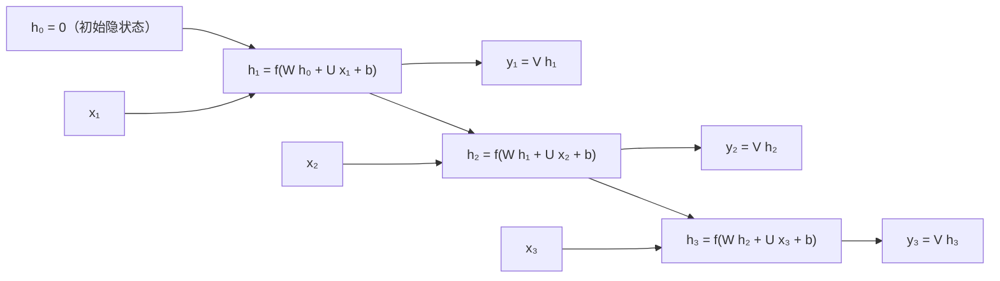

> **一句话总结**：循环神经网络（Recurrent Neural Network，RNN）用一条带反馈的边把"时间"接进网络，让隐状态 $h_t$ 充当记忆；但按时间反向传播（BPTT）里的 Jacobian 连乘会带来长程依赖问题，LSTM 用"内部状态 + 三个门"把连乘换成加性路径，GRU 用两个门做简化，二者共同构成序列建模的门控基石。
>
> **前置知识**：多层前馈网络与反向传播、链式法则与 Jacobian、Logistic/Tanh 及其导数、梯度下降与学习率、PyTorch 的 `nn.Module` 与张量维度。
>
> **学完能做到**：1. 写出 SRN/LSTM/GRU 的完整更新公式并手推 BPTT 梯度与 $\gamma$ 判据；2. 判断一个序列任务属于序列到类别、同步序列到序列还是异步序列到序列，并选对模型；3. 用 `nn.RNN/nn.LSTM/nn.GRU` 正确搭建并断言张量形状，处理变长序列与梯度截断。

## 1. 核心思想

前馈网络是**静态**函数：$\hat{y}=f(x)$，每次输入相互独立，且要求输入输出维数固定。但视频、语音、文本这类时序数据的长度不固定，且当前输出依赖历史——例如有限状态自动机下一时刻的状态既依赖当前输入，也依赖当前状态。于是必须给网络加**短期记忆**。

教材第 6.1 节给出三种增加记忆能力的途径，它们的本质区别在于"记忆存在哪里"：

| 模型 | 记忆来源 | 更新公式（教材 6.1–6.3 式） | 关键特点 |
| --- | --- | --- | --- |
| 延时神经网络 TDNN | 外挂**延时单元**缓存最近 $K$ 个活性值 | $h_t^{(l)}=f\big(h_t^{(l-1)},h_{t-1}^{(l-1)},\dots,h_{t-K}^{(l-1)}\big)$ | 时间维度权值共享，对序列输入**等价于卷积神经网络**；记忆长度被 $K$ 硬截断 |
| 有外部输入的非线性自回归 NARX | 延时单元缓存最近 $p$ 个输入 + $q$ 个**输出** | $y_t=f\big(x_t,\dots,x_{t-p},\,y_{t-1},\dots,y_{t-q}\big)$ | 输出自回归，闭环反馈；$(f)$ 可为前馈网络；仍是固定窗口 |
| 循环神经网络 RNN | **隐状态自身**的循环边（虚拟延时器） | $h_t=f\big(h_{t-1},x_t\big),\ h_0=0$ | 无需固定窗口，可处理**任意长度**序列；记忆容量有限但可学习 |

RNN 的核心洞见是：**同一个函数 $f$ 被反复施加**。因此从数学上看 $h_t=f(h_{t-1},x_t)$ 就是一个**动力系统**（Dynamical System），隐状态也因此被称为 state 或 hidden state。它的能力极强：定理 6.1（通用近似定理，Haykin 2009）指出足够多 sigmoid 隐神经元的全连接循环网络可以任意精度近似任何非线性动力系统；定理 6.2（Siegelmann & Sontag 1991）指出所有图灵机都能被这类网络模拟，即 RNN 是**图灵完备**的。一句话概括：**前馈网络能模拟任意连续函数，循环网络能模拟任意程序**。

把每个时刻的状态看作前馈网络的一层，RNN 按时间展开后就是**时间维度上权值共享的深层前馈网络**——所有时刻共用同一组 $U,W,V$。这个视角同时解释了 RNN 的两个性质：参数量不随序列变长而增长（好事），以及梯度要跨越很多"层"才能传回起点（长程依赖问题的根源）。

由此可以归纳 RNN 的三种应用模式：

| 模式 | 输入/输出 | 典型任务 | 读出方式 |
| --- | --- | --- | --- |
| 序列到类别 | $x_{1:T}\to y$ | 文本分类、情感分析 | 取最后状态 $\hat{y}=g(h_T)$，或对全部状态平均 $\hat{y}=g\big(\frac{1}{T}\sum_{t=1}^{T}h_t\big)$（平均对长序列更稳） |
| 同步序列到序列 | $x_{1:T}\to \hat{y}_{1:T}$，长度相同 | 词性标注、命名实体识别、序列标注 | 每个时刻都分类 $\hat{y}_t=g(h_t)$ |
| 异步序列到序列 | $x_{1:T}\to \hat{y}_{1:T'}$，长度可不同 | 机器翻译、文本摘要 | Encoder-Decoder（seq2seq），解码器用自回归 $\hat{y}_{t-1}$ 作下一时刻输入 |

## 2. 算法细节

### 2.1 简单循环网络（SRN）与按时间展开

SRN（Elman, 1990）是最简单的循环网络：只有一个隐藏层，但隐藏层到隐藏层存在反馈连接。令 $x_t\in\mathbb{R}^M$ 为 $t$ 时刻输入，$h_t\in\mathbb{R}^D$ 为隐状态，则

$$z_t = W h_{t-1} + U x_t + b,\qquad h_t = f(z_t)$$

其中 $W\in\mathbb{R}^{D\times D}$ 是**状态-状态**权重矩阵（反馈边上的权重），$U\in\mathbb{R}^{D\times M}$ 是**状态-输入**权重矩阵，$b\in\mathbb{R}^D$ 为偏置，$f(\cdot)$ 通常取 Logistic 或 Tanh。写成一行即教材式(6.7)：$h_t=f\big(Wh_{t-1}+Ux_t+b\big)$，初值 $h_0=\mathbf{0}$。若再加输出层 $y_t=Vh_t$，就得到完整的两层结构。

**手推：参数共享与展开等价**。把 $t=1,2,3$ 依次代入：

$$h_1=f(Ux_1+b),\quad h_2=f(Wh_1+Ux_2+b),\quad h_3=f(Wh_2+Ux_3+b)$$

把 $h_1,h_2$ 层层代入 $h_3$ 可得

$$h_3=f\Big(W\,f\big(W\,f(Ux_1+b)+Ux_2+b\big)+Ux_3+b\Big)$$

这是一个深度为 3 的前馈网络，每层输入都是 $[h_{t-1};x_t]$，且**每一层用的是同一个 $W$ 和同一个 $U$**。因此反向传播时，$\partial\mathcal{L}/\partial W$ 必须把每个时刻的贡献全部累加——这正是 BPTT 与普通 BP 的唯一区别。

这张图回答的是：一个循环网络「按时间展开」之后长什么样，同一组参数在每个时间步是怎么被复用的。



**读图要点**：

| 观察 | 含义 |
| --- | --- |
| 三个时间步用的是同一组 W、U、V | 参数共享让序列长度不改变参数量，这也是同一个模型能处理任意长度输入的原因 |
| 展开后就是一个深度为 T 的前馈网络 | 每层的输入都是 [h_(t−1); x_t]，于是梯度消失与爆炸的问题原样继承自深网络 |
| h_t 是唯一的记忆通道 | 历史信息全靠这一个定长向量向后传，长序列里早期信息会被反复覆盖，这正是长程依赖问题的根源 |
| BPTT 与普通 BP 的唯一区别是「对 t 求和」 | ∂L/∂W 必须把每个时刻的贡献全部累加，因为 W 在每一个时刻都参与了计算 |
| h₀ 取零向量是约定而不是必须 | 它决定了第一条输出里「历史」部分的先验，实践中也常用可学习的初值 |

### 2.2 BPTT：随时间反向传播

设每个时刻都有监督信号，损失为 $\mathcal{L}=\sum_{t=1}^{T}\mathcal{L}_t$，$\mathcal{L}_t=\mathcal{L}\big(y_t,g(h_t)\big)$。由于 $W$ 出现在每一个时刻的 $z_t$ 中，链式法则要求对所有时刻求和：

$$\frac{\partial\mathcal{L}}{\partial W}=\sum_{t=1}^{T}\frac{\partial \mathcal{L}}{\partial z_t}\frac{\partial^{+} z_t}{\partial W}$$

教材定义误差项 $\delta_{t,k}\triangleq\dfrac{\partial \mathcal{L}_t}{\partial z_k}$。当 $k<t$ 时，反向递推为

$$\delta_{t,k}=\frac{\partial z_{k+1}}{\partial z_k}\delta_{t,k+1}=\mathrm{diag}\big(f'(z_k)\big)\,W^{\top}\,\delta_{t,k+1}$$

**手推关键一步（展开连乘）**：反复套用上式，从 $t$ 一路推到 $k$：

$$\delta_{t,k}=\prod_{\tau=k}^{t-1}\Big(\mathrm{diag}\big(f'(z_\tau)\big)W^{\top}\Big)\,\delta_{t,t}$$

于是

$$\frac{\partial \mathcal{L}}{\partial W}=\sum_{t=1}^{T}\sum_{k=1}^{t}\delta_{t,k}\,h_{k-1}^{\top},\qquad
\frac{\partial \mathcal{L}}{\partial U}=\sum_{t=1}^{T}\sum_{k=1}^{t}\delta_{t,k}\,x_{k}^{\top},\qquad
\frac{\partial \mathcal{L}}{\partial b}=\sum_{t=1}^{T}\sum_{k=1}^{t}\delta_{t,k}$$

注意两个特征：外层对 $t$（哪个时刻的损失）求和，内层对 $k$（哪个时刻的参数贡献）求和，双重求和正是"参数共享"的数学体现；而 $\delta$ 的递推因子 $\mathrm{diag}(f'(z_k))W^{\top}$ 与 $t$ 无关，这为下一节的 $\gamma$ 判据埋下伏笔。

与之对照的是 **RTRL**（Real-Time Recurrent Learning），它用自动微分的**前向模式**从第 1 个时刻起实时递推 $\partial h_t/\partial w_{ij}$，无需等到序列结束：

| 对比项 | BPTT | RTRL |
| --- | --- | --- |
| 微分模式 | 反向模式（reverse mode） | 前向模式（forward mode） |
| 时间复杂度 | 与序列长度 $T$ 线性 | 与序列长度 $T$ 线性，但每步需维护 $O(D^2M)$ 个偏导 |
| 空间复杂度 | 需保存所有时刻中间梯度，$O(T)$ 较高 | 只需保存当前时刻的偏导矩阵，无需存储历史 |
| 适用场景 | 离线整句训练（NLP 主流） | **在线学习**、**无限序列**流式任务 |
| 实践地位 | 主流，PyTorch 中即 `loss.backward()` + 梯度累加 | 很少直接用，思想见于在线学习/递推最小二乘 |

### 2.3 长程依赖问题（Long-Term Dependencies）

定义 $\gamma\triangleq\big\|\mathrm{diag}(f'(z_\tau))W^{\top}\big\|$，则 $\|\delta_{t,k}\|\lesssim\gamma^{\,t-k}\|\delta_{t,t}\|$。

- $\gamma>1$：间隔 $t-k\to\infty$ 时 $\gamma^{t-k}\to\infty$ → **梯度爆炸**，损失曲面剧烈震荡甚至数值溢出 NaN；
- $\gamma<1$：$\gamma^{t-k}\to 0$ → **梯度消失**，远距离状态对参数更新几乎没有贡献。

由于 Logistic 导数最大仅 0.25、Tanh 导数最大为 1，且 $\|W\|$ 通常不大，RNN 实践中以梯度消失为主。

**必须强调的易错点**：RNN 里的梯度消失**不是** $\partial\mathcal{L}/\partial W$ 消失了（它由所有时刻求和而来，总还有值），而是 $\partial\mathcal{L}/\partial h_t$（即误差项 $\delta_{t,k}$）随间隔 $t-k$ 增大而消失。后果是参数更新只被当前时刻附近几个状态主导，**长距离状态对参数没有影响**，于是模型"理论上能建模长程依赖，实际上只能学到短期依赖"。

两种症状的解法路线完全不同：

- **梯度爆炸** → 优化手段即可：权重衰减（对参数加 $\ell_1/\ell_2$ 正则，把 $\|W\|$ 压到 $\le 1$）；**梯度截断**（gradient clipping）。按值截断 $g\leftarrow\max(\min(g,\text{max}),\text{min})$；按模截断：若 $\|g\|_2>\eta$ 则 $g\leftarrow\frac{\eta}{\|g\|_2}g$。教材（7.2.4.4 节）指出按模截断是训练 RNN 避免爆炸的有效方法，且对阈值不敏感。
- **梯度消失** → 必须**改模型**：优化技巧无效。最简单想法是让 $h_t=h_{t-1}+\phi(x_t;\theta)$，$\partial h_t/\partial h_{t-1}=I$，梯度不衰减但也就丢掉了反馈边上的非线性；折中且有效的方式是**门控机制**，即 LSTM 与 GRU。

### 2.4 LSTM：用加法路径替代连乘

LSTM（Hochreiter & Schmidhuber, 1997）引入一条独立的**内部状态**（internal state）$c_t$ 专门做线性循环信息传递，只非线性地输出给外部状态 $h_t$。三个"软门"取值于 $(0,1)$，由 Logistic 函数给出：

$$
\begin{aligned}
\tilde{c}_t &= \tanh\big(W_c x_t + U_c h_{t-1} + b_c\big) &&\text{候选状态}\\
i_t &= \sigma\big(W_i x_t + U_i h_{t-1} + b_i\big) &&\text{输入门：写入多少新信息}\\
f_t &= \sigma\big(W_f x_t + U_f h_{t-1} + b_f\big) &&\text{遗忘门：保留多少旧信息}\\
o_t &= \sigma\big(W_o x_t + U_o h_{t-1} + b_o\big) &&\text{输出门：输出多少内部状态}\\
c_t &= f_t\odot c_{t-1} + i_t\odot \tilde{c}_t\\
h_t &= o_t\odot \tanh(c_t)
\end{aligned}
$$

教材式(6.57)把四个量拼成一次矩阵乘：$[\tilde c_t;i_t;f_t;o_t]=\big[\tanh;\sigma;\sigma;\sigma\big]\big(W[x_t;h_{t-1}]+b\big)$，$W\in\mathbb{R}^{4D\times(M+D)}$——这也是 PyTorch 里 `weight_ih_l0` 形状为 $4D\times M$ 的原因。

**为什么加法能缓解梯度消失（核心推导）**。沿 $c$ 这条路径反传：

$$\frac{\partial c_t}{\partial c_{t-1}}=f_t,\qquad
\frac{\partial c_t}{\partial c_{k}}=\prod_{\tau=k+1}^{t}f_\tau$$

对比 SRN 的 $\prod \mathrm{diag}(f')W^{\top}$，区别有两点：(1) 连乘因子从"矩阵 $W^{\top}$"降级为**对角矩阵** $f_t$，不存在不同维度间的混合放大；(2) $f_t$ 由网络自己学出来，当 $f_t\approx 1$ 时梯度可以近似无损地流过任意多步。这正是"**常数误差传送带**"（constant error carousel）：$c_t$ 与 $c_{t-1}$ 是**线性关系**，误差沿这条线性路径传播不经过激活函数的饱和区。同时 $c_t$ 一路累加输入，故梯度里还多出直接项 $\partial c_t/\partial \tilde c_t=i_t$ 与 $\partial c_t/\partial f_t=c_{t-1}$，即使某条路径衰减，其余路径仍提供信号。

三个门的极端行为也帮助理解：$f_t=0,i_t=1$ 时清空历史、写入候选（但注意 $h_{t-1}$ 仍影响门与候选的计算）；$f_t=1,i_t=0$ 时完全复制上一时刻内容、不写新信息。

**"长短期记忆"名字的含义**：长期记忆 = **网络参数**（训练中学到的经验，更新周期极慢）；短期记忆 = **隐状态**（每个时刻被重写，生命周期极短）。记忆单元 $c_t$ 能抓住某个关键时刻的信息并保持较长时间，其生命周期长于短期记忆、远短于长期记忆，所以是"**长的短期记忆**"。

**遗忘门偏置初始化**：常规初始化参数很小，会让 $f_t=\sigma(W_fx+U_fh+b_f)$ 偏小，即上一时刻信息大部分被丢掉，既难捕捉长程依赖，也会让相邻时刻梯度极小。因此实践中把**遗忘门偏置 $b_f$ 初始化为 1 或 2**（`nn.LSTM` 的 `bias=True` 下 `bias_ih`/`bias_hh` 中对应 $f$ 的那一段），使训练初期 $f_t\approx 0.73\sim 0.88$。

**主要变体**：

| 变体 | 修改 | 效果 |
| --- | --- | --- |
| 无遗忘门 LSTM | $c_t=c_{t-1}+i_t\odot\tilde c_t$ | 最早版本，$c_t$ 单调增长，长序列下**饱和**、性能下降 |
| peephole 连接 | 门额外依赖 $c_{t-1}$：$f_t=\sigma(W_fx_t+U_fh_{t-1}+V_fc_{t-1}+b_f)$（$V$ 为对角阵） | 门能"看到"内部状态，部分任务有效但增加参数 |
| 耦合输入门与遗忘门 | 令 $f_t=1-i_t$，$c_t=(1-i_t)\odot c_{t-1}+i_t\odot\tilde c_t$ | 减少计算量（CIFG），实践中效果相当 |

### 2.5 GRU：两个门、无独立记忆单元

GRU（Cho et al., 2014; Chung et al., 2014）认为 LSTM 的输入门与遗忘门互补、存在冗余，于是用**一个更新门**同时控制"保留多少旧状态"和"接受多少新信息"，且不引入额外记忆单元：

$$
\begin{aligned}
z_t &= \sigma\big(W_z x_t + U_z h_{t-1} + b_z\big) &&\text{更新门}\\
r_t &= \sigma\big(W_r x_t + U_r h_{t-1} + b_r\big) &&\text{重置门}\\
\tilde{h}_t &= \tanh\big(W_h x_t + U_h (r_t\odot h_{t-1}) + b_h\big) &&\text{候选状态}\\
h_t &= z_t\odot h_{t-1} + (1-z_t)\odot \tilde{h}_t
\end{aligned}
$$

**极端情形分析（来自教材对式 6.65–6.69 的讨论）**：

- $z_t=0,\ r_t=0$：$h_t=\tilde h_t=\tanh(W_hx_t+b_h)$，当前状态**只和当前输入有关**，与历史完全断开；
- $z_t=0,\ r_t=1$：$h_t=\tanh(W_hx_t+U_hh_{t-1}+b_h)$，**退化为简单循环网络 SRN**；
- $z_t=1$：$h_t=h_{t-1}$，直接复制上一时刻状态，与当前输入无关，信息被长期保持；
- $0<z_t<1$：$h_t$ 与 $h_{t-1}$ **线性关系**（该分支不经过非线性），梯度可近似无损回传——这就是 GRU 缓解梯度消失的机制，与 LSTM 的加法路径同源。

**LSTM vs GRU 对比**：

| 维度 | LSTM | GRU |
| --- | --- | --- |
| 门数量 | 3（输入门、遗忘门、输出门） | 2（更新门、重置门） |
| 独立记忆单元 | 有，$c_t$ 与 $h_t$ 分离，靠 $o_t$ 解耦 | 无，$h_t$ 同时承担记忆与输出 |
| 参数量（同 hidden size） | 约 $4D(M+D)$（约为 SRN 的 4 倍） | 约 $3D(M+D)$（约为 SRN 的 3 倍） |
| 门控粒度 | 写入/遗忘/读出三路独立可调 | 保留与写入被 $z_t$ 与 $1-z_t$ 绑定 |
| 经验表现 | 长序列、复杂依赖上略占优，是"目前为止最成功的循环网络" | 参数更少、训练更快，中小数据集上常与 LSTM 相当 |
| 计算成本 | 更高 | 更低，文献中常报告收敛更快 |

### 2.6 深层循环神经网络

教材指出循环网络"既深又浅"：按时间展开，$x_1\to h_T$ 的路径极长（深）；同一时刻 $x_t\to y_t$ 的路径很短（浅）。增加深度就是**加长同一时刻的输入到输出路径**。

**堆叠循环网络 SRNN**（Stacked RNN，也叫 RMLP）：把第 $l-1$ 层的输出作为第 $l$ 层的输入，

$$h_t^{(l)}=f\Big(U^{(l)}h_{t-1}^{(l)}+W^{(l)}h_{t-1}^{(l-1)}+b^{(l)}\Big),\qquad h_t^{(0)}=x_t$$

PyTorch 中 `num_layers>1` 即此类结构，隐状态形状随之变成 `(num_layers, batch, hidden_size)`——**这就是 `h_0` 第一维乘层数的原因**。

**双向循环网络 Bi-RNN**：一个时刻的输出既依赖过去也依赖未来。例如句子中一个词的**词性由它的上下文（左右两边）共同决定**，单向 RNN 只能看到左边。Bi-RNN 用两层同输入、反方向的 RNN：

$$h_t^{(1)}=f\Big(U^{(1)}h_{t-1}^{(1)}+W^{(1)}x_t+b^{(1)}\Big),\qquad
h_t^{(2)}=f\Big(U^{(2)}h_{t+1}^{(2)}+W^{(2)}x_t+b^{(2)}\Big),\qquad
h_t=h_t^{(1)}\oplus h_t^{(2)}$$

$\oplus$ 为向量拼接，输出维度变成 $2D$，PyTorch 中把 `bidirectional=True` 后隐状态首维变成 `num_layers*2`。**代价**：必须看到整句才能计算，因此不能用于自回归生成（翻译解码、文本生成），只适合标注与分类类任务。

## 3. 可运行示例

下面这段代码做四件事：(1) 用 `nn.RNN` 的权重张量手工逐时刻展开，与 `nn.RNN` 的输出逐元素比对，证明按时间展开等价于权值共享的前馈网络；(2) 打印并断言 `nn.RNN/nn.LSTM/nn.GRU` 及双向、多层配置下的输入输出形状；(3) 用 `pack_padded_sequence` 处理变长序列并取出每行**真实末位**状态；(4) 给出训练循环里的梯度截断写法。所有形状断言都用运行时张量维度（`-1` 处自动推断），已在 PyTorch 2.11 CPU 上跑通。

```python
import torch
import torch.nn as nn

torch.manual_seed(0)
B, T, M, D = 2, 4, 5, 3 # batch, seq_len, input_size, hidden_size
x = torch.randn(B, T, M)

# ---------- 1) nn.RNN 等价于手工按时间展开 ----------
rnn = nn.RNN(M, D, num_layers=1, nonlinearity="tanh", batch_first=True)
h0 = torch.zeros(1, B, D) # (num_layers*num_directions, batch, hidden)

out, hn = rnn(x, h0) # out: 每个时刻的隐状态；hn: 最后时刻的隐状态
assert out.shape == (B, T, D) # batch_first=True 时 out 为 (batch, seq_len, hidden)
assert hn.shape == (1, B, D)
assert torch.allclose(hn[0], out[:, -1]) # hn 就是最后一步的 h_T

# nn.RNN 把 weight_ih / weight_hh / bias_ih / bias_hh 拼接保存在 _flat_weights 的
# 前 4 个位置（单层单向），拆开即可手工复现前向计算：
w_ih, w_hh, b_ih, b_hh = rnn._flat_weights[:4] # (D,M) (D,D) (D,) (D,)
h = torch.zeros(B, D)
manual = []
for t in range(T):
 h = torch.tanh(x[:, t] @ w_ih.T + h @ w_hh.T + b_ih + b_hh)
 manual.append(h)
manual = torch.stack(manual, dim=1) # (B, T, D)
assert torch.allclose(manual, out, atol=1e-6) # 手工展开 == nn.RNN

# ---------- 2) 三种门控单元的形状（统一 batch_first=True） ----------
lstm = nn.LSTM(M, D, num_layers=2, batch_first=True)
gru = nn.GRU(M, D, num_layers=2, batch_first=True)

lstm_out, (hn_l, cn_l) = lstm(x, (torch.zeros(2, B, D), torch.zeros(2, B, D)))
assert lstm_out.shape == (B, T, D)
assert hn_l.shape == (2, B, D) and cn_l.shape == (2, B, D) # 2 = num_layers

gru_out, hn_g = gru(x) # 不传 h0 时默认全零初始化
assert gru_out.shape == (B, T, D) and hn_g.shape == (2, B, D)

# 取最后时刻做序列到类别（文本分类）的读出
logits = nn.Linear(D, 7)(lstm_out[:, -1]) # (B, D) -> (B, 7 类)
assert logits.shape == (B, 7)

# 双向：输出维度翻倍，隐状态首维 = num_layers * num_directions
bidi = nn.GRU(M, D, num_layers=2, bidirectional=True, batch_first=True)
bidi_out, hn_b = bidi(x)
assert bidi_out.shape == (B, T, 2 * D)
assert hn_b.shape == (2 * 2, B, D) # 前向2层 + 反向2层交替排列

# ---------- 3) 变长序列：pack_padded_sequence ----------
lengths = torch.tensor([4, 2]) # 必须按长度降序排列（默认 enforce_sorted=True）
packed = nn.utils.rnn.pack_padded_sequence(
 x, lengths, batch_first=True, enforce_sorted=True)
packed_out, packed_hn = rnn(packed, h0)
unpacked, out_lens = nn.utils.rnn.pad_packed_sequence(packed_out, batch_first=True)
assert unpacked.shape == (B, T, D) # 已还原为 (B, T, D)，短样本尾部补零
assert torch.equal(out_lens, lengths)
# packed_hn 里存的是每个样本**真实末位**（长度 2 的样本取第 2 步，不是第 4 步），
# 所以不能用 unpacked[:, -1]（那是补零位置）：
idx = (lengths - 1).view(-1, 1, 1).expand(-1, 1, D) # 每个样本的真实末位下标
last_real = unpacked.gather(1, idx).squeeze(1) # (B, D)
assert torch.allclose(last_real, packed_hn[0], atol=1e-6)
# 也可用 torch.nn.utils.rnn.unpad_sequence(unpacked, lengths, batch_first=True) 直接拿掉填充。

# ---------- 4) 训练循环中的梯度截断（防梯度爆炸） ----------
opt = torch.optim.Adam(bidi.parameters(), lr=1e-3)
loss = bidi_out.pow(2).mean
opt.zero_grad()
loss.backward()
total_norm = nn.utils.clip_grad_norm_(bidi.parameters(), max_norm=5.0)
print(f"grad norm before clip = {total_norm:.4f}")
opt.step
print("all checks passed")
```

**关键形状速查**（`batch_first=True`）：输入 `(batch, seq_len, input_size)` → `output` 为 `(batch, seq_len, hidden_size * num_directions)`，`h_n` 为 `(num_layers * num_directions, batch, hidden_size)`；LSTM 额外返回 `c_n`，形状与 `h_n` 相同。**`batch_first=True` 只影响输入/输出的前两维，不影响 `h_n`/`c_n`**——后者的第一维永远是层数乘方向数，这是最常见的形状踩坑点。

**`pack_padded_sequence` 要点**：(1) `lengths` 必须是 CPU 上的 `LongTensor`，默认要求**降序**，否则需 `enforce_sorted=False`（内部会自己排序并把 `h_n` 还原）；(2) 打包后 RNN 只对有效时刻前向，**不会**让填充位参与门控计算，因此 `h_n` 是每个样本真实末位状态；(3) 输出是 `PackedSequence`，必须 `pad_packed_sequence` 才能拿回规则张量；(4) 计算损失时要配 `ignore_index` 或掩码，避免填充位贡献梯度。

## 4. 常见坑

| 坑 | 表现 | 原因 | 解法 |
| --- | --- | --- | --- |
| 混淆 `batch_first` 默认值 | 训练不报错但完全不收敛，或 `h_n` 形状对不上 | `nn.RNN/nn.LSTM/nn.GRU` 默认 `batch_first=False`，输入应为 `(seq_len, batch, input_size)`；而 `DataLoader` 给出的是 `(batch, seq_len, feat)` | 显式写 `batch_first=True`，或对输入做 `permute(1, 0, 2)`；用 `assert x.shape == (...)` 提前暴露 |
| 把 `h_n` 当作 `(batch, hidden)` | 索引/拼接时维度错误 | `h_n` 首维是 `num_layers * num_directions` | 单层单向取 `h_n[-1]`；双向需 `h_n.view(num_layers, 2, batch, hidden)` 后再处理 |
| 忘记 detach 隐状态 | 训练越久越慢，显存持续增长 | 跨 batch 手动传递 `h_n` 时保留了整条计算图，反向传播会沿历史一直展开 | 传 `h_n.detach()`（标准做法是每个 batch 用零初始化 h0） |
| 未处理变长序列的填充位 | 分类结果被 padding 污染，`h_T` 取到的是零填充后的状态 | 直接取 `output[:, -1]`，而短句末位是 padding | `pack_padded_sequence` + `pad_packed_sequence`，按 `lengths-1` gather 真实末位；或对损失设 `ignore_index` |
| 梯度爆炸 | loss 突然变成 `nan`，参数溢出 | $\gamma>1$ 时误差项随间隔指数增长（教材 6.5 节） | `clip_grad_norm_(params, max_norm=5)`；配合权重衰减 |
| 误以为"梯度消失 = 参数梯度为 0" | 加大学习率试图解决长程依赖，结果更不稳 | 消失的是 $\partial\mathcal{L}/\partial h_t$ 而非 $\partial\mathcal{L}/\partial W$ | 从模型入手（LSTM/GRU/残差式更新），而不是调学习率 |
| 遗忘门初始化为 0 | 长序列任务效果显著变差，梯度早期就衰减 | $f_t=\sigma(b_f)$ 偏小，历史信息被大量丢弃 | 把 $b_f$ 初始化为 1~2（教材 6.6.1 节），PyTorch 中手工填入 `bias_ih`/`bias_hh` 的 $f$ 段 |
| 在需要生成的任务上用双向 RNN | 训练正常但推理无法进行 | Bi-RNN 需要整句未来信息，解码时未来 token 尚不存在 | 编码器可用双向，**解码器必须单向** |
| 忘记 `optimizer.zero_grad()` | 梯度跨 batch 累加，等效学习率失控 | PyTorch 默认累加梯度 | 每次 `backward` 前 `zero_grad`（梯度累积技巧除外） |

## 5. 面试问答

**Q1：为什么 LSTM 能缓解梯度消失？请给出关键公式。**

<details>
<summary>参考答案</summary>

RNN 的误差项递推为 $\delta_{t,k}=\prod_{\tau=k}^{t-1}\mathrm{diag}(f'(z_\tau))W^{\top}\delta_{t,t}$，连乘中含**矩阵** $W^{\top}$ 和饱和激活的导数，$\gamma=\|\mathrm{diag}(f')W^{\top}\|<1$ 时随间隔指数衰减。

LSTM 引入内部状态 $c_t=f_t\odot c_{t-1}+i_t\odot\tilde c_t$，其循环路径是**加性**的：

$$\frac{\partial c_t}{\partial c_{t-1}}=f_t=\mathrm{diag}\big(\sigma(\cdot)\big),\qquad \frac{\partial c_t}{\partial c_k}=\prod_{\tau=k+1}^{t}f_\tau$$

三点改善：(1) 连乘因子从矩阵降为**对角矩阵**，没有跨维度混合放大；(2) $f_\tau$ 是网络学出来的门，可接近 1，梯度近似无损穿过很多步；(3) 因为是加法，还额外存在 $\partial c_t/\partial\tilde c_t=i_t$ 这条**不经过连乘**的直接路径，提供稳定梯度。这就是"常数误差传送带"。

补充：梯度爆炸并未被解决（$c$ 路径上仍可能过大），所以 LSTM 训练中仍需 gradient clipping。

</details>

**Q2：LSTM 与 GRU 的区别？什么时候用哪个？**

<details>
<summary>参考答案</summary>

**结构区别**：LSTM 有 3 个门（输入门、遗忘门、输出门）和独立的记忆单元 $c_t$，$h_t=o_t\odot\tanh(c_t)$ 把记忆与输出解耦；GRU 只有 2 个门（更新门 $z_t$、重置门 $r_t$），$h_t=z_t\odot h_{t-1}+(1-z_t)\odot\tilde h_t$，直接用隐状态承载记忆，参数量约为 LSTM 的 3/4。

**门语义区别**：LSTM 的写入量（$i_t$）与保留量（$f_t$）相互独立；GRU 中二者被绑定为 $1-z_t$ 与 $z_t$，更省参数但也更受约束；GRU 的重置门 $r_t$ 作用在**候选状态**上，控制候选对历史的依赖程度（$r_t=0$ 时候选只与当前输入有关）。

**选型经验**：序列很长、依赖结构复杂（长文档建模、语音）优先 LSTM；数据量中小、追求训练速度与显存时优先 GRU；两者在多数任务上差距不大，超参（层数、hidden size、学习率、embedding 维度）的影响往往大于单元类型的选择。工程上建议都试一遍，用验证集定夺。

**共同局限**：都无法并行（时刻间有依赖），因此才有后续的卷积序列模型与 Transformer。

</details>

**Q3：序列到类别任务中，为什么有时对全部隐状态取平均而不是取 $h_T$？**

<details>
<summary>参考答案</summary>

取 $h_T$ 的前提是"最后时刻的状态已经聚合了整句信息"，但 RNN 的记忆是**有限且有偏**的：长序列中早期 token 的信息会衰减，$h_T$ 对末尾内容更敏感；短序列与长序列的 $h_T$ 统计分布也不一致，分类头难以适应。

平均池化 $\hat y=g\big(\frac1T\sum_t h_t\big)$ 让每个时刻都直接贡献梯度，缓解梯度消失、也降低对序列长度的敏感性，通常更稳。实践中还有三种常见做法：取 `max` 池化（捕捉显著特征）、只用 $h_T$ 但用双向编码器补足信息、以及用注意力加权求和（让模型自己学每个时刻的权重，后来直接演化成 Transformer）。

选哪个要用验证集实验；对文本分类这种"关键词触发"的任务，mean/max 池化往往优于 $h_T$。

</details>

## 6. 自测题

**1. 写出 SRN 的更新公式，并说明为什么它"等价于时间维度上权值共享的前馈网络"。**

<details>
<summary>参考答案</summary>

$z_t=Wh_{t-1}+Ux_t+b,\ h_t=f(z_t),\ y_t=Vh_t$，$h_0=\mathbf 0$。

把 $t=1..T$ 逐层代入，得到 $h_T=f(Wf(Wf(\dots)+Ux_2+b)+Ux_3+b)$ 这样的嵌套复合函数，其结构就是一个深度为 $T$ 的前馈网络（每层输入为 $[h_{t-1};x_t]$），且所有层共用同一组 $W,U,b$。因此反向传播求 $\partial\mathcal L/\partial W$ 时必须对所有时刻的贡献求和，得到 $\partial\mathcal L/\partial W=\sum_t\sum_k\delta_{t,k}h_{k-1}^{\top}$ 的双重求和形式——这就是 BPTT。

</details>

**2. 教材强调"RNN 的梯度消失不是 $\partial\mathcal L/\partial W$ 消失"。请解释这句话，并说明它的实际后果。**

<details>
<summary>参考答案</summary>

$\partial\mathcal L/\partial W$ 是对所有时刻求和得到的量，其中当前时刻附近（$k$ 接近 $t$，即 $t-k$ 小）的项依然显著，所以总量不会变成 0。真正随间隔指数衰减的是**误差项** $\delta_{t,k}=\partial\mathcal L_t/\partial z_k$，即 $\partial\mathcal L/\partial h_t$ 意义上的跨时间敏感度。

后果：参数更新几乎完全由邻近几个时刻驱动，序列早期的状态对梯度没有贡献，模型"理论上能建模长程依赖，实际上只学到短期依赖"。这也是为什么解决梯度消失必须**换模型**（LSTM/GRU 的加性路径）而调学习率无效。

</details>

**3. GRU 在 $z_t=0, r_t=0$ 与 $z_t=0, r_t=1$ 两种情形下分别退化成什么？**

<details>
<summary>参考答案</summary>

$z_t=0$ 时 $h_t=(1-z_t)\odot\tilde h_t=\tilde h_t$，输出完全由候选状态决定。

- $r_t=0$ 时 $\tilde h_t=\tanh(W_hx_t+U_h(r_t\odot h_{t-1})+b_h)=\tanh(W_hx_t+b_h)$：候选只与当前输入有关，与历史状态断开。
- $r_t=1$ 时 $\tilde h_t=\tanh(W_hx_t+U_hh_{t-1}+b_h)$，而 $h_t=\tilde h_t=f(W_hx_t+U_hh_{t-1}+b_h)$，**退化为简单循环网络 SRN**。

另外 $z_t=1$ 时 $h_t=h_{t-1}$，直接复制历史、与当前输入无关。

</details>

**4. 用 `nn.LSTM(input_size=10, hidden_size=20, num_layers=3, bidirectional=True, batch_first=True)` 处理 `(8, 15, 10)` 的输入，`output`、`h_n`、`c_n` 的形状各是什么？**

<details>
<summary>参考答案</summary>

`output` 为 `(8, 15, 40)`：$40=20\times2$，双向输出拼接，第二维仍是 `seq_len`。

`h_n` 与 `c_n` 都是 `(6, 8, 20)`：第一维 $=\text{num\_layers}\times\text{num\_directions}=3\times2=6$（每个时刻每层每个方向一个末位状态），第二维 batch $=8$，第三维 hidden_size $=20$。注意 `batch_first=True` 只改前两维的顺序（seq/batch），**不改变** `h_n`/`c_n` 的层数维。

补充：`h_n` 中前向与反向状态按方向交替排列（`view(num_layers, 2, batch, hidden)` 后 `[l,0]` 为前向、`[l,1]` 为反向）。

</details>

**5. 训练 RNN 时 loss 在第 300 步突然变成 `nan`，最可能的原因和最快的处置方式是什么？**

<details>
<summary>参考答案</summary>

最可能是**梯度爆炸**（$\gamma>1$，误差项随间隔指数放大），也可能是学习率过大或序列中出现极端长句。

处置顺序：(1) 加 `nn.utils.clip_grad_norm_(model.parameters(), max_norm=5)`（按模截断，教材 7.2.4.4 节指出它对阈值不敏感、是 RNN 的有效手段）；(2) 打印 `total_norm` 监控梯度模，确认是否真的爆掉；(3) 降低学习率或加入 warmup；(4) 加权重衰减/`dropout`；(5) 若同时存在长程依赖，考虑把 SRN 换成 LSTM/GRU 并检查遗忘门偏置初始化。

</details>

## 7. 延伸阅读

- 邱锡鹏《神经网络与深度学习》第 6 章"循环神经网络"（本节主要来源）：<https://nndl.github.io/> ；在线书稿：<https://nndl.github.io/nndl-book.pdf>
- 本书第 7.2.4.4 节"梯度截断"与第 8 章"注意力机制"，分别对应本文的梯度爆炸处理与 RNN 的后续演化：<https://nndl.github.io/>
- 《动手学深度学习》（zh.d2l.ai）循环神经网络篇，含 `pack_padded_sequence`、门控单元的完整实现与图示：<https://zh.d2l.ai/chapter_recurrent-neural-networks/index.html>、<https://zh.d2l.ai/chapter_recurrent-modern/lstm.html>、<https://zh.d2l.ai/chapter_recurrent-modern/gru.html>
- PyTorch 官方文档 `nn.RNN` / `nn.LSTM` / `nn.GRU` 的形状约定与参数说明：<https://pytorch.org/docs/stable/generated/torch.nn.LSTM.html>、<https://pytorch.org/docs/stable/generated/torch.nn.GRU.html>
- `pack_padded_sequence` / `pad_packed_sequence` 与 `clip_grad_norm_`：<https://pytorch.org/docs/stable/generated/torch.nn.utils.rnn.pack_padded_sequence.html>、<https://pytorch.org/docs/stable/generated/torch.nn.utils.clip_grad_norm_.html>
- Hochreiter & Schmidhuber, *Long Short-Term Memory* (Neural Computation, 1997)：<https://www.bioinf.jku.at/publications/older/2604.pdf>
- Cho et al., *Learning Phrase Representations using RNN Encoder–Decoder*（GRU 原始论文）：<https://arxiv.org/abs/1406.1078>；Chung et al., *Empirical Evaluation of Gated Recurrent Neural Networks*：<https://arxiv.org/abs/1412.3555>
- Bengio, Simard & Frasconi, *Learning Long-Term Dependencies with Gradient Descent is Difficult*（长程依赖问题的经典分析）：<https://ieeexplore.ieee.org/document/279181>
- Greff et al., *LSTM: A Search Space Odyssey*（LSTM 各变体的系统对比，含遗忘门偏置初始化的实验依据）：<https://arxiv.org/abs/1503.04069>

**覆盖说明**：本文的模型公式、BPTT 推导、$\gamma$ 判据、LSTM/GRU 门控与变体、堆叠与双向循环网络，均来自本机《神经网络与深度学习》第 6 章（PDF 第 129–150 页，即 `nn_book.txt` 中"第6章循环神经网络"至"6.9总结和深入阅读"各段）以及第 7.2.4.4 节"梯度截断"（PDF 第 166 页）；PyTorch 形状约定与课堂代码风格参考了本机 `3.RNN及其变体.md`。**超出本机范围**、依据公开教材与官方文档补充的内容包括：`pack_padded_sequence` / `pad_packed_sequence` 的用法细节与 `lengths` 降序要求、`h_n.detach()` 的截断计算图实践、Adam 优化器与 RNN 训练循环的工程写法（来自 PyTorch 官方文档）；mean/max 池化与注意力读出对序列到类别任务的影响、LSTM 与 GRU 的选型经验（参考《动手学深度学习》与 Greff et al. 2015）；截断式 BPTT（truncated BPTT）的工程含义（教材 6.9 节仅提及名称，细节来自公开教材与《深度学习》花书第 10 章）。课堂"拼接式"代码（如 `rnn_output[0][-1]` 这类只适配单样本 batch 的写法）未照搬，本文示例统一按 `(batch, seq_len, hidden)` 处理并加了形状断言。

---

[⬅️ 返回本目录索引](README.md)
