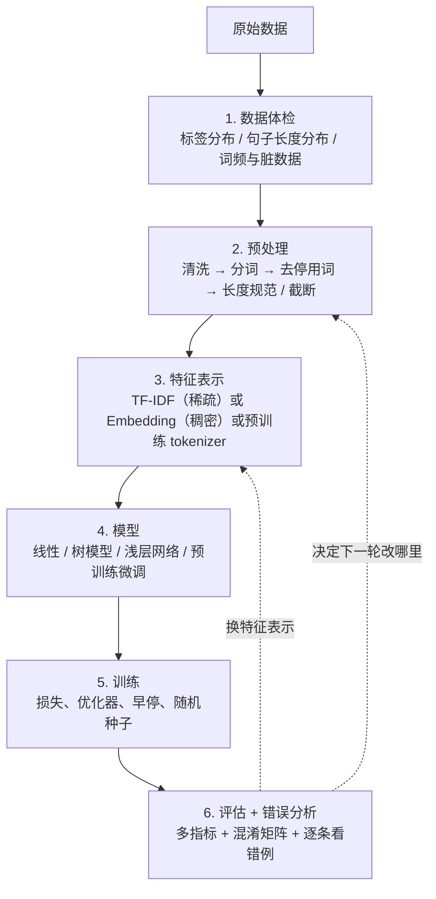

# 文本分类实战

> **一句话总结**：文本分类的胜负往往不在模型，而在「标注质量 + 预处理一致性 + 评估指标选对」这三件工程事上。
> **前置知识**：第 02 篇分词、第 03 篇 TF-IDF 与稀疏矩阵、第 04 篇词向量与 FastText、sklearn 的基本用法。

> 1. 独立完成一条文本分类流水线：数据体检 → 预处理 → 特征 → 基线 → 评估 → 错误分析。
> 2. 说清 accuracy / macro-F1 / weighted-F1 的差异，并在类别不均衡时选对指标。
> 3. 用混淆矩阵定位「哪两类容易混」，并把结论转化为可执行的改进项。

## 1. 核心概念

### 1.1 任务形式化

文本分类：给定文本 $x$ 与标签空间 $\mathcal{Y}=\{y_1,\dots,y_K\}$，学习映射 $f: x \to y$。按标签数量分：

| 类型 | 说明 | 例子 |
|------|------|------|
| 二分类 | $K=2$ | 情感正/负、垃圾邮件识别 |
| 多分类（互斥） | $K>2$，且只有一个正确标签 | 新闻主题（每篇只属一个频道） |
| 多标签 | 一篇可同时属于多个类别 | 文章同时打「体育」「健康」标签 |

本节及案例都属于**多分类互斥**，损失函数用交叉熵（softmax + NLL），评估按单标签处理。多标签需要改成 sigmoid + BCE，且指标换成 micro/macro-F1 与 mAP。

### 1.2 的三个数据集

| 数据集 | 规模 | 类别数 | 格式 | 特点 | 用途 |
|--------|------|--------|------|------|------|
| AG News（新闻主题） | 12 万训练 / 7600 测试 | 4（World / Sports / Business / Sci-Tech） | CSV：标签, 标题, 正文 | 英文、类别均衡、文本较短 | 浅层网络教学案例 |
| 头条新闻（文本分类） | 18 万（每类约 1.8 万） | 10（finance / realty / stocks / education / science / society / politics / sports / game / entertainment） | `文本\t标签ID`（label 从 0 开始） | 中文、高度均衡、短文本（截断到 30 字） | 传统 ML → FastText → BERT 全链路对比 |
| 酒店评论（ChnSentiCorp） | 训练 + 验证 | 2（0 消极 / 1 积极） | TSV：`sentence\tlabel` | 中文、正负略不均衡 | 文本数据分析与情感分析（见第 11 篇） |

头条数据集的标签体系值得记住，它是后面第 12 篇医疗分类的对照：0 finance、1 realty、2 stocks、3 education、4 science、5 society、6 politics、7 sports、8 game、9 entertainment。`class.txt` 每行一个类别名，行号即 label ID。

### 1.3 文本分类的通用流水线

这张图回答：一条分类流水线里，哪些步骤在动数据、哪些在动模型，以及做完评估之后要回到哪里。



**读图要点**：

| 观察 | 含义 |
| --- | --- |
| 第 1 步与第 6 步是「看数据」的两端 | 前者决定特征与模型是否可行，后者决定下一轮改什么；中间的模型选择反而更早被固定 |
| 第 3 步是三选一 | TF-IDF / Embedding / 预训练 tokenizer 决定了第 4 步能选什么模型的上限 |
| 第 5 步是唯一与数据无关的环节 | 它只管损失、优化器、早停与种子，出问题通常表现为结果不稳定而不是结果差 |
| 回边指向第 2、3 步而不是第 4 步 | 分类任务的提升多数来自特征与数据，换模型是最贵、收益最不确定的一步 |
| 第 6 步被跳过就等于放弃改进线索 | 只看一个 accuracy 数字，无法判断错的是哪一类、错在多长文本上 |

第 6 步最容易被跳过，但它决定了下一轮迭代做什么。只看一个 accuracy 数字，等于放弃了所有改进线索。

### 1.4 三档基线，从便宜到贵

| 档位 | 特征 | 模型 | 训练成本 | 头条数据上的典型表现 |
|------|------|------|----------|---------------------|
| 第 1 档 | TF-IDF / 词袋 | 逻辑回归、LinearSVC、随机森林 | 秒～分钟，CPU 即可 | 中等（随机森林约 0.82–0.85） |
| 第 2 档 | 词向量 + n-gram | FastText、TextCNN、BiLSTM | 分钟级，CPU 可跑 | 较高（FastText 约 0.86–0.89） |
| 第 3 档 | 预训练 tokenizer + 微调 | BERT / RoBERTa / MacBERT | 小时级，需要 GPU | 最高（0.90–0.94） |

**做项目一定从第 1 档开始**。原因有三：① 它给出一个下界，后面所有复杂模型都必须显著超过它才算有价值；② 训练只要几秒，可以快速验证数据清洗、标签映射、评估代码是否写对；③ 它的特征重要性/系数可直接解释，帮助发现数据泄漏或标注错误。

### 1.5 评估指标

先定义四个基础量（以某一类为正类）：

| 符号 | 含义 |
|------|------|
| TP | 真实为该类、预测也为该类 |
| FP | 真实不是、预测是该类 |
| FN | 真实是该类、预测不是 |
| TN | 真实不是、预测也不是 |

$$
P=\frac{TP}{TP+FP},\qquad R=\frac{TP}{TP+FN},\qquad F_1=\frac{2PR}{P+R},\qquad \text{Acc}=\frac{TP+TN}{TP+TN+FP+FN}
$$

多分类时 $P/R/F_1$ 需要跨类别聚合：

| 聚合方式 | 做法 | 什么时候用 | 注意 |
|----------|------|-----------|------|
| `micro` | 先把所有类的 TP/FP/FN 加总再算 | 关心**整体**样本级表现 | 单标签多分类下 micro-F1 ≡ accuracy |
| `macro` | 各类指标**先算再简单平均** | 各类同等重要、类别不均衡 | 少数类被放大，最能暴露「小类学不好」 |
| `weighted` | 各类指标按**该类样本数**加权平均 | 关心整体但考虑类别占比 | 会被多数类主导，接近 accuracy |

一句话选型：**类别均衡看 accuracy / macro；类别不均衡看 macro-F1**，并同时报告每一类的 P/R/F1 和混淆矩阵。

### 1.6 `pad_size` 怎么定

序列模型和预训练模型都需要固定长度。定法来自第 01 篇的数据分析：

1. 画句子长度分布（`sns.displot(..., kde=True)`）；
2. 取 `mean + 2*std`（覆盖约 95%）或 **95 分位数**；
3. 头条项目中文本被截断到 30 个字符，BERT 项目中普遍用 `pad_size=32`；医疗项目用 `max_length=128`。

取值太小会截掉长文本的关键信息，太大则大量位置是 padding，注意力被无效位置稀释、训练变慢。**不要拍脑袋，一定要看分布**。

## 2. 方法细节

### 2.1 数据体检：三个必看的图

| 图 | 代码要点 | 结论导向 |
|----|----------|----------|
| 标签数量分布 | `sns.countplot(x="label", data=df)` | 若正负比例严重偏离 1:1，需要数据增强/重采样或改指标 |
| 句子长度分布 | 新增 `sentence_length` 列 + `sns.displot(..., kde=True)` | 定 `max_len`；判断是否需要 head+tail 截断 |
| 词频与词云 | `set(chain(*map(jieba.lcut, df.sentence)))` 统计词表；按类别筛形容词画词云 | 发现脏数据（HTML 标签、乱码、广告）、发现停用词表缺项 |

词云的一个实用技巧：先按类别筛选样本，再用 `jieba.posseg` 只取形容词（`flag == "a"`）生成词云，这样能直观看出「积极评论」和「消极评论」的用词差异。生成时注意指定中文字体 `font_path="SimHei.ttf"`，否则显示为方框。

### 2.2 预处理的责任边界

预处理必须**训练/推理完全一致**。凡是依赖训练集的统计量（IDF、词表、停用词表、`max_len`），都要从训练集算出并持久化，推理时原样复用。具体清单：

| 物料 | 来源 | 是否随模型保存 | 不一致的后果 |
|------|------|---------------|-------------|
| 分词器与自定义词典 | 领域词表 | 是 | 专名切分不同 → 特征错位 |
| 停用词表 | 训练集统计或人工表 | 是 | 特征维度或含义变化 |
| TF-IDF vectorizer | `fit` 于训练集 | 是 | 静默的特征错位（最危险） |
| 标签映射 `label ↔ id` | `class.txt` | 是 | 预测结果全部标签错位 |
| `max_len` / `pad_size` | 训练集长度分布 | 是 | 推理截断策略不同，长文本表现骤降 |
| 模型权重 | 训练产物 | 是 | — |

### 2.3 随机森林在文本上的工作方式

用 TF-IDF + `RandomForestClassifier` 做第一档基线。它「能处理文本」的原理是：

1. `TfidfVectorizer` 把 18 万条新闻变成 $(180000,\ \le 50000)$ 的稀疏矩阵（`max_features` 控制词表上限）。
2. 随机森林对样本做**有放回抽样（bootstrap）**，训练 100–200 棵决策树；每棵树在分裂时只考虑随机的一部分特征。
3. 预测时所有树投票，票数最多者胜出。因为每棵树看到的是不同的数据子集和特征子集，树之间**去相关**，集成后方差下降，泛化优于单棵树。

它的最大优势不是精度，而是**可解释性**：`model.feature_importances_` 直接给出每个词对分类的贡献。在医疗项目里，排名靠前的词就是「治疗 / 症状 / 原因 / 预防 / 检查 / 传染 / 手术 / 药物 / 多久 / 科室」，与 13 个标签高度对应——这既验证了模型学到了正确模式，也能反哺业务理解。

### 2.4 从「词袋 + 树」到「Embedding + 网络」

`ag_news` 案例的浅层网络是理解后续所有模型的起点：

```python
self.embedding = nn.Embedding(vocab_size, embed_dim, sparse=True)
self.fc = nn.Linear(embed_dim, num_class)
```

配合 `F.avg_pool2d` / 对时间维求平均得到句向量，再接线性层。三点值得注意：

- `sparse=True`：对 embedding 求梯度时只更新被激活的行。词表大时能显著省内存与计算，**前提是优化器支持稀疏梯度**（`SparseAdam` / `Adagrad`，普通 `Adam` 不支持）。
- 这里的 embedding 是**随机初始化、随任务训练**的（第 3 代表示），与第 1 档的 TF-IDF（第 2 代）是本质不同的表示。
- 这个结构与 FastText 分类头几乎等价：**词向量平均 + 线性层**。差别在于 FastText 用子词合成向量，且训练目标/正则更成熟。

### 2.5 错误分析的标准动作

拿到混淆矩阵后按三步走：

1. **看对角线**：哪些类别本身就没学好（对角线明显偏低的类）。
2. **看非对角线的热点**：找到 $(i,j)$ 上数值大的格子，说明「真实 $i$ 被预测成 $j$」频繁发生。头条项目里典型的是 finance ↔ stocks、society ↔ politics、science ↔ education 之间互相混淆——它们的词汇高度重叠。
3. **抽样读错例**：每个热点抽 20–50 条，人工归纳错因。常见归因有四类：
 - **标注问题**：边界模糊，人工标注本身就不一致（可用多人标注一致性检查）。
 - **特征不足**：关键信息在标题里但被截断，或词表里没有关键子词。
 - **类别体系问题**：两类本质不可分，应考虑**合并类别**或改成多标签。
 - **模型capacity问题**：错例分布随机、没有规律，说明是模型表达力不足，可以上更强的模型。

### 2.6 类别不均衡的处理手段

| 手段 | 做法 | 代价 |
|------|------|------|
| 重采样 | 少数类过采样（SMOTE、回译增强）/ 多数类欠采样 | 过采样易过拟合，欠采样丢信息 |
| 类别权重 | `class_weight='balanced'`（sklearn）、损失里给少数类更大权重 | 简单有效，但会牺牲多数类精度 |
| 阈值调整 | 二分类时按 PR 曲线选阈值，而不是固定 0.5 | 需要验证集，且要随分布漂移重调 |
| 数据增强 | 回译、同义词替换、EDA | 见第 01 篇注意事项（语义漂移、极性翻转） |
| 换指标 | 用 macro-F1 / AUC / PR-AUC | 只是「正确地衡量」，不解决数据问题 |

对头条数据这种**每类约 1.8 万、高度均衡**的数据集，上述手段基本不需要——这也是它适合做教学案例的原因。

## 3. 可运行示例

下面是一个**自包含**的端到端中文文本分类示例：内联造 60 条三分类短文本，走完「分词 → TF-IDF → 逻辑回归 → 多指标评估 → 混淆矩阵 → 错误分析」。

```python
# 依赖: pip install scikit-learn jieba numpy
import jieba
import numpy as np
from sklearn.feature_extraction.text import TfidfVectorizer
from sklearn.linear_model import LogisticRegression
from sklearn.metrics import (accuracy_score, classification_report,
confusion_matrix, f1_score)
from sklearn.model_selection import train_test_split

# ---------- 1. 内联构造数据（实际项目改从 train.txt 读取 `文本\t标签`） ----------
raw = [
# 体育
("湖人队赢得总冠军，詹姆斯发挥出色", "sports"),
("国足客场逼平对手，晋级希望仍在", "sports"),
("奥运会游泳决赛，中国队再添一金", "sports"),
("nba季后赛首轮，勇士淘汰国王", "sports"),
("中超联赛第10轮，泰山主场取胜", "sports"),
# 财经
("美联储宣布加息25个基点，美股震荡", "finance"),
("央行下调存款准备金率，释放流动性", "finance"),
("人民币汇率小幅升值，出口企业承压", "finance"),
("A股三大指数集体收跌，成交量萎缩", "finance"),
("国际油价上涨，能源板块走强", "finance"),
# 科技
("国产芯片实现新突破，性能提升明显", "science"),
("人工智能大模型发布，支持多模态输入", "science"),
("量子计算原型机完成新一轮测试", "science"),
("新型电池材料量产，续航提升三成", "science"),
("航天器成功着陆月球背面", "science"),
] * 4 # 每条重复 4 次，共 60 条

texts = [t for t, _ in raw]
labels = [y for _, y in raw]

# ---------- 2. 分词（保持训练与推理同一函数） ----------
def cut(text: str) -> str:
    return "".join(jieba.lcut(text))

texts = [cut(t) for t in texts]

# ---------- 3. 划分数据（类别均衡，用 stratify 保证每类比例一致） ----------
X_train, X_test, y_train, y_test = train_test_split(
texts, labels, test_size=0.25, random_state=42, stratify=labels
)

# ---------- 4. 特征：TF-IDF（fit 只在训练集上做！） ----------
vec = TfidfVectorizer(token_pattern=r"(?u)\b\w+\b", ngram_range=(1, 2), min_df=1)
Xtr = vec.fit_transform(X_train)
Xte = vec.transform(X_test) # 注意：transform，不是 fit_transform
print("特征维度:", Xtr.shape)

# ---------- 5. 模型 ----------
clf = LogisticRegression(max_iter=1000, C=5.0, multi_class="multinomial")
clf.fit(Xtr, y_train)

# ---------- 6. 评估：多指标 + 逐类报告 ----------
pred = clf.predict(Xte)
print("accuracy : %.4f" % accuracy_score(y_test, pred))
print("macro-F1 : %.4f" % f1_score(y_test, pred, average="macro"))
print("weighted-F1 : %.4f" % f1_score(y_test, pred, average="weighted"))
print
print(classification_report(y_test, pred, digits=4))

# ---------- 7. 混淆矩阵 + 错误分析 ----------
classes = sorted(set(labels))
cm = confusion_matrix(y_test, pred, labels=classes)
print("混淆矩阵（行=真实，列=预测）")
print("" + "".join(f"{c[:7]:>9}" for c in classes))
for i, c in enumerate(classes):
    print(f"{c[:7]:>7} " + "".join(f"{v:>9}" for v in cm[i]))

    print("\n错例抽样：")
    for text, true, p in zip(X_test, y_test, pred):
        if true != p:
            print(f" 真实={true:<8} 预测={p:<8} 文本={text}")

            # ---------- 8. 特征重要性（线性模型看系数） ----------
            names = np.array(vec.get_feature_names_out)
            for cls, coef in zip(clf.classes_, clf.coef_):
                top = names[np.argsort(coef)[-6:]][::-1]
                print(f"{cls} 的关键词: {list(top)}")
```

**预期效果**：数据由三类高度可分的关键词构成，测试集准确率会到 1.0 左右。这不是「模型强」，而是**数据太干净** —— 真实项目里 accuracy 通常在 0.8–0.95 区间，且一定会有错例。把内联数据换成真实数据后，`classification_report` 与混淆矩阵才是真正有用的部分。

再看一眼「实际项目会怎么用」的对照写法（**不要直接运行**，因为需要数据文件）：

```python
# 说明：以下对应原始路径，仅作对照，请勿在无数据环境下运行
# import pandas as pd
# content = pd.read_csv("data/data/train.txt", sep="\t", names=["sentence", "label"])
# content["words"] = content["sentence"].apply(lambda s: "".join(jieba.cut(s))[:30])
# content.to_csv("./data/data/train_new.csv") # 只保留 30 个字符
# stop_words = open("./data/data/stopwords.txt", encoding="utf-8").read.split()
# tfidf = TfidfVectorizer(stop_words=stop_words)
# x_train, x_test, y_train, y_test = train_test_split(
# tfidf.fit_transform(content["words"]), content["label"],
# test_size=0.2, random_state=0)
```

## 4. 常见坑

| 现象 | 原因 | 解决 |
|------|------|------|
| 测试集指标异常高（>0.99） | 训练/测试划分前就做了分词或统计，或重复样本跨集 | 先划分再预处理；用 `train_test_split` 前生成特征；去重 |
| 报 "X has n features, expecting m" | 推理时用了新的 vectorizer / `fit_transform` | 把 vectorizer 与模型一起 `joblib.dump`，推理时一起加载 |
| accuracy 很高但少数类 F1 为 0 | 只看 accuracy，类别不均衡 | 改看 macro-F1 与逐类报告，加 `class_weight='balanced'` |
| `jieba` 反复初始化，训练极慢 | 在 `apply` 里重复 `load_userdict` | 字典只加载一次；或用 `jieba.initialize` 预热 |
| 类别名与数字 ID 错位 | `class.txt` 行号从 0 开始，但用了 `sorted(set(labels))` 重新映射 | 统一从 `class.txt` 读取并固定映射，训练/推理共用同一份 |
| `dataframe.apply(lambda s: "".join(jieba.cut(s))[:30])` 截断在词中间 | 先拼接再按**字符**截断 | 先 `[:30]` 截词列表再 `"".join(...)`：`"".join(list(jieba.cut(s))[:30])` |
| 随机森林训练到内存爆掉 | TF-IDF 未做 `max_features` 限制，且 `n_jobs=-1` 复制数据 | 加 `max_features`/`min_df`；`n_jobs` 适当调小；用 `sparse` 输入 |
| FastText 训练报标签格式错误 | 标签前缀漏了 `__label__`，或标签与文本间不是空格 | 严格 `__label__类别 词1 词2 ...` |
| FastText 报「模型没学到词」 | 输入未分词，整句被当成一个 token | 先用 jieba 分词空格连接，再加 `wordNgrams=2` |
| 每次实验结果都不一样 | 未固定随机种子 | `random_state`、`np.random.seed`、`torch.manual_seed`、`torch.backends.cudnn.deterministic=True` |
| 保存的模型换机器加载失败 | `torch.save(model)` 存了整个对象，依赖原类定义路径 | 存 `model.state_dict`；GPU→CPU 用 `map_location="cpu"` |

## 5. 面试问答

**Q1. 类别不均衡时为什么不能只看 accuracy？该用什么指标？**

<details markdown="1">
<summary markdown="1">参考答案</summary>

因为 accuracy 把四个格子的贡献看成等权，而多数类会主导它。极端例子：正负比 99:1，一个「永远预测多数类」的模型准确率是 99%，但它对少数类完全无用（少数类召回率为 0）。

正确做法是分层看指标：

- **macro-F1**：先算每一类的 F1，再**简单平均**。每一类权重相同，因此少数类的表现会被放大——这是类别不均衡时最该看的指标。
- **weighted-F1**：按类样本数加权平均，会被多数类主导，通常在类别均衡时接近 accuracy。
- **micro-F1**：先汇总 TP/FP/FN 再计算。在**单标签多分类**下 micro-F1 恒等于 accuracy，所以它不解决不均衡问题。
- **AUC / PR-AUC**：与阈值无关，能衡量排序质量。不均衡且关心少数类时，**PR-AUC 比 ROC-AUC 更敏感**（因为 ROC 的 FPR 分母是庞大的 TN，会掩盖 FP 的增长）。

实践建议：同时报告 accuracy + macro-F1 + **逐类 P/R/F1** + 混淆矩阵，并在业务上明确「漏检少数类」和「误报少数类」哪个代价更高，再决定优化方向。

</details>

**Q2. 一个文本分类任务 accuracy 0.92，但业务方说「不好用」。你会怎么排查？**

<details markdown="1">
<summary markdown="1">参考答案</summary>

按「先确认指标是否被误读，再定位错误分布」的顺序排查：

1. **确认是否类别不均衡**：看各类样本数与逐类 F1。0.92 可能是多数类撑起来的，某些重要小类 F1 很低。
2. **确认测试集是否可信**：检查有没有数据泄漏（重复样本跨集、预处理顺序错误）、测试集是否与线上分布一致（线上新出现的主题/句式在训练集里没有）。
3. **看混淆矩阵找热点**：确认错误集中在哪些类对上。如果集中在语义高度重叠的类对（如 finance↔stocks），说明是**类别体系问题**而非模型问题，应考虑合并类或改多标签。
4. **抽样读错例**：人工归纳错因。重点区分三类：标注错误（标签本身错）、信息不足（关键信息在标题而模型只看到正文）、模型能力不足（错例无规律）。
5. **确认线上一致性**：分词器、停用词、`max_len`、标签映射是否与训练时完全一致。这是「离线好、线上差」最常见的原因。
6. **确认业务指标映射**：业务可能关心的是「高置信度预测的准确率」或「特定类别的召回率」，而不是整体 accuracy。可以引入阈值与置信度过滤，只对高置信度样本自动分流，低置信度转人工。

结论通常落在三类动作上：修数据（标注/去泄漏）、改体系（合并类/多标签）、换模型（引入预训练）。**没有错误分析就没有改进方向**。

</details>

**Q3. 三档基线（TF-IDF+线性 / FastText / BERT）你会怎么选？**

<details markdown="1">
<summary markdown="1">参考答案</summary>

按「数据量 × 延迟要求 × 精度要求 × 算力」四个维度决策：

| 场景 | 推荐 | 理由 |
|------|------|------|
| 标注数据 < 5000 条、无 GPU | TF-IDF + 线性模型 | 训练秒级、可解释、在小数据上不比深度模型差 |
| 数据 10 万级、要求毫秒级推理、CPU 部署 | FastText | 训练几分钟、模型几十 MB、单条推理亚毫秒，OOV 有子词兜底 |
| 追求最高精度、有 GPU、延迟可放宽到几十毫秒 | BERT 微调 | 上下文表示能力最强，头条/医疗项目上通常比 FastText 高 3–5 个点 |
| 有 GPU 但要控延迟 | BERT 蒸馏到 TextCNN（第 12 篇） | 用教师软标签把 BERT 的知识迁移到小模型，兼顾精度与速度 |
| 类别极多（上千类） | FastText 或 层次 softmax + 线性 | BERT 的 softmax 层参数会随类别数爆炸 |

工程上还有一个常被忽略的点：**先用小模型把数据和评估流程跑通，再决定是否值得上大模型**。如果第 1 档就到 0.90、业务要求 0.92，那上一档 FastText 调调参数可能就够；如果第 1 档只有 0.75，说明特征表达力是瓶颈，直接上预训练更划算。

</details>

## 6. 自测题

**1. 某三分类任务测试集各类样本数为 900 / 90 / 10。模型对三类 F1 分别是 0.90 / 0.60 / 0.20。求 accuracy、macro-F1、weighted-F1（假设准确率也按类 F1 加权近似）。**

<details markdown="1">
<summary markdown="1">参考答案</summary>

总共 1000 条样本。

- **weighted-F1**（按样本数加权）：$\frac{900\times0.90+90\times0.60+10\times0.20}{1000}=\frac{810+54+2}{1000}=0.866$
- **macro-F1**（简单平均）：$\frac{0.90+0.60+0.20}{3}=0.567$
- **accuracy** 与 weighted 近似（严格说 accuracy 是全体正确率，不等于按类 F1 加权，但在这个量级下接近），约 0.87

关键结论：weighted-F1 报出 0.87，看起来「还不错」；而 macro-F1 只有 0.57，暴露了小类几乎学不会的事实。这正是为什么**类别不均衡时必须同时看 macro-F1**——单一的加权指标会把问题藏起来。

</details>

**2. 我在训练前对全量数据做了 TF-IDF 然后才划分训练/测试集，会有什么问题？**

<details markdown="1">
<summary markdown="1">参考答案</summary>

这是典型的**数据泄漏（data leakage）**，会导致测试指标虚高、线上表现远低于离线。

具体机制：`fit` 阶段会用到全部数据来计算词表、文档频率（DF）和 IDF。这样测试集的词分布信息就「泄漏」进了训练特征：

1. **IDF 泄漏**：IDF 由包含测试文档的语料统计得到，模型提前知道了测试数据的分布。
2. **词表泄漏**：测试集里出现的词被纳入词表，而这些词在真实线上推理时未必存在于训练词表——离线评估因此高估了覆盖率。
3. **`max_features` 选择泄漏**：被保留的高频特征由全体数据决定，测试集间接影响了特征选择。

正确顺序是：**先划分，再在训练集上 `fit`，用同一个 vectorizer 对测试集 `transform`**。同样的原则适用于：标准化/归一化的均值方差、停用词表从语料自动生成、特征选择、降维（SVD）、SMOTE 过采样（只能在训练集上做）。

</details>

**3. 混淆矩阵显示 science 与 education 互相误判严重（各占该类错误的 40%）。给出至少三种改进方案。**

<details markdown="1">
<summary markdown="1">参考答案</summary>

先判断是「模型不行」还是「类别体系不行」——这个错例模式高度提示后者。

1. **抽读错例确认可分辨性**：如果人工也分不清（例如「高校 AI 专业招生」既可算 education 也可算 science），说明标签体系本身有重叠。这时应改为**多标签分类**，或**合并两个类别**；强行二选一会让模型在噪声上拟合。
2. **补充判别性特征**：如果存在可区分的线索但模型没用到，就把它喂进去。例如：
 - 加 `ngram_range=(1,2)` 引入「招生 / 专业 / 考试」与「算法 / 实验 / 论文」这类短语；
 - 保留标题信息（标题往往比正文更能指示类别）；
 - 用词向量或预训练模型捕捉「高校」与「科研」的语义邻近关系。
3. **引入类别先验或层级结构**：如果两个大类下各有子类，改造成**层级分类**（先分大类再分子类），让上层共享表示。
4. **样本层面干预**：对这两类做定向数据增强（回译/同义词替换）或补充标注易混样本；也可以在损失中对这两个类的混淆样本加大惩罚（代价敏感学习）。
5. **换更强的表示**：若错例的区分线索需要上下文（如「这家医院引进 AI 辅助诊断」），TF-IDF 无能为力，需要上 BERT 类模型。

落地顺序建议：先用 1–2 做低成本验证，确认体系没问题再动模型，避免「模型越换越复杂、问题依旧」。

</details>

**4. 为什么 `pad_size` 不能拍脑袋定？设成 512 有什么坏处？**

<details markdown="1">
<summary markdown="1">参考答案</summary>

因为 `pad_size` 直接决定「信息保留率」与「计算开销」的平衡，而这两个量都由数据分布决定：

- **设太小**：长文本被截断，关键信息丢失。头条数据截断到 30 个字符、BERT 项目用 `pad_size=32`，都是因为语料本身很短；如果语料 95 分位是 200，却设 32，准确率会明显掉。
- **设太大（如 512）**：
 1. **计算浪费**：self-attention 的时间与显存复杂度是 $O(L^2)$。$L$ 从 32 增到 512，注意力矩阵从 $32\times32$ 变成 $512\times512$，计算量增大 **256 倍**，而这些位置绝大多数是 padding。
 2. **注意力被稀释**：即便有 `attention_mask` 屏蔽了 padding，LayerNorm 与残差仍在全长度上运算，有效信号占比下降，有时会轻微掉点。
 3. **吞吐下降**：batch 内每条样本的实际 token 数远小于 `pad_size` 时，GPU 利用率很低。

正确做法：先画长度分布，取 **`mean + 2*std`** 或 **95 分位数**；对长文本任务（合同、病历）改用分块（chunking）或 head+tail 截断（BERT 的 head-only / tail-only / head+tail 三种策略）。另外，用 `DataCollatorWithPadding` 做**动态 padding**（每个 batch 按该 batch 最长样本补齐）比固定 512 更高效。

</details>

## 7. 延伸阅读

- AG News 数据集说明（4 类英文新闻主题，本案例数据）：https://huggingface.co/datasets/ag_news
- sklearn 模型评估指南（含 `classification_report`、混淆矩阵、macro/micro/weighted 的定义）：https://scikit-learn.org/stable/modules/model_evaluation.html
- sklearn `RandomForestClassifier` 文档（`n_estimators`、`max_depth`、`class_weight` 等参数）：https://scikit-learn.org/stable/modules/generated/sklearn.ensemble.RandomForestClassifier.html
- FastText 文本分类（`__label__` 格式、`autotuneValidationFile` 自动调参）：https://fasttext.cc/docs/en/supervised-tutorial.html
- 《A Survey on Text Classification: From Traditional to Deep Learning》(2020)：https://arxiv.org/abs/2008.00364
- 中文文本分类常用数据集汇总（THUCNews、TNEWS、IFLYTEK 等）：https://github.com/CLUEbenchmark/CLUE

---

[⬅️ 返回 NLP 目录](README.md)
