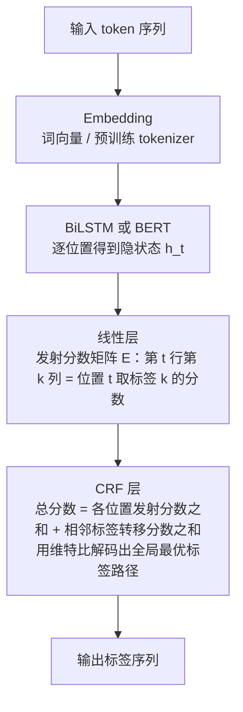

# 序列标注与实体识别

> **一句话总结**：序列标注是「逐 token 分类 + 标签之间互相约束」的问题，HMM 用生成式假设建模，CRF 用判别式全局归一化超越它，BiLSTM-CRF 把两者合流。
> **前置知识**：第 01 篇的词性标注与 NER 两阶段拆解、概率论基础（条件概率、贝叶斯）、softmax 与交叉熵。

> 1. 写出 BIO / BIOES 标签体系，并把一段文本标注成合法标签序列。
> 2. 说清 HMM 的两个假设、三大问题与维特比递推，并解释「生成式 vs 判别式」带来的准确率差异。
> 3. 说明 BiLSTM-CRF 中发射分数、转移分数与 CRF 解码层各自的职责，以及为什么必须用实体级 F1 评估。

## 1. 核心概念

### 1.1 什么是序列标注

序列标注（sequence labeling）是给输入序列的**每个位置**输出一个标签，输入输出**等长**：

$$
(x_1, x_2, \dots, x_n) \;\longrightarrow\; (y_1, y_2, \dots, y_n)
$$

与文本分类的关键区别：

| 对比项 | 文本分类 | 序列标注 |
|--------|----------|----------|
| 输出 | 整句一个标签 | 每个 token 一个标签 |
| 输入输出长度 | 不必等长 | 必须等长 |
| 标签间依赖 | 无 | 强（相邻标签必须合法组合） |
| 损失 | 单次交叉熵 | 每个位置交叉熵之和（或 CRF 的序列级似然） |
| 评测 | accuracy / F1（样本级） | token 级 P/R/F1、**实体级 F1** |
| 典型任务 | 情感分析、主题分类 | 分词、词性标注、NER |

NLP 中的序列标注三兄弟：**分词**（字 → B/M/E/S）、**词性标注**（词 → n/v/a）、**命名实体识别**（字或词 → B-PER/I-PER/O）。三者的数学形式完全一样，只是标签空间不同。

### 1.2 标签体系：从 BIO 到 BIOES

以「张三 在 北京 大学 工作」为例（实体：人名「张三」、机构名「北京大学」）：

| 体系 | 标签集合 | 标注结果 | 说明 |
|------|----------|----------|------|
| BIO | B-X / I-X / O | B-PER O B-ORG I-ORG I-ORG O | 最常用、标签最少 |
| BIOES | B/I/O/E/S | S-PER O B-ORG I-ORG E-ORG O | 多出 E（结尾）与 S（单字实体），边界更明确 |
| BMES（分词） | B/M/E/S | S S S B M E S | 分词专用 |
| BIO1 / BIO2 | B/I 带类型后缀 | B-PER I-PER … | 变体，本质相同 |

三种体系的差异与代价：

| 体系 | 标签数（$k$ 类实体） | 边界信息 | 典型问题 |
|------|---------------------|----------|----------|
| BIO | $2k+1$ | 依赖后处理推断结束位置 | `B-X I-X O` 与 `B-X O` 都能表示单字实体，不规范 |
| BIOES | $4k+1$ | 自带明确的结尾标记 | 标签数翻倍，小数据上每类样本更稀疏 |
| BMES | 4（不分实体类型） | 分词场景足够 | 无法区分实体类型 |

标签数膨胀是序列标注的隐形负担：NER 有 10 类实体时，BIO 是 21 个标签，BIOES 是 41 个标签。标签越多，每个标签的训练样本越少，长尾标签（如 B-货币）容易学不好。

### 1.3 HMM：生成式序列标注

HMM（Hidden Markov Model，隐含马尔可夫模型）以文本序列为输入，以对应的**隐含序列**为输出。在词性标注里：

```
观测序列: 人生 该 如何 起头
隐含序列: n r r v （词性）
```

模型表示为三元组：

$$
\lambda = \text{HMM}(A, B, \pi)
$$

| 参数 | 名称 | 含义 |
|------|------|------|
| $A$ | 转移概率矩阵 | $a_{ij} = P(y_t = j \mid y_{t-1} = i)$，从状态 $i$ 转到 $j$ 的概率 |
| $B$ | 发射概率矩阵 | $b_j(x) = P(x_t \mid y_t = j)$，状态 $j$ 生成观测 $x$ 的概率 |
| $\pi$ | 初始概率向量 | $\pi_i = P(y_1 = i)$ |

HMM 的两大假设（也是它最大的弱点）：

| 假设 | 内容 | 代价 |
|------|------|------|
| 齐次马尔可夫假设 | 任一时刻 $t$ 的状态只依赖前一时刻状态，与更早的状态及观测无关 | 无法建模长距离依赖（如括号配对、远距离主谓一致） |
| 观测独立性假设 | 任一时刻的观测只依赖该时刻的隐状态，与其他状态和观测无关 | 无法利用上下文特征（前一个词、词的后缀、大写、字典等） |

> 把第一条假设写作「隐含假设」，准确名称是**齐次马尔可夫假设**；第二条常被略去，但它同样是准确率受限的关键原因。

### 1.4 CRF：判别式序列标注

CRF（Conditional Random Fields，条件随机场）同样以序列为输入、以隐含序列为输出，但它是**判别式模型**：直接建模条件概率 $P(y \mid x)$，而不是像 HMM 那样建模联合概率 $P(x, y)$ 再靠贝叶斯求条件概率。

HMM 与 CRF 的差异对照：

| 对比项 | HMM | CRF |
|--------|-----|-----|
| 模型类型 | 生成式（建模 $P(x,y)$） | 判别式（建模 $P(y\mid x)$） |
| 假设 | 有齐次马尔可夫 + 观测独立假设 | 无独立性假设（只要求是马尔可夫随机场） |
| 特征 | 只能用「观测 + 状态」的概率 | 可自由设计任意特征函数（前后词、前缀后缀、字典匹配） |
| 归一化 | **局部**归一化（每步发射概率各自归一） | **全局**归一化（整条序列共用一个配分函数 $Z(x)$） |
| 速度 | 快 | 慢（训练要算配分函数，多用 L-BFGS） |
| 准确率 | 较低（受假设限制） | 明显更高（不受假设限制 + 特征自由） |
| 现状 | 逐渐淡出 | 仍常作为深度模型的**输出层**（BiLSTM-CRF、BERT-CRF） |

### 1.5 HMM 的三大问题与对应算法

| 问题 | 已知 | 求什么 | 算法 |
|------|------|--------|------|
| 评估问题 | $\lambda$ 和观测序列 $x$ | $P(x \mid \lambda)$ | 前向算法 / 后向算法 |
| 解码问题 | $\lambda$ 和观测序列 $x$ | 最优隐状态序列 $y^*$ | 维特比算法（Viterbi） |
| 学习问题 | 观测序列（+ 可能的隐状态） | 参数 $\lambda = (A,B,\pi)$ | 有标注：极大似然估计（数频次）；无标注：Baum-Welch（EM） |

实际工程中最常用的是**解码**（预测）和**有监督学习**（数频次），后者只需要统计转移与发射的共现次数，简单到几乎不需要梯度下降。

## 2. 方法细节

### 2.1 HMM 的联合概率分解

由两个假设，序列的联合概率可以完全分解为局部因子的乘积：

$$
P(x_1^n, y_1^n) = \pi_{y_1} b_{y_1}(x_1) \prod_{t=2}^{n} a_{y_{t-1},\,y_t}\, b_{y_t}(x_t)
$$

于是在给定 $x$ 求最优 $y$ 时：

$$
y^* = \arg\max_{y} P(y \mid x) = \arg\max_{y} \frac{P(x,y)}{P(x)} = \arg\max_{y} P(x, y)
$$

最后一个等式成立是因为 $P(x)$ 与 $y$ 无关。这个分解形式正是维特比算法能够成立的基础——**目标函数可以写成相邻两项相乘的链式结构**。

对比 CRF：它建模的是

$$
P(y\mid x) = \frac{1}{Z(x)}\exp\Big(\sum_{t} \big[\,s(y_t, x, t) + T(y_{t-1}, y_t)\,\big]\Big),\qquad Z(x)=\sum_{y'}\exp(\cdots)
$$

其中 $s$ 是发射分数（可来自 BiLSTM 或 BERT 的输出）、$T$ 是转移分数（可学习的标签转移矩阵）、$Z(x)$ 是**全局**配分函数（对所有标签序列求和）。HMM 的 $A$ 是概率矩阵（每行和为 1，局部归一化），而 CRF 的 $T$ 是**无约束的分数矩阵**（不要求归一化）——这正是 CRF 更灵活的原因：转移分数可以学到「B-PER 后面不该直接接 I-LOC」这类硬约束，而不必强行满足概率归一。

### 2.2 维特比算法（Viterbi）

目标是求 $\arg\max_y P(x, y)$。动态规划定义

$$
\delta_t(j) = \max_{y_1^{t-1}} P\big(y_1^{t-1},\, y_t = j,\, x_1^{t}\big)
$$

即「到时刻 $t$ 停在状态 $j$ 的所有路径中的最大概率」。递推：

$$
\delta_1(j) = \pi_j\, b_j(x_1)
$$

$$
\delta_t(j) = \Big[\max_{i} \delta_{t-1}(i)\, a_{ij}\Big]\, b_j(x_t), \qquad
\psi_t(j) = \arg\max_{i}\ \delta_{t-1}(i)\, a_{ij}
$$

其中 $\psi_t(j)$ 记录「最优前驱状态」用于回溯。终止与回溯：

$$
y_n^* = \arg\max_{j} \delta_n(j), \qquad y_t^* = \psi_{t+1}(y_{t+1}^*)
$$

复杂度 $O(n \cdot K^2)$（$K$ 为状态数）。与穷举 $O(K^n)$ 相比，这是指数级到多项式级的降维——核心在于「最优路径的子路径也是最优的」这一最优子结构性质。

工程实现中一律在**对数域**做（把乘法变加法），避免长序列概率下溢为 0。

### 2.3 BiLSTM-CRF 的数据流

现代序列标注的标准架构把「特征提取」与「标签约束」解耦：

这张图回答：从 token 到标签序列，特征与约束分别在哪一层被加上。



**读图要点**：

| 观察 | 含义 |
| --- | --- |
| 前几层在做「减维」，最后一层在加约束 | Embedding / BiLSTM / 线性层只关心每个位置像哪个标签，CRF 才关心标签之间的组合是否合法 |
| 分数由两部分相加 | 位置分数来自特征（发射分数），相邻分数来自可学习的转移矩阵，二者相加才是整条路径的分数 |
| 线性层的输出宽度由标签数决定 | 隐状态维度 d 在这里被映射到 K 个标签，之后不再有新的特征提取 |
| 图里没画训练路径 | 训练用 CRF 的负对数似然（要算配分函数 Z），推理才用维特比，两者不是同一套计算 |
| 维特比的位置在 CRF 内部 | 它解决的是「在给定分数下找最优路径」，而不是「产生分数」，所以换特征提取器不影响它 |

各组件职责：

| 组件 | 负责 | 不负责 |
|------|------|--------|
| Embedding / BERT | 把 token 变成含上下文的向量 | 标签之间的约束 |
| BiLSTM | 双向建模长距离依赖（前向 + 后向拼接） | 输出合法标签序列 |
| 线性层 | 把 $d$ 维隐状态映射到 $K$ 个标签的分数 | 序列级一致性 |
| CRF 层 | 用可学习转移矩阵 $T$ 约束标签序列，维特比求全局最优 | 特征提取 |

训练时用 CRF 的负对数似然（需要前向算法算 $Z(x)$），而不是逐位置交叉熵；推理时用维特比。

### 2.4 评测：为什么必须用实体级 F1

假设真实标签与预测标签如下（BIO 体系）：

```
真实: B-PER I-PER O B-ORG I-ORG I-ORG O
预测: B-PER I-PER O B-ORG I-ORG O O
```

**token 级准确率** = 6/7 ≈ 0.857，看起来不错。但从实体角度看：

- 真实实体：`张三(PER)`、`北京大学(ORG)` —— 共 2 个
- 预测实体：`张三(PER)`、`北京大学`？预测是 `B-ORG I-ORG O`，所以只识别出 `北京(ORG)` —— 1 个（且边界错误）
- 实体级：TP=1（张三）、FP=1（北京）、FN=1（北京大学），$P=R=F_1=0.5$

**token 准确率会严重高估性能**，因为 O 标签通常占绝大多数（80%+），把 O 预测对毫无信息量。因此 NER 必须用**实体级**（span 级，要求边界与类型都完全正确）指标，常用工具是 `seqeval`。

思考题：为什么不用「部分匹配」（边界对但类型错）？因为不同业务对错误的容忍度不同，主流做法是只认**完全匹配**，另外可附加「类型正确但边界错」的分项统计用于分析。

## 3. 可运行示例

### 3.1 纯 numpy 的 HMM + 维特比（词性标注风格）

```python
# 依赖: pip install numpy
import numpy as np

# 状态（隐状态）与观测（词）词表
states = ["n", "v", "r"]
observations = ["人生", "该", "如何", "起头", "猫", "吃", "鱼"]

# 初始概率 pi
pi = np.array([0.6, 0.3, 0.1])

# 转移概率 A[i][j] = P(y_t = j | y_{t-1} = i)
A = np.array([
[0.3, 0.4, 0.3], # n -> n/v/r
[0.4, 0.3, 0.3], # v -> n/v/r
[0.5, 0.4, 0.1], # r -> n/v/r
])

# 发射概率 B[j][k] = P(观测 k | 状态 j)，加平滑避免 0 概率
B = np.array([
[0.30, 0.10, 0.10, 0.20, 0.10, 0.05, 0.05], # n
[0.10, 0.05, 0.05, 0.10, 0.05, 0.40, 0.25], # v
[0.20, 0.30, 0.20, 0.05, 0.10, 0.05, 0.10], # r
])

def viterbi(obs_seq, states, pi, A, B):
    """观测序列 -> 最优隐状态序列（对数域实现，避免下溢）"""
    obs_idx = [observations.index(o) for o in obs_seq]
    n, K = len(obs_idx), len(states)
    log_pi, log_A, log_B = np.log(pi), np.log(A), np.log(B)

    delta = np.zeros((n, K)) # 到达每个位置每个状态的最大对数概率
    psi = np.zeros((n, K), dtype=int) # 最优前驱状态

    delta[0] = log_pi + log_B[:, obs_idx[0]]
    for t in range(1, n):
        for j in range(K):
            scores = delta[t - 1] + log_A[:, j]
            psi[t, j] = int(np.argmax(scores))
            delta[t, j] = scores[psi[t, j]] + log_B[j, obs_idx[t]]

            # 回溯
            path = [int(np.argmax(delta[n - 1]))]
            for t in range(n - 1, 0, -1):
                path.append(int(psi[t, path[-1]]))
                path.reverse()
                return [states[i] for i in path], delta

            for sent in [["人生", "该", "如何", "起头"], ["猫", "吃", "鱼"], ["鱼", "吃", "猫"]]:
                tags, delta = viterbi(sent, states, pi, A, B)
                print(f"{' '.join(sent):<20} -> {' '.join(tags)} (log P = {delta[len(sent)-1].max:.4f})")
```

预期现象：`猫 吃 鱼` 会得到 `n / v / n`，而把语序换成 `鱼 吃 猫` 仍得到 `n / v / n` —— HMM 只建模相邻依赖，看不出「谁是施事」。把它和后面 BiLSTM 能区分的例子对照，就能直观体会**齐次马尔可夫假设的代价**。

### 3.2 BIO 与 BIOES 互转 + 实体抽取

```python
def bio_to_spans(tokens, tags):
    """从 BIO 标签序列抽取实体片段 [(type, start, end_exclusive, text), ...]"""
    spans, cur = [], None
    for i, tag in enumerate(tags):
        if tag == "O":
            if cur:
                spans.append(cur)
                cur = None
                continue
            prefix, etype = tag.split("-", 1)
            if prefix == "B" or cur is None or cur[0] != etype:
                if cur:
                    spans.append(cur)
                    cur = [etype, i, i + 1, tokens[i]]
                else: # I- 连续
                    cur[2] = i + 1
                    cur[3] += tokens[i]
                    if cur:
                        spans.append(cur)
                        return spans

                    def spans_to_bioes(tokens, spans):
                        tags = ["O"] * len(tokens)
                        for etype, s, e, _ in spans:
                            if e - s == 1:
                                tags[s] = f"S-{etype}"
                            else:
                                tags[s] = f"B-{etype}"
                                tags[e - 1] = f"E-{etype}"
                                for i in range(s + 1, e - 1):
                                    tags[i] = f"I-{etype}"
                                    return tags

                                tokens = ["张", "三", "在", "北", "京", "大", "学", "工", "作"]
                                bio_tags = ["B-PER", "I-PER", "O", "B-ORG", "I-ORG", "I-ORG", "I-ORG", "O", "O"]

                                spans = bio_to_spans(tokens, bio_tags)
                                print("抽取到的实体:", spans) # [('PER', 0, 2, '张三'), ('ORG', 3, 7, '北京大学')]
                                print("转成 BIOES :", spans_to_bioes(tokens, spans))
                                # ['S-PER', 'O', 'O', 'B-ORG', 'I-ORG', 'I-ORG', 'E-ORG', 'O', 'O']
```

### 3.3 统计法训练 HMM（极大似然估计）

```python
from collections import defaultdict

# 内联小训练集：(观测序列, 隐状态序列)
train = [
(["人生", "该", "如何", "起头"], ["n", "r", "r", "v"]),
(["猫", "吃", "鱼"], ["n", "v", "n"]),
(["我", "爱", "北京"], ["r", "v", "n"]),
]

states = sorted({s for _, ys in train for s in ys})
pi_c, A_c, B_c = defaultdict(float), defaultdict(float), defaultdict(float)

for xs, ys in train:
    pi_c[ys[0]] += 1
    for t, (x, y) in enumerate(zip(xs, ys)):
        B_c[(y, x)] += 1
        if t > 0:
            A_c[(ys[t - 1], y)] += 1

            # 归一化（加 1 平滑，避免未见转移概率为 0）
            K = len(states)

            def norm(counts, cond_key, denom_key):
                return {
            k: (v + 1.0) / (sum(vv for kk, vv in counts.items() if cond_key(kk) == cond_key(k)) + K)
            for k, v in counts.items()
            }

            pi = {s: (pi_c[s] + 1.0) / (len(train) + K) for s in states}
            A = {(i, j): (A_c[(i, j)] + 1.0) / (sum(A_c[(i, jj)] for jj in states) + K)
            for i in states for j in states}
            B = {(j, x): (B_c[(j, x)] + 1.0) / (sum(B_c[(j, xx)] for xx in {xx for _, xs in train for xx in xs}) + 1)
            for j in states for x in {xx for _, xs in train for xx in xs}}

            print("初始概率 pi:", {k: round(v, 3) for k, v in pi.items()})
            print("转移概率示例 A[n->v] =", round(A[("n", "v")], 3))
            print("发射概率示例 B[v][吃] =", round(B[("v", "吃")], 3))
```

关键点：**有标注的 HMM 训练就是数频次**，不需要梯度下降，这也是它当年流行的原因——训练成本几乎为零。

### 3.4 用 seqeval 做实体级评估

```python
# 依赖: pip install seqeval
from seqeval.metrics import classification_report, f1_score

y_true = [["B-PER", "I-PER", "O", "B-ORG", "I-ORG", "I-ORG", "O"]]
y_pred = [["B-PER", "I-PER", "O", "B-ORG", "I-ORG", "O", "O"]]

print("实体级 F1:", round(f1_score(y_true, y_pred), 4))
print(classification_report(y_true, y_pred, digits=4))

# 对照：token 级准确率（会被 O 稀释，明显偏高）
tokens_total = sum(len(t) for t in y_true)
tokens_correct = sum(a == b for ta, tb in zip(y_true, y_pred) for a, b in zip(ta, tb))
print("token 级准确率: %.4f" % (tokens_correct / tokens_total))
```

运行后可以看到两个数字的明显落差——这正是「为什么必须用实体级 F1」的实证。

## 4. 常见坑

| 现象 | 原因 | 解决 |
|------|------|------|
| token 准确率 0.95，但实体几乎抽不准 | O 标签占比极高，稀释了指标 | 改用 `seqeval` 的实体级 P/R/F1 |
| 预测出非法的标签序列（如 `O → I-PER`） | 纯逐位置分类无标签转移约束 | 加 CRF 层；或在解码时加合法性校验（Viterbi 约束） |
| BIO 体系下单字实体表示不唯一 | `B-X` 与 `B-X I-X` 都能表示同一实体 | 统一用 BIOES；或在数据校验阶段强制规范 |
| 维特比在长序列上概率全为 0 | 概率连乘下溢 | 在**对数域**实现（乘法 → 加法） |
| 训练时 loss 变 NaN | CRF 的配分函数 $Z(x)$ 计算中有 `log(0)`；或学习率过大 | 用 `logsumexp` 稳定实现；加梯度裁剪；检查标签是否有非法转移 |
| 未见过的标签转移导致预测崩坏 | 转移矩阵初值不当，或标签体系中存在训练集未出现的组合 | 转移矩阵用 0 初始化（而非极负值）；加平滑 |
| HMM 在嵌套/长距离依赖任务上准确率明显偏低 | 齐次马尔可夫 + 观测独立假设 | 换 CRF；或直接用 BiLSTM-CRF / BERT-CRF |
| 实体边界总差一个字 | 训练数据标注不一致（有的标「北京大学」，有的标「北京」） | 做标注一致性检查（多人交叉标注 + Kappa 系数），统一规范 |
| 加载 HMM 参数字典时键不匹配 | 用 `defaultdict` 保存后反序列化成了普通 dict，缺键返回 KeyError | 加载后重新包一层 `defaultdict(float)`；或显式给默认值 |
| 训练集里某标签只出现 1 次，学了等于没学 | 标签长尾（如 B-货币） | 合并稀有实体类型；或引入外部词典/规则做补充 |

## 5. 面试问答

**Q1. HMM 和 CRF 的本质区别是什么？为什么 CRF 准确率更高？**

<details markdown="1">
<summary markdown="1">参考答案</summary>

**本质区别在模型类型**：HMM 是**生成式**模型，建模联合概率 $P(x,y) = P(y)P(x\mid y)$，再用贝叶斯求 $P(y\mid x)$；CRF 是**判别式**模型，直接建模条件概率 $P(y\mid x)$。

CRF 更准的三个原因：

1. **没有独立性假设**。HMM 的齐次马尔可夫假设要求状态只依赖前一状态，观测独立假设要求观测只依赖当前状态。当任务中存在长距离依赖（括号配对、远距离主谓一致）或需要上下文特征（前后词、词的前后缀、大写、是否命中词典）时，HMM 的假设直接造成系统性偏差。CRF 只要求是马尔可夫随机场，特征可以任意设计。
2. **全局归一化 vs 局部归一化**。HMM 的发射概率与转移概率各自是归一化的概率分布（局部归一化），而 CRF 用整条序列共用一个配分函数 $Z(x)$ 做全局归一化，转移权重可以是**无约束的分数**，从而自由学到「B-PER 之后不能接 I-LOC」这类硬约束，而不必强行满足概率和为一。
3. **特征自由**。CRF 允许定义任意特征函数 $f_k(y_{t-1}, y_t, x, t)$，可以把词形、词性、字典、上下文窗口全部编码进去；HMM 只能用 $P(x\mid y)$ 的统计量，无法引入这些特征。

代价是 CRF 训练更慢——全局归一化需要在训练时对所有标签序列求配分函数 $Z(x)$（用前向-后向算法），推理时才用维特比。所以历史定位很清楚：**HMM 快而弱，CRF 慢而强**；在现代架构里，往往用 BiLSTM/BERT 做特征提取（替代人工特征工程），再挂一个 CRF 层做标签约束，即 BiLSTM-CRF / BERT-CRF。

</details>

**Q2. 维特比算法为什么能用动态规划求解？请写出递推式并说明复杂度。**

<details markdown="1">
<summary markdown="1">参考答案</summary>

**能用的根本原因是问题具备最优子结构**：在 HMM 的链式分解下，一条最优路径的任意前缀也是该前缀的最优路径。因为

$$P(x_1^n, y_1^n) = \pi_{y_1}b_{y_1}(x_1)\prod_{t=2}^{n}a_{y_{t-1}y_t}b_{y_t}(x_t)$$

是一个「相邻两项相乘」的链式结构，路径的总分可以按前缀递推累积。

定义

$$\delta_t(j)=\max_{y_1^{t-1}}P(y_1^{t-1},\ y_t=j,\ x_1^t)$$

递推式：

$$\delta_1(j)=\pi_j b_j(x_1),\qquad \delta_t(j)=\Big[\max_i \delta_{t-1}(i)\,a_{ij}\Big]b_j(x_t)$$

同时用 $\psi_t(j)=\arg\max_i \delta_{t-1}(i)a_{ij}$ 记录最优前驱，最后 $y_n^*=\arg\max_j\delta_n(j)$ 后回溯得到完整路径。

**复杂度**：每个时刻 $t$ 对每个状态 $j$ 都要在 $K$ 个前驱中取最大，所以单步是 $O(K^2)$，总复杂度 $O(nK^2)$；空间 $O(nK)$（存 $\delta$ 与 $\psi$）。

对比穷举所有标签序列的 $O(K^n)$：$n=20, K=21$ 时分别是 $8820$ 与 $21^{20}\approx 2.8\times10^{26}$ —— 差距是指数级的。实现上必须在对数域做（乘法变加法），否则长序列概率连乘会下溢为 0。

</details>

**Q3. 为什么 NER 必须用实体级 F1 而不是 token 准确率？**

<details markdown="1">
<summary markdown="1">参考答案</summary>

因为**token 准确率会被 O 标签稀释**。真实语料里绝大多数 token 都是非实体（O），通常占 80%–95%。一个「全部预测为 O」的模型也能拿到 80%+ 的 token 准确率，但实体识别能力为零。

更隐蔽的问题：token 准确率对**边界错误不敏感**。举例：

```
真实: B-PER I-PER O B-ORG I-ORG I-ORG O
预测: B-PER I-PER O B-ORG I-ORG O O
```

token 级 Acc = 6/7 ≈ 0.857（看起来很好），但实体级只有 TP=1、FP=1、FN=1，$P=R=F_1=0.5$。原因是「北京大学」的最后一个字被漏标，实体整体判错——用户看到的错误是「没识别出北京大学」，而不是「标错了 1 个字」。

因此 NER 评测要满足两个条件：

1. **实体级（span 级）**：先把标签序列解码成实体片段，再按片段计算 P/R/F1。
2. **完全匹配**：实体的**边界与类型都正确**才算 TP（主流 `seqeval` 的做法）。可以额外统计「边界对但类型错」用于分析，但不计入主指标。

实践建议：同时报告整体 F1、各类实体 F1（PER/ORG/LOC 分开看）和混淆矩阵，并抽样人工检查——因为标注本身可能有错，指标天花板受标注质量限制。

</details>

## 6. 自测题

**1. 用 BIO 体系为「李雷 在 上海 交通 大学 读书」标注标签，实体为人名「李雷」与机构名「上海交通大学」。**

<details markdown="1">
<summary markdown="1">参考答案</summary>

```
李 B-PER
雷 I-PER
在 O
上 B-ORG
海 I-ORG
交 I-ORG
通 I-ORG
大 I-ORG
学 I-ORG
读 O
书 O
```

若改用 BIOES，则要为每个实体标出结尾：

```
李 B-PER
雷 E-PER
在 O
上 B-ORG
海 I-ORG
交 I-ORG
通 I-ORG
大 I-ORG
学 E-ORG
读 O
书 O
```

两个易错点：① S 只用于**单字实体**（例如「李白」若只标「李」，应为 S-PER）；② 类型必须一致——若把「李雷」标成 `B-PER E-LOC`，标签序列本身非法。

</details>

**2. 在 1.4 节的例子里，HMM 把「鱼 吃 猫」和「猫 吃 鱼」标成同样的词性序列。这说明 HMM 的哪个假设造成了什么后果？如何改进？**

<details markdown="1">
<summary markdown="1">参考答案</summary>

说明的是**观测独立性假设**（以及齐次马尔可夫假设）造成的后果。

「猫 吃 鱼」与「鱼 吃 猫」在词性序列上都是 `n / v / n` —— 这其实是**正确**的（词性确实相同）。问题出现在需要区分**语义角色**（施事/受事）的任务上：HMM 只看相邻状态转移与「状态→观测」的发射概率，无法利用「猫更可能作为吃的施事」这类全局/词汇语义信息，因此无法做语义角色标注或指代消解。

改进路径：

1. **换 CRF**：可以引入丰富的特征（词的上下文中任意位置的词、词典特征、词形），并用全局归一化建模标签序列的整体一致性。
2. **BiLSTM-CRF / BERT-CRF**：用双向编码器获得上下文相关的表示，解决「远距离依赖」和「谁修饰谁」的问题，再由 CRF 层约束标签合法性。
3. **换任务形式**：如果目标本就是「判断谁是施事」，那这不是序列标注能解决的问题，应改用句法分析（依存分析）或专门的关系抽取/事件抽取模型。

关键认知：**HMM 的假设限制了它能表达的信息范围**，选择模型前要先确认任务需要的信息是否超出了该范围。

</details>

**3. BiLSTM-CRF 里，如果去掉 CRF 层只用 BiLSTM + 线性层 + 逐位置 softmax，会出现什么问题？**

<details markdown="1">
<summary markdown="1">参考答案</summary>

主要三个问题：

1. **可能产生非法标签序列**。逐位置独立分类没有「标签之间必须合法」的约束，模型可能输出 `B-PER` 后面直接跟 `I-LOC`，或 `O` 后面跟 `I-PER`。这类序列在解码成实体时无意义。
2. **丢失标签转移的统计规律**。"B-ORG 后接 I-ORG 的概率远高于接 O」这类规律，在逐位置分类里只能靠特征隐式学，而 CRF 用可学习的转移矩阵 $T$ 显式建模，且能被所有样本共享。
3. **训练目标与推理目标不一致**。逐位置 softmax 优化的是每个位置的局部似然，而评测要的是整条序列完全正确（实体级 F1）。CRF 的序列级负对数似然与最终指标更对齐，因此在小数据上通常带来 1–3 个点的提升。

不过也要说清代价与例外：

- **代价**：CRF 层引入前向-后向计算，训练变慢；实现复杂度上升；当类别数很大（上百个标签）时配分函数计算开销明显。
- **例外**：当训练数据非常大时（如数十万标注样本），BiLSTM + softmax 也能学出接近合法的序列，CRF 的增益会缩小甚至消失（论文中也有报告 CRF 收益不显著的场景）。因此正确做法是**做消融实验**（ablation）：同一份数据、同一超参，对比 with/without CRF 的实体级 F1，用数据说话。

</details>

**4. 训练数据里「货币」类实体只有 3 个样本。你会怎么处理？**

<details markdown="1">
<summary markdown="1">参考答案</summary>

先判断这类实体在业务上是否重要，再选择方案：

| 方案 | 做法 | 适用 |
|------|------|------|
| 合并类型 | 把「货币」「百分比」合并为「数值类」，或直接并入 O | 业务不需要细分时最省事，通常效果最好 |
| 规则兜底 | 用正则/USD 符号/单位词典抽取，不进模型 | 货币有很强的词形规律（¥、$、元、美元），规则命中率高且可解释 |
| 数据增强 | 定向构造含该实体的句子（替换实体名、模板生成） | 能快速补充样本，但要注意模板多样性，避免模型学到模板而非规律 |
| 迁移/少样本 | 用在大规模通用语料上预训练过的 BERT-CRF 微调 | 预训练模型对低频标签的泛化更好 |
| 损失加权 | 给稀有标签更高的分类权重 | 简单，但样本仅 3 条时容易过拟合到这几条 |
| 分层/字典特征 | 把「是否命中货币词典」作为特征输入模型 | 与规则方案结合，让模型在词典信号上做判断 |

实践顺序建议：**先合并或规则兜底（成本最低、见效最快），再考虑增强与预训练模型**。同时务必在评测里单独报告该类的 F1，如果只有 3 条样本，测试集里可能一条都没有，那这个标签的指标本身就不可信——这时应在报告里明确标注样本量，而不是给一个虚假的 F1。

</details>

## 7. 延伸阅读

- 《Speech and Language Processing》第 8 章 Sequence Labeling for Parts of Speech and Named Entities（含 HMM 与维特比的完整推导）：https://web.stanford.edu/~jurafsky/slp3/
- CRF 原始论文《Conditional Random Fields: Probabilistic Models for Segmenting and Labeling Sequence Data》(Lafferty et al., 2001)：https://dl.acm.org/doi/10.5555/645530.655813
- BiLSTM-CRF 经典论文《Bidirectional LSTM-CRF Models for Sequence Tagging》(Huang et al., 2015)：https://arxiv.org/abs/1508.01991
- 《Neural Architectures for Named Entity Recognition》(Lample et al., 2016)：https://arxiv.org/abs/1603.01360
- `seqeval` 官方仓库（实体级 P/R/F1 的标准实现）：https://github.com/chakki-works/seqeval
- 中文 NER 常用数据集与标注规范（MSRA、OntoNotes、CLUENER）：https://github.com/CLUEbenchmark/CLUENER2020

---

[⬅️ 返回 NLP 目录](README.md)
