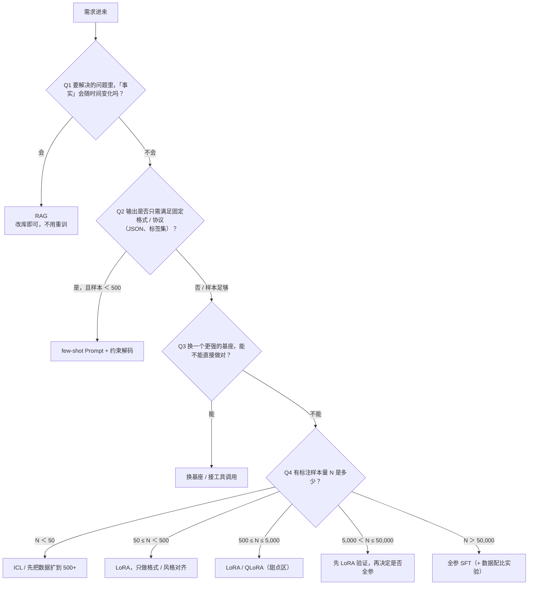

# 微调基础与决策

> **一句话总结**：微调不是默认手段，而是一次"用显存和工程复杂度换行为改变"的投资——先判断要改变的是**知识**、**格式**还是**能力分布**，再决定用 RAG、提示工程还是微调，最后才在"全参 / PEFT / 提示微调"三条路线里选一条。
> **前置知识**：Transformer 与注意力机制；预训练语言模型的 MLM / CLM 目标；LoRA 的公式（见《03-LoRA原理与工程实践》）；基本的 PyTorch 训练循环概念。
> **学完能做到**：
> 1. 拿到一个业务需求，能在 10 分钟内给出"该不该微调、走哪条路线"的决策结论，并说明理由。
> 2. 说清全参微调、PEFT、提示微调三种范式在可训练参数量、显存、推理延迟、适用数据量上的差异。
> 3. 写出参数量与可训练参数占比的估算代码，并识别"数据量太少还硬上微调"这类典型误判。

## 1. 核心概念

### 1.1 三种改造手段的定位

大模型落地时能动的旋钮其实只有三个：**不改权重（提示工程）**、**给权重外挂知识（RAG）**、**改权重（微调）**。它们不是竞争关系，而是解决不同层级的问题。

| 维度 | 提示工程（Prompt / ICL） | RAG（检索增强） | 微调（Fine-tuning） |
| --- | --- | --- | --- |
| 改什么 | 输入文本 | 输入文本 + 外部知识库 | 模型参数 |
| 本质 | 激活已有能力 | 把"事实"从参数里挪到外部 | 改变条件分布 $p_\theta(y\mid x)$ |
| 典型成本 | 0（推理成本略升） | 向量库 + 检索服务 + 推理成本 | 训练算力 + 显存 + 数据标注 |
| 生效速度 | 分钟级 | 天级（建库/切分/调优） | 小时到天级（含数据清洗） |
| 知识更新 | 改 prompt 即可 | 改库即可，**无需重训** | 需重训，且易遗忘 |
| 格式/风格约束 | 不稳定，长 prompt 稀释注意力 | 不解决 | **最擅长** |
| 可解释/可审计 | 好（prompt 可见） | 好（能给出引用来源） | 差（权重黑盒） |
| 数据需求 | 0～几十条示例 | 文档语料 | 数百到数万条标注样本 |
| 上限 | 受基座能力限制 | 受检索质量与基座能力限制 | 可突破基座在特定任务上的上限 |

**一句话记忆**：**知识放 RAG，格式放 Prompt，能力放微调。**

### 1.2 决策表（按需求类型）

| 你的真实需求 | 推荐手段 | 理由 |
| --- | --- | --- |
| 模型不知道最新的内部政策 / 产品价格 | RAG | 事实会变，微调的成本和滞后性不可接受 |
| 输出必须是严格 JSON / SQL / 固定标签集 | 先 Prompt（few-shot + 约束解码），失败再 LoRA | 格式约束是模式问题，PEFT 很便宜就能学会 |
| 输出风格要像公司的客服语气 | LoRA（几百到几千条） | 风格是分布在数据里的，参数量需求低 |
| 要把 7B 模型在某个垂直领域从"会聊"变成"会做" | 全参 SFT 或多轮 LoRA 后合并再全参 | 需要改变的能力面较大 |
| 只是想在测试集上提高几个点 | 先做数据清洗和 prompt 调优 | 80% 的"效果差"来自数据和评测，不是模型容量 |
| 只有 50 条标注数据 | 提示工程 / ICL，或先把数据扩到 500+ | 这个量级微调几乎必然过拟合 |
| 要降低推理成本（要更小的模型） | 蒸馏 / 量化，而非微调 | 微调不改变参数量 |

### 1.3 决策树

把上面的表压成一棵树：按顺序问四个问题，每个问题的答案都会砍掉一部分候选方案。这张图回答的是「按什么顺序问、每个答案分别通向哪个手段」。



**读图要点**：

| 观察 | 含义 |
| --- | --- |
| Q1 问的是「知识会不会变」而不是「任务难不难」 | 事实会变时微调几乎必然滞后，RAG 改库就能生效，所以它必须排在第一位 |
| Q2 在区分「模式问题」与「能力问题」 | 格式是浅层模式，少量样本的 PEFT 就能学会，不值得上全参 |
| 前三个问题都在排除「不该微调」的情况 | 只有 Q1 到 Q3 都答「否」才进入样本量判断，避免默认把微调当成第一手段 |
| Q4 的区间对应一条容量经验曲线 | 数据越少越该用低容量方法（ICL → LoRA → 全参），否则参数量远多于样本，模型只会背下训练集 |
| 整棵树只负责筛选，不负责承诺效果 | 每一步附加的检查（有没有独立评测集、线上调用量撑不撑得起一次性成本）才是能否落地的真正判据 |

每一步都要附加检查：有独立评测集吗？线上调用量撑得起一次性成本吗？

### 1.4 三种训练范式的对比

| 维度 | 全参微调 Full Fine-tuning | 参数高效微调 PEFT（LoRA / Adapter 等） | 提示微调 Prompt / Prefix / P-Tuning |
| --- | --- | --- | --- |
| 可训练参数 | 100%（如 7B 全量） | 0.01%～1%（LoRA 常见 0.1%～0.5%） | 0.001%～0.1% |
| 优化器状态 | 需要（Adam 下约为参数的 2 倍元素数，见 02 篇） | 只需适配器的优化器状态 | 只需 prompt 向量的优化器状态 |
| 7B 训练显存（bf16 + Adam，粗估） | 数十 GB 级，需分片 | 个位数到十几 GB，单卡可跑 | 与 LoRA 同量级或更低 |
| 推理额外延迟 | 无 | 合并后**无**；不合并则有一层小矩阵乘 | 占用序列长度，通常有轻微延迟 |
| 效果上限 | 最高 | 通常接近全参（低秩假设成立时） | 大模型上可用，小模型上明显劣于全参 |
| 多任务切换 | 一个任务一份完整权重 | 一份基座 + 多个小 adapter，可热插拔 | 同左 |
| 灾难性遗忘 | 最严重 | 较轻 | 最轻（基座完全冻结） |
| 典型数据量 | 1 万条以上 | 500～5 万条 | 小样本可用 |
| 调试难度 | 低（就是普通训练） | 中（target_modules、$\alpha/r$ 等超参） | 高（对初始化与学习率敏感） |

> **一句话记忆**：PEFT 的本质是**把"改权重"的搜索空间限制在一个低维子空间里**，用极少的参数量去近似全参微调的更新方向。

### 1.5 什么情况下**不该**微调

| 情形 | 为什么不该 | 应该做什么 |
| --- | --- | --- |
| 需求是"模型知道某个事实" | 事实会变，且微调注入事实极不稳定（容易被复述成"背题"） | RAG；把事实写进检索库 |
| 需求是"输出格式固定" | 格式是浅层模式，prompt + 约束解码常已足够 | few-shot prompt，必要时加 JSON schema 约束 |
| 只有几十条数据 | 参数远多于样本，梯度几乎记住每条样本 | 先做 ICL，或把数据扩到 500 条以上 |
| 没有可靠的评测集 | 无法判断微调是变好还是变差 | 先建 100～300 条评测集，再谈训练 |
| 基座模型压根不具备该能力（如硬算 8 位数乘法） | 微调是"重塑分布"，不是"注入新算法" | 换更强的基座，或接工具调用 |
| 只是为了追热点 / 简历项目 | 全参微调很贵，且可能不如调 prompt + RAG 的组合 | 先做 PEFT 小规模验证 |
| 数据里含有大量隐私 / 未脱敏内容 | 权重会把隐私固化，且难以删除（"被遗忘权"问题） | 脱敏后再训练，或改用 RAG（可删条目） |

### 1.6 数据量与效果的粗略经验关系

下面的区间是**社区经验值**，不是严格结论——它高度依赖任务难度、基座能力和数据质量。把它当作"先验"，不要当作"定律"。

| 标注样本量 | 建议路线 | 经验现象 |
| --- | --- | --- |
| 0～50 | 纯提示工程 / ICL | 微调在此区间几乎总是过拟合；验证集 loss 会先降后升 |
| 50～500 | few-shot prompt；LoRA 仅用于**格式对齐**类任务 | LoRA 可学到格式与语气，学不到新知识 |
| 500～5,000 | LoRA / QLoRA 的甜点区 | 风格、格式、单任务专项通常能达到接近全参的效果 |
| 5,000～50,000 | LoRA 或全参，看显存与迭代速度 | 数据足够时 LoRA 与全参差距开始出现（尤其多能力混合任务） |
| 50,000～500,000 | 全参 SFT | LoRA 容易"容量不够"，表现为训练 loss 降不下去 |
| > 500,000 | 全参 + 更充分的数据配比 / 课程学习 | 进入"数据质量 > 数据数量"的阶段 |

两个值得记住的公开参照：

- **LIMA**（*Less Is More for Alignment*, [arXiv:2305.11206](https://arxiv.org/abs/2305.11206)）用约 **1,000 条**高质量指令数据做 SFT，得到有竞争力的对话模型，作者主张"对齐主要是风格/格式的塑造，而非知识注入"。这支持"少量高质量数据做 SFT 有效"，但它**不等于**"微调能注入新知识"。
- **Self-Instruct**（[arXiv:2212.10560](https://arxiv.org/abs/2212.10560)）用约 **52K** 条自生成指令数据做指令微调，说明这个量级是"用自举数据把指令跟随能力激活"的常见规模。

### 1.7 常见误区表

| 误区 | 真相 | 后果 |
| --- | --- | --- |
| "微调 = 给模型灌知识" | 微调主要改**分布与风格**；事实注入不稳定 | 上线后面对新事实仍然答错 |
| "数据越多越好" | 低质重复数据会放大幻觉和口头禅 | 模型输出退化 |
| "LoRA 一定不如全参" | 在单任务、数据 1k～10k 时，LoRA 常常追平 | 白白花掉 10 倍算力 |
| "训练 loss 降到很低就是好模型" | 可能只是记住了训练集 | 验证集/真实场景崩塌 |
| "PEFT 只能省显存" | 它还省**存储与部署成本**（一份基座 + N 个小 adapter） | 重复存 N 份全参权重 |
| "微调完就能上线" | 还要过评测、安全对齐、推理性能优化 | 线上回归 |
| "学习率沿用全参的 2e-5 就行" | LoRA 常用比全参高一个数量级的学习率 | LoRA 几乎学不动 |

## 2. 关键机制

### 2.1 微调在数学上是什么

预训练学到的是一个通用的条件分布 $p_{\theta_0}(y \mid x)$。下游微调做的事情是：在给定下游数据 $\mathcal{D}=\{(x^{(i)}, y^{(i)})\}_{i=1}^{N}$ 上，寻找参数 $\theta$，使得

$$
\theta^\star=\arg\min_{\theta}\ \mathbb{E}_{(x,y)\sim\mathcal{D}}\left[-\log p_{\theta}(y\mid x)\right]
$$

并且从 $\theta_0$ 出发做**局部**搜索，即 $\theta = \theta_0 + \Delta\theta$，且 $\|\Delta\theta\|$ 被学习率与训练步数隐式约束得很小。

这一条式子解释了微调的所有行为：**它只在你给的数据分布上抬高目标序列的概率，并顺带压低其他序列的概率**。压低的部分就是"遗忘"。

### 2.2 三种范式的参数量与更新空间

设模型总参数量为 $P$。

**全参微调**：可训练参数 $P_{\text{train}} = P$，更新空间是整个 $\mathbb{R}^{P}$。

**LoRA**：对每一个被选中的权重矩阵 $W\in\mathbb{R}^{d\times k}$（约 $d=k$），注入

$$
W' = W + \frac{\alpha}{r}BA,\qquad B\in\mathbb{R}^{d\times r},\ A\in\mathbb{R}^{r\times k}
$$

单个矩阵的新增参数量为

$$
\Delta P_{\text{layer}} = r(d+k) \approx 2dr \quad (d=k)
$$

若模型有 $L$ 个被适配的矩阵，则

$$
P_{\text{train}}^{\text{LoRA}} \approx 2Ldr
$$

而全参是 $P \approx L\cdot c\cdot d^2$（$c$ 为每层里 $d\times d$ 矩阵的个数，Transformer 中典型 $c\ge 4$）。因此占比约为

$$
\frac{P_{\text{train}}^{\text{LoRA}}}{P}\approx \frac{2r}{c\,d}
$$

代入 $r=8,\ d=4096,\ c=4$：$\frac{16}{4\times 4096}\approx 0.098\%$，与实践中"LoRA 可训练参数占 0.1% 量级"的观察一致（**推导**：[03 篇](03-LoRA原理与工程实践.md)会给出更细的逐矩阵算法）。

**提示微调**：只训练输入侧的嵌入向量或前缀。设前缀长度为 $p$、隐藏维度为 $d$，且只在**输入层**加（Prompt Tuning）：

$$
P_{\text{train}}^{\text{PromptTuning}} = p\cdot d
$$

若在**每一层**都加前缀（Prefix-Tuning / P-Tuning v2），则

$$
P_{\text{train}}^{\text{Prefix}} = p\cdot d\cdot L\cdot c_{\text{prefix}}
$$

其中 $c_{\text{prefix}}$ 是该层注入位置的个数（典型 K/V 两处，部分实现含注意力输出）。这解释了 Prefix-Tuning 的参数量会随层数线性放大，而 Prompt Tuning 不会。

### 2.3 为什么"少参数"也能逼近"全参"

这不是魔法，而是两个经验事实的联合结果：

1. **下游任务的更新是低秩的**。LoRA 原论文（[arXiv:2106.09685](https://arxiv.org/abs/2106.09685)）报告，随机投影到 $r=8$ 的子空间或直接取 $\Delta W$ 的前若干奇异向量，就能保留大部分微调收益，说明 $\Delta W$ 的有效秩远小于 $d$。
2. **基座能力是"已有"的**。微调不是在学一门新语言，而是在已有表征上做小幅重加权。零初始化 $B$（即训练起点 $\Delta W = 0$）保证微调从一个"不破坏基座"的点开始，这是 LoRA 相比 Adapter 更稳的原因之一。

反过来，当任务需要**新的能力面**（例如从"中文问答"变成"中文法律文书起草"这种分布跨度很大的任务）时，低秩子空间的容量就不够了，此时 LoRA 与全参的差距会显现——这正是"5000～50000 条数据开始要考虑全参"的经验来源。

### 2.4 遗忘是怎么发生的

设原任务分布为 $p_{\mathcal{A}}$、新任务分布为 $p_{\mathcal{B}}$。微调后的模型在 $\mathcal{B}$ 上变得更好，代价是

$$
D_{\mathrm{KL}}\!\left(p_{\mathcal{A}}(y\mid x)\,\|\,p_{\theta^\star}(y\mid x)\right) > 0
$$

这个 KL 散度随训练步数与学习率单调上升。缓解手段有三类：

| 手段 | 做法 | 代价 |
| --- | --- | --- |
| 参数隔离 | 用 LoRA，冻结基座 | 新能力上限受限 |
| 数据混合 | 在 SFT 数据里掺入 5%～20% 的通用指令数据 | 需要额外数据与配比实验 |
| 正则约束 | 加 KL 项 / 权重 L2 约束 / 只训部分层 | 需要调正则系数 |

从学习率角度看，遗忘强度大致与**参数被移动的总距离**相关。用 $s$ 表示训练步数、$\eta$ 表示学习率，则参数移动上界约为 $\|\Delta\theta\|\lesssim \eta s \cdot \max_t\|\nabla_t\|$（**推导**：对 SGD 迭代做三角不等式展开）。这给了两个可操作结论：**降低学习率**或**减少步数/epoch**都能减轻遗忘；而增大 LoRA 的 $r$ 增加的是更新子空间维度而不是移动距离，因此 LoRA 的遗忘通常比同学习率下的全参更轻。

### 2.5 成本模型：什么时候微调是划算的

设一次性微调成本为 $C_{\text{train}}$，单次推理成本为 $c_{\text{inf}}$，prompt 带来的额外 token 成本为 $c_{\text{prompt}}$，预计请求量为 $Q$。则微调划算的条件大致是：

$$
C_{\text{train}} < Q\cdot\left(c_{\text{prompt}}^{\text{few-shot}} - c_{\text{inf}}^{\text{fine-tuned}}\right)
$$

也就是说，**微调是"用一次性训练成本换长期推理成本与稳定性"**。当 $Q$ 很小（例如内部工具每天几十次调用）时，即使技术可行，经济上也常常不划算——这是最容易被忽略的一条决策依据。

## 3. 可运行示例

下面的脚本**不依赖 torch/transformers**，只用标准库：它把你对任务的描述转成一个决策结论，并顺带估算三种范式的可训练参数量。它验证的是本篇的决策逻辑，而不是模型效果。

依赖：Python 3.8+（仅标准库）。

```python
# -*- coding: utf-8 -*-
"""
微调决策器 + 可训练参数量估算器

用法：
    python finetune_decision.py            # 跑内置示例
    python finetune_decision.py --demo      # 同上

不依赖 torch / transformers，只做决策规则与参数量算术。
"""

from __future__ import annotations

import argparse
from dataclasses import dataclass, field


@dataclass
class TaskProfile:
    """描述你要解决的问题。"""

    goal: str                      # "knowledge" | "format" | "style" | "capability"
    n_samples: int                 # 可用标注样本量
    has_eval_set: bool = True      # 是否有独立评测集
    facts_change_frequently: bool = False
    base_can_do_it: bool = True    # 换更强的基座是否能解决
    requests_per_day: int = 1000   # 预计线上调用量
    privacy_sensitive: bool = False


@dataclass
class Decision:
    route: str
    reasons: list = field(default_factory=list)
    warnings: list = field(default_factory=list)


def decide(p: TaskProfile) -> Decision:
    """规则式决策。规则来自本篇 1.2 / 1.4 的决策表。"""
    reasons, warnings = [], []

    if not p.has_eval_set:
        warnings.append("没有独立评测集：先建 100~300 条评测集，否则无法判断微调是否变好。")

    if p.privacy_sensitive:
        warnings.append("数据含敏感信息：优先 RAG（条目可删），或先脱敏再训练。")

    if p.facts_change_frequently or p.goal == "knowledge":
        reasons.append("目标是注入/更新事实，且事实可能变化 → 用 RAG 而非微调。")
        return Decision("RAG", reasons, warnings)

    if p.goal == "format" and p.n_samples < 500:
        reasons.append("目标是格式约束且样本不足 → 先 few-shot prompt + 约束解码。")
        return Decision("Prompt(few-shot) ± 约束解码", reasons, warnings)

    if not p.base_can_do_it:
        reasons.append("基座本身不具备该能力（微调不注入新算法）→ 换更强基座或接工具。")
        return Decision("换基座 / 工具调用", reasons, warnings)

    if p.n_samples < 50:
        reasons.append(f"样本仅 {p.n_samples} 条，远低于 LoRA 的经验下限 → 先 ICL。")
        return Decision("Prompt(ICL)", reasons, warnings)

    if p.n_samples < 500:
        reasons.append(f"{p.n_samples} 条样本属于{'格式/风格' if p.goal in ('format', 'style') else '偏少'}区间 → LoRA 只做格式/风格对齐。")
        route = "LoRA（小 r，强正则，密切监控验证集）"
        if p.goal == "capability":
            warnings.append("样本量对能力改造偏少，预期只能小幅提升。")
        return Decision(route, reasons, warnings)

    if p.n_samples <= 5000:
        reasons.append(f"{p.n_samples} 条落在 LoRA 甜点区（500~5000）→ 优先 LoRA / QLoRA。")
        if p.requests_per_day < 200:
            warnings.append("线上调用量很低：微调的一次性成本可能不划算，先算经济账。")
        return Decision("LoRA / QLoRA", reasons, warnings)

    if p.n_samples <= 50000:
        reasons.append(f"{p.n_samples} 条：LoRA 与全参都可，看显存与迭代速度。")
        return Decision("LoRA（先验证）→ 全参（数据够时）", reasons, warnings)

    reasons.append(f"{p.n_samples} 条：数据量已足以支撑全参 SFT。")
    return Decision("全参 SFT", reasons, warnings)


def trainable_params_estimate(
    total_params_b: float,
    hidden: int = 4096,
    n_layers: int = 32,
    targets_per_layer: int = 4,
    lora_rank: int = 8,
    prompt_len: int = 20,
    prefix_layers: int = 0,
) -> dict:
    """估算三种范式的可训练参数量（单位：百万参数, M）。

    推导：
      - LoRA 每个被适配的 d×d 矩阵新增 r*(d+d) = 2*r*d 个参数；
        全参对应 d*d 个参数。
      - Prompt Tuning 只在输入层加 prompt_len 个 d 维向量。
      - Prefix-Tuning 在 prefix_layers 层的 K/V 两处各加 prefix 个 d 维向量（近似 2 倍）。
    """
    d = hidden
    per_matrix_full = d * d
    per_matrix_lora = 2 * lora_rank * d

    lora_total = n_layers * targets_per_layer * per_matrix_lora
    full_total = int(total_params_b * 1e9)
    prompt_tuning_total = prompt_len * d
    prefix_total = prefix_layers * 2 * prompt_len * d

    return {
        "full_M": full_total / 1e6,
        "lora_M": lora_total / 1e6,
        "lora_ratio_pct": 100.0 * lora_total / full_total,
        "prompt_tuning_M": prompt_tuning_total / 1e6,
        "prefix_M": prefix_total / 1e6,
        "per_matrix_full_M": per_matrix_full / 1e6,
        "per_matrix_lora_param": per_matrix_lora,
    }


def main() -> None:
    parser = argparse.ArgumentParser(description="微调决策器")
    parser.add_argument("--demo", action="store_true", help="跑内置示例任务")
    parser.parse_args()

    demos = [
        TaskProfile(goal="knowledge", n_samples=0, facts_change_frequently=True),
        TaskProfile(goal="format", n_samples=300),
        TaskProfile(goal="style", n_samples=2000),
        TaskProfile(goal="capability", n_samples=12000),
        TaskProfile(goal="style", n_samples=30),
    ]

    for idx, profile in enumerate(demos, 1):
        d = decide(profile)
        print(f"[示例 {idx}] goal={profile.goal:<10} n={profile.n_samples:<6} -> 路线: {d.route}")
        for r in d.reasons:
            print(f"    理由: {r}")
        for w in d.warnings:
            print(f"    注意: {w}")
        print()

    print("== 7B 模型（d=4096, L=32, 每层 4 个目标矩阵, r=8）可训练参数估算 ==")
    est = trainable_params_estimate(7000.0, hidden=4096, n_layers=32,
                                    targets_per_layer=4, lora_rank=8,
                                    prompt_len=20, prefix_layers=32)
    print(f"  全参            : {est['full_M']:.0f} M (100%)")
    print(f"  LoRA(r=8)       : {est['lora_M']:.2f} M ({est['lora_ratio_pct']:.3f}%)")
    print(f"  Prompt Tuning   : {est['prompt_tuning_M']:.3f} M")
    print(f"  Prefix-Tuning   : {est['prefix_M']:.3f} M")
    print(f"  单个 d×d 矩阵全参 {est['per_matrix_full_M']:.2f} M，LoRA 新增 {est['per_matrix_lora_param']} 个参数")


if __name__ == "__main__":
    main()
```

## 4. 常见坑

| 现象 | 原因 | 解决 |
| --- | --- | --- |
| 训练 loss 一路下降，但线上效果变差 | 数据有泄漏或高度重复模板，模型在背样本 | 划分严格独立的验证集；对 prompt 模板做去重与多样性检查 |
| LoRA 训完后输出变得很短、总以某句话开头 | 训练数据里 EOS / 结尾模板单一 | 检查 EOS 处理，混入通用数据，降低 epoch |
| 微调后模型"变笨了"，通用能力下降 | 灾难性遗忘 | 掺入 5%～20% 通用指令数据；降学习率；只训部分层 |
| 用 RAG 能解决的场景硬做了微调 | 把可变事实固化进权重 | 回到决策表：知识类需求优先 RAG |
| 说明文档写了"提升了 15%"，但没人能复现 | 没有固定评测集与随机种子 | 建评测集、固定种子、记录数据版本 |
| 只有 80 条数据却报告了"微调成功" | 验证集是从同样 80 条里切的 | 用留出法 + 交叉验证，且报告方差 |
| PEFT 选了一大堆 target_modules 但效果没提升 | 参数量涨了，但任务本就不需要那么大容量 | 先固定 $r=8$、只调 Q/V，做消融再扩 |
| 部署时发现显存不够 | 只算了权重，没算 KV cache 与并发 | 把推理侧显存单独建账 |

## 5. 面试问答

**Q1：什么情况下你会建议不要微调？**

<details markdown="1">
<summary markdown="1">参考答案</summary>

三类情况优先排除微调：

1. **需求本质是"知识"而非"能力"**。模型要回答会变化的事实（价格、政策、库存），微调注入事实既不可靠也不可维护，改一次知识就要重训一次。这类需求应交给 RAG。
2. **需求本质是"格式/协议"**。要求输出固定 JSON、固定标签集时，few-shot prompt 加约束解码（JSON Schema、grammar-constrained decoding）通常就能解决，即便不行，用 LoRA 学格式也只需要数百条数据，成本极低——但顺序上应先试 prompt。
3. **数据或评测条件不成立**。样本只有几十条、或者没有独立评测集时，微调无法被验证，也没有足够信号去拟合，结果是"既没有效果，也不知道有没有效果"。此时应先做 ICL 或补数据/补评测。

补充一条经济性判据：如果线上调用量很低，一次性训练成本无法被长期推理节省摊薄，工程上也应选择 prompt/RAG。

</details>

**Q2：LoRA 为什么能用 0.1% 的参数接近全参微调？**

<details markdown="1">
<summary markdown="1">参考答案</summary>

两个层面：

- **经验层面**：LoRA 论文的奇异值分析显示，微调产生的 $\Delta W$ 的有效秩远小于矩阵维数，把更新投影到随机 $r=8$ 子空间都能保留大部分收益。也就是说，全参微调虽然搜索空间是 $\mathbb{R}^{P}$，但真正被用到的方向很少。
- **机制层面**：微调是在预训练表征上做小幅重加权，不是从零学任务；LoRA 用 $B$ 零初始化保证训练起点 $\Delta W=0$ 与基座完全一致，因此优化是"从等价点出发的受限搜索"，比 Adapter 那种插入新随机层更好训。

什么时候这条不成立？任务分布跨度大、需要新的能力面，或数据量很大（数万条以上、多能力混合）时，低秩子空间容量不足，训练 loss 下不去，此时 LoRA 明显不如全参。

</details>

**Q3：给定一个具体业务，你怎么定量论证"微调值得做"？**

<details markdown="1">
<summary markdown="1">参考答案</summary>

分三步给出证据：

1. **基线对比**：固定评测集（100～300 条），跑三档基线：zero-shot prompt、few-shot prompt、RAG（如果适用）。得到基线分数与失败案例分类。
2. **失败归因**：把失败样例归类为"知识缺失 / 格式不符 / 风格不符 / 能力不足"。只有后三类才指向微调，且不同类别对应不同方案（格式→LoRA 小 r；风格→LoRA 中等 r；能力→全参）。
3. **成本账**：估算一次性训练成本与长期推理成本的变化，用 $C_{\text{train}} < Q(c_{\text{prompt}} - c_{\text{inf}})$ 判断是否划算；同时给出 PEFT 优先的渐进路线（先 LoRA 验证上限，再决定是否全参）。

最后一定要说明：微调后必须回归通用能力评测（防止灾难性遗忘），并保留可回滚的旧版本。

</details>

## 6. 自测题

**1. 你的任务是"让模型按公司统一话术回复退款咨询"，现有 1,200 条人工对话。选哪条路线，为什么？**

<details markdown="1">
<summary markdown="1">参考答案</summary>

LoRA（或 QLoRA）。理由：这是典型的**风格 + 格式**对齐任务，不是知识注入；1,200 条落在 LoRA 甜点区；可训练参数占比约 0.1%，单卡即可完成。上线前用独立评测集验证"话术一致性"和"信息准确性"两项指标，并混入少量通用数据防止话术过拟合。若追求极致效果且显存充足，可再对比一次全参微调。

</details>

**2. 为什么"输入侧 prompt 向量"的参数量不随层数增长，而 Prefix-Tuning 会？**

<details markdown="1">
<summary markdown="1">参考答案</summary>

Prompt Tuning 只在 embedding 层注入 $p$ 个可训练的 $d$ 维向量，参数量为 $p\cdot d$，与层数无关。Prefix-Tuning 在**每一层**的注意力 K/V（部分实现还包括其他位置）前拼接可训练前缀，因此参数量约为 $p\cdot d\cdot L\cdot c$，随层数 $L$ 线性增长。这也是 P-Tuning v2 在小模型上效果更好的原因：把可训练参数分布到所有层，优化信号更充分。

</details>

**3. 一个团队微调后报告"loss 从 2.3 降到 0.15"，但线上效果差。列出至少三个可能原因。**

<details markdown="1">
<summary markdown="1">参考答案</summary>

① 训练集与验证集存在同模板泄漏，模型只是记住了模板；② 学习率或 epoch 过大导致过拟合，且没有独立评测集；③ 训练数据与线上输入分布不一致（线上更长、含多轮、含口语，训练数据是干净单轮）；④ 未处理 EOS / chat template，导致推理时截断或格式错位；⑤ 只看 loss 没看任务指标，loss 下降可能来自"输出变短"这种捷径。

</details>

**4. 计算：$d=4096$、$r=16$ 时，单个 $d\times d$ 权重矩阵的 LoRA 新增参数量是多少？占总参数量（$d^2$）的百分比是多少？**

<details markdown="1">
<summary markdown="1">参考答案</summary>

LoRA 新增 $r(d+d)=2rd=2\times16\times4096=131{,}072$ 个参数；全参为 $d^2=16{,}777{,}216$。占比 $131072/16777216=0.78125\%$。注意这是"单个矩阵"的占比；由于模型里大部分参数并不都在被适配的矩阵上，全模型的占比会更低（例如 7B 模型上约 0.2%～0.5%）。

</details>

**5. 什么信号说明"数据量已经足够支撑全参微调"？**

<details markdown="1">
<summary markdown="1">参考答案</summary>

观察 LoRA 训练时的两条曲线：如果**训练 loss 已经降到很低，但验证集指标明显低于同任务的文献/全参基线**，并且增大 $r$（如 8→32→64）收益迅速饱和，说明瓶颈在**子空间容量**而非数据量或优化，此时应转向全参微调。反之若训练 loss 都降不下去，问题在数据或超参，加大参数量无用。经验上这个分界常出现在数千到数万条样本之间，但必须用消融实测，不能凭区间拍板。

</details>

## 7. 延伸阅读

- [LoRA: Low-Rank Adaptation of Large Language Models (arXiv:2106.09685)](https://arxiv.org/abs/2106.09685) —— 低秩假设的原始实证，含 $\Delta W$ 的秩分析。
- [QLoRA: Efficient Finetuning of Quantized LLMs (arXiv:2305.14314)](https://arxiv.org/abs/2305.14314) —— 量化基座 + LoRA 的组合。
- [LIMA: Less Is More for Alignment (arXiv:2305.11206)](https://arxiv.org/abs/2305.11206) —— 1,000 条高质量数据做 SFT 的经典对照。
- [Self-Instruct: Aligning Language Models with Self-Generated Instructions (arXiv:2212.10560)](https://arxiv.org/abs/2212.10560) —— 约 52K 自举指令数据的构造方式。
- [Training language models to follow instructions with human feedback (arXiv:2203.02155)](https://arxiv.org/abs/2203.02155) —— SFT → RM → PPO 的完整三阶段。
- [HuggingFace PEFT 文档](https://huggingface.co/docs/peft/index) —— PEFT 各方法的统一接口与配置项。
- [HuggingFace TRL SFTTrainer](https://huggingface.co/docs/trl/sft_trainer) —— 开箱即用的 SFT 训练器，便于对照手写循环。
- [The Power of Scale for Parameter-Efficient Prompt Tuning (arXiv:2104.08691)](https://arxiv.org/abs/2104.08691) —— Prompt Tuning 的原始论文。
- [Prefix-Tuning: Optimizing Continuous Prompts for Generation (arXiv:2101.00190)](https://arxiv.org/abs/2101.00190) —— 逐层前缀的原始论文。
- [P-Tuning v2 (arXiv:2110.07602)](https://arxiv.org/abs/2110.07602) —— 跨规模可比的逐层提示微调。

---

[⬅️ 返回本章目录](README.md)
