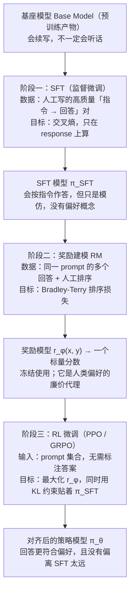
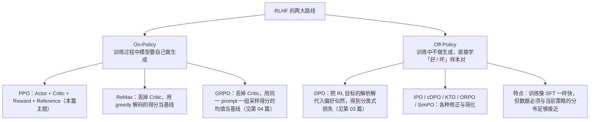
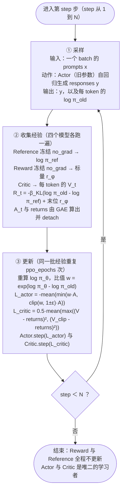

> **一句话总结**：对齐（alignment）要解决的问题是「预训练目标（最大化下一个词的对数似然）与人类真正想要的回答不一致」，RLHF 用「SFT → 奖励模型 → 强化学习」三阶段把这种不一致一点点纠回来，其中强化学习阶段用 PPO 在四个模型（Actor / Critic / Reward / Reference）之间做一次带 KL 约束的策略优化。
> **前置知识**：Transformer 与自回归语言模型、交叉熵与最大似然、softmax 与对数概率、梯度的基本概念；了解「SFT 微调」是什么。有强化学习的策略（policy）与奖励（reward）概念更好，没有也能读，本文把需要的部分从头推导。
> **学完能做到**：1. 用「目标不一致」这条主线讲清楚为什么预训练完的模型必须做后训练，以及 SFT / RM / RL 三个阶段各自补上了什么缺口；2. 逐个说出 PPO 四个模型的输入、输出、参数是否冻结，并写出 Actor loss 与 Critic loss 的完整公式；3. 独立推导「KL 惩罚项为什么能防止过度优化奖励模型」，并在给定的一组日志概率上手算一遍 reward / advantage / 裁剪后的 actor loss。

## 1. 核心概念

### 1.1 预训练目标与人类偏好为什么不是一回事

自回归语言模型的预训练目标是最大化语料的对数似然：

$$\max_{\theta}\ \mathbb{E}_{x \sim \mathcal{D}}\left[\sum_{t=1}^{|x|} \log \pi_\theta(x_t \mid x_{<t})\right]$$

这个目标只要求模型「把训练语料里出现过的文本模式复现出来」。它有三个结构性的缺口：

| 缺口 | 预训练目标的行为 | 人类真正想要的 | 后果举例 |
|---|---|---|---|
| 目标函数错位 | 提高语料中所有文本的概率，不管好坏 | 提高「有帮助、无害、诚实」回答的概率 | 模型会认真复现网络上的错误信息与攻击性文本 |
| 缺少「问—答」结构 | 只学「下一个词是什么」 | 学「被问到时该怎么答」 | 输入提问，模型可能续写出更多提问 |
| 无法表达偏好与拒绝 | 没有「这个回答比那个回答好」的表示 | 需要排序、需要学会说「我不知道」 | 编造事实（幻觉）、过度顺从、不会拒答 |

用一张更直观的对照表说明监督学习与强化学习在「反馈粒度」上的差别：

| 维度 | 预训练 / SFT（监督） | RLHF（强化学习） |
|---|---|---|
| 反馈单位 | 每个 token 的交叉熵 | 整条 response 的一个标量分数 |
| 反馈来源 | 语料里「正确的续写」 | 人类排序 → 奖励模型打分 |
| 学到的信号 | 「像训练数据」（模仿） | 「人类更喜欢」（偏好） |
| 擅长 | 格式、知识、语言能力 | 有帮助性、无害性、拒答、语气 |
| 典型失效 | 幻觉、答非所问、不安全输出 | 奖励作弊、能力退化、输出多样性塌缩 |

一句话概括：**监督学习告诉模型「照着我给的写」，强化学习告诉模型「你自己写，我告诉你写得好不好」**。

### 1.2 后训练三阶段全景

这张图回答的是：从基座模型到一个对齐模型，三个阶段各自吃什么数据、优化什么目标、又产出什么。



**读图要点**：

| 观察 | 含义 |
| --- | --- |
| 三阶段是串行依赖，不是并列可选项 | RM 由 SFT 模型初始化才收敛快，RL 又必须有 RM 才能打分，少一环就断链 |
| 监督信号一路在变「粗」 | SFT 是逐 token 交叉熵 → RM 是整条回答一个排序 → RL 是整条回答一个标量奖励，信息越来越稀疏 |
| RM 在第三阶段是冻结的 | 它只是人类偏好的廉价代理，训练中不更新；这也意味着 RM 的偏差会原样传导给策略 |
| KL 约束的对象是 π_SFT 而不是 Base | 贴着 SFT 走，是为了不把监督学习阶段已经学到的格式与语言能力丢掉 |
| 产出是「对齐后的策略」而非「更聪明的模型」 | 这一阶段提升的是有帮助性、无害性与语气，知识上限仍由预训练决定 |

三个阶段的分工可以用一句话记住：**SFT 教格式，RM 学偏好，RL 换目标函数**。

### 1.3 RLHF 的四个模型

在 RLHF 的 PPO 阶段，显存里同时存在四个同规模模型：

| 角色 | 作用 | 是否训练 | 典型初始化 | 输入 → 输出 |
|---|---|---|---|---|
| Actor（策略） | 生成 response，是被优化的对象 | ✅ 训练 | SFT 模型 | prompt → response（含每 token log 概率） |
| Critic（价值） | 预测「从当前 token 起的期望总收益」$V_t$，给优势做基线 | ✅ 训练 | 由 Reward 模型初始化（加 value head） | prompt+response → 每 token 一个标量 $V_t$ |
| Reward | 给整条 response 打分，代表「即时收益」 | ❄️ 冻结 | 阶段二训好的 RM | prompt+response → 一个标量 $r_\phi$ |
| Reference | 提供 $\pi_{\text{ref}}$，用于算 KL 惩罚 | ❄️ 冻结 | SFT 模型（与 Actor 同源） | prompt+response → 每 token log 概率 |

**关键对应关系**：在「NLP 即强化学习」的视角下，状态 $S_t$ 是「prompt + 已生成的前 $t-1$ 个 token」，动作 $A_t$ 是「第 $t$ 个 token」，动作空间是词表 $V$，而 Actor 是智能体本身。

| 强化学习概念 | 语言模型中的对应 |
|---|---|
| 状态 $S_t$ | 上文 $x_{<t}$（prompt + 已生成 token） |
| 动作 $A_t$ | 第 $t$ 个 token |
| 动作空间 $\mathcal{A}$ | 词表 $V$（几万到十几万维） |
| 策略 $\pi_\theta(A_t\mid S_t)$ | 模型输出的 softmax 概率 |
| 即时收益 $R_t$ | 只有最后一个 token 位置有 RM 分数，其余位置只体现 KL 约束 |
| 总收益 $V_t$ | Critic 预测的「从 $t$ 到结束」的期望收益 |
| 轨迹终止 | 生成结束符 EOS 或达到最大长度 |

> **补充解释**：为什么只有最后一个 token 位置拿到 RM 分数？因为 Reward 模型训练时就是用「整条 response 的最后一个有效 token 位置的输出」作为整条回答的分数。中间位置没有客观奖励可标，于是用「是否偏离 Reference」这种可计算的信号来填充，具体见 2.4 节。

### 1.4 On-Policy 与 Off-Policy 两条路线

这张图回答的是：RLHF 的两条技术路线各自包含哪些方法，以及它们分别省掉了什么。



**读图要点**：

| 观察 | 含义 |
| --- | --- |
| 分界线是有没有 `model.generate()` | 有生成就是 On-Policy；逐 token 串行生成极慢，这正是 On-Policy 方法耗卡又耗时的主因 |
| On-Policy 一侧的方法都在砍模型数量 | PPO 要四个模型，ReMax 砍掉 Critic，GRPO 再进一步用组内均值当基线 |
| Off-Policy 把代价从算力转移到了数据 | 训练像 SFT 一样快，但要求数据分布与当前策略足够接近，否则目标函数的前提不成立 |
| DPO 及其变体是一族修正而非单个算法 | IPO / cDPO / KTO / ORPO / SimPO 分别针对偏好强度、噪声标签、无配对数据等场景做简化 |
| 两条路线的收益与风险是对称的 | On-Policy 数据完全匹配当前模型、上限更高但昂贵；Off-Policy 便宜但更容易被分布偏移反噬 |

判定标准很简单：**训练循环里有没有 `model.generate()`，有就是 On-Policy**。生成是逐 token 串行进行的，非常慢，这正是 On-Policy 方法耗卡又耗时的主要原因；但代价换来的好处是训练数据「百分之百匹配当前模型自己」，理论上效果上限更高。

## 2. 数学推导

> **说明**：本节基于公开论文整理。

### 2.1 从策略梯度定理到 REINFORCE

先把「生成一段回答」当成一条轨迹 $\tau=(a_1,\dots,a_T)$，其中 $a_t$ 是第 $t$ 个 token。我们想最大化期望奖励：

$$J(\theta)=\mathbb{E}_{\tau\sim\pi_\theta}\left[r(\tau)\right]$$

**第一步：把期望写成求和形式。**

$$J(\theta)=\sum_{\tau} P_\theta(\tau)\, r(\tau),\qquad P_\theta(\tau)=\prod_{t=1}^{T}\pi_\theta(a_t\mid s_t)$$

**第二步：对 $\theta$ 求梯度，注意只有 $P_\theta(\tau)$ 依赖 $\theta$。**

$$\nabla_\theta J(\theta)=\sum_{\tau} \nabla_\theta P_\theta(\tau)\, r(\tau)$$

**第三步：用对数导数技巧（log-derivative trick）。** 因为 $\nabla_\theta \log P_\theta(\tau)=\dfrac{\nabla_\theta P_\theta(\tau)}{P_\theta(\tau)}$，所以 $\nabla_\theta P_\theta(\tau)=P_\theta(\tau)\nabla_\theta\log P_\theta(\tau)$。代回：

$$\nabla_\theta J(\theta)=\sum_\tau P_\theta(\tau)\,\nabla_\theta\log P_\theta(\tau)\,r(\tau)=\mathbb{E}_{\tau\sim\pi_\theta}\left[r(\tau)\,\nabla_\theta\log P_\theta(\tau)\right]$$

**第四步：把轨迹的联合对数概率拆开。** 注意 $P_\theta(\tau)=\prod_t\pi_\theta(a_t\mid s_t)$，取对数后求和：

$$\nabla_\theta\log P_\theta(\tau)=\sum_{t=1}^{T}\nabla_\theta\log\pi_\theta(a_t\mid s_t)$$

于是

$$\boxed{\ \nabla_\theta J(\theta)=\mathbb{E}_{\tau\sim\pi_\theta}\left[\sum_{t=1}^{T} r(\tau)\,\nabla_\theta\log\pi_\theta(a_t\mid s_t)\right]\ }$$

这就是 REINFORCE。它有一个致命缺陷：**每一条轨迹只有一个最终标量 $r(\tau)$，却要用它去乘 $T$ 个随机变量之和**。$T$ 个随机变量的方差直接相加，梯度方差随句子长度线性甚至更快增长，训练几步 reward 就会崩掉。

### 2.2 基线与优势函数：降方差且不引入偏差

**引理（基线无偏）**：对任意只依赖状态 $s_t$ 的函数 $b(s_t)$，

$$\mathbb{E}_{a_t\sim\pi_\theta}\left[b(s_t)\nabla_\theta\log\pi_\theta(a_t\mid s_t)\right]=b(s_t)\sum_{a}\pi_\theta(a\mid s_t)\nabla_\theta\log\pi_\theta(a\mid s_t)=b(s_t)\sum_a \nabla_\theta\pi_\theta(a\mid s_t)=b(s_t)\nabla_\theta\underbrace{\sum_a \pi_\theta(a\mid s_t)}_{=1}=0$$

**证明只用到了 $\nabla_\theta\log p=\nabla_\theta p/p$ 与概率之和为 1 这两个事实**。所以减去任意状态相关基线都不改变期望梯度，只改变方差。把「未来收益」的期望提出来，就得到

$$\nabla_\theta J(\theta)=\mathbb{E}\left[\sum_{t}\underbrace{\big(r(\tau)-b(s_t)\big)}_{\text{优势的朴素形式}}\nabla_\theta\log\pi_\theta(a_t\mid s_t)\right]$$

严格的优势函数定义为 $A_t=Q(s_t,a_t)-V(s_t)$，其中

$$V(s_t)=\mathbb{E}\left[\sum_{t'\ge t}\gamma^{t'-t}R_{t'}\ \middle|\ s_t\right],\qquad Q(s_t,a_t)=\mathbb{E}\left[\sum_{t'\ge t}\gamma^{t'-t}R_{t'}\ \middle|\ s_t,a_t\right]$$

**其中 $\gamma$ 是折扣因子**，用于决定未来收益折算到当下的权重。Critic 网络要拟合的就是 $V(s_t)$。

### 2.3 PPO 目标：从重要性采样到裁剪

**第一步：一次采样、多次更新引出重要性采样。** 采样一次经验需要四个模型各跑一遍前向 + Actor 跑一遍生成，极其昂贵。所以想用同一批经验更新 `ppo_epochs` 次。若用旧策略 $\pi_{\theta_{old}}$ 采的样本去估计新策略 $\pi_\theta$ 的期望，需要用重要性权重 $w_t=\dfrac{\pi_\theta(a_t\mid s_t)}{\pi_{\theta_{old}}(a_t\mid s_t)}$：

$$\nabla_\theta J(\theta)=\mathbb{E}_{a_t\sim\pi_{\theta_{old}}}\left[w_t\,A_t\,\nabla_\theta\log\pi_\theta(a_t\mid s_t)\right]$$

**第二步：把梯度还原成损失。** 因为 $\nabla_\theta w_t = w_t\nabla_\theta\log\pi_\theta$，于是 $w_t A_t\nabla_\theta\log\pi_\theta = A_t \nabla_\theta w_t = \nabla_\theta (A_t w_t)$，因此可得目标

$$J_{IS}(\theta)=\mathbb{E}_{a_t\sim\pi_{\theta_{old}}}\left[w_t\,A_t\right]$$

**第三步：给 $w_t$ 加裁剪。** 若 $w_t$ 偏离 1 太多，重要性采样估计的方差会爆炸，甚至把策略带跑偏。PPO 的做法是把 $w_t$ 截断在 $[1-\epsilon,1+\epsilon]$，并取「原始项」与「截断项」中更悲观的那个：

$$L^{CLIP}(\theta)=\mathbb{E}_{t}\left[\min\Big(w_t A_t,\ \operatorname{clip}(w_t,1-\epsilon,1+\epsilon)\,A_t\Big)\right]$$

**为什么取 min？** 分两种情况看：

| 优势符号 | 未截断项的含义 | 截断后的效果 |
|---|---|---|
| $A_t>0$ | 想增大 $w_t$（提高该 token 概率） | 当 $w_t>1+\epsilon$ 时，$\text{clip}=1+\epsilon$ 成为 min，梯度对该样本归零 → 不再过度上调 |
| $A_t<0$ | 想减小 $w_t$（降低该 token 概率） | 当 $w_t<1-\epsilon$ 时，$\text{clip}=1-\epsilon$ 成为 min，梯度归零 → 不再过度下调 |

也就是说，**一旦更新幅度超出 $[1-\epsilon,1+\epsilon]$，这个 token 就不再产生梯度**，等价于「走太远了就停下来」。在实现上等价于对 ratio 做 $\exp$ 后再算：

```text
log_ratio = logprobs - old_logprobs
ratio     = exp(log_ratio)
pg_loss   = -mean( min(advantages * ratio,
                       advantages * clip(ratio, 1-eps, 1+eps)) * mask )
```

### 2.4 Actor loss 的完整形式与 RLHF 特有的奖励设计

综合以上，RLHF 的 Actor loss 是

$$L^{Actor}(\theta)=-\,\mathbb{E}_{t}\left[\min\Big(w_t A_t,\ \operatorname{clip}(w_t,1-\epsilon,1+\epsilon) A_t\Big)\right],\qquad w_t=\frac{\pi_\theta(a_t\mid s_t)}{\pi_{\theta_{old}}(a_t\mid s_t)}$$

其中优势由 GAE 从后往前递推：

$$A_t=\delta_t+\gamma\lambda A_{t+1},\qquad \delta_t=R_t+\gamma V_{t+1}-V_t,\qquad A_{T+1}=0$$

**这里 $R_t$ 的设计是 RLHF 与普通 RL 最大的不同。** 由于只有最后一个 token 位置有 RM 分数，其余位置的即时奖励用「与 Reference 的 KL 惩罚」填充：

$$R_t=\begin{cases}-\beta_{KL}\Big(\log\pi_\theta(a_t\mid s_t)-\log\pi_{\text{ref}}(a_t\mid s_t)\Big), & t\ne T\\[4pt] -\beta_{KL}\Big(\log\pi_\theta(a_t\mid s_t)-\log\pi_{\text{ref}}(a_t\mid s_t)\Big)+r_\phi(x,y), & t=T\end{cases}$$

**逐步理解这个设计：**

1. $\log\pi_\theta-\log\pi_{\text{ref}}$ 是 KL 散度的单样本估计：$D_{KL}(\pi_\theta\|\pi_{\text{ref}})=\mathbb{E}_{a\sim\pi_\theta}\left[\log\frac{\pi_\theta(a\mid s)}{\pi_{\text{ref}}(a\mid s)}\right]$，所以每生成一个 token，就累积了一份「偏离惩罚」。
2. 写成 $-\beta_{KL}(\log\pi_\theta-\log\pi_{\text{ref}})$ 后，**模型越认同某个 token（$\pi_\theta$ 越大），惩罚越大**——这正是在说「不要离 Reference 太远」。
3. 只有 $t=T$ 才加上真正的任务奖励 $r_\phi(x,y)$，因为只有终点的分数才代表整条回答的质量。中间位置的收益信号完全来自 KL 约束。
4. 实践上 $r_\phi$ 还会被裁剪到 $[-c,c]$（如 $c=5$），避免个别极端打分把优势打爆。
5. $\beta_{KL}$（deepspeed-chat 里的 `kl_ctl`）默认约 $0.1$，是控制「奖励信号」与「不跑偏约束」相对权重的关键旋钮。

### 2.5 GAE 的递推与「从后往前」计算

GAE 的定义式本身就是递推式，所以可以从最后一个位置开始倒推：

$$\underbrace{A_T=\delta_T}_{\text{因为 }A_{T+1}=0}\ \Longrightarrow\ A_{T-1}=\delta_{T-1}+\gamma\lambda A_T\ \Longrightarrow\ \cdots$$

**实际收益（returns）的推导**：

$$\text{returns}_t=A_t+V_t=\delta_t+\gamma\lambda A_{t+1}+V_t=\big(R_t+\gamma V_{t+1}-V_t\big)+\gamma\lambda A_{t+1}+V_t=R_t+\gamma\big(V_{t+1}+\lambda A_{t+1}\big)$$

$$=R_t+\gamma V_{t+1}^{\text{target}}$$

其中 target 就是 Critic 的回归目标。**回推过程只遍历 response 部分。**

### 2.6 Critic loss 的推导

Critic 的任务是让预测值 $V_t$ 逼近「实际收益」。最朴素的平方误差是

$$L^{VF}=\mathbb{E}_t\left[\big(V_t-\text{return}_t\big)^2\right]$$

因为 return 里含有旧 Critic 的估计（$A_t$ 与 $V_t$ 都来自采样时刻的模型），而在 `ppo_epochs` 内 $V_t$ 会不停更新，所以同样要用旧值做裁剪：

$$V_t^{clip}=\operatorname{clip}\big(V_t,\ V_t^{old}-\epsilon_v,\ V_t^{old}+\epsilon_v\big)$$

$$L^{Critic}(\phi)=\frac{1}{2}\,\mathbb{E}_t\left[\max\Big(\big(V_t-\text{return}_t\big)^2,\ \big(V_t^{clip}-\text{return}_t\big)^2\Big)\right]$$

**取 max 与 Actor 侧取 min 是对偶的**：Actor 侧是「对提升奖励的幅度设上限」，Critic 侧是「对价值函数变化的幅度设上限」，都为了保证一轮经验能被安全地复用多次。

### 2.7 KL 惩罚为什么必要（reward hacking 的一阶解释）

**先说结论**：KL 惩罚不是为了让训练更稳这么简单，它本质上是在**对真实偏好做悲观下界优化**。

设真实（人类）偏好对应的最优奖励为 $r^\star$，而我们只有学到的代理奖励 $r_\phi$，并设代理奖励的误差有界：$|r_\phi(x,y)-r^\star(x,y)|\le \varepsilon$ 对所有 $y$ 成立。则

$$\mathbb{E}_{y\sim\pi}\big[r^\star(x,y)\big]=\mathbb{E}_{y\sim\pi}\big[r_\phi(x,y)\big]+\mathbb{E}_{y\sim\pi}\big[r^\star-r_\phi\big]\ \ge\ \mathbb{E}_{y\sim\pi}\big[r_\phi(x,y)\big]-\varepsilon$$

**右边的 $\varepsilon$ 与 $\pi$ 无关，所以只优化代理奖励并不能保证真实奖励上升**。再看误差项本身。把 $\varepsilon$ 写成「分布偏离度」的形式，使用对数比 $\log\frac{\pi(y)}{\pi_{\text{ref}}(y)}$，假设误差可分解为 $r^\star(y)-r_\phi(y)=-\beta_{KL}\log\frac{\pi(y)}{\pi_{\text{ref}}(y)}+\text{const}$（这正是把 KL 惩罚当作「对代理奖励误差的线性刻画」的直接读法），代入得

$$\mathbb{E}_{y\sim\pi}\big[r^\star\big]\ \ge\ \mathbb{E}_{y\sim\pi}\underbrace{\Big[r_\phi(x,y)-\beta_{KL}\log\frac{\pi(y)}{\pi_{\text{ref}}(y)}\Big]}_{\text{这正是 RLHF 的目标函数}}$$

也就是说，**RLHF 的目标函数 $=\,$ 代理奖励 $-$ KL 惩罚，恰好是真实偏好的一个悲观下界**，而被减掉的那一项随偏离度增大而增大，从而天然惩罚「跑得太远」。

**为什么跑太远就一定是坏事？** 因为 $r_\phi$ 是一个有限数据上拟合出来的判别模型，它在训练分布内可信，但在分布外会外推失败。优化压力会主动去搜索 $r_\phi$ 的「盲区」——那些 $r_\phi$ 打高分但人类并不喜欢的输出。典型搜索到的方向包括：

| 被 hack 的特征 | 机制 |
|---|---|
| 长度 | RM 的标注数据里长回答平均更受偏好，RM 学到「长 = 好」，于是策略越写越长 |
| 谄媚（sycophancy） | RM 从「附和用户的回答得分更高」中归纳出规律，于是策略无条件附和 |
| 格式取巧 | 列表、加粗、礼貌套话在标注中高频出现且被偏好，策略学会堆砌格式 |
| 万能免责 | 「这只是我的个人看法」能降低被判错的概率，策略学会到处加限定语 |

KL 惩罚通过限制 $\pi_\theta$ 与 $\pi_{\text{ref}}$ 的偏离度，把优化限制在 $r_\phi$ 仍然可信的邻域里。**这就是 $\beta_{KL}$ 的物理含义：它是在「奖励信号的强度」与「代理奖励可信邻域的半径」之间做权衡。**

### 2.8 对齐税：能力与对齐的权衡

对齐税（alignment tax）指的是「为了对齐，在通用能力基准上付出的性能代价」。它是真实存在的：RLHF 训练会把模型输出分布收窄到 RM 偏好的那一小片区域，从而牺牲多样性，并可能在推理、代码等与偏好数据无关的任务上退步。

一个可推导、也最常见的缓解手段是**在 PPO 目标里混入预训练梯度**。InstructGPT 使用过这种形式的目标：

$$J(\theta)=\mathbb{E}\Big[r_\phi(x,y)-\beta_{KL}\log\frac{\pi_\theta(y\mid x)}{\pi_{\text{ref}}(y\mid x)}\Big]+\gamma_{PT}\,\mathbb{E}_{x\sim\mathcal{D}_{PT}}\big[\log\pi_\theta(x)\big]$$

**第三项与偏好无关，只是一个「别把语言能力忘掉」的锚点**，$\gamma_{PT}$ 通常取很小（否则会拖慢对齐）。除此之外，工程上还有几种常用做法：

| 做法 | 直观解释 |
|---|---|
| 控制 KL 系数、早停 | 只走「可信邻域」内的步子，宁可少走也不走偏 |
| 混入预训练数据（PPO-ptx） | 用似然项当正则，锚住语言与知识能力 |
| 偏好数据覆盖多任务 | 让 RM 在推理/代码上也有信号，避免只有「语气好」一个维度 |
| 用规则奖励代替部分神经奖励 | 数学/代码任务直接判对错，天然抗 hack（见第 04 篇） |
| 先对齐、后蒸馏回能力 | 把对齐结果蒸馏到小模型，避免在大模型上反复折腾 |

### 2.9 训练流程图与每一步的输入输出

这张图回答的是：PPO 的每一次迭代内部到底发生了什么，四个模型分别在哪个环节被调用，以及同一步经验为什么会被重复使用。



**读图要点**：

| 观察 | 含义 |
| --- | --- |
| 采样与更新之间夹着一次「冻结的前向」 | 旧策略生成的数据要先用其余三个模型打完分、算完优势，才能进入更新；clip 正是用来限制更新后的策略离旧策略有多远 |
| 即时奖励只在最后一个 token 位置加 RM 分数 | 其余位置只有 KL 惩罚项，因为 RM 训练时就是拿整条回答的最后一个有效 token 表示整条回答的分数 |
| 同一批经验会重复用 ppo_epochs 次 | 这是样本效率的来源，也是必须 clip 的原因：重复更新会让新策略越来越偏离旧策略 |
| 优势与 returns 都要 detach | 它们是「目标」而不是被求导的路径，混进计算图会把梯度算错 |
| Reward 与 Reference 全程不更新 | 显存里四份权重因此是硬开销，这正是后续方法想方设法减少模型数量的动机 |

### 2.10 显存账本（自己推导的估算）

一个 $P$ 参数的模型，推理时权重占 $2P$ 字节（fp16），训练时还要加梯度 $2P$ 与 Adam 状态约 $8P$（fp32 一阶动量 + 二阶动量 + 主权重）。PPO 需要四个模型：

| 模型 | 权重 | 是否要优化器状态 | 小计（相对基座） |
|---|---|---|---|
| Actor | $2P$ | 要（$\approx 12P$） | $\approx 14P$ 字节 |
| Critic | $2P$ | 要（$\approx 12P$） | $\approx 14P$ 字节 |
| Reward | $2P$ | 否 | $2P$ |
| Reference | $2P$ | 否 | $2P$ |

粗略地说，**PPO 的显存大约是单模型 SFT 的 2 倍以上，其中「四份权重」是硬开销**。以 70B 模型为例，仅四份 fp16 权重就是 $4\times 140\,\text{GB}=560\,\text{GB}$，这还没算激活、KV cache 与优化器状态。这正是 ReMax、GRPO 乃至 DPO 想方设法减少模型数量的经济动机。

## 3. 可运行示例

`# 依赖：仅需 numpy（pip install numpy）。本机无 GPU/torch，以下实现是纯 numpy 的「按公式重写」，用于校验公式与数值，不是完整训练器。`

下面这段代码把 2.4–2.6 的公式全部落成可执行的计算：接受一组手工构造的 log 概率与奖励，打印 reward 设计、GAE 优势、returns、裁剪后的 actor loss 与 critic loss。

```python
# 依赖：pip install numpy
"""RLHF-PPO 损失函数的纯 numpy 参考实现（逐项对照公式，非完整训练器）。

设计约定（与常见 RLHF 实现一致）：
- 只考虑 response 部分的 token；最后一个有效 token 位置获得 reward model 分数。
- 即时奖励 R_t = -kl_ctl * (logp - ref_logp)，仅 t==T 时额外加上 clip 后的 rm 分数。
- 优势用 GAE 从后往前递推；actor loss 用 PPO-clip；critic loss 用 value-clip。
"""

import numpy as np


def compute_rewards(logp, ref_logp, rm_score, kl_ctl=0.1,
                    clip_reward_value=5.0):
    """构造每个 token 的即时奖励 R_t。形状均为 (T,)，rm_score 为标量。"""
    kl_penalty = -kl_ctl * (logp - ref_logp)          # 越偏离 ref，惩罚越大
    rewards = kl_penalty.copy()
    rewards[-1] += float(np.clip(rm_score, -clip_reward_value, clip_reward_value))
    return rewards


def gae(values, rewards, gamma=1.0, lam=0.95):
    """从后往前递推 GAE 优势与实际收益(returns)。

    delta_t = R_t + gamma * V_{t+1} - V_t
    A_t     = delta_t + gamma * lam * A_{t+1},  A_T = delta_T
    returns = A + V
    """
    T = len(rewards)
    advantages = np.zeros(T, dtype=np.float64)
    last = 0.0
    for t in reversed(range(T)):
        next_value = values[t + 1] if t < T - 1 else 0.0
        delta = rewards[t] + gamma * next_value - values[t]
        last = delta + gamma * lam * last
        advantages[t] = last
    returns = advantages + values
    return advantages, returns


def actor_loss(logp, old_logp, advantages, cliprange=0.2):
    """PPO-clip 的 actor loss（取负号后最小化即等价于最大化目标）。"""
    ratio = np.exp(logp - old_logp)
    pg1 = -advantages * ratio
    pg2 = -advantages * np.clip(ratio, 1.0 - cliprange, 1.0 + cliprange)
    return float(np.mean(np.maximum(pg1, pg2)))


def critic_loss(values, old_values, returns, cliprange_value=0.2):
    """Critic 的 value-clip 平方误差 loss。"""
    values_clipped = np.clip(values,
                             old_values - cliprange_value,
                             old_values + cliprange_value)
    vf1 = (values - returns) ** 2
    vf2 = (values_clipped - returns) ** 2
    return float(0.5 * np.mean(np.maximum(vf1, vf2)))


def demo():
    # 一条长度为 4 的 response：故意让第 3 个 token 明显偏离 ref，观察 KL 惩罚
    old_logp = np.array([-1.00, -1.20, -0.80, -2.00])
    logp = np.array([-0.90, -1.10, -2.60, -1.90])   # 第 3 个 token 概率大幅下降
    ref_logp = np.array([-1.05, -1.15, -0.85, -2.05])
    values = np.array([0.10, 0.20, -0.05, 0.30])
    old_values = values.copy()
    rm_score = 1.80

    rewards = compute_rewards(logp, ref_logp, rm_score)
    adv, returns = gae(values, rewards)

    print("R_t      =", np.round(rewards, 4))
    print("A_t      =", np.round(adv, 4))
    print("returns  =", np.round(returns, 4))
    print("ratio    =", np.round(np.exp(logp - old_logp), 4))
    print("L_actor  =", round(actor_loss(logp, old_logp, adv), 6))
    print("L_critic =", round(critic_loss(values, old_values, returns), 6))

    # 反事实检查 1：把第 3 个 token 的偏离抹掉，KL 惩罚应变小、优势应变大
    logp2 = logp.copy()
    logp2[2] = ref_logp[2]
    rewards2 = compute_rewards(logp2, ref_logp, rm_score)
    adv2, _ = gae(values, rewards2)
    print("\n[对照] 消除第3个token偏离后:")
    print("R_t      =", np.round(rewards2, 4))
    print("A_t      =", np.round(adv2, 4))

    # 反事实检查 2：把 kl_ctl 调大 10 倍，看总奖励被压低多少
    for k in (0.0, 0.1, 1.0):
        r = compute_rewards(logp, ref_logp, rm_score, kl_ctl=k)
        a, _ = gae(values, r)
        print(f"\nkl_ctl={k:<4} sum(R)={r.sum(): .4f}  A_0={a[0]: .4f}")


if __name__ == "__main__":
    demo()
```

**运行后可以观察到的三点规律（由公式直接决定，不需要训练）：**

1. 第 3 个 token 的 $\log\pi_\theta$ 从 $-0.80$ 掉到 $-2.60$，偏离 Reference 变大，故该位置的 $R_3=-\beta_{KL}(\log\pi_\theta-\log\pi_{\text{ref}})$ 变得很负，进而通过 GAE 影响它之前的优势。
2. 把该位置的偏离抹平后，$R_t$ 整体抬升，优势随之变大——这直观展示了 KL 惩罚「扣分」的作用。
3. `kl_ctl` 从 0 增到 1.0，`sum(R)` 单调下降。**这就是 $\beta_{KL}$ 调大时训练信号变弱、更新更保守的数值表现**。

## 4. 常见坑

| 坑 | 现象 | 原因 | 正确做法 |
|---|---|---|---|
| KL 系数过小 | reward 曲线一路涨，但人工看输出越来越怪、越来越长 | 策略被放进 RM 的分布外盲区，reward hacking 开始 | 提高 `kl_ctl`，同时监控 KL 散度曲线并设置上限早停 |
| KL 系数过大 | reward 几乎不动，模型与 SFT 输出几乎无差别 | 惩罚项压过奖励项，策略被钉死在 Reference 附近 | 下调 `kl_ctl`；先在小规模上扫 $[0.01, 0.5]$ |
| 奖励模型过拟合标注集 | RM 在验证集准确率高，但 RL 后模型明显变差 | RM 学到的是标注者的表面偏好（长度、格式），不是真实质量 | 用留出的偏好对做 OOD 评估；对 RM 输出做裁剪；引入规则奖励做校正 |
| RM 打分尺度不稳定 | 同一个 response 在不同 batch 下得分差异大 | RM 未做归一化，或混用了不同标注批次的偏好数据 | 统一标准化 RM 输出；对同一 prompt 内的分数做组内归一化 |
| PPO 训练不稳定 | 优势方差大、loss 震荡、偶发 NaN | 未做优势归一化；价值函数未裁剪；学习率过大 | 对优势做批内标准化；使用 value-clip；使用较小的学习率与梯度裁剪 |
| GAE 的 $\lambda$ 取值不当 | 优势偏差大（$\lambda$ 小）或方差大（$\lambda$ 大） | 偏差—方差权衡没调好 | 从 $\lambda=0.95$、$\gamma=1.0$ 起步；$\gamma$ 在 token 级通常设为 1.0 |
| 只对最后一个 token 加奖励却忘了裁剪 | 个别样本优势极大，梯度被单条数据主导 | RM 分布有长尾 | 对 RM 分数做 `clip(-c, c)`（常取 5）；优势做标准化 |
| `ppo_epochs` 调太大 | 训练早期就崩，ratio 长期撞到裁剪边界 | 一批经验被过度复用，重要性权重失真 | `ppo_epochs` 从 1–4 起步；持续监控 `clip fraction` |
| 训练崩溃的表现 | reward 先升后断崖式下跌，KL 暴涨，输出重复/乱码 | 策略彻底脱离 Reference，进入奖励模型的退化区间 | 回滚到崩溃前的 checkpoint；提高 KL 惩罚；降低学习率；缩短单轮 RL 步数 |
| 忘记 Actor 与 Reference 必须同源 | 训练初期 KL 就很大，reward 也被无端扣分 | Reference 用了别的模型（如 Base 而非 SFT） | Reference 一律用 SFT 模型的冻结副本初始化 |
| 对齐税被忽略 | 对齐后 MMLU/代码能力下降但没人发现 | 只看 reward 与人工偏好，没测通用能力 | 每次 RL 都跑一组能力基准，必要时混入预训练梯度（PPO-ptx） |

## 5. 面试问答

**Q1：RLHF 里四个模型分别是什么？哪些需要训练？为什么奖励模型可以冻结而 Critic 必须训练？**

<details markdown="1">
<summary markdown="1">参考答案</summary>

Actor（策略模型，需要训练，通常从 SFT 模型初始化）、Critic（价值模型，需要训练，通常由奖励模型加一个 value head 初始化）、Reward（奖励模型，冻结）、Reference（参考模型，冻结，是 SFT 模型的副本）。

奖励模型可以冻结，是因为它站在「上帝视角」：它已经经过排序数据训练，能直接对「已经生成的完整回答」给出客观分数，且即时收益在 token 生成完成的那一刻就是事实数据，不需要再估计。

Critic 必须训练，是因为我们不可能在 $t$ 时刻就知道「从 $t$ 到结束的真实期望收益」——那是需要未来信息才能得到的目标。Critic 的作用是给出一个可微、可更新的基线来降低优势估计的方差，它必须随 Actor 一起迭代才能跟上策略的变化。

</details>

**Q2：KL 惩罚项为什么必要？如果去掉会发生什么？**

<details markdown="1">
<summary markdown="1">参考答案</summary>

要点有三层。第一层是工程直觉：奖励模型是在有限偏好数据上拟合出来的代理，只在训练分布内可信；一旦策略被优化到分布外，RM 打分就不再有意义，而优化压力恰恰会主动搜索这种盲区（reward hacking），表现为回答变长、谄媚、堆格式。

第二层是不等式论证：设代理奖励误差有界 $|r_\phi-r^\star|\le\varepsilon$，则真实奖励 $\ge$ 代理奖励 $-\varepsilon$。若把 $\varepsilon$ 刻画为与 KL 偏离度相关的量，则「代理奖励 $-$ KL 惩罚」正好是真实偏好的悲观下界，等价于在信赖域内做优化。

第三层是数值表现：去掉 KL 后，策略输出分布会迅速收窄到 RM 偏好的局部区域，KL 散度暴涨、输出多样性塌缩、通用能力下降（对齐税加重），训练后期常见 reward 断崖式下跌。实践上 KL 项还有稳定梯度、抑制策略过快偏离的作用。

</details>

**Q3：请写出 PPO 的 actor loss，并解释 clip 为什么取 min 而不是 max。**

<details markdown="1">
<summary markdown="1">参考答案</summary>

$$L^{CLIP}(\theta)=-\,\mathbb{E}_t\Big[\min\big(w_tA_t,\ \operatorname{clip}(w_t,1-\epsilon,1+\epsilon)A_t\big)\Big],\quad w_t=\frac{\pi_\theta(a_t\mid s_t)}{\pi_{\theta_{old}}(a_t\mid s_t)}$$

取 min 是为了构造「悲观下界」：当 $A_t>0$ 且 $w_t$ 超过 $1+\epsilon$ 时，clip 项成为更小的一个，于是梯度不再鼓励继续提高该 token 概率；当 $A_t<0$ 且 $w_t$ 低于 $1-\epsilon$ 时同理，梯度不再鼓励继续压低。两种情况都实现了「走出信赖域就停止更新」。若换成 max，则变成乐观上界（类似 PPO 的另一种变体），会鼓励无限放大 ratio，失去限制作用。

需要同时注意两个细节：一是 $w_t$ 由 $\exp(\log\pi_\theta-\log\pi_{old})$ 得到，数值上取对数更稳；二是不要用 $A_t$ 在当前策略下的新值，优势必须在采样时刻算好并 `detach`。

</details>

**Q4：RLHF 中为什么只有最后一个 token 位置使用奖励模型的分数？中间位置的即时奖励从哪来？**

<details markdown="1">
<summary markdown="1">参考答案</summary>

因为奖励模型的训练方式决定了它输出的是「整条回答」的分数：训练时取最后一个有效 token 位置的隐状态接一个标量头，用排序损失拟合整条回答的相对偏好。因此它天然只在序列末尾提供有意义的标量。

中间位置没有可标注的客观奖励，于是实践中（如 deepspeed-chat 的实现）用 $-\beta_{KL}(\log\pi_\theta-\log\pi_{\text{ref}})$ 作为每个 token 的即时奖励，含义是「在该步是否遵循了 Reference 的约束」。这样整条轨迹的累积奖励就等于「最终偏好分数 减去 全过程 KL 惩罚」，与 2.7 节的目标函数一致。

也存在替代设计：把最后一个位置的 $R_T$ 换成所有 token 位置 RM 分数的平均，或在每个位置都引入奖励；但主流实现取「末位加奖励、其余位只算 KL」这一种。

</details>

## 6. 自测题

**1. 用一句话说明「监督学习反馈」与「强化学习反馈」在粒度上的区别，并各举一个模型会因此学到的坏习惯。**

<details markdown="1">
<summary markdown="1">参考答案</summary>

监督学习按 token 给出「应该写什么」的交叉熵，反馈是密集的、逐 token 的模仿信号；强化学习只对整条输出给一个标量偏好分数，反馈是稀疏的、整段的。

坏习惯举例：监督学习容易学出「无论知不知道答案都要给出一个答案」，从而产生幻觉；强化学习容易学出「让奖励模型给高分」而不是「让人类满意」的行为，例如把答案写得又长又空、堆砌格式与客套话。

</details>

**2. 推导 $\mathbb{E}_{a\sim\pi}[b(s)\nabla_\theta\log\pi_\theta(a\mid s)]=0$，并说明它为什么允许我们任意减基线。**

<details markdown="1">
<summary markdown="1">参考答案</summary>

由 $\nabla_\theta\log\pi=\nabla_\theta\pi/\pi$ 得

$$\mathbb{E}_{a\sim\pi}\big[b(s)\nabla_\theta\log\pi_\theta(a\mid s)\big]=b(s)\sum_a\pi_\theta(a\mid s)\frac{\nabla_\theta\pi_\theta(a\mid s)}{\pi_\theta(a\mid s)}=b(s)\sum_a\nabla_\theta\pi_\theta(a\mid s)=b(s)\nabla_\theta\underbrace{\sum_a\pi_\theta(a\mid s)}_{=1}=0$$

因为概率之和恒为 1，它的梯度恒为 0，所以减去任何只依赖状态的基线 $b(s)$ 都不改变策略梯度的期望值，只改变其方差。这就是「基线可以降方差而不引入偏差」的根本原因，也解释了为什么 Critic 可以是一个会被训练出错的网络而不破坏无偏性。

</details>

**3. 给定 $\gamma=1.0,\lambda=1.0$，$R=[0,0,2]$，$V=[0.5,0.5,0.5]$，$V_{T+1}=0$。手算优势和 returns。**

<details markdown="1">
<summary markdown="1">参考答案</summary>

$t=2$：$\delta_2=R_2+\gamma V_3-V_2=2+0-0.5=1.5$，$A_2=\delta_2+\gamma\lambda A_3=1.5$。

$t=1$：$\delta_1=R_1+\gamma V_2-V_1=0+0.5-0.5=0$，$A_1=0+1.0\times1.0\times1.5=1.5$。

$t=0$：$\delta_0=R_0+\gamma V_1-V_0=0+0.5-0.5=0$，$A_0=0+1.5=1.5$。

returns $=A+V=[2.0,2.0,2.0]$。可以验证：当 $\lambda=1$ 且折扣为 1 时，优势会均匀地「保留」到轨迹前段，因为未来的正优势通过 $\gamma\lambda A_{t+1}$ 项回传。

</details>

**4. 为什么 RLHF 的显存开销显著高于 SFT？请从「模型份数」的角度估算。**

<details markdown="1">
<summary markdown="1">参考答案</summary>

SFT 只需要一份可训练权重（加梯度与优化器状态）。PPO 需要同时驻留四份权重：Actor（训练态，含梯度与 Adam 状态）、Critic（训练态，含梯度与 Adam 状态）、Reward（冻结，仅推理）、Reference（冻结，仅推理）。

粗略估算：fp16 权重每份 $2P$ 字节，训练态每份约 $14P$ 字节（权重 2P + 梯度 2P + Adam 的 fp32 一/二阶动量与主权重约 10P），推理态每份 $2P$。合计约 $14P+14P+2P+2P=32P$ 字节，而 SFT 约 $14P$（另加激活）。以 70B 模型为例，仅四份 fp16 权重就约 $560$ GB。这就是 ReMax / GRPO 去掉 Critic、DPO 只保留两份模型的直接动机。

</details>

**5. 如果训练中出现「reward 持续上升但人工评分下降」，你的排查顺序是什么？**

<details markdown="1">
<summary markdown="1">参考答案</summary>

① 判断是否 reward hacking：抽样人工看输出，检查长度是否暴涨、是否堆格式、是否谄媚；对比 RL 前后同一批 prompt 的输出。

② 看 KL 曲线：若 KL 散度持续单调增大且没有收敛迹象，说明策略已离开 Reference 的可信邻域，此时提高 `kl_ctl` 或提前停止。

③ 检查 RM：用一组留出（最好是与标注分布不同的）偏好对评估 RM 准确率，看它是否只是把长度/格式学成了特征。

④ 检查数据与信号：RM 分数是否做了裁剪；优势是否做了标准化；正负样本是否有系统性偏差（例如 chosen 普遍更长）。

⑤ 检查超参：`ppo_epochs`、学习率、`cliprange` 是否过大导致一批经验被过度利用。

⑥ 若确认是 RM 的锅，考虑引入规则奖励做校正、重新平衡偏好数据、或改用组内归一化的相对信号（GRPO）。

</details>

## 7. 延伸阅读

- [Training language models to follow instructions with human feedback (InstructGPT, arXiv:2203.02155)](https://arxiv.org/abs/2203.02155)
- [Proximal Policy Optimization Algorithms (PPO, arXiv:1707.06347)](https://arxiv.org/abs/1707.06347)
- [DeepSeekMath: Pushing the Limits of Mathematical Reasoning in Open Language Models (GRPO, arXiv:2402.03300)](https://arxiv.org/abs/2402.03300)
- [DeepSeek-R1: Incentivizing Reasoning Capability in LLMs via Reinforcement Learning (arXiv:2501.12948)](https://arxiv.org/abs/2501.12948)
- [Constitutional AI: Harmlessness from AI Feedback (arXiv:2212.08073)](https://arxiv.org/abs/2212.08073)

---

[⬅️ 返回本章目录](README.md)
