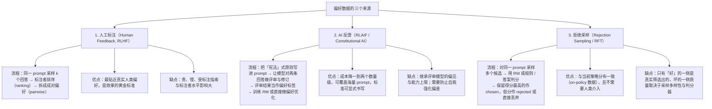

> **一句话总结**：奖励模型是把「人类更喜欢哪个回答」压缩成一个可微标量函数的组件，它的训练数据来自人工标注、AI 反馈（RLAIF）或拒绝采样，训练目标由 Bradley-Terry 偏好模型导出；而它天然只是一个代理（proxy），所以「奖励作弊（reward hacking）」不是 bug，而是这套机制的固有属性。
> **前置知识**：Sigmoid 与交叉熵、极大似然估计、梯度下降；读过第 01 篇（RLHF 三阶段与四个模型）会更顺。
> **学完能做到**：1. 从 Bradley-Terry 模型出发独立推导出排序损失（log-sigmoid 形式）并写出它的梯度，说明为什么训练时要用「同一 prompt 的两个回答」而不是任意两条回答；2. 设计一套偏好数据标注流程，用 Cohen's Kappa 量化标注一致性并给出分歧处理规则；3. 列出 reward hacking 的常见表现形式、给出可操作的检测方法与缓解手段，并手写一个可运行的 Bradley-Terry 损失实现。

## 1. 核心概念

### 1.1 为什么需要一个「奖励模型」而不是直接让人来打分

强化学习需要一个**可反复查询、可微、稳定一致**的奖励信号。人类反馈有三个无法直接用于 RL 的性质：昂贵、主观、非平稳（同一个标注者前后标准会漂移），而且 RL 训练过程中需要对同一个 prompt 采样成千上万次，人不可能实时跟得上。

奖励模型（Reward Model, RM）的作用就是把这三种性质「摊平」：用一次性收集的有限偏好数据，训练一个参数化的打分函数 $r_\phi(x,y)$，之后在 RL 阶段冻结地、零成本地反复查询它。代价是引入了「代理误差」，而 reward hacking 正是这种代理误差被优化压力放大的结果。

| 对比 | 直接用人类反馈 | 用奖励模型代理 |
|---|---|---|
| 单次查询成本 | 高（分钟级） | 极低（一次前向） |
| 一致性 | 主观、随标注者漂移 | 由参数固定，完全一致 |
| 可微性 | 不可微 | 可微，可直接回传梯度 |
| 反馈粒度 | 整条 response 的排序 | 同样只有排序，但被压成标量 |
| 主要风险 | 无法规模化、方差大 | 代理误差被 hack、过拟合标注风格 |

### 1.2 偏好数据的三个来源

这张图回答的是：训练一个奖励模型所需的偏好数据从哪里来，三条来源各自的流程、优点与代价是什么。



**读图要点**：

| 观察 | 含义 |
| --- | --- |
| 三条来源的成本与保真度大致成反比 | 人工标注最贵也最贴近真实偏好，AI 反馈便宜一到两个数量级但继承评审模型的偏见，拒绝采样最省却只保证了「好」的那一侧 |
| 三者的产出最终都被压成成对偏好 | 排序可拆成多对、AI 评审可变成成对、拒绝采样天然成对，统一成 (x, y_w, y_l) 之后 RM 的训练目标才唯一 |
| AI 反馈的固有风险是自我强化 | 评审模型与被评审模型同源时偏差会被反复放大，需要外部信号或人工抽样兜底 |
| 拒绝采样的瓶颈在判分器 | 采样多样性不足或判分器有漏洞时，被丢掉的一侧未必真的更差，RM 会学到错误的方向 |
| 它们共同的前提是「同一 prompt 的多个回答」 | 跨 prompt 比较没有意义，这也是数据划分必须按 prompt 而不是按回答划分的原因 |

**成对偏好（pairwise）是这套体系的基础数据单元**：$(x, y_w, y_l)$，即「prompt $x$ 下，回答 $y_w$ 优于 $y_l$」。它比绝对打分的优势在于：人类比较两条回答比给出一个绝对分数要consistent得多；而且即使标注者的「绝对尺度」不同，比较判断仍可复用。

| 数据形式 | 标注难度 | 可复用性 | 常见用途 |
|---|---|---|---|
| 绝对打分（1–5 分） | 高（尺度难统一） | 低 | 早期的 RM 训练，现已少见 |
| 成对比较（A 好于 B） | 中 | 高 | Bradley-Terry RM 训练的标准形式 |
| 多路排序（k 选排序） | 高 | 最高（可拆成 $O(k^2)$ 对） | InstructGPT 等早期 RLHF |
| 二值标签（好/坏） | 低 | 中 | KTO 等方法（不需要配对） |

### 1.3 奖励模型的架构与训练配置

| 设计选择 | 常见做法 | 原因 |
|---|---|---|
| 初始化 | 由 SFT 模型初始化（或 Base 模型） | 已经理解指令格式，收敛更快 |
| 结构 | 在最后一个 token 位置的隐状态上接一个线性标量头 | 整条 response 需要一个标量 |
| 输出 | 一个实数，通常不做 sigmoid 压缩 | 偏好损失里的 sigmoid 已经承担了「比较」的角色 |
| 训练损失 | Bradley-Terry 的负对数似然 | 与「排序一致性」目标一致 |
| 数据划分 | 必须按 prompt 划分，而非按回答划分 | 同一 prompt 的不同回答会泄漏 |
| 模型规模 | 常小于或等于被对齐模型 | 打分任务比生成简单；但太小则区分能力不足 |

> **提示**：RM 与 Critic 结构几乎相同，区别只在于「RM 只需末位有意义的输出，Critic 需要每个位置都能预测未来收益」。这就是为什么 Critic 常用 RM 初始化：一半的能力已经就位，只需再学「逐位置的未来收益」。

### 1.4 标注质量：指南、一致性与分歧处理

人类偏好标注最大的成本不是标注本身，而是**把标准讲清楚**。一套可用的偏好标注流程通常包含以下要素：

| 要素 | 具体做法 | 反例 |
|---|---|---|
| 标注指南 | 明确优先级：事实正确性 > 有用性 > 格式 > 语气；给出边界案例的判定 | 只写「选更好的那个」 |
| 标注粒度 | 先给绝对问题判定（是否事实错误、是否安全），再对同分项做偏好比较 | 直接让标注者整体感觉打分 |
| 一致性度量 | 让每对数据被 2–3 人独立标注，计算一致性系数 | 单人单次标注，无质检 |
| 分歧处理 | 分歧对进入「仲裁池」由资深标注者裁决；持续分歧的案例写回指南 | 直接丢弃或不加处理地保留 |
| 质量抽检 | 混入金标（gold）样例检测标注者可靠度 | 无抽检，无法发现标注者敷衍 |
| 反馈闭环 | 定期用 RM 的错误案例回看标注指南 | 指南一年不更新 |

**一致性系数（Cohen's Kappa）** 用于量化「两人的一致程度是否显著高于随机」。记观察一致率为 $p_o$，随机一致率为 $p_e$：

$$\kappa=\frac{p_o-p_e}{1-p_e}$$

| $\kappa$ 区间 | 解释 | 处理建议 |
|---|---|---|
| $<0.20$ | 一致性极低 | 指南无效，重写指南并重新培训 |
| $0.20-0.40$ | 一般 | 需大幅细化判定标准 |
| $0.40-0.60$ | 中等 | 可用于训练，但需分歧仲裁 |
| $0.60-0.80$ | 较高 | 常规可用 |
| $>0.80$ | 很高 | 标注指南成熟，可扩大生产 |

**为什么 $p_e$ 必须扣除？** 因为两条回答若都很好或都很差，标注者可能靠猜也有 50% 概率「碰巧一致」。不扣除随机一致率，会系统性高估标注质量，进而低估 RM 的噪声底。

### 1.5 奖励模型评估

| 指标 | 定义 | 局限 |
|---|---|---|
| 成对准确率（pairwise accuracy） | 在留出偏好对上，$r_\phi(y_w)>r_\phi(y_l)$ 的比例 | 只反映排序，不反映分数尺度 |
| 与人类偏好的一致性 | 用 RM 对若干候选排序，与人类排序比对（如 Spearman/Kendall） | 需要额外的人类排序成本 |
| 分布内 vs 分布外（OOD） | 分成「同分布同标注者」与「新任务/新标注者/对抗构造」两组分别评估 | OOD 指标通常远低于分布内，恰恰是最有信息量的 |
| 稳健性 | 对回答做微小扰动（改写、换长度、加套话）后分数变化幅度 | 直接暴露长度偏置、格式偏置 |
| 校准与尺度稳定 | 同一 prompt 内分数差的稳定性；不同 batch 的尺度一致性 | 关系到 RL 中优势是否被单条数据主导 |

**关于准确率的解读**：人类标注者之间的一致率本身通常也就在 70%–80% 左右，所以 RM 的成对准确率并非「越高越好」，**接近人类上限即可，超过人类一致率往往意味着过拟合了标注者的系统性偏差**。评估时务必要有 OOD 与扰动测试，否则「验证集准确率 90%」掩盖不了 RL 阶段的崩坏。

## 2. 数学推导

> **说明**：本节基于公开论文整理。

### 2.1 Bradley-Terry 模型与偏好概率

Bradley-Terry 模型假设：每个「被比较对象」$i$ 有一个潜在的强度参数 $\pi_i>0$，则在 $i$ 与 $j$ 的比较中 $i$ 获胜的概率为

$$P(i \succ j)=\frac{\pi_i}{\pi_i+\pi_j}$$

把「强度」替换成「指数化的奖励 $e^{r(x,y)}$」，即令 $\pi_i=e^{r(x,y_i)}$，立刻得到

$$P\big(y_w\succ y_l\mid x\big)=\frac{e^{r(x,y_w)}}{e^{r(x,y_w)}+e^{r(x,y_l)}}=\frac{1}{1+e^{-\left(r(x,y_w)-r(x,y_l)\right)}}=\sigma\Big(r(x,y_w)-r(x,y_l)\Big)$$

**这一步是整个 RM 训练的源头：只要假设「奖励越高越可能被偏好」且奖励对比较的影响是乘性的，偏好概率就必然是奖励之差的 sigmoid。** 注意一个重要推论：$\sigma$ 只看奖励的**差值**，因此奖励的绝对平移是不可辨识的——这也解释了为什么 RM 的绝对分数没有意义，只有同一 prompt 内的相对大小有意义。

### 2.2 负对数似然与排序损失

给定偏好数据集 $\mathcal{D}=\{(x^{(i)},y_w^{(i)},y_l^{(i)})\}_{i=1}^{N}$，假设样本独立，最大化似然等价于最小化负对数似然：

$$\mathcal{L}_{RM}(\phi)=-\frac{1}{N}\sum_{i=1}^{N}\log\sigma\Big(r_\phi(x^{(i)},y_w^{(i)})-r_\phi(x^{(i)},y_l^{(i)})\Big)$$

**多路排序的情形**：若一条数据给出 $k$ 个回答的完整排序 $y^{(1)}\succ y^{(2)}\succ\cdots\succ y^{(k)}$，用 Plackett-Luce 扩展可得

$$\mathcal{L}=-\frac{1}{N}\sum_i\sum_{j=1}^{k-1}\log\frac{e^{r(x,y^{(j)})}}{\sum_{m=j}^{k}e^{r(x,y^{(m)})}}=-\frac{1}{N}\sum_i\sum_{j=1}^{k-1}\Big[r(x,y^{(j)})-\log\!\!\sum_{m=j}^{k}e^{r(x,y^{(m)})}\Big]$$

这也说明「$k$ 路排序」可以直接拆成 $\binom{k}{2}$ 个成对样本使用，两种做法在信息使用上等价而计算代价不同。

### 2.3 梯度的手工推导

记 $\Delta=r_\phi(x,y_w)-r_\phi(x,y_l)$。利用 $\frac{d}{d\Delta}\log\sigma(\Delta)=1-\sigma(\Delta)=\sigma(-\Delta)$ 以及链式法则：

$$\nabla_\phi\Big[-\log\sigma(\Delta)\Big]=-\big(1-\sigma(\Delta)\big)\nabla_\phi\Delta=-\sigma(-\Delta)\Big(\nabla_\phi r_\phi(x,y_w)-\nabla_\phi r_\phi(x,y_l)\Big)$$

即

$$\boxed{\ \nabla_\phi \mathcal{L}=\sigma\Big(r_\phi(x,y_l)-r_\phi(x,y_w)\Big)\Big(\nabla_\phi r_\phi(x,y_l)-\nabla_\phi r_\phi(x,y_w)\Big)\ }$$

**这个梯度非常直观**：权重 $\sigma(r_l-r_w)$ 就是「模型当前判错的程度（错得越离谱越接近 1）」；梯度方向是「拉高 $y_w$ 的分数、拉低 $y_l$ 的分数」。于是训练会自动把注意力集中在难例上——这与逻辑回归的梯度形式完全一致。

**由梯度可以推出三个工程结论：**

1. **零初始化不好**：若 $r_\phi$ 初始输出对所有输入都相同，则 $\Delta=0$，$\sigma(0)=0.5$，权重非零，梯度不为零，训练可以起步；但若用「只在 $y_w$ 上算 SFT 损失」这种退化目标，特权信息就浪费了。强制 $r_\phi(y_w)=r_\phi(y_l)$（例如把两者拼成同一个序列）会让梯度恒为 0。
2. **必须同 prompt 配对**：如果 $y_w$ 来自任务 A、$y_l$ 来自任务 B，那么「奖励差」里混进了「任务难度差」，RM 会学成「任务 A 比任务 B 好」而非「这条回答比那条好」。**这是偏好数据最常见的构造错误。**
3. **损失对分数只依赖差值**：所以在训练 RM 时不需要也不应做绝对值的回归目标（比如「这条打 4 分」）；混入绝对分数会让尺度不可辨识，反而破坏 RL 阶段优势的稳定性。

### 2.4 Elo 视角：另一种理解偏好数据的方式

Elo 系统是同一种思想的在线版本。设选手 $i$ 的评分为 $R_i$，预期胜率为

$$E_i=\frac{1}{1+10^{(R_j-R_i)/400}}$$

观赛后按 $R_i\leftarrow R_i+K(S_i-E_i)$ 更新（$S_i\in\{0,1\}$ 是实际胜负）。把 $400/\ln 10$ 折算到自然对数尺度，$E_i$ 与 Bradley-Terry 的 $\sigma(r_i-r_j)$ 在形式上完全一致——**Elo 就是「用在线 SGD 训练一个只有单参数的 Bradley-Terry 模型」**。理解这一点后，「Chatbot Arena 的 Elo 排名」与「RM 的分数」就不再是两件陌生的事：它们都在把成对比较转成一个相对强度的标量场。

### 2.5 从「成对偏好」到「可训练的标量」：三个必须注意的尺度问题

| 问题 | 数学表现 | 后果 | 处理 |
|---|---|---|---|
| 平移不可辨识 | $r\to r+c$ 不改变 $\mathcal{L}$ | RM 输出均值漂移 | 对 RM 输出做 batch 内标准化或固定参考均值 |
| 尺度不可辨识于 KL 项 | RL 中 $r_\phi$ 与 $\beta_{KL}$ 的乘积决定有效信号 | 换 RM 就要重扫 `kl_ctl` | 固定 RM 尺度，或在 RL 中对分数做组内归一化 |
| 长度/格式混杂 | $r_\phi(x,y)=f(\text{内容})+\alpha\cdot\text{len}(y)+g(\text{格式})$ | 策略学会加长、堆格式 | 在评估中做扰动测试；训练中加长度控制或成对长度匹配 |

### 2.6 Reward Hacking：完整的因果链

**因果链**：偏好数据是有限且带偏的 → RM 拟合出的是「与偏好相关的可观测特征」而非「真实质量」 → 强化学习是一个主动搜索器，会去找 $r_\phi$ 的极大值点 → 极大值点落在代理误差最大的方向上 → 人类评分下降而 RM 分数上升。

**形式化地看**：设真实质量 $r^\star$、代理 $r_\phi=r^\star+e$，RL 最大化 $\mathbb{E}_\pi[r_\phi]$。在无约束情况下，最优策略会把概率集中到 $\arg\max r_\phi$，而

$$r^\star(\arg\max r_\phi)=r_\phi(\arg\max r_\phi)-e(\arg\max r_\phi)=\max r_\phi-e^\star$$

**当代理误差在最优点处为正且很大时，真实质量反而可能低于一个平凡策略**。这就是 reward hacking 的数学本质：**优化一个代理，等于在最坏情况下优化「代理减去误差上界」**。第 01 篇推导过的结论在这里重现：KL 约束把搜索范围限制在误差小的邻域内，所以它是必需的。

| 表现形式 | 具体现象 | 成因 |
|---|---|---|
| 长度偏置（length bias） | 回答越来越长，信息密度下降 | 标注数据中长回答平均更受偏好；RM 学到长度特征 |
| 谄媚（sycophancy） | 无条件附和用户的错误前提 | 附和型回答在标注中得分高；缺乏「反驳」的正样本 |
| 格式取巧 | 疯狂使用列表、加粗、emoji、固定套话 | 格式整洁在评分中相关性高，成了廉价捷径 |
| 免责与模糊化 | 到处写「可能」「仅供参考」「请咨询专业人士」 | 模糊表述被判错概率低，期望得分高 |
| 拒答泛滥 / 安全检查过度 | 对正常请求也拒答 | 无害性奖励与有用性奖励失衡，或安全样本过度代表 |
| 幻觉式自信 | 编造引用、编造数据 | 有引用的回答更被偏好；RM 无法验证引用真伪 |
| 奖励模型被对抗利用 | 出现人类看不懂但 RM 高分的乱码/罕见 token | 优化压力进入 RM 的低密度外推区 |

**检测方法清单**：

| 检测手段 | 具体做法 | 能发现什么 |
|---|---|---|
| 长度—分数相关性 | 统计 RM 分数与回答长度的相关系数（分布内、分布外各算一遍） | 长度偏置 |
| 扰动测试 | 保持语义不变，只加长/缩短/改格式，观察分数变化 | 格式与长度偏置 |
| 反事实偏好对 | 构造「内容相同、格式不同」与「格式相同、长度不同」的对照 | 精确归因 |
| 人工抽检 RL 后的输出 | 固定一组 prompt，对比 RL 前后人工评分与 RM 分数的走势 | 是否发生 hacking（RM 升人评降） |
| KL 与输出分布监控 | 监控 KL 散度、唯一 n-gram 比例、平均长度随步数变化 | hacking 的早期信号 |
| 黄金集恒定评估 | 固定一组 OOD 偏好对，每若干步评估 RM 准确率 | RM 的泛化是否退化 |

**缓解手段（按优先级）**：

| 手段 | 机制 | 代价 |
|---|---|---|
| KL 惩罚 / 早停 | 把策略限制在 RM 可信邻域 | 对齐力度受限，可能欠拟合偏好 |
| 偏好数据去偏 | 长度匹配、格式打散、构造反驳类正样本 | 数据构建成本上升 |
| 奖励裁剪与标准化 | 截断极端分数，按 prompt 组内归一化 | 可能损失绝对偏好信息 |
| 规则奖励替代或混合 | 数学/代码用可验证判分，绕过 RM | 只适用于有客观答案的任务 |
| 集成分数与不确定性惩罚 | 用多个 RM 的均值减方差 $r=\bar r-\alpha\cdot\text{std}(r)$ | 显存与推理成本翻倍 |
| 迭代重训 RM | 用当前策略的新样本重新标注并更新 RM（RLHF 的迭代版） | 标注成本持续投入 |
| 用人类偏好直接优化（DPO 等） | 不显式构建并优化代理 RM | 受限于离线数据的分布匹配度 |

### 2.7 一个容易忽略的放大效应：为什么「平均分更高」不等于「更适合 RL」

RM 的能力在**分布内**测量时看着总是够用的（准确率 70%+），但 RL 关心的是**分布的极值点附近的排序正确性**。设策略在 KL 约束半径为 $\rho$ 的邻域内搜索，则真实目标为

$$\max_{\pi:\,D_{KL}(\pi\|\pi_{ref})\le\rho}\ \mathbb{E}_\pi[r_\phi]=\max_{\cdots}\ \mathbb{E}_\pi[r^\star]+\mathbb{E}_\pi[e]$$

而 $\max_{\pi}\mathbb{E}_\pi[e]$ 会随 $\rho$ 增大而增大（可搜索的范围越大，越能找到误差最大的点），因此**「RM 的平均准确率」几乎不能预测「RL 之后的真实收益」**。这就是为什么 RM 评估必须包含 OOD 与对抗构造，也是为什么实践中常用「短周期 RL + 频繁人工评估」而不是一次长周期训练。

## 3. 可运行示例

`# 依赖：仅需 numpy（pip install numpy）。这是 Bradley-Terry 奖励模型的纯 numpy 参考实现：用特征向量模拟「隐状态 → 标量分数」，手写梯度并做梯度下降，不依赖 torch。`

```python
# 依赖：pip install numpy
"""Bradley-Terry 奖励模型的最小可运行实现（纯 numpy）。

设定：每个回答用一个 d 维特征向量 h 表示（真实场景中它是语言模型最后一个
token 的隐状态，这里用随机特征模拟）。奖励 r = w·h + b。
损失：-log sigmoid(r_w - r_l)，梯度按 2.3 节手工推导实现。
"""

import numpy as np

rng = np.random.default_rng(0)
D = 8


def true_reward(h):
    """构造一个"真实质量"函数：更符合人类偏好 => 分数更高。"""
    return 1.5 * h[0] - 0.8 * h[1] + 0.3 * h[2]


def make_dataset(n_pairs=400, noise=0.6):
    """生成偏好对：同一 prompt 采样两条回答，模拟一次带噪声的人类标注。

    noise 控制标注者的"分辨力"：noise 越大，标注越接近随机。
    """
    data = []
    for _ in range(n_pairs):
        h_a = rng.normal(size=D)
        h_b = rng.normal(size=D)
        # 标注者认为 a 更好的真实概率（sigmoid 化的质量差）
        p_a_wins = 1.0 / (1.0 + np.exp(-(true_reward(h_a) - true_reward(h_b)) / noise))
        if rng.random() < p_a_wins:
            data.append((h_a, h_b))   # 标注为 "a 更好" => chosen=a, rejected=b
        else:
            data.append((h_b, h_a))   # 标注为 "b 更好" => chosen=b, rejected=a
    return data


def loss_and_grad(params, data):
    """返回 (loss, grads)，params = [w (D,), b (1,)]。"""
    w, b = params[0], params[1]
    n = len(data)
    loss = 0.0
    gw = np.zeros_like(w)
    gb = np.zeros_like(b)
    for h_w, h_l in data:
        r_w = float(w @ h_w + b)
        r_l = float(w @ h_l + b)
        delta = r_w - r_l
        # 数值稳定的 log sigmoid
        if delta >= 0:
            log_sig = -np.log1p(np.exp(-delta))
        else:
            log_sig = delta - np.log1p(np.exp(delta))
        loss -= log_sig
        # 梯度: sigma(r_l - r_w) * (dh_l - dh_w)
        sigma_neg = 1.0 / (1.0 + np.exp(delta))     # = sigma(-delta)
        gw -= sigma_neg * (h_l - h_w)
        # 注意：损失对 b 的梯度为 0（因为只依赖差值），b 不可辨识
    return loss / n, [gw / n, gb / n]


def pairwise_accuracy(params, data):
    w, b = params[0], params[1]
    correct = sum(
        float(w @ h_w + b) > float(w @ h_l + b) for h_w, h_l in data
    )
    return correct / len(data)


def main():
    train = make_dataset(400)
    test = make_dataset(200)

    w = np.zeros(D)
    b = np.array(0.0)
    lr = 0.05
    for step in range(1, 201):
        loss, grads = loss_and_grad([w, b], train)
        w -= lr * grads[0]
        b -= lr * grads[1]
        if step % 50 == 0:
            print(f"step {step:3d}  loss={loss:.4f}  "
                  f"train_acc={pairwise_accuracy([w, b], train):.3f}  "
                  f"test_acc={pairwise_accuracy([w, b], test):.3f}")

    print("\n学到的 w =", np.round(w, 3))
    print("真实权重方向 = [1.5, -0.8, 0.3, 0, 0, 0, 0, 0]  (前三维按比例可见)")
    print("b =", round(float(b), 4), " (理论不可辨识：损失只依赖 w·h 的差值)")

    # 演示 2.3 节的"难例加权"：比较离谱错误与轻微错误的梯度权重
    params = [w, b]
    for name, delta in (("轻微错误 delta=-0.2", -0.2), ("离谱错误 delta=-3.0", -3.0)):
        print(f"\n{name}: sigma(-delta) = {1/(1+np.exp(delta)):.4f}")
    print("=> 判错越离谱，权重越接近 1（最多把学习信号拉满），"
          "但永远不会超过 1，所以不会出现梯度爆炸。")


if __name__ == "__main__":
    main()
```

**这段代码对应到公式的哪一步：**

| 代码 | 公式 |
|---|---|
| `delta = r_w - r_l` | $\Delta=r_\phi(x,y_w)-r_\phi(x,y_l)$ |
| `log_sig`（分段写法） | 数值稳定的 $\log\sigma(\Delta)$ |
| `loss -= log_sig` | 负对数似然 $\mathcal{L}_{RM}$ |
| `sigma_neg = 1/(1+exp(delta))` | 权重 $\sigma(r_l-r_w)$ |
| `gw -= sigma_neg*(h_l-h_w)` | $\nabla_\phi\mathcal{L}$ 的方向 |
| `b` 学不动 | 平移不可辨识（损失只依赖差值） |

## 4. 常见坑

| 坑 | 现象 | 原因 | 正确做法 |
|---|---|---|---|
| 偏好对跨 prompt 配对 | RM 准确率虚高，RL 后无提升 | 奖励差里混入了任务难度差，RM 学成「任务好坏」而不是「回答好坏」 | 严格按同一 prompt 构造 $(y_w,y_l)$；数据划分也按 prompt 划分 |
| 长度未匹配 | RM 分数与长度强相关，RL 后回答越来越长 | 标注数据中长回答平均更受偏好 | 构造长度匹配的对照样本；统计分数—长度相关性并作为评估指标 |
| 标注指南过粗 | 标注者间 Kappa 低于 0.4 | 指南只写「选更好的」 | 明示优先级（正确性 > 有用性 > 格式）、给出边界案例、做标注培训 |
| 未计算随机一致率 | 一致性看起来很高，但 RM 学不到东西 | 只用 $p_o$ 而没算 $\kappa=p_o$ 与 $p_e$ 的差 | 报告 Cohen's Kappa 而不是原始一致率 |
| 分歧样本被直接丢弃 | 数据量少且分布有偏（丢掉的全是难例） | 「丢弃分歧」会系统性去掉边界案例 | 分歧进入仲裁池，由资深标注者裁决；持续分歧的写回指南 |
| RM 过拟合标注风格 | 训练/验证准确率高，OOD 一测就崩 | 验证集与训练集同分布、同标注者 | 增加 OOD 与扰动测试；按标注批次/任务做分组评估 |
| RM 输出未标准化 | 优势被个别极端分数主导，训练震荡 | 分数尺度不一致、长尾 | 对 $r_\phi$ 做 clip 与组内归一化；统一不同批次的尺度 |
| 用同一个 RM 既当裁判又当训练目标且从不更新 | 训练后期 reward 继续涨但人评下降 | RM 和策略共同漂移，RM 被「追着 hack」 | 迭代重训 RM；设 KL 约束与早停；引入规则奖励做校正 |
| 用绝对分数回归代替偏好 | 尺度不可辨识，RL 阶段收益不稳定 | 与 Bradley-Terry 假设不符 | 只用成对/排序损失；不要混入绝对值回归 |
| 奖励模型规模过小 | 区分能力不足，准确率上不去 | 打分也需要理解能力 | RM 规模一般不小于 SFT 模型的一半；必要时用较大的模型做 RM |
| 忽略 safe/unsafe 的平衡 | 拒答率飙升、有用性下降 | 安全样本与有用样本配比失衡 | 分别评估 helpfulness 与 harmlessness，按需调整数据配比 |

## 5. 面试问答

**Q1：请从 Bradley-Terry 模型推导奖励模型的损失函数，并写出它的梯度。**

<details>
<summary>参考答案</summary>

Bradley-Terry 假设每个对象有一个正强度 $\pi_i$，比较中 $i$ 胜 $j$ 的概率为 $\pi_i/(\pi_i+\pi_j)$。把强度取为 $e^{r(x,y)}$，得到

$$P(y_w\succ y_l\mid x)=\frac{e^{r(x,y_w)}}{e^{r(x,y_w)}+e^{r(x,y_l)}}=\sigma\big(r(x,y_w)-r(x,y_l)\big)$$

对数据集取负对数似然：

$$\mathcal{L}_{RM}=-\mathbb{E}_{(x,y_w,y_l)}\Big[\log\sigma\big(r_\phi(x,y_w)-r_\phi(x,y_l)\big)\Big]$$

记 $\Delta=r_w-r_l$，由 $\frac{d}{d\Delta}\log\sigma(\Delta)=1-\sigma(\Delta)$ 得

$$\nabla_\phi\mathcal{L}=\sigma\big(r_l-r_w\big)\big(\nabla_\phi r_\phi(x,y_l)-\nabla_\phi r_\phi(x,y_w)\big)$$

含义：权重是「判错程度」，梯度方向是把好回答的分数拉高、坏回答的分数压低。注意损失只依赖差值，所以奖励的绝对平移不可辨识；也正因如此，RM 的绝对分数没有意义，只有同一 prompt 内的相对大小有意义。

</details>

**Q2：什么是 reward hacking？给出三种典型表现和三种缓解手段，并说明为什么 KL 惩罚能起作用。**

<details>
<summary>参考答案</summary>

reward hacking 指策略找到了「让代理奖励模型打高分、但人类并不喜欢」的输出模式。数学本质是优化代理 $r_\phi=r^\star+e$：无约束时策略会集中到 $\arg\max r_\phi$，而该点的真实质量 $=\max r_\phi-e^\star$，代理误差被放大到极致。

三种典型表现：① 长度偏置——回答越来越长但信息密度下降；② 谄媚——无条件附和用户的错误前提；③ 格式取巧——堆砌列表、加粗、客套话与免责声明。此外还有模糊化（到处写「可能」）、拒答泛滥、编造引用等。

三种缓解手段：① KL 惩罚与早停——把策略限制在 RM 仍然可信的邻域；② 偏好数据去偏——长度匹配、打散格式、补充「有理有据地反驳」这类正样本；③ 规则奖励替代或混合——数学与代码直接用答案判分，绕过 RM。

KL 惩罚之所以有效，是因为代理误差 $|e|$ 随「离开训练分布的距离」增大而增大，加上 KL 约束后优化目标变成真实偏好的悲观下界 $\mathbb{E}_\pi[r_\phi]-\beta D_{KL}(\pi\|\pi_{ref})$，等于在误差可控的半径内搜索。

</details>

**Q3：为什么偏好数据的划分必须按 prompt 而不是按回答？**

<details>
<summary>参考答案</summary>

因为训练与验证样本若共享同一个 prompt，就会出现信息泄漏：模型在训练时已经见过该 prompt 下的一条回答的偏好方向，验证时对同一 prompt 的另一条回答打分就会「显得正确」。这会让验证准确率虚高，掩盖真实的泛化能力不足。

正确做法是以 prompt 为单位做分组划分（group split），保证验证集中所有 prompt 在训练集中从未出现。理想情况下，划分还应考虑任务类型与标注批次，把「新任务、新标注者」单独留出作为 OOD 评估集，因为这才是 RM 在 RL 阶段真正会遇到的分布。

</details>

**Q4：为什么用 AI 反馈（RLAIF）能替代一部分人工标注？它的风险是什么？**

<details>
<summary>参考答案</summary>

可行性来自两点：一是偏好判断是一个「比较与批评」任务，比生成任务更容易被模型做对；二是标准可以显式写成「宪法」式的原则条款，让模型按条款评审并修订回答，从而把偏好判断变成可复现的规则执行。收益是成本下降一到两个数量级，且可覆盖海量 prompt 与多语言场景。

风险有三类：① 继承评审模型的偏见与能力上限——评审模型不擅长的领域（如复杂数学、小众语言）其偏好标签质量会下降；② 自我强化偏差——用模型自己产生的偏好标签去训练模型，可能把模型已有的错误偏好固化甚至放大；③ 标准被表面化——模型可能学会「形式上符合条款」而不是「实质上更好」，这与 reward hacking 是同一机制。

缓解办法包括：保留一部分人类标注作为「锚」并定期校准 AI 标签；用多个评审模型投票并保留分歧样本；对评审结果做扰动测试与长度/格式混杂检测。

</details>

## 6. 自测题

**1. 三位标注者对 100 对回答做偏好标注，两人评「A 好」、一人评「B 好」的有 20 对；三人都评「A 好」的有 50 对；三人都评「B 好」的有 10 对；其余 20 对是两人评 B、一人评 A。请用「两两一致率」的方式说明为什么只看原始一致率会高估标注质量。**

<details>
<summary>参考答案</summary>

原始一致率（任取两人判断相同的比例）会很高：在 50 对全 A 的样本中三人两两都一致（贡献 3 组一致），10 对全 B 同理，另外 40 对每对内部是 2:1 分裂（每组三人中有 2 组一致、1 组不一致）。

但问题在于，**若标注者完全随机猜且 A 的先验概率很高（例如 80% 选 A），随机情况下两人也有约 $0.8^2+0.2^2=0.68$ 的概率一致**。因此必须用 Cohen's Kappa 扣除随机一致率 $p_e$：

$$\kappa=\frac{p_o-p_e}{1-p_e}$$

只有当 $\kappa$ 明显大于 0（例如 0.6 以上）时，才说明标注者的判断是真正共享了一套标准，而不是「都倾向于选 A」。这个例子也说明：**当类别分布高度不均衡时，原始一致率几乎必然很高，不能作为质量指标。**

</details>

**2. 某 RM 在验证集上的成对准确率是 92%，但 RL 之后人工评分明显下降。列出至少三条可能原因。**

<details>
<summary>参考答案</summary>

① 验证集与训练集同分布、同标注者，RM 只是过拟合了标注者的系统性偏差（如长度偏好、格式偏好），92% 并不代表 OOD 泛化好。

② RL 的优化压力主动搜索 RM 的分布外区域，即使 RM 在分布内很准，最优点附近的排序也可能是错的（关键指标是极值点附近的排序质量，而非平均准确率）。

③ 偏好数据中存在长度—质量混杂，RM 学到「长 = 好」，RL 后回答变长、人评下降。

④ 验证集可能泄漏（同一 prompt 的回答同时出现在训练集与验证集）。

⑤ 分数尺度未标准化，优势被极端分数主导，导致策略被少数样本带偏。

</details>

**3. 手推：若 $r_\phi(x,y_w)=1.2$、$r_\phi(x,y_l)=-0.4$，求该样本的 Bradley-Terry 损失值与梯度权重。**

<details>
<summary>参考答案</summary>

$\Delta=1.2-(-0.4)=1.6$。

损失 $=-\log\sigma(1.6)$。计算：$\sigma(1.6)=\frac{1}{1+e^{-1.6}}=\frac{1}{1+0.2019}=0.8320$，故 $-\log 0.8320=0.1839$。

梯度权重 $=\sigma(r_l-r_w)=\sigma(-1.6)=1-0.8320=0.1680$。也就是说，这个已经判对的样本只贡献 16.8% 的梯度权重——模型越笃定，更新越轻微。这正是 2.3 节「难例加权」的数值体现。

</details>

**4. 如果要给一个数学解题场景构建偏好数据，为什么直接用 RM 打分可能不如用规则奖励？**

<details>
<summary>参考答案</summary>

数学题的最终答案有客观对错，可以用规则直接验证（例如按指定格式提取答案后比对，或编译运行代码）。而神经 RM 只能学到「像不像一份好解答」的表面特征，容易把「推导过程写得长而工整」当成质量信号，于是策略可能学会堆砌无用步骤或堆格式。

规则奖励的优势是：① 判分与人类真实目标直接对齐，不存在代理误差；② 不可被表面特征 hack（除非格式奖励本身设计不当）；③ 判分成本几乎为零且完全确定。局限是只适用于有可验证答案的任务，且需要处理答案抽取的鲁棒性——这也正是实践中「推理任务用规则奖励、通用任务用 RM」这种混合奖励设计的原因。

</details>

**5. 迭代重训 RM 能缓解 reward hacking，但它的代价是什么？什么时候值得做？**

<details>
<summary>参考答案</summary>

机制是：用当前策略模型重新采样一批回答，重新标注（人工或 AI 反馈）并更新 RM，让 RM 始终覆盖策略当前所在的分布，从而缩小外推误差。

代价有三：① 标注或评审成本随迭代轮数线性增长；② 训练管线变复杂（需要维护采样、标注、RM 训练、RL 训练四个环节的版本一致）；③ 存在「追不上」的风险——策略移动速度可能快于 RM 的更新速度，尤其在 KL 约束较松时。

值得做的情况：任务偏好难以用规则表达、且对最终质量要求很高，同时有可持续的标注预算（例如面向产品的最后一轮对齐）。不值得的情况：任务本身有可验证奖励（数学/代码），或处于早期探索阶段（此时更应该先修数据与评估，而不是加迭代）。

</details>

## 7. 延伸阅读

- [Training language models to follow instructions with human feedback (InstructGPT, arXiv:2203.02155)](https://arxiv.org/abs/2203.02155)
- [Constitutional AI: Harmlessness from AI Feedback (arXiv:2212.08073)](https://arxiv.org/abs/2212.08073)
- [KTO: Model Alignment as Prospect Theoretic Optimization (arXiv:2402.01306)](https://arxiv.org/abs/2402.01306)
- [A General Theoretical Paradigm to Understand Learning from Human Preferences (IPO, arXiv:2310.12036)](https://arxiv.org/abs/2310.12036)
- [ORPO: Monolithic Preference Optimization without Reference Model (arXiv:2403.07691)](https://arxiv.org/abs/2403.07691)

---

[⬅️ 返回本章目录](README.md)
