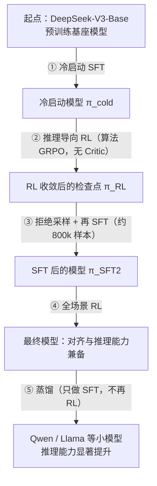

> **一句话总结**：GRPO（Group Relative Policy Optimization）保留了 PPO 的重要性采样与裁剪，但把「Critic 学出来的价值基线」换成「同一个 prompt 采一组回答、用组内奖励的均值作为基线、用标准差做归一化」，从而省掉一个与策略同规模的模型；这条路线配合可验证奖励，成为 DeepSeekMath 与 DeepSeek-R1 类推理模型后训练的核心算法。
> **前置知识**：第 01 篇（PPO 的四个模型、GAE、KL 惩罚）与第 02 篇（奖励模型与 reward hacking）；对「基线为什么不引入偏差」有印象会更顺。
> **学完能做到**：1. 写出 GRPO 的目标函数与组内归一化的优势估计公式，并说清它与 PPO 的差异点在哪里、省了什么、代价是什么；2. 完整讲出「冷启动 SFT → 推理导向 RL → 拒绝采样 → 再 SFT → 全场景 RL → 蒸馏」这条推理模型后训练流水线每一步的输入输出；3. 手算组内优势，判断「全对/全错组梯度为零」的成因与处理，并写一个可运行的 GRPO 优势估计实现。

## 1. 核心概念

### 1.1 为什么去掉了 Critic

第 01 篇算过显存账：PPO 需要四份模型权重（Actor / Critic / Reward / Reference），一个 $P$ 参数的模型大约要占 $32P$ 字节。Critic 的职责只有一个——**给策略梯度提供一个基线来降低方差**。而基线的数学要求其实很弱：只要有偏估计不引入偏差即可（见 1.3 的引理）。

既然基线只要是「与状态相关、与动作无关的量」就行，那么最朴素的做法就是**直接采样求均值**：同一个 prompt 采 $G$ 个回答，把 $G$ 个奖励的平均值当作这个 prompt 的基线。这就是 GRPO 的核心思想。

| 维度 | PPO | GRPO |
|---|---|---|
| 需要的模型 | Actor + Critic + Reward + Reference（4 个） | Actor + Reward + Reference（3 个） |
| 基线来源 | Critic 网络学出来的 $V(s_t)$，每个 token 位置一个值 | 同一 prompt 的 $G$ 个回答的组内均值，每个回答一个值（广播到所有 token） |
| 优势粒度 | token 级（GAE 逐位置递推） | response 级（整条回答一个优势，复制到每个 token） |
| 额外开销 | Critic 的前向 + 反向 + 优化器状态 | 每个 prompt 要采样 $G$ 个回答（生成开销 $\times G$），需要奖励信号可重复打分 |
| 方差控制手段 | Critic 的学习质量、GAE 的 $\lambda$ | 组大小 $G$、奖励的可分辨性、组内归一化的稳定性 |
| 保留的 PPO 特性 | 重要性采样权重、clip、KL 惩罚 | 同样保留 |
| 训练信号前提 | 奖励模型对状态有平滑的估值 | 同组内奖励必须有差异（否则无梯度） |

**一句话**：PPO 用「一个学出来的函数」近似期望，GRPO 用「一组采样」直接估计期望。

### 1.2 组内归一化：优势怎么算

对每个 prompt $q$，从旧策略 $\pi_{\theta_{old}}$ 采样 $G$ 个回答 $\{y_1,\dots,y_G\}$，用奖励函数（奖励模型或规则）各打一个分 $r_i$，然后

$$A_i=\frac{r_i-\operatorname{mean}(\{r_1,\dots,r_G\})}{\operatorname{std}(\{r_1,\dots,r_G\})}$$

**注意三个细节**：

1. **一组回答共享同一个优势值**：整条回答的每个 token 都用 $A_i$（因为 GRPO 把 token 级折扣设为 $\gamma=1$，未来收益不再需要逐位置估计）。
2. **均值就是基线**：减去均值使得「比组内平均好」为正优势，「比组内平均差」为负优势。
3. **标准差是尺度归一化**：让不同 prompt、不同难度下的奖励尺度可比，避免容易的题目因奖励绝对值高而主导梯度。

### 1.3 GRPO 的目标函数

$$\mathcal{J}_{GRPO}(\theta)=\mathbb{E}_{q\sim P(Q),\,\{y_i\}_{i=1}^{G}\sim\pi_{\theta_{old}}(\cdot\mid q)}\left[\frac{1}{G}\sum_{i=1}^{G}\frac{1}{|y_i|}\sum_{t=1}^{|y_i|}\min\!\Big(w_{i,t}A_i,\ \operatorname{clip}\big(w_{i,t},1-\epsilon,1+\epsilon\big)A_i\Big)-\beta_{KL}\,D_{KL}\big(\pi_\theta\|\pi_{\text{ref}}\big)\right]$$

其中重要性采样权重

$$w_{i,t}=\frac{\pi_\theta(y_{i,t}\mid q,y_{i,<t})}{\pi_{\theta_{old}}(y_{i,t}\mid q,y_{i,<t})}$$

**逐项对照 PPO，只有两处不同：**

| 项 | PPO | GRPO |
|---|---|---|
| 优势 $A$ | 由 Critic + GAE 逐 token 递推 | 组内归一化得到一个常数，广播到所有 token |
| KL 惩罚的位置 | 混进每个 token 的即时奖励 $R_t$ 里（逐位置） | 单独作为一项加在总损失上（整体） |

> 关于 KL 项的位置：在 PPO 实现中它被写进逐 token 奖励；在 GRPO 中则通常作为独立的正则项一次性计算，并使用一种「恒非负」的近似估计（见 2.4）。

### 1.4 规则奖励与可验证奖励

DeepSeek-R1-Zero 的奖励系统**没有使用神经奖励模型**，而是使用基于规则的奖励，以避免 reward hacking 并简化训练流程。通常由两部分组成：

| 奖励类型 | 作用 | 实现方式 |
|---|---|---|
| 准确性奖励（accuracy reward） | 判断最终答案是否正确 | 数学题：按指定格式抽取答案后与标准答案精确比对（或做等价性判定）；代码题：用编译器/测试用例验证 |
| 格式奖励（format reward） | 要求把推理过程放在指定标签（如 ` thinking`）内 | 用正则/模板匹配检查结构 |
| 语言一致性奖励（language consistency reward，R1 新增） | 抑制中英混杂 | 统计回答中目标语言 token 的比例 |

**为什么数学/代码更适合 RL？** 因为它们的正确性**可被外部程序验证**（verifiable）。这带来三个性质：

1. 不存在代理误差，也就不存在「模型钻奖励空子」的空间（只要判分器本身没有漏洞）。
2. 奖励是稀疏但**可靠**的 0/1（或可微调的连续分），不需要人类标注，可以无限次查询。
3. 同一个 prompt 天然可以采样出「对」和「错」两种回答，**组内奖励有差异，梯度信号存在**——这是 GRPO 能工作的前提。

反过来，写作、闲聊、开放式问答没有可验证答案，只能依赖神经奖励模型或人类偏好，此时 GRPO 的组内信号更弱也更易被 hack。

### 1.5 推理模型的后训练流水线（以 DeepSeek-R1 类路线为例）

这张图回答的是：从一个「只会续写」的预训练基座，到一个推理能力可用的模型，中间要经过哪几道工序，每一道又解决了什么问题。



**读图要点**：

| 观察 | 含义 |
| --- | --- |
| ① 冷启动排在 RL 之前 | 没有它，RL 早期采出的回答可读性差、中英混杂，奖励信号难以稳定；冷启动先把「先思考再作答」的格式立起来 |
| ② 推理 RL 只用规则奖励 | 准确性奖励 + 格式奖励 + 语言一致性奖励都不依赖神经奖励模型，天然抗 reward hacking，代价是只适用于答案可验证的任务 |
| ③ 拒绝采样是「拿模型自己的好输出当新监督」 | 同一 prompt 采多条、筛出正确且可读的，把 RL 探索到的推理轨迹固化成稳定的数据分布，再 SFT 回去 |
| ④ 全场景 RL 把奖励分成两路 | 推理数据继续用规则奖励，通用数据用奖励模型对齐人类偏好，一边保住推理能力、一边补上安全性与有用性 |
| ⑤ 蒸馏只做 SFT，不再 RL | 小模型早期几乎采不到正确答案（奖励恒为 0、梯度恒为 0），喂「有标签的正确轨迹」比自己探索更可靠 |

**与 R1-Zero 的对比**：R1-Zero 直接跳过第 ① 步，从基座模型直接做 RL。它涌现出强推理行为，但存在可读性差、语言混杂等问题，因此才有了加入冷启动的 R1。**这条对照说明：纯 RL 能激发能力上限，但冷启动决定了输出的可用性与格式可控性。**

### 1.6 长链思维（long CoT）与长度控制

RL 训练中一个显著现象是**回答长度自发增长**：训练步数推进时，模型在回答前生成的思考 token 越来越多。这有两层原因：

- **真实的推理增益**：思考越长，模型越有可能通过展开与自检得到正确答案，正优势鼓励了这种行为。
- **长度偏置的放大**：如果奖励对长度有任何正相关（哪怕是间接的，例如更长更容易蒙对），优化压力就会选择变长。

| 长度现象 | 机制 | 是否需要干预 |
|---|---|---|
| 有意义的思考延长 | 正优势来自「答对了」，长度是手段 | 不需要，这正是目标行为 |
| 无意义的重复与自我怀疑 | 长输出偶尔蒙对，被正优势强化 | 需要，如长度惩罚或长度归一化 |
| 无界增长 | 长度本身被奖励（格式奖励或 RM 的长度偏置） | 需要，必须加硬性上限或惩罚项 |
| 长度塌缩 | 惩罚过强，模型学会一句话给答案 | 需要，重新平衡惩罚强度 |

常见手段：设置最大生成长度硬截断；对超长回答施加长度惩罚（在奖励里减去与长度相关的项）；对奖励做长度归一化；检查格式奖励是否隐含鼓励长输出。

### 1.7 蒸馏：把对齐能力搬到小模型

蒸馏在这里是一个非常具体、非常有效的做法：**把强模型在推理任务上生成的高质量样本直接作为 SFT 数据，去微调小模型**。它之所以有效的关键原因是——小模型自己很难通过 RL 走到那种推理行为，因为它可能在早期就采不到任何正确答案（奖励永远是 0，梯度永远是 0），而蒸馏提供了「有标签的正确轨迹」。

| 维度 | 对小模型做 RL | 对小模型做蒸馏（SFT） |
|---|---|---|
| 数据 | 需要小模型自己采样出正确回答，冷启动难 | 直接用强模型生成的正确轨迹 |
| 成本 | 高（RL 基建 + 大量采样） | 低（就是一次 SFT） |
| 效果 | 上限高，但可能根本训不起来 | 显著提升，但被教师能力封顶 |
| 风险 | 奖励稀疏导致无梯度 | 学生会模仿教师的风格但不理解其推理 |
| 适用 | 教师与学生差距不大时 | 差距很大时（更常见） |

实践中常见组合是「先蒸馏拿到基础推理能力，再对小模型做一轮 RL 提升上限」；而 DeepSeek-R1 的蒸馏路线只做了 SFT，把 RL 阶段留给后续研究。

### 1.8 从 PPO 到 GRPO 的中间站：ReMax

理解 GRPO 之前值得先看一个更简单的方案。ReMax 丢掉 Critic，改用**当前策略 greedy 解码得到的回答的得分**作为基线：

$$A=r(y_{\text{sample}})-r(y_{\text{greedy}})$$

它的直觉是：SFT 之后的模型对同一个 prompt 的输出方差不会太大，所以 greedy 结果可以作为「这个 prompt 的常规水平」的廉价代理。但与 GRPO 相比，它需要额外一次 greedy 生成（多一遍生成开销），且基线只有单点估计、方差较大。GRPO 用一组采样替代单点，估计更稳，代价是 $G$ 倍的生成本身。

## 2. 数学推导

> **说明**：本节基于公开论文整理。

### 2.1 从策略梯度到「组内均值作为基线」

第 01 篇已经证明：对任意只依赖状态的 $b(s)$，

$$\mathbb{E}_{a\sim\pi}\big[b(s)\nabla_\theta\log\pi_\theta(a\mid s)\big]=0$$

所以在策略梯度估计量里减去基线不引入偏差：

$$\nabla_\theta J=\mathbb{E}\Big[\big(Q(s_t,a_t)-b(s_t)\big)\nabla_\theta\log\pi_\theta(a_t\mid s_t)\Big]$$

**在 GRPO 的设定下做两步简化：**

**第一步：把 token 级换成 response 级。** 令 $\gamma=1$（语言生成里通常如此，因为「未来 token」的折扣没有明确语义），且整条回答只获得一个末端奖励 $r$，则对回答中的任意位置 $t$，从该位置起的回报都等于同一个 $r$。于是 $Q(s_t,a_t)=r$ 对所有 $t$ 成立。

**第二步：用组内均值估计基线。** 对某个 prompt $q$，真实基线是 $V(q)=\mathbb{E}_{y\sim\pi(\cdot\mid q)}[r(y)]$，用组内样本均值估计：

$$\hat b(q)=\frac{1}{G}\sum_{j=1}^{G}r_j$$

代入得到优势的朴素形式 $r_i-\hat b(q)$。再做尺度归一化（除以组内标准差）以统一不同 prompt 的尺度，就得到

$$\boxed{\ A_i=\frac{r_i-\operatorname{mean}(\mathbf r)}{\operatorname{std}(\mathbf r)},\qquad \mathbf r=(r_1,\dots,r_G)\ }$$

**这解释了 GRPO 的两个性质：**

| 性质 | 来源 |
|---|---|
| 只依赖同一组内的相对比较 | 均值与标准差都是组内统计量 |
| 整条回答共享一个优势 | 末端奖励 + $\gamma=1$ ⇒ 每个 token 的 $Q$ 相同 |

### 2.2 为什么要除以标准差（以及一个必须注意的偏差）

除以标准差让优势变成「标准化后的 z 分数」。设组内奖励来自某个分布，则 $A_i$ 近似是零均值、单位方差的量。

**但这引入了一个微妙的问题**：$\operatorname{mean}$ 和 $\operatorname{std}$ 都是从同一组样本估出来的随机量，因此 $A_i$ 是关于 $r_i$ 的非线性函数，**这个估计量在有限 $G$ 下是有偏的**。极端情形：若所有 $r_j$ 完全相等，则 $\operatorname{std}=0$，$A_i$ 变成 $0/0$；实现里必须加一个极小量 $\varepsilon$：

$$A_i=\frac{r_i-\operatorname{mean}(\mathbf r)}{\operatorname{std}(\mathbf r)+\varepsilon}$$

**但加 $\varepsilon$ 只是避免除零，并不能让梯度恢复。** 设 $r_i$ 的组内离差为 $\Delta_i=r_i-\bar r$，则

$$A_i=\frac{\Delta_i}{\operatorname{std}(\mathbf r)+\varepsilon}$$

当且仅当 $\Delta_i=0$ 对所有 $i$ 成立（即组内完全同分）时，所有优势才严格为 0、梯度恒为 0。**这就是「组内全对或全错导致无梯度」的数学根源**：奖励是 0/1 的情况下，$G$ 个回答全对或全错时，$\Delta_i\equiv0$，这个 prompt 对训练毫无贡献。

**无梯度组出现的概率估算（自己推导）**：设单个回答答对的概率为 $p$，且各回答独立，则「全对或全错」的概率为

$$P_{\text{dead}}=p^{G}+(1-p)^{G}$$

| $p$ | $G=4$ | $G=8$ | $G=16$ |
|---|---|---|---|
| 0.5 | 0.125 | 0.0078 | $6.1\times10^{-5}$ |
| 0.9 | 0.656 | 0.430 | 0.185 |
| 0.99 | 0.961 | 0.923 | 0.851 |
| 0.1 | 0.656 | 0.430 | 0.185 |

**两条直接可用的工程结论**：① 提高 $G$ 能显著减少「全对/全错」的死组，但生成成本线性上升；② **题目难度必须与模型能力匹配**——$p$ 接近 0 或 1 的题目（太易或太难）几乎不贡献梯度，理想区间是 $p\in[0.3,0.7]$。这正是实践中要做「难度筛选」与「课程学习」的原因。

### 2.3 GRPO 目标的推导：从 PPO 目标改写

**第一步：写出 token 级的裁剪目标（PPO 形式）。**

$$L^{CLIP}(\theta)=\mathbb{E}\left[\frac{1}{\sum_i|y_i|}\sum_{i=1}^{G}\sum_{t=1}^{|y_i|}\min\Big(w_{i,t}A_{i,t},\ \operatorname{clip}(w_{i,t},1\pm\epsilon)A_{i,t}\Big)\right]$$

**第二步：把 $A_{i,t}$ 替换为常数 $A_i$（由 2.1 的第二步）。** 因为 $A_i$ 与 $t$ 无关，可以提取出来，得到按「每个回答等权」还是「按 token 数等权」两种归约方式的差异：

$$\frac{1}{G}\sum_{i=1}^{G}\frac{1}{|y_i|}\sum_{t=1}^{|y_i|}\min\Big(w_{i,t}A_i,\ \operatorname{clip}(w_{i,t},1\pm\epsilon)A_i\Big)$$

**这里先对每个回答内部按 token 平均、再对 $G$ 个回答平均**，这样长回答不会因为 token 多而主导损失。（若改成全局 token 平均，长回答的权重会更大。）

**第三步：加上 KL 正则项。**

$$-\beta_{KL}\,D_{KL}\big(\pi_\theta(\cdot\mid q)\|\pi_{\text{ref}}(\cdot\mid q)\big)$$

得到 1.3 节给出的完整目标。**注意 GRPO 把 KL 放在总损失里而不是逐 token 奖励里**，这省掉了逐位置构造奖励的复杂度，也让 KL 系数的作用更直观。

### 2.4 KL 的无偏非负估计量（k3 估计）

PPO 家族常用的 KL 估计是「Schulman 近似」，也叫 k3 估计：

$$\hat D_{KL}=w-1-\log w,\qquad w=\frac{\pi_{\text{ref}}(a\mid s)}{\pi_\theta(a\mid s)}$$

（不同实现里 $w$ 的分子分母方向可能相反，但形式都是「比值减 1 减比值对数」。）

**为什么它恒非负？** 利用不等式 $\log w\le w-1$（等号当且仅当 $w=1$），立刻得到

$$w-1-\log w\ \ge\ w-1-(w-1)=0$$

**为什么它是无偏低方差的好估计？** 在 $\pi_\theta=\pi_{\text{ref}}$ 附近 $w\approx1$，此时按泰勒展开：

$$w-1-\log w=\frac{(w-1)^2}{2}+O\big((w-1)^3\big)$$

即它近似于「对数比的平方的一半」，与 KL 在零点附近的二次行为一致。相比直接用 $\log w$ 这种单样本估计（可能为负、方差大），k3 的性质好得多。在 GRPO 中 KL 通常按 token 平均后乘以 $\beta_{KL}$ 加入损失。

### 2.5 省显存多少：把账算清楚

以 $P$ 参数模型、fp16 权重计算（与第 01 篇同一套口径）：

| 组成 | PPO | GRPO |
|---|---|---|
| Actor（训练态：权重+梯度+Adam） | $\approx 14P$ | $\approx 14P$ |
| Critic（训练态） | $\approx 14P$ | — |
| Reward（冻结推理态） | $2P$ | $2P$ |
| Reference（冻结推理态） | $2P$ | $2P$ |
| **合计** | $\approx 32P$ 字节 | $\approx 18P$ 字节 |

**省掉约 $14P$ 字节，接近减半**。以 70B 为例，仅这一项就省下约 $980$ GB 级的权重与优化器状态（$14\times140\,\text{GB}$），量级上从「多机多卡」变成「可能单机可跑」。此外还有计算收益：Critic 的前向与反向都被省掉。

**代价是什么？** 代价有三个，都很实在：

| 代价 | 具体表现 |
|---|---|
| 生成开销 $\times G$ | 每个 prompt 要采样 $G$ 条回答（常见 $G=8$ 到 $64$），生成是逐 token 串行的，这是新的瓶颈 |
| 奖励信号必须可重复查询 | 必须有一个能对任意采样回答稳定打分的奖励（规则或 RM），且需要在同一 prompt 内可比较 |
| 对奖励的分辨力更敏感 | 组内奖励必须有差异；奖励若过于稀疏或过于「两极」，会出现大量无梯度组（见 2.2） |
| 失去逐状态的价值估计 | Critic 能提供「这个状态本身好不好」的信息，GRPO 只比较同组回答，无法跨 prompt 校准 |

**一句话总结取舍**：**用「更多的生成」换「更少的模型与优化器状态」**，适合生成成本可接受、奖励可验证的场景（数学、代码）；不适合生成极贵或奖励不可验证的场景。

### 2.6 与 ReMax、RLOO 的关系

| 方法 | 基线 | 需要额外生成 | 组大小 |
|---|---|---|---|
| REINFORCE（无基线） | 0 | 无 | 1 |
| ReMax | greedy 解码的得分 | 需要（1 次额外解码） | 1 |
| RLOO（Leave-One-Out） | 除自己外其余 $G-1$ 个的均值 | 无 | $G$ |
| GRPO | 全部 $G$ 个的均值，再除以标准差 | 无 | $G$ |

RLOO 与 GRPO 只差一个细节：RLOO 用「留一均值」作为基线，从而保证基线与被估计样本独立（严格无偏）；GRPO 用包含自身的均值，会带来轻微的负相关（也即轻微偏差，但实践中影响很小）。标准差的归一化是 GRPO 特有的，它主要解决跨 prompt 的尺度问题。**理解这一点之后，"GRPO 到底算不算无偏"这个问题就有了准确答案：基线部分有微小偏差，但这是方差控制换来的，通常值得。**

### 2.7 推理导向 RL 中的奖励设计（以规则奖励为例）

设一条回答 $y$ 的最终答案抽取结果为 $\hat a$，标准答案为 $a^\star$，格式是否合规为 $f(y)\in\{0,1\}$，语言一致比例为 $\ell(y)\in[0,1]$，则总奖励常写成

$$r(y)=\mathbb{1}[\hat a=a^\star]+\alpha_f f(y)+\alpha_\ell \ell(y)$$

**设计要点（每一条都对应过一个坑）：**

| 要点 | 原因 |
|---|---|
| 准确性奖励的权重远大于辅助项 | 若格式奖励权重过高，模型会优先学会「套格式」而不是「答对」——格式奖励被 hack |
| 答案抽取要鲁棒 | 模型可能用不同写法表达同一答案；抽取失败会被误判为错误，产生错误的负优势 |
| 必须防止「答案写在思考过程里被蒙对」 | 抽取逻辑应只从最终答案段提取，否则模型学会把各种候选答案都列出来 |
| 格式检查用宽松结构匹配 | 过严的正则会把合理变体误判为格式错误 |
| 要监控「全对/全错」比例 | 直接反映题目难度是否匹配、$G$ 是否足够（见 2.2） |

### 2.8 长度爆炸的推导：为什么会失控

设单条回答的期望奖励为 $\bar r(L)$（$L$ 为长度），并假设奖励与长度存在正相关，即 $\bar r'(L)>0$。若损失只对「组内相对优势」敏感，那么每个 prompt 内的比较会驱除共同的长度效应；**但长度效应并非在所有 prompt 上一致**：某些 prompt 上长度带来的收益更大，于是组内比较仍然会偏向那些「靠长度取胜」的回答。逐轮迭代后

$$L_{k+1}=L_k+\eta\cdot\underbrace{\frac{\partial \bar r}{\partial L}}_{\text{长度带来的边际收益}}$$

只要边际收益持续为正，长度就会单调增长，直到撞上硬截断或奖励饱和。**因此长度控制不能只靠 KL 惩罚**（KL 惩罚的是分布偏离，不直接惩罚长度），必须显式引入长度相关的项：

| 手段 | 形式 | 说明 |
|---|---|---|
| 硬截断 | 超过 $L_{\max}$ 直接截断并给固定惩罚 | 最简单，但会产生「在末尾被截断」的劣质样本 |
| 长度惩罚项 | $r(y)\leftarrow r(y)-\lambda\max(0,\,L-L_0)$（$L$ 为回答长度） | 需要调 $\lambda$，过大会导致长度塌缩 |
| 长度归一化 | 用 $r(y)/L$（$L$ 为回答长度）或按长度分组归一化 | 与 SimPO 的长度归一化思路一致 |
| 奖励去偏 | 检查并移除奖励中与长度相关的部分 | 治本，但需要诊断出偏置来源 |

### 2.9 蒸馏的数学形式

蒸馏在这里就是标准的知识蒸馏/SFT：用教师 $\pi_T$ 对 prompt $q$ 采样得到回答 $y$，经过筛选（正确性 + 可读性）后组成数据集 $\mathcal{D}_{\text{distill}}$，然后最小化

$$\mathcal{L}_{\text{distill}}(\theta)=-\mathbb{E}_{(q,y)\sim\mathcal{D}_{\text{distill}}}\Big[\frac{1}{|y|}\sum_{t=1}^{|y|}\log\pi_\theta(y_t\mid q,y_{<t})\Big]$$

**与 RL 的关键差别**：这里没有策略梯度、没有基线、没有 KL 项。学生只是被要求「复现教师的轨迹」。

**但也有一个值得注意的疑问**：筛选后的轨迹都是「正确」的，为什么这样训练出来的小模型能学会推理而不是只学会「输出正确的最后一行」？这背后的解释是：**过程的每一个 token 都参与了似然最大化**，教师在轨迹中展示了完整的展开、检查与回溯，学生要最小化整条轨迹的负对数似然，就必须建模「如何一步步走到答案」的条件分布。这也是为什么蒸馏数据里保留完整思考过程比只保留最终答案有效得多。

## 3. 可运行示例

`# 依赖：仅需 numpy（pip install numpy）。实现包含三个部分：组内归一化优势估计、GRPO 裁剪损失（含 k3 KL 估计）、以及在「奖励可验证」的模拟环境下验证「全对/全错组无梯度」。`

```python
# 依赖：pip install numpy
"""GRPO 的优势估计与损失（纯 numpy 实现，逐项对照公式）。

模拟设定：每个 prompt 有难度 p（答对概率），奖励是 0/1 的可验证奖励。
策略用"每个 prompt 下每个回答的 logit"表示，概率经 softmax 归一化。
"""

import numpy as np

EPS_CLIP = 0.2
BETA_KL = 0.01


def group_advantages(rewards, eps=1e-8):
    """A_i = (r_i - mean(r)) / (std(r) + eps)，返回 (A, mean, std)。

    rewards: 形状 (G,) 的同一 prompt 下的 G 个回答得分。
    """
    r = np.asarray(rewards, dtype=np.float64)
    mean = r.mean()
    std = r.std()                      # 总体标准差（除以 G）
    adv = (r - mean) / (std + eps)
    return adv, mean, std


def kl_k3(logp_theta, logp_ref):
    """Schulman k3 估计: w - 1 - log w，其中 w 取 ratio = pi_theta / pi_ref。

    这里以"对数概率"为输入，等价地写成 exp(d) - 1 - d，d = logp_theta - logp_ref。
    该估计恒非负（由 log w <= w - 1 可得）。
    """
    d = logp_theta - logp_ref
    return np.exp(d) - 1.0 - d


def grpo_loss(logp_theta, logp_old, logp_ref, adv,
              clip_eps=EPS_CLIP, beta_kl=BETA_KL):
    """按回答内部先按 token 平均、再对 G 个回答平均的 GRPO 损失（取负号待最小化）。

    logp_theta / logp_old / logp_ref: 形状 (G, T) 的对数概率
    adv: 形状 (G,) 的组内归一化优势
    """
    ratio = np.exp(logp_theta - logp_old)
    unclipped = ratio * adv[:, None]
    clipped = np.clip(ratio, 1.0 - clip_eps, 1.0 + clip_eps) * adv[:, None]
    per_response = np.minimum(unclipped, clipped).mean(axis=1)   # 回答内 token 平均
    pg_term = per_response.mean()                                # G 个回答等权平均
    kl_term = kl_k3(logp_theta, logp_ref).mean()
    return -(pg_term - beta_kl * kl_term), pg_term, kl_term


def simulate_group(p, G, rng):
    """模拟一个 prompt 的 G 个回答：以概率 p 答对，奖励 0/1。"""
    return (rng.random(G) < p).astype(np.float64)


def dead_group_probability(p, G):
    """全对或全错的概率 = p^G + (1-p)^G（由 2.2 节推导）。"""
    return p ** G + (1.0 - p) ** G


def main():
    rng = np.random.default_rng(7)

    # ---------- 演示 1: 组内归一化 ----------
    print("=== 演示 1: 组内优势估计 ===")
    for rewards in ([1, 1, 0, 1], [0, 0, 0, 0], [1, 1, 1, 1], [1, 0, 0, 0]):
        a, m, s = group_advantages(rewards)
        print(f"rewards={rewards}  mean={m:.3f} std={s:.3f}  A={np.round(a, 4)}")
    print("=> 全对/全错的组 advantage 恒为 0，该 prompt 不产生梯度\n")

    # ---------- 演示 2: 死组概率 ----------
    print("=== 演示 2: 全对/全错（无梯度）的概率 p^G + (1-p)^G ===")
    header = "   p   |" + "".join(f"  G={G:<3}" for G in (4, 8, 16, 64))
    print(header)
    for p in (0.1, 0.3, 0.5, 0.7, 0.9, 0.99):
        row = f" {p:<5} |" + "".join(
            f"  {dead_group_probability(p, G):<5.3f}" for G in (4, 8, 16, 64)
        )
        print(row)
    print("=> 提高 G 可降低死组比例；但 p 接近 0 或 1 时，G 再大也没用，"
          "必须做难度筛选\n")

    # ---------- 演示 3: 一次 GRPO 更新 ----------
    print("=== 演示 3: 单步 GRPO 损失计算 ===")
    G, T = 4, 3
    logp_old = np.log(np.full((G, T), 0.4))
    logp_theta = logp_old + rng.normal(scale=0.05, size=(G, T))
    logp_ref = np.log(np.full((G, T), 0.4))
    rewards = np.array([1.0, 1.0, 0.0, 1.0])
    adv, m, s = group_advantages(rewards)
    loss, pg, kl = grpo_loss(logp_theta, logp_old, logp_ref, adv)
    print(f"rewards      = {rewards}")
    print(f"advantages   = {np.round(adv, 4)}")
    print(f"ratio(mean)  = {np.exp(logp_theta - logp_old).mean():.5f}")
    print(f"pg_term      = {pg:.6f}   (裁剪后的重要性采样项)")
    print(f"kl_term(k3)  = {kl:.6f}   (恒非负)")
    print(f"total loss   = {loss:.6f}  = -(pg - beta*kl)")

    # ---------- 演示 4: k3 KL 的恒非负性 ----------
    print("\n=== 演示 4: k3 估计 w-1-log w 恒非负 ===")
    for d in (-2.0, -0.5, 0.0, 0.5, 2.0):
        print(f"  log(pi_theta/pi_ref)={d:+.1f}  k3={np.exp(d)-1-d:+.6f}")

    # ---------- 演示 5: 死组不产生梯度 ----------
    print("\n=== 演示 5: 全对组的梯度贡献为 0 ===")
    for rewards in ([1, 1, 1, 1], [1, 1, 0, 1]):
        adv, _, _ = group_advantages(rewards)
        loss, pg, _ = grpo_loss(logp_theta, logp_old, logp_ref, adv,
                                beta_kl=0.0)
        print(f"  rewards={rewards}  pg_term={pg:+.6f}")


if __name__ == "__main__":
    main()
```

**代码与公式的对应：**

| 代码 | 公式 |
|---|---|
| `group_advantages` | $A_i=(r_i-\operatorname{mean})/(\operatorname{std}+\varepsilon)$ |
| `kl_k3` | $\hat D_{KL}=w-1-\log w$，恒非负 |
| `ratio = exp(logp_theta - logp_old)` | $w_{i,t}=\pi_\theta/\pi_{\theta_{old}}$ |
| `np.minimum(unclipped, clipped)` | PPO 的 $\min$ 裁剪目标 |
| `per_response.mean()` 再 `.mean()` | 先在回答内按 token 平均、再对 $G$ 个回答平均 |
| `-(pg_term - beta_kl*kl_term)` | GRPO 的完整目标（取负后最小化） |
| `dead_group_probability` | $p^G+(1-p)^G$，全对/全错的概率 |

## 4. 常见坑

| 坑 | 现象 | 原因 | 正确做法 |
|---|---|---|---|
| 奖励稀疏 | 大部分组奖励全为 0，loss 几乎不动 | 题目太难以致采不到正确答案；或奖励设计过于苛刻 | 先从简单题开始做课程学习；放宽答案匹配；先用 SFT/蒸馏让模型至少能偶尔答对 |
| 组内全对或全错 | 优势恒为 0，该 prompt 无梯度（loss 不变但也没错） | $A_i=(r_i-\bar r)/(\sigma+\varepsilon)$ 在 $\Delta_i\equiv0$ 时为 0 | 提高组大小 $G$；做难度筛选，把 $p$ 控制在 $0.3$–$0.7$；剔除死组样本 |
| 组大小太小 | 优势估计方差大，训练噪声明显 | 用少量样本估计均值与标准差 | 常见 $G$ 从 8 起步，可验证奖励任务可用更大 $G$；注意生成成本线性增长 |
| 长度爆炸 | 平均回答长度随步数单调增长，后期出现重复与自我怀疑 | 长度与奖励正相关，且缺乏长度约束；KL 惩罚不直接管长度 | 显式加长度惩罚或长度归一化；设硬截断；诊断奖励中与长度相关的成分 |
| 长度塌缩 | 模型退化成一句话给答案 | 长度惩罚过强或格式奖励缺失 | 降低惩罚系数；确保「正确但简洁」和「正确但详尽」都有正样本 |
| 格式奖励被 hack | 模型学会套 ` thinking` 标签但内容空洞；或把答案抄进思考段 | 格式奖励权重过高；答案抽取范围过宽 | 降低格式奖励权重（准确性奖励应占主导）；只从最终答案段抽取；检查抽取正则的边界 |
| 答案抽取不鲁棒 | 明明答对了却判为错，出现错误的负优势 | 模型用不同写法（分数/小数、单位、LaTeX 变体） | 做等价性判定（数值比较、规范化、多模式匹配）；对抽取失败单独统计并抽检 |
| KL 系数设置不当 | 训练早期就崩，或模型几乎不动 | 与 PPO 同样的 KL 权衡问题，但 GRPO 里 KL 是独立项 | 从 $\beta_{KL}=0.001$–$0.01$ 起步扫参；监控 KL 曲线与输出多样性 |
| 损失归约方式不一致 | 长回答主导梯度，长度进一步失控 | 用了「全局 token 平均」而不是「先回答内平均再组内平均」 | 明确按回答等权归约；在实现里显式写清平均的层次 |
| 采样温度设置不当 | 组内回答高度相似，奖励几乎一样，优势接近 0 | 温度过低导致组内缺乏探索 | 训练采样用较高温度（如 top_p 接近 1）以保证组内多样性 |
| α（旧策略）更新过频 | 重要性权重迅速偏离 1，裁剪比例飙升 | 与 PPO 同样的问题：一批经验被过度复用 | 控制每次采样后的更新次数；监控 clip fraction |
| 直接对基座模型做 RL（跳过冷启动） | 输出可读性差、语言混杂，虽然推理指标不错 | 纯 RL 缺少格式与可读性的先验（R1-Zero 的经验） | 加少量高质量冷启动数据；或引入语言一致性奖励 |
| 蒸馏时只保留最终答案 | 小模型学不会推理过程，只会猜答案 | 没有过程监督信号 | 保留完整长 CoT 轨迹；对轨迹做正确性 + 可读性双重筛选 |
| 蒸馏数据不做筛选 | 把错误答案与幻觉也一起教给学生 | 拒绝采样未配奖励筛选 | 用规则/生成式奖励模型筛选；过滤混乱与不可读输出 |

## 5. 面试问答

**Q1：GRPO 相比 PPO 改了什么？为什么能省显存？代价是什么？**

<details markdown="1">
<summary markdown="1">参考答案</summary>

改动有两处，其余全部保留。① **去掉了 Critic**：PPO 用 Critic 网络学出 $V(s_t)$ 作为基线，GRPO 改为对同一个 prompt 采样 $G$ 个回答、用组内奖励均值作为基线，并除以组内标准差做尺度归一化；② **优势粒度变化**：PPO 的优势是逐 token 由 GAE 递推的，GRPO 是整条回答一个常数并广播到所有 token（因为末端奖励 + $\gamma=1$）。重要性采样权重、clip 裁剪、KL 惩罚这三件 PPO 的「先进特性」都被完整保留。

省显存：省掉一份与策略同规模的 Critic。按 fp16 口径，训练态每份约 $14P$ 字节，所以总占用从约 $32P$ 降到约 $18P$，接近减半；同时省掉 Critic 的前向与反向计算。

代价：① 每个 prompt 要生成 $G$ 个回答，生成开销变成 $G$ 倍（生成本身是最慢的环节）；② 奖励必须可重复查询、在同 prompt 内可比较，且组内必须有差异——数学/代码这类可验证任务最合适，开放式任务则信号弱；③ 失去了 Critic 提供的逐状态价值估计，无法跨 prompt 校准；④ 组内全对/全错时优势恒为 0，该 prompt 完全不产生梯度。

</details>

**Q2：请写出 GRPO 的优势估计公式，并说明「组内全对」时会发生什么、如何缓解。**

<details markdown="1">
<summary markdown="1">参考答案</summary>

对 prompt $q$ 采样 $G$ 个回答，得分 $\{r_1,\dots,r_G\}$，则

$$A_i=\frac{r_i-\operatorname{mean}(\{r_j\})}{\operatorname{std}(\{r_j\})+\varepsilon}$$

整条回答的每个 token 都用同一个 $A_i$。

当组内全对或全错时，$r_i$ 全部相等，离差 $\Delta_i=r_i-\bar r\equiv0$，因此所有 $A_i=0$，该 prompt 的裁剪目标恒为 0、梯度为 0。$\varepsilon$ 只能避免除零，不能让梯度恢复。

出现「死组」的概率为 $p^G+(1-p)^G$（$p$ 为单条回答答对的概率，假设独立）。缓解手段：① 提高 $G$（$p=0.5,G=4$ 时死组率 12.5%，$G=16$ 时降到 $6\times10^{-5}$）；② 做难度筛选与课程学习，把题目难度控制在 $p\in[0.3,0.7]$；③ 在训练循环里丢弃死组样本，避免无效计算；④ 若奖励是连续的（如带部分分的判分），死组问题会大幅缓解。

补充一句：$p$ 接近 0.9 或 0.99 的「太简单」题目同样会大量产生死组（$G=16$ 时仍有 18%–85%），所以**难度筛选是双向的**，不能只筛掉太难的题。

</details>

**Q3：为什么 DeepSeek-R1 类路线用规则奖励而不是神经奖励模型？**

<details markdown="1">
<summary markdown="1">参考答案</summary>

因为在数学与代码任务上，正确性可以被外部程序验证：数学题按指定格式抽取答案后与标准答案比对，代码题用编译器与测试用例验证。这类奖励有三个性质：① 不存在代理误差，因此不会被 reward hacking（前提是判分器本身没有漏洞）；② 完全确定、可重复查询、零边际成本，正好匹配 GRPO 需要「对同 prompt 的 $G$ 个回答稳定打分」的要求；③ 天然产生有差异的组内奖励（同一题既可能做对也可能做错），保证梯度信号存在。

相比之下，神经奖励模型只在分布内可信，RL 的优化压力会把它推到分布外，出现长度偏置、格式取巧等 hack。R1 的报告中明确说明了采用基于规则的奖励系统（准确性奖励 + 格式奖励），未使用神经奖励模型，以避免奖励作弊并简化训练流程。

代价是规则奖励只适用于有可验证答案的任务。对写作、事实问答、安全性等开放式任务，仍然需要奖励模型来捕捉人类偏好（R1 的「全场景 RL」阶段就是这样做的：推理数据用规则奖励，通用数据用奖励模型）。

</details>

**Q4：推理模型后训练的完整流水线是什么？冷启动为什么必要？**

<details markdown="1">
<summary markdown="1">参考答案</summary>

以 DeepSeek-R1 类路线为例，五步。① **冷启动 SFT**：用少量（数千级）长 CoT 数据微调基座模型，让输出具备可读的推理格式与总结，作为 RL 的起点。② **推理导向 RL**：用 GRPO 加规则奖励（准确性 + 格式 + 语言一致性）做大规模 RL，模型在此过程中自发涌现更长的推理与自检行为。③ **拒绝采样 + 再 SFT**：从 RL 收敛后的检查点对同一 prompt 采多条，用规则或生成式奖励模型筛选出正确且可读的轨迹，与通用 SFT 数据（写作、事实问答）混合，约 800k 样本训练约两个 epoch。④ **全场景 RL**：再做一轮 RL，推理数据用规则奖励，通用数据用奖励模型捕捉有用性与无害性，兼顾推理能力与安全性。⑤ **蒸馏**：用最终模型生成约 800k 样本，直接 SFT 到 Qwen、Llama 等小模型上。

冷启动的必要性有对照证据：R1-Zero 跳过 SFT 直接从基座做 RL，推理指标很强但出现可读性差与语言混杂的问题。冷启动提供了「先思考再作答」的格式先验与可读性基线，使后续 RL 在一个可控的输出空间里优化，从而得到既强又可用的模型。可以概括为：**纯 RL 决定能力上限，冷启动决定输出的可用性与格式可控性。**

</details>

## 6. 自测题

**1. 对同一个 prompt 采样 4 条回答，奖励为 $[1,1,0,1]$。手算每条回答的优势（用总体标准差，忽略 $\varepsilon$）。**

<details markdown="1">
<summary markdown="1">参考答案</summary>

组内均值 $\bar r=(1+1+0+1)/4=0.75$。

离差：$[+0.25,+0.25,-0.75,+0.25]$。

方差 $=\frac{1}{4}\left(3\times0.25^2+0.75^2\right)=\frac{1}{4}(3\times0.0625+0.5625)=\frac{0.75}{4}=0.1875$，故标准差 $\sigma=\sqrt{0.1875}\approx0.4330$。

优势 $A_i=\Delta_i/\sigma$，即：

- 三条答对的回答：$A=0.25/0.4330\approx+0.577$
- 一条答错的回答：$A=-0.75/0.4330\approx-1.732$

可以验证 $A_i$ 的均值为 $\frac{3\times0.577-1.732}{4}=\frac{1.731-1.732}{4}\approx0$。**注意答错的回答获得约 3 倍于答对回答的负优势幅度**，因为「一条错」相对于「三条对」，离差更大。

</details>

**2. 如果奖励是 0/1 且 $G=8$，某道题的模型正确率是 0.9。这道题不产生梯度的概率是多少？这说明什么？**

<details markdown="1">
<summary markdown="1">参考答案</summary>

死组概率 $=p^G+(1-p)^G=0.9^8+0.1^8\approx0.4305+0.0000\approx0.4305$，约 43%。

这说明：**即使把 $G$ 提到 8，太简单的题（正确率 90%）仍有近一半的采样组完全不产生梯度**，白白消耗了 $8\times$ 的生成开销。因此难度筛选必须是双向的——既筛掉太难的题（正确率过低，奖励长期为 0），也筛掉太简单的题（正确率过高，组内无差异）。理想区间是正确率 $0.3$–$0.7$。

补充：如果正确率是 0.5，$G=8$ 时死组概率只有 $2\times0.5^8\approx0.0078$，效率高得多。这也解释了为什么实践中常按「模型当前的通过率」对训练题目分桶、动态调整采样哪些题。

</details>

**3. 某次 GRPO 训练中，平均回答长度从 500 涨到 4000 token，但任务准确率停滞。给出诊断思路与至少两种处理。**

<details markdown="1">
<summary markdown="1">参考答案</summary>

诊断思路：① 看「长度—奖励」相关性——按长度分桶统计准确率，若长回答并没有更高准确率却获得正优势，说明长度本身被奖励（可能是格式奖励或 RM 的长度偏置）；② 抽样看长回答的内容，区分「有意义的推理」与「重复、自我怀疑、机械展开」；③ 看奖励的组内分布，确认是否存在「靠长度偶尔蒙对」的样本被持续强化；④ 检查是否存在答案抽取范围的漏洞（例如从整条输出里搜答案，导致长输出更容易命中）。

处理手段：① 显式加长度惩罚或长度归一化（$r\leftarrow r-\lambda\max(0,|y|-L_0)$，或按长度归一化奖励），并配合硬性最大长度截断；② 修正奖励设计——降低格式奖励权重，把准确性奖励变为主导；收紧答案抽取范围（只从最终答案段提取）；③ 若长输出的收益来自「多次尝试蒙对」，可以要求最终答案唯一，或对「列出多个候选答案」的行为扣分；④ 调整难度筛选，把题目难度维持在模型能靠真实推理解决的区间，减少靠长度碰运气的机会。

</details>

**4. 为什么把对齐能力蒸馏给小模型通常比直接给小模型做 RL 更有效？**

<details markdown="1">
<summary markdown="1">参考答案</summary>

核心在于**奖励稀疏性**。RL 需要模型自己采样出正确答案才能获得正优势；小模型的正确率 $p$ 很低时，组内几乎全是全错（死组概率 $(1-p)^G$ 接近 1），优势恒为 0，训练完全无法启动。这就是冷启动问题：RL 只能在「已经偶尔能做对」的基础上放大正确行为，无法从零创造能力。

蒸馏绕过了这个瓶颈：直接提供教师模型生成的高质量正确轨迹作为监督信号，学生只需要最小化逐 token 的负对数似然。因为整条轨迹的每个 token 都参与损失，学生必须建模「如何一步步走到答案」的条件分布——这也是蒸馏数据要保留完整思考过程而不是只保留答案的原因。

代价与局限：① 学生的能力被教师封顶，无法超过教师（RL 在原理上可以）；② 学生可能学到的只是教师的表面风格而非其推理能力，需要靠分布外的评估来检验；③ 蒸馏数据必须做正确性与可读性的双重筛选，否则会把教师的幻觉与错误一起教下去。实践中常见组合是「先蒸馏拿基础推理能力，再对小模型做一轮 RL 提上限」。

</details>

**5. 解释 k3 形式的 KL 估计 $\hat D_{KL}=w-1-\log w$ 为什么恒非负，并说明它在训练中的实际作用。**

<details markdown="1">
<summary markdown="1">参考答案</summary>

由标准不等式 $\log w\le w-1$（对 $w>0$ 恒成立，等号仅当 $w=1$）立即得到

$$w-1-\log w\ \ge\ w-1-(w-1)=0$$

在 $w=1$（即策略与参考完全一致）处取最小值 0。在 $w\approx1$ 附近泰勒展开得 $w-1-\log w=\frac{(w-1)^2}{2}+O((w-1)^3)$，说明它近似于对数比的平方的一半，与 KL 散度在零点附近的二次行为一致。

实际作用有三：① 作为单样本 KL 估计，它比直接用 $\log w$（可能为负、方差大）更稳定；② 恒非负保证了奖励信号不会被 KL 项反向利用（有些实现会对 $\hat D_{KL}$ 再取 `max(0, ·)` 保险）；③ 在 GRPO 中它作为独立正则项按 token 平均后乘以 $\beta_{KL}$ 加入总损失，控制策略不要离参考模型太远，这与 PPO 把 KL 混进逐 token 奖励的写法等价，但实现更简单。

</details>

## 7. 延伸阅读

- [DeepSeekMath: Pushing the Limits of Mathematical Reasoning in Open Language Models (GRPO, arXiv:2402.03300)](https://arxiv.org/abs/2402.03300)
- [DeepSeek-R1: Incentivizing Reasoning Capability in LLMs via Reinforcement Learning (arXiv:2501.12948)](https://arxiv.org/abs/2501.12948)
- [Proximal Policy Optimization Algorithms (PPO, arXiv:1707.06347)](https://arxiv.org/abs/1707.06347)
- [Training language models to follow instructions with human feedback (InstructGPT, arXiv:2203.02155)](https://arxiv.org/abs/2203.02155)
- [Direct Preference Optimization: Your Language Model is Secretly a Reward Model (DPO, arXiv:2305.18290)](https://arxiv.org/abs/2305.18290)

---

[⬅️ 返回本章目录](README.md)
