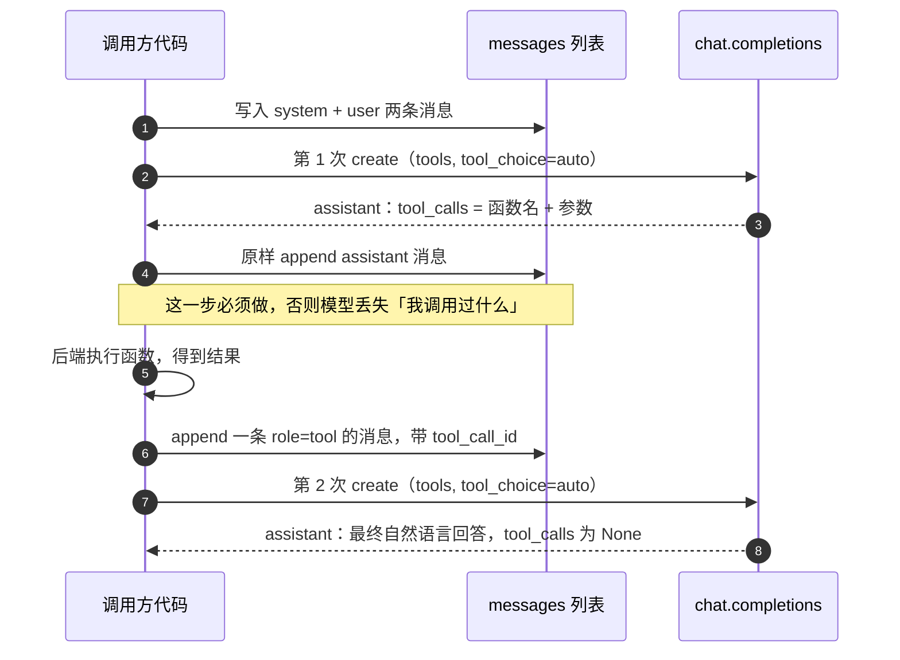

> **一句话总结**：Function Calling 让模型在生成文本的过程中**输出一段结构化的函数调用参数**（而不是直接执行函数），由开发者的后端真正执行函数、把结果回填给模型，从而补上大模型在信息实时性、数据局限性和功能扩展性上的三块短板。
> **前置知识**：[01-Agent基础范式与ReAct循环](../01-基础范式/01-Agent基础范式与ReAct循环.md) 的 Action 环节、[../llm/05-大模型API与调用实践.md](../../06-llm/06-提示工程/05-大模型API与调用实践.md) 的 `messages` 角色约定。
> **学完能做到**：
> 1. 用 6 个步骤描述一次 Function Calling 的完整往返，并说清「模型不执行函数」这一关键边界。
> 2. 手写合法的 tool schema（含 `required` 约束），把单函数、多函数、数据库查询三类工具接进对话循环。
> 3. 识别并修掉示例里的三处实现缺陷（`eval` 反序列化、只取 `tool_calls[0]`、schema 变量被覆盖）。

---

## 1. 核心概念

### 1.1 什么是 Function Calling

2023 年 6 月 13 日 OpenAI 公布了 Function Calling（函数调用）功能，其定义是：

> 在语言模型中集成外部功能或 API 的调用能力，这意味着模型可以在生成文本的过程中调用外部函数或服务，获取额外的数据或执行特定的任务。

实际语义要比字面更谨慎：**模型不会执行函数，只是返回函数的参数**；开发者利用模型输出的参数在自己应用里调用函数（标准写法即如此表述）。所以 Function Calling 的准确理解是「**结构化输出 + 工具路由**」，不是「让模型去跑代码」。

### 1.2 它解决大模型的三个问题

| 问题 | 具体表现 | Function Calling 如何缓解 |
| --- | --- | --- |
| 信息实时性 | 训练数据集无法包含最新的新闻、实时股价等 | 允许模型调用外部 API 实时获取最新数据 |
| 数据局限性 | 训练数据虽多但有限，无法覆盖医疗、法律等专业领域 | 允许模型调用外部数据库或 API 获取特定领域的详细信息 |
| 功能扩展性 | 模型不可能内置所有需要的功能 | 通过外部工具执行复杂计算、数据分析等，轻松扩展模型能力 |

这三条与 [01](../01-基础范式/01-Agent基础范式与ReAct循环.md) 里「工具使用」一节的动因完全一致：Function Calling 是工具使用能力在 API 协议层的实现方式。

### 1.3 两种调用模式对比

**没有 Function Call 时**，构建 AI 应用的模式非常简单：用户（Client）发请求给服务（ChatServer）；ChatServer 给模型提示词；重复执行。

**有 Function Call 时**，模式变复杂，给出四个主要步骤：

| 步骤 | 谁参与 | 发生了什么 |
| --- | --- | --- |
| 1 | Client → ChatServer | 用户发请求，同时带上 `prompt` 和 `functions`（函数定义） |
| 2 | ChatServer → GPT | 模型根据用户的 prompt，判断用**普通文本**还是**函数调用格式**响应 |
| 3 | ChatServer | 如果是函数调用格式，ChatServer 执行这个函数，并把结果返回给 GPT |
| 4 | GPT → Client | 模型使用提供的数据，用连贯的文本响应 |

差异可以用一张表概括：

| 维度 | 无 Function Call | 有 Function Call |
| --- | --- | --- |
| 请求内容 | `prompt` | `prompt` + `tools`（函数定义） |
| 模型输出 | 纯文本 | 纯文本 **或** 结构化调用请求 |
| 交互轮次 | 1 轮 | 至少 2 轮（调用 + 汇总） |
| 事实来源 | 模型参数记忆 | 外部系统实时返回 |

### 1.4 支持的模型与开发环境

国内外支持 Function Calling 的模型：GPT 系列（ChatGPT）、百度文心一言、智谱 ChatGLM3 / GLM-4、讯飞星火 3.0。

示例统一采用智谱 AI：

| 项目 | 值 |
| --- | --- |
| Python 版本 | 3.10 以上 |
| 安装 | `pip install zhipuai python-dotenv` |
| API Key 申请 | https://open.bigmodel.cn/dev/howuse/functioncall |
| 模型名 | `glm-4` |
| 环境变量 | `zhupu_api`（写法，建议统一改为 `ZHIPU_API_KEY`） |
| SDK 客户端 | `ZhipuAI(api_key=...)` |

### 1.5 六个标准步骤

「思考总结」给出的 Function Call 单一函数应用流程：

| # | 步骤 | 说明 |
| --- | --- | --- |
| 1 | **定义函数** | 函数可以是真实的外部 API 或工具，也可以是模拟函数 |
| 2 | **提供函数定义给模型** | 把定义好的函数作为参数（`tools`）提供给模型 |
| 3 | **模型生成函数调用 JSON** | 包含要调用的函数名称和参数值 |
| 4 | **后端系统执行函数** | 后端根据 JSON 中的内容，调用相应的函数 |
| 5 | **将函数结果返回给模型** | 函数结果作为模型的额外上下文信息 |
| 6 | **模型生成最终响应** | 模型综合原始查询、函数调用结果，生成最终输出 |

注意第 4 步的主语是**后端系统**，不是模型——这是最常见的面试考点。

---

## 2. 关键机制

### 2.1 消息状态机

Function Calling 的往返本质上是在维护一个 `messages` 列表，靠角色区分「谁说的话」：

| role | 内容 | 由谁写入 | 备注 |
| --- | --- | --- | --- |
| `system` | 角色与行为约束 | 开发者 | 例如「不要自己编造内容，提示用户明确输入」 |
| `user` | 用户问题 | 开发者 | 例如「今天北京的天气如何」 |
| `assistant` | 模型的第一次回复 | 由 `message.model_dump()` 原样写入 | **必须包含 tool_calls**，否则模型会丢失上下文 |
| `tool` | 函数执行结果 | 开发者 | 必须带 `tool_call_id`（部分实现还需 `name`） |

时序：

这段往返用时序图看得最清楚：谁在什么时候往 `messages` 里写了什么。



**读图要点**：

| 观察 | 含义 |
| --- | --- |
| 两次 create 之间夹着两次 append | 无状态接口里「上下文」完全由调用方手工拼装，漏一次 append 模型就看不到中间状态 |
| assistant 消息必须原样回灌 | 它带着 `tool_calls` 的 id，第二轮的 tool 消息靠这个 id 才能和调用对上号 |
| role=tool 的消息只能由后端写 | 第 4 步的主语是后端系统而不是模型，这是最常见的面试考点 |
| 自然语言回答出现在第二轮 | 模型不是「一次生成完」，而是「先要数据、拿到结果后再组织语言」 |
| tool_calls 为 None 是终态标志 | 调用方靠这个字段判断该收尾还是该继续循环 |

### 2.2 tool schema 的字段含义

`tools` 是一个列表，每一项遵循 OpenAI 的函数定义格式。以下是从天气示例还原出的完整结构（补全了被排版打散的层级）：

| 字段 | 层级 | 作用 | 天气示例的值 |
| --- | --- | --- | --- |
| `type` | 顶层 | 固定为 `function` | `"function"` |
| `function.name` | 第二层 | 函数名，模型回传时的唯一标识 | `"get_current_weather"` |
| `function.description` | 第二层 | **给模型看的自然语言说明**，决定何时选中该工具 | `"获取给定位置的当前天气"` |
| `function.parameters()` | 第二层 | JSON Schema，描述参数结构 | `{"type": "object", ...}` |
| `parameters.type` | 第三层 | 参数整体类型 | `"object"` |
| `parameters.properties` | 第三层 | 各参数的名称、类型与说明 | `{"location": {...}}` |
| `parameters.required` | 第三层 | 必填参数列表 | `["location"]` |
| `properties.<name>.type` | 第四层 | 参数类型 | `"string"` |
| `properties.<name>.description` | 第四层 | 参数含义，影响模型填值准确率 | `"城市或区，例如北京、海淀"` |

三条经验规则：

1. **`description` 就是给模型的 API 文档**，写得越具体，误选与参数填错越少；
2. `required` 不是形式约束——模型会据此判断「信息不足时是否应该先向用户追问」；
3. 参数名要与真实函数的形参名完全一致，否则 `**kwargs` 展开时会直接抛 `TypeError`。

### 2.3 参数解析与分发

 `parse_response(response)` 的两段式写法（已修正原文拼写）：

```text
"""Function Calling 单一函数示例：查询实时天气。

依赖：pip install zhipuai requests python-dotenv
环境变量：ZHIPU_API_KEY
"""

import json
import os

import requests
from zhipuai import ZhipuAI

CHATGLM = "glm-4"

def get_current_weather(location):
 """得到给定地址的当前天气信息"""
 with open("./cityCode_use.json", "r", encoding="utf-8") as file:
 data = json.load(file) # 城市与编码对照表，形如 [{"市名": "北京", "编码": "101010100"}, ...]

 city_code = None
 for loc in data:
 if location == loc["市名"]:
 city_code = loc["编码"]
 break
 if not city_code:
 return json.dumps({"error": "未找到城市: %s" % location}, ensure_ascii=False)

 weather_url = "http://t.weather.itboy.net/api/weather/city/" + city_code
 response = requests.get(weather_url, timeout=10)
 result1 = json.loads(response.text) # 修正：原文使用 eval(response.text)
 forecast = result1["data"]["forecast"][0]

 weather_info = {
 "location": location,
 "type": forecast["type"],
 "week": forecast["week"],
 "high_temperature": forecast["high"],
 "low_temperature": forecast["low"],
 }
 return json.dumps(weather_info, ensure_ascii=False)

tools = [
 {
 "type": "function",
 "function": {
 "name": "get_current_weather",
 "description": "获取给定位置的当前天气",
 "parameters": {
 "type": "object",
 "properties": {
 "location": {"type": "string", "description": "城市或区，例如北京、海淀"}
 },
 "required": ["location"],
 },
 },
 }
]

available_functions = {"get_current_weather": get_current_weather}

def parse_response(response):
 """根据模型回复判断是否调用工具，返回工具执行结果"""
 result = []
 message = response.choices[0].message
 if message.tool_calls:
 for tool_call in message.tool_calls: # 修正：原文只取 [0]
 name = tool_call.function.name
 args = json.loads(tool_call.function.arguments)
 func = available_functions.get(name)
 if func is None:
 result.append(json.dumps({"error": "未知函数: %s" % name}, ensure_ascii=False))
 continue
 result.append(func(**args))
 return result

def chat_completion_request(messages, tools=None, tool_choice=None, model=CHATGLM):
 client = ZhipuAI(api_key=os.environ["ZHIPU_API_KEY"])
 try:
 return client.chat.completions.create(
 model=model, messages=messages, tools=tools, tool_choice=tool_choice
 )
 except Exception as exc:
 print("Unable to generate ChatCompletion response")
 print("Exception: %s" % exc)
 return None

def main():
 messages = [
 {
 "role": "system",
 "content": (
 "你是一个天气播报小助手，你需要根据用户提供的地址来回答当地的天气情况，"
 "如果用户提供的问题具有不确定性，不要自己编造内容，提示用户明确输入"
 ),
 },
 {"role": "user", "content": "今天北京的天气如何"},
 ]

 response = chat_completion_request(messages, tools=tools, tool_choice="auto")
 if response is None:
 return

 assistant_message = response.choices[0].message
 messages.append(assistant_message.model_dump()) # 关键：保留 tool_calls 上下文

 for tool_call, function_response in zip(assistant_message.tool_calls, parse_response(response)):
 messages.append({
 "role": "tool",
 "name": tool_call.function.name,
 "tool_call_id": tool_call.id,
 "content": function_response,
 })

 last_response = chat_completion_request(messages, tools=tools, tool_choice="auto")
 if last_response is not None:
 print(last_response.choices[0].message.content)

if __name__ == "__main__":
 main()
```

要点：

- `arguments` 是**字符串**（模型逐 token 生成的自然结果），必须 `json.loads`；
- 用一张 `available_functions = {"name": callable}` 注册表分发，比 `if/elif` 链更好扩展；
- 一个 `assistant` 消息可能带**多个** `tool_calls`（并行调用），只取 `[0]` 会静默丢调用——这是三段示例的共同缺陷，见 4. 常见坑。

### 2.4 多函数与「链式调用」

的多函数示例（航班查询）展示了 Function Calling 的一个重要特性：**一次任务可以触发多轮调用**。

| 轮次 | 模型决定的动作 | 依赖关系 |
| --- | --- | --- |
| 第 1 轮 | 调 `get_plane_number(date, start, end)` | 用户直接给出了日期与起止地 |
| 第 2 轮 | 调 `get_ticket_price(date, number)` | `number` 来自第 1 轮的返回值 `1123` |
| 第 3 轮 | 生成最终答复 | 「2024年4月2日，郑州到北京的航班号为1123，票价为668元」 |

这就是 [01](../01-基础范式/01-Agent基础范式与ReAct循环.md) 里 ReAct 的 Observation 回填机制在 API 层的体现：**第 1 轮的结构化结果成为第 2 轮的输入条件**，模型自己完成了参数传递。

### 2.5 数据库查询类工具：schema 即提示词

第三个示例把 MySQL 表结构写进 `ask_database` 的 `description`：

```text
description: SQL查询提取信息以回答用户的问题。
 查询应该以纯文本返回，而不是JSON。
 SQL应该使用以下数据库模式编写: {database_schema_string}
```

这是「用工具描述注入领域知识」的典型手法，等价于把 schema 作为 few-shot 的一部分交给模型。表结构（`emp` / `DEPT`）声明后，模型就能把「查询一下最高工资的员工姓名及对应的工资」翻译成可执行 SQL，最终返回「KING，工资 5000 元」。

**但必须强调**：让 LLM 生成 SQL 再直接执行，是一条高风险路径。至少要加上只读账号、语句白名单（只允许 `SELECT`）、超时与行数上限。参见 [07-Agent工程化与可靠性设计](../04-评估与工程化/07-Agent工程化与可靠性设计.md)。

### 2.6 示例的三处实现缺陷（修正建议）

| 位置 | 原文写法 | 问题 | 修正 |
| --- | --- | --- | --- |
| `get_current_weather` | `result1 = eval(response.text)` | `eval` 会执行任意代码，HTTP 响应不可信 | 改用 `json.loads(response.text)` |
| `parse_response` | `message.tool_calls[0]` | 模型可并行返回多个 tool_call，只处理第一个会丢调用 | `for tool_call in message.tool_calls:` 全部处理 |
| `sql_function_tools.py` | `database_schema_string` 与 `database_schema_string1` 先后定义，前者被覆盖 | 单表与多表两个 schema 变量实际只生效一个，示例语义混乱 | 合并为一个 schema 常量，或按库名分文件维护 |

另外这里把 `to_addr`、`from_addr`、`from_pwd` 直接写进源码（仅部分打码），这在真实项目中属于凭证硬编码，应改为环境变量或密钥管理服务。

---

## 3. 可运行示例

### 3.1 单函数：天气查询（`weather_zhipu.py`）

**依赖**：`pip install zhipuai requests python-dotenv`；环境变量 `ZHIPU_API_KEY`。

```python
"""多函数 Function Calling：先查航班号，再根据航班号查票价。

依赖：标准库。真实调用模型时参考 3.1 的 chat_completion_request。
"""

import json

plane_number = {
"北京": {"广州": "356", "深圳": "126", "郑州": "1123"},
"郑州": {"北京": "1123", "天津": "3661"},
}

def get_plane_number(date: str, start: str, end: str):
    """根据始发地、目的地和日期，查询对应日期的航班号"""
    destinations = plane_number.get(start)
    if not destinations or end not in destinations:
        return {"error": "未查询到 %s → %s 的航班" % (start, end)}
    number = destinations[end]
    return {"date": date, "number": number}

def get_ticket_price(date: str, number: str):
    """查询某航班在某日的价格"""
    price_table = {"1123": "668", "356": "520", "126": "430"}
    if number not in price_table:
        return {"error": "未查询到航班 %s 的票价" % number}
    return {"ticket_price": price_table[number]}

FUNCTION_MAP = {
"get_plane_number": get_plane_number,
"get_ticket_price": get_ticket_price,
}

tools = [
{
"type": "function",
"function": {
"name": "get_plane_number",
"description": "根据始发地、目的地和日期，查询对应日期的航班号",
"parameters": {
"type": "object",
"properties": {
"start": {"type": "string", "description": "出发地"},
"end": {"type": "string", "description": "目的地"},
"date": {"type": "string", "description": "日期"},
},
"required": ["start", "end", "date"],
},
},
},
{
"type": "function",
"function": {
"name": "get_ticket_price",
"description": "查询某航班在某日的价格",
"parameters": {
"type": "object",
"properties": {
"number": {"type": "string", "description": "航班号"},
"date": {"type": "string", "description": "日期"},
},
"required": ["number", "date"],
},
},
},
]

def parse_function_call(model_response):
    """把模型回复里的所有 tool_call 都执行掉，返回结果列表"""
    results = []
    message = model_response.choices[0].message
    if not message.tool_calls:
        return [""]
    for tool_call in message.tool_calls:
        args = json.loads(tool_call.function.arguments)
        func = FUNCTION_MAP.get(tool_call.function.name)
        results.append(func(**args) if func else {"error": "未知函数"})
        return results

    if __name__ == "__main__":
        # 手工模拟「模型已经决定调用 get_plane_number」这一轮
        first = get_plane_number(date="2024-04-02", start="郑州", end="北京")
        print("第 1 轮结果:", json.dumps(first, ensure_ascii=False))
        # 把上一轮结果里的航班号喂给第二个工具（真实场景由模型自动完成这步）
        second = get_ticket_price(date="2024-04-02", number=first["number"])
        print("第 2 轮结果:", json.dumps(second, ensure_ascii=False))
```

预期输出（结果展示）：

```text
北京市当前的天气情况。今天是星期一，北京的天气情况是晴天，
最高气温为33℃，最低气温为17℃。请注意天气变化，做好防晒和保暖措施。
```

### 3.2 多函数：航班号 + 票价（`airplane` 三文件结构）

这里把多函数示例拆成三个文件：`muti_utils.py`（函数与分发）、`airplane_function_tools.py`（tool schema）、`muti_function_zhipu.py`（主逻辑）。合并后的最小可运行版本：

**依赖**：标准库（模型调用部分见 3.1）。

```python
"""Function Calling 实现数据库查询。

依赖：pip install pymysql
安全提示：生产环境必须使用只读账号，并校验 query 只包含 SELECT。
"""

import json
import re

import pymysql

database_schema_string = """
CREATE TABLE `emp` (
`empno` int DEFAULT NULL, -- 员工编号
`ename` varchar(50) DEFAULT NULL, -- 员工姓名
`job` varchar(50) DEFAULT NULL, -- 员工工作
`mgr` int DEFAULT NULL, -- 员工领导
`hiredate` date DEFAULT NULL, -- 员工入职日期
`sal` int DEFAULT NULL, -- 员工的月薪
`comm` int DEFAULT NULL, -- 员工年终奖
`deptno` int DEFAULT NULL -- 员工部门编号
);
CREATE TABLE `DEPT` (
`DEPTNO` int NOT NULL, -- 部门编码
`DNAME` varchar(14) DEFAULT NULL, -- 部门名称
`LOC` varchar(13) DEFAULT NULL, -- 地点
PRIMARY KEY (`DEPTNO`)
);
"""

def ask_database(query):
    """连接数据库，进行查询"""
    if not re.match(r"^\s*select\b", query, flags=re.IGNORECASE):
        return json.dumps({"error": "仅允许 SELECT 查询"}, ensure_ascii=False)
    if ";" in query.rstrip().rstrip(";"):
        return json.dumps({"error": "禁止多语句执行"}, ensure_ascii=False)

    conn = pymysql.connect(
    host="localhost", port=3306, user="root", password="123456",
    database="it_heima", charset="utf8mb4",
    cursorclass=pymysql.cursors.DictCursor,
    )
    try:
        with conn.cursor() as cursor:
            cursor.execute(query)
            result = cursor.fetchall()
            return json.dumps(result, ensure_ascii=False, default=str)
    finally:
        conn.close()

        tools = [
        {
        "type": "function",
        "function": {
        "name": "ask_database",
        "description": (
        "使用此函数回答业务问题，要求输出是一个SQL查询语句。"
        "SQL查询提取信息以回答用户的问题。"
        "查询应该以纯文本返回，而不是JSON。"
        "SQL应该使用以下数据库模式编写: %s" % database_schema_string
        ),
        "parameters": {
        "type": "object",
        "properties": {
        "query": {"type": "string", "description": "需要执行的 SQL 语句"}
        },
        "required": ["query"],
        },
        },
        }
        ]

        available_functions = {"ask_database": ask_database}

        def parse_response(response):
            """根据模型回复决定是否调用工具，返回工具执行结果"""
            message = response.choices[0].message
            if not message.tool_calls:
                return None
            tool_call = message.tool_calls[0]
            args = json.loads(tool_call.function.arguments)
            return available_functions[tool_call.function.name](**args)

        if __name__ == "__main__":
            print(ask_database("SELECT ename, sal FROM emp ORDER BY sal DESC LIMIT 1"))
```

预期输出：

```text
第 1 轮结果: {"date": "2024-04-02", "number": "1123"}
第 2 轮结果: {"ticket_price": "668"}
```

### 3.3 数据库查询工具：`ask_database`（`sql` 示例）

**依赖**：`pip install pymysql`。

预期输出（结果展示）：

```text
[{"ename": "KING", "sal": 5000}]
```

模型最终把这个结果组织成自然语言：「根据您的查询，我已经为您找到了工资最高的员工。这位员工的姓名是 KING，他的工资是 5000 元。」

---

## 4. 常见坑

| 现象 | 原因 | 解决 |
| --- | --- | --- |
| `json.decoder.JSONDecodeError` | 直接把 `function.arguments` 当 dict 用，忘了它是 JSON 字符串 | `args = json.loads(tool_call.function.arguments)`；对空串做 `or "{}"` 兜底 |
| 第二轮调用报「assistant 消息缺少 tool_calls」 | 没有把第一次的 assistant 消息（含 `tool_calls`）append 回 messages | `messages.append(response.choices[0].message.model_dump())` |
| 报 tool 消息 `tool_call_id` 不匹配 | 只填了 `content`，漏了 `tool_call_id`（部分实现还需 `name`） | 从 `tool_call.id` 与 `tool_call.function.name` 成对取 |
| 模型该调工具却不调 | `description` 写得含糊，或参数没有 `required` 约束 | 把工具描述写成「动作 + 对象 + 适用条件」，补全 `required` |
| 模型不追问、直接编造参数 | system prompt 没约束 | 加「不要假设或猜测传入函数的参数值，描述不明确时请要求用户提供必要信息」 |
| `TypeError: got an unexpected keyword argument` | schema 里的参数名与真实函数形参名不一致 | 参数名严格对齐；或用 `**{k: v for k, v in args.items() if k in sig}` 过滤 |
| 并行工具调用只返回一半结果 | 代码写死 `tool_calls[0]`（示例即有此问题） | 遍历全部 `tool_calls`，逐个执行并各自 append 一条 `tool` 消息 |
| 由 LLM 生成的 SQL 删库 / 越权 | 直接把模型输出丢给数据库执行 | 只读账号 + `SELECT` 白名单 + 单语句校验 + 超时与行数上限 |
| 把 API Key 写进源码 | 示例代码习惯（地址、密码部分硬编码） | 统一走环境变量 / 密钥管理，源码只留占位读取 |

---

## 5. 面试问答

<details><summary>参考答案</summary>

**Q1：Function Calling 中，LLM 是否会真正执行 function？**

不会。模型只负责在需要外部信息时，输出一段结构化的 JSON，包含要调用的函数名与参数值；真正的执行由开发者的后端系统完成，执行结果再作为 `role: "tool"` 的消息回填给模型，模型据此生成最终文本。这样设计的原因有三：安全（模型不能任意触发副作用）、可控（函数执行前可以做参数校验与权限检查）、可扩展（同一份 schema 可以对接不同后端）。面试中如果答成「模型会调用函数」通常会被认为没有真正跑通链路。

</details>

<details><summary>参考答案</summary>

**Q2：请描述一次完整的 Function Calling 往返，并说明 messages 列表的变化。**

第一轮：messages = [system, user]，携带 `tools` 与 `tool_choice="auto"` 调用模型，模型返回 assistant 消息，其中 `tool_calls` 给出函数名与 JSON 格式 arguments，`content` 通常为空。接着把这条 assistant 消息整体（含 tool_calls）append 回 messages，再把每个工具的执行结果以 `{"role": "tool", "tool_call_id": ..., "content": ...}` 追加。第二轮：再次调用模型，此时模型看到完整证据链，输出自然语言答复且 `tool_calls` 为空。若一次任务需要串联多个工具（如先查航班号再查票价），就重复这个「assistant → tool → 再调用」的过程直到模型给出 Final Answer。

</details>

<details><summary>参考答案</summary>

**Q3：tool schema 里哪些字段最容易影响准确率？为什么？**

最关键的是 `function.description`、`parameters.properties.<name>.description` 和 `required`。前两者是模型唯一可见的工具文档——工具选择依赖 description 的语义匹配，参数填值依赖属性描述；`required` 则决定模型判断「信息是否足够」，缺少 required 会让模型倾向于编造缺失参数而不是向用户追问。相比之下，函数名本身的字面语义权重较低。工程上常用的优化手段是：描述里写清适用条件与不适用条件、给出参数示例值（如「城市或区，例如北京、海淀」）、在 system prompt 里补充「不要猜测参数」的兜底规则。

</details>

---

## 6. 自测题

<details><summary>参考答案</summary>

**1. Function Calling 解决了大模型哪三类问题？各对应什么能力缺失？**

信息实时性（训练数据有截止日期，拿不到最新新闻、实时股价）；数据局限性（训练语料无法覆盖医疗、法律等专业领域）；功能扩展性（模型不能内置所有功能，也不擅长精确计算与数据分析）。分别通过调用实时 API、领域数据库/API、计算与代码执行类工具补齐。

</details>

<details><summary>参考答案</summary>

**2. 写出一份最小的函数定义，函数名为 `search_orders`，需要一个必填字符串参数 `order_id`。**

```json
{
 "type": "function",
 "function": {
 "name": "search_orders",
 "description": "根据订单号查询订单详情",
 "parameters": {
 "type": "object",
 "properties": {
 "order_id": {"type": "string", "description": "订单编号，例如 12345"}
 },
 "required": ["order_id"]
 }
 }
}
```

</details>

<details><summary>参考答案</summary>

**3. 为什么「第一次调用后要 append assistant_message.model_dump()」这一步不能省？**

因为第二轮的请求必须让模型知道自己上一轮做过什么。如果只补了一条 `role: "tool"` 的结果而不带对应的 `tool_calls` 请求，模型会看到一个没有来源的工具结果，轻则报协议错误（tool_call_id 无法对应），重则丢掉推理链、重复调用同一个工具。`model_dump()` 保留了包括 `tool_calls` 在内的完整字段。

</details>

<details><summary>参考答案</summary>

**4. 航班示例中，第二次调用 `get_ticket_price` 的参数 `number=1123` 是谁决定的？**

是模型决定的，而不是开发者硬编码的。第一轮工具返回 `{"date": "2024-04-02", "number": "1123"}` 后，这条结果被作为 tool 消息回填；模型在第二轮据此生成 `get_ticket_price(date="2024-04-02", number="1123")` 的调用参数。这正是 Function Calling 支撑多步任务的关键：中间结果通过 messages 在工具之间流转。

</details>

<details><summary>参考答案</summary>

**5. 示例里用 `eval(response.text)` 解析 HTTP 响应，风险是什么？**

`eval` 会执行任意 Python 表达式。HTTP 响应体来自外部，一旦被篡改或中间人劫持，就可能执行任意代码，属于典型的远程代码执行漏洞。天气 API 返回的是 JSON，应当用 `json.loads`；如果确实需要解析 Python 字面量，也应使用 `ast.literal_eval`。

</details>

---

## 7. 延伸阅读

- OpenAI Function Calling 官方指南 —— https://platform.openai.com/docs/guides/function-calling
- 智谱 AI Function Call 文档 —— https://open.bigmodel.cn/dev/howuse/functioncall
- Anthropic Tool use 文档 —— https://docs.anthropic.com/en/docs/build-with-claude/tool-use
- JSON Schema 规范 —— https://json-schema.org/
- Toolformer: Language Models Can Teach Themselves to Use Tools —— https://arxiv.org/abs/2302.04761
- ：《第九章：大模型 Function Call 工具应用》

---

[⬅️ 返回本目录索引](README.md)
