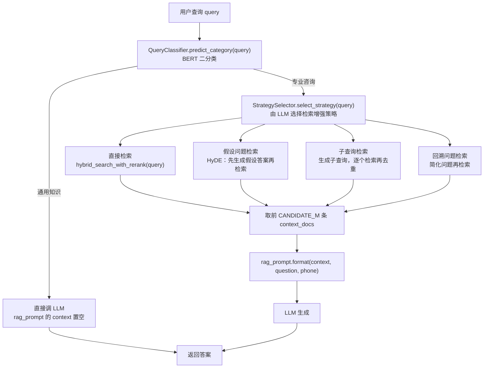

> **一句话总结**：RAG（Retrieval-Augmented Generation）在 Agent 体系里承担「外部知识记忆」的角色——先把文档切成父子块向量化存库，再用「稠密 + 稀疏混合检索 → 重排 → 拼上下文」把与问题最相关的证据交给 LLM；的 RAG 系统还额外加了**查询意图识别**与**检索策略选择**两道规划，避免所有问题都硬走检索。
> **前置知识**：[05-Agent的记忆与知识管理](05-Agent的记忆与知识管理.md) 的外部知识记忆、[04-Agent的规划与任务分解](../02-工具与规划/04-Agent的规划与任务分解.md) 的查询改写策略、[../llm/07-向量数据库与Milvus.md](../../06-llm/07-检索增强RAG/07-向量数据库与Milvus.md)。
> **学完能做到**：
> 1. 说出 RAG 三段式（索引 / 检索 / 生成）中各模块的职责，并画出 RAG 的模块协作图。
> 2. 解释父子块分层切分的动机，写出 Milvus 集合的字段与索引设计（`IVF_FLAT` + `SPARSE_INVERTED_INDEX`）。
> 3. 说明混合检索的融合方式（`WeightedRanker`）与重排（`CrossEncoder`）的分工，并写出一个最小可运行 RAG。

---

## 1. 核心概念

### 1.1 为什么 Agent 需要 RAG

| 模型短板 | 表现 | RAG 的作用 |
| --- | --- | --- |
| 知识截止 | 训练数据有截止日期 | 从外部库取最新文档 |
| 私有知识缺失 | 不知道企业内部的大纲、学费、FAQ | 把私有文档向量化后按需检索 |
| 幻觉 | 无依据时倾向于编造 | 把检索到的原文作为证据放进 prompt，并要求「答案来源于文档时请说明」 |
| 上下文窗口有限 | 不可能把所有文档塞进 prompt | 只回传 top-k 相关片段 |

在 [01](../01-基础范式/01-Agent基础范式与ReAct循环.md) 的能力公式里，RAG 对应的是**记忆中的「外部向量存储的知识库」**那一项；在 [04](../02-工具与规划/04-Agent的规划与任务分解.md) 的规划框架里，它是一个可被选择的「检索动作」。

### 1.2 RAG 三段式

| 阶段 | 何时执行 | 主要动作 | 的模块 |
| --- | --- | --- | --- |
| 索引（Indexing） | 离线，一次性或定期 | 加载 → 切分 → 向量化 → 写入向量库 | `document_processor.py`、`vector_store.py`（写入部分） |
| 检索（Retrieval） | 在线，每次查询 | 查询向量化 → 混合检索 → 重排 → 取父文档 | `vector_store.py`（检索部分）、`strategy_selector.py` |
| 生成（Generation） | 在线，检索之后 | 拼上下文 → 调 LLM → 输出答案 | `prompts.py`、`rag_system.py` |

一个常见的理解误区是把 RAG 等同于「向量检索」。实际上**检索只是中间一环**，前后两环（切分策略、prompt 设计）对最终质量的影响往往更大。

### 1.3 RAG 的模块协作

 `rag_system.py` 的 `generate_answer` 串起了全部模块：

这张图回答：一次查询进来之后，会在哪几个分岔点上被决定走哪条路。



**读图要点**：

| 观察 | 含义 |
| --- | --- |
| 分类器排在检索之前 | 通用知识直接问模型，一次检索都不做——这是省成本、避噪声的第一道闸门 |
| 四条策略边互斥 | StrategySelector 每次只选一条，所以同一次查询只有一条检索路径被激活 |
| 四条路径汇到同一个 context 变量 | 策略差异被收敛成「一组上下文文档」，下游的 prompt 与生成逻辑完全复用 |
| 通用知识分支绕过了策略选择与向量库 | 两个分支在同一个「返回答案」节点收口，调用方不需要区分自己走的是哪条 |
| 两道前置判断位置不同 | 分类决定「要不要检索」，策略选择决定「怎么检索」，是成本与召回两个不同方向的优化 |

| 模块 | 类 | 职责 |
| --- | --- | --- |
| `document_processor.py` | 函数式 | 多格式加载 + 分层切分（父块 / 子块） |
| `vector_store.py` | `VectorStore` | 集合管理、写入、混合检索 + 重排 |
| `prompts.py` | `RAGPrompts` | 集中管理 4 个 Prompt 模板 |
| `query_classifier.py` | `QueryClassifier` | BERT 二分类，决定是否走 RAG |
| `strategy_selector.py` | `StrategySelector` | LLM 选择检索增强策略 |
| `rag_system.py` | `RAGSystem` | 编排上述模块，产出最终答案 |

两道前置判断（分类 + 策略）是这套系统相对「无脑检索」的主要增量：**不必要检索的问题不检索**（省成本、避免噪声），**需要改写的问题先改写**（提高召回）。

### 1.4 LangChain Indexes 四件套

在 LangChain 部分给出的通用抽象：

| 组件 | 职责 | 示例 |
| --- | --- | --- |
| 文档加载器（Document Loaders） | 把各种格式文件转成文本，基于 `Unstructured` 包 | `TextLoader`、`UnstructuredFileLoader`、`PDF`、`CSV`、`Markdown`、`Images`、`FileDirectory`、`HTML`、`Microsoft PowerPoint`、`Jupyter Notebook` |
| 文本分割器（Text Splitters） | 按分隔符与长度把长文本切成片段 | `CharacterTextSplitter`（默认分隔符 `\n\n`）、`MarkdownTextSplitter`、`TokenTextSplitter`、`PythonCodeTextSplitter`、`LatexTextSplitter` |
| 向量库（VectorStores） | 存储嵌入向量并提供相似查询 | Chroma、FAISS、Milvus、Pinecone、Redis、ElasticSearch |
| 检索器（Retrievers） | 统一查询接口 | `VectorStoreRetriever`、`TF-IDFRetriever`、`SVMRetriever`、`ElasticSearchBM25`、`WeaviateHybridSearch`、`PineconeHybridSearch`、`Wikipedia`、`ChatGPTPluginRetriever` 等 |

**检索器的接口约定**：至少提供一个 `get_relevant_texts`（`get_relevant_documents`）方法，接收查询字符串，返回一组文档。

`CharacterTextSplitter` 的行为示例（原例）：

```python
"""最小 RAG 流程演示：切分 → 向量化 → 余弦召回 → 拼上下文。

依赖：仅标准库。真实项目请用 BGE / OpenAI Embeddings 替换 fake_embed。
"""

import hashlib
import math

DOCUMENT = """
Milvus 是面向向量检索的数据库，支持亿级向量的近似最近邻搜索。
它采用存算分离架构，可通过增加 query node 水平扩展检索吞吐。
IVF_FLAT 索引属于倒排文件加暴力精算，精度高、构建速度快。
SPARSE_INVERTED_INDEX 适合稀疏向量，构建时可用 drop_ratio_build 丢弃低权重词项。
Zilliz Cloud 是全托管的 Milvus 服务，免去集群运维，按量计费。
选择向量数据库时需要权衡成本、运维复杂度与数据规模。
"""

DIM = 64

def fake_embed(text):
    """用字符 bigram 的哈希构造固定维度伪向量，仅用于流程演示。"""
    vector = [0.0] * DIM
    for i in range(len(text) - 1):
        gram = text[i:i + 2]
        index = int(hashlib.md5(gram.encode("utf-8")).hexdigest(), 16) % DIM
        vector[index] += 1.0
        norm = math.sqrt(sum(v * v for v in vector)) or 1.0
        return [v / norm for v in vector]

    def cosine(a, b):
        return sum(x * y for x, y in zip(a, b))

    def chunk_text(text, chunk_size=60, overlap=10):
        """按字符滑窗切分（真实项目请用按语义/标点的递归切分器）。"""
        chunks = []
        start = 0
        while start < len(text):
            chunks.append(text[start:start + chunk_size])
            start += chunk_size - overlap
            return [c.strip() for c in chunks if c.strip()]

        def build_index(text):
            chunks = chunk_text(text)
            return [{"text": chunk, "vector": fake_embed(chunk)} for chunk in chunks]

        def retrieve(index, query, k=2):
            query_vector = fake_embed(query)
            scored = [(cosine(query_vector, item["vector"]), item) for item in index]
            scored.sort(key=lambda pair: pair[0], reverse=True)
            return [item for _, item in scored[:k]]

        RAG_PROMPT = """你是一个智能助手，帮助用户回答问题。
        如果提供了上下文，请基于上下文回答；如果答案来源于检索到的文档，请在回答中说明。

        上下文: {context}
        问题: {question}

        如果无法回答，请回复："信息不足，无法回答。"
        回答:"""

        def build_prompt(query, docs):
            context = "\n\n".join(doc["text"] for doc in docs) if docs else ""
            return RAG_PROMPT.format(context=context, question=query)

        if __name__ == "__main__":
            index = build_index(DOCUMENT)
            print("索引块数:", len(index))

            for query in ["IVF_FLAT 索引有什么特点？", "完全无关的问题：今天天气如何？"]:
                docs = retrieve(index, query, k=2)
                print("\n=== 查询:", query)
                for doc in docs:
                    print(" 召回:", doc["text"][:40].replace("\n", " "))
                    print("--- 最终 prompt ---")
                    print(build_prompt(query, docs))
```

注意 `chunk_size=5` 却切出 `'a b c'`（3 个字符）——因为切分先按分隔符断开，再在长度限制内合并，所以**实际块长通常小于 `chunk_size`**。这一点在调参时容易误判。

### 1.5 支持的文件类型与加载器（RAG 的实现）

```text
document_loaders = {
 ".txt": TextLoader,
 ".pdf": OCRPDFLoader, # 基于 paddleOCR，处理扫描件与表格
 ".docx": OCRDOCLoader,
 ".ppt": OCRPPTLoader,
 ".pptx": OCRPPTLoader,
 ".jpg": OCRIMGLoader,
 ".png": OCRIMGLoader,
 ".md": UnstructuredMarkdownLoader,
}
```

加载时同时注入四条元数据：`source`（学科类别，从目录名推导，如 `ai_data` → `ai`）、`file_path`、`timestamp`（`datetime.now().isoformat()`）、以及后续切分阶段补充的 `parent_id` / `parent_content` / `id`。**元数据是检索过滤与溯源的基础**，例如 `filter_expr = f"source == '{source_filter}'"` 就依赖 `source` 字段实现按学科过滤。

---

## 2. 关键机制

### 2.1 分层切分：父块与子块

 `process_documents()` 的切分策略是**两层**：

| 层级 | 切分器 | 大小参数 | 用途 |
| --- | --- | --- | --- |
| 父块 | `ChineseRecursiveTextSplitter`（Markdown 文件用 `MarkdownTextSplitter`） | `PARENT_CHUNK_SIZE` | 提供完整语义上下文 |
| 子块 | 同上，更小 | `CHILD_CHUNK_SIZE`，重叠 `CHUNK_OVERLAP` | 参与向量检索，精度更高 |

切分时写入的元数据：

| 字段 | 生成方式 | 作用 |
| --- | --- | --- |
| `parent_id` | `f"doc_{i}_parent_{j}"` | 定位父块 |
| `parent_content` | 父块的 `page_content`（冗余存在子块元数据里） | 命中子块后直接替换为完整上下文，无需二次查库 |
| `id` | `f"{parent_id}_child_{k}"` | 子块唯一标识 |
| `source` / `file_path` / `timestamp` | 加载阶段注入 | 过滤与溯源 |

**为什么值得这么做**：小块的向量表达更聚焦，检索命中率高；但小块缺少上下文，直接交给 LLM 容易答不完整。父子块结构让「小块的召回精度」与「大块的语义完整性」同时成立。代价是元数据冗余存储（每个子块都存一份父块内容）。

### 2.2 Milvus 集合设计

 `_create_or_load_collection()` 的 schema：

| 字段 | 类型 | 约束 | 说明 |
| --- | --- | --- | --- |
| `id` | `VARCHAR` | `is_primary=True, max_length=100` | 主键，写入时为文档内容的 **MD5 哈希** |
| `text` | `VARCHAR` | `max_length=65535` | 子块原文 |
| `dense_vector` | `FLOAT_VECTOR` | `dim=self.dense_dim` | BGE-M3 稠密向量 |
| `sparse_vector` | `SPARSE_FLOAT_VECTOR` | — | BGE-M3 稀疏向量（词权重） |
| `parent_id` | `VARCHAR` | `max_length=100` | 父块标识 |
| `parent_content` | `VARCHAR` | `max_length=65535` | 父块内容 |
| `source` | `VARCHAR` | `max_length=50` | 学科类别 |
| `timestamp` | `VARCHAR` | `max_length=50` | 入库时间 |

索引设计：

| 字段 | 索引类型 | 度量 | 参数 | 取舍 |
| --- | --- | --- | --- | --- |
| `dense_vector` | `IVF_FLAT` | `IP`（内积） | `nlist=128` | 倒排文件 + 暴力精算，**精度高、速度中等**；`nlist` 越大聚类越细 |
| `sparse_vector` | `SPARSE_INVERTED_INDEX` | `IP` | `drop_ratio_build=0.2` | 稀疏倒排索引，构建时丢弃权重最小的 20% 词项以省空间 |

其它要点：

- `create_schema(auto_id=False, enable_dynamic_field=True)`：主键自己给（因为要用 MD5），并允许写入 schema 之外的动态字段；
- 创建后必须 `load_collection()` 才能查询；
- 写入用 `upsert` 而非 `insert`，**相同 ID（相同内容）覆盖**，天然具备幂等性——重复索引同一批文档不会产生重复条目。

### 2.3 混合检索：稠密 + 稀疏

**为什么要混合**：稠密向量擅长语义相似（「学费多少」↔「收费标准」），稀疏向量擅长精确词匹配（专有名词、型号、人名）。两者互补，混合检索能同时提高召回率与准确率。

流程（`hybrid_search_with_rerank`）：

| 步骤 | 代码 | 说明 |
| --- | --- | --- |
| 1 | `query_embeddings = self.embedding_function([query])` | 一次调用同时得到稠密与稀疏查询向量 |
| 2 | 稀疏矩阵转 dict：`{idx: value}` | 稀疏向量在 Milvus 中以 `{维度: 权重}` 形式传入 |
| 3 | 构造两个 `AnnSearchRequest` | 一个查 `dense_vector`，一个查 `sparse_vector` |
| 4 | `WeightedRanker(0.7, 1.0)` | **稀疏权重 0.7，稠密权重 1.0** |
| 5 | `client.hybrid_search(reqs=[dense, sparse], ranker=ranker, limit=k, output_fields=[...])` | 返回融合后的 Top-K |

检索参数：

| 参数 | 值 | 含义 |
| --- | --- | --- |
| `param={"metric_type": "IP", "params": {"nprobe": 10}}` | 稠密 | 探测 10 个倒排单元；`nprobe` 越大越准越慢 |
| `limit = k`（`conf.RETRIEVAL_K`） | 两路 | 每路各取 Top-K 参与融合 |
| `expr = filter_expr` | 可选 | 如 `source == 'ai'`，按学科过滤 |
| `output_fields` | `text / parent_id / parent_content / source / timestamp` | 只取需要回传的字段，减少网络开销 |

`WeightedRanker` 的权重是需要根据数据调的超参：如果业务里专有名词多、查询短，可以适当提高稀疏权重；如果查询是自然语言长句，稠密权重应更高。给出的 `0.7 / 1.0` 是经验起点而非定论。

### 2.4 重排（Rerank）

检索得到 Top-K 之后，还有一个精排阶段：

| 步骤 | 做法 | 目的 |
| --- | --- | --- |
| 1 | 把命中的子块转成 `Document`，再用 `_get_unique_parent_docs()` 取**去重的父文档** | 用大块提供完整语义，避免同一父块的多个子块挤占名额 |
| 2 | 若父文档少于 2 个，直接返回（**跳过重排**） | 重排意义不大，省一次模型推理 |
| 3 | `pairs = [[query, doc.page_content] for doc in parent_docs]` | 构造 (问题, 文档) 对 |
| 4 | `scores = self.reranker.predict(pairs)` | `CrossEncoder("./bge/bge-reranker-large")` 逐个打分 |
| 5 | `sorted(zip(scores, parent_docs), reverse=True)` | 按分数降序 |
| 6 | `return ranked_parent_docs[:conf.CANDIDATE_M]` | 裁剪到候选上限，控制 prompt 长度 |

**为什么需要重排**：向量检索是「双塔」结构，查询与文档分别编码后算相似度，速度快但精度有限；CrossEncoder 把查询与文档**拼在一起**过一遍模型，能建模细粒度交互，精度更高但无法预先建索引，因此只能对少量候选做精排。这就是「粗召回 + 精排」的两阶段范式。

### 2.5 查询意图识别：不是所有问题都该检索

 `QueryClassifier` 用 BERT 做二分类，把查询分成「通用知识」与「专业咨询」：

| 项 | 值 |
| --- | --- |
| 底座模型 | `bert-base-chinese` |
| 任务 | `BertForSequenceClassification`，`num_labels=2` |
| 标签映射 | `{"通用知识": 0, "专业咨询": 1}` |
| 训练数据 | `training_dataset_hybrid_5000.json`，80% 训练 / 20% 验证 |
| 关键超参 | `num_train_epochs=3`、`per_device_train_batch_size=8`、`max_length=128`、`fp16=False`、`metric_for_best_model="eval_loss"`、`save_total_limit=1` |
| 效果 | 准确率 93% 左右（分类报告 precision/recall/f1 均约 0.93，混淆矩阵 `[[460, 40], [30, 470]]`） |

**路由逻辑**：

```text
if query_category == "通用知识":
 prompt_input = rag_prompt.format(context="", question=query, phone=...)
 answer = llm(prompt_input) # 不检索
else:
 strategy = strategy_selector.select_strategy(query)
 context_docs = retrieve_and_merge(query, source_filter, strategy)
 answer = llm(rag_prompt.format(context=context, ...))
```

还记录了一个真实修复：早期 `evaluate_model` 对数字标签重复映射回 `label_map`，触发 `KeyError: 1`；修法是**直接使用传入的数字标签**，只对 `texts` 做分词。

### 2.6 RAG Prompt 的设计要点

 `RAGPrompts.rag_prompt()`：

```text
你是一个智能助手，帮助用户回答问题。
如果提供了上下文，请基于上下文回答；如果没有上下文，请直接根据你的知识回答。
如果答案来源于检索到的文档，请在回答中说明。

上下文: {context}
问题: {question}

如果无法回答，请回复：'信息不足，无法回答，请联系人工客服，电话：{phone}。'
回答:
```

| 设计要点 | 作用 |
| --- | --- |
| 「有上下文就基于上下文，没有就用自己的知识」 | 兼容「通用知识」分支复用同一模板（`context=""`） |
| 「如果答案来源于文档，请说明」 | 可溯源，减少无依据编造 |
| 兜底回复 + 人工客服电话 | 检索失败时不硬编答案，给用户明确出口 |

另有一个被注释掉的增强版模板，额外引入了**对话历史** `{history}`，并把「评估对话历史是否与当前问题相关、无关则忽略」写进指令——这属于 [05](05-Agent的记忆与知识管理.md) 讨论的上下文管理范畴。

### 2.7 把 RAG 包装成 Agent 工具

> **说明**：本小节超出本节范围，为通用知识补充，用于把 RAG 接进 [02](../02-工具与规划/02-Function-Calling与工具调用.md) 的工具协议。

把检索器注册成一个工具，Agent 就能**自主决定何时检索**（而不是像 2.5 那样用固定分类器路由）：

```json
{
 "type": "function",
 "function": {
 "name": "search_knowledge_base",
 "description": "在企业知识库中检索与问题相关的文档片段。当问题涉及、学费、政策等企业私有信息时使用。",
 "parameters": {
 "type": "object",
 "properties": {
 "query": {"type": "string", "description": "检索用的自然语言问题"},
 "source": {"type": "string", "description": "可选，学科过滤，如 ai / java"}
 },
 "required": ["query"]
 }
 }
}
```

两者的差别：

| 方式 | 决策者 | 优点 | 缺点 |
| --- | --- | --- | --- |
| 分类器路由（做法） | 独立小模型 | 快（BERT 一次前向）、成本低、可控 | 只有「检索 / 不检索」两档，不够灵活 |
| 检索即工具 | 主 LLM | 灵活，可多轮检索、可与其他工具组合 | 每次决策都消耗主模型 token，延迟更高 |

---

## 3. 可运行示例

### 3.1 最小 RAG：切分 → 假向量 → 余弦召回 → 拼 prompt

**依赖**：仅标准库（用哈希构造伪向量替代 embedding，便于本地验证流程）。

```python
"""Milvus 混合检索 + 重排的骨架实现（对应源文件 vector_store.py）。

依赖：pip install pymilvus milvus-model sentence-transformers
"""

import hashlib

from langchain.docstore.document import Document
from milvus_model.hybrid import BGEM3EmbeddingFunction
from pymilvus import AnnSearchRequest, DataType, MilvusClient, WeightedRanker
from sentence_transformers import CrossEncoder

COLLECTION_NAME = "edu_rag"
HOST, PORT, DATABASE = "localhost", 19530, "default"
RETRIEVAL_K = 10
CANDIDATE_M = 5

class VectorStore:
    def __init__(self, reranker_path="./bge/bge-reranker-large"):
        self.reranker = CrossEncoder(reranker_path)
        self.embedding_function = BGEM3EmbeddingFunction(use_fp16=False, device="cpu")
        self.dense_dim = self.embedding_function.dim["dense"]
        self.client = MilvusClient(uri="http://%s:%s" % (HOST, PORT), db_name=DATABASE)
        self._create_or_load_collection()

        def _create_or_load_collection(self):
            if not self.client.has_collection(COLLECTION_NAME):
                schema = self.client.create_schema(auto_id=False, enable_dynamic_field=True)
                schema.add_field(field_name="id", datatype=DataType.VARCHAR, is_primary=True, max_length=100)
                schema.add_field(field_name="text", datatype=DataType.VARCHAR, max_length=65535)
                schema.add_field(field_name="dense_vector", datatype=DataType.FLOAT_VECTOR, dim=self.dense_dim)
                schema.add_field(field_name="sparse_vector", datatype=DataType.SPARSE_FLOAT_VECTOR)
                schema.add_field(field_name="parent_id", datatype=DataType.VARCHAR, max_length=100)
                schema.add_field(field_name="parent_content", datatype=DataType.VARCHAR, max_length=65535)
                schema.add_field(field_name="source", datatype=DataType.VARCHAR, max_length=50)

                index_params = self.client.prepare_index_params()
                index_params.add_index(
                field_name="dense_vector", index_name="dense_index",
                index_type="IVF_FLAT", metric_type="IP", params={"nlist": 128},
                )
                index_params.add_index(
                field_name="sparse_vector", index_name="sparse_index",
                index_type="SPARSE_INVERTED_INDEX", metric_type="IP",
                params={"drop_ratio_build": 0.2},
                )
                self.client.create_collection(
                collection_name=COLLECTION_NAME, schema=schema, index_params=index_params
                )
                print("已创建集合 %s" % COLLECTION_NAME)
            else:
                print("已加载集合 %s" % COLLECTION_NAME)
                self.client.load_collection(COLLECTION_NAME)

                @staticmethod
                def _sparse_to_dict(row):
                    return {int(idx): float(value) for idx, value in zip(row.indices, row.data)}

                def add_documents(self, documents):
                    texts = [doc.page_content for doc in documents]
                    embeddings = self.embedding_function(texts)
                    data = []
                    for i, doc in enumerate(documents):
                        data.append({
                        "id": hashlib.md5(doc.page_content.encode("utf-8")).hexdigest(),
                        "text": doc.page_content,
                        "dense_vector": embeddings["dense"][i],
                        "sparse_vector": self._sparse_to_dict(embeddings["sparse"].getrow(i)),
                        "parent_id": doc.metadata["parent_id"],
                        "parent_content": doc.metadata["parent_content"],
                        "source": doc.metadata.get("source", "unknown"),
                        })
                        if data:
                            self.client.upsert(collection_name=COLLECTION_NAME, data=data)
                            print("已插入或更新 %d 个文档" % len(data))

                            def hybrid_search_with_rerank(self, query, k=RETRIEVAL_K, source_filter=None):
                                query_embeddings = self.embedding_function([query])
                                dense_query_vector = query_embeddings["dense"][0]
                                sparse_query_vector = self._sparse_to_dict(query_embeddings["sparse"].getrow(0))

                                filter_expr = "source == '%s'" % source_filter if source_filter else ""

                                dense_request = AnnSearchRequest(
                                data=[dense_query_vector], anns_field="dense_vector",
                                param={"metric_type": "IP", "params": {"nprobe": 10}}, limit=k, expr=filter_expr,
                                )
                                sparse_request = AnnSearchRequest(
                                data=[sparse_query_vector], anns_field="sparse_vector",
                                param={"metric_type": "IP", "params": {}}, limit=k, expr=filter_expr,
                                )

                                ranker = WeightedRanker(0.7, 1.0) # 稀疏 0.7，稠密 1.0
                                results = self.client.hybrid_search(
                                collection_name=COLLECTION_NAME,
                                reqs=[dense_request, sparse_request],
                                ranker=ranker,
                                limit=k,
                                output_fields=["text", "parent_id", "parent_content", "source"],
                                )[0]

                                parent_docs = self._get_unique_parent_docs(results)
                                if len(parent_docs) < 2: # 只有 1 个文档时跳过重排
                                    return parent_docs[:CANDIDATE_M]
                                pairs = [[query, doc.page_content] for doc in parent_docs]
                                scores = self.reranker.predict(pairs)
                                ranked = [doc for _, doc in sorted(zip(scores, parent_docs), reverse=True)]
                                return ranked[:CANDIDATE_M]

                            @staticmethod
                            def _get_unique_parent_docs(hits):
                                seen, unique_docs = set(), []
                                for hit in hits:
                                    entity = hit["entity"] if isinstance(hit, dict) and "entity" in hit else hit
                                    parent_content = entity.get("parent_content") or entity.get("text")
                                    if parent_content and parent_content not in seen:
                                        unique_docs.append(Document(
                                        page_content=parent_content,
                                        metadata={"parent_id": entity.get("parent_id"), "source": entity.get("source")},
                                        ))
                                        seen.add(parent_content)
                                        return unique_docs

                                    if __name__ == "__main__":
                                        store = VectorStore()
                                        print(store.hybrid_search_with_rerank("人工智能方向学费是多少？", source_filter="ai"))
```

预期输出（要点）：

```text
索引块数: 12
=== 查询: IVF_FLAT 索引有什么特点？
 召回: IVF_FLAT 索引属于倒排文件加暴力精算，精度高、构建速度快。
--- 最终 prompt ---
... 上下文: IVF_FLAT 索引属于倒排文件加暴力精算 ... 问题: IVF_FLAT 索引有什么特点？ ...
```

真实项目只需把 `fake_embed` 换成 `BGEM3EmbeddingFunction()` 或 `OllamaEmbeddings(model="mxbai-embed-large")`，把内存列表换成 Milvus/FAISS/Chroma。

### 3.2 Milvus 混合检索与重排（`vector_store.py`）

**依赖**：`pip install pymilvus milvus-model sentence-transformers`；本地需准备 `./bge/bge-reranker-large` 模型目录。

```python
"""LangChain 侧的 RAG 最小验证：加载 → 切分 → 向量化 → 检索。

依赖：pip install langchain langchain-community chromadb faiss-cpu ollama
"""

from langchain.text_splitter import CharacterTextSplitter
from langchain_community.document_loaders import TextLoader
from langchain_community.embeddings import OllamaEmbeddings

embeddings = OllamaEmbeddings(model="mxbai-embed-large")

documents = TextLoader("./pku.txt", encoding="utf-8").load()
text_splitter = CharacterTextSplitter(chunk_size=100, chunk_overlap=0)
texts = text_splitter.split_documents(documents)
print("切分后块数:", len(texts))

try:
 from langchain_community.vectorstores import Chroma
 db = Chroma.from_documents(texts, embeddings)
except ImportError:
 from langchain_community.vectorstores import FAISS
 db = FAISS.from_documents(texts, embeddings)

retriever = db.as_retriever(search_kwargs={"k": 1})
docs = retriever.get_relevant_documents("北京大学什么时候成立的")
for doc in docs:
 print(doc.page_content)
```

要点回顾：`upsert` 用内容 MD5 作主键保证幂等；稠密与稀疏各发一个 `AnnSearchRequest` 后用 `WeightedRanker` 融合；命中子块后**替换为去重的父块**再重排；`nprobe` 控制精度/速度权衡。

### 3.3 用 LangChain 快速验证（Chroma + FAISS）

**依赖**：`pip install langchain langchain-community chromadb faiss-cpu ollama`。

用同样的代码在 `pku.txt` 上得到的答案是：「北京大学创办于1898年，是戊戌变法的产物，也是中华民族救亡图存、兴学图强的结果，初名京师大学堂，是中国近现代第一所国立综合性大学，辛亥革命后，于1912年改为现名。」

---

## 4. 常见坑

| 现象 | 原因 | 解决 |
| --- | --- | --- |
| 检索到的片段答不出完整问题 | 只用了小子块，上下文被切断 | 采用父子块结构，命中子块后用 `parent_content` 替换（做法） |
| 同一段落重复出现，挤占候选名额 | 一个父块有多个子块同时命中 | 按父块内容去重（`_get_unique_parent_docs`），或按对象地址去重改为按内容去重 |
| 专有名词检索不到 | 只用了稠密向量，语义模型对生僻词不敏感 | 加稀疏向量做混合检索，并调高稀疏权重 |
| 检索结果与问题语义相近但答案错 | 缺少精排环节 | 加 CrossEncoder 重排，只对少量候选做，成本可控 |
| `chunk_size=5` 却切出 3 个字符 | 分割器先按分隔符断开，再在长度限制内合并 | 理解「分隔符优先」语义；调参时观察实际块长分布而非只看参数 |
| 重排耗时明显增加 | 候选数量过大，CrossEncoder 是逐对前向 | 限制送入重排的候选数（先粗召回 top-k，再精排 top-m） |
| 重复索引后出现重复文档 | 用 `insert` 且主键随机 | 主键用内容 MD5 并改用 `upsert`（做法） |
| 集合创建后查询为空 | 忘了 `load_collection()` | 创建或加载集合后显式调用 `load_collection` |
| 按学科过滤不生效 | 元数据 `source` 缺失或取值不一致 | 加载阶段统一注入 `source`，并在 `expr` 中用同一取值 |
| 所有问题都走检索，答得又慢又差 | 缺少查询分类/策略选择 | 先做意图分类（通用知识直接答），再做策略选择（抽象问题走 HyDE） |
| 检索失败时模型硬编答案 | prompt 没给兜底出口 | 在模板中写明「信息不足时回复……联系人工客服电话 {phone}」 |
| 模型不标来源，无法验证 | prompt 没有溯源要求 | 在模板中要求「答案来源于文档时请说明」 |

---

## 5. 面试问答

<details markdown="1">
<summary markdown="1"><strong>Q1：为什么要做父子块分层切分，而不是只用一种粒度？</strong></summary>

两种粒度的目标互相冲突：切得小，向量表达聚焦、召回精度高，但缺少上下文，交给 LLM 容易答不完整；切得大，语义完整，但向量被稀释、检索命中率下降。分层切分把两件事拆开——用子块建索引负责「找到」，用父块负责「答好」。实现上在子块元数据里冗余存一份 `parent_content`，命中后直接替换，无需二次查库。代价是存储冗余与写入成本上升，以及需要额外的父块去重逻辑。

</details>

<details markdown="1">
<summary markdown="1"><strong>Q2：混合检索为什么要同时用稠密和稀疏向量？`WeightedRanker` 的权重怎么定？</strong></summary>

稠密向量（如 BGE-M3 的 dense 输出）擅长语义相似，能匹配「学费多少」与「收费标准」这类不同表述；稀疏向量（类似词权重的 sparse 输出）擅长精确词匹配，对专有名词、型号、人名这些语义模型不敏感的词更可靠。两者是互补关系：单用稠密会漏掉术语，单用稀疏会漏掉同义表述。`WeightedRanker(0.7, 1.0)` 中前者是稀疏权重、后者是稠密权重，给出的 0.7/1.0 是经验起点；实际调参依据是查询形态——查询多为短术语、专有名词密集时可提高稀疏权重，查询为自然语言长句时提高稠密权重，最终以离线评估集上的召回率/命中率为准。

</details>

<details markdown="1">
<summary markdown="1"><strong>Q3：为什么检索之后还需要重排？它和向量检索的本质区别是什么？</strong></summary>

向量检索基于双塔（bi-encoder）结构：查询和文档各自独立编码成向量，再用余弦/内积比较。优点是文档向量可以离线预计算并建 ANN 索引，检索极快；缺点是无法建模查询与文档之间的细粒度交互，相似度只是两个独立表示的近似。重排用的是 CrossEncoder：把查询与文档拼成一个序列一起过模型，能做词级交互，精度显著更高，但无法预建索引，只能对少量候选逐个前向。因此标准范式是两阶段——用 ANN 做粗召回（追求高召回率），再用 CrossEncoder 做精排（追求高准确率），最后裁剪到 prompt 能容纳的数量。

</details>

---

## 6. 自测题

<details markdown="1">
<summary markdown="1">参考答案</summary>

**1. RAG 的三段式分别是什么？各由哪个模块负责？**

索引（离线：加载 → 切分 → 向量化 → 入库，由 `document_processor.py` 与 `vector_store.py` 的写入部分负责）、检索（在线：查询向量化 → 混合检索 → 重排，由 `vector_store.py` 的检索部分与 `strategy_selector.py` 负责）、生成（拼上下文 → 调 LLM，由 `prompts.py` 与 `rag_system.py` 负责）。

</details>

<details markdown="1">
<summary markdown="1">参考答案</summary>

**2. 写出 Milvus 集合中 `dense_vector` 与 `sparse_vector` 两个字段的索引类型、度量方式与关键参数。**

`dense_vector`：`IVF_FLAT` 索引，度量 `IP`（内积），参数 `{"nlist": 128}`；`sparse_vector`：`SPARSE_INVERTED_INDEX` 索引，度量 `IP`，参数 `{"drop_ratio_build": 0.2}`。

</details>

<details markdown="1">
<summary markdown="1">参考答案</summary>

**3. 检索时 `nprobe=10` 代表什么？调大它会有什么影响？**

`nprobe` 表示在 IVF 索引中探测的倒排单元（聚类桶）数量。调大意味着搜索更多桶，召回率提高、精度更好，但计算量与延迟随之上升；调小则更快但可能漏掉真正相近的向量，即召回率下降。它与构建期的 `nlist` 一起构成 IVF 系列索引的主要精度/速度权衡。

</details>

<details markdown="1">
<summary markdown="1">参考答案</summary>

**4. 为什么 `QueryClassifier` 要把查询分成「通用知识」和「专业咨询」？**

因为这两类问题的正确处理路径不同。专业咨询（学费、大纲、政策）依赖企业私有知识，必须检索；通用知识（如「什么是神经网络」「5*9 等于多少」）模型本身就能答，如果也去检索，不仅多花一次检索与重排的开销，还会把不相关的文档塞进上下文、反而降低回答质量。分类器让系统「按需检索」，是成本与质量的双重优化。用 BERT 微调二分类实现，准确率约 93%。

</details>

<details markdown="1">
<summary markdown="1">参考答案</summary>

**5. 把 RAG 做成 Agent 的一个工具，相比用分类器路由，优缺点是什么？**

优点是决策粒度更细、更灵活：主 LLM 可以在一次任务中多次检索、组合多个工具（先检索政策、再检索费用、再计算），也能根据检索结果决定要不要换个关键词再查。缺点是每次决策都需要一次主模型调用，token 成本与延迟明显高于 BERT 分类器的一次前向；此外决策质量依赖主模型的指令遵循能力，不如专用分类器稳定。实践中常见做法是：高频、形态固定的问题走分类器路由，复杂、需要多步的任务才交给 Agent 自主决定检索。

</details>

---

## 7. 延伸阅读

- Retrieval-Augmented Generation for Knowledge-Intensive NLP Tasks（RAG 原始论文） —— https://arxiv.org/abs/2005.11401
- BGE M3-Embedding: Multi-Lingual, Multi-Functionality, Multi-Granularity —— https://arxiv.org/abs/2402.03216
- Precise Zero-Shot Dense Retrieval without Relevance Labels（HyDE） —— https://arxiv.org/abs/2212.10496
- Milvus 官方文档（索引类型与混合检索） —— https://milvus.io/docs
- LangChain Retrievers 文档 —— https://python.langchain.com/docs/how_to/#retrievers
- RAGAS: Automated Evaluation of Retrieval Augmented Generation —— https://arxiv.org/abs/2309.15217
- ：《第四章：基于 Milvus 数据库构建 RAG 问答系统》第 03–07 节

---

[⬅️ 返回本目录索引](README.md)
