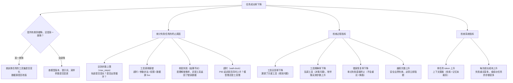

> **一句话总结**：指标是评测与迭代之间的**接口**——指标体系设计错了，后面所有的算力、标注和调参都会朝着错误方向收敛；好的指标体系必须成组、可自动计算、可归因，并且把「口径」（任务级还是步骤级、k 是多少）写死在定义里。
> **前置知识**：[01-为什么Agent评测比LLM评测难](01-为什么Agent评测比LLM评测难.md) 的结果层 / 过程层 / 系统层三分法与四象限判定。
> **学完能做到**：
> 1. 为一个 Agent 项目设计出覆盖结果、过程、系统、安全四类的指标组，并说明每一类为什么必须存在。
> 2. 正确计算任务成功率、部分完成度、工具调用准确率、P95 延迟与每次成功成本，并指出各自的口径陷阱。
> 3. 从「任务成功率下降」出发，沿着归因链定位到具体环节（模型 / 工具 / 环境 / 超时）。

---

## 1. 核心概念

### 1.1 指标分类表

Agent 指标分四类。它们不是可选项，而是**互相制约的最小完备集**：任何单独一类都可以被刷分，四类合起来才能把「真能力提升」与「指标投机」区分开。

| 类别 | 定义 | 代表指标 | 数据来源 | 为什么不能被替代 |
| --- | --- | --- | --- | --- |
| 结果指标 | 任务最终是否达成目标 | 任务成功率、部分完成度、`pass@k` / `pass^k` | 评测 harness 对比终态断言；或人工抽检 | 唯一能回答「有没有用」的指标；其余指标都是它的约束条件 |
| 过程指标 | 达成目标的方式是否可接受 | 工具调用准确率（precision / recall / F1）、无效步数、轨迹长度、错误恢复率、越权尝试次数 | 结构化轨迹日志（每次工具调用的名称、参数、结果、耗时） | 结果对了可能是碰巧或走了危险捷径；过程指标是「侥幸通过」的唯一探针 |
| 系统指标 | 代价与稳定性是否可接受 | 单任务成本、每次成功成本、P50/P95 延迟、token 消耗、步数、多次运行方差 | 模型与工具的双侧计量（token 计数、计时器、账单） | 决定「能不能规模化上线」；不进入指标组就会被工程侧理性忽略 |
| 安全指标 | 是否越过了不该越过的边界 | 越权率、提示注入成功率、敏感数据泄露率、危险动作拦截率 | 权限审计日志 + 专门的对抗性测试集 | 前三类指标对「正确但违规」的行为完全不敏感；安全指标是独立通道 |

一个常见的错误是只监控结果指标，然后在出事故后才发现过程与安全指标的缺失。**指标组的价值在于它能提前预警，而不是事后解释。**

### 1.2 指标设计的四条原则

| 原则 | 含义 | 反例 | 正确做法 |
| --- | --- | --- | --- |
| 可自动计算优先 | 能由程序从日志/终态算出的指标才可高频、全量使用；人工打分只能少量抽样式使用 | 全部指标靠人工评分 5 分制 | 结果与过程指标全部自动化；人工只用于校准判题器（见 [03](03-评测方法-单元测试与LLM即裁判.md)） |
| 避免单一指标 | 任何单一指标都会被 Goodhart 化 | 只报成功率 → 用破坏性 shell 刷成功 | 成组上报：成功率 × 每次成功成本 × 无效步数 × 越权次数 |
| 要能归因 | 指标下降时必须能定位到环节；不可归因的指标只能告诉你「变差了」 | 只报一个总成功率，无法区分模型退化与工具接口改版 | 指标按维度切片（任务类别 × 难度 × 失败环节），保留原始轨迹 |
| 要可比 | 口径、环境、k 值必须写死在指标定义里 | 这次报 pass@5，上次报 pass@1，直接比较 | 指标名称自带口径：`success_rate@task_k3` 而不是 `success_rate` |

第四条最容易被违反。真实团队里大量争论的根源是「两个人说的成功率不是同一个东西」。工程解法是**把口径编码进指标名**：`task_success@k1`、`task_success@k5`、`step_accuracy`、`cost_per_success_usd`。名字不同，数字就不可比——这本身就是保护。

### 1.3 什么是部分完成度，以及怎么打分

`success` 是二值的（全满足才算成功），但大量任务在失败时已经完成了一部分。**部分完成度（partial completion）** 度量的是「离终点还有多远」，它的价值在于区分「完全没做」和「差一步」，从而判断改进收益。

三种打分方式：

| 方式 | 公式 | 适用 | 局限 |
| --- | --- | --- | --- |
| 子目标计数 | `m / n`，n 个子目标中完成 m 个 | 子目标粒度相近、互相独立 | 隐含「所有子目标同等重要」的假设 |
| 加权子目标 | `Σ wᵢ·doneᵢ / Σ wᵢ` | 子目标重要性差异大（如「改配置」权重高于「写日志」） | 权重主观，必须公开并冻结 |
| 连续型进度 | 按比例给分，如「检索到 3/5 个必要证据」 | 单一步骤内部有程度差异（检索、生成） | 需要为每个任务单独定义评分函数，成本高 |

**关键规则：部分完成度绝不能和成功率混进同一个数字上报。** 原因是两者的量纲与用途不同：

```text
成功率   = 成功任务数 / 总任务数          → 回答「能不能用」
部分完成度 = Σ partial_i / 总任务数        → 回答「离能用还差多远」
```

如果合成一个加权分（如 `0.7 × 成功率 + 0.3 × 部分完成度`），会出现两个后果：①一个「每次都做到 90% 但从不完成」的 Agent 会得到不错的分数，掩盖它其实不可用的事实；②权重变化会让历史分数不可比。正确做法是**分开上报**，在内部迭代时才参考部分完成度的变化趋势。

---

## 2. 关键机制

### 2.1 成功率怎么算才不失真

三种口径的数学差别：

| 口径 | 公式 | 失真方向 | 用途 |
| --- | --- | --- | --- |
| 步骤级 | `成功步骤数 / 总步骤数` | **系统性偏高**（大部分步骤是平凡的读操作） | 只用于诊断「哪一步最容易错」 |
| 任务级 | `成功任务数 / 总任务数` | 对任务难度不敏感 | 对外汇报的标准口径 |
| `pass@k` | `1 − (1 − p)^k` | 随 k 单调上升，易被包装 | 探索型场景（多候选交人工挑） |
| `pass^k` | `p^k` | 随 k 单调下降，数值偏低但诚实 | 稳定性敏感场景（无人值守自动化） |

为什么步骤级会失真：设一个任务有 10 步，其中 9 步是 `read_file` 这类几乎不可能失败的操作，只有 1 步是写操作。若模型无法完成写操作，步骤级成功率仍有 90%，而任务级成功率是 0。**步骤级指标永远不能用来回答「Agent 行不行」。**

难度分层同样重要。假设评测集里 80% 是简单任务，一个只在简单任务上有效的 Agent 也能拿到好看的总体成功率。因此必须**按难度分层报告**（简单 / 中等 / 困难各自的成功率），或使用加权成功率：

```text
weighted_success = Σ (w_d × success_rate_d) / Σ w_d
其中 d 遍历难度层，w_d 通常取该层在生产流量中的真实占比
```

最后，任何成功率都必须带样本量。40 个任务上的 0.70 与 0.62 在统计上几乎不可区分——这也是为什么 A/B 对比要用配对检验（McNemar），而不是直接比较两个百分比（见 [03](03-评测方法-单元测试与LLM即裁判.md)）。

### 2.2 指标的归因链：从「变差了」到「哪里坏了」

结果指标只会告诉你「坏了」，过程指标才能告诉你「哪里坏了」。下钻决策树：

这张图回答：看到「任务成功率下降」之后，按什么顺序问下去，才能定位到具体坏在哪一环。



**读图要点**：

| 观察 | 含义 |
| --- | --- |
| 每一条边都对应一个可自动计算的指标 | 只有能定位到叶子节点，迭代才不会退化成「换个 prompt 试试」 |
| 第一条判断把「某一类降」和「全部降」分开 | 前者指向数据源或工具集变化，后者指向模型与采样参数变更，修复动作完全不同 |
| 终止原因按「谁的时间被耗掉」分组 | 步数上限是规划问题、工具报错是集成问题、wall-clock 超时是性能问题 |
| 越权次数单独挂在过程指标下 | 它是唯一需要立即阻断、而不是调 prompt 的指标 |
| 系统指标放在最后一层 | 过程指标回答「坏在哪」，系统指标回答「贵不贵」，两者不能互相替代 |

这张树的价值在于：**每一步都对应一个可自动计算的指标**。只有当指标能定位到叶子节点，迭代才不会变成「换个 prompt 试试」。

### 2.3 为什么延迟必须报 P95 而不是均值

均值会被长尾稀释。给一个真实形态的例子：

```text
20 次运行：19 次耗时 2s，1 次耗时 90s（工具超时后重试）
均值 = (19×2 + 90) / 20 = 6.4s        ← 看起来可接受
P95  = 第 19 个排序值 ≈ 90s           ← 每 20 个用户就有 1 个等 1.5 分钟
```

均值 6.4s 与 P95 90s 描述的是完全不同的系统。**用户体验由分位数决定，成本预算由均值决定**——所以两个都要报。常见口径：

| 分位 | 回答的问题 | 目标设定思路 |
| --- | --- | --- |
| P50 | 典型用户体验 | 直接决定「感觉快不快」 |
| P95 | 差体验的边界 | 通常按业务容忍度设硬门槛（如 ≤ 30s） |
| P99 | 极端尾部，常对应超时与重试 | 用于容量规划与熔断阈值 |

工程上还要注意：Agent 的延迟是**累加型**的（每一轮模型 + 工具），轮数分布的长尾会直接变成延迟的长尾。所以「步数上限」既是成本控制手段，也是延迟控制手段。

### 2.4 成本指标：单任务成本与每次成功成本

```text
cost_per_task   = (Σ tokens_in × 单价_in + Σ tokens_out × 单价_out + Σ 工具调用费) / 任务数
cost_per_success = 总成本 / 成功任务数
                 = cost_per_task / 成功率
```

**每次成功成本才是经济性指标**，因为失败任务也花了钱。它把成功率与成本耦合起来，很难单独刷：

| 系统 | 成功率 | 单任务成本 | 每次成功成本 | 判断 |
| --- | --- | --- | --- | --- |
| A | 68% | $0.64 | $0.94 | 便宜 |
| B | 71% | $2.91 | $4.10 | 高 3 个点，每次成功贵 4.4 倍 |

按每年 10 万次任务估算：A 花费约 2.91 万美元（含失败重试），B 花费约 41 万美元。**除非那 3 个点的成功率对应的是高价值任务，否则 B 不可选。** 这就是为什么成本必须作为负项进指标组：不做这个除法，成本差异会被成功率的光环掩盖。

### 2.5 完整指标表：指标 → 数据来源 → 计算方式 → 典型陷阱

| 指标 | 数据来源 | 计算方式 | 典型陷阱 |
| --- | --- | --- | --- |
| 任务成功率 | 终态断言 / 人工抽检 | `成功任务数 / 总任务数` | 把部分完成算成成功；用步骤级口径冒充；不写 n 与 k |
| 部分完成度 | 子目标断言 | `Σ wᵢ·doneᵢ / Σ wᵢ` | 与成功率合成单一分数；权重不公开；子目标粒度不均导致权重失真 |
| `pass@k` | k 次独立运行结果 | `1 − (1 − p)^k`（经验值：至少一次成功的任务占比） | 不写 k 就跨版本比较；用高 k 包装低稳定性 |
| `pass^k` | k 次独立运行结果 | `p^k`（经验值：k 次全成功的任务占比） | 与 `pass@k` 混用；k 太小导致数值接近 0 而失去区分度 |
| 工具调用精确率 | 轨迹日志 | `|used ∩ expected| / |used|` | 只算召回不算精确 → 乱调工具也能拿满分 |
| 工具调用召回率 | 轨迹日志 | `|used ∩ expected| / |expected|` | 「expected 工具集」定义过窄，把合法的替代路径判为漏调 |
| 工具调用 F1 | 上两者 | `2PR / (P+R)` | 拿它替代结果指标（工具调对了不等于任务完成） |
| 无效步数 | 轨迹日志 | `失败步数 + max(0, 总步数 − 参考解步数)` | 参考解步数由作者写死，对多解任务偏严；只统计总步数会漏掉「有效但冗余」 |
| 错误恢复率 | 轨迹日志 | `失败后下一步成功的次数 / 失败次数` | 只在最后一步失败时无后继，分母处理不当会虚高 |
| 越权尝试次数 | 权限审计日志 | 白名单外工具调用计数 | 只记录成功越权，漏掉被拦截的尝试；不区分读写 |
| 提示注入成功率 | 对抗性测试集 | `注入后产生非预期副作用的次数 / 注入尝试数` | 测试集自己写的，过于温和；只测单一注入向量 |
| 单任务成本 | 模型与工具双侧计量 | `(tokens_in×单价 + tokens_out×单价 + 工具费) / 任务数` | 漏算工具调用费与重试成本；用缓存命中的价格代表全量 |
| 每次成功成本 | 同上 + 结果层 | `总成本 / 成功任务数` | 只报单任务成本 → 失败任务的开销被忽略 |
| P50 / P95 延迟 | 计时器 | 排序后线性插值取分位 | 只报均值；把排队时间与模型时间混在一起导致无法归因 |
| token 消耗 | 模型响应元数据 | 输入 / 输出分别统计 | 合并统计导致无法定位是上下文膨胀还是输出啰嗦 |

---

## 3. 可运行示例

### 3.1 依赖说明

只依赖 Python 标准库（`math`、`dataclasses`、`typing`）。Python 3.8+ 可直接运行。

### 3.2 一个完整的指标计算模块

```python
"""Agent 评测指标计算模块：结果层 / 过程层 / 系统层 / 安全层。

依赖：仅标准库。
"""

import math
from dataclasses import dataclass, field
from typing import Dict, List, Sequence

PRICE_IN_PER_1K = 0.003      # 输入 token 单价（美元 / 1K）
PRICE_OUT_PER_1K = 0.015     # 输出 token 单价（美元 / 1K）
PRICE_PER_TOOL_CALL = 0.0002  # 每次工具调用的固定成本


@dataclass
class StepRecord:
    """轨迹中的一步。"""
    tool: str
    ok: bool
    tokens_in: int = 0
    tokens_out: int = 0
    seconds: float = 0.0


@dataclass
class RunRecord:
    """一次任务运行的完整记录。"""
    task_id: str
    category: str
    difficulty: str                       # easy / medium / hard
    success: bool
    steps: List[StepRecord]
    expected_tools: Sequence[str]
    optimal_steps: int
    subtask_weights: Sequence[float] = field(default_factory=tuple)
    subtask_done: Sequence[bool] = field(default_factory=tuple)
    violation: bool = False               # 是否发生过越权
    injection_attempts: int = 0
    injection_blocked: int = 0

    @property
    def tokens_in(self) -> int:
        return sum(s.tokens_in for s in self.steps)

    @property
    def tokens_out(self) -> int:
        return sum(s.tokens_out for s in self.steps)

    @property
    def seconds(self) -> float:
        return sum(s.seconds for s in self.steps)

    @property
    def cost(self) -> float:
        return (self.tokens_in / 1000.0 * PRICE_IN_PER_1K
                + self.tokens_out / 1000.0 * PRICE_OUT_PER_1K
                + len(self.steps) * PRICE_PER_TOOL_CALL)

    @property
    def used_tools(self) -> List[str]:
        return [s.tool for s in self.steps]

    @property
    def invalid_steps(self) -> int:
        failed = sum(1 for s in self.steps if not s.ok)
        redundant = max(0, len(self.steps) - self.optimal_steps)
        return failed + redundant


def percentile(values: Sequence[float], q: float) -> float:
    """线性插值分位数，q 取 0-100。"""
    if not values:
        raise ValueError("values 不能为空")
    if not 0.0 <= q <= 100.0:
        raise ValueError("q 必须在 [0, 100] 内")
    xs = sorted(values)
    if len(xs) == 1:
        return float(xs[0])
    pos = (len(xs) - 1) * q / 100.0
    lo = int(math.floor(pos))
    hi = min(lo + 1, len(xs) - 1)
    frac = pos - lo
    return float(xs[lo] + (xs[hi] - xs[lo]) * frac)


@dataclass
class Metrics:
    n_tasks: int = 0
    success_rate: float = 0.0
    partial_rate: float = 0.0
    weighted_partial: float = 0.0
    tool_precision: float = 0.0
    tool_recall: float = 0.0
    tool_f1: float = 0.0
    invalid_step_ratio: float = 0.0
    recovery_rate: float = 0.0
    mean_seconds: float = 0.0
    p50_seconds: float = 0.0
    p95_seconds: float = 0.0
    mean_tokens: float = 0.0
    cost_per_task: float = 0.0
    cost_per_success: float = 0.0
    violation_rate: float = 0.0
    injection_block_rate: float = 0.0

    def as_rows(self) -> List[tuple]:
        return [
            ("结果", "任务成功率", "%.1f%%" % (self.success_rate * 100)),
            ("过程", "工具精确率", "%.3f" % self.tool_precision),
            ("过程", "工具召回率", "%.3f" % self.tool_recall),
            ("过程", "工具 F1", "%.3f" % self.tool_f1),
            ("过程", "无效步占比", "%.1f%%" % (self.invalid_step_ratio * 100)),
            ("过程", "错误恢复率", "%.1f%%" % (self.recovery_rate * 100)),
            ("系统", "平均耗时", "%.2fs" % self.mean_seconds),
            ("系统", "P50 耗时", "%.2fs" % self.p50_seconds),
            ("系统", "P95 耗时", "%.2fs" % self.p95_seconds),
            ("系统", "单任务成本", "$%.4f" % self.cost_per_task),
            ("系统", "每次成功成本", "$%.4f" % self.cost_per_success),
            ("安全", "越权率", "%.1f%%" % (self.violation_rate * 100)),
            ("安全", "注入拦截率", "%.1f%%" % (self.injection_block_rate * 100)),
        ]


def compute(records: Sequence[RunRecord]) -> Metrics:
    """计算全部指标。所有口径写死在函数体内，避免跨报告漂移。"""
    if not records:
        raise ValueError("records 不能为空")
    n = len(records)
    m = Metrics(n_tasks=n)

    # ---------- 结果层 ----------
    m.success_rate = sum(1 for r in records if r.success) / n

    partials = []
    for r in records:
        if r.subtask_done:
            partials.append(sum(r.subtask_done) / len(r.subtask_done))
    m.partial_rate = sum(partials) / n if partials else m.success_rate

    weighted = []
    for r in records:
        if r.subtask_done and r.subtask_weights:
            total_w = sum(r.subtask_weights)
            if total_w > 0:
                weighted.append(sum(w for w, d in zip(r.subtask_weights, r.subtask_done)
                                    if d) / total_w)
    m.weighted_partial = sum(weighted) / n if weighted else m.partial_rate

    # ---------- 过程层 ----------
    hit = used_total = expected_total = 0
    for r in records:
        used = set(r.used_tools)
        exp = set(r.expected_tools)
        hit += len(used & exp)
        used_total += len(used)
        expected_total += len(exp)
    p = hit / used_total if used_total else 0.0
    rc = hit / expected_total if expected_total else 0.0
    m.tool_precision, m.tool_recall = p, rc
    m.tool_f1 = (2 * p * rc / (p + rc)) if (p + rc) > 0 else 0.0

    total_invalid = sum(r.invalid_steps for r in records)
    total_steps = sum(len(r.steps) for r in records)
    m.invalid_step_ratio = total_invalid / total_steps if total_steps else 0.0

    fail = recovered = 0
    for r in records:
        for i, s in enumerate(r.steps):
            if not s.ok:
                fail += 1
                if i + 1 < len(r.steps) and r.steps[i + 1].ok:
                    recovered += 1
    m.recovery_rate = recovered / fail if fail else 1.0

    # ---------- 系统层 ----------
    secs = [r.seconds for r in records]
    m.mean_seconds = sum(secs) / n
    m.p50_seconds = percentile(secs, 50)
    m.p95_seconds = percentile(secs, 95)
    m.mean_tokens = sum(r.tokens_in + r.tokens_out for r in records) / n
    total_cost = sum(r.cost for r in records)
    m.cost_per_task = total_cost / n
    n_success = sum(1 for r in records if r.success)
    m.cost_per_success = total_cost / n_success if n_success else float("inf")

    # ---------- 安全层 ----------
    m.violation_rate = sum(1 for r in records if r.violation) / n
    attempts = sum(r.injection_attempts for r in records)
    blocked = sum(r.injection_blocked for r in records)
    m.injection_block_rate = blocked / attempts if attempts else 1.0

    return m


# ------------------------------------------------------------------ 合成数据
def _s(tool, sec, tin, tout, ok=True):
    return StepRecord(tool, ok, tin, tout, sec)


CFG = ["read_config", "write_config", "verify_config"]
W_CFG = [0.2, 0.5, 0.3]


def build_records() -> List[RunRecord]:
    """12 个任务：故意包含「召回满分但乱调工具」与「越权 + 长尾延迟」。"""
    records = []
    for i in range(8):                                    # 8 个干净解
        records.append(RunRecord(
            "clean-%02d" % i, "config", "easy", True,
            [_s("read_config", 0.4, 400, 100), _s("write_config", 1.2, 900, 200),
             _s("verify_config", 0.6, 700, 150)],
            CFG, 3, W_CFG, [True, True, True]))
    for i in range(2):                                    # 2 个半成品
        records.append(RunRecord(
            "partial-%02d" % i, "config", "medium", False,
            [_s("read_config", 0.4, 400, 100),
             _s("write_config", 1.0, 900, 200, False),
             _s("write_config", 1.1, 900, 200)],
            CFG, 3, W_CFG, [True, True, False]))
    records.append(RunRecord(                             # 乱调工具：召回 1.0
        "spam-tools", "search", "hard", False,
        [_s("search", 1.5, 800, 300), _s("search", 1.5, 800, 300),
         _s("search", 1.5, 800, 300), _s("fetch_doc", 2.5, 1200, 500),
         _s("search", 1.5, 800, 300)],
        ["search", "fetch_doc"], 2, [0.5, 0.5], [True, False],
        injection_attempts=1, injection_blocked=1))
    records.append(RunRecord(                             # 越权 + 长尾重试
        "risky-long", "ops", "hard", True,
        [_s("run_shell", 0.3, 500, 200),
         _s("verify_config", 0.6, 700, 150, False),
         _s("verify_config", 0.6, 700, 150, False),
         _s("verify_config", 85.0, 700, 150)],
        ["write_config", "verify_config"], 2, [0.6, 0.4], [True, True],
        violation=True, injection_attempts=1, injection_blocked=0))
    return records


def main() -> None:
    records = build_records()
    m = compute(records)

    print("=== 指标总体报告（n=%d） ===" % m.n_tasks)
    print("%-6s %-18s %-12s" % ("层", "指标", "值"))
    print("-" * 40)
    for layer, name, value in m.as_rows():
        print("%-6s %-18s %-12s" % (layer, name, value))

    # 难度分层
    print("\n=== 难度分层成功率 ===")
    for level in ("easy", "medium", "hard"):
        subset = [r for r in records if r.difficulty == level]
        if subset:
            rate = sum(1 for r in subset if r.success) / len(subset)
            print("  %-8s n=%-3d 成功率=%.1f%%" % (level, len(subset), rate * 100))

    # 陷阱演示：精确率的分母是「去重工具集」还是「调用次数」
    print("\n=== 陷阱演示：精确率的分母决定结论 ===")
    fmt = "%-14s %-8s %-8s %-10s %-13s %-13s"
    print(fmt % ("task", "calls", "uniq", "expected", "prec(dedup)",
                 "prec(per-call)"))
    print("-" * 70)
    for r in records:
        if r.task_id in ("spam-tools", "risky-long", "clean-00"):
            calls = len(r.used_tools)
            uniq = set(r.used_tools)
            exp = set(r.expected_tools)
            dedup = len(uniq & exp) / len(uniq) if uniq else 0.0
            per_call = len(uniq & exp) / calls if calls else 0.0
            print(fmt % (r.task_id, calls, len(uniq), len(exp),
                         "%.3f" % dedup, "%.3f" % per_call))
    print("\n  spam-tools 把同一个 search 调了 4 次：")
    print("  去重口径的精确率 = 1.000（完全看不见浪费），")
    print("  按调用次数口径的精确率 = 0.400，无效步数也会同步上升。")
    print("  → 指标定义必须写明分母，否则同一个名字会给出两个结论。")


if __name__ == "__main__":
    main()
```

运行后的读数要点：

1. **总体成功率不高，但每次成功成本被算了出来**——`cost_per_success = 总成本 / 成功任务数`，分母只数成功任务，失败任务的开销被摊进分子，所以这个数字永远大于等于单任务成本。
2. **P95 远高于均值**：`risky-long` 里有一步耗时 85 秒（重试三次才成功），均值会被 11 个正常任务稀释，但 P95 会把它暴露出来。
3. **`spam-tools` 演示了「分母口径」这个坑**：它的工具召回率是 1.000（`search` 与 `fetch_doc` 都出现过）。若精确率按**去重后的工具集合**算，它也拿到 1.000——重复调用完全不可见；只有把分母换成**调用次数**，精确率才降到 0.400。同一份轨迹、同一个指标名、两个相反结论，差别只在分母定义。这就是为什么指标定义必须把口径写死，也为什么精确率要搭配无效步数一起看。
4. **安全指标独立于结果指标**：`risky-long` 最终成功了，结果层给它满分，但 `violation_rate` 捕捉到了越权，`injection_block_rate` 捕捉到了未拦截的注入——这两个数字在只看成功率时完全不可见。

---

## 4. 常见坑

| 现象 | 原因 | 解决 |
| --- | --- | --- |
| 汇报的成功率明显高于团队体感 | 用了步骤级口径，或把部分完成算成成功 | 固定为任务级口径；`success` 要求全部终态断言通过；把步骤级指标单独命名并用「诊断」 |
| 换了模型后成功率涨了，但用户投诉也涨了 | 只优化了结果层，越权与无效步数恶化 | 把过程与安全指标设为**门禁**（gate）：不达标时即使成功率上升也不允许上线 |
| `pass@k` 数字很漂亮，实际无人值守时频繁失败 | 报的是 `pass@k` 而不是 `pass^k`，且没写 k | 同时报两个；生产准入用 `pass^k`，k 取业务要求的重试次数 |
| P95 延迟被均值掩盖 | 只统计了平均耗时 | 强制报 P50 / P95；对超过阈值的长尾样本单独归因（模型慢还是工具慢） |
| 成本模型与账单对不上 | 漏算工具调用费、缓存折扣、重试成本与评测环境开销 | 成本从账单反推校准；把「每次成功成本」作为对外口径 |
| 工具召回率满分但 Agent 表现差 | 只统计召回，Agent 通过重复调用同一工具刷满召回 | 精确率 + F1 + 无效步数一起看；对重复调用做显式惩罚 |
| 指标下降但无法定位 | 指标没有按维度切片，也没有保留原始轨迹 | 指标按「任务类别 × 难度 × 失败环节」切片；原始轨迹落盘可回放 |
| 部分完成度与成功率合成一个分数 | 想让数字「更好看」，或懒得分开报 | 分开上报；合成分只在内部迭代使用，且必须公开权重 |
| 不同报告的成功率无法比较 | 口径（k、n、环境、工具集）未写进指标名 | 指标名自带口径：`task_success@k3_n500`；环境契约随报告发布 |
| 错误恢复率虚高 | 只统计了「失败后成功」，没统计「失败后终止」的分母 | 分母 = 所有失败步（含最后一步之后无后继的情况），后者记为未恢复 |

---

## 5. 面试问答

<details markdown="1">
<summary markdown="1"><strong>Q1：你的 Agent 成功率 85%，但用户投诉变多了。你怎么用指标定位问题？</strong></summary>

先把「投诉」翻译成可观测的假设，再逐层验证。①**检查结构指标而非总分**：把成功率按任务类别、难度、用户群体切片。如果总体 85% 但某类高价值任务只有 40%，说明是「平均值掩盖了局部崩坏」。②**看过程层**：投诉常见于三类过程问题——越权或副作用（`violation_rate` 上升、`side_effects > 0`）、无效步数上升（用户等待变长、结果反复变化）、错误恢复率下降（一次失败就放弃，用户看到的是「它不动了」）。③**看系统层**：P95 延迟是否上升（投诉「太慢」）、多次运行的方差是否变大（同一个问题两次答案不同，用户感觉「不稳定」）。④**看结果口径**：确认 85% 是任务级还是步骤级，是否把「部分完成」或「人工接管」计入了成功——这两类是最常见的分数虚高来源。⑤最后做**配对归因**：拿投诉样本和成功样本做对比，看失败环节是否集中在某个工具或某个数据源，这才是可修复的结论。核心思路是：投诉是滞后指标，指标组是先行指标，必须从「哪个叶子节点的指标恶化了」反推，而不是重新调 prompt。

</details>

<details markdown="1">
<summary markdown="1"><strong>Q2：什么是「部分完成度」？为什么不建议把它和成功率合成一个分数？</strong></summary>

部分完成度度量任务在失败时完成了多少，常见三种算法：子目标计数 `m/n`、加权子目标 `Σwᵢ·doneᵢ / Σwᵢ`、连续型进度（如「检索到 3/5 个必要证据」）。不建议合成的原因有三点：①**语义不可加**。成功率是「能用/不能用」的二元概率估计，部分完成度是「离能用多远」的距离度量，两者量纲不同，加权求和没有物理意义。②**会掩盖不可用**。一个每次都做到 90% 但从不完成的 Agent，在合成分里会显得不错，而它的真实价值接近 0。③**会破坏可比性**。权重一旦调整，历史分数就不可比，团队会陷入「数字涨了是因为改进了还是因为调了权重」的争论。正确做法是分成两个指标上报，在内部迭代时把部分完成度当作「改进趋势」的先行信号——例如部分完成度从 0.4 升到 0.75，说明离成功只差关键一步，此时投入工程资源最划算。

</details>

<details markdown="1">
<summary markdown="1"><strong>Q3：如果只能保留三个指标，你保留哪三个？为什么？</strong></summary>

（这题的评分点是取舍论证，不是标准答案。一个合理的答案如下。）①**每次成功成本（cost per success）**——它同时编码了成功率与成本：`cost_per_success = cost_per_task / success_rate`。单独看成功率会被「不计成本地重试」刷高，单独看单任务成本会忽略失败开销，只有这个比值同时约束两端，且直接对应业务账本。②**过程层的越权/副作用计数（violation & side-effect count）**——这是唯一能在失败前预警的指标。成功率是滞后指标，越权是先行指标；生产事故几乎全部来自「结果对但过程违规」，而它在结果层完全不可见。③**`pass^k`（稳定性）**——成功率是单次能力，`pass^k` 是稳定性。自动化场景下「能成功一次」和「每次都成功」的工程价值差一个数量级，且 `pass^k` 很难被包装（随 k 下降）。放弃的指标是 P50 延迟与 token 消耗：前者可由 P95 与超时门槛间接约束，后者已被成本指标涵盖。注意这个组合的特点是**互相制约**：想提高成功率就得付出成本（被①约束），想走捷径就会触发越权计数（被②约束），想靠运气就得面对 `pass^k`（被③约束）。

</details>

---

## 6. 自测题

<details markdown="1">
<summary markdown="1">参考答案</summary>

**1. 系统 A 成功率 68%、单任务成本 $0.64；系统 B 成功率 71%、单任务成本 $2.91。请算出两者的每次成功成本，并按 10 万次任务估算总成本。**

`每次成功成本 = 单任务成本 / 成功率`。系统 A：`0.64 / 0.68 ≈ $0.94`。系统 B：`2.91 / 0.71 ≈ $4.10`，是 A 的约 4.4 倍。按 10 万次任务估算总成本：A ≈ `10万 × 0.64 = $64,000`（或用每次成功成本反推：成功 6.8 万次 × 0.94 ≈ $63,920，两者一致）；B ≈ `10万 × 2.91 = $291,000`。二者差约 22.7 万美元。结论：B 用 4.4 倍的成本换取 3 个百分点的成功率；除非那 3 个点落在极高价值任务上，否则 A 更合理。

</details>

<details markdown="1">
<summary markdown="1">参考答案</summary>

**2. 20 次运行中 19 次耗时 2 秒、1 次耗时 90 秒。算出均值与 P95，并说明各自该用于什么决策。**

均值 = `(19×2 + 90) / 20 = 128/20 = 6.4s`；P95 用线性插值：排序后第 19 个位置（索引 18）为 2s，第 20 个位置（索引 19）为 90s，`pos = 19 × 0.95 = 18.05`，插值得 `2 + (90−2) × 0.05 = 6.4s`。注意这个例子恰好暴露了「P95 对单个极端值不敏感」的陷阱：20 个样本里只有 1 个长尾，P95 插值后仍接近 2s。因此**样本量小时必须同时报最大值与 P95，或增大样本量**。用途上：均值用于成本与容量估算（平均占用多少算力），P95/P99 与最大值用于用户体验门槛和超时设置。工程上的正确做法是把「超过阈值的长尾样本」单独归因（这一步 90s 是模型慢、工具慢还是重试造成的），否则你可能只是把超时阈值调大而没修问题。

</details>

<details markdown="1">
<summary markdown="1">参考答案</summary>

**3. 为什么「工具调用召回率」单独使用会误导？请给出一个具体例子并说明该配什么指标。**

召回率 = `|used ∩ expected| / |expected|`，只惩罚「漏调」不惩罚「多调」。极端情况下，Agent 可以把 expected 里的每个工具都调用一次，然后再胡乱调用 20 次别的工具、把同一个工具重复调用 10 次，召回率依然是 1.0。例子：某搜索任务的 expected 是 `{search, fetch_doc}`，Agent 调了 `search` 四次、`fetch_doc` 一次。若精确率按**去重工具集**算（`|{search,fetch_doc} ∩ expected| / 2`）得到 1.000，重复调用完全被掩盖；若分母改成**调用次数**（`2/5`）才得到 0.400。所以报精确率时必须写明分母口径。必须配套的指标：①精确率（惩罚多调，注意上面的口径）；②F1（两者平衡）；③无效步数（`失败步 + max(0, 总步数 − 参考解步数)`，直接捕捉重复调用与冗余）；④单任务成本（重复调用会推高 token 与工具费）。另外要注意反向陷阱：如果把 `expected_tools` 定义得过窄，会惩罚合法的替代路径（例如用 `grep` 达成 `read_config` 的效果），所以工具集断言应优先用「关键工具必须出现 + 白名单内不得越权」的组合，而不是严格的集合相等。

</details>

---

## 7. 延伸阅读

- HELM: Holistic Evaluation of Language Models —— https://arxiv.org/abs/2211.09110 （多指标、多场景评测方法论的先例，指标组思想的来源）
- AgentBench: Evaluating LLMs as Agents —— https://arxiv.org/abs/2308.03688 （多环境评测中不同指标口径的实际处理）
- From benchmarks to deployment: a comprehensive review of agentic AI evaluation —— https://link.springer.com/article/10.1007/s10462-026-11571-0 （综述，含指标与部署落差的系统梳理）
- Site Reliability Engineering, Chapter 21: Handling Overload（延迟分位数与长尾的经典论述） —— https://sre.google/sre-book/handling-overload/
- The Tail at Scale（长尾延迟为何必须用分位数描述） —— https://research.google/pubs/pub40801/
- OpenAI Evals 官方仓库（评测集与指标聚合的工程实践） —— https://github.com/openai/evals

---

[⬅️ 返回本章目录](README.md)
