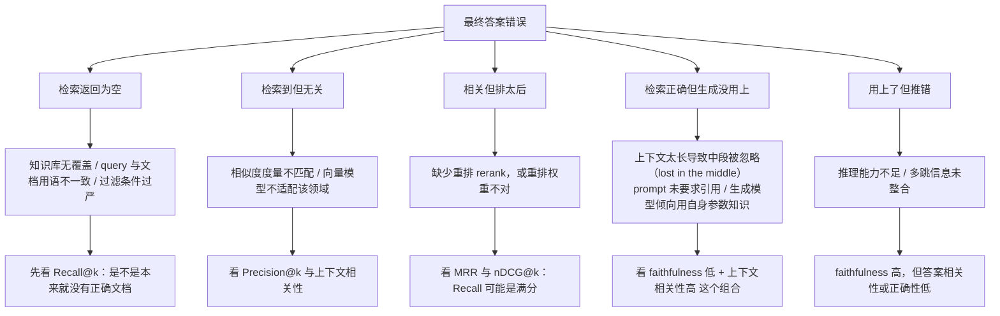
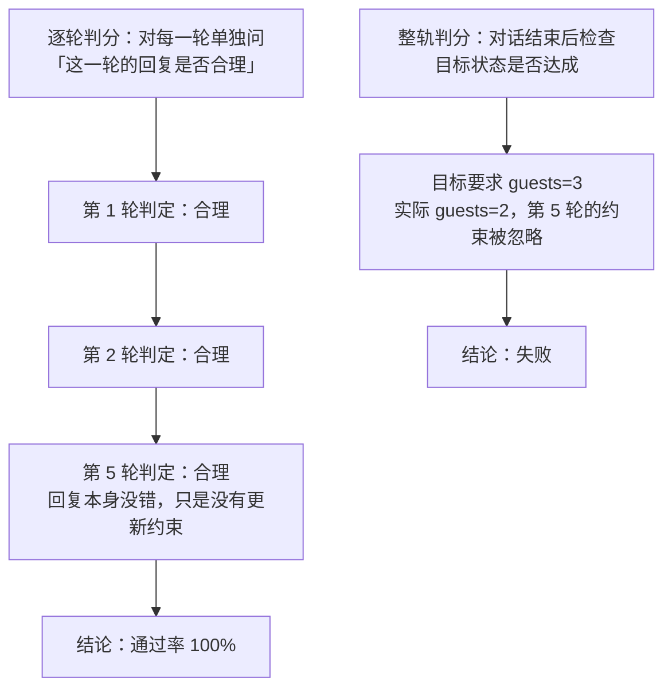

> **一句话总结**：RAG 不是独立的评测对象，它是 Agent 的一个「知识获取动作」——离线检索指标（Recall@k / MRR）好不代表任务成功，必须把检索放进轨迹里，用「检索必要性、查询质量、证据利用率」这三个轨迹级指标与整体任务完成度一起看。
> **前置知识**：[06-RAG作为Agent的知识获取手段](../03-记忆与多智能体/06-RAG作为Agent的知识获取手段.md) 的检索链路、[02-评测指标设计](02-评测指标设计.md) 的指标口径、[03-评测方法-单元测试与LLM即裁判](03-评测方法-单元测试与LLM即裁判.md) 的 Judge 校准。
> **学完能做到**：
> 1. 用四要素框架（上下文相关性 / 忠实度 / 答案相关性 / 上下文召回率）拆解一个 RAG 系统的评测需求。
> 2. 手算 Recall@k、Precision@k、Hit Rate@k、MRR 与 nDCG@k，并说明 Recall@k 与 MRR 为什么必须一起看。
> 3. 用整轨判分评测多轮对话的指代消解、上下文一致性与任务完成度，并把 RAG 指标接进 Agent 轨迹。

---

## 1. 核心概念

### 1.1 RAG 评测四要素

RAG 的评测对象可以拆成「检索到的上下文」与「据此生成的答案」两部分，四个维度分别回答不同问题：

| 维度 | 定义 | 回答什么问题 | 数据来源 | 是否需要 ground truth |
| --- | --- | --- | --- | --- |
| 上下文相关性（context relevance / precision） | 检索到的段落里有多少与问题真正相关 | 检索噪声大不大 | 检索结果 + 相关性判定 | 否（可由 Judge 判定） |
| 忠实度（faithfulness） | 答案是否完全由检索到的上下文支撑，无编造 | 有没有幻觉 | 答案 + 上下文 | 否（只有答案与上下文） |
| 答案相关性（answer relevance） | 答案是否切题、是否直接回应问题 | 有没有答非所问 | 问题 + 答案 | 否 |
| 上下文召回率（context recall） | 回答所需的全部信息是否都被检索到 | 有没有「漏检导致答不全」 | 检索结果 + 参考答案 | **是** |

四个维度的分工是：**召回率管「信息全不全」，上下文相关性管「噪声多不多」，忠实度管「有没有编」，答案相关性管「有没有跑题」。** 只报其中任何一个都会漏掉一类失败——例如只报忠实度，一个「忠实于错误且不完整上下文」的系统会拿高分。

### 1.2 检索侧指标：定义与公式

设 `R` 为检索返回的文档按排名排序的列表，`G` 为相关文档集合（gold），`k` 为截断位置。

```text
Recall@k    = |R[:k] ∩ G| / |G|        —— 前 k 个里找回了多少比例的相关文档
Precision@k = |R[:k] ∩ G| / k          —— 前 k 个里有多少是相关的（分母是 k，不是返回数）
Hit Rate@k  = 1 若 R[:k] ∩ G ≠ ∅ 否则 0 —— 前 k 个里至少有一个相关（也叫 Hit@k）
MRR         = (1/|Q|) Σ_q 1 / rank_q   —— rank_q 是第一个相关文档的排名；无相关则为 0
nDCG@k      = DCG@k / IDCG@k
              DCG@k  = Σ_{i=1..k} rel_i / log2(i + 1)
              IDCG@k = Σ_{i=1..min(k,|G|)} 1 / log2(i + 1)
```

三个关键理解点：

1. **`log2(i+1)` 折损位置**：排名越靠后，同样相关的文档贡献越小。注意 1-based 排名下第一名的折损系数是 `log2(2) = 1`（不折损），第二名是 `log2(3) ≈ 1.585`。用 `log2(i)` 会在 `i=1` 时除零，是常见实现错误。
2. **`Precision@k` 的分母是 k**：即使只返回了 3 条，`Precision@10` 的分母仍是 10——这惩罚「召回太少」。与之相对的是 `Precision@n`（n 为实际返回数）。写指标名时必须明确，否则不可比。
3. **`Recall@k` 与 `MRR` 的分工**：前者看「有没有找全」，后者看「相关的排得靠不靠前」。**一个查询可以 `Recall@10 = 1.0` 但 `MRR = 0.1`**——唯一的相关文档排在最后一位。只报召回率会认为检索「完美」，而真实用户体验是「答案埋在第 10 条里」。`nDCG` 同时考虑相关性与位置，是两者的折中。

补充常用指标与适用场景：

| 指标 | 关注点 | 适用场景 | 陷阱 |
| --- | --- | --- | --- |
| Recall@k | 覆盖度 | 召回阶段（宁可多召回） | k 变化后不可比；相关文档标注不全时虚低 |
| Precision@k | 噪声 | 重排/截断阶段 | 分母定义不统一 |
| Hit Rate@k | 是否有可用结果 | 单相关文档场景（问答） | 粒度太粗，无法区分「只中一个」和「全中」 |
| MRR | 首个正确结果的位置 | 单一正确答案的问答 | 只看第一个相关，忽略其余 |
| nDCG@k | 位置加权的相关性 | 分级相关性（强/弱相关） | `log2` 底数与折损写错；IDCG 计算错误 |

### 1.3 生成侧指标

**忠实度（faithfulness）** 的定义是「答案中的每个事实性声明都能被检索到的上下文支撑」。可计算的近似做法分三步：

```text
① claim 抽取：把答案切成原子声明
   例："北京是中国的首都，人口约 2100 万。"
   → ["北京是中国的首都", "北京人口约 2100 万"]
② 逐 claim 做蕴含判断：该声明能否由上下文推出（entailed / not entailed）
③ 汇总：faithfulness = 被支撑的 claim 数 / 总 claim 数
```

它比「整体打分」可靠的原因：**可归因**（能指出是哪一句没依据）、**可自动化**、**粒度细**（能区分「大部分对但有一处编造」与「整体都是编造」）。局限也很明确：claim 切分本身有误差（长句、条件句、指代省略都会切错）；蕴含判断若用 LLM 就继承了 Judge 的所有偏差（见 [03](03-评测方法-单元测试与LLM即裁判.md)）。

**答案相关性（answer relevance）** 衡量答案是否切题，常用两种做法：①反向生成——让模型仅根据答案生成「它可能在回答什么问题」，再计算生成问题与原始 query 的相似度；②直接让 Judge 按 rubric 打分。注意它**不衡量正确性**：一个离题但真实、或切题但错误的答案，在单个指标上可能都拿高分，所以必须与忠实度一起看。

### 1.4 多轮对话评测维度

| 维度 | 定义 | 判定方式 | 典型失败 |
| --- | --- | --- | --- |
| 指代消解正确性 | 正确解析「它」「那个」「上一条」等指代 | 为每处指代标注期望实体，比对 Agent 的消解结果 | 把「那个酒店」解析成上一轮提到过的另一家 |
| 上下文一致性 | 前后不矛盾、不遗忘已确认的约束 | 检查最终状态是否同时满足所有累积约束 | 用户第 5 轮改成 3 人，最终仍按 2 人下单 |
| 任务完成度 | 整条对话结束时目标是否达成 | 整轨判分：对比最终状态与目标状态 | 每轮都「合理」但整体没订成 |
| 轮次效率 | 用几轮达成目标 | `最小必要轮数 / 实际轮数` | 反复追问已知信息，或过度澄清 |
| 话题切换正确性 | 用户切换话题时是否正确跟切而非混谈 | 标注话题边界，检查每轮是否落在正确话题 | 用户问售后，Agent 继续聊下单 |
| 冗余追问率 | 是否重复询问已提供的信息 | 统计与历史信息重复的追问次数 | 每轮都问一次「您要住几晚」 |
| 安全边界保持 | 多轮中被逐步诱导越界（渐进式注入） | 对抗性多轮脚本 | 单轮都拒绝，多轮累积后被说服 |

**轮次效率的边界要小心**：「越少轮越好」并不总是成立。澄清性追问（确认模糊需求）是必要的，把它算作低效会导致 Agent 学会「不懂装懂」。正确做法是把轮次效率作为**诊断指标**而不是主指标，并区分「有效澄清」与「冗余追问」。

---

## 2. 关键机制

### 2.1 检索失败的归因链

「RAG 回答错了」是最没有信息量的一句话。逐层下钻才能定位：

这张图回答：「RAG 答错了」这句话可以拆成哪几种互不相同的病因，以及每种病因该看哪个指标。



**读图要点**：

| 观察 | 含义 |
| --- | --- |
| 五种病因是并列的，不是递进的 | 它们分别落在检索链的不同环节，必须先确定是哪一种再动手，否则会改错东西 |
| 每个叶子都配了一个指标 | 病因判断不靠感觉，靠「哪个指标低」 |
| 「相关但排太后」这一支 Recall 可能是满分 | 只盯召回率会漏掉排序问题，必须同时看 MRR / nDCG |
| 「检索正确但生成没用上」这一支最长 | 它同时受上下文长度、prompt 约束和模型偏置三件事影响，是 RAG 里最难改的一类 |
| Recall@k 与 faithfulness 的组合最有用 | Recall 高而 faithfulness 低是生成问题；Recall 低而上下文相关性高是召回问题 |

两个可诊断的「指标组合」特别有用：

| 指标组合 | 指向的病因 |
| --- | --- |
| Recall@k 高、MRR 低、答案错 | **排序问题**：正确文档被埋在末尾 → 上重排模型 |
| Recall@k 低、上下文相关性高 | **召回问题**：检索到的都相关但不全 → 扩充召回、改 query、补知识库 |
| Recall@k 高、faithfulness 低 | **生成问题**：有证据不用，凭空生成 → 强化引用约束、压缩上下文、换生成模型 |
| faithfulness 高、答案相关性低 | **理解问题**：忠实于上下文但答非所问 → 改进问题理解与指令遵循 |

### 2.2 多轮对话为什么必须整轨判分

逐轮判分会系统性虚高。机制如下：



**读图要点**：

| 观察 | 含义 |
| --- | --- |
| 两种判分的输入完全相同、结论相反 | 差别只在「看单轮文本」还是「看最终状态」 |
| 逐轮判分每一格都判「合理」 | 因为每一轮回复局部自洽；错误只体现在约束的累积丢失上，单轮文本里看不出来 |
| 整轨判分绕过了自然语言 | 它直接比对数据库 / 表单 / 订单，所以能抓住「嘴上答应、动作没做」这类遗忘型失败 |
| 逐轮指标的定位是诊断 | 它能指出「从哪一轮开始跑偏」，但不能作为通过与否的依据 |
| 结论差距来自评分单位而不是评分标准 | 单轮合理性与全局目标达成之间没有蕴含关系，这是必须整轨判分的根本原因 |

逐轮判分之所以虚高，是因为**每轮的「局部合理性」不能推出全局目标达成**。更隐蔽的是「遗忘型失败」：Agent 在第 5 轮礼貌地确认「好的，已改为三人」，但最终提交的订单仍是两人——单看第 5 轮的文本完全合理。因此多轮评测必须以**最终状态**（数据库、表单、订单）为判分依据，逐轮指标只用于诊断。

配套的工程要求：**多轮评测必须固定对话历史**。改动其中任意一轮，后续所有轮次的结果都不可比；因此对话脚本要作为评测集的一部分做版本管理，不能「边跑边临时发挥」。

### 2.3 与 Agent 评测的衔接：把 RAG 当成一个动作

在 Agent 语境下，`retrieve(query)` 就是动作空间里的一个动作。这样 RAG 评测就从「离线指标」升级成「动作质量评测」，新增三个轨迹级指标：

| 轨迹级指标 | 定义 | 计算方式 | 反例 |
| --- | --- | --- | --- |
| 检索必要性 | 这一步该不该检索 | 人工标注 gold 是否有「该检索」标记，比对 Agent 是否检索 | 从上下文已知答案却仍去检索（浪费成本与延迟） |
| 查询质量 | query 是否包含必要的约束与关键词 | query 与 gold 证据文本的关键词/实体重合度（近似），或 Judge 打分 | 用户问「北京 6 月 1 日两人酒店」，query 只写「酒店」 |
| 证据利用率 | 检索到的证据有多少被最终答案引用 | 被引用的证据数 / 检索到的相关证据数 | 检索到 5 条正确证据，答案只用了 1 条 |

为什么「RAG 离线指标好 ≠ Agent 任务成功率高」：①Agent 可能在检索得对之后**选错了工具**（拿着正确证据去调了错误的 API）；②多轮里**重复冗余检索**（同一 query 调了 4 次），离线指标完全看不到；③证据被**误用**（检索到的是旧政策文档，Agent 当成现行政策）；④检索消耗了过多**步数与预算**，导致后续步骤被截断。

### 2.4 完整评测流程

```text
① 造数据集：query + gold 证据集合 + 参考答案；
   多轮场景额外标注对话脚本、指代期望实体、累积约束与目标状态
② 离线检索评测：Recall@k / Precision@k / Hit@k / MRR / nDCG@k，
   按 k 与任务类别分层报告（k 不同不可比）
③ 离线生成评测：faithfulness（claim 级）+ 答案相关性 + 上下文相关性；
   Judge 需先用金标签集校准（Cohen's Kappa >= 0.6）
④ 端到端多轮评测：整轨判分任务完成度 + 指代消解准确率 + 一致性 +
   轮次效率（作为诊断而非主指标）
⑤ 归因分析：用 2.1 的指标组合定位到召回 / 排序 / 生成 / 推理
⑥ 回归门禁：把 Recall@k 下限、faithfulness 下限、任务完成率下限设为 CI 门禁
```

---

## 3. 可运行示例

### 3.1 依赖说明

两个示例**只依赖 Python 标准库**（`math`、`re`、`typing`），无需 numpy。

### 3.2 示例一：检索侧指标计算器

```python
"""检索侧指标：Recall@k / Precision@k / Hit@k / MRR / nDCG@k。

依赖：仅标准库。
"""

import math
from typing import Dict, List, Sequence


def recall_at_k(retrieved: Sequence[str], relevant: Sequence[str], k: int) -> float:
    gold = set(relevant)
    if not gold:
        return 1.0
    return len(set(retrieved[:k]) & gold) / len(gold)


def precision_at_k(retrieved: Sequence[str], relevant: Sequence[str], k: int) -> float:
    if k <= 0:
        return 0.0
    return len(set(retrieved[:k]) & set(relevant)) / k


def hit_at_k(retrieved: Sequence[str], relevant: Sequence[str], k: int) -> float:
    return 1.0 if set(retrieved[:k]) & set(relevant) else 0.0


def reciprocal_rank(retrieved: Sequence[str], relevant: Sequence[str]) -> float:
    gold = set(relevant)
    for rank, doc in enumerate(retrieved, start=1):
        if doc in gold:
            return 1.0 / rank
    return 0.0


def ndcg_at_k(retrieved: Sequence[str], relevant: Sequence[str], k: int) -> float:
    gold = set(relevant)
    dcg = sum((1.0 if d in gold else 0.0) / math.log2(i + 1)
              for i, d in enumerate(retrieved[:k], start=1))
    ideal = sum(1.0 / math.log2(i + 1) for i in range(1, min(k, len(gold)) + 1))
    return dcg / ideal if ideal > 0 else 0.0


def evaluate(queries: Sequence[Dict], k: int = 5) -> Dict[str, float]:
    """宏平均：先算每个 query 的指标，再对 query 求平均。"""
    keys = ["recall@%d" % k, "precision@%d" % k, "hit@%d" % k,
            "mrr", "ndcg@%d" % k]
    rows = []
    for q in queries:
        r, g = q["retrieved"], q["relevant"]
        rows.append((q["qid"],
                     recall_at_k(r, g, k), precision_at_k(r, g, k),
                     hit_at_k(r, g, k), reciprocal_rank(r, g),
                     ndcg_at_k(r, g, k)))
    n = len(rows)
    macro = {name: sum(row[i + 1] for row in rows) / n
             for i, name in enumerate(keys)}
    return {"rows": rows, "macro": macro}


QUERIES: List[Dict] = [
    # q1：两条相关文档排在前 3 —— 理想情况
    {"qid": "q1", "relevant": ["d1", "d2"],
     "retrieved": ["d1", "d9", "d2", "d7", "d3", "d8", "d4", "d5", "d6", "d10"]},
    # q2：唯一相关文档排在第 10 —— Recall@10 满分但 MRR 只有 0.1
    {"qid": "q2", "relevant": ["d3"],
     "retrieved": ["d9", "d8", "d7", "d6", "d5", "d4", "d2", "d1", "d10", "d3"]},
    # q3：只召回一半
    {"qid": "q3", "relevant": ["d4", "d5"],
     "retrieved": ["d4", "d11", "d12", "d13", "d14"]},
    # q4：完全没有命中
    {"qid": "q4", "relevant": ["d6"],
     "retrieved": ["d11", "d12", "d13", "d14", "d15"]},
    # q5：三条相关全部命中，但位置有偏（nDCG 反映折损）
    {"qid": "q5", "relevant": ["d1", "d2", "d3"],
     "retrieved": ["d2", "d9", "d8", "d1", "d3"]},
    # q6：命中且排第一
    {"qid": "q6", "relevant": ["d8"],
     "retrieved": ["d8", "d1", "d2", "d3", "d4"]},
]


def main() -> None:
    result = evaluate(QUERIES, k=5)
    print("=== 逐 query 指标（k=5）===")
    header = "%-6s %-10s %-12s %-8s %-8s %-9s" % (
        "qid", "recall@5", "precision@5", "hit@5", "mrr", "ndcg@5")
    print(header)
    print("-" * len(header))
    for qid, rc, pr, ht, mrr, ndcg in result["rows"]:
        print("%-6s %-10.3f %-12.3f %-8.1f %-8.3f %-9.3f"
              % (qid, rc, pr, ht, mrr, ndcg))

    print("\n=== 宏平均 ===")
    for name, value in result["macro"].items():
        print("  %-14s %.4f" % (name, value))

    print("\n=== 为什么要同时看 Recall 与 MRR ===")
    q2 = QUERIES[1]
    print("  q2 的 Recall@10 = %.3f（找全了），MRR = %.3f（排在第 10 位）"
          % (recall_at_k(q2["retrieved"], q2["relevant"], 10),
             reciprocal_rank(q2["retrieved"], q2["relevant"])))
    print("  只看 Recall 会认为检索完美；实际用户要翻到第 10 条才看到答案。")
    print("  q2 的 nDCG@10 = %.3f，同时反映了「命中」与「位置差」。"
          % ndcg_at_k(q2["retrieved"], q2["relevant"], 10))


if __name__ == "__main__":
    main()
```

关键结论：`q2` 的 `Recall@10 = 1.0` 而 `MRR = 0.1`。**任何只报召回率的 RAG 评测都会把这种情况判为「检索完美」**，而真实用户体验是「答案藏在第 10 条」。这就是为什么检索侧至少要报「一个覆盖度指标 + 一个位置指标」。

### 3.3 示例二：忠实度近似与多轮对话整轨判分

```python
"""忠实度近似 + 多轮对话评测（指代消解 / 整轨完成度 / 轮次效率）。

依赖：仅标准库。

注意：faithfulness 这里用「词重叠近似（token-overlap proxy）」实现，它只是一个
可复现的演示。它无法区分「同义改写」与「无依据编造」，也不能处理否定与条件句。
生产环境应换成 NLI 模型或 LLM 蕴含判断，并像 03 篇那样先校准 Judge。
"""

import re
from typing import Dict, List, Sequence

STOPWORDS = frozenset(
    "的 了 是 在 和 与 也 都 就 而 及 或 对 为 上 下 中 这个 那个 我们 你 我 "
    "a an the is are was were of in on at to and or for with it this that".split()
)


def _tokens(text: str) -> set:
    """粗粒度分词：英文按词、中文按字，去掉停用词。"""
    words = re.findall(r"[a-zA-Z0-9]+|[\u4e00-\u9fff]", text)
    return {w.lower() for w in words if w.lower() not in STOPWORDS}


def split_claims(answer: str) -> List[str]:
    """按中英文句末标点切分原子声明。"""
    parts = re.split(r"[。！？；;!?\n]+", answer)
    return [p.strip() for p in parts if p.strip()]


def faithfulness(answer: str, context: str,
                 threshold: float = 0.6) -> Dict[str, object]:
    """演示用的忠实度：claim 与其来源上下文词集的重叠率是否达标。"""
    ctx = _tokens(context)
    claims = split_claims(answer)
    supported = []
    for claim in claims:
        toks = _tokens(claim)
        overlap = len(toks & ctx) / len(toks) if toks else 0.0
        supported.append(overlap >= threshold)
    n = len(claims)
    return {
        "faithfulness": round(sum(supported) / n, 4) if n else 0.0,
        "n_claims": n,
        "unsupported": [claims[i] for i, ok in enumerate(supported) if not ok],
    }


def coreference_accuracy(turns: Sequence[Dict]) -> Dict[str, object]:
    """指代消解准确率：只看带期望实体的轮次。"""
    checked = [t for t in turns if t.get("expected_entity")]
    if not checked:
        return {"accuracy": 1.0, "n": 0, "errors": []}
    errors = [t["turn"] for t in checked
              if t.get("resolved_entity") != t["expected_entity"]]
    return {"accuracy": round(1 - len(errors) / len(checked), 4),
            "n": len(checked), "errors": errors}


def dialogue_completion(dialogue: Sequence[Dict], goal_state: Dict[str, str],
                        final_state: Dict[str, str],
                        min_turns: int) -> Dict[str, object]:
    """整轨判分：任务完成度 + 轮次效率。"""
    keys = list(goal_state)
    matched = sum(1 for k in keys if final_state.get(k) == goal_state[k])
    used = len(dialogue)
    mismatched = {k: (goal_state[k], final_state.get(k))
                  for k in keys if final_state.get(k) != goal_state[k]}
    return {
        "completed": matched == len(keys),
        "completion": round(matched / len(keys), 4) if keys else 1.0,
        "mismatched": mismatched,
        "turns_used": used,
        "min_turns": min_turns,
        "turn_efficiency": round(min_turns / used, 4) if used else 0.0,
    }


CONTEXT = (
    "H-102 酒店位于北京市朝阳区，共有 180 间客房，入住时间为 14:00，"
    "退房时间为 12:00，配有健身房和室内泳池。"
    "H-103 酒店位于北京市海淀区，共有 90 间客房，不提供健身房。"
)
ANSWER = (
    "H-102 酒店位于北京市朝阳区，配有健身房。"
    "H-102 酒店距离首都机场 12 公里。"
    "H-102 酒店共有 240 间客房。"
)

DIALOGUE: List[Dict] = [
    {"turn": 1, "user": "帮我订北京 6 月 1 日的酒店"},
    {"turn": 2, "user": "住 2 晚，两个人"},
    {"turn": 3, "user": "有什么推荐的"},
    {"turn": 4, "user": "那就订 H-102 吧"},
    {"turn": 5, "user": "改成三个人"},
    {"turn": 6, "user": "那个酒店有健身房吗",
     "expected_entity": "H-102", "resolved_entity": "H-103"},
]

GOAL_STATE = {"hotel": "H-102", "checkin": "2024-06-01",
              "nights": "2", "guests": "3"}
FINAL_STATE = {"hotel": "H-102", "checkin": "2024-06-01",
               "nights": "2", "guests": "2"}      # 第 5 轮的约束被遗忘


def main() -> None:
    print("\n=== 1) 忠实度（词重叠近似，生产应换 NLI / LLM 蕴含判断）===")
    f = faithfulness(ANSWER, CONTEXT)
    print("  faithfulness = %.4f（%d 条 claim，%d 条无依据）"
          % (f["faithfulness"], f["n_claims"], len(f["unsupported"])))
    for claim in f["unsupported"]:
        print("    未支撑：%s" % claim)
    print("  说明：『距离首都机场 12 公里』在上下文中不存在 → 被正确识别为编造。")

    print("\n  ▼ 词重叠近似的失效点（为什么生产必须换 NLI / LLM）")
    wrong = "H-102 酒店共有 240 间客房"
    toks, ctx = _tokens(wrong), _tokens(CONTEXT)
    print("    claim: %s" % wrong)
    print("    与上下文的重叠率 = %.2f → 被判为「有支撑」"
          % (len(toks & ctx) / len(toks)))
    print("    但上下文写的是 180 间 —— 这是数值矛盾，不是「无依据」。")
    print("    词重叠无法识别否定与数值冲突，所以这个指标只是演示用的近似。")

    print("\n=== 2) 多轮对话：指代消解 ===")
    coref = coreference_accuracy(DIALOGUE)
    print("  检查轮次 n=%d，指代消解准确率 = %.4f，出错轮次 = %s"
          % (coref["n"], coref["accuracy"], coref["errors"] or "无"))

    print("\n=== 3) 多轮对话：整轨判分 ===")
    d = dialogue_completion(DIALOGUE, GOAL_STATE, FINAL_STATE, min_turns=4)
    print("  是否完成目标：%s   完成度 = %.4f" % (d["completed"], d["completion"]))
    print("  不一致的约束：%s" % d["mismatched"])
    print("  轮次效率：用了 %d 轮 / 最少 %d 轮 = %.3f"
          % (d["turns_used"], d["min_turns"], d["turn_efficiency"]))
    print("\n  失败归因：第 5 轮用户把人数从 2 改成 3，Agent 口头确认了，")
    print("  但最终提交的订单仍是 guests=2 —— 这是典型的『遗忘型失败』。")
    print("  逐轮判分会判它为通过（每轮回复都合理），只有整轨判分能抓到。")


if __name__ == "__main__":
    main()
```

预期结果：`faithfulness = 0.6667`——3 条 claim 中 1 条被判为无依据；指代消解准确率为 **0.0**（第 6 轮把「那个酒店」解析成了 H-103）；整轨判分 **未完成**（`guests` 目标 3、实际 2）。三个指标分别指向三类不同的问题——**编造、指代错误、约束遗忘**——这正是分维度评测的意义。

同时注意那个「失效点」输出：`H-102 酒店共有 240 间客房` 与上下文的重叠率很高，被词重叠近似判为「有支撑」，但上下文写的是 180 间——**这是数值矛盾，不是无依据**。词重叠无法识别否定与数值冲突，所以生产环境必须换成 NLI 模型或 LLM 蕴含判断（并像 [03](03-评测方法-单元测试与LLM即裁判.md) 那样先校准 Judge）。这个反例本身说明：**任何自动指标都要先明确它能捕捉哪一类错误、漏掉哪一类错误**，再决定要不要用它做门禁。

---

## 4. 常见坑

| 现象 | 原因 | 解决 |
| --- | --- | --- |
| 检索指标很好但答案质量差 | 只看 Recall@k，忽略了排序质量 | 同时报 MRR 与 nDCG@k；MRR 低说明需要上重排模型 |
| 换了 k 之后指标不可比 | 指标名里没写 k | 指标名自带 k：`recall@10`；报告里固定 k 并说明 |
| 把 faithfulness 当成「答案正确性」 | 忠实度只衡量「是否被上下文支撑」，不衡量上下文本身对不对 | 忠实度必须与上下文相关性、召回率一起看；对错误上下文的忠实仍是高 faithfulness |
| 检索指标好但 Agent 任务仍失败 | 检索只是轨迹中的一个动作；可能重复检索、选错工具或误用证据 | 补轨迹级指标：检索必要性、查询质量、证据利用率 |
| 多轮逐轮判分导致通过率虚高 | 每轮局部合理但全局目标未达成 | 整轨判分，以最终状态为准；逐轮指标只用于诊断 |
| 多轮评测结果无法复现 | 对话脚本没有固定，改动一轮导致后续全变 | 对话脚本纳入评测集版本管理，跑评测时冻结 |
| 只评测最后一轮 | 中间轮的错误被后续轮次掩盖 | 对每轮都记录状态快照；报告中间轮的关键指标 |
| 用词重叠冒充 NLI 蕴含判断 | 词重叠无法处理同义改写、否定与条件句 | 生产改用 NLI 模型或 LLM 蕴含判断，并先做 Judge 校准 |
| 把「答案相关性」与「忠实度」混为一谈 | 两者衡量不同维度 | 分开报：忠实度管「有没有编」，相关性管「有没有跑题」 |
| 忽略检索的延迟与成本 | 多路召回 + 重排的成本没进指标 | 把检索耗时与费用计入系统层指标；离线指标不反映线上成本 |
| 调 prompt 用的数据同时用来报分数 | 没有 held-out 集，指标被过拟合 | 划分 held-out 评测集；报告只用未参与调优的数据 |
| gold context 泄漏给生成模型 | 评测时把参考答案直接塞进上下文 | 评测生成侧时只给检索结果，不给 gold |

---

## 5. 面试问答

<details markdown="1">
<summary markdown="1"><strong>Q1：你的 RAG 系统「回答错了」，你会怎么用指标定位到底是检索问题还是生成问题？</strong></summary>

按 2.1 的归因链逐层排除，核心是**看指标组合而不是单个指标**。第一步看 `Recall@k`：如果召回率低（说明正确文档根本没被检索到），那是**召回问题**——原因可能是知识库无覆盖、query 与文档用语不一致、或过滤条件过严，解决方向是改 query 改写、扩大召回、补知识库。第二步，如果 `Recall@k` 高但 `MRR`/`nDCG@k` 低，正确文档被埋在末尾，那是**排序问题**——上一级重排模型或调权重。第三步，如果检索位置也没问题（Recall 与 MRR 都高）但 `faithfulness` 低，那是**生成问题**——有证据却凭空生成，原因是上下文过长导致中段被忽略（lost in the middle）、prompt 没有强制引用、或模型过度依赖参数知识，解决方向是压缩/重排上下文、加入必须引用的约束、或换生成模型。第四步，如果 `faithfulness` 高但 `答案相关性` 低，那是**理解问题**——忠实于上下文却答非所问。最后还要检查一个 Agent 特有的可能：检索得对，但 Agent 在后续步骤里**没用上证据或调错了工具**，此时要看「证据利用率」这个轨迹级指标。整个流程的关键是：先用离线指标把「检索 vs 生成」分开，再用轨迹级指标把「RAG 组件 vs Agent 编排」分开。

</details>

<details markdown="1">
<summary markdown="1"><strong>Q2：忠实度（faithfulness）高能说明答案正确吗？反例是什么？它在 Agent 场景下要补什么指标？</strong></summary>

**不能。** 忠实度只衡量「答案中的每个事实性声明能否由**给定上下文**支撑」，它对上下文本身的真伪完全不敏感。反例：上下文里写错了「H-102 酒店有 240 间客房」（真实是 180 间），模型忠实地说「H-102 有 240 间客房」——faithfulness = 1.0，但答案是错的。第二个反例：上下文本身残缺，模型忠实于它给出一个不完整的答案，忠实度满分但没解决问题。因此忠实度必须与**上下文相关性**（召回的证据是否靠谱、是否切题）和**上下文召回率**（信息是否完整）组合使用。**在 Agent 场景下要补三类轨迹级指标**：①**检索必要性**——这一步本来就该不该检索（上下文里已有答案却反复检索是浪费）；②**查询质量**——query 是否携带了必要的约束与实体（用户问「北京 6 月 1 日两人酒店」而 query 只写「酒店」，检索对不上不是召回的问题）；③**证据利用率**——检索到的相关证据有多少被最终答案真正引用（检索到 5 条正确证据却只用 1 条，说明 Agent 没用上自己的工具）。此外还要看检索动作的**成本与延迟**，因为离线 faithfulness 完全不包括这些。

</details>

<details markdown="1">
<summary markdown="1"><strong>Q3：多轮对话评测为什么要整轨判分？请给出一个逐轮判分会虚高的具体例子。</strong></summary>

因为**每轮的局部合理不能推出全局目标达成**，而逐轮判分只检查局部。具体例子：用户在第 1 轮说「帮我订北京 6 月 1 日的酒店」，第 2 轮说「住 2 晚，两个人」，第 4 轮说「那就订 H-102 吧」，第 5 轮改口「**改成三个人**」。Agent 在第 5 轮回复「好的，已为您改为 3 人入住」——单看这一轮，回复礼貌、语义正确、与用户意图一致，**逐轮判分给通过**。但它最终提交的订单里 `guests` 仍是 2（约束被遗忘，没有真正写回状态）。逐轮判分得到 6/6 通过、100% 成功率；整轨判分检查最终状态发现 `guests` 目标 3、实际 2 → **判定失败**。这类「口头确认但状态未更新」的失败在多轮场景中非常常见，而且是最危险的一类（用户以为改成功了）。所以多轮评测必须：①以**最终状态**（数据库、表单、订单）作为判分依据，而不是以回复文本为依据；②对每轮记录状态快照以便定位是哪一轮开始偏离；③把逐轮指标降级为诊断用途；④固定对话脚本并纳入版本管理，否则改一轮就全部不可比。

</details>

---

## 6. 自测题

<details markdown="1">
<summary markdown="1">参考答案</summary>

**1. 手算：某查询的相关文档是 {d1, d2}，检索返回的前 5 位依次是 d3, d1, d9, d2, d7。求 Recall@5、Precision@5、Hit@5、MRR 与 nDCG@5。**

`Recall@5 = |{d3,d1,d9,d2,d7} ∩ {d1,d2}| / 2 = 2/2 = 1.0`。`Precision@5 = 2/5 = 0.4`。`Hit@5 = 1`（至少命中一个）。`MRR`：第一个相关文档 d1 排在第 2 位，`MRR = 1/2 = 0.5`。`nDCG@5`：DCG `= 0/log2(2) + 1/log2(3) + 0/log2(4) + 1/log2(5) + 0/log2(6) ≈ 0.6309 + 0.4307 = 1.0616`；IDCG（两个相关文档的理想排列）`= 1/log2(2) + 1/log2(3) ≈ 1 + 0.6309 = 1.6309`；`nDCG@5 = 1.0616 / 1.6309 ≈ 0.651`。注意第一名的折损系数是 `log2(2) = 1`，不是 `log2(1)`（会除零）——这是常见实现错误。

</details>

<details markdown="1">
<summary markdown="1">参考答案</summary>

**2. 一个 RAG 系统离线上 Recall@10 = 0.95、MRR = 0.42，但线上用户投诉「答非所问」，且 Agent 任务成功率只有 55%。请列出至少三个可能的解释。**

①**排序问题**：召回率很高但 MRR 只有 0.42，说明相关文档平均排在较后位置。生成模型倾向使用上下文前部的内容（lost in the middle），导致正确证据被中段忽略 → 需要加重排模型或把高相关证据提到前面。②**查询质量问题（Agent 特有）**：Agent 自己写的 query 可能丢掉了关键约束（用户说「北京 6 月 1 日两人酒店」，query 只写「酒店」），检索命中的是泛化文档而非针对性文档，离线指标用的是人工 query 所以看起来很好 → 需要评测「查询质量」这个轨迹级指标。③**证据利用率低**：检索到了正确证据，但 Agent 在后续步骤中没引用，或者调用了错误的工具处理这些证据 → 需要统计「被引用的证据数 / 检索到的相关证据数」。④**忠实度问题**：模型忠实于旧版本文档（知识库里有多个版本的同一政策），给出过期答案。⑤**冗余检索拖累预算**：同一 query 被重复检索多次，消耗了步数上限，后续关键步骤被截断。诊断路径是：先用「召回率 / MRR / 忠实度 / 答案相关性」的组合区分检索、排序、生成三类问题，再用轨迹级指标（检索必要性、查询质量、证据利用率）区分 RAG 组件与 Agent 编排。

</details>

<details markdown="1">
<summary markdown="1">参考答案</summary>

**3. 为什么「轮次效率」不能作为多轮对话的主指标？请举一个反例。**

因为**澄清性追问是必要的**，而轮次效率会惩罚它。反例：用户说「帮我订个便宜点的酒店」——「便宜」是模糊约束。优秀的 Agent 会追问「您的预算上限大概是多少？」以及「是否需要靠近某个地点？」，用 2 轮澄清换来一次正确下单；而一个「追求轮次效率」的 Agent 会直接猜一个价格区间下单，用 1 轮完成但很可能不符合用户预期。如果轮次效率是主指标并进入优化目标（Goodhart 化），系统会系统性地学会「不懂装懂、不澄清」，从而在真实场景里产生更多返工。因此轮次效率应作为**诊断指标**：报告时可以区分「有效澄清轮次」与「冗余追问轮次」，只有后者（重复询问已提供的信息、反复确认同一件事）才应被惩罚。主指标仍然应该是**整轨任务完成度**，轮次效率与冗余追问率作为解释「为什么效率低」的辅助信息。

</details>

<details markdown="1">
<summary markdown="1">参考答案</summary>

**4. 「上下文召回率高」是否等价于「RAG 效果好」？请说明它与其他三个维度的关系。**

不等价。上下文召回率衡量的是「回答所需的全部信息是否都被检索到」，它只覆盖四个维度中的**信息完整性**这一角。与其他维度的关系：①**与上下文相关性（precision）**：召回率可以靠「无脑多召回」刷高（返回 100 条，正确的一定在里面），代价是噪声涌入上下文，反而降低生成质量——所以召回与精确必须一起看，召回阶段放宽、重排阶段收紧。②**与忠实度（faithfulness）**：召回率高意味着证据在手，但模型完全可以不用它而凭参数知识生成——此时召回率满分、忠实度很低，指向「生成问题」而非「检索问题」。③**与答案相关性**：即使信息全、证据被忠实使用，答案仍可能答非所问（理解错问题），此时前三个指标都不差但答案无用。此外在 Agent 场景下还有第四个问题：召回率高但 Agent 把证据用在了错误的步骤上，或者重复检索造成成本膨胀。所以正确的结论是——**召回率高是必要但不充分条件**：它排除了「信息缺失」这一类病因，但无法排除排序差、噪声多、幻觉、答非所问与编排错误。

</details>

---

## 7. 延伸阅读

- RAGAS: Automated Evaluation of Retrieval Augmented Generation —— https://arxiv.org/abs/2309.15217 （四要素指标的开源实现与定义来源）
- ARES: An Automated Evaluation Framework for Retrieval-Augmented Generation Systems —— https://arxiv.org/abs/2311.09476 （用少量人工标注校准自动评测器）
- Self-RAG: Learning to Retrieve, Generate, and Critique through Self-Reflection —— https://arxiv.org/abs/2310.11511 （把「是否需要检索」变成模型可学习的动作）
- CRAG: Comprehensive RAG Benchmark —— https://arxiv.org/abs/2406.04744 （覆盖多领域与动态问题的 RAG 基准）
- Lost in the Middle: How Language Models Use Long Contexts —— https://arxiv.org/abs/2307.03172 （上下文位置对利用率的影响，解释了 MRR 为何重要）
- τ-bench: A Benchmark for Tool-Agent-User Interaction in Real-World Domains —— https://arxiv.org/abs/2406.12045 （多轮 tool-agent-user 评测与整轨判分）
- From benchmarks to deployment: a comprehensive review of agentic AI evaluation —— https://link.springer.com/article/10.1007/s10462-026-11571-0
- Judging LLM-as-a-Judge with MT-Bench and Chatbot Arena —— https://arxiv.org/abs/2306.05685 （Judge 偏差与校准，忠实度判定的前提）

---

[⬅️ 返回本章目录](README.md)
