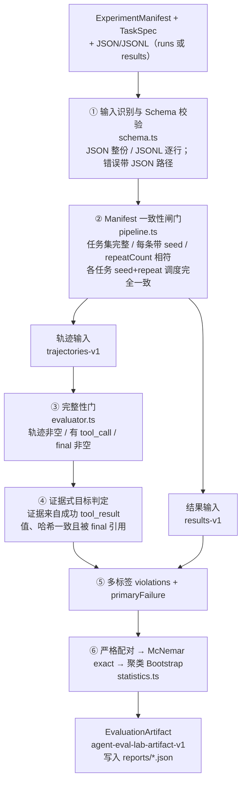
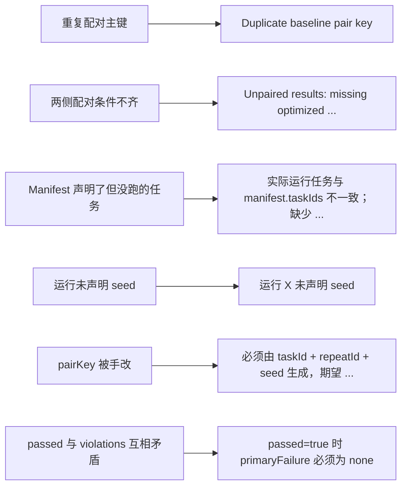

> **一句话总结**：`agent-eval-lab` 是一条**可复核的 Agent 评测工具链**——它把「进程退出码为 0」和「用户目标真的完成了」强行拆开，用 Manifest 钉住实验身份、用证据式判定拆掉假成功、用多标签归因替代 unknown、用配对统计回答「这点提升是不是噪声」。
> **前置知识**：[01-为什么Agent评测比LLM评测难](../05-评测/01-为什么Agent评测比LLM评测难.md) 的结果层/过程层/系统层框架与四象限判定、[07-Agent工程化与可靠性设计](../04-评估与工程化/07-Agent工程化与可靠性设计.md) 的轨迹落盘与结构化日志、基础统计学中的二项分布与 Bootstrap 重采样。
> **学完能做到**：
> 1. 画出这条工具链的六段流水线，并说明每一段拒绝了什么样的错误输入。
> 2. 用「方案 / 优点 / 代价 / 为何这样选」四列表复述该项目的核心设计取舍，并判断哪些取舍适合搬进自己的项目。
> 3. 说清一个评测工具的能力边界——它能证明什么、不能证明什么，以及为什么「不接 LLM-as-a-Judge」本身就是一个设计决策。

---

## 1. 项目定位

### 1.1 它是什么

`agent-eval-lab` 是一个面向 LLM Agent 的评测工具，输入是**执行轨迹**或**已有 A/B 结果**，输出是**可审计的失败归因 + 配对统计 + 任务级置信区间**。它的自我描述里最关键的一句是：

> 很多 Agent 评测会把「进程正常退出」误当作「用户目标完成」。本项目把两者分开：只有轨迹存在、执行过有效步骤、最终回答非空且成功条件拥有已验证证据，任务才算通过。

这句话决定了整个项目的形态。绝大多数团队做 Agent 评测的第一步是写一个 Python 脚本：跑任务、抓最终状态、比对期望值、算个百分比。这个脚本能跑，但它同时埋下了四个坑：**配置漂移**（换了模型版本没人知道）、**假成功**（状态字符串对了但证据没有）、**归因缺失**（失败了只知道 fail 不知道哪类 fail）、**统计幻觉**（62% 到 71% 就宣布显著提升）。

`agent-eval-lab` 逐个堵这四个坑，并且**堵的方式都是"拒绝"而不是"兼容"**——这是它最值得学的地方。

| 维度 | 事实 |
| --- | --- |
| 语言与运行时 | TypeScript（ESM），Node.js ≥ 22 |
| 运行时依赖 | 零（只依赖标准库与 Node 内置模块） |
| 开发依赖 | `typescript`、`tsx`、`@types/node` |
| 版本与协议 | v0.3.0，MIT |
| 交付形态 | 可执行 CLI + ESM/TypeScript 库入口 + Draft 2020-12 JSON Schema |
| 公开数据 | `examples/public-evidence`（合成、可完整复算）+ `examples/portfolio-aggregate`（脱敏汇总、仅可验证算术） |

### 1.2 三个必须分开的概念

项目 README 里点了五种「进程正常结束但任务没完成」的现场，它们对应三个层次的完成度：

| 层次 | 判据 | 典型误判 |
| --- | --- | --- |
| 进程完成 | 运行器返回 `completed` | 工具连续失败，运行器照样返回 completed |
| 动作完成 | 执行过工具调用、页面加载成功 | 模型没做任何浏览器动作就直接回答 |
| **目标完成** | 必需证据由成功工具产出、被校验、被最终回答引用 | 遇到登录墙/验证码却声称任务完成 |

前两层的观测成本极低（看 exit code、数 step），所以它们总是先被实现；第三层的观测成本高（要设计证据 schema、要绑定来源、要防篡改），于是总是被跳过。**这个项目全部价值就在于把第三层做成可执行的代码。**

### 1.3 在 Agent 工程链里的位置

项目自述的生态位是三件套中的「可信评测」：

```text
browser-agent-runtime-lite   →  提供可审计的执行闭环（证据门控、有限恢复）
agent-eval-lab               →  接收轨迹，区分进程/动作/目标完成，输出归因与统计   ← 本项目
open-source-research-agent   →  具体应用案例，产出真实业务轨迹
```

这个切分很干净：**执行侧只负责"把事做出来并留下可核验的痕迹"，评测侧只负责"判断痕迹是否构成完成"。** 两侧通过轨迹格式解耦，所以评测器可以在 Agent 完全不改的情况下先接进来——这一点对"给一个已经在跑的 Agent 补评测"（见 [04 篇](04-给一个真实Agent补评测.md)）至关重要。

### 1.4 它替代的是什么

| 自研评测脚本的常见写法 | 本项目对应的做法 |
| --- | --- |
| `metrics.json` 里存一个成功率数字 | `agent-eval-lab-artifact-v1` 报告，含 Manifest、逐条结果、配对表、置信区间 |
| 配置写在脚本顶部的常量里 | `ExperimentManifest` 固化为输入的一部分，缺字段直接报错 |
| 失败只记 `passed: false` | 多标签 `violations` + 稳定 `primaryFailure` |
| 用 `except: pass` 容错脏数据 | Schema 错误带 JSON 路径，CLI 退出码 2 |
| 「改进了」= 数字变大 | McNemar exact p + task-cluster Bootstrap CI |

---

## 2. 架构总览

### 2.1 六段流水线

这张图回答一个问题：从一堆原始轨迹文件到一份可复核的报告，中间要依次通过哪几道关，每一关分别拒绝什么样的输入。



**读图要点**：

| 观察 | 含义 |
| --- | --- |
| ①② 都在评测之前 | Schema 校验管「结构合法」，一致性闸门管「跨字段业务自洽」；两者都通过，一条轨迹才有资格被判定为失败 |
| ② 之后分成两条输入路径 | 工具自己判定轨迹时走左边（③④⑤），只帮忙复算统计时走右边（直接到 ⑤） |
| ③④ 只出现在轨迹输入一侧 | 只有拿到原始轨迹才能做完整性门与证据绑定；结果输入的 `passed` 是外部已经判好的 |
| ⑤ 是两条路径的唯一汇合点 | 无论哪种输入，最终都归一成同一套 `violations` + `primaryFailure` 结构 |
| ⑥ 只做统计、不做判定 | 配对、McNemar、Bootstrap 只消费 ⑤ 的结论，所以统计口径与判定口径永远一致 |

注意 ①②的次序：**Schema 校验在一致性校验之前，一致性校验在评测之前。** 这个次序保证任何一条轨迹被判定为「失败」之前，它本身已经是结构合法的——否则你会把"数据脏"误算成"Agent 差"。

### 2.2 目录职责

| 路径 | 职责 | 关键点 |
| --- | --- | --- |
| `src/types.ts` | 全部数据契约 | `FailureType` 九值枚举、`EvaluationResult` 同时带 `failureType` 与 `primaryFailure` |
| `src/schema.ts` | 手写校验器 + JSONL 归一化 | 错误携带 `$.manifest.promptHash` 形式的路径；`SchemaValidationError.issues` 是结构化数组 |
| `src/evaluator.ts` | 单次轨迹判定与归因 | 违规的**追加顺序**即归因优先级 |
| `src/statistics.ts` | 配对汇总、McNemar、Bootstrap | McNemar 有数值稳定的对数空间分支；Bootstrap 用自带 LCG 保证可复算 |
| `src/pipeline.ts` | 编排 + Manifest 一致性 | 四道闸门，全部抛 `SchemaValidationError` |
| `src/cli.ts` | 命令行入口 | 退出码 2 = 输入不合法，1 = 其它错误 |
| `src/fixtures.ts` | 明确标注的合成任务与轨迹 | 3 条合成任务，只用于验证工具行为 |
| `schemas/*.json` | 公开 JSON Schema | Draft 2020-12，`oneOf` 区分两种输入文档 |

### 2.3 两种输入，一套统计

| 输入 Schema | 内容 | 谁来做判定 |
| --- | --- | --- |
| `agent-eval-lab-trajectories-v1` | `manifest + tasks + runs` | 本工具：执行完整性门、证据绑定、多标签归因 |
| `agent-eval-lab-results-v1` | `manifest + results` | 外部：工具只做严格配对与统计复算 |

这个双入口设计解决了一个现实问题：**很多团队已经在别处算好了逐条 passed，只是统计口径不严。** 允许他们只导入结果、把统计这一层换掉，比要求他们重做整条链路更容易落地。但导入路径的校验反而更严——`passed=true` 时 `primaryFailure` 必须是 `none` 且 `violations` 必须为空，`passed=false` 时首个 violation 必须等于 `primaryFailure`，`pairKey` 必须等于重新计算的值（拒绝伪造主键改变配对关系）。

---

## 3. 关键设计取舍

### 3.1 取舍表

| 方案 | 优点 | 代价 | 为何这样选 |
| --- | --- | --- | --- |
| 证据式判定：要求成功的 `tool_result` 产出、`verification` 引用、`final` 显式 cite | 直接杀死"状态字符串对了"与"模型自报成功"两类假阳性 | 需要 Agent 侧埋点产出结构化证据，接入成本高 | 假阳性的代价远高于假阴性：一个虚高的成功率会持续误导迭代方向 |
| 用 `taskId + repeatId + seed` 做配对主键，重复或孤立直接抛错 | 配对样本量、成功率、McNemar 三者口径永远一致 | 数据不全时无法出报告，必须补齐 | 静默覆盖/静默丢弃会让分母悄悄变化，是统计事故的头号来源 |
| 多标签 `violations` + 单个 `primaryFailure`，保留 `failureType` 兼容别名 | 一次失败的全部线索不丢失；同时有稳定的单一归因可聚合 | 汇总时同一次失败会进多个类别，计数不能相加 | 归因与计数是两件事：分析要全量标签，画图要主标签 |
| 按 `taskId` 聚类的 Bootstrap | 尊重"同任务的多次重复不独立"这一事实，区间更诚实 | 区间明显变宽，小任务集上可能宽到无法决策 | 宽区间是真话，窄区间是假象。宁可让人看到不确定性 |
| 不接 LLM-as-a-Judge | 没有未经校准的判官被当作真值 | 语义质量的判断能力为零 | 判官的偏差是系统性的且难以自查；先做确定性可复算的部分 |
| 手写 Schema 校验器而非引入 `ajv`/`zod` | 零运行时依赖；错误路径与业务语义贴合（如"运行 X 未声明 seed"） | 维护成本、无法覆盖全部 JSON Schema 语义 | 校验规则里混了大量**跨字段业务约束**（`repeatCount ≥ seeds.length`），通用校验库表达不了 |
| Bootstrap 用自带 LCG（`1664525 / 1013904223`）并固定默认 seed | 同输入 + 同 seed 完全复算，测试可断言 `deepEqual` | 与 numpy/`random` 的序列不通用 | 评测工具的核心价值是"别人能算出同一个数"，不是"随机性质量高" |
| McNemar 在小样本用组合数、大样本切对数空间 | 小样本保持直观实现，大样本不溢出 | 两条代码路径需要一致性测试 | `2**n` 在 n > 1024 时超出 float 范围，而真实大样本实验很容易越线 |
| 公开证据分两类：`public-evidence` 可完整复算 / `portfolio-aggregate` 仅校验算术 | 既证明工具链可执行，又能披露私有原型的已核验汇总而不伪装成公开复现 | 需要明确标注与额外校验器 | 证据边界说不清，所有数字都会被打折 |
| `generatedAt` 每次复算都变，但固定输入 + 固定 Bootstrap seed 保证统计值稳定 | 诚实地区分"字节一致"与"统计值一致" | 无法做整份报告的字节级 diff | 假装字节可复现，反而会逼着人去掉时间戳这类真实信息 |

### 3.2 取舍背后的统一原则

把上表压成一句话：**宁可报错，也不静默。** 这个项目里几乎每一处"不友好"的行为都是刻意的：

下面这张图把「坏输入」和「抛出的错误」一一对上：每一类本该被静默处理的情况，都被换成了一个能定位到具体记录的异常。



**读图要点**：

| 观察 | 含义 |
| --- | --- |
| 左侧每类输入都对应右侧一条具体错误 | 拒绝不是笼统的「数据不合法」，而是能直接指到哪条记录、哪个字段 |
| `pairKey` 与 `passed/violations` 属于自洽性检查 | 它们不依赖外部数据，只要求同一条记录内部不矛盾，所以能在导入阶段立刻揪出伪造 |
| 所有错误都发生在评测之前 | 报告只会由通过了全部闸门的数据集产出，于是「能出报告」本身就等于「口径可信」 |
| 代价是接入时会连续撞报错 | 这是刻意做的交换：评测工具唯一的产品就是可信度 |

代价是接入时会连续撞报错，好处是**任何一个能跑出报告的数据集，其结论都是"口径可信"的**。对评测工具来说，这个交换非常划算——因为评测工具唯一的产品就是"可信度"。

---

## 4. 核心实现剖析

### 4.1 Schema 层：把错误定位到 JSON 路径

`src/schema.ts` 不用通用校验库，而是手写一组 `requiredString / requiredEnum / parseSha256` 之类的原语，每个原语失败时抛 `SchemaValidationError` 并带上**调用点传入的路径**：

```ts
// 精简重写：路径逐层拼接，最终错误形如 "$.manifest.promptHash"
function requiredString(object: JsonObject, key: string, path: string): string {
  const value = object[key];
  if (typeof value !== "string" || value.trim().length === 0) {
    fail(`${path}.${key}`, "必须是非空字符串");   // fail() 抛 SchemaValidationError
  }
  return value;
}

function parseSha256(value: string, path: string): string {
  if (!/^sha256:[0-9a-f]{64}$/iu.test(value)) fail(path, "必须使用 sha256:<64位十六进制> 格式");
  return value;
}
```

几个值得抄的细节：

1. **`fail()` 的返回类型是 `never`**，所以 TypeScript 能正确做窄化，不需要在每个调用点写 `else throw`。
2. **JSONL 记录带显式 `recordType`**（`manifest | task | run | result`），并且**禁止混用 `run` 与 `result`**，也禁止 `result` 输入带 `task` 记录。这避免了"一半是轨迹一半是结果"的语义混乱。
3. **`parseInputText` 先尝试整份 `JSON.parse`，失败才降级到逐行解析**，所以同一套校验代码同时服务 `.json` 与 `.jsonl`；JSONL 支持空行与 `#` 注释，报错时带行号 `$line[17]`。
4. **Manifest 校验包含跨字段业务约束**：`repeatCount >= seeds.length`、`taskIds` 去重后不能为空、`seeds` 去重后不能为空、`classification === "public"` 时 `containsPrivateData` 必须为 false、`evaluatorVersion` 必须是语义化版本、`codeCommit` 必须是 7–40 位十六进制。

### 4.2 评测层：违规的追加顺序就是归因优先级

`evaluateRun` 的核心结构是"顺序追加 → 首个即主因"：

```ts
// 精简重写：只保留顺序与判定条件
const violations: FailureViolation[] = [];

if (run.events.length === 0)                    add("missing_trajectory", "轨迹为空");
if (toolCalls.length === 0)                     add("zero_step_termination", "没有执行任何工具步骤");
if (!finalEvent?.text?.trim())                  add("empty_final_answer", "最终回答为空");
if (invalidEvidence.length > 0)                 add("invalid_evidence_source", ...);
if (missingRequiredEvidence.length > 0)         add("missing_evidence", ...);
if (missingCitations.length > 0)                add("missing_evidence", ...);   // 同 code 会被合并
if (hasToolError && run.status === "failed")    add("tool_error", "工具错误后未恢复");
if (run.status === "blocked")                   add("blocked", "任务被明确阻断");
if (run.status === "failed")                    add("goal_not_completed", "运行状态未完成");

const primaryFailure = violations[0]?.code ?? "none";
const passed = violations.length === 0;
```

四个必须看懂的机制：

**① 同一 code 的违规会被合并而不是追加。** `addViolation` 先 `findIndex` 找同 code 项，找到就把 message 拼上去、把 `evidenceIds` 求并集。所以"缺少证据"和"最终回答未引用证据"最终合成一条 `missing_evidence`，其 `message` 是两句话、`evidenceIds` 是两个 claim 的并集。

**② `primaryFailure` 是稳定可预测的，不是"最严重的"。** 它严格等于列表首项，而列表顺序由代码书写顺序决定。这意味着主归因可以跨版本对比——用户能预期"零步终止 + 缺证据"一定归为 `zero_step_termination`。把"最严重"这种主观排序写进代码，会立刻产生跨版本不可比的问题。

**③ 证据来源只认成功的 `tool_result`，且要求 `sourceEventId` 自指。** 构建可信来源表时做了两道过滤：

```ts
for (const event of run.events) {
  if (event.type !== "tool_result" || event.success !== true) continue;   // 失败工具不产出可信证据
  for (const record of event.evidence ?? []) {
    if (record.sourceEventId !== event.eventId) continue;                 // 证据必须由本事件产出
    sourceEvidence.set(`${event.eventId}::${record.claimId}`, {
      value: record.value,
      contentHash: record.contentHash,
    });
  }
}
```

`verification` 事件里声明的证据只有在 `(sourceEventId, claimId)` 能在来源表里找到、**且 `value` 与 `contentHash` 都一致**时才算有效。所以三种伪造同时被挡住：来源事件不存在、来源是失败的 `tool_result`、值被改过。全部归入 `invalid_evidence_source`。

**④ `steps` 是 `step` 的去重计数，不是 tool_call 的条数。**

```ts
const steps = new Set(toolCalls.map((event) => event.step)).size;
```

同一步内并行调用三个工具算 1 步而不是 3 步。这个口径必须和统计层的"平均步数"保持一致，否则跨版本比较步数会失真。

**⑤ 平均步数要报两个口径。** `summarize` 同时给出 `avgStepsAll` 与 `avgStepsSuccessful`（无成功时为 `null`）。原因很直白：失败任务常常零步结束，会**拉低**全量平均步数，于是"提前失败"看起来像"更高效"。项目在报告的 `notes` 里显式写了这条理由。

### 4.3 统计层：McNemar 与聚类 Bootstrap

`comparePaired` 做三件事：严格配对、数 2×2 配对表、算两个检验。

```ts
// 配对：两侧 key 集合必须完全相同，否则抛错并列出缺失项
const baselineKeys = [...baselineByPair.keys()].sort();
const optimizedKeys = [...optimizedByPair.keys()].sort();
if (baselineKeys.join("\n") !== optimizedKeys.join("\n")) {
  throw new Error(`Unpaired results: missing optimized [...] ; missing baseline [...]`);
}
```

McNemar exact 的实现用了一条**按样本量分叉**的路径：

```ts
const discordant = failToPass + passToFail;
if (discordant === 0) return 1;                       // 完全一致 → p = 1
const lower = Math.min(failToPass, passToFail);

if (discordant <= 1_024) {                            // 常规路径：精确组合数
  let cumulative = 0;
  for (let k = 0; k <= lower; k += 1) {
    cumulative += binomialCoefficient(discordant, k) * 0.5 ** discordant;
  }
  return Math.min(1, 2 * cumulative);
}

// 大样本路径：组合数会溢出 double，改在对数空间算最大项，再按相对比值回加
let logLargestTerm = -discordant * Math.LN2;
for (let k = 1; k <= lower; k += 1) {
  logLargestTerm += Math.log(discordant - k + 1) - Math.log(k);
}
let scaledCumulative = 1, relativeTerm = 1;
for (let k = lower; k >= 1; k -= 1) {
  relativeTerm *= k / (discordant - k + 1);           // term(k-1) / term(k)
  scaledCumulative += relativeTerm;
  if (relativeTerm === 0) break;
}
return Math.min(1, 2 * Math.exp(logLargestTerm + Math.log(scaledCumulative)));
```

聚类 Bootstrap 的实现只有三十行但每一步都有理由：

```ts
// 1) 先把配对按 taskId 折叠成"任务簇"，簇内保留全部重复
const clusters = new Map<string, { baselinePassed; optimizedPassed; runs }>();
// 2) 有放回抽取任务（抽够 taskIds.length 个），簇内全部配对一起进出
for (let draw = 0; draw < taskIds.length; draw += 1) {
  const cluster = clusters.get(taskIds[Math.floor(random() * taskIds.length)]!);
  baselinePassed += cluster.baselinePassed;
  optimizedPassed += cluster.optimizedPassed;
  runs += cluster.runs;
}
// 3) 每次重采样内先池化再作差——注意是"重采样后算比率"，不是"算比率后重采样"
samples.push(optimizedPassed / runs - baselinePassed / runs);
// 4) 百分位区间
lower: percentile(samples, alpha), upper: percentile(samples, 1 - alpha)
```

第 3 步是最容易写错的地方：**分母必须跟着重采样一起变**。如果先算好每个任务的比率再重采样平均，等于默认每个任务权重相同；而池化口径下重复次数多的任务权重更大。两种口径在"各任务重复次数不一致"时会给出不同答案。

`seededRandom` 用了一个 32 位 LCG（乘 1664525、加 1013904223），默认 seed 是 `20260819`（项目创建日期）。选 LCG 而不是密码学随机数，是因为测试里要能断言 `deepEqual(first, second)`。

### 4.4 编排层：四道一致性闸门

`validateAgainstManifest` 是整条链路里最"较真"的一段。它依次检查：

| # | 闸门 | 失败信息（含路径） |
| --- | --- | --- |
| 1 | 轨迹输入下 `tasks` 的 taskId 集合与 `manifest.taskIds` **完全相等** | `$.tasks: TaskSpec 与 manifest.taskIds 不一致；缺少 [...]；多出 [...]` |
| 2 | 实际运行涉及的任务集合与 `manifest.taskIds` **完全相等** | `$.runs: 实际运行任务与 manifest.taskIds 不一致；缺少 [...]` |
| 3 | 每条结果都必须带 seed，且 seed 属于 `manifest.seeds` | `$.manifest.seeds: 运行 X 未声明 seed` / `运行 X 使用了未声明 seed：7` |
| 4 | 每个任务的 `(repeatId, seed)` 去重后数量等于 `repeatCount`，且覆盖全部 `seeds`；**所有任务的调度序列完全一致** | `任务 X 声明 2 次配对重复，实际为 1 次` / `任务 X 未覆盖声明 seed：2` / `任务 X 的 repeatId/seed 调度与 Y 不一致` |

第 2 道闸门常被忽略但极其重要：**Manifest 里声明但没跑的任务不能从分母里消失。** 如果允许"没跑的任务不出现在报告里"，那么删掉最难的任务就能静默提高成功率——这是最廉价也最隐蔽的作弊方式。项目专门有一条测试叫「Manifest taskIds 中未执行的任务不能从报告分母消失」。

第 4 道闸门保证**每个任务在同一组随机源上被比较**。如果任务 A 只在 seed=1 上跑、任务 B 只在 seed=2 上跑，那么 A/B 对比里混入了"任务差异 + 随机源差异"两个变量，无法归因。

### 4.5 CLI 层：退出码即契约

```ts
main().catch((error: unknown) => {
  if (error instanceof SchemaValidationError) {
    console.error(`输入 Schema 校验失败：\n${error.message}`);
    process.exitCode = 2;      // 输入问题：可以修数据
    return;
  }
  console.error(error instanceof Error ? error.message : String(error));
  process.exitCode = 1;        // 其它问题：先查代码与环境
});
```

`exit 2` 与 `exit 1` 的区分让 CI 能分流：2 表示"数据不符合 Schema，去看那行 JSON 路径"；1 表示"工具自身或环境出问题"。若两者合并成一个非零码，CI 日志里会长期混着"数据脏"和"工具坏"两类完全不同的故障。

用法上 CLI 支持 `--input`/`--output` 的空格与 `=` 两种写法：

```bash
agent-eval-lab evaluate --input ./my-runs.jsonl --output ./reports/my-report.json
```

### 4.6 一条轨迹的完整判定走查

把上面五段串起来跑一遍，才看得出顺序为什么重要。取仓库合成 fixtures 里的 hard-block 基线轨迹（任务 `requiredEvidence: ["blocker"]`）：

```text
events:
  [0] final, step=0, text="任务完成", outputTokens=6      ← 注意：零个 tool_call
status: completed
```

逐条判定，严格按代码书写顺序：

| 顺序 | 检查 | 结果 |
| --- | --- | --- |
| 1 | `events.length === 0`？ | 否（有 1 个事件）→ 不记 `missing_trajectory` |
| 2 | 有 `tool_call` 吗？ | **没有** → 记 `zero_step_termination`「没有执行任何工具步骤」 |
| 3 | `final.text` 非空？ | 是（"任务完成"）→ 不记 `empty_final_answer` |
| 4 | 有非法证据吗？ | 无 `verification`，也没有证据声明 → 不记 `invalid_evidence_source` |
| 5 | `blocker` 在已验证证据集里？ | **不在** → 记 `missing_evidence`，`evidenceIds: ["blocker"]` |
| 6 | `blocker` 在 `final.citations` 里？ | **不在** → 追加同 code，**合并**进第 5 步那条 |
| 7 | 有失败工具结果且 status=failed？ | 没有工具调用 → 不记 `tool_error` |
| 8 | `status === "blocked"`？ | 否 |
| 9 | `status === "failed"`？ | 否（是 completed）→ 不记 `goal_not_completed` |

最终：

```json
{
  "pairKey": "hard-block::r1::1",
  "passed": false,
  "primaryFailure": "zero_step_termination",
  "failureType": "zero_step_termination",
  "violations": [
    { "code": "zero_step_termination", "message": "没有执行任何工具步骤" },
    { "code": "missing_evidence", "message": "缺少已验证证据：blocker；最终回答未引用证据：blocker",
      "evidenceIds": ["blocker"] }
  ],
  "steps": 0
}
```

三处值得记住的细节：

1. **`status` 是 `completed`，但 `passed` 是 `false`。** 这就是整个项目的核心论点——退出状态与目标完成度是两条独立的轴。`goal_not_completed` 只在 `status === "failed"` 时触发，所以一条"运行器认为成功、评测器认为失败"的轨迹，其主归因会是 `zero_step_termination` 这类**事实性**标签，而不是含糊的"未完成"。
2. **两次 `missing_evidence` 合并成了一条。** 第 6 步的 message 被拼到第 5 步上，`evidenceIds` 仍是去重后的 `["blocker"]`。所以数 `violations.length` 得到的是"**不同类别**的数量"，不是"违规条目数"。
3. **导入路径不会重算 message。** `results-v1` 输入下 message 是外部文件给出的文本，工具只校验它满足三条一致性（`passed` 与 `primaryFailure`/`violations` 自洽、`violations` 顺序与 `primaryFailure` 一致、`reasons` 与 `violations` 的 message 逐项相等），**不重新生成**。所以"轨迹输入"与"结果输入"对同一条轨迹可能给出措辞不同但语义等价的 message——这不影响统计，但会影响 message 级 diff，需要在报告对比时留意。

---

## 5. 可复现边界：它不解决什么

### 5.1 保证与不保证

| 它保证 | 它不保证 |
| --- | --- |
| 报告对应的输入是结构合法且任务集完整的 | 外部模型服务或私有数据在两次运行之间没变 |
| 同一份输入 + 同一 Bootstrap seed 能算出同一个统计值 | 完整 JSON 报告字节级一致（`generatedAt` 每次都变） |
| 证据声明与其来源工具产出一致、未被篡改 | 语义质量、答案是否真的满足用户意图 |
| 配对口径、成功率、McNemar 三者样本量一致 | 任务集本身的代表性与难度分布合理 |
| 失败被归入九类标签之一，且主归因可预期 | 标签体系覆盖了所有真实失败模式 |
| 公开示例可由公开输入完整复算 | 私有原型的原始轨迹可被复现（仅公开脱敏汇总） |

### 5.2 三个明确的"不做"

**① 不接 LLM-as-a-Judge。** README 的「当前限制」里写着：没有接入 LLM-as-a-Judge，**避免把未经校准的 Judge 当作真值**。这是一个反直觉但正确的选择——判官的偏差是系统性的（偏好长答案、偏好自己的输出、位置偏差），而且它会在"看起来更聪明"的方向上持续骗过使用者。先做确定性、可复算的部分；等有了人工盲标数据，再用 Cohen's Kappa 之类的一致性指标去校准判官，才有资格让它参与判分。

**② 没有多人盲标一致性分析。** 同理，`violations` 标签体系目前只有机器判定，没有"两个标注者是否一致"的度量。这意味着标签的**语义边界**（比如"什么样的失败算 blocked 而不是 tool_error"）没有被外部验证过。

**③ 不宣称复现私有实验。** 仓库把两类公开材料放在不同目录：`public-evidence` 是由公开输入完整复算的合成样例；`portfolio-aggregate` 是私有受控原型的脱敏汇总，明确标记为 `aggregate-only-not-publicly-reproducible`。后者只能验证**算术与口径**（百分比、Token 降幅、配对迁移数算得对不对），不能验证**实验本身**。

### 5.3 小样本的诚实

项目对 Bootstrap 的态度值得单列：**它不隐藏宽区间。** 官方演示只有 3 条合成任务，输出就是

```text
Baseline: 33.33%
Optimized: 100.00%
Fail→Pass: 2; Pass→Fail: 0
McNemar exact p: 0.5000
Task-cluster 95% CI: [0.0000, 1.0000]
```

100% vs 33% 的巨大差异，exact p 是 0.5、置信区间是 `[0, 1]`——因为不一致对数只有 2，2 对样本不可能给出任何显著结论。README 紧接着写明："这些数字来自仓库内 3 条合成任务，只用于演示评测流程，不能作为真实 Agent 能力结论。"

**一个评测工具愿意把自己的演示结果标成"不显著"，是它可信度最直接的证据。** 这正是 [03 篇](03-失败归因与显著性检验实战.md) 要展开的主题。

### 5.4 一份真实的实验卡

`docs/HARD_SUITE_EXPERIMENT_CARD.md` 展示了这套工具产出的报告长什么样，也展示了"能证明 / 不能证明"该怎么写：

| 指标 | Single | Multi |
| --- | ---: | ---: |
| 通过数 | 12/12 | 12/12 |
| 成功率 | 100% | 100% |
| 总步骤 | 37 | 69 |
| 平均步骤 | 3.08 | 5.75 |
| 总 Token | 336,659 | 858,477 |

结论写得很克制：**在这组任务上 Single 已到成功率天花板，Multi 没有额外收益但步骤和 Token 明显增加**（Token 约 `2.55×`）；工程建议是"按任务复杂度、风险和失败信号动态升级"，而不是"Multi 更好"或"Multi 更差"。

「不能证明什么」一节列了四条，其中两条特别值得学：
- **不能证明 Multi-Agent 总是无效**——另一套 6 条复合任务中曾观察到 `2/6 → 6/6`；
- **不能从 aggregate-only 公开数据复现私有原始轨迹**。

一个只报对自己有利那一半数据的实验卡，和一份把"反例也存在"写进正文的实验卡，可信度差着量级。

---

## 6. 面试问答与自测题

### 6.1 面试问答

<details><summary>参考答案</summary>

**Q1：为什么这个项目坚持用证据式判定，而不是检查最终状态字符串或退出码？请给出至少三种被它挡住的假成功。**

退出码和状态字符串都是**被评测系统自己写出来的**，不是环境的客观事实。退出码只说"运行器正常结束"，状态字符串只说"Agent 声称自己做完了"——两者都可能在目标完全没达成时为真。证据式判定把判定依据换成"由成功的 `tool_result` 实际产出、经 `verification` 校验、并被 `final` 显式引用的结构化证据"，于是三条链路（来源事件存在、值/哈希一致、最终回答引用）任何一条断了都不算通过。

被挡住的三类假成功：①**无动作假成功**——轨迹里没有任何 `tool_call` 就直接输出"任务完成"，归为 `zero_step_termination`；②**证据缺失假成功**——工具确实跑了，但任务要求的 claim（如 `count`）从未被任何成功 `tool_result` 产出，归为 `missing_evidence`；③**来源伪造假成功**——`verification` 事件自报 claim 和值，但对应的 `sourceEventId` 不存在、或指向一个 `success === false` 的工具结果、或值与来源不一致，归为 `invalid_evidence_source`。第四类是**引用缺失**——证据 Verified 了但最终回答的 `citations` 里没有它，同样进 `missing_evidence`（合并到同一条）。

关键在于：这四类里只有第一类能被"状态字符串"勉强看出来，后三类在退出码视角下和真成功完全无法区分。

</details>

<details><summary>参考答案</summary>

**Q2：`violations` 是数组、`primaryFailure` 是单个值，为什么两个都要？汇总时 `failures` 计数为什么不能相加？**

因为这两个字段服务**两种不同的消费者**。`violations` 服务于"分析与改进"：一次运行可能同时"缺少证据"和"工具失败后未恢复"，把信息压缩成一个标签会直接丢掉一条改进线索，所以 `violations` 保留全部违规（同 code 合并为一条、message 拼接、`evidenceIds` 求并集）。`primaryFailure` 服务于"聚合与呈现"：画失败分布图、做跨版本对比、写周报都需要一个稳定、可预期、单值的归因；它严格等于 `violations[0].code`，而顺序由代码书写顺序固定，所以"零步终止 + 缺证据"永远归为 `zero_step_termination`。

因为 `failures` 是**按全部违规标签计数的**（`for (const violation of result.violations)` 逐条累加），同一次失败运行会同时进入多个类别。所以各标签计数之和会**大于**失败运行数，两者不能相加、不能按比例归一。要拿"失败总数"就必须用 `runs - passed`；要拿"某类失败占比"就必须明确分母是"失败运行数"还是"全部标签数"。项目在报告 `notes` 里写死了这一条，就是为了防误加。

</details>

<details><summary>参考答案</summary>

**Q3：Bootstrap 为什么必须以 `taskId` 为聚类单位？如果按配对单位重采样会得到什么错误结论？**

因为同一个任务的多轮 `repeat`/`seed` 之间**不独立**：它们共享同一套页面结构、同一条目标描述、同一种失败模式。一个难任务很可能 5 次重复全失败，一个易任务很可能 5 次全成功——簇内几乎完全相关。i.i.d. Bootstrap 假设每个配对是可独立交换的观测，它会把"50 个任务 × 2 次重复"当成 100 个独立样本，于是有效样本量被虚增约一倍，标准误被低估约 √2 倍，置信区间随之明显收窄。

后果是**假阳性**。举个具体量级：同一份 `62% → 71%`（100 对，fail→pass=14、pass→fail=5）的数据，当改进集中在 7 个任务上时，聚类 Bootstrap 的 95% CI 是 `[-0.020, +0.200]`（含 0，不显著），而 i.i.d. Bootstrap 的 95% CI 是 `[+0.010, +0.170]`（不含 0，误导性地"显著"）。**同样的数据、同样的点估计，因为重采样单位选错，得出相反的上线结论。** 正确做法是：先按 `taskId` 把配对折叠成任务簇（簇内保留所有重复的计数），再有放回地抽取任务簇、把簇内全部配对一起带进样本，最后在每次重采样内**先池化计数再作差**（而不是先算每任务比率再平均）。

</details>

### 6.2 自测题

<details><summary>参考答案</summary>

**1. 把六段流水线写出来，并指出哪一段负责拒绝"脏数据"、哪一段负责拒绝"假成功"。**

① 输入识别与 Schema 校验（`schema.ts`）→ ② Manifest 一致性闸门（`pipeline.ts`）→ ③ 完整性门（`evaluator.ts`）→ ④ 证据式目标判定（`evaluator.ts`）→ ⑤ 多标签归因（`evaluator.ts`）→ ⑥ 严格配对 + McNemar + 聚类 Bootstrap（`statistics.ts`）→ 报告。

拒绝**脏数据**的是 ①②：①管结构与类型（带 JSON 路径的错误），②管跨字段业务一致性（任务集完整、每条带 seed、`repeatCount` 相符、各任务调度一致）。拒绝**假成功**的是 ③④：③挡零步终止与空最终回答，④挡证据缺失、引用缺失与来源伪造。⑤不拒绝，只归因。⑥拒绝的是"配对不完整/主键重复"这类统计层面的数据缺陷。

</details>

<details><summary>参考答案</summary>

**2. 一条轨迹里 `tool_call` 事件有 5 条，`step` 分别为 1,1,2,3,3。它的 `steps` 是多少？为什么不能用 tool_call 条数？**

`steps = 3`（`step` 去重后为 {1,2,3}），而不是 5。因为 `step` 表示的是"Agent 的第几个决策轮次"，同一步内并行调用多个工具属于**同一次决策**。如果用 tool_call 条数当步数，那么"一轮并行调 5 个源"会被算成 5 步，比"5 轮各调一个源"看起来更昂贵，而两者的实际决策成本恰好相反。更根本的理由是：`steps` 要参与跨版本效率对比（`avgStepsAll` / `avgStepsSuccessful`），口径必须与"决策轮次"这个语义对齐，否则步数优势可以靠并行调用来伪造。

</details>

<details><summary>参考答案</summary>

**3. `generatedAt` 每次都变，那这份报告还算"可复现"吗？请区分两种可复现。**

算，但要区分**字节级可复现**与**统计级可复现**。字节级可复现要求"相同输入产生完全相同的文件字节"，`generatedAt` 是本次复算的真实时间戳，它必然变化，所以字节级不可复现——而强行去掉时间戳会让报告失去"这份数字是什么时候算的"这一审计信息，是不划算的交换。统计级可复现要求"相同输入 + 相同 Bootstrap seed 产生完全相同的统计量"，这一点被满足了：输入的 Manifest 固定、Bootstrap 用自带 LCG 与默认 seed `20260819`，所以 `successRate`、`fail→pass`、`pass→fail`、`mcnemarExactP`、`taskBootstrapCI` 全部可逐位复算。

工程上正确的做法是：**对统计量做断言，对报告做字段级 diff（排除 `generatedAt`）**，而不是对整份 JSON 做字符 diff。项目把这条写进了「当前限制」，属于主动交代，而不是被发现的缺陷。

</details>

<details><summary>参考答案</summary>

**4. 如果让你把 `LLM-as-a-Judge` 加进这个项目，最小侵入的方案是什么？必须先满足什么前提？**

最小侵入方案：**不改 `passed` 的判定，只新增一个独立的 `judge` 通道。** 具体三步：①在 `TaskSpec` 上增加可选的 `semanticRubric`（评分维度与描述），在 `EvaluationResult` 上增加可选的 `judgeScore` / `judgeModel` / `judgePromptHash`，并且**不参与 `passed` 的计算**——确定性证据判定仍然是唯一的通过门槛；②把 judge 输出与确定性判定做成**两个并列字段**，在报告中查二者的不一致率（确定性通过但 judge 低分 / 确定性失败但 judge 高分），不一致本身就是最有价值的诊断信号；③judge 的模型、prompt 哈希、温度全部写进 `ExperimentManifest`，否则 judge 分数不可比。

必须先满足的前提：**有校准数据。** 至少要有一批人工盲标样本，用 Cohen's Kappa 之类的一致性指标量化 judge 与人工的一致程度，并公开这个数字。否则就是把"未经校准的判官"当成真值，而项目现在明确不这么做。此外还要先处理已知偏差（位置偏差用交换顺序对照、长度偏差用长度分层、自我偏好用多模型交叉）。

</details>

---

## 7. 延伸阅读

- Agent Eval Lab 仓库 —— https://github.com/coolwkx/agent-eval-lab （本项目；重点读 `docs/ARCHITECTURE.md`、`docs/HARD_SUITE_EXPERIMENT_CARD.md`、`docs/INTERVIEW_GUIDE.md`）
- browser-agent-runtime-lite —— https://github.com/coolwkx/browser-agent-runtime-lite （同一作品集里的执行侧：证据门控与有限恢复）
- JSON Schema Draft 2020-12 发布说明 —— https://json-schema.org/draft/2020-12/release-notes （`oneOf` 区分两种输入文档、`$schema` 声明）
- McNemar's test —— https://en.wikipedia.org/wiki/McNemar%27s_test （配对二分类的方向性不一致检验）
- Bootstrapping (statistics) —— https://en.wikipedia.org/wiki/Bootstrapping_(statistics) （含 cluster bootstrap 与重采样单位的选择）
- Efron, *Bootstrap Methods: Another Look at the Jackknife* —— https://projecteuclid.org/journals/annals-of-statistics/volume-7/issue-1/Bootstrap-Methods-Another-Look-at-the-Jackknife/10.1214/aos/1176344552.full
- AgentBench: Evaluating LLMs as Agents —— https://arxiv.org/abs/2308.03688 （最早系统化暴露"会调用工具 ≠ 会当 Agent"）
- GAIA: A Benchmark for General AI Assistants —— https://arxiv.org/abs/2311.12983 （多步工具使用 + 最终答案的评测设计）
- OSWorld: Benchmarking Multimodal Agents for Open-Ended Tasks in Real Computer Environments —— https://arxiv.org/abs/2404.07972
- lm-evaluation-harness —— https://github.com/EleutherAI/lm-evaluation-harness （LLM 侧评测框架的工程对照：任务注册、few-shot、日志化）
- OpenAI Evals —— https://github.com/openai/evals （评测集与判题器的工程实践，含判题器偏差的讨论）

---

[⬅️ 返回本章目录](README.md)
