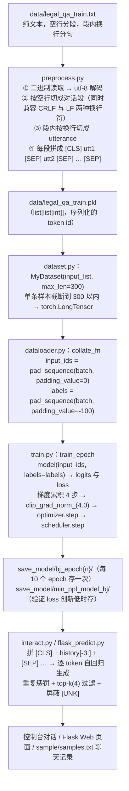
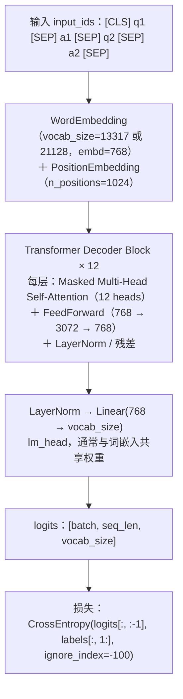

# 项目实战笔记 02：法律咨询问答机器人

> **一句话总结**：从零手写 `Dataset + DataLoader + 训练循环`，用 GPT2 的 Decoder 架构在约 3 万对法律咨询问答上做因果语言模型训练，把"法律问答"建模成"给定上文预测下一个 token"。
> **前置知识**：Transformer Decoder 结构与自注意力、因果语言模型（CLM）的 shift 对齐损失、PyTorch 的 `Dataset / DataLoader / collate_fn`、HuggingFace `transformers` 的 `GPT2LMHeadModel` 与 `BertTokenizerFast`。

> 1. 独立完成"原始对话文本 → `[CLS]seq1[SEP]seq2[SEP]` token 序列 → pkl 缓存 → 变长 batch 填充"的完整数据管线；
> 2. 手写一个带梯度累积、梯度裁剪、学习率预热与线性衰减的 transformer 训练循环；
> 3. 实现带重复惩罚与 top-k 采样的自回归解码，并把模型封成 Flask 接口。

## 1. 项目目标与业务背景

### 1.1 背景

法律咨询是典型的"长尾 + 高频"场景：当事人在线上反复问"租房押金不退怎么办""劳动合同纠纷的仲裁时效是多久"，而优质律师资源稀缺、重复解答成本高。已有的商业产品（微软小冰、阿里小蜜、百度小度）走的是通用对话路线，无法回答专业法律问题。

本项目选择了一条"朴素但完整"的路线：**不做检索、不做知识库，直接把约 3 万对法律咨询问答当成语料，用 GPT2 做领域内继续预训练**，让模型学会"法律问答这句话该怎么说"。

### 1.2 数据形态

```text
legal_qa_train.txt （约 9.5 MB，~3 万段对话）
legal_qa_valid.txt （约 134 KB）

租房押金不退怎么办？
协商退还；向住建部门投诉；留存转账凭证；发送律师函；申请调解；向法院起诉

劳动合同纠纷的仲裁时效是多久？
一年；自知道权利被侵害之日起算；劳动关系存续期间不受限制；先申请劳动仲裁
```

- 每段对话内部：奇数行是**问题**，偶数行是**回答**；
- 对话之间用**空行**（`\n\n` 或 `\r\n\r\n`）分隔；
- 文本已做过简单的"关键词抽取式"整理，回答是一串用分号隔开的要点，不是完整句子——这意味着模型学到的是"要点罗列风格"，而不是流畅对话。

### 1.3 为什么这个项目值得做

它把 LLM 的"训练全流程"暴露在光天化日下：tokenizer 怎么对齐、label 怎么 shift、pad 怎么不参与 loss、显存不够怎么梯度累积、生成怎么不重复。这些是在 `Trainer` 黑盒里永远学不到的。

## 2. 技术架构

### 2.1 数据流

这张图回答的是"一份纯文本语料怎么变成能训练的批次，训完又怎么被拿去生成"：



**读图要点**：

| 观察 | 含义 |
| --- | --- |
| 管线是"文本 → pkl → 张量 → batch"四段 | 每个环节有明确的输入输出格式，出问题时能立刻定位到是哪一段的形状不对 |
| tokenize 结果被缓存成 pkl | 分词只做一次，训练时不再重复；代价是换词表必须重新生成 pkl |
| 输入 pad 用 0、标签 pad 用 -100 | 前者要喂给模型，后者要被 loss 忽略，同一个张量不能身兼两职 |
| 训练与推理在 `SAVE` 处分叉 | 保存的 checkpoint 被 `interact.py` 和 `flask_predict.py` 共用，生成逻辑只有一份 |
| 推理侧的拼接与训练侧完全同构 | `[CLS] + history[-3:] + [SEP]` 就是训练时见过的序列形状，这也是"训练与推理口径必须一致"的体现 |

### 2.2 模型结构

这张图回答的是"一条 token 序列从输入到 loss，中间经过了什么"：



**读图要点**：

| 观察 | 含义 |
| --- | --- |
| 输入是一条**扁平序列**，问答对用 `[SEP]` 隔开 | 没有 role 字段、没有额外 token，所以后续的拼接与解码都只需要一行代码 |
| 词嵌入与位置嵌入相加后再进解码器 | 12 层都在同一个序列上做因果注意力，所以模型"看得到"前面的所有话轮 |
| Attention 带 Masked 前缀 | 每个位置只能看到左侧，这正是自回归生成能成立的前提 |
| 出口是 `lm_head` 给出的整词表分布 | 生成时取最后一个位置的分布采样，和训练时的输出形状是同一个 |
| 损失在最后一步才做 shift 对齐 | `logits[:, :-1]` 对 `labels[:, 1:]`，位置 i 的输出预测位置 i+1 的 token |

## 3. 关键技术选型与理由

| 方案 | 优点 | 代价 | 本项目为何选它 |
| --- | --- | --- | --- |
| GPT2（Decoder-only） | 天然适配自回归生成，`GPT2LMHeadModel` 开箱即用 | 没有 Encoder，无法做双向理解/分类 | 任务是"续写对话"，Decoder 就是唯一正确的形状 |
| `GPT2Config.from_json_file` 自建 + 不加载预训练权重 | 词表可自定义（法律领域 13317 词），模型小、训练快 | 失去通用语义先验，需要更多数据才能说人话 | 语料是法律垂直领域，且要求可复现地跑完训练全流程 |
| `BertTokenizerFast` + 自定义 vocab | 中文按字切分效果好，`vocab.txt` 轻量 | 引入了 `[CLS]/[SEP]/[PAD]` 三个 BERT 特殊符号到 GPT2 体系 | 把 `[SEP]` 直接当"话轮分隔符 + 生成终止符"用，一符两用，极简 |
| 用 pkl 缓存 tokenize 结果 | 训练时无需重复分词，epoch 迭代快 | 换词表就得重新生成 pkl | 3 万条语料分词只需几秒，相比训练耗时微不足道，但避免了每 epoch 重复 IO |
| `pad_sequence` + `padding_value=-100` | 变长序列无需人为截齐，-100 自动被 `CrossEntropyLoss` 忽略 | 需要自定义 `collate_fn` | 标准做法，`ignore_index=-100` 是 PyTorch 约定 |
| 梯度累积（steps=4） | 显存不够也能凑出大 batch 的等效效果 | 训练代码复杂度上升 | 单卡消费级 GPU 训 12 层 transformer 的必备手段 |
| AdamW + warmup + linear decay | 预热防早期梯度爆炸，衰减保证后期稳定收敛 | 需要正确计算 `t_total` | Transformer 训练的经典组合 |
| top-k 采样 + 重复惩罚 | 生成多样不死板，且不鬼打墙 | 温度/k 值需要调 | 对话生成场景比贪心解码自然得多 |
| Flask 服务化 | 几行代码就能提供 Web 交互 | 单线程阻塞、无并发能力 | 教学/演示场景够用，生产要换 FastAPI + 队列 |

## 4. 核心实现

### 4.1 数据处理：把对话压成一条 token 序列

```python
# data_preprocess/preprocess.py（精简）
tokenizer = BertTokenizerFast('vocab/vocab.txt', sep_token="[SEP]",
pad_token="[PAD]", cls_token="[CLS]")
sep_id, cls_id = tokenizer.sep_token_id, tokenizer.cls_token_id

with open(train_txt_path, 'rb') as f:
    data = f.read.decode("utf-8")

    # 关键：区分 Windows / Linux 换行符，否则整个语料会被切成 1 段
    train_data = data.split("\r\n\r\n") if "\r\n" in data else data.split("\n\n")

    dialogue_list = []
    for dialogue in tqdm(train_data):
        sequences = dialogue.split("\r\n") if "\r\n" in dialogue else dialogue.split("\n")
        input_ids = [cls_id] # 每段以 [CLS] 开头
        for sequence in sequences:
            input_ids += tokenizer.encode(sequence, add_special_tokens=False)
            input_ids.append(sep_id) # 每句后加 [SEP]
            dialogue_list.append(input_ids)

            with open(train_pkl_path, "wb") as f:
                pickle.dump(dialogue_list, f)
```

产出的单条序列形如：

```text
[CLS] 租房 押金 不退 怎么办 ？ [SEP] 协商 退还 ； 向 住建 部门 投诉 ； 留存 转账 凭证 [SEP]
```

**设计要点**：`add_special_tokens=False` 必须开。否则 `BertTokenizerFast.encode` 会往每句首尾塞 `[CLS]/[SEP]`，和手写的拼接逻辑冲突，序列里会满是噪声。

### 4.2 Dataset 与变长 batch 填充

```python
# dataset.py
class MyDataset(Dataset):
    def __init__(self, input_list, max_len):
        self.input_list = input_list
        self.max_len = max_len

        def __len__(self):
            return len(self.input_list)

        def __getitem__(self, index):
            return torch.tensor(self.input_list[index][:self.max_len], dtype=torch.long)

        # dataloader.py
        def collate_fn(batch):
            # 输入填充 0（PAD id）
            input_ids = rnn_utils.pad_sequence(batch, batch_first=True, padding_value=0)
            # 标签填充 -100，让 CrossEntropyLoss 的 ignore_index 自动跳过
            labels = rnn_utils.pad_sequence(batch, batch_first=True, padding_value=-100)
            return input_ids, labels
```

**为什么输入和标签用不同的 padding 值**：`input_ids` 里的 pad 是要喂给模型做 attention mask 的（用 `padding_value=0` 即 `[PAD]` id）；`labels` 里的 pad 是要被 loss 忽略的（用 `-100`）。同一个张量不能身兼两职，所以 `collate_fn` 从同一批数据里生成两份。

> 注意：`GPT2LMHeadModel` 对 `padding_value=0` 的 pad token 默认不会屏蔽注意力（不像 Encoder-Decoder 会传 `attention_mask`）。严格来说应该同时传 `attention_mask`，本项目为简化未传，长序列+大量 pad 时会略微影响效果。

### 4.3 训练循环：手写但完整

```python
# train.py: train_epoch（精简）
def train_epoch(model, train_dataloader, optimizer, scheduler, epoch, args):
    model.train
    ignore_index = args.ignore_index # -100
    total_loss, epoch_correct_num, epoch_total_num = 0, 0, 0

    for batch_idx, (input_ids, labels) in enumerate(tqdm(train_dataloader)):
        input_ids, labels = input_ids.to(args.device), labels.to(args.device)

        outputs = model(input_ids, labels=labels) # 传了 labels，模型内部直接算 loss
        logits, loss = outputs.logits, outputs.loss.mean

        batch_correct_num, batch_total_num = calculate_acc(logits, labels, ignore_index)
        epoch_correct_num += batch_correct_num
        epoch_total_num += batch_total_num
        total_loss += loss.item

        # 梯度累积：把 loss 缩放后再 backward，4 步之后才更新一次参数
        if args.gradient_accumulation_steps > 1:
            loss = loss / args.gradient_accumulation_steps
            loss.backward()

            # 梯度裁剪，防止梯度爆炸
            torch.nn.utils.clip_grad_norm_(model.parameters(), args.max_grad_norm)

            if (batch_idx + 1) % args.gradient_accumulation_steps == 0:
                optimizer.step # 更新参数
                scheduler.step # 更新学习率（warmup + 线性衰减）
                optimizer.zero_grad() # 清空梯度

                return total_loss / len(train_dataloader)
```

优化器与调度器：

```python
def train(model, train_dataloader, validate_dataloader, args):
    # 总步数 = (每 epoch 步数 / 累积步数) × epoch 数
    t_total = len(train_dataloader) // args.gradient_accumulation_steps * args.epochs

    optimizer = transformers.AdamW(model.parameters(), lr=args.lr, eps=args.eps)
    scheduler = transformers.get_linear_schedule_with_warmup(
    optimizer, num_warmup_steps=args.warmup_steps, num_training_steps=t_total)

    best_val_loss = 10000
    for epoch in range(args.epochs):
        train_loss = train_epoch(model, train_dataloader, optimizer, scheduler, epoch, args)
        validate_loss = validate_epoch(model, validate_dataloader, epoch, args)

        # 保存困惑度最低的模型
        if validate_loss < best_val_loss:
            best_val_loss = validate_loss
            model.save_pretrained(os.path.join(args.save_model_path, 'min_ppl_model_bj'))
```

**`t_total` 为什么要除以 `gradient_accumulation_steps`**：`scheduler.step` 只在参数真正更新的那一步调用，所以总步数是"更新次数"而不是"前向次数"。写成 `len(dataloader) * epochs` 会导致学习率衰减到一半就归零，训练提前停滞——这是极高频的手写训练 bug。

### 4.4 准确率统计：对齐 shift 与忽略 pad

```python
# functions_tools.py
def calculate_acc(logit, labels, ignore_index=-100):
 # 与语言模型一致：用前 n-1 个位置预测后 n-1 个位置
 logit = logit[:, :-1, :].contiguous.view(-1, logit.size(-1))
 labels = labels[:, 1:].contiguous.view(-1)

 _, logit = logit.max(dim=-1) # 取 argmax

 non_pad_mask = labels.ne(ignore_index) # pad 位置为 False
 n_correct = logit.eq(labels).masked_select(non_pad_mask).sum.item
 n_word = non_pad_mask.sum.item
 return n_correct, n_word
```

这个函数浓缩了三个必须做对的细节：**shift（`[:-1]` 对 `[1:]`）、flatten（`view(-1)`）、mask（`ne(-100)`）**。少任何一个，算出来的 acc 都是错的（通常是虚高）。

### 4.5 推理：多轮上下文 + 重复惩罚 + top-k

```python
# interact.py（精简）
history = [] # 每个元素是一条 utterance 的 token id 列表
while True:
    text = input("user:")
    history.append(tokenizer.encode(text, add_special_tokens=False))

    input_ids = [tokenizer.cls_token_id]
    for history_utr in history[-pconf.max_history_len:]: # 只保留最近 3 轮
        input_ids.extend(history_utr)
        input_ids.append(tokenizer.sep_token_id)

        input_ids = torch.tensor(input_ids, dtype=torch.long, device=device).unsqueeze(0)
        response = []
        for _ in range(pconf.max_len):
            logits = model(input_ids=input_ids).logits
            next_token_logits = logits[0, -1, :] # 只关心最后一个位置的分布

            # ① 重复惩罚：已生成过的 token，logit 除以惩罚系数 → 概率下降
            for tid in set(response):
                next_token_logits[tid] /= pconf.repetition_penalty

                # ② 屏蔽 [UNK]
                next_token_logits[tokenizer.convert_tokens_to_ids('[UNK]')] = -float('Inf')

                # ③ top-k 过滤：只保留概率最高的 k 个 token
                filtered_logits = top_k_top_p_filtering(next_token_logits, top_k=pconf.topk)

                # ④ 按概率采样（而非 argmax，避免输出死板）
                next_token = torch.multinomial(F.softmax(filtered_logits, dim=-1), num_samples=1)

                if next_token.item == tokenizer.sep_token_id: # 遇到 [SEP] = 回答结束
                    break
                response.append(next_token.item)
                input_ids = torch.cat((input_ids, next_token.unsqueeze(0)), dim=1)

                history.append(response)
                print("chatbot:" + "".join(tokenizer.convert_ids_to_tokens(response)))
```

`top_k_top_p_filtering` 的实现：

```python
def top_k_top_p_filtering(logits, top_k=0, filter_value=-float('Inf')):
    assert logits.dim == 1
    top_k = min(top_k, logits.size(-1))
    if top_k > 0:
        # torch.topk(...)[0][..., -1, None] 是第 k 大的那个值
        indices_to_remove = logits < torch.topk(logits, top_k)[0][..., -1, None]
        logits[indices_to_remove] = filter_value
        return logits
```

**`[SEP]` 一符两用的巧妙之处**：训练时它分隔问题与回答，推理时它就自然成了"回答结束标志"。不需要额外的 EOS token，也不用改词表。

### 4.6 Flask 服务化

```text
# flask_predict.py（精简）
app = Flask(__name__)

@app.route('/', methods=['GET'])
def index:
 return render_template('index.html') # 加载聊天页面

@app.route('/chat', methods=['POST'])
def chat:
 text = request.form['text']
 return model_predict(text) # 内部即 interact.py 的生成循环
```

注意工程细节：**模型必须在模块加载时初始化一次**（`model = GPT2LMHeadModel.from_pretrained(...)` 写在函数外），而不是每次请求都加载——否则每个请求都要读几百 MB 权重，响应时间从毫秒级退化到十秒级。

## 5. 踩坑与解决

| 现象 | 根因 | 解决 | 如何预防 |
| --- | --- | --- | --- |
| 语料被切成 1 段 / 段落数量异常 | 语料是 CRLF 换行，代码只切 `"\n\n"` | 先判断 `if "\r\n" in data` 再选分隔符 | 处理跨平台文本文件时，**永远先统一换行符**（`data.replace("\r\n", "\n")`）再切分，比到处写 if 更干净 |
| tokenize 后序列里出现大量 `[CLS]/[SEP]` | `tokenizer.encode` 默认 `add_special_tokens=True`，与手写拼接重复 | 传 `add_special_tokens=False` | 手写特殊符号时，一定要显式关掉 tokenizer 的自动添加 |
| 训练几个 epoch 后 loss 不降 / 学习率变 0 | `t_total` 忘除 `gradient_accumulation_steps`，调度器提前走完 | `t_total = len(dl) // accum * epochs` | 手写训练循环时，**先打印 `scheduler.get_last_lr` 逐 step 观察曲线**，再开始长时间训练 |
| 模型输出大量 `[PAD]` 或空回答 | label 的 pad 用了 0，loss 把 pad 位置也算了；或输入/标签没有 shift 对齐 | labels 用 `padding_value=-100`；训练用 `labels=` 让模型内部 shift | 记住 PyTorch 的约定：**忽略位永远用 -100**，输入 pad 用 0 |
| 生成的回答反复重复同一句 | 采样时同一 token 被反复抽中 | `repetition_penalty=10.0`，对已出现 token 降权；再用 top-k 截断尾部 | 生成质量差时，优先怀疑"没有重复惩罚 + 解码策略是贪心" |
| Loss 突然 NaN | 学习率过高导致梯度爆炸 | `clip_grad_norm_(params, max_grad_norm=4.0)` + warmup | 梯度裁剪和 warmup 是 transformer 训练的默认配置，不是可选项 |
| 训练 OOM | batch_size=4 且序列最长 300，12 层模型对显存要求高 | 梯度累积（4 步等效 batch 16）+ 调小 `max_len` | 显存不够时，第一反应应该是"梯度累积"，而不是立刻砍 batch（会伤效果） |
| `assert model.config.vocab_size == tokenizer.vocab_size` 失败 | 用了 `vocab2.txt`（更大词表）但 config.json 里还是旧 vocab_size | 让 config 与 vocab 文件严格配对 | 词表换了，**config.json 的 `vocab_size` 必须同步改**，否则 lm_head 尺寸对不上 |
| 验证 loss 越低生成越差 | 交叉熵低 ≠ 人读起来好（语料是"分号罗列"风格） | 同时保存"困惑度最低"和"固定间隔"的 checkpoint，人工对比 | 生成任务的评估必须**人看**，自动指标只能做粗筛 |
| Flask 每次请求都很慢 | 在请求处理函数内部加载模型 | 模型在模块顶层加载一次，`model.eval` | 服务化第一原则：**重资源只初始化一次** |

## 6. 可复用经验

1. **"数据 → Dataset → collate_fn → 训练循环"这条管线是所有 NLP 训练项目的骨架。** 换成 BERT 分类、NER、摘要，形状会变，但"tokenize 缓存 → 变长填充 → shift 对齐 → mask 忽略"这套思想不变。手写过一次，就再也不会被 `Trainer` 的参数名绕晕。
2. **`collate_fn` 是处理变长序列的唯一正确位置。** 不要在 `__getitem__` 里 padding（会把整个数据集撑成 max_len 大小），也不要在模型里 padding（污染模型职责）。
3. **`-100` 是"不算 loss"的通用暗号。** 从 `CrossEntropyLoss(ignore_index=-100)` 到 `DataCollatorWithPadding`，整个 PyTorch/HF 生态都用它，记住它。
4. **梯度累积的本质是"把 batch 拆开、把 loss 除一下、攒够步数再更新"。** 它不改数学结果（近似），只改显存占用，是消费级显卡训练大模型的唯一出路。
5. **生成任务调优的优先级**：先保证训练对齐没错（acc 能到合理值）→ 再调解码策略（重复惩罚 / top-k / 温度）→ 最后才考虑换模型或加数据。
6. **特殊 token 可以承载语义。** 本项目把 `[SEP]` 同时用作"话轮分隔符"和"生成终止符"，零成本实现了对话边界管理。设计自己的对话格式时，尽量复用已有的特殊符号，而不是随便新造一个 token。
7. **训练一定要存两类 checkpoint**：按指标最优（`min_ppl_model_bj`）+ 按固定间隔（`bj_epoch{n}`）。生成任务里"指标最优"经常不是"人看着最好"。

## 7. 面试问答

<details markdown="1">
<summary markdown="1"><b>Q1：为什么用 GPT2 而不是 BERT 来做对话生成？</b></summary>

因为任务的性质决定架构。

BERT 是 **Encoder-only + 双向注意力**，它在预训练时用的是 MLM（随机 mask 掉一些 token 让模型猜）。每个位置都能"看到"左右两侧的信息，这让它非常适合做**理解类任务**（分类、NER、抽取），但它**不具备自回归生成能力**——它没法"根据已生成的 token 预测下一个 token"，因为训练时它从来没被要求这么做。

GPT2 是 **Decoder-only + 因果掩码注意力**，每个位置只能看到左侧。它的预训练目标就是"给定前文预测下一个 token"，这正好等价于"给定法律咨询对话的上文，生成律师回答"。生成的每一步就是把新 token 接到序列尾部再算一次，天然自洽。

如果我非要用 BERT 做生成，会退化成"完形填空"式的做法：反复往句子里插 `[MASK]` 再填空。效率低、控制差、也无法处理开放长度的回答。

补充一点：本项目的语料是"问答对"，如果只是想做**检索式**问答（从语料里找最像的答案），那用 BERT 做句向量召回反而更合适、更可控。选择生成式路线的代价就是可能编造——这也是后来 RAG 路线兴起的原因。

</details>

<details markdown="1">
<summary markdown="1"><b>Q2：你的训练损失是怎么算的？为什么要把 label 的 padding 值设成 -100？</b></summary>

因果语言模型的损失是 **shift-by-one 的交叉熵**：

设输入序列为 `x = [x₀, x₁, ..., xₙ₋₁]`，`GPT2LMHeadModel` 在传入 `labels` 时会自动做 shift：用 `logits[:, :-1, :]`（位置 0..n-2 的预测）去对 `labels[:, 1:]`（位置 1..n-1 的真实 token）。也就是说，位置 i 的输出要预测位置 i+1 的 token。代码里等价于：

```python
loss = F.cross_entropy(logits[..., :-1, :].view(-1, V),
labels[..., 1:].view(-1),
ignore_index=-100)
```

`-100` 的作用是**屏蔽 padding 位置**。因为一个 batch 里的序列要 pad 到等长，pad 出来的位置本来没有真实 token，如果让它们参与 loss，模型就会被训练去"预测 PAD"，白白浪费容量、还会让指标虚高。`CrossEntropyLoss` 的 `ignore_index=-100` 参数会把这些位置的损失直接跳过，`calculate_acc` 里也用 `labels.ne(-100)` 生成的 mask 把它们从准确率统计中剔除。

为什么是 `-100` 而不是 0？因为 0 是一个合法的 token id（在中文 BERT 词表里 0 通常就是 `[PAD]`），用 0 会让"真实的第 0 号 token"和"填充位"混淆。`-100` 是 PyTorch 选择的哨兵值，反正它不可能是合法 token id，绝对安全。

</details>

<details markdown="1">
<summary markdown="1"><b>Q3：你的模型会重复说同一句话，怎么解决的？还有哪些解码策略可以选？</b></summary>

分两层。

**第一层：重复惩罚（repetition penalty）。** 在每一步采样前，遍历本次已经生成的 token 集合 `set(response)`，把对应位置的 logit 除以惩罚系数：

```python
for tid in set(response):
 next_token_logits[tid] /= pconf.repetition_penalty # 默认 10.0
```

logit 被压缩后，经过 softmax 概率显著下降，模型倾向于选"没说过的话"。系数越大越不容易重复，但太大会导致语义断裂、同义反复变多，需要按语料调。

**第二层：解码策略。** 我在项目里用的是 **top-k 采样**：只保留概率最高的 k（这里 k=4）个 token，其余置 `-inf`，然后在剩下这 k 个里按归一化概率多项式采样。相比贪心解码（永远取 argmax），采样能避免陷入"最安全但最无聊"的循环。

其他可选策略：

- **beam search**：同时维护多条候选序列，取整体概率最高的。质量通常更高，但计算量 ×beam 数，且对话场景容易生成"过于安全"的通用回复。
- **top-p（nucleus sampling）**：动态选累积概率达到 p 的最小 token 集合，比 top-k 更自适应（分布尖锐时少留、平坦时多留）。实践中 top-p 常优于 top-k。
- **temperature**：把 logits 除以温度 T，T<1 更确定、T>1 更随机。和 top-k/top-p 组合使用。
- **no_repeat_ngram_size**：硬性禁止任意 n-gram 重复出现，对"整句复读"最有效。

还有一层是**数据层面**的：如果训练语料里本身就有大量重复句式（本项目语料是"分号罗列的要点"，风格高度模板化），那模型学到重复模式是"忠于数据"的表现，此时调解码参数只是治标，治本要清洗语料。

</details>

## 8. 延伸阅读

- GPT-2 论文《Language Models are Unsupervised Multitask Learners》：Decoder-only + zero-shot 迁移的原始动机
- HuggingFace `transformers` 文档：`GPT2LMHeadModel`、`GPT2Config`、`BertTokenizerFast`
- 《The Curious Case of Neural Text Degeneration》（Holtzman et al., 2019）：top-p / nucleus sampling 的提出
- 本仓库同目录：[01-项目-法律咨询RAG问答系统](../01-问答与RAG系统/01-项目-法律咨询RAG问答系统.md)（对比"检索式问答"路线）、[08-项目-新闻文本分类三方案对比](../03-文本分类系统/08-项目-新闻文本分类三方案对比（随机森林FastTextBERT）.md)
- 配套代码：`Gpt2_Chatbot/train.py`、`interact.py`、`data_preprocess/preprocess.py`、`functions_tools.py`

---
[⬅️ 返回本目录索引](README.md)
