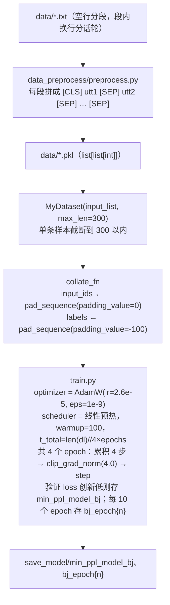
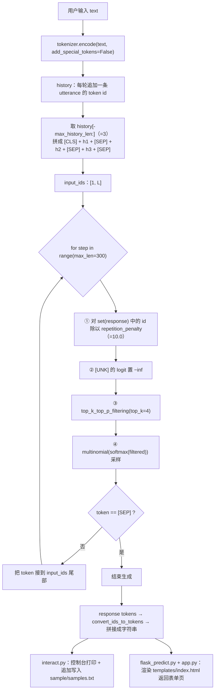
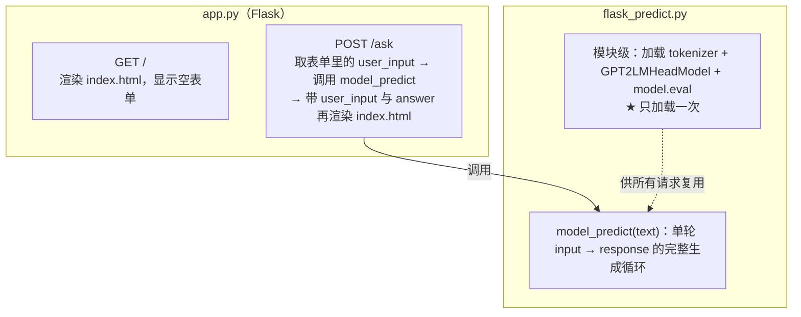

# 项目实战笔记 03：企业客服聊天机器人

> **一句话总结**：用同一套 GPT2 训练框架，把语料从"法律咨询问答"换成"企业售后客服对话"，并把重心从"怎么训"挪到"怎么生成得像人、怎么低成本上线、怎么留痕可复盘"。
> **前置知识**：因果语言模型与 `GPT2LMHeadModel`、多轮对话的上下文拼接、采样解码（temperature / top-k / top-p / repetition penalty）、Flask 模板渲染。

> 1. 设计一套以 `[CLS]` 开头、`[SEP]` 分隔话轮的**多轮对话序列格式**，并正确控制 `max_history_len`；
> 2. 实现一个可交互、可记录、可服务化的生成式对话系统（CLI + Web 双入口）；
> 3. 说清楚"贪心 / top-k / top-p / beam search"四种解码策略的取舍，并根据业务选型。

## 1. 项目目标与业务背景

### 1.1 业务目标

做一个"客服助手"式的企业售后客服机器人。它的定位是售后场景的**多轮对话**，不是知识问答：

- 能承接前几轮上下文（"你叫什么" → "客服助手" → "你多大了"，回答要一致）；
- 输出要口语化、不重复、不输出 `[UNK]` 这类噪声符号；
- 交互方式要能演示：命令行直接聊、网页表单能提交；
- 聊天记录要留痕，方便人工评估生成质量、积累 bad case。

### 1.2 与"检索式问答"的本质区别

| | 生成式对话（本项目） | 检索式 / RAG 问答 |
| --- | --- | --- |
| 知识来源 | 模型参数里的隐式记忆 | 外部知识库的显式文档 |
| 回答长度 | 自由生成 | 抽取拼接 |
| 可控性 | 低（可能说错、跑题） | 高（答案可溯源） |
| 适合场景 | 寒暄安抚、情绪应答、话术生成 | 咨询、专业问答、可溯源答复 |

抓住这个区分，面试时就不会把"GPT2 聊天"和"RAG 问答"混为一谈。

### 1.3 对话示例

```text
你好，我是你的客服助手
user:你好
chatbot:你好，我是客服助手，很高兴为你服务
user:你叫什么名字
chatbot:我叫客服助手，随时帮你处理售后问题
user:我的订单什么时候能到
chatbot:我帮你查一下订单进度，请稍等
```

（生成结果保存在 `sample/samples.txt`，每条 utterance 以 token id 形式记录，便于复盘。）

## 2. 技术架构

### 2.1 训练侧数据流



**读图要点**：

| 观察 | 含义 |
| --- | --- |
| 数据先被离线转成 pkl，训练时才读 | tokenize 只做一次，每个 epoch 不必重复分词，迭代速度取决于这一步 |
| 输入与标签从同一批数据生成两份 | `input_ids` 的 pad 用 0（要喂给模型），`labels` 的 pad 用 -100（要跳过 loss），两者职责不同不能共用一个张量 |
| `t_total` 里除以了梯度累积步数 | `scheduler.step` 只在参数真正更新时调用，写成"前向次数"会让学习率提前归零 |
| 训练结束存两份 checkpoint | 按指标最优（`min_ppl`）和按固定间隔各存一份，生成任务的自动指标与人的感受经常不一致 |

### 2.2 推理侧数据流

这一节回答的是"一句话怎么变成一个回答，以及回答怎么同时流向控制台和网页"：



**读图要点**：

| 观察 | 含义 |
| --- | --- |
| 生成循环里有四道过滤，顺序固定 | 先压重复、再屏蔽 `[UNK]`、然后 top-k 砍长尾、最后才采样，任何一步换顺序都会改变输出风格 |
| 采样用 `multinomial` 而不是 `argmax` | 贪心解码会稳定输出"最安全"的句子，也最容易陷入复读循环 |
| `STOP` 判据是 `[SEP]` | 同一个符号在训练时是话轮边界、推理时是结束信号，一个符号解决两个问题 |
| 历史窗口只有 3 轮 | 与 `n_ctx=1024`、`max_len=300` 的预算匹配，代价是丢失更早的长程依赖 |
| 生成结果有两个并列出口 | 交互与记录互不干扰，`samples.txt` 是后续人工评估与 bad case 沉淀的起点 |

### 2.3 服务化结构

这一节回答的是"网页上的一个请求最终打在哪些代码上"：



**读图要点**：

| 观察 | 含义 |
| --- | --- |
| 两条路由一读一写，共用同一个模板 | 表单页与结果页是同一个 `index.html`，靠传入变量区分状态 |
| 模型加载在 `flask_predict.py` 的模块级，不在请求函数里 | 请求函数里加载意味着每次请求都读几百 MB 权重，响应时间会从毫秒级退化到秒级 |
| `model_predict` 每次调用都重置 `history` | 所以 Web 端实际是无状态单轮，多轮能力只在 CLI 里——这是代码写法的直接后果 |
| 服务入口与生成循环分离在两个文件 | 换框架或加并发时只动 `app.py`，生成逻辑不受影响 |
| 启动方式是 `app.run(debug=True)` | 这是单进程阻塞的开发服务器，只能用于演示，生产必须换 WSGI 服务器并关掉 `debug` |

## 3. 关键技术选型与理由

| 方案 | 优点 | 代价 | 本项目为何选它 |
| --- | --- | --- | --- |
| Decoder-only（GPT2） | 自回归生成天然适配对话 | 无双向注意力，做理解类任务弱 | 客服对话就是"续写下一句"，Decoder 是最小充分结构 |
| 自建 `GPT2Config`（n_layer=12, n_head=12, n_embd=768, n_ctx=1024, vocab=13317） | 词表可裁剪到领域规模，模型小、单卡能训 | 丢掉通用语义先验，需要语料量撑起来 | 自研场景要"看得见、控得住、跑得完" |
| 词表 `vocab.txt`（13317）+ 备选 `vocab2.txt`（更大） | 小词表 → embedding 与 lm_head 都小 → 显存友好 | 生僻字会落到 `[UNK]` | 优先小词表，因为推理时要屏蔽 `[UNK]`，词表越小噪声越少 |
| 用 `BertTokenizerFast` 而非 `GPT2Tokenizer` | 中文按字切分、`vocab.txt` 格式简单、`[CLS]/[SEP]/[PAD]` 现成 | 与 GPT2 原生 BPE 体系不兼容，不能直接搬 HF 权重 | 本项目从零训，不需要兼容官方 GPT2 权重，换取中文友好度 |
| `[SEP]` 兼作"话轮分隔符 + 生成终止符" | 零成本实现对话边界与停止条件 | 极端情况下模型可能过早生成 `[SEP]` 导致空回答 | 不新增特殊 token、不改词表、不改 config，性价比极高 |
| 历史窗口 `max_history_len=3` | 上下文有限，但足以维持话题连贯 | 更早的对话被丢弃，无法处理超长依赖 | `n_ctx=1024` 上限下，3 轮 + 单轮长回答正好卡在预算内 |
| **top-k 采样**（top_k=4） | 输出多样、不像机器；k 小又能压住胡说 | 需要调参，k 太大会跑题 | 客服场景要"不生硬"，比贪心解码体验好得多 |
| **重复惩罚**（penalty=10.0） | 显著缓解"复读机"现象 | 过大会导致语义不连贯 | 生成式对话的第一大顽疾就是复读，必须治 |
| `max_len=300` 作为生成长度上限 | 防止死循环、限制单次延迟 | 长回答会被硬截断 | 相当于一道"熔断阀"，比不设上限安全 |
| Flask 服务化 | 5 行代码起步，模板渲染即得界面 | 单进程模型推理会阻塞；`debug=True` 不能上生产 | 演示/内部工具足够，生产要换 FastAPI/队列 + `debug=False` |
| 记录 `sample/samples.txt` | 生成结果可回看、可标注、可做 bad case 库 | 需要处理文件 IO 与编码 | 生成任务**必须**有人工评估通道，样本文件就是最朴素的通道 |

## 4. 核心实现

### 4.1 多轮上下文拼接：对话格式设计的核心

```python
# interact.py（精简）
history = [] # 每个元素 = 一轮 utterance 的 token id 列表

while True:
    text = input("user:")
    samples_file.write("user:{}\n".format(text))

    text_ids = tokenizer.encode(text, add_special_tokens=False)
    history.append(text_ids)

    # 每个 input 以 [CLS] 开头，然后依次拼接最近 N 轮，每轮后跟 [SEP]
    input_ids = [tokenizer.cls_token_id]
    for history_utr in history[-pconf.max_history_len:]: # max_history_len = 3
        input_ids.extend(history_utr)
        input_ids.append(tokenizer.sep_token_id)

        input_ids = torch.tensor(input_ids, dtype=torch.long, device=device).unsqueeze(0)
```

**三处关键决策**：

1. **为什么要 `history[-max_history_len:]`**：模型 `n_ctx=1024`，而 `max_len=300` 是单次生成上限。如果无限累加历史，迟早超出上下文窗口，且越早的内容对当前话题越不重要。滑窗是最简单有效的截断策略。
2. **为什么 `add_special_tokens=False`**：`BertTokenizerFast.encode` 默认会在句首尾加 `[CLS]/[SEP]`。我们手工管理这些符号，必须关掉，否则序列里会出现重复的特殊符，模型会把它们当成真实语义。
3. **为什么 `[SEP]` 在两处语义不同**：训练时它是"话轮边界"，推理时它同时是"生成结束信号"。这个一符两用让解码循环的停止条件变得极其简单——不需要额外定义 EOS。

### 4.2 解码：四步过滤出下一个 token

```python
def top_k_top_p_filtering(logits, top_k=0, filter_value=-float('Inf')):
    assert logits.dim == 1
    top_k = min(top_k, logits.size(-1)) # 安全检查
    if top_k > 0:
        # torch.topk(...)[0][..., -1, None] 取"第 k 大的值"，形状保持为 [1] 便于广播
        indices_to_remove = logits < torch.topk(logits, top_k)[0][..., -1, None]
        logits[indices_to_remove] = filter_value # 截断尾部：置 -inf
        return logits

    response = []
    for _ in range(pconf.max_len):
        logits = model(input_ids=input_ids).logits
        next_token_logits = logits[0, -1, :] # 只要最后一个位置的分布

        # ① 重复惩罚：已生成过的 token，概率压低
        for tid in set(response):
            next_token_logits[tid] /= pconf.repetition_penalty # 10.0

            # ② 屏蔽 [UNK]：绝不允许输出未知词
            next_token_logits[tokenizer.convert_tokens_to_ids('[UNK]')] = -float('Inf')

            # ③ top-k 过滤：只保留概率最高的 k 个
            filtered_logits = top_k_top_p_filtering(next_token_logits, top_k=pconf.topk) # 4

            # ④ 按概率采样（不是 argmax！）
            next_token = torch.multinomial(F.softmax(filtered_logits, dim=-1), num_samples=1)

            if next_token.item == tokenizer.sep_token_id: # 生成结束
                break
            response.append(next_token.item)
            input_ids = torch.cat((input_ids, next_token.unsqueeze(0)), dim=1)
```

**为什么必须用 `multinomial` 而不是 `argmax`**：`argmax` 是贪心解码，每一步都取概率最高的 token。它会稳定地生成"最安全"的句子，结果是回答干瘪、且极易陷入"我最喜欢…我最喜欢…"的循环。按概率采样则保留了多样性，配合 top-k 又不会抽到明显不合理的尾部 token。

**`set(response)` 而不是 `response`**：重复惩罚只关心"这个 token 出现过没有"，不关心出现几次。用 `set` 去重后遍历，避免对同一个 id 反复做除法（虽然结果一样，但语义更清晰、迭代更少）。

### 4.3 参数配置：一份集中管理的实验档案

```python
# parameter_config.py（节选）
class ParameterConfig:
    def __init__(self):
        self.device = torch.device('cuda' if torch.cuda.is_available else 'cpu')
        self.vocab_path = '.../vocab/vocab.txt' # 词表路径
        self.train_path = '.../data/medical_train.pkl' # 训练数据
        self.valid_path = '.../data/medical_valid.pkl'
        self.config_json = '.../config/config.json' # 模型结构
        self.save_model_path = '.../save_model1'
        self.pretrained_model = '' # 留空 = 从零初始化，不加载官方 GPT2 权重
        self.ignore_index = -100 # 填充位不算 loss
        self.max_history_len = 3 # 历史保留轮数
        self.max_len = 300 # 单轮最大生成长度
        self.repetition_penalty = 10.0 # 重复惩罚
        self.topk = 4 # top-k 采样的 k
        self.batch_size = 4
        self.epochs = 4
        self.lr = 2.6e-5
        self.eps = 1.0e-09
        self.max_grad_norm = 4.0
        self.gradient_accumulation_steps = 4
        self.warmup_steps = 100
```

**为什么要单独搞一个类，而不是散落的常量**：训练超参、路径、解码参数都是"实验变量"。集中在一处，才能一眼看出"这次实验和上次差在哪"，也才好用命令行覆盖、写进实验记录。这是把个人脚本变成可复现实验的最小成本做法。

### 4.4 模型加载：训练/推理共用的一套分支

```python
# test_model.py / train.py 共用逻辑
if params.pretrained_model:
 model = GPT2LMHeadModel.from_pretrained(params.pretrained_model) # 加载已有权重
else:
 model_config = GPT2Config.from_json_file(params.config_json) # 按 json 建结构
 model = GPT2LMHeadModel(config=model_config)
model = model.to(params.device)

# 词表尺寸必须与模型 config 对齐，否则 lm_head 维度对不上
assert model.config.vocab_size == tokenizer.vocab_size
```

`config/config.json` 关键字段：

```json
{
 "model_type": "gpt2",
 "n_ctx": 1024, "n_positions": 1024,
 "n_embd": 768, "n_head": 12, "n_layer": 12,
 "activation_function": "gelu_new",
 "attn_pdrop": 0.1, "embd_pdrop": 0.1, "resid_pdrop": 0.1,
 "layer_norm_epsilon": 1e-05,
 "vocab_size": 13317,
 "tokenizer_class": "BertTokenizer",
 "task_specific_params": {
 "text-generation": { "do_sample": true, "max_length": 400 }
 }
}
```

`assert` 那一行是**廉价但极其有效**的自检：词表文件和 config 不匹配是最高频的低级错误，让它在启动阶段就崩，比训到一半报形状错误好得多。

### 4.5 训练与验证的 checkpoint 策略

```python
# train.py（精简）
def train(model, train_dataloader, validate_dataloader, args):
    t_total = len(train_dataloader) // args.gradient_accumulation_steps * args.epochs
    optimizer = transformers.AdamW(model.parameters(), lr=args.lr, eps=args.eps)
    scheduler = transformers.get_linear_schedule_with_warmup(
    optimizer, num_warmup_steps=args.warmup_steps, num_training_steps=t_total)

    best_val_loss = 10000
    for epoch in range(args.epochs):
        train_loss = train_epoch(model, train_dataloader, optimizer, scheduler, epoch, args)

        # ① 每 10 个 epoch 定存一份（不依赖指标）
        if epoch % 10 == 0 or epoch == args.epochs:
            model.save_pretrained(os.path.join(args.save_model_path, 'bj_epoch{}'.format(epoch + 1)))

            # ② 验证 loss 创新低时存一份（min ppl）
            validate_loss = validate_epoch(model, validate_dataloader, epoch, args)
            if validate_loss < best_val_loss:
                best_val_loss = validate_loss
                model.save_pretrained(os.path.join(args.save_model_path, 'min_ppl_model_bj'))
```

**为什么要存两类 checkpoint**：困惑度（perplexity）最低 ≠ 人读起来最好。语料是"要点罗列"风格时，模型学会模板化输出反而 loss 更低。定存 + 最优存两条线，才会在事后有得选。

### 4.6 Flask 服务：注意重资源只加载一次

```python
# flask_predict.py（模块级，不在请求函数内）
pconf = ParameterConfig
device = 'cuda' if torch.cuda.is_available else 'cpu'
tokenizer = BertTokenizerFast(vocab_file=pconf.vocab_path,
sep_token="[SEP]", pad_token="[PAD]", cls_token="[CLS]")
model = GPT2LMHeadModel.from_pretrained('./save_model/epoch97').to(device)
model.eval

def model_predict(text):
    history = [tokenizer.encode(text, add_special_tokens=False)]
    input_ids = [tokenizer.cls_token_id]
    for utr in history[-pconf.max_history_len:]:
        input_ids.extend(utr); input_ids.append(tokenizer.sep_token_id)
        input_ids = torch.tensor(input_ids).long.to(device).unsqueeze(0)
        # ... 同 interact.py 的生成循环 ...
        return "".join(tokenizer.convert_ids_to_tokens(response))
```

```text
# app.py
app = Flask(__name__)

@app.route('/')
def index:
 return render_template('index.html')

@app.route('/ask', methods=['POST'])
def ask:
 user_input = request.form['user_input']
 response = model_predict(user_input)
 return render_template('index.html', user_input=user_input, answer=response)

if __name__ == '__main__':
 app.run(debug=True)
```

**两个必须知道的细节**：

- `flask_predict.py` 里的 `model_predict` 每次调用都会新建 `history = []`，所以**Web 端实际上是无状态的单轮对话**——用户在网页上感受不到多轮记忆。真正的多轮能力在 `interact.py` 的 CLI 里（它把 `history` 保存在循环外）。如果要给 Web 加多轮，需要按 `session_id` 在服务端维护 `history` 字典，或用 Redis 存。
- `app.run(debug=True)` 只适合开发。生产环境 `debug=True` 会暴露源码与调试器（Werkzeug 调试控制台可执行任意代码），必须关掉。

## 5. 踩坑与解决

| 现象 | 根因 | 解决 | 如何预防 |
| --- | --- | --- | --- |
| 模型输出里夹杂大量 `[CLS]`、`[PAD]` | 训练时标签未屏蔽特殊符；或推理时没关 `add_special_tokens` | 编码时 `add_special_tokens=False`；labels 的 pad 用 -100 | 把"特殊符号的生成"当成显式设计：要么屏蔽它们（如 `[UNK]`），要么赋予语义（如 `[SEP]` 作终止符），不要放任 |
| 网页端感觉不到多轮对话 | `model_predict` 内部每次重置 `history = []` | 若要多轮，按会话 ID 在服务端维护 history | 明确区分"有状态对话"和"无状态单轮"两种接口语义，别让 CLI 和 Web 表现不一致还没意识到 |
| 生成的句子越说越短、经常一个字就结束 | 模型过早预测出 `[SEP]` | 提高数据质量；或对 `[SEP]` 的 logit 在生成前几轮做临时抑制 | 终止符同时是分隔符时，会有"早停"风险，必要时给终止符单独处理 |
| 同一句话反复出现 | 无重复惩罚 / 解码是贪心 | `repetition_penalty=10.0` + top-k 采样 | 生成式对话调优清单的第一条就是重复惩罚 |
| 输出里出现 `[UNK]` | 词表覆盖不足，模型学到了 `[UNK]` 的分布 | 生成前把 `[UNK]` 的 logit 设为 `-inf` | 词表外的字符永远不该出现在最终回答里，用 logit 屏蔽做硬约束 |
| 训练启动就报形状不匹配 | `vocab.txt` 与 `config.json` 的 `vocab_size` 不一致 | 两者严格配对：13317 对 13317 | 保留 `assert model.config.vocab_size == tokenizer.vocab_size` |
| 换了 `vocab2.txt` 后效果反而变差 | 词表变大 → embedding 和 lm_head 参数变多 → 同样数据下欠拟合 | 固定一套词表，或同步增大数据量/训练轮数 | 词表大小是**模型容量**的一部分，改它等于改模型 |
| 训练中途 loss 变 NaN | 学习率 2.6e-5 虽小，但 warmup=100 步太短时前期仍可能震荡；或梯度爆炸 | `clip_grad_norm_(params, 4.0)`；确认 `t_total` 计算正确 | 训练脚本上线前先跑 100 步，确认 loss 平滑下降再挂长训 |
| 显存不足无法加大 batch | batch_size=4 已是单卡上限 | 梯度累积 4 步等效 batch=16 | 显存瓶颈优先用梯度累积解决 |
| CPU 推理一次要几十秒 | 12 层 768 维模型在 CPU 上逐 token 自回归，300 步起步 | 部署时用 GPU；或减小 `max_len`/层数；或做量化 | 自回归生成是 O(生成长度) 次前向，延迟天然随长度线性增长，要提前做容量规划 |
| 聊天记录文件里中文乱码 | 打开文件未指定编码 | `open(path, 'a', encoding='utf8')` | 涉及中文文件 IO，`encoding` 参数一次都别省 |

## 6. 可复用经验

1. **对话格式设计决定了解码逻辑的复杂度。** 本项目用 `[CLS] 轮1 [SEP] 轮2 [SEP] ...` 的扁平序列，让"拼接历史"和"判断结束"都变成一行代码。反观需要区分 role（system/user/assistant）的格式，就要维护 role token 与 mask，复杂度高一个量级。**能用一个特殊符解决的问题，绝不用两个。**
2. **滑窗截断历史是最实用的上下文管理策略。** `history[-3:]` 一行搞定成本与效果的平衡。真正需要长期记忆时再上摘要或向量检索，别提前优化。
3. **解码策略按"要安全还是要有趣"来选。** 事务性问答要安全 → 低温度 + 小 top-k + 重复惩罚；寒暄安抚 → 高温度 + top-p。同一个模型换解码参数就能换产品性格，这是生成式模型独有的灵活度。
4. **参数集中管理是实验可复现的前提。** `ParameterConfig` 这个类看起来朴素，但它让"每次实验"变成"改一个文件里几行数字"，而不是在多个脚本里翻找硬编码。
5. **checkpoint 要两条线：按指标 + 按间隔。** 生成任务里自动指标和人类感受经常脱节，留一手定存总是对的。
6. **重资源在模块级初始化。** Web 服务里把模型加载从请求函数里挪出去，是延迟从"秒级"降到"毫秒级"的最大一步。
7. **给生成系统留一条人工评估通道。** `sample/samples.txt` 这种看似土的记录方式，是发现 bad case、构建评测集、验证迭代效果的起点。没有它，所有"感觉变好了"都是空话。

## 7. 面试问答

<details>
<summary><b>Q1：多轮对话你是怎么做的？为什么只保留最近 3 轮？</b></summary>

做法是**扁平拼接 + 滑窗截断**：

```python
input_ids = [CLS]
for utr in history[-max_history_len:]:
 input_ids.extend(utr)
 input_ids.append(SEP)
```

每轮用户输入或机器人回复经过 tokenize 后作为一个"话轮"存入 `history` 列表，推理时取最近 N 轮拼成一条序列。因为是 Decoder-only 的因果注意力，所有历史 token 都在同一个序列里，模型自然能"看到"前文，不需要额外的记忆机制。

**为什么是 3 轮**，三个约束共同决定：

1. **上下文窗口**：模型 `n_ctx=1024`。单轮客服问题加回答平均几十到上百 token，3 轮加上本次生成的 300 上限，刚好在预算内还有余量。
2. **信号衰减**：对话里越早的内容对当前回复的约束越弱。保留太多轮，反而会把早期话题"粘"到当前回复上，导致答非所问。
3. **计算成本**：自回归生成每一步都要对整条序列做一次前向，序列越长单步越慢，是 O(L²) 的注意力开销。

代价是：**无法处理长程依赖**。比如用户在第 1 轮说"我在备孕"，第 10 轮问"这个药能吃吗"，滑窗早就把关键信息丢掉了。要解决它，可选方案有：对话摘要压缩（用 LLM 把早期内容压成一句）、把用户画像单独存成结构化字段（而不是塞进上下文）、或者上向量检索召回历史片段。这些都是"滑窗不够用"之后的升级路径，不必一开始就上。

</details>

<details>
<summary><b>Q2：top-k 采样和 top-p 采样有什么区别？你会怎么选？</b></summary>

两者都是**截断式采样**，区别在"留多少个候选"的判定方式。

**top-k**：固定保留概率最高的 k 个 token，其余置 `-inf`，然后在这 k 个里按归一化概率采样。

```python
indices_to_remove = logits < torch.topk(logits, top_k)[0][..., -1, None]
logits[indices_to_remove] = -float('Inf')
```

问题在于 k 是**固定值**，但模型每一步的分布"尖锐程度"是变化的：

- 分布很尖锐时（模型很确定下一个词），top-8 里可能有 5 个是垃圾词，白白引入噪声；
- 分布很平坦时（模型不确定、有多种合理续写），top-8 又可能太窄，把好的候选截掉了，输出变得单调。

**top-p（nucleus sampling）**：不固定个数，而是把 token 按概率降序排列，取累积概率刚好达到 p 的最小集合。分布尖锐时集合自动变小（可能只剩 1-2 个），分布平坦时集合自动变大。它是**自适应**的，实践中通常比 top-k 更稳。

**怎么选**：

- 本项目语料短、风格模板化，分布相对尖锐，top-k=4 这种很小的 k 就够了，实现也最简单（不用做排序+累积和），所以选 top-k。
- 长文本生成、开放性写作，我会用 top-p（典型 p=0.9~0.95），或者 **top-k + top-p 串联**（先 top-k 砍掉长尾噪声，再 top-p 动态确定核心集），HuggingFace 的 `generate` 就支持同时传两个参数。
- 需要**可复现的确定性输出**（比如评测、单元测试）时，两者都不用，直接贪心（`do_sample=False`）或 beam search。

另外补充一点：HuggingFace 生态里的 top-k/top-p 实现还有个细节是**先对 logits 做温度缩放**（除以 T）再截断。温度影响分布的平坦度，会反过来影响 top-p 选出的集合大小，所以调参时这两个要一起看。

</details>

<details>
<summary><b>Q3：这个聊天机器人上线后，如果生成质量下降，你怎么排查？</b></summary>

我会按"数据 → 模型 → 解码 → 服务"四层从下往上查，而且每一步都要有可观测数据。

**第 0 步：先确认"下降"是真的。** 有没有固定的评测方式？本项目只有 `sample/samples.txt` 的人工回看，这是最弱的一环。理想做法是准备一个 50~200 条的固定测试集（覆盖寒暄、追问、话题切换、敏感话题），每次改动前后在同一批输入上生成并人工打分，形成一个可比的基线。

**第 1 层：数据。** 语料是否被污染或替换？预处理里的换行符判断在各种环境下是否一致（CRLF/LF 混用会导致分段全错）？`.pkl` 缓存是否与当前词表匹配（换过词表但没重新生成 pkl，是最阴的 bug）？

**第 2 层：模型与训练。** checkpoint 是否加载正确（`min_ppl_model_bj` 和某个 `bj_epoch{n}` 的效果可能差很多）？训练时的 `t_total`、warmup、梯度累积步数是否正确（调度器提前归零会导致后期训练停滞）？词表与 config 是否对齐？

**第 3 层：解码参数。** 这是最容易"悄悄变差"的地方。`repetition_penalty`、`topk`、`max_len` 任何一个被改过，输出风格都会明显变化。要做的第一件事是打印出实际生效的参数值，而不是看配置文件。

**第 4 层：服务。** 是不是 OOM 降级、模型没走 GPU？是不是超时被截断了（生成长度上限命中率高 → 回答被腰斩）？是不是并发请求导致状态串了（如果把 history 存在全局变量里，两个用户会互相污染——这是有状态服务的经典 bug）？

**工程上的根治办法**是把这个链条变成可观测的：

- 每次请求记录：输入、命中的 checkpoint 版本、实际解码参数、生成的 token 数、是否命中 `max_len` 截断、耗时；
- 对生成结果做自动化的粗筛指标：重复 n-gram 比例、命中 `[UNK]` 次数、平均长度、空回答率；
- 把人工 bad case 归入固定评测集，形成回归测试。

这样质量"下降"就从一个模糊的感受，变成某条指标曲线的拐点——而拐点总能对应到某一次改动。

</details>

## 8. 延伸阅读

- GPT-2 论文与 HuggingFace `GPT2LMHeadModel` / `GPT2Config` 文档
- 《The Curious Case of Neural Text Degeneration》（Holtzman et al., 2019）——top-p / nucleus sampling
- HuggingFace `generate` 的 `do_sample` / `temperature` / `top_k` / `top_p` / `repetition_penalty` 参数说明
- 本仓库同目录：[02-项目-法律咨询问答机器人](02-项目-法律咨询问答机器人.md)（同一框架的领域数据版本，侧重训练全流程）
- 配套代码：`Gpt2_Chatbot/interact.py`、`flask_predict.py`、`app.py`、`parameter_config.py`

---
[⬅️ 返回本目录索引](README.md)
