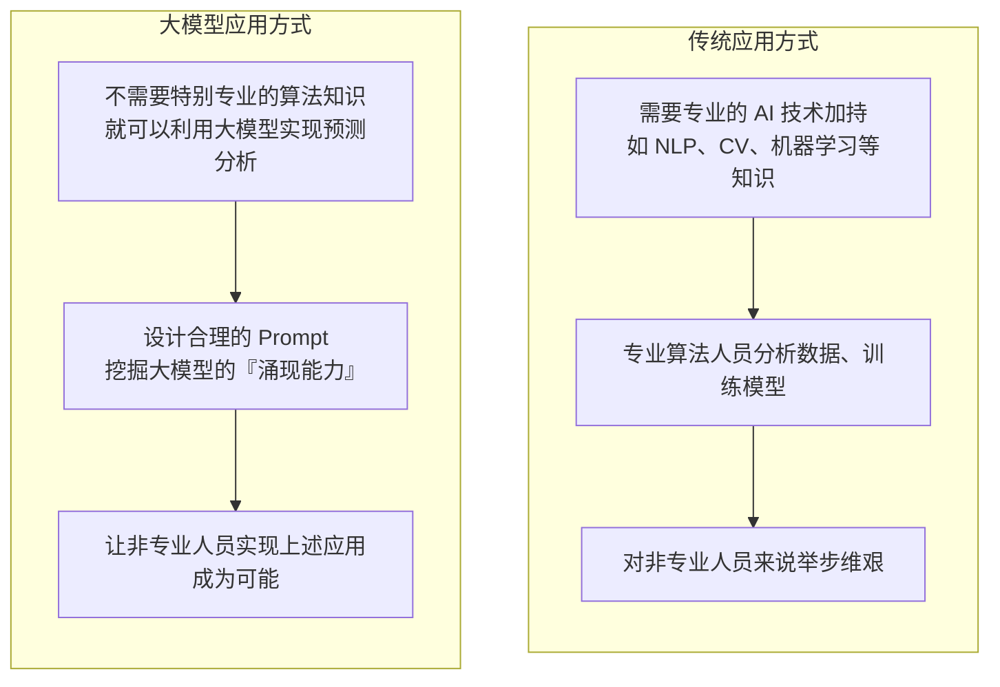
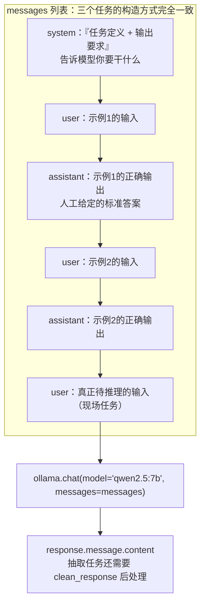
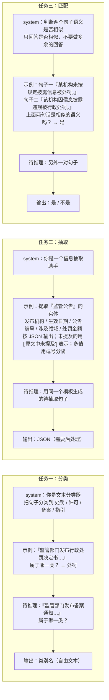
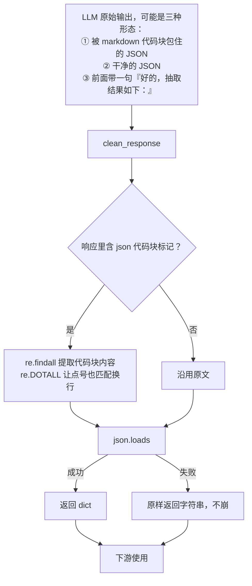
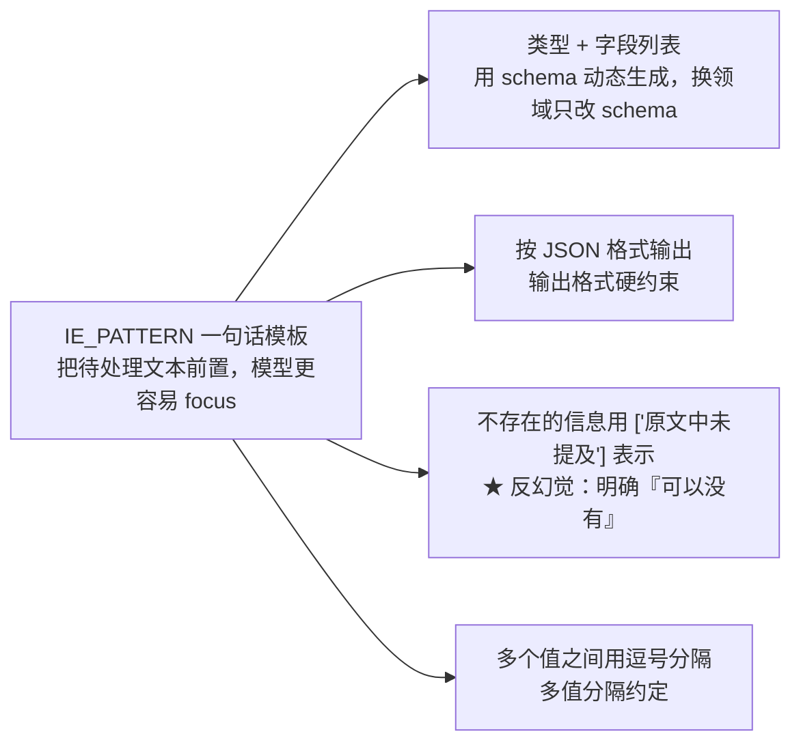

# 项目实战笔记 07：监管公告分类与信息抽取

> **一句话总结**：不训练任何模型，只用"系统提示 + Few-shot 示例 + 输出格式约束"三件套，让一个 7B 通用大模型同时干好监管公告分类、结构化信息抽取和语义匹配三项任务——代价是要为每一项任务精心设计 Prompt 和输出后处理。
> **前置知识**：In-context Learning / Zero-shot / Few-shot 的基本概念、Chat 模型的 `messages` 结构（system / user / assistant）、JSON 与正则表达式、Ollama 本地模型调用。

> 1. 用 `[system] + [user/assistant 交替的示例] + [user 待推理输入]` 的结构为任意分类/抽取/匹配任务构造 Prompt；
> 2. 把非结构化的监管公告文本稳定地抽成 JSON，并写出能容忍模型"多说废话"的后处理；
> 3. 判断一个 NLP 任务该用"提示工程"还是该"训模型"，并说清依据。

## 1. 项目目标与业务背景

### 1.1 业务背景

监管领域每天产生海量文本：行政处罚决定书、行政许可决定、备案通知、行业指引、监管问答。要从这些文本里提取决策依据，传统做法需要 NLP/CV 专业算法团队去标注数据、训练模型：



**读图要点**：

| 观察 | 含义 |
| --- | --- |
| 两条链路的前两步都在做同一件事：把业务语义翻译给机器 | 差别只在"翻译"的载体——传统路线要标数据训模型，新路线要用 Prompt 描述任务 |
| 卡点位置不同 | 传统路线卡在 `T2`（必须有算法人员），新路线卡在 `L2`（Prompt 设计得好不好） |
| 终点差别是"谁能参与" | 传统路线把非专业人员挡在门外，新路线让他们能直接迭代；这正是本章的选题动机 |
| 新路线并非零门槛 | 门槛从"会训练模型"换成了"会写 Prompt、会做输出后处理"，后文的三个任务都在解决这件事 |

这个对比是本章的核心动机：**监管业务人员最懂业务语义，但不一定懂模型训练**。如果能通过设计 Prompt 让通用大模型理解"什么叫监管公告分类"，业务人员就可以自己把 AI 用起来。

### 1.2 三个任务

| 任务 | 业务价值 | 输入 | 期望输出 |
| --- | --- | --- | --- |
| **监管公告分类** | 识别公告类型（处罚、许可、备案、指引） | 一段监管公告文本 | 类别名 |
| **监管信息抽取** | 自动提取实体（发布机构、生效日期、涉及领域、处罚金额），替代人工录入 | 一段监管公告 | JSON |
| **监管文本匹配** | 信息检索与过滤，匹配相关监管信息，提供准确搜索结果 | 两个句子 | "是" / "不是" |

三者恰好覆盖了 NLP 的三种基本形态：**分类（离散标签）、抽取（结构化输出）、匹配（关系判断）**。学会这三个 Prompt 模板，可以迁移到绝大多数"文档理解"类任务上。

### 1.3 方法选择

```text
模型：Qwen2.5:7b（本项目用 Ollama 本地调用）
 原使用 ChatGLM-6B（需 13G 显存，可量化加载）
方法：In-context Learning
 Zero-shot → 只给任务说明，不给例子
 Few-shot → 给任务说明 + 几个"输入→正确输出"的示例
```

## 2. 技术架构

### 2.1 In-context Learning 的核心结构

三个任务的 Prompt 构造方式**完全一致**，只是内容不同。理解了这个骨架，三个任务就是填空题：



**读图要点**：

| 观察 | 含义 |
| --- | --- |
| `system` 只出现一次，位置在最前 | 它讲的是"规则"（你是谁、输出什么格式），对整段对话持续生效 |
| `user` / `assistant` 严格成对交替 | 模型是靠"续写对话"工作的，成对示例就是在演示"这道题该怎么作答" |
| 真正的任务 `Q` 与示例同构 | 待推理输入的句式必须与示例逐字一致，否则模式匹配失效——这是 Few-shot 的第一条铁律 |
| 所有示例都是**推理时**的上下文 | 不改变任何模型参数，代价是每次调用都要重传一遍示例，token 成本随示例数线性增长 |

**为什么 `assistant` 的内容要人工写**：模型在生成时是"续写这个对话"。当它看到历史上出现过多组"用户提问 → 助手规范作答"的模式，它就会模仿这个格式继续作答。**示例里 `assistant` 的部分是"用示例教格式"，`system` 的部分是"用文字讲规则"**，两者配合才能既约束内容又约束格式。

这就是 Few-shot 的本质：**不是教模型知识，而是教模型"这道题的答题格式和思路"**。

### 2.2 三个任务的 Prompt 对比



**读图要点**：

| 观察 | 含义 |
| --- | --- |
| 三条链的形状完全一样，只有内容不同 | 学会这一个骨架，分类 / 抽取 / 匹配就是往模板里填空 |
| `system` 里封闭集合的写法不同 | 分类要列出全部类别，抽取要列出字段 schema，匹配只有两个选项所以不列 |
| 输出格式约束的强弱不同 | 抽取最强（要 `json.loads`）、匹配次之（防啰嗦）、分类最弱（人类能读懂即可） |
| 规律：**输出越是要给程序消费，格式约束就越严** | 抽取的输出要喂给下游，所以"未提及怎么表示""多值怎么分隔"都必须写进 Prompt |
| `示例` 节点同时约束了思路与格式 | 这是 Few-shot 与 Zero-shot 的分水岭：示例教的不是知识，而是这道题的作答方式 |

**三处关键设计差异**：

| | 分类 | 抽取 | 匹配 |
| --- | --- | --- | --- |
| system 里的"类别"信息 | 必须列出所有类别 | 必须列出所有要抽的字段 + schema | 不需要，只有两个选项 |
| 输出格式约束 | 弱（只要输出类别名） | **强**（明确要求 JSON、未提及怎么表示、多值怎么分隔） | 中（"不要做多余的回答"） |
| 为什么这么设计 | 类别少、封闭，模型不容易跑偏 | 输出要喂给下游程序，格式必须可解析 | 输出空间只有 2 个值，重点是防止模型"解释一大堆" |

**规律**：**输出越是要给程序消费，格式约束就要越严。** 分类和匹配的输出人类能看懂就行，抽取的输出要 `json.loads`，所以必须把"未提及怎么表示""多值怎么分隔"都写进 Prompt——**这些细节不写，后处理就会一地鸡毛**。

### 2.3 抽取任务的后处理流程

这一节把"模型输出"到"程序可用的 dict"之间的那一步单独画出来：



**读图要点**：

| 观察 | 含义 |
| --- | --- |
| 入口列了三种形态，说明"模型不守格式"是常态而非异常 | 后处理不是补丁，而是这条链路的标准组成部分 |
| 剥代码块标记是独立的判断分支 | 模型最爱的包装就是 markdown 代码块，`re.DOTALL` 不能省——JSON 里有换行 |
| 出口有两条：dict 或字符串 | 这是最值得警惕的一处设计：调用方拿到的东西类型不定，每次都得判类型 |
| 失败分支"不崩"是优点也是隐患 | 程序不中断，但"失败"被伪装成"另一种成功"，更干净的做法是抛异常或返回统一的错误结构 |

## 3. 关键技术选型与理由

| 方案 | 优点 | 代价 | 本项目为何选它 |
| --- | --- | --- | --- |
| **In-context Learning（提示工程）** | 零训练、零标注、零 GPU（推理除外）；改需求只改 Prompt；业务人员也能参与 | 每次调用都带全部示例，token 成本高；结果不稳定；上下文窗口限制了可给示例数 | 监管任务类别少、schema 固定，用 Prompt 就能描述清楚；不需要标注数据 |
| **训练专用小模型** | 推理快、稳定、便宜 | 要标注数据、要算法团队、需求变更要重训 | **对比方案**。类别多、数据量大、QPS 高时它更合适 |
| **Qwen2.5:7b（Ollama 本地）** | 中文强；数据不出内网；零 API 成本 | 需本机算力；7B 能力弱于云端大模型 | 监管数据敏感，本地部署更可控 |
| ChatGLM-6B（原） | 中文对话能力强，当年国产首选 | 加载需约 13G 显存，须量化才能上消费卡 | 原选择；本项目改用 Ollama 管理更省事 |
| **Few-shot 而非 Zero-shot** | 用示例同时约束"思路"和"格式"，显著提升稳定性 | 增加 Prompt 长度与成本 | 三个任务都有固定输出格式，必须给示例 |
| `class_examples` 字典 | 一个类别配一条典型样例，天然平衡 | 人工挑选，可能不代表真实分布 | 每类给一条，既覆盖所有类别又不让 Prompt 过长 |
| **JSON 作为抽取输出格式** | 结构化、可直接 `json.loads`、能被下游程序消费 | 模型可能加 markdown 包裹或多余文字 | 监管实体抽取的核心价值就在于"能被程序用" |
| **明确"未提及"的表示** | 避免模型编造不存在的字段值 | 需要额外约定 `['原文中未提及']` | 这是**反幻觉**的关键：告诉模型"可以没有" |
| `rich` 库美化终端输出 | 彩色、状态提示、易读 | 多一个依赖 | 本项目要展示清晰的过程输出 |
| `clean_response` 容错后处理 | 解析失败返回原字符串而不是抛异常 | 下游要处理"有时是 dict 有时是 str" | 生产级必须做，但更好的做法是**同时约束 Prompt + 校验 schema** |

### 3.1 提示工程 vs 模型训练：怎么选

| 判断维度 | 倾向提示工程 | 倾向训练模型 |
| --- | --- | --- |
| 标注数据量 | 无 / 极少 | 数万条以上 |
| QPS / 延迟要求 | 低频（离线批处理、人工触发） | 高 QPS、毫秒级延迟 |
| 任务复杂度 | 类别少、schema 固定、语义直白 | 类别多、边界模糊、需要领域知识 |
| 需求变更频率 | 频繁变更（改 Prompt 即可） | 稳定不变 |
| 成本结构 | 按调用付费（token） | 一次性投入 + 低边际成本 |
| 团队能力 | 无算法团队 | 有算法团队 |

**本项目落在左侧全部条件上**，所以提示工程是对的选择。反过来，如果要做一个每天处理 1 亿条公告的分类服务，微调一个小模型（哪怕精度略低）在成本上会碾压调用 LLM。

## 4. 核心实现

### 4.1 任务一：监管公告分类

```text
# regulatory_classify.py
from rich import print
from rich.console import Console
import ollama

# 提供所有类别以及每个类别下的样例
class_examples = {
 '处罚': '监管部门发布行政处罚决定书，某公司因信息披露违规被处以罚款，并责令限期整改。',
 '许可': '监管部门作出准予行政许可的决定，同意该机构开展相关业务，许可事项与条件一并公示。',
 '备案': '该机构已完成产品备案，备案信息在监管平台公示，备案材料齐全有效。',
 '指引': '监管部门发布行业指引，明确业务操作规范与信息披露要求，供各机构参照执行。',
}

def init_prompts:
 """初始化前置 prompt，便于模型做 in-context learning。"""
 class_list = list(class_examples.keys())
 # ① system：定义角色 + 列出全部类别
 pre_history = [{"role": "system",
 "content": f"现在你是一个文本分类器，你需要按照要求将我给你的句子分类到：{class_list}类别中。"}]

 # ② 用"每个类别一条样例"构造 few-shot 对
 for _type, example in class_examples.items():
 pre_history.append({"role": "user",
 "content": f'"{example}"是 {class_list} 里的什么类别？'})
 pre_history.append({"role": "assistant", "content": _type})

 return {'class_list': class_list, 'pre_history': pre_history}

def inference(sentences: list, custom_settings: dict):
 """推理函数。"""
 for sentence in sentences:
 with console.status("[bold bright_green] Model Inference..."):
 # ③ 待推理输入的句式必须与示例完全一致（这是少样本能生效的前提）
 sentence_with_prompt = f""{sentence}"是 {custom_settings['class_list']} 里的什么类别？"
 response = ollama.chat(
 model='qwen2.5:7b',
 messages=[*custom_settings['pre_history'],
 {"role": 'user', "content": sentence_with_prompt}])
 response = response["message"]["content"]
 print(f'>>> [bold bright_red]sentence: {sentence}')
 print(f'>>> [bold bright_green]inference answer: {response}')
 print('*' * 80)
```

**这段代码里最容易被忽略、却最关键的一点**：待推理的句式

```text
f""{sentence}"是 {class_list} 里的什么类别？"
```

与示例里的句式**逐字一致**。

```text
示例 ： "监管部门发布行政处罚决定书…"是 [...] 里的什么类别？
待推理 ： "监管部门发布备案通知…"是 [...] 里的什么类别？
```

模型是靠"模式匹配"来续写的。如果示例是"是 [...] 里的什么类别？"而待推理写成"请判断以下文本属于哪一类："，模型可能就不知道该怎么接——它没在这个句式上被"演示"过。

**这是 Few-shot 的第一条铁律：示例的输入格式必须与真实输入格式严格一致。** 很多"我加了 few-shot 但没效果"的问题就出在这里。

**第二条铁律：示例的 `assistant` 输出必须只包含答案本身。** 这里 `"content": _type` 就是干净的类别名，没有"这句话属于处罚类"，因为……"。如果示例里带了推理过程，模型就会学着输出一堆解释，下游解析就麻烦了。（反过来说，如果任务**需要**推理过程——比如复杂的风险判断——那就应该在示例里带上解析，这是**Chain-of-Thought** 的用法。要不要带，取决于你要不要那个推理过程。）

### 4.2 任务二：监管信息抽取

```text
# regulatory_ie.py
import json, re, ollama

# 定义实体 schema
schema = {'监管公告': ['发布机构', '生效日期', '公告编号', '涉及领域', '处罚金额']}

IE_PATTERN = "{}\n\n提取上述句子中{}的实体，并按照JSON格式输出，上述句子中不存在的信息用['原文中未提及']来表示，多个值之间用','分隔。"

# 提供一些例子供模型参考
ie_examples = {
 '监管公告': [
 {
 'content': '2023-01-10，某机构因业务违规被监管部门作出行政处罚。处罚决定书编号为[EOOE]监罚字〔2023〕12号，罚款金额100万元，违规行为涉及经营业务，该处罚决定自2023-02-01起生效。',
 'answers': {
 '发布机构': ['[EOOE]市监管部门'],
 '生效日期': ['2023-02-01'],
 '公告编号': ['[EOOE]监罚字〔2023〕12号'],
 '涉及领域': ['经营业务'],
 '处罚金额': ['100万元'],
 }
 }
 ]
}

def init_prompts:
 ie_pre_history = [{"role": "system", "content": "你是一个信息抽取助手。"}]

 for _type, example_list in ie_examples.items():
 for example in example_list:
 sentence = example['content']
 properties_str = ', '.join(schema[_type])
 schema_str_list = f'"{_type}"({properties_str})'
 # 输入用统一的模板生成，保证示例与真实输入格式一致
 sentence_with_prompt = IE_PATTERN.format(sentence, schema_str_list)
 ie_pre_history.append({"role": "user", "content": sentence_with_prompt})
 # 输出用 json.dumps 保证格式规范，且 ensure_ascii=False 保留中文
 ie_pre_history.append({
 "role": "assistant",
 "content": f"{json.dumps(example['answers'], ensure_ascii=False)}"
 })

 return {'ie_pre_history': ie_pre_history}
```

**`IE_PATTERN` 这一行模板是整个抽取任务的骨架**，值得逐句拆：



**读图要点**：

| 观察 | 含义 |
| --- | --- |
| 一句话里塞了四项约定 | 模板短、约束密度高，这是"Prompt 即接口定义"的典型写法 |
| 只有一项是"格式"，其余三项都是"边界约定" | 格式对了但缺失值没约定，下游照样一地鸡毛 |
| `F1` 用 schema 动态拼出来 | 换领域只改 schema 字典，模板本身不动，业务知识和流程代码因此分离 |
| `F3` 是唯一带"反幻觉"性质的一项 | 不说"可以没有"，模型面对缺失字段就会编造、省略 key 或输出 null 三种行为随机发生 |

**"用 `['原文中未提及']` 表示不存在的信息"是这条 Prompt 里最有价值的一句话。** 不写这句，模型面对"这段话里没有处罚金额"的情况会有三种可能行为：

1. 编一个数字出来（最危险）；
2. 直接省略这个 key（下游 `result['处罚金额']` 会 KeyError）；
3. 输出 `null` 或空字符串（还算可接受）。

明确告诉它"可以没有、没有时该怎么写"，就把不确定行为变成了**确定的约定**。这是提示工程里对抗幻觉最实用的手法之一：**不要只说"不要编造"，要给出"不知道时该输出什么"。** 这与 RAG 里"信息不足请联系客服"是同一个思路。

后处理：

```text
def clean_response(response: str):
 """后处理模型输出"""
 if '```json' in response:
 res = re.findall(r'```json(.*?)```', response, re.DOTALL)
 if len(res) and res[0]:
 response = res[0]
 response.replace('、', ',') # ⚠️ 见下方踩坑说明
 try:
 return json.loads(response)
 except Exception:
 return response # 解析失败就原样返回，不让程序崩
```

推理时动态构造 schema：

```python
def inference(sentences: list, custom_settings: dict):
    for sentence in sentences:
        cls_res = "监管公告"
        if cls_res not in schema:
            print(f'The type model inferenced {cls_res} which is not in schema dict, exited.')
            exit
            properties_str = ', '.join(schema[cls_res])
            schema_str_list = f'"{cls_res}"({properties_str})'
            sentence_with_ie_prompt = IE_PATTERN.format(sentence, schema_str_list)

            messages = [*custom_settings['ie_pre_history'],
            {"role": "user", "content": sentence_with_ie_prompt}]
            response = ollama.chat(model="qwen2.5:7b", messages=messages)
            ie_res = clean_response(response["message"]["content"])
            print(f'sentence: {sentence}')
            print(f'inference answer: {ie_res}')
```

**这段代码里有一个真实的 bug 值得单独说**：

```python
response.replace('、', ',') # ← 这行是无效的！
```

Python 的 `str` 是**不可变对象**，`replace` 返回新字符串而**不修改原对象**。所以这行代码什么也没做。正确写法是：

```python
response = response.replace('、', ',')
```

这个 bug 不会报错、不会崩，只是"本来想做的中文顿号替换悄悄失效了"。**这是 Python 新手最经典的一类错误**，也是为什么"代码能跑"和"代码正确"是两件事。修法很简单，但它揭示了一个更重要的教训：**任何一个不做任何事、也不报错的语句，都值得怀疑**。

### 4.3 任务三：监管文本匹配

```text
# regulatory_text_matching.py
from rich import print
import ollama

# 提供相似、不相似的语义匹配例子
examples = {
 '是': [
 ('某机构未按规定披露信息被处罚。', '该机构因信息披露违规被行政处罚。'),
 ],
 '不是': [
 ('监管部门发布行政处罚决定书。', '行业协会举办年度技术交流会。'),
 ('监管部门发布备案指引。', '某公司发布新款手机。')
 ]
}

def init_prompts:
 pre_history = [{"role": "system",
 "content": "现在你需要帮助我完成文本匹配任务，当我给你两个句子时，你需要回答我这两句话语义是否相似。只需要回答是否相似，不要做多余的回答。"}]

 for key, sentence_pairs in examples.items():
 for sentence_pair in sentence_pairs:
 sentence1, sentence2 = sentence_pair
 pre_history.append({"role": "user",
 "content": f'句子一: {sentence1}\n句子二: {sentence2}\n上面两句话是相似的语义吗？'})
 pre_history.append({"role": "assistant", "content": key})

 return {'pre_history': pre_history}

def inference(sentence_pairs: list, custom_settings: dict):
 for sentence_pair in sentence_pairs:
 sentence1, sentence2 = sentence_pair
 sentence_with_prompt = f'句子一: {sentence1}\n句子二: {sentence2}\n上面两句话是相似的语义吗？'
 response = ollama.chat(model="qwen2.5:7b",
 messages=[*custom_settings["pre_history"],
 {"role": 'user', "content": sentence_with_prompt}])
 print(f'sentence_pair:{sentence_pair}')
 print(f'inference answer: {response["message"]["content"]}')
```

**示例的分布设计值得注意**：`'是'` 给了 1 例，`'不是'` 给了 2 例。这种**非均衡的示例分布**会带来一个风险——模型可能偏向输出"不是"。

**Few-shot 的第二类坑：示例的类别分布会影响输出倾向。** 如果两个类别的示例数量差很多，或者某类示例的写法更有代表性，模型会偏向那一类。实践中应该：

- 让每个类别的示例数量尽量均衡（1:1 或 2:2）；
- 示例的顺序也建议打乱，避免"最后一组示例"对输出产生过强影响（这叫 **recency bias**，LLM 对 Prompt 尾部的信息更敏感）。

`sentence_with_prompt` 的拼接方式：

```python
f'句子一: {sentence1}\n句子二: {sentence2}\n上面两句话是相似的语义吗？'
```

注意这里用了 `\n` 而不是逗号分隔。**在 Prompt 里用换行做结构化分隔**（而不是把内容串成一行）是个好习惯：它让每一段信息在 token 层面更清晰，模型更容易分辨"哪部分是句子一、哪部分是句子二、哪部分是问题"。对于 `sentence1` 里本身可能含逗号/句号的中文文本，换行分隔尤其重要。

### 4.4 三个任务的共性提炼

把三个文件放在一起看，可以提炼出一份**通用的 Prompt 构造检查清单**：

```text
□ system 里说清楚"你是谁" + "要做什么" + "输出格式要求"
□ 列出所有封闭集合（分类的类别列表 / 抽取的字段 schema）
□ 给每个类别/字段至少一个示例，且示例数量均衡
□ 示例的 user 句式与真实输入的句式逐字一致
□ 示例的 assistant 内容格式与期望的真实输出格式完全一致
□ 明确"没有的信息该怎么表示"（反幻觉的关键）
□ 明确"多值怎么分隔"
□ 明确的输出长度/格式禁止项（如"不要做多余的回答"）
```

**这八条能覆盖大部分"我的 Prompt 效果不稳定"的问题。** 每次模型输出不符合预期，就逐条对照检查，通常能在前三条里找到原因。

## 5. 踩坑与解决

| 现象 | 根因 | 解决 | 如何预防 |
| --- | --- | --- | --- |
| 加了 few-shot 但效果没提升 | 待推理输入的句式与示例句式不一致，模型没"见过"这种问法 | 让待推理的 `sentence_with_prompt` 与示例用**同一个模板函数**生成 | 把句式抽成模板常量（如 `IE_PATTERN`），示例和推理都从它 `format` 出来，从代码层面杜绝不一致 |
| 抽取结果 `json.loads` 频繁失败 | 模型输出被 ` ```json ``` ` 包裹，或前面带了"好的，抽取结果如下：" | `clean_response` 用 `re.findall(r'```json(.*?)```', resp, re.DOTALL)` 提取代码块 | Prompt 里明确"**只**输出 JSON，不要任何额外文字"；后处理仍要保留兜底 |
| 模型给"原文中没有"的字段编了一个值 | Prompt 没有约定"缺失时怎么表示" | 加 `上述句子中不存在的信息用['原文中未提及']来表示` | **反幻觉的标准手法：不只说"不要编"，还要给"不知道时的输出约定"** |
| 中文顿号替换不生效 | `response.replace('、', ',')` 返回新字符串，原对象不变（`str` 不可变） | `response = response.replace('、', ',')` | 任何"调用方法后没有赋值"的语句都该被怀疑；静态检查工具（如 `flake8` 的 B018）能扫出这类无效表达式 |
| 模型输出一大段解释而不是结论 | 示例的 `assistant` 内容里带了推理过程 | 让示例输出只包含答案本身 | 要不要推理过程，取决于下游是否需要——要的话学 CoT 的写法，不要的话示例里就别给 |
| 匹配任务总是倾向某一个答案 | 示例的类别分布不均衡（1 个"是"对 2 个"不是"） | 让每个类别的示例数量均衡；打乱示例顺序 | Few-shot 示例的数量分布和顺序都会影响输出倾向，要当超参数对待 |
| 类别变多了以后 Prompt 太长、调用变慢变贵 | 每个类别塞一条长示例，类别数一多 Prompt 就爆炸 | 减少每类的示例长度；或改用"详细描述类别 + 只给 2-3 个代表性示例" | Prompt 长度直接等于成本与延迟，类别数扩展前要算一下 token 预算 |
| 换一个新领域就要改一堆代码 | 类别名、schema、示例都硬编码在文件顶部 | 抽成配置（JSON/YAML），代码只读配置 | 把"业务知识"（类别、字段、示例）和"流程代码"分离 |
| 同一输入两次调用结果不一样 | 模型默认有采样随机性（temperature > 0） | 分类/抽取/匹配这类确定性任务把 `temperature` 设为 0 | **判别类任务一律 temperature=0**；生成类任务才需要它 |
| 上游改了一个类别名，下游全崩 | 输出的是自由文本类别名，没有做白名单校验 | 拿到输出后校验是否在 `class_list` 里，不在则走兜底 | 自由文本输出必须在**进入业务逻辑前**做白名单/schema 校验 |
| 模型的输出不能直接被程序消费 | 输出格式只做了"期望"，没做"约束" | Prompt 强约束 + 后处理容错 + 失败降级三管齐下 | 只要下游是程序，就必须假设"模型一定会偶尔不守格式" |

## 6. 可复用经验

1. **Few-shot 的本质是"教格式"，不是"教知识"。** 模型的知识来自预训练；Prompt 里的示例是用来**演示这道题该怎么作答**的。所以示例的句式、输出格式、详略程度，比示例的内容是否典型更重要。这解释了为什么"示例句式必须与真实输入一致"是第一条铁律。
2. **对抗 LLM 幻觉的通用手法：给出"不知道时的输出约定"。** 不要只说"不要编造"，要说"如果没有这个信息，就输出 XXX"。确定了缺失时的表示，就把"模型自己发挥"变成了"按约定填写"。RAG 里对应的是"信息不足请联系人工客服电话 XXX"，这里是 `['原文中未提及']`——同一个思想的两个实例。
3. **输出越是给程序消费，格式约束就越要严。** 人看的输出可以有弹性，机器的输入不行。而且约束要分三层：Prompt 里说清 → 后处理容错 → 下游校验兜底。**只做其中一层都会在生产环境翻车。**
4. **判别类任务把 `temperature` 设为 0。** 分类、抽取、匹配都不需要创造性，只要确定性。这一点在代码里常常被忘掉（默认值通常大于 0）。
5. **把"业务知识"从代码里抽出来。** 类别列表、字段 schema、示例文本，这些都是业务人员能维护的东西。写成配置文件，业务就能自己迭代 Prompt；写死在 Python 里，每次调整都要找开发。**这是提示工程类项目能否真正落地的分水岭。**
6. **判断"提示工程还是训模型"要看六个维度**：标注数据量、QPS/延迟、任务复杂度、需求变更频率、成本结构、团队能力。**没有绝对的优劣，只有场景匹配。** 能清晰地讲出"我这个场景为什么选了提示工程"，比会说"提示工程很先进"更有价值。
7. **写代码时警惕"有效但无用"的语句。** `response.replace(...)` 不赋值就是这类。它们不报错、不崩溃，只是静静地什么都不做。养成"每个语句都要产生效用"的习惯，能避免大量静默 bug——在 LLM 项目里尤其重要，因为 LLM 本来就有不确定性，你不希望再叠加人为的静默失效。

## 7. 面试问答

<details markdown="1">
<summary markdown="1"><b>Q1：Few-shot 和 Zero-shot 有什么区别？你的示例是怎么设计的？</b></summary>

**概念上的区别**：

- **Zero-shot**：只给任务说明，不给任何示例。比如 system 里写"你是一个文本分类器，把句子分类到 [A, B, C]"，然后直接给待分类句子。依赖模型"看懂任务描述"的能力。
- **Few-shot**：在任务说明之外，额外给几组"输入 → 正确输出"的示例，让模型通过模式匹配学会这道题的答题方式。示例不改变模型参数，只在**推理时**作为上下文（这就是 In-context Learning，上下文学习）。

**我项目里的示例设计，三条原则**：

**一、示例的输入句式与真实输入逐字一致。** 分类任务里，示例用

```python
f'"{example}"是 {class_list} 里的什么类别？'
```

待推理也用

```python
f'"{sentence}"是 {class_list} 里的什么类别？'
```

抽取任务里更彻底——示例和真实输入都从同一个 `IE_PATTERN.format(...)` 生成。**这样从代码层面就无法出现句式不一致**。很多"加了 few-shot 没效果"的问题就出在句式对不上。

**二、示例的输出只包含答案本身，不带解释。** 分类示例的 `assistant` 就是 `"处罚"` 一个词，不是"这句话属于处罚类，因为它提到了股市震荡..."。这样模型也会输出干净的类别名，下游不用做文本清洗。

反过来说，如果任务**需要**推理过程（比如判断复杂的监管风险等级，需要看模型的推理链是否合理），那就应该在示例里带上分步推理——这就是 **Chain-of-Thought** 的用法。**要不要带推理过程，是一个设计决策，取决于下游需不需要它。**

**三、示例的类别分布要均衡。** 我的文本匹配任务里有 1 个"是"样例、2 个"不是"样例，这其实**有偏向"不是"的风险**。严格来说应该 2:2，或者至少打乱顺序。LLM 对 Prompt 尾部的信息更敏感（recency bias），最后一组示例的影响会偏大。

**Few-shot 的代价**：每个示例都要占 token，示例越多 Prompt 越长，成本和延迟越高；而且上下文窗口有限，类别一多就放不下。所以实践中常见做法是"详细描述类别 + 只给 2-3 个最有代表性的示例"，而不是"每个类别塞一条长示例"。

**什么时候 Zero-shot 就够了**：任务非常常见（情感分析、翻译）、类别名自解释性强、模型足够大。这时候加示例反而浪费 token。

</details>

<details markdown="1">
<summary markdown="1"><b>Q2：信息抽取的输出格式怎么保证能被程序解析？</b></summary>

我用**三层防护**，缺一层都会在生产上出问题。

**第一层：Prompt 层强约束。** 模板里把三件事都写明：

```python
IE_PATTERN = "{}\n\n提取上述句子中{}的实体，并按照JSON格式输出，上述句子中不存在的信息用['原文中未提及']来表示，多个值之间用','分隔。"
```

- **"按照 JSON 格式输出"** —— 格式目标；
- **"不存在的信息用 `['原文中未提及']` 表示"** —— 这是**反幻觉的关键**。不写这句，模型面对缺失字段会编造、会省略 key、会输出 null，三种行为都不可控；
- **"多个值之间用 `','` 分隔"** —— 明确多值约定。

另外在示例里，`assistant` 的内容用 `json.dumps(example['answers'], ensure_ascii=False)` 生成，保证示例的输出**就是一个合法的 JSON 字符串**（而不是手写的、可能有语法错的伪 JSON）。`ensure_ascii=False` 让中文直接显示，模型更容易模仿。

**第二层：后处理容错。** 模型几乎必然会有"多说一句"的时候：

```text
def clean_response(response: str):
 if '```json' in response:
 res = re.findall(r'```json(.*?)```', response, re.DOTALL)
 if len(res) and res[0]:
 response = res[0]
 try:
 return json.loads(response)
 except Exception:
 return response # 解析失败不崩，原样返回
```

用 `re.DOTALL` 是因为 JSON 里有换行，默认的 `.` 不匹配换行符。这是个容易忘的细节。

**第三层：schema 校验（我这段代码缺的，应该补上）。** 现在只有"能解析成 JSON"就返回了，但没有校验**字段是否齐全、类型是否正确**。生产环境应该：

```python
def validate(result, schema):
    if not isinstance(result, dict):
        raise ValueError("输出不是 JSON 对象")
    for field in schema['监管公告']:
        if field not in result:
            result[field] = ['原文中未提及'] # 补默认值而不是报错
            if not isinstance(result[field], list):
                result[field] = [result[field]] # 统一成 list
                return result
```

**更好的做法是跳过"自由文本 + 后处理"这条路，直接用结构化输出能力。** 现在主流模型都支持 **Function Calling / JSON Mode / Structured Output**：给一个 JSON Schema，由解码器保证输出一定符合 schema，语法层面就不可能出错。这比"事后正则+json.loads"可靠得多。

**最后一点**：`clean_response` 在解析失败时返回**字符串**而不是 dict，这带来一个隐患——调用方拿到的东西可能是 dict 也可能是 str，必须每次都判断类型。更干净的做法是**失败时抛异常或返回统一的错误结构**，让"失败"成为一个显式状态，而不是伪装成"另一种成功"。这行代码其实违反了本节 Q1 里讲的"给缺失一个明确约定"的原则。

</details>

<details markdown="1">
<summary markdown="1"><b>Q3：什么时候该用提示工程，什么时候该训一个模型？</b></summary>

我会按**六个维度**来判断，而不是凭"哪个更先进"。

| 维度 | 提示工程 | 训练模型 |
| --- | --- | --- |
| **标注数据** | 0 到几十条 | 数万条以上 |
| **QPS / 延迟** | 低频（离线批处理、人工触发、日均千次以内） | 高 QPS（每秒数百次以上）、要求毫秒级 |
| **任务复杂度** | 类别少、schema 固定、语义直白 | 类别多（几十上百）、边界模糊、需要深层领域知识 |
| **需求变更频率** | 频繁（改 Prompt 就能上线） | 稳定（模型训一次用一年） |
| **成本结构** | 按 token 付费，随调用量线性增长 | 一次性投入（标注 + 训练），边际成本近乎为零 |
| **团队能力** | 无算法团队，业务人员也能参与 | 有算法团队，能承担数据与训练工程 |

**我这个项目落在提示工程这一侧的全部条件上**：监管任务类别只有 4 个、schema 只有 5 个字段；没有标注数据；是离线批处理而不是高并发服务；原的动机就是"让不需要专业算法知识的人也能用起来"。所以用提示工程是对的。

**反过来，什么情况我会毫不犹豫地选训练模型**：做一个每天处理 1 亿条公告的分类服务。假设每次调用 1000 token、按云端定价，一天的成本是相当可观的数字；而微调一个 BERT 系小模型，精度可能只低 2-3 个百分点，但推理成本低两三个数量级，还能把延迟压到毫秒级。**在这个规模上，"省下来的钱"远比"高出的那点精度"重要。**

**还有第三条路，也是实践中经常最优的：两者结合。**

- **用小模型做粗筛，LLM 做精判。** 比如先用 BERT 把明显无关的公告过滤掉（召回导向、可以容忍高误报），再用 LLM 对剩下的少量候选做精细分类和抽取。这样把 LLM 的调用量降一到两个数量级，同时保留它的理解能力。
- **用 LLM 造训练数据。** 拿提示工程跑一批数据 → 人工抽检修正 → 作为标注数据训练小模型。这是当下很流行的**知识蒸馏**路径：用大模型的"标注能力"换取小模型的"推理效率"。本项目里那 4 个类别的示例，其实就可以用这个思路扩成几百条训练数据。
- **用提示工程快速验证业务价值，再决定是否投入训练。** 先用 Prompt 两周做出一个能跑的 Demo，拿给业务方看效果、确认需求，再决定要不要投入标注和训练。这比一上来就组队标注数据、训三个月模型、最后发现需求理解错了要划算得多。

**一句话总结我的判断逻辑**：**先看规模和变更频率定成本结构，再看数据量和任务复杂度定可行性，最后优先用提示工程验证价值、用训练优化成本。** 技术选型的顺序是"先证明值得做，再优化做得便宜"，而不是反过来。

</details>

## 8. 延伸阅读

- 《Language Models are Few-Shot Learners》（GPT-3 论文）：In-context Learning 的原始论述
- 《Chain-of-Thought Prompting Elicits Reasoning in Large Language Models》：什么时候该在示例里带推理过程
- 《Exploiting Cloze Questions...》（PET）：把分类任务改写成完形填空，与本篇形成对照
- Ollama 官方文档：`ollama.chat` 的 `messages` 结构与参数（`temperature` 等）
- OpenAI / Qwen 等厂商的 **Structured Outputs / Function Calling** 文档：替代"正则+json.loads"的可靠方案
- 本仓库同目录：[06-项目-电商评论分类（BERT+PET与P-Tuning）](06-项目-电商评论分类（BERT+PET与P-Tuning）.md)（"训模型"路线的对照）、[08-项目-新闻文本分类三方案对比](08-项目-新闻文本分类三方案对比（随机森林FastTextBERT）.md)
- 配套代码：`regulatory_classify.py`、`regulatory_ie.py`、`regulatory_text_matching.py`

---
[⬅️ 返回本目录索引](README.md)
