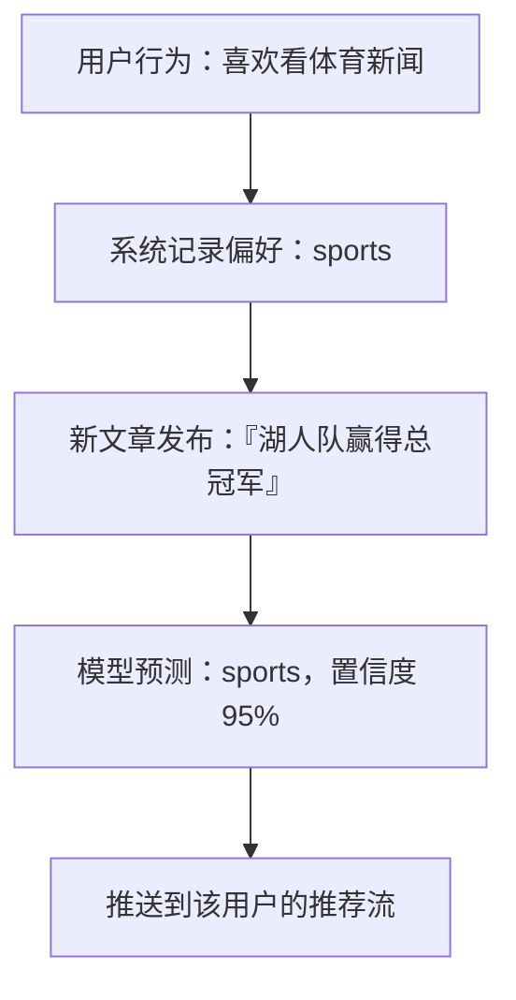
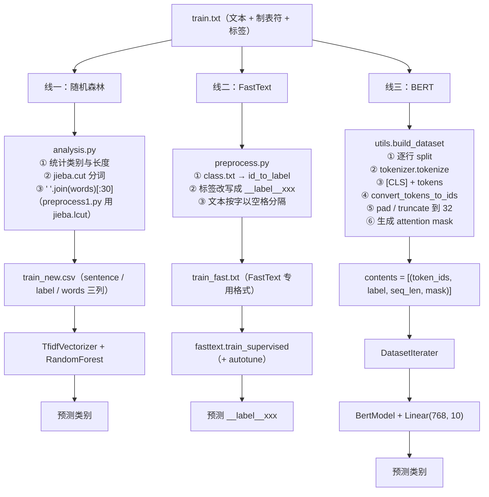
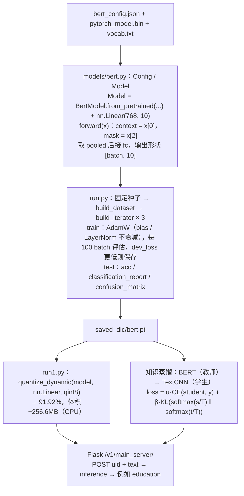
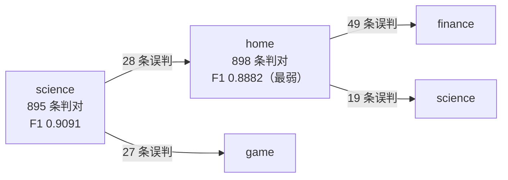

# 项目实战笔记 08：新闻文本分类三方案对比（随机森林 / FastText / BERT）

> **一句话总结**：同一个 THUCNews 风格新闻 10 分类任务（18 万训练样本）跑三条技术路线——TF-IDF + 随机森林 81.48%、FastText 91.72%、BERT 93.64%，用真实数字看清"词袋 → 词向量 → 上下文预训练"的能力阶梯，再走完量化与蒸馏的部署优化。
> **前置知识**：TF-IDF 与词袋模型、jieba 分词、`sklearn` 的 `TfidfVectorizer` / `RandomForestClassifier`、PyTorch 训练循环、BERT 的 `[CLS]` 与 attention mask。

> 1. 独立完成从原始文本到三个模型可消费格式的全部数据预处理（含字符级与词级两种切分口径）；
> 2. 用四个指标 + 混淆矩阵 + 分类报告对 10 分类模型做出有依据的诊断，而不是只看 accuracy；
> 3. 说清量化与知识蒸馏的原理、收益与代价，并为给定场景选择合适的压缩方案。

## 1. 项目目标与业务背景

### 1.1 业务场景

新闻资讯平台每天要处理**数百万篇新闻**，分类是推荐系统的前置环节：



**读图要点**：

| 观察 | 含义 |
| --- | --- |
| 分类处在"新文章发布"与"推送到推荐流"之间 | 它是推荐链路的一环，因此延迟与吞吐和精度同等重要 |
| 判定单位是**频道**而不是文章内容 | 类别封闭且固定 10 个，任务边界清晰，这是后面三方案可比的前提 |
| 置信度 95% 是被消费的下游信号 | 低置信度样本可以路由给更重的模型或人工，这是分层推理的接口 |
| 这条链路每天要跑百万次 | 单条推理的成本差异会被放大成"1.4 小时"和"50 小时"的差别 |

这个场景的三个特点决定了后文所有选型取向：**量大**（每天百万级，必须算推理成本）、**要实时**（新文章发布后快速上线）、**类别封闭且平衡**（固定 10 个频道，每类 18000 条）。**精度重要，但吞吐和延迟同等重要。**

### 1.2 数据集与关键统计

```text
train.txt 180000 条 | dev.txt 10000 条 | test.txt 10000 条 | class.txt 10 类
格式： 文本 \t 数字标签
```

```text
label → 0 finance 1 realty 2 home 3 education 4 science
 5 society 6 politics 7 sports 8 game 9 fashion

Counter({3:18000, 4:18000, 1:18000, 7:18000, 5:18000,
 9:18000, 8:18000, 2:18000, 6:18000, 0:18000}) ← 严格均衡，每类 10.0%

length_mean = 19.21 length_std = 3.86
```

**这两个统计数字各自决定了一个关键决策**：

- **类别严格均衡** → 所以 `accuracy` 在这里是可信指标。若类别不均衡（某类占 60%），单看 accuracy 会被多数类掩盖，必须看 macro-F1 或每类指标。这是评估时最常踩的坑。
- **平均 19.21 字、标准差 3.86** → BERT 的 `pad_size` 取 32 即可（19.21 + 2×3.86 ≈ 27，覆盖 95% 以上样本）。用 BERT 默认的 512 是巨大浪费：**注意力成本 O(L²)，512 相比 32 是 256 倍计算量。**

**这就是"先做数据分析再写模型"的价值**：一次 20 行的统计脚本，直接决定了后面所有模型的输入长度和成本。

### 1.3 四条路线的对比目标

| 路线 | 代表技术 | 想回答的问题 |
| --- | --- | --- |
| ① 传统机器学习 | TF-IDF + 随机森林 | 不用深度学习的基线在哪？ |
| ② 浅层神经网络 | FastText | 引入词向量和 n-gram 能提升多少？成本几何？ |
| ③ 预训练语言模型 | BERT + 微调 | 上下文建模的精度上限在哪？代价是什么？ |
| ④ 部署优化 | 量化 / 蒸馏 | 怎么在几乎不掉点的前提下把模型变小变快？ |

## 2. 技术架构

### 2.1 一份文本，三种格式

同一个 `train.txt`，三种模型需要的输入完全不同。这是本项目数据工程部分最值得学的点：



**读图要点**：

| 观察 | 含义 |
| --- | --- |
| 同一个源文件分出三条支线 | 每个模型对"什么是 token"的定义不同，所以切分口径必须分开做 |
| 线一先分词、线二按字、线三交给 WordPiece | TF-IDF 的词汇表是词；FastText 的子词机制本就为 OOV 设计；BERT 必须用它自己训好的切分器 |
| 三条支线的产物中间格式都不一样 | 分别是 csv、`__label__` 文本、`(token_ids, label, seq_len, mask)` 元组，这是"模型输入格式由它的 tokenizer 定义"的具体体现 |
| 三条支线在最后才汇到同一件事：预测类别 | 数据管线各不相同，但评价口径统一，三组准确率才可比 |
| 线二的出口带着 `__label__` 前缀 | 这是 FastText 的格式要求，也提醒接口层要做一层转换再对外返回 |

| | 随机森林 | FastText | BERT |
| --- | --- | --- | --- |
| 切分单位 | jieba 词 | 字（或 jieba 词） | BertTokenizer 的 WordPiece |
| 表示 | `"中华 女子 学院 ："` | `"__label__education 中 华 女"` | `[101, 2345, ..., 0, 0]` |
| 长度处理 | 截断到 30 字 | 不限制 | pad/truncate 到 32 |
| 特征 | TF-IDF 稀疏向量 | 词向量 + n-gram | 上下文相关表示 |

**为什么要三份数据**：每个模型对"什么是 token"的定义不同。TF-IDF 的词汇表是**词**，必须 jieba 分词；FastText 的子词机制本就为 OOV 设计，中文按字切分效果更好；BERT 有自己训好的 WordPiece，**绝不能自己分词后再喂给它**——插进去的空格会破坏预训练时的输入分布，表现是"能训、不报错、精度偏低"。

### 2.2 BERT 训练与部署链路

这一节回答的是"一份预训练权重到最后对外提供服务，中间要过哪些环节"：



**读图要点**：

| 观察 | 含义 |
| --- | --- |
| 模型定义只有两行有效代码：`from_pretrained` + 一个 `nn.Linear` | 预训练已经把表示学好了，微调阶段新增的参数极少，所以两轮就能收敛 |
| `SAVE` 之后分成量化与蒸馏两条压缩路线 | 量化不改结构直接瘦身，蒸馏换更小的学生模型，两者可叠加 |
| 两条压缩路线汇到同一个服务入口 | 服务接口与模型实现解耦，换后端不用改调用方 |
| 训练环节特别标注了"固定种子" | 方案对比实验里，没有固定种子时"提升"可能只是随机波动 |
| 出口返回的是 `education` 而不是 `__label__education` | 与 FastText 支线对比可见：模型输出的原始格式必须在接口层转换掉 |

## 3. 关键技术选型与理由

| 方案 | 优点 | 代价 | 本项目为何选它 |
| --- | --- | --- | --- |
| **jieba + TF-IDF** | 无监督、无需训练；IDF 天然抑制"的/了"这类高频噪声 | 词袋丢词序；对同义词不敏感；维度高 | 随机森林的前提，也是所有传统文本分类的起点 |
| **RandomForestClassifier** | 训练快、可并行、可解释（`feature_importances_`）、无需 GPU、不用调参 | 无法理解语义；对语序不敏感 | **做基线**：先拿到 80 分可用模型，后面所有改进都有对比参照 |
| **FastText** | 训练秒级；词向量 + n-gram 引入局部词序；子词机制对 OOV 鲁棒；模型小、推理极快 | 句子表示是词向量平均，本质仍是词袋 | 精度与成本之间的平衡点，工业性价比最高 |
| FastText **按字切分** | 无需分词器；子词能学字的组合；避免分词错误传播 | 序列变长 | 中文短文本实测优于按词切分（91.65% vs 90.93%） |
| FastText `wordNgrams=2` | 捕捉 bigram（"湖人队"），补回局部词序 | 特征空间与模型变大 | 单字切分下 n-gram 是必需的 |
| FastText **autotune** | 验证集上随机搜索超参，免人工调参 | 需独立验证集和时间预算 | `autotuneValidationFile` + `autotuneDuration` 一条命令完成 |
| **BERT-base-chinese** | 12 层双向 Transformer，上下文相关表示，精度领先 | 110M 参数，需 GPU；182ms/条，比 FastText 慢约 38 倍 | 追求精度上限，也为了量化"精度提升的代价有多大" |
| `pad_size=32` | 与数据分布匹配 | 长尾（>32 字）被截断 | 注意力 O(L²)，512 是 256 倍浪费 |
| **分层权重衰减** | 与 BERT 原论文微调配置一致，训练更稳 | 代码稍复杂 | 标准做法，照做 |
| **动态量化 int8** | 体积 −257MB；CPU 加速；精度仅降 1.72 点 | 须在 CPU 做；精度有损；GPU 上可能更慢 | 部署到 CPU 的低成本方案 |
| **知识蒸馏** | 学生又小又快，还能通过软标签学到类间关系 | 需先训教师；双分支 loss + 温度调参 | "既要精度又要速度"的标准解法 |
| **固定随机种子** | 实验可复现、结果可比 | 略牺牲最终精度 | 做方案对比实验的前提——否则"提升"可能只是噪声 |

### 3.1 实测结果

| 模型 | 准确率 | 训练成本 | 单条推理 | 说明 |
| --- | --- | --- | --- | --- |
| TF-IDF + 随机森林 | **81.48%** | 分钟级，CPU | 低 | 基线，快速拿到可用模型 |
| FastText（字 + bigram） | **91.65%** | 秒级，CPU | ~5ms | 相比基线 +10.2 点，成本几乎没增加 |
| FastText（autotune 100s） | **91.72%** | 秒级 + 调参 100s | ~5ms | 自动调参只提升 0.07 点 |
| FastText（jieba 词 + bigram） | **90.93%** | 秒级，CPU | ~5ms | **换切分口径反而降了 0.79 点** |
| BERT-base 微调 | **93.64%** | 小时级，需 GPU | ~182ms | 相比 FastText +1.92 点 |
| BERT 动态量化 int8 | **91.92%** | 一次性 | CPU 加速 | 相比 FP32 −1.72 点，体积 −257MB |

**这张表里三个最值得说清的结论**：

**（1）81% → 91% 的跃升来自"引入稠密词向量"。** TF-IDF 是稀疏正交特征——"足球"和"篮球"是两个完全正交的维度，内积为 0，模型眼里毫无关系；FastText 的稠密词向量让语义相近的词在空间中靠近。**这 10 个点是质变，比后面 91% → 93.6% 的 1.9 点更有方法论意义。**

**（2）FastText → BERT 只有 1.92 点，但推理慢了约 38 倍。**

```text
按每天 100 万条算：
FastText: 1,000,000 × 5ms = 5,000 秒 ≈ 1.4 小时
BERT : 1,000,000 × 182ms = 182,000 秒 ≈ 50 小时
```

**用 38 倍算力换 1.92 个点**。对"分错也只是推荐流里混一条不相关新闻、还有 CTR 反馈兜底"的场景，这笔账不划算。

**（3）换切分口径（字→词）反而降了 0.79 点。** 中文按字 + bigram 能通过 n-gram 学到有意义的字组合，且**没有分词错误的风险**——jieba 一旦分错（"传郭晶晶欲落户香港" 分成 `郭 庄子`），错误就不可逆地传播。**短文本分类上，"按字 + n-gram"往往比"分词"更稳。**

### 3.2 量化 vs 蒸馏

| | 量化 | 蒸馏 |
| --- | --- | --- |
| 做什么 | float32 权重压成 int8 | 大模型知识迁移到小模型 |
| 模型结构 | **不变** | **改变**（换成更小的学生模型） |
| 精度损失 | 小（93.64% → 91.92%） | 取决于学生容量 |
| 速度提升 | 中等（CPU 明显，GPU 可能变慢） | 大（学生本身就小） |
| 实施成本 | 一行 `quantize_dynamic` | 需先训教师 + 设计蒸馏 loss |
| 适用 | 不能换架构、只需压缩 | 可换架构、追求极致性价比 |

**一句话记忆**：**量化是"把同一个模型变瘦"，蒸馏是"换一个更小的模型，但让它继承大模型的判断力"。** 两者可叠加（先蒸馏再量化）。

## 4. 核心实现

### 4.1 数据预处理：三条支线的关键代码

```python
# 线一：随机森林（analysis.py 精简）——统计 + jieba 分词 + 存 csv
content = pd.read_csv('./data/data/train.txt', sep='\t')
count = Counter(content.label.values())
content['sentence_len'] = content['sentence'].apply(len)
length_mean, length_std = np.mean(content['sentence_len']), np.std(content['sentence_len'])

def cut_sentence(s): return list(jieba.cut(s))
content['words'] = content['sentence'].apply(lambda s: ' '.join(cut_sentence(s)))
content['words'] = content['words'].apply(lambda s: ' '.join(s.split())[:30])
content.to_csv('./data/data/train_new.csv')
```

```python
# 线二：FastText（preprocess.py 精简）——转成 __label__ 格式
id_to_label = {}
with open('class.txt', 'r', encoding='utf-8') as f1:
    for idx, line in enumerate(f1.readlines()):
        id_to_label[idx] = line.strip()

        train_data = []
        with open('train.txt', 'r', encoding='utf-8') as f2:
            for line in f2.readlines():
                sentence, label = line.strip.split('\t')
                new_label = '__label__' + id_to_label[int(label)]
                sent_char = ' '.join(list(sentence)) # 按字（preprocess1.py 用 jieba.lcut 按词）
                train_data.append(new_label + ' ' + sent_char)
```

```python
# 线三：BERT（utils.build_dataset 精简）
def load_dataset(path, pad_size=32):
    contents = []
    with open(path, "r", encoding="UTF-8") as f:
        for line in tqdm(f):
            lin = line.strip()
            if not lin: continue
            content, label = lin.split("\t")
            token = config.tokenizer.tokenize(content) # ★ 用 BERT 自己的 tokenizer
            token = [CLS] + token
            seq_len = len(token)
            token_ids = config.tokenizer.convert_tokens_to_ids(token)
            if pad_size:
                if len(token) < pad_size:
                    mask = [1] * len(token_ids) + [0] * (pad_size - len(token))
                    token_ids += [0] * (pad_size - len(token))
                else:
                    mask = [1] * pad_size
                    token_ids, seq_len = token_ids[:pad_size], pad_size
                    contents.append((token_ids, int(label), seq_len, mask))
                    return contents
```

**三处值得单独指出的细节**：

1. **`' '.join(s.split())[:30]` 截的是字符不是词**。它先拼成字符串再 `[:30]`，实际约保留 10-15 个词。本项目平均 19 字、几乎不触发截断所以无害，但长文本场景下会截出半截词。**更明确的写法是 `words[:30]`。**
2. **FastText 的格式是硬要求**：每行一个文档、类别以 `__label__` 前缀放在最前、多标签用多个前缀空格分隔。**标签放在中间或末尾都不兼容**——FastText 会把非 `__label__` 开头的词全当文本内容。
3. **`mask` 和 `token_ids` 的长度各自计算，依赖"两者恰好人相等"的隐含假设**（`len(token_ids)` vs `len(token)`）。中文 BERT 是字级一对一映射所以没触发，但这是一个脆弱设计。**多个数组要 pad 到同一长度时，必须基于同一个长度变量推导**：

```python
seq_len = min(len(token_ids), pad_size)
mask = [1] * seq_len + [0] * (pad_size - seq_len)
token_ids = token_ids[:pad_size] + [0] * max(0, pad_size - len(token_ids))
```

### 4.2 随机森林：最小的可用基线

```python
tfidf = TfidfVectorizer(stop_words=open(STOP_WORDS).read.split())
text_vectors = tfidf.fit_transform(content['words'].values())
x_train, x_test, y_train, y_test = train_test_split(
text_vectors, content['label'], test_size=0.2, random_state=0)
model = RandomForestClassifier # n_estimators=100, gini, 不限深
model.fit(x_train, y_train)
ic(accuracy_score(model.predict(x_test), y_test)) # ic| accuracy: 0.8148
```

**TF-IDF 在做什么**：

```text
TF = 某词在本文档出现次数 / 本文档总词数 → 这个词对本文档有多重要
IDF = log(总文档数 / 包含该词的文档数 + 1) → 这个词有多稀有（+1 防除零）
TF-IDF = TF × IDF
```

核心思想：**某个词在本文档出现得多（TF 高）、在整个语料很少见（IDF 高），它就有很强的类别区分能力。** 代入本项目：18 万篇新闻里"的"几乎每篇都有 → IDF 极低 → 不参与分类；"湖人"只在体育类出现 → IDF 高 → 强特征。**这也解释了为什么还要叠加 `stop_words`**：把 IDF 已能压下去的词再压一遍，顺便减小特征维度。

随机森林是 Bagging 集成：有放回抽样 100 次训 100 棵树，每棵树只看随机的一部分特征，预测时投票。**随机性有两个来源（样本抽样 + 特征抽样），让单棵树的过拟合在投票里被平均掉。** 它训练几分钟、无需 GPU、不用调参就有 81.48%——**在真实项目里，"先有一个能上线的 80 分模型"比"花三个月追求 95 分"往往更有价值，因为你能立刻开始收集真实反馈。**

### 4.3 FastText：两条命令完成训练与调参

```python
model = fasttext.train_supervised(
input=train_data_path,
autotuneValidationFile=dev_data_path, # 在验证集上随机搜索最优超参
autotuneDuration=100, # 搜索时间预算（秒），默认 300
wordNgrams=2, # 手动固定，不参与搜索
verbose=3) # 打印每一个 trial 的超参
result = model.test(test_data_path) # (10000, 0.9172, 0.9172)
model.save_model("./toutiao_fasttext_{}.bin".format(int(time.time)))
```

`autotune` 搜索的超参：`lr`（0.1）、`dim`（100）、`ws`（5）、`epoch`（5）、`minCount`（5）、`wordNgrams`（1）、`loss`（softmax）、`minn/maxn`。

搜索日志揭示了一个重要结论：

```text
Trial = 1: epoch=5, lr=0.1, dim=100 → currentScore = 0.912
Warning : wordNgrams is manually set to a specific value. It will not be automatically optimized.
Trial = 2: epoch=1, lr=0.705001, dim=320 → Best score: 0.912000
Training again with best arguments → (10000, 0.9172, 0.9172)
```

**两点解读**：

- **那个 Warning 是"人工先验 + 自动搜索"的混合策略**：把你确定的参数（`wordNgrams=2`）固定住，把不确定的交给搜索。搜索空间小、更快出结果，比"全部手调"省力，比"全部交给搜索"高效。
- **100 秒搜索只把 91.65% 提到 91.72%（+0.07 点），最终选的还是默认参数。** 这恰恰是最有信息量的结果：**FastText 对这个任务的超参敏感度极低**。对比"字切分 vs 词切分"带来 0.72 点差异——**数据层面的收益是超参层面的 10 倍。所以这个阶段该调的是数据，不是参数。**

`model.test` 返回 `(样本数, 精确率, 召回率)`。单标签分类下 FastText 的"精确率"就等于 accuracy（只输出 top-1），所以两个数相同，容易误以为算错了。

### 4.4 FastText 服务化：5ms 的意义

```text
app = Flask(__name__)
jieba.load_userdict('./data/data/stopwords.txt')
model = fasttext.load_model('toutiao_fasttext_1699865297.bin') # ★ 模块级加载一次

@app.route('/v1/main_server/', methods=["POST"])
def main_server:
 uid, text = request.form['uid'], request.form['text']
 input_text = ' '.join(jieba.lcut(text)) # ⚠️ 见下方说明
 res = model.predict(input_text)
 return res[0][0]
```

**"训练与推理必须用同一种切分口径"是这段代码最要命的一行。** 这里 `app.py` 用 `jieba.lcut`（按词），而 `train_fast.txt` 是用 `' '.join(list(sentence))`（按字）生成的——**这是一处真实的不一致**。对照代码 `03-fast_text/FastText-服务端.py` 写的是 `' '.join(list(text))`（按字），才与训练数据匹配。

这个坑极其隐蔽：服务能启动、能返回结果、不报错，只是准确率悄悄降低。**通用解法是把预处理抽成独立函数，训练和推理都调用同一份代码，从结构上杜绝不一致。**

客户端实测：

```text
输入文本: 公共英语(PETS)写作中常见的逻辑词汇汇总
分类结果: __label__education
单条样本预测耗时: 4.739 ms
```

对比 BERT 服务化的 181.7ms——**相差约 38 倍**。这就是 FastText 在工业界的最大意义。

### 4.5 BERT：模型定义只有两行有效代码

```python
class Model(nn.Module):
    def __init__(self, config):
        super(Model, self).__init__
        self.bert = BertModel.from_pretrained(config.bert_path, config=config.bert_config)
        self.fc = nn.Linear(config.hidden_size, config.num_classes) # 768 → 10

        def forward(self, x):
            context, mask = x[0], x[2]
            _, pooled = self.bert(context, attention_mask=mask, return_dict=False)
            return self.fc(pooled)
```

配置里的关键取舍：

```python
self.num_epochs = 2 # 只训 2 轮（多了过拟合且成本翻倍）
self.batch_size = 128
self.pad_size = 32 # 与数据分布匹配
self.learning_rate = 5e-5 # 远小于从头训练的 1e-3
```

**`lr=5e-5` 是微调的核心常识**：BERT 已经学到了很好的表示，用从头训练的大学习率会把它"冲毁"（catastrophic forgetting）。**微调的学习率要比从头训练小一到两个数量级。** 日志里第 1 轮就 Val Acc 92.1%、第 2 轮 93.0%，随后出现 `No optimization for a long time, auto-stopping...`（早停生效）。

### 4.6 训练循环：分层权重衰减 + 按验证损失保存

```python
no_decay = ["bias", "LayerNorm.bias", "LayerNorm.weight"]
optimizer_grouped_parameters = [
{"params": [p for n, p in model.named_parameters if not any(nd in n for nd in no_decay)],
"weight_decay": 0.01},
{"params": [p for n, p in model.named_parameters if any(nd in n for nd in no_decay)],
"weight_decay": 0.0},
]
optimizer = AdamW(optimizer_grouped_parameters, lr=config.learning_rate)

dev_best_loss = float("inf")
for epoch in range(config.num_epochs):
    for i, (trains, labels) in enumerate(tqdm(train_iter)):
        outputs = model(trains)
        model.zero_grad()
        loss = loss_fn(outputs, labels)
        loss.backward()
        optimizer.step

        if total_batch % 100 == 0 and total_batch != 0:
            dev_acc, dev_loss = evaluate(config, model, dev_iter)
            if dev_loss < dev_best_loss:
                dev_best_loss = dev_loss
                torch.save(model.state_dict, config.save_path)
                improve = "*"
                model.train # ★ 评估后必须切回 train 模式
```

**两个必须理解的设计**：

**（1）为什么 bias 和 LayerNorm 不做权重衰减。** `weight_decay`（L2）的作用是把参数往 0 拉，防过拟合的机制是抑制"权重大但只在少数样本起作用"的特征。但：**bias** 只负责平移激活值，不控制任何特征强度，往 0 拉只损害表达能力；**LayerNorm 的 γ/β** 见 `y = γ·(x-μ)/σ + β`，把 γ 往 0 拉会让 LayerNorm 退化成"只归一化、不恢复尺度"，后面的层收到的输入被压到接近零均值单位方差，模型容量被严重限制——**这是对表示能力的直接损害，而不是正则化。** 这是 BERT 原论文的标准配置。

**（2）为什么按 `dev_loss` 而不是 `dev_acc` 保存。** 准确率是离散的（10000 条样本最小变化 0.01%），训练后期会长时间不动，模型"看起来没进步但实际在变好"；loss 连续，对每一点改善都有响应。**但 loss 更低 ≠ 准确率更高**——最终选模型时仍应按业务指标。更成熟的做法是**两者都记录、按业务指标选**（对照 PET 项目里"保存 F1 最优模型"）。

### 4.7 测试结果该怎么读

测试集上 **Test Acc: 93.64%**，`macro avg` 与 `weighted avg` 都是 0.9364。各类指标：

| 类别 | precision | recall | f1-score | 备注 |
| --- | --- | --- | --- | --- |
| home | 0.8787 | 0.8980 | 0.8882 | 最弱 |
| science | 0.9236 | 0.8950 | 0.9091 | 次弱 |
| education | 0.9511 | 0.9730 | 0.9619 | |
| sports | 0.9780 | 0.9780 | 0.9780 | 最强 |

混淆矩阵原始输出（节选，行方向是真实标签、列方向是预测标签）：

```text
 home 行 [ 49 12 898 1 19 1 15 0 2 3]
science 行 [ 4 4 28 7 895 10 12 2 27 11]
```

矩阵里最值得看的不是对角线上有多少，而是错误"流向"了谁，所以把它画成图：



**读图要点**：

| 观察 | 含义 |
| --- | --- |
| 错误**全部**流向语义相邻的频道 | home ↔ finance ↔ science、science ↔ game 本就是模糊边界，"新款智能家居产品发布"算 `home` 还是 `science` 没有标准答案 |
| 最弱类别既是错误的起点也是终点 | `home` 与 `science` 互相误判，说明不是某一类数据脏，而是两类的分界线本身不清 |
| macro 与 weighted 几乎完全相同 | 类别严格均衡，模型没有偏向多数类，此时 accuracy 是可信指标 |
| 错误集中而非分散 | 集中在少数几个相邻类别上，说明"再调参"收益有限，解法要么是合并语义重叠类别，要么是接受这个误差 |
| 三个数字要连起来看：0.9364 的 accuracy、0.8882 的最弱 F1、邻近类别的混淆 | 只看 accuracy 会漏掉"哪一类在拖后腿"，只看最弱类会漏掉"这是任务边界问题而非模型问题" |

**三步诊断法**：

**第一步：看 macro 与 weighted 是否接近。** 这里两者几乎完全一致 → **类别均衡，模型没有偏向多数类**。若 macro 明显低于 weighted，说明模型对小类别表现差、被大类别高分掩盖了。

**第二步：找最弱和最强的类别。** 最弱 `home`（0.8882）、`science`（0.9091）；最强 `sports`（0.9780）、`education`（0.9619）。

**第三步：从混淆矩阵找根因。** 非对角线上的大数字揭示了模式：**"财经/房产/家居"三者互相混淆，"科技/游戏/时尚"三者互相混淆**。这在语义上完全合理——"新款智能家居产品发布"到底是 `science` 还是 `home`？**边界本身就模糊。**

由此推导出的改进方向：合并语义重叠类别（业务上可否接受？）、引入更多区分性特征、对最弱类别做数据增强、**或者接受这个误差**。

**最后一点尤其重要**：如果人工标注一致性本身只有 92%，模型做到 93.64% 就已经**超过人类水平**，再优化就是在拟合标注噪声。**做模型评估前先搞清楚"这个任务的理论上限在哪"**，否则会陷入无意义的调优。

### 4.8 量化：一行代码减重 257MB

```python
# 注意：动态量化必须在 CPU 上做，Config 里要改成 self.device = 'cpu'
model = x.Model(config)
model.load_state_dict(torch.load(config.save_path, map_location='cpu'))
quantized_model = torch.quantization.quantize_dynamic(
model, {torch.nn.Linear}, dtype=torch.qint8)
test(config, quantized_model, test_iter) # Test Acc: 91.92%
```

**`quantize_dynamic` 做了什么**：把 `nn.Linear` 换成 `DynamicQuantizedLinear`，权重 float32 → int8（4 字节 → 1 字节），推理时用整数矩阵乘法。

**为什么叫"动态"**：权重的量化范围在加载时确定（静态），**激活值的量化范围在每次推理时根据实际输入动态计算**。相比需要校准数据的"静态量化"，动态量化精度损失更小，但速度提升也少一些。**对 BERT 这种输入分布变化大的模型，动态量化更稳。**

| | FP32 | INT8 动态量化 |
| --- | --- | --- |
| Test Acc | 93.64% | 91.92% |
| 模型文件 | 基准 | **−256.6 MB** |
| 部署设备 | GPU | CPU |

**两个边界必须知道**：**动态量化只能在 CPU 上做**（所以它是面向 CPU 部署的优化）；**在 GPU 上量化有时反而更慢**——GPU 浮点算力本就充裕，int8 的拆包/缩放/反量化会成新瓶颈。**"量化 = 加速"不总成立，要看部署硬件。**

**算一笔总账**：量化掉的 1.72 个点，几乎等于 BERT 相比 FastText 挣来的全部优势（1.92 点）。若最终都要 CPU 部署，量化的 BERT（91.92%）与 FastText（91.72%）精度几乎相同，而后者快约 38 倍、小得多、还简单得多。**除非有"必须用 BERT 架构"的理由**（比如同一编码器还要做 NER、句向量、问答），否则这种场景下 FastText 是更优解。**把每个环节的收益和代价放在一起算总账，比孤立评价"BERT 比 FastText 好"更有价值。**

### 4.9 蒸馏：让学生继承教师的"判断力"

```text
loss = α · CE(student_logits, hard_label) ← 学"正确答案"
 + β · KL( softmax(student_logits/T) ‖ softmax(teacher_logits/T) ) ← 学"判断倾向"
```

**为什么软标签信息量更大**：

```text
硬标签： sports = 1，其余 = 0 → 学生只学到"这是 sports"
软标签： sports=0.75, fashion=0.08, → 学生还学到"sports 和 fashion
 science=0.05, ... 有点像"、"sports 和 science 也有关"
```

硬标签只告诉模型"正确答案"，软标签还告诉它"**其他选项有多接近正确答案**"——这被称为**暗知识（dark knowledge）**，编码了教师对"类别间相似度"的理解，是学生靠硬标签学不到的。

**温度 T 的作用**（`softmax(z/T)`）：

```text
T → 0 最大值趋近 1，其余趋近 0 → 退化成 one-hot，暗知识消失
T = 1 普通 softmax
T 增大 分布变平缓 → 小概率类别的信息被放大，暗知识暴露
T → ∞ 均匀分布 → 没有信息
```

**所以 T 是"调节暗知识可见度"的旋钮**，实践常取 2-10。`α/β` 是"学真实标签 vs 学教师"的权衡，常见做法 `β > α`（如 0.7 : 0.3），因为教师通常比硬标签更有信息量。

**典型收益**：

```text
方案 A：全用 BERT 94% 精度，50ms/次 → 1 亿次 = 58 天 ❌
方案 B：全用 TextCNN 90% 精度，5ms/次 → 1 亿次 = 5.8 天 ✅
方案 C：蒸馏 BERT→CNN 92.5% 精度，5ms/次 → 兼顾精度与效率 ✅ 最优
```

**蒸馏的商业价值就是"把高精度但昂贵的教师能力，装进低精度但便宜的学生身体里"**——它是"既要精度又要速度"这个矛盾的标准解法。

## 5. 踩坑与解决

| 现象 | 根因 | 解决 | 如何预防 |
| --- | --- | --- | --- |
| BERT 精度低于预期但训练正常 | 用 jieba 分词后再喂给 BERT，与预训练 WordPiece 分布不一致 | 直接调 `config.tokenizer.tokenize(content)` | **每个模型的 tokenizer 就是它的"语言"，绝不混用** |
| 服务能跑但准确率下降，且不报错 | 训练按字切分、推理按词切分（`app.py` 用 `jieba.lcut`，`train_fast.txt` 是按字生成） | 训练与推理共用**同一个**预处理函数 | 把预处理抽成独立函数；这是"训练/推理不一致"的通用解法 |
| mask 与 token_ids 长度不一致导致形状错误 | `mask` 用 `len(token_ids)`、`token_ids` 补零用 `len(token)`，依赖两者相等的隐含假设 | 用同一长度变量推导所有数组 | 多数组 pad 到同一长度时**必须基于同一变量推导** |
| 训练极慢、显存不够 | `pad_size` 用了 BERT 默认的 512，而数据平均只有 19 字 | 按分布设 `pad_size=32`（mean + 2σ） | **先跑数据分析脚本**用 mean/std 决定序列长度；注意力 O(L²) |
| 微调后效果比预训练还差 | 学习率用成从头训练的 1e-3 量级，把预训练表示"冲毁"了 | 用 5e-5 量级小学习率 | 微调学习率要比从头训练**小一到两个数量级** |
| `model.eval` 后忘切回 `train`，后续训练失效 | 评估函数内部调了 `model.eval`，训练循环没复位 | 评估后立刻 `model.train` | **凡改变模型模式的调用都要配对复位**；最好让 `evaluate` 自己负责复位 |
| LayerNorm 和 bias 也被 weight decay，训练不稳 | 优化器未分层设置参数组 | `no_decay = ["bias","LayerNorm.bias","LayerNorm.weight"]` 这组 `wd=0` | Transformer 微调标准配置；要能解释"为什么" |
| 验证准确率长时间不涨但模型实际在改善 | accuracy 离散（10000 样本最小变化 0.01%），信号太粗 | 用连续 `dev_loss` 作保存判据 | 选模型指标要**对模型改善敏感**；同时记录 acc 与 loss |
| 结果无法复现，"提升"只是随机波动 | 未固定随机种子 | `np/torch/cuda/cudnn` 四个种子全设 + `cudnn.deterministic=True` | **方案对比前必须先固定种子**，否则结论不可信 |
| 100 秒自动调参只提升 0.07 点 | FastText 对超参敏感度低 | 精力转向数据层面（切分口径、清洗） | 调参前先确认"参数是否值得调"；**先动数据，再动超参** |
| 换成分词反而降 0.79 点 | jieba 分词错误不可逆传播；按字+bigram 能学字组合 | 优先尝试"按字 + n-gram" | 短文本分类上**分词未必优于按字**，两者都要实测 |
| GPU 上量化反而变慢 | GPU 浮点算力充裕，int8 的拆包/换算成新瓶颈 | 量化只在 CPU 部署时使用 | **量化不是必然加速**，按部署硬件评估 |
| Flask 开发服务器上了生产 | `app.run` 是单进程阻塞的开发服务器 | 生产用 gunicorn / uvicorn + 多 worker | 看到 `Do not use it in a production deployment` 提示就要当真 |
| 接口返回 `__label__education` 而非 `education` | 直接返回 `res[0][0]`，没剥前缀 | `predict_name.replace('__label__', '')` | 模型输出格式与接口契约解耦，加一层转换 |

## 6. 可复用经验

1. **任何文本项目的第一步都是数据分析，不是建模。** 一次 20 行的统计脚本产出了三个关键决策：类别均衡（所以 accuracy 可信）、平均 19.2 字（所以 `pad_size=32`）、标准差 3.86（所以截断不影响 95% 样本）。**不先做这一步，后面会花十倍时间猜参数。**
2. **模型输入格式由它的 tokenizer 定义，绝不能混用。** TF-IDF 要词、FastText 可字可词、BERT 必须用它的 WordPiece。把 jieba 分词喂给 BERT 是"能跑但精度差"的最典型错误。
3. **训练和推理的预处理必须共用同一份代码。** 本项目训练按字、服务按词的不一致不会报错、只会悄悄掉点。**做成一个函数两端调用，问题从结构上消失。**
4. **评估要看四样东西**：accuracy、macro/weighted 对比、每类指标、混淆矩阵。只看 accuracy 会错过"类别不均衡"（macro 远低于 weighted）和"错误集中在语义相邻类别"（任务本身边界模糊）这两个关键信息。
5. **先搞清楚任务的理论上限。** 如果人工标注一致性只有 92%，模型做到 93.64% 已在拟合噪声，继续优化没意义。**这不是偷懒，是对"什么值得优化"的正确判断。**
6. **每个技术改进都要算总账。** "BERT 高 1.92 点"和"量化掉 1.72 点"放在一起，结论就变成"若最终 CPU 部署，量化的 BERT 优势几乎被抹平"。**横向算账的能力比记住单个模型优劣更重要。**
7. **调参前先确认参数有没有调的价值。** 100 秒自动调参换来 0.07 点，换切分口径带来 0.79 点。**数据层面的收益通常比超参层面大一个数量级。**
8. **模型压缩两条路要分清**：量化是"同一模型变瘦"（不改结构、损失小、提升有限），蒸馏是"换小模型但继承大模型判断力"（改结构、需教师、收益更大）。**两者可叠加。**
9. **训练服务的重资源只在模块级加载一次。** FastText 与 BERT 的服务代码都把模型加载放在请求函数外。这是延迟从"秒级"降到"毫秒级"的最简单一步。

## 7. 面试问答

<details markdown="1">
<summary markdown="1"><b>Q1：三个模型准确率分别是 81%、92%、94%，你能解释这三次变化的原因吗？</b></summary>

分三段讲，每段的"为什么"不同。

**第一段：81% → 91.65%，+10.2 点，"引入稠密词向量"。** TF-IDF + 随机森林用的是**稀疏正交特征**：词表 5 万维，"足球"是第 1234 维、"篮球"是第 5678 维，内积为 0——**在模型眼里它们毫无关系**。随机森林只能学到"出现'足球'就是体育"这类字面规则，泛化完全依赖"测试集用词与训练集重合"。FastText 的稠密词向量让语义相近的词在空间中靠近，即使测试样本用了没见过的近义词组合也能判断对。**这是质变，10 个点完全合理。**

**第二段：91.65% → 91.72%，+0.07 点，"自动调参"。** 几乎为零的提升恰是**最有信息量的结果**：说明 FastText 对这个任务的超参敏感度极低——100 秒搜索后最终选的还是 Trial 1 的默认参数（epoch=5, lr=0.1, dim=100）。对比之下把数据从"jieba 分词"改成"按字切分"，从 90.93% 变成 91.65%（**+0.72 点，是超参收益的 10 倍**）。所以结论不是"调参没用"，而是"**这个阶段该调的是数据，不是参数**"。

顺带一个反直觉发现：**按字切分反而比 jieba 分词好**。原因一是按字 + bigram 能通过 n-gram 学到有意义的字组合（"湖 人 队"能学到"湖人"），本质没丢局部信息；二是**分词没有纠错的机会**——jieba 把"郭庄子"错分成"郭 庄子"，错误就不可逆地传播了。**短文本上，"不引入额外错误的简单方案"往往胜过"可能出错的复杂方案"。**

**第三段：91.72% → 93.64%，+1.92 点，"上下文建模"。** 这是**量变**不是质变。增量来自双向注意力：FastText 的句子表示是**词向量平均**，本质仍是词袋（"狗咬人"和"人咬狗"表示完全相同）；BERT 用 12 层自注意力建模词间交互，能区分语序。但**只有 1.92 点**，因为新闻标题这种短文本（平均 19 字）的信息本就集中在几个关键词上，词袋已抓住大部分信号；剩下的 1.92 点主要在"财经/房产/家居"这类语义相邻的边缘样本上（混淆矩阵能看到这个模式）。

**完整结论**：第一次跃升来自**表示形式的质变**（稀疏→稠密）；第二次几乎为零，说明**该调数据不该调参**；第三次是**建模能力提升的量变**，代价是推理慢约 38 倍。**面试里能讲清"每个提升来自哪里"，比背出三个数字重要得多。**

</details>

<details markdown="1">
<summary markdown="1"><b>Q2：模型量化怎么做？为什么 bias 和 LayerNorm 不加 weight decay？</b></summary>

**一、量化**

用的是 PyTorch 动态量化：

```python
torch.quantization.quantize_dynamic(model, {torch.nn.Linear}, dtype=torch.qint8)
```

**做了什么**：把 `nn.Linear` 换成 `DynamicQuantizedLinear`，权重从 float32（4 字节）压成 int8（1 字节），推理时用整数矩阵乘法再反量化回浮点。

**为什么叫"动态"**：权重的量化范围（scale/zero_point）在加载时确定，但**激活值的量化范围在每次推理时根据实际输入动态计算**。相对的"静态量化"需要预先用校准数据把激活值范围也定下来。动态量化精度损失更小、不需校准数据，但速度提升也少一些——**对 BERT 这种输入分布变化大的模型更稳妥。**

实测：

| | FP32 | INT8 |
| --- | --- | --- |
| Test Acc | 93.64% | 91.92% |
| 模型文件 | 基准 | −256.6 MB |
| 部署设备 | GPU | CPU |

**两个边界**：（1）**动态量化必须在 CPU 上做**（`quantize_dynamic` 的限制），所以它是面向 CPU 部署的优化；（2）**在 GPU 上量化有时反而更慢**——GPU 的 FP16/FP32 算力本就充裕，int8 需要额外的拆包、缩放、反量化开销，可能成新瓶颈。**"量化 = 加速"不总成立。**

**一笔总账**：量化掉的 1.72 点几乎等于 BERT 相比 FastText 挣来的全部优势（1.92 点）。若最终都要 CPU 部署，量化的 BERT（91.92%）和 FastText（91.72%）精度几乎相同，而后者快约 38 倍、小得多、还简单得多。**除非有"必须用 BERT 架构"的理由**（比如同一编码器还要做 NER、句向量、问答），否则这种场景 FastText 更优。

**二、为什么 bias 和 LayerNorm 不做 weight decay**

```python
no_decay = ["bias", "LayerNorm.bias", "LayerNorm.weight"]
# 这些参数 weight_decay = 0.0，其余 0.01
```

`weight_decay` 是 L2 正则，把参数往 0 拉，防过拟合的机制是**抑制那些"权重大、但只在少数样本上起作用"的特征**。但两类参数不适用这个逻辑：

**（1）bias（偏置）** 只负责给激活值加平移量，**不控制任何特征的强度**。把它往 0 拉只会让模型失去调整激活中心的自由度，损害表达能力，却换不来任何正则收益。

**（2）LayerNorm 的 γ（weight）和 β（bias）**。计算是 `y = γ · (x - μ)/σ + β`：先归一化（去均值、除标准差），再用 γ 缩放、β 平移。**如果把 γ 往 0 拉，LayerNorm 就退化成"只归一化、不恢复尺度"**——后面的层收到的输入被压缩到接近零均值单位方差，模型容量被严重限制。**这是对表示能力的直接损害，而不是正则化。**

这个配置来自 BERT 原论文的微调部分，现已是 Transformer 微调的标准做法。面试里能说出"偏置不控制特征强度""γ 往 0 拉会让 LayerNorm 失去恢复尺度的能力"，就说明不是机械照抄。

</details>

<details markdown="1">
<summary markdown="1"><b>Q3：如果让你上线这个新闻分类服务，你选哪个模型？怎么设计整个方案？</b></summary>

先反问三个问题，因为答案取决于它们：**QPS 与延迟要求**（离线批处理还是实时）、**精度要求**（93% 和 91% 业务上有没有可感知差别）、**错误成本**（是"推荐流混进一条不相关新闻"还是"违规内容漏过审核"）。

**默认答案：对"新闻频道分类 → 推荐流"这个场景，我选 FastText。**

```text
FastText: 91.72% 精度，5ms/条 → 100 万条/天 ≈ 1.4 小时
BERT : 93.64% 精度，182ms/条 → 100 万条/天 ≈ 50 小时
```

**用 38 倍算力换 1.92 个点**。而新闻频道分类的错误有"软着陆"：分错一条时尚新闻到科技频道，体验损失很小，且推荐系统本身有 CTR 反馈可纠正。**错误成本低的场景下，追求极致精度是资源错配。** 若精度要求高（如内容审核分级），1.92 点可能意味着"漏审率下降 20%"，那就值得。

**完整方案分五层**：

**一、数据管线（决定成败）**：统一预处理函数、训练推理共用，杜绝口径不一致（本项目 `app.py` 按词、`train_fast.txt` 按字就是反例）；定期用真实线上数据回灌（**分布会漂移**：一年前"元宇宙"是科技，现在可能是财经）；建立标注质量抽检——**人工一致性就是模型天花板**。

**二、模型选型（分层策略，不是二选一）**：主力 FastText 扛 95% 流量；兜底 BERT 只处理低置信度样本（FastText 的 `predict` 返回概率，低于阈值如 0.6 的走 BERT 精判），这样 BERT 只处理 5-10% 流量，总成本增加很小，但能捞回大部分困难样本的精度；若精度要求极高，再加一层蒸馏的 TextCNN 或 TinyBERT。

**三、服务化**：用 **gunicorn/uvicorn + 多 worker** 替代 `app.run`；模型在 worker 启动时加载一次；加**批量推理**（把同一时刻到达的请求组 batch，吞吐提升数倍）；加 Redis 缓存重复文本（"同一篇新闻被多个用户请求"很常见）。

**四、可观测与容错**：记录每条请求的输入、预测、置信度、耗时、模型版本；监控**预测分布漂移**（某类别占比从 10% 涨到 30% 说明数据变了或模型坏了）；低置信度样本采样做**主动学习**，人工标注后加进训练集；模型不可用时降级返回"综合"频道而非报错——**分类是推荐链路的一环，不能成为单点故障。**

**五、持续迭代**：**不要一上来就做复杂方案。** 先上线 FastText（1 小时能做完），观察一周真实数据——错误集中在哪、有没有新类别需求、瓶颈在哪；每周用新数据重训（FastText 训练以秒计，重训成本几乎为零）；等积累够多困难样本，再考虑蒸馏更好的小模型。

**如果只给一条最重要的建议**：**先上线 FastText，用真实反馈指导后续投入。** 本项目的价值不只是三个模型的准确率对比，而是展示了一个方法论——**先拿到 80 分基线（随机森林）→ 用最小成本升到 91 分（FastText）→ 在明确知道"还差什么"之后再决定要不要付出 38 倍代价换 BERT**。这个顺序比任何单个模型的选型都重要。

</details>

## 8. 延伸阅读

- 《Bag of Tricks for Efficient Text Classification》（FastText 原始论文，Joulin et al., 2016）
- 《BERT: Pre-training of Deep Bidirectional Transformers for Language Understanding》（Devlin et al., 2019）
- 《Distilling the Knowledge in a Neural Network》（Hinton et al., 2015）——温度与软标签的原始论述
- PyTorch 文档：`torch.quantization.quantize_dynamic`、`torch.backends.cudnn.deterministic`
- fastText 文档：`train_supervised` 超参与 `autotuneValidationFile` / `autotuneDuration`
- 本仓库同目录：[06-项目-电商评论分类（BERT+PET与P-Tuning）](06-项目-电商评论分类（BERT+PET与P-Tuning）.md)（小样本走完全不同的路线）、[07-项目-监管公告分类与信息抽取](07-项目-监管公告分类与信息抽取.md)（不训模型、纯提示工程）
- 配套代码：`02-random_forest/analysis.py`、`02-random_forest/random_forest.py`、`03-fast_text/fast_text_2.py`、`03-fast_text/app.py`、`04-bert/src/models/bert.py`、`04-bert/src/train_eval.py`

---
[⬅️ 返回本目录索引](README.md)
