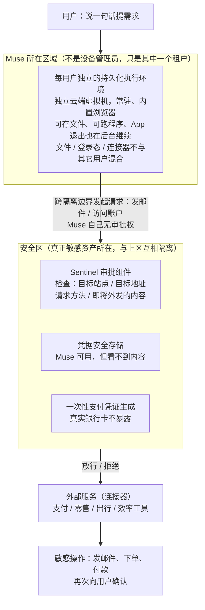

# Muse —— 把 Agent 安全从「模型对齐」改成「外部权限工程」

> **一句话结论**：它的技术增量不在模型，而在外部——每用户一台持久化云端执行环境、与用户资产互相隔离的安全区、独立审批组件与凭据代持；这套架构让「模型一定会出错」变成可接受的前提，但产品形态成立不等于执行力成立，上线两周内就出现了平台封禁与权限争议。
> **收录日期**：2026-09-26
> **状态**：部分待验证
> **类别**：产品

---

## 1. 它解决什么问题

个人 Agent 的价值与风险来自同一个来源：**权限**。要让它整理日程，就得给它日历；要让它读邮件，就得给它邮箱；要让它帮你买东西，就得让它知道地址、偏好、账户和支付方式。权限给少了它没用，给多了它一旦出错就是真实损失，而且要为用户承担这些风险的，是用户自己。

这个问题在聊天机器人时代不存在——问答不产生副作用。一旦 Agent 从「给建议」走向「替你执行」，评价标准也随之改变：过去看回答正确率，现在要看「连续执行一百步能不能一步都不错」。

### 问题的具体形态

| 现象 | 旧做法下的表现 | 造成的实际损失 |
| --- | --- | --- |
| 权限只能整体授予 | 要么给邮箱完全访问，要么完全不给 | 用户为了一个功能交出全部权限 |
| 凭据暴露给模型 | 账号密码进入上下文，模型「看得到」就能「用得到」 | 一次提示注入即可导致凭据外泄或误用 |
| 提示注入无法根治 | 网页、邮件、文件里藏指令，模型分不清是指令还是数据 | 高权限 Agent 会把攻击一路传导到真实账户 |
| 出错代价不可控 | 模型误操作直接落在用户的真实资产上 | 买错、发错、删错，不可回滚 |
| 多用户混跑 | 同一个运行环境服务多个用户 | 状态串扰，数据隔离靠实现细节而非架构 |

### 它的切入点

Meta 在公开其安全实现思路时明确承认一个前提：**无论模型训练得多好，Agent 都会犯错，也可能被攻击。** 因此它没有把安全保证押在「模型足够听话」上，而是在模型外面搭了一整套权限与执行体系：给每个用户一台独立的、持久运行的云端「电脑」，把真正敏感的资产（登录凭据、支付信息、安全服务）放到另一个互相隔离的区域，再由一个独立的审批组件决定「这个动作能不能发生」。

这个思路的价值不在于它用了什么新模型，而在于它**把安全问题从模型层挪到了系统工程层**——模型可以继续犯错，但犯错的影响被人为限制在可控范围内。

---

## 2. 核心机制拆解

这张图回答：一次任务从用户说话到真正落到外部账户上，中间被几道隔离与审批拦住。

**读图要点**：

| 观察 | 含义 |
| --- | --- |
| 两个区域之间只有一条边 | 执行环境与敏感资产是隔离边界，所有跨区动作都必须经过审批，不能直连 |
| Sentinel 检查的是「动作是什么」 | 它看目标站点、地址、请求方法、外发内容，属于系统工程层，而不是模型层 |
| 凭据对 Muse 是「可用不可见」 | 模型不需要也不持有明文凭据，提示注入拿不到可外泄的东西 |
| 支付走一次性凭证 | 即使凭证泄漏，损失也被限制在单次额度内，真实卡号不进入任何上下文 |
| 敏感操作最后还要用户确认 | 审批通过不等于用户同意，最后一跳由人兜底，出错代价被压到可控范围 |

### 2.1 输入：它接受什么

自然语言任务，支持多步与长时任务。用户不需要保持 App 在前台——任务在云端后台执行，完成后主动回报。它同时从 Meta 自有生态获取上下文（社交关系链、用户收藏的内容），并从连接器获取外部服务能力。

| 连接器类别 | 已接入服务（公开口径） |
| --- | --- |
| 支付 | Stripe、Shop Pay、PayPal、Lync |
| 零售 | Walmart、Best Buy、Gap、Sephora、Wayfair，以及 Shopify 全量商品目录 |
| 出行与生活 | Expedia、Instacart（当时标注即将上线） |
| 效率工具 | GitHub、Notion、Granola、Google Drive |

没有公开 API 的网站，靠浏览器模拟人类操作完成。官方强调**模型本身看不到密码和支付方式**，凭据存放在安全存储中仅用于认证。

### 2.2 处理：核心计算路径

底层模型是 Meta 自研的 Muse Spark，公开信息为原生多模态智能体模型、当前版本 1.3、支持较长上下文（百万 Token 量级）、可感知视频与图像与文档。Meta 方面的说法是：该模型系列从第一版起就是**为个人 Agent 打造的**，每一版迭代都围绕 Agent 能力与多模态能力，而不是先去打模型榜单。

产品形态上，Muse 与开源项目 OpenClaw 的关系值得记录：Meta 相关负责人在 Connect 2026 上公开表示，Muse 是「从零开发」的，但作为产品「深受 OpenClaw 启发」，其工作区文件（含人格配置文件）与 OpenClaw 几乎一致。这条信息很重要，因为它说明**这套产品架构有开源参照物**，其中的人格/技能用 Markdown 配置文件定义的思路可以直接借鉴。

### 2.3 输出：它承诺什么保证

| 它承诺 | 它不承诺 |
| --- | --- |
| 模型看不到凭据与支付方式明文 | 模型不会做出错误决策 |
| 敏感操作（发邮件、购买）会向用户二次确认 | Agent 能进入所有第三方平台 |
| 每个连接器可单独设定权限，例如邮箱只读 | 提示注入被彻底防御 |
| 真实银行卡不直接暴露给 Agent 或商户 | 出错后责任归属清晰 |

最后一栏是这类产品的通病：一旦 Agent 替你签了合同、买错东西，责任在用户、Agent 提供方还是平台，目前没有公认答案。这属于行业级待解问题，不是 Meta 一家的缺口。

### 2.4 可靠性手段

| 手段 | 作用 |
| --- | --- |
| 每用户独立执行环境 | 把「出错」限制在用户自己的沙箱内，且不与其它用户串扰 |
| 安全区隔离 | Muse 不是设备管理员，越权需要跨隔离边界 |
| 独立审批组件 | 谁能发生网络请求、访问哪个地址、外发什么内容，由模型之外的组件判定 |
| 凭据代持 | 凭据可用但不可见，泄露面从「模型上下文」缩小到「存储本身」 |
| 一次性支付凭证 | 真实卡号不进入交易链路 |
| 权限最小化与二次确认 | 按连接器粒度授权，敏感动作停下来问人 |

这套组合的定位很清楚：**不追求零错误，追求错误的影响半径可控。** 官方对此的表述是，多层防护的作用是限制潜在损害的规模，而不是消除损害。

### 2.5 但机制之外还有现实

上述架构描述的是设计意图。实际运行中，公开报道出现了若干与该设计张力明显的事件：

| 事件 | 公开描述 | 说明了什么 |
| --- | --- | --- |
| 平台封禁 | 有大型电商平台在 9 月下旬封禁了 Muse 访问，理由包括未事先告知、浏览时不表明身份、可能抓取账户数据 | 权限工程解决不了「平台是否愿意让你进」的问题 |
| Marketplace 事件 | 有报道称在用其管理二手交易列表时，出现自动降价、并向买家暴露卖家住址、导致买家上门 | 影响半径可控 ≠ 影响可接受 |
| 桌面端漏洞 | 有报道称桌面端听写数据流存在可被本地恶意软件劫持的漏洞 | 外部权限层自身也是攻击面 |
| 凭据存储争议 | 有平台方指控其似乎会获取并存储用户登录凭证，与官方「看不到凭据」的说法存在分歧 | 「不可见」和「不存储」是两件事 |

这一节是 Muse 条目里最值得留存的部分：它记录了一个设计良好的架构在真实环境中会遇到哪些**非技术约束**。

---

## 3. 与已有方案对比

| 方案 | 核心思路 | 优势 | 局限 | 适用场景 |
| --- | --- | --- | --- | --- |
| Muse（个人 Agent 产品） | 每用户独立云端执行环境 + 隔离安全区 + 外部审批 + 凭据代持，用架构限制出错影响 | 权限粒度细、敏感动作可控、深度整合 Meta 生态与社交关系链、开箱即用 | 不可自主接入、地区受限、依赖平台配合、复杂任务的纠错成本高于其节省的时间、责任归属不明 | 个人生活场景（购物、邮件、日程、出行）的代办 |
| 通用对话产品 + Agent 模式 | 在对话产品里增加浏览器与工具使用能力 | 全球可用、通用性强、创作与问答能力更成熟 | 运行环境由服务方托管、权限模型相对粗、生态整合偏工具与插件 | 通用问答、创作、轻量自动化 |
| 开源自托管 Agent 框架 | 在用户自己的机器或服务器上跑 Agent，用配置文件定义人格与技能 | 数据自主可控、无地区限制、可自接任意模型、可审计 | 需要命令行基础、权限与安全要自己搭、生态靠自己拼 | 有工程能力、对数据控制要求高的个人与团队 |
| 手机系统级助手 | 由操作系统提供入口，调用系统能力与已授权应用 | 入口最自然、系统权限最完整、与设备能力结合最紧 | 受限于第三方 App 的开放程度，跨 App 自动化常被风控拦截 | 设备内的轻量任务、系统设置与本地操作 |

### 选型结论

**三者不是同一层的东西。** Muse 是产品，开源框架是能力底座，对话产品的 Agent 模式是通用入口：

- 要**当下就能用**、且生活在 Meta 生态里 → Muse 这类产品；
- 要**数据不出本机、可自己改** → 自托管框架，并且可以直接参照其人格配置文件的设计；
- 要**跨场景通用** → 对话产品的 Agent 模式。

**不要指望它解决的问题**：它不能替你打通不合作的平台。Muse 被封禁这件事说明，Agent 的能力上限不只由模型决定，还由「第三方平台是否授权」决定。任何依赖「模拟人类操作」进入他人平台的方案，都会长期面对这条约束。

---

## 4. 上手成本

| 子项 | 情况 |
| --- | --- |
| 依赖 | 作为产品：需要 Meta 账号，需要按需求授权连接器与支付渠道。作为可借鉴方案：核心依赖是「一台属于单个用户的持久化执行环境」这一基础设施，自建则意味着要自己提供隔离、凭据存储与审批链路 |
| 部署 | 官方为云托管，执行环境在云端而非手机本地，用户侧只装 App。对开发者而言不可自主部署该运行时；可选择接入其底层模型自建 Agent |
| 学习曲线 | 产品侧接近零：纯 App、自然语言。借鉴其架构的成本则高得多，主要难点在权限分层与凭据代持的工程实现，而非模型 |
| 生态成熟度 | 快速扩张但尚不稳定。开发者平台开放不到一周即收到大量第三方连接器申请；同时上线两周内出现平台封禁、权限争议与桌面端漏洞报告，说明生态仍在磨合 |

### 成本估算

| 项目 | 数量 / 价格 | 备注（含截至日期） |
| --- | --- | --- |
| 用户侧费用 | 免费，提供较多 Token 额度 | 公开口径称长期靠交易手续费而非订阅；截至 2026-09-26 |
| 用户侧时间成本 | 复杂任务可能高于自己做 | 有实测反馈：本来想省 3 分钟，结果花 10 分钟盯着它查错 |
| 开发者侧模型接入 | 按百万 Token 计费，兼容主流 SDK 客户端 | 存在允许数据用于改进产品的低价贡献者版本，价格约为标准版十分之一 |
| 地区可用性 | 上线时仅两个国家 | 截至 2026-09-26 |

---

## 5. 对我们的影响（结合本项目：Agent 评测、RAG、工具调用、记忆管理 等）

### 5.1 Agent 评测

| 要改的地方 | 怎么改 | 怎么验证 |
| --- | --- | --- |
| 评测单位从「步」改为「任务」 | 现有评测按单步正确率统计；需增加「连续 N 步无错误完成率」这一指标 | 构造 20 步以上的长流程任务，统计整任务成功率与平均干预次数 |
| 新增「人工干预次数」指标 | 把用户需要确认 / 纠错的次数记为成本项，而不只是记录成功率 | 同一任务下对比不同方案的干预次数与总耗时 |
| 新增「影响半径」评测 | 对每个工具标注「出错后的可恢复性」（可回滚 / 需人工 / 不可逆），在评测报告中分层统计 | 按可恢复性分层输出成功率，而不是只看总体 |
| 平台合规性单列 | 对每个外部平台记录其条款对自动化的态度 | 形成一张平台合规清单，接入前先查 |

最后一条直接来自这次的现实：再好的架构，也挡不住「平台不允许你进」。

### 5.2 RAG

| 要改的地方 | 怎么改 | 怎么验证 |
| --- | --- | --- |
| 检索来源的可信分级 | 把「检索回来的内容」按来源可信度分级，低可信来源的内容不得进入指令位置 | 构造带注入内容的文档，验证其不改变 Agent 行为 |
| 上下文来源隔离 | 明确区分「系统指令」「用户指令」「检索内容」三种上下文，并保证后两者不能互相冒充 | 统计注入测试的通过率 |

提示注入是这类高权限 Agent 的核心风险，而 RAG 是注入最主要的入口。这一项**现在就做**。

### 5.3 工具调用

| 要改的地方 | 怎么改 | 怎么验证 |
| --- | --- | --- |
| 连接器权限粒度 | 每个工具按「只读 / 可写 / 可执行」拆分授权，默认只读 | 检查是否所有可写工具都需要显式开启 |
| 敏感动作二次确认 | 定义敏感动作清单（付款、发信、删除、对外提交），强制经过人工确认 | 统计敏感动作是否 100% 有确认记录 |
| 审批与执行解耦 | 把「决定要不要做」与「实际去做」拆到不同组件，执行方不持有审批权 | 代码走查 + 故障注入测试（模拟模型被注入） |
| 身份表明 | 对外请求携带可识别的 Agent 身份标识 | 检查平台是否因此放行或封禁 |

最后一项是这次事件给出的直接教训：**浏览时不表明身份**，本身就是平台封禁的理由之一。

### 5.4 记忆管理

| 要改的地方 | 怎么改 | 怎么验证 |
| --- | --- | --- |
| 记忆与资产分区 | 用户偏好、习惯属于记忆；凭据、卡号属于资产。两者不得放在同一个存储与同一条检索路径上 | 审计检索接口能否返回凭据类字段（应返回 0 条） |
| 记忆的可见范围 | Agent 的记忆可能包含他人信息（例如朋友的联系方式、饮食禁忌），需要定义「为他人保存的信息」的可见与删除规则 | 构造含第三方信息的记忆，验证删除请求能否彻底清除 |
| 记忆写入需可审计 | 每次写入记录来源与时间，便于事后追溯「它为什么会知道这个」 | 抽查任意一条记忆能否追到来源 |

Muse 的长期记忆是它「越用越懂你」的基础，也是隐私争议的源头。**先定规则再上记忆**，比事后补救便宜得多。

### 5.5 权限与安全

| 要改的地方 | 怎么改 | 怎么验证 |
| --- | --- | --- |
| 执行环境隔离 | 每个用户（或每个任务）一个独立执行环境，不与其它会话共享文件与登录态 | 并发跑两个用户的任务，检查是否存在文件与凭据交叉 |
| 凭据代持 | 模型侧只持有「引用凭据的句柄」，实际凭据在独立存储中，由执行层注入 | 检查模型上下文与日志中是否出现任何明文凭据 |
| 支付信息隔离 | 引入一次性支付凭证，真实卡号不进入 Agent 链路 | 检查交易链路中真实卡号的出现位置 |
| 影响半径评估 | 每个高风险动作先问「最坏情况能否回滚」 | 形成高风险动作清单与对应回滚方案 |
| 责任边界写入文档 | 明确哪些动作出问题由谁承担 | 文档评审 |

### 5.6 行动项汇总

| 优先级 | 行动 | 触发条件 |
| --- | --- | --- |
| 现在就做 | 给评测加「长流程整任务成功率」与「人工干预次数」两项指标 | — |
| 现在就做 | 敏感动作清单 + 强制执行二次确认 | — |
| 现在就做 | 凭据代持改造：模型上下文与日志中不出现明文凭据 | — |
| 现在就做 | RAG 上下文来源隔离与注入测试 | — |
| 现在就做 | 建立外部平台自动化合规清单，接入前先查条款 | — |
| 观察后再定 | 参照其人格配置文件的设计，做本地可审计的 Agent 配置方案 | 等自托管方案验证可行（依赖 V5） |
| 观察后再定 | 每任务独立执行环境的落地 | 等成本与运维方案明确（依赖 V6） |

---

## 6. 待验证问题

### 6.1 关键事实缺口

| 编号 | 待验证内容 | 为什么存疑 | 需要什么材料才能解决 |
| --- | --- | --- | --- |
| V1 | **待验证**：审批组件的实际名称与边界 | 「Sentinel」这一名称来自二手总结，本次未能直接抓取官方安全文档确认；其权限边界（能拒绝什么、不能拒绝什么）也未见一手说明 | Meta 官方安全实现文档原文 |
| V2 | **待验证**：底层模型的具体规格 | 上下文长度、模态支持、版本发布日期与定价，本次只从检索摘要与二手总结获得，未能核对官方模型文档 | 官方模型文档与定价页 |
| V3 | **待验证**：执行环境的技术实现 | 「基于某容器运行时的持久化 Linux 环境」这一说法来自单一二手总结，转述了一位安全研究者的分析，未获官方确认 | 官方架构说明或可复现的技术分析 |
| V4 | **待验证**：凭据处理方式的双方说法 | 一方称模型看不到密码与支付方式，另一方指控其似乎会获取并存储用户登录凭证。两者可以同时为真（「不可见」不等于「不存储」），但也不排除其中一方表述不准确 | 官方数据处理说明；或独立的技术审计 |
| V5 | **待验证**：与开源项目的继承关系细节 | 官方承认「作为产品深受启发」，但「从零开发」与「工作区文件几乎一致」之间的边界，缺少可核对的细节 | 两方公开的仓库与文件对比 |
| V6 | **待验证**：执行环境的资源与成本模型 | 每用户一台持久化环境在规模化后的成本结构未见披露，这直接决定该架构能否被我们复制 | 官方或第三方的成本分析 |
| V7 | **待验证**：地区开放节奏与合规路径 | 上线时仅限两个国家；不同市场对凭据存储、支付代理、自动化的监管要求不同，落地节奏未知 | 官方公告与各地监管文件 |
| V8 | **待验证**：硬件与新增入口的实际能力 | 随身硬件与桌面操控能力的可用性，来自发布会与二手总结，具体交付时间多标注为「未公布」或「未来几个月」 | 官方产品页与实机评测 |

### 6.2 来源冲突记录

| 冲突点 | 说法 A | 说法 B | 处置 |
| --- | --- | --- | --- |
| 下载量口径 | 上线 12 天，某国 + 某国 iOS 端 Android 合计全球安装量 280 万 | 同期两个国家的 iOS 端下载 180 万 | 两个数字口径不同，正文分别标注口径，不混用 |
| 可用地区 | 「目前仅两个国家可用」 | 有报道称「正推向全球」 | 以官方商店可用范围为准；正文写「上线时仅两个国家」，全球扩展作为待确认 |
| 收费模式 | 免费 + 未来交易手续费 | 有分析称商业化模式从订阅转向抽佣 | 两种说法的落点一致（都不靠订阅），正文按「免费 + 交易手续费」表述 |
| 是否读取私信 | 默认连接后即可读取社交上下文 | 有评测反馈在未被要求的情况下读取了私信内容 | 保留为使用风险提示，不作为产品定义 |

---

## 7. 延伸阅读

| 级别 | 链接 | 支撑内容 | 检索日期 |
| --- | --- | --- | --- |
| A | [Meta 官方：How We Built Safety Into Muse（security and safety for AI agents: our approach with Muse）](https://research.meta.ai/blog/security-and-safety-for-ai-agents-our-approach-with-muse) | 安全设计思路、隔离与审批架构（本次未能直接抓取，域名在本环境不可解析） | 2026-10-03 |
| A | [Meta Muse 官方页面](https://ai.meta.com/muse/) | 产品能力与连接器清单（本次未能直接抓取） | 2026-10-03 |
| A | [Muse Spark 模型文档与定价](https://dev.meta.ai/models/muse-spark/) | 底层模型规格与计价（本次未能直接抓取） | 2026-10-03 |
| A | [Muse Spark 1.3 · Gemini Enterprise Agent Platform 文档](https://docs.cloud.google.com/gemini-enterprise-agent-platform/models/partner-models/meta/muse-spark-1-3) | 第三方云平台上的可用性（本次未能直接抓取，域名在本环境不可解析） | 2026-10-03 |
| B | [上海证券报：Meta Muse 登顶应用榜，个人 Agent 时代加速到来](https://www.cnstock.com/commonDetail/794371) | 登顶应用榜与个人 Agent 趋势的机构视角 | 2026-10-03 |
| B | [澎湃：「十天登顶、被亚马逊封禁，Muse 是谁？」](https://m.thepaper.cn/newsDetail_forward_34142944) | 上线时间与地区、下载数据、封禁事件、独立虚拟机、长期记忆、实测反馈与专家观点 | 2026-10-03 |
| B | [36氪（英文版）：Muse tops the list, Meta makes a comeback with its agent](https://eu.36kr.com/en/p/3993884392314753) | 安全分区与审批组件、凭据代持、一次性支付凭证、Meta 的战略转向与组织背景 | 2026-10-03 |
| B | [七牛云：Meta Muse 爆火：12 天下载量反超 ChatGPT](https://news.qiniu.com/archives/1790214046221) | 下载与日活对比、底层模型与上下文、连接器清单、执行环境技术实现、封禁事件与替代路径 | 2026-10-03 |
| B | [Digital Watch Observatory：Meta reviews Muse permissions after agent shares user's home address](https://dig.watch/updates/meta-muse-shares-home-address) | 住址泄露事件与权限复核（本次未能直接抓取） | 2026-10-03 |
| B | [Gigazine：当 Muse 被委托管理 Marketplace 列表时发生的事](https://gigazine.net/gsc_news/en/20260929-meta-muse-give-home-address/) | 自动降价、暴露买家地址、买家上门的完整事件（本次未能直接抓取） | 2026-10-03 |
| B | [Tech Yahoo / Forkast：Meta 如何把 Agent 安全做进内核](https://forkast.news/how-meta-built-agent-security-into-the-kernel-ebpf-taint-tracking-and-credential-surrogation/) | eBPF 污点追踪与凭据代持的技术细节（本次未能直接抓取，标题信息来自检索摘要） | 2026-10-03 |
| C | [央广网：登顶全球的 Muse，点燃 AI 投资新叙事？](https://tech.cnr.cn/gstj/20260926/t20260926_527825740.shtml) | 资本市场反应、机构目标价调整、个人 Agent 讨论（页面为 GBK 编码） | 2026-10-03 |

---

## 更新记录

| 日期 | 改动 | 依据 |
| --- | --- | --- |
| 2026-09-26 | 首次成稿；建立七节结构，标注 V1–V8 待验证项与来源冲突记录 | 上表 A/B/C 级来源 |
| 2026-10-03 | 补充 2.5 节「机制之外还有现实」记录封禁、Marketplace、桌面端漏洞、凭据争议四类事件；确认本环境无法直接抓取官方安全文档与模型文档，A 级条目均标注「未能直接抓取」 | 本次检索结果 |

---

[⬅️ 返回本栏目首页](../README.md)
