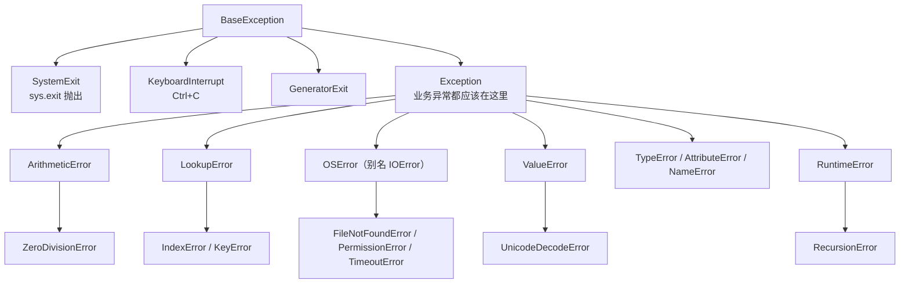

# 异常体系：先认族谱再抓异常

> **学习目标**：能够解释「异常体系：先认族谱再抓异常」的机制或步骤，并用本节材料验证理解。
>
> **前置知识**：函数与作用域（02 篇）、可变/不可变类型（01 篇）、类与魔法方法 `__enter__` / `__exit__`（03 篇）。
>
> **所属主题**：文件与异常处理 · 核心概念

## 本次只学这一点

这张图回答：`except` 该抓哪个类，以及为什么「子类写在父类前面」不是风格问题而是正确性问题。



**读图要点**：

| 观察 | 含义 |
| --- | --- |
| 只有 Exception 这一支属于业务异常 | SystemExit、KeyboardInterrupt、GeneratorExit 直接继承 BaseException，所以 `except Exception` 拦不住它们 |
| 越往下越具体 | `except` 从上往下匹配，子类必须写在父类前面，否则子类分支永远走不到 |
| `OSError` 是 `IOError` 的别名 | 文件不存在、权限不足、超时都挂在这一个分支下，一次 `except OSError` 就能全覆盖 |
| 同一层里可以并列多个类 | 例如 TypeError / AttributeError / NameError 没有更细的共同父类，只能逐个列出 |
| 树深就是「捕获粒度」的选项 | 抓父类省事但会连带吞掉不相关的异常，抓子类精确但要求你知道具体会抛什么 |

| 概念 | 说明 |
| --- | --- |
| `except Exception as e` | 捕获绝大多数业务异常，`e` 绑定异常对象 |
| 多 `except` 顺序 | **从上往下匹配，子类必须写在父类前面**，否则子类永远匹配不到 |
| `else` | `try` 块**正常完成**（没有异常、没有 `return`/`break`/`continue`）时执行 |
| `finally` | 无论发生什么都会执行，用于释放资源；**里面不要写 `return`**（会吞掉返回值和异常） |
| `raise` | 重新抛出当前异常（`raise` 单独用）或抛出新异常 |
| `raise E(...) from e` | 抛出新异常并保留 `__cause__`，异常链清晰 |

**执行顺序实测**：
```python
def flow(x):
    try:
        r = 10 / x
    except ZeroDivisionError as e:
        print(" except:", e)
    else:
        print(" else: 没异常，r =", r)
    finally:
        print(" finally: 清理")

        flow(2)
        # else: 没异常，r = 5.0
        # finally: 清理
        flow(0)
        # except: division by zero
        # finally: 清理
```
注意：如果 `try` 块里写了 `return`，`else` **不会**执行（因为 `try` 不是"正常完成"），但 `finally` 一定执行。

## 验证理解

- 合上正文，用自己的话解释本知识点解决的问题及适用边界。
- 若本节含代码、公式或流程，先预测结果，再运行、推导或逐步追踪；项目片段需要沿用原文的依赖与数据。
- 如果缺少变量、术语或完整代码，请查阅[综合原文](../../../../../01-python/03-面向对象与数据模型/04-文件与异常处理.md)；代码片段不等同于独立可运行项目。

## 自测与关联复习

- 「异常体系：先认族谱再抓异常」为什么需要这种设计？改变一个条件会怎样？
- 找出仍讲不清楚的地方，加入待复习并留下具体问题。
- [本主题目录](../index.md) · [完整示例、常见坑与原文自测](../../../../../01-python/03-面向对象与数据模型/04-文件与异常处理.md)
