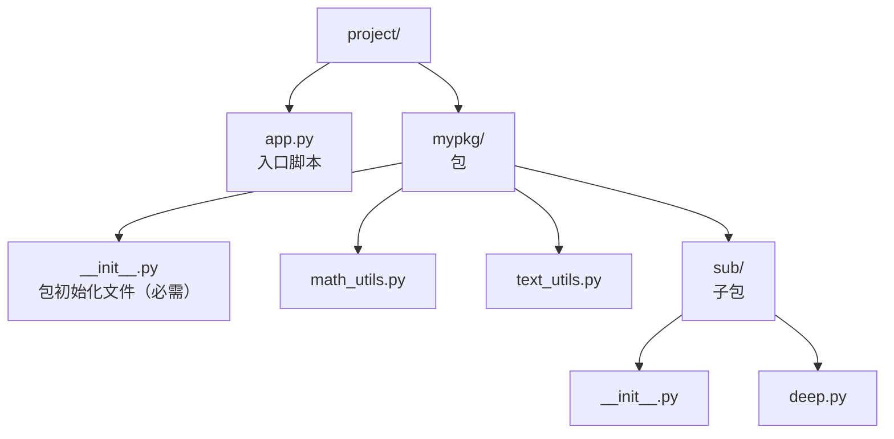

# 包（package）与 __init__.py

> **学习目标**：能够解释「包（package）与 __init__.py」的机制或步骤，并用本节材料验证理解。
>
> **前置知识**：函数与全局变量（02 篇）、类与对象（03 篇）、`try/except ImportError`（04 篇）。
>
> **所属主题**：模块与包管理 · 核心概念

## 本次只学这一点



**读图要点**：

| 观察 | 含义 |
| --- | --- |
| `__init__.py` 在两层各出现一次 | 每一级目录都要有自己的初始化文件，才能被当成普通包导入 |
| `app.py` 与 `mypkg/` 平级 | 入口脚本放在包外，`sys.path[0]` 才是 `project/`，`import mypkg` 才一定能成功 |
| 子包 `sub/` 是包里的包 | 子包内部要用相对导入时得多写一层，例如 `from ..math_utils import add` |
| 目录名就是导入时写的包名 | 重命名目录等于重命名包，所有引用它的 import 语句都要跟着改 |

`__init__.py` 的作用：

| 作用 | 说明 |
| --- | --- |
| 标识目录为包 | Python 2 必需；Python 3.3+ 有"命名空间包"可省略，但**普通包仍建议保留** |
| 包被导入时执行一次 | 做初始化、设置 `__version__` |
| 组织公共接口 | 在里面 `from .math_utils import add`，外部就能写 `from mypkg import add` |
| 控制 `import *` 的行为 | 定义 `__all__ = ["math_utils", "text_utils"]` |

**绝对导入 vs 相对导入**：

| 形式 | 写法 | 适用 |
| --- | --- | --- |
| 绝对导入 | `from mypkg.math_utils import add` | 入口脚本、跨包引用，**推荐** |
| 相对导入 | `from .math_utils import add`（`.` 当前包，`..` 上级包） | 包内部模块互相引用 |

**相对导入的硬性限制**：它依赖 `__package__` / `__name__`，只有当模块**作为包的一部分被导入**时才有效。直接 `python mypkg/sub/deep.py` 会立刻失败：
```text
ImportError: attempted relative import with no known parent package
```
正确做法是从项目根目录用 `python -m mypkg.sub.deep` 运行，或改用绝对导入。

## 验证理解

- 合上正文，用自己的话解释本知识点解决的问题及适用边界。
- 若本节含代码、公式或流程，先预测结果，再运行、推导或逐步追踪；项目片段需要沿用原文的依赖与数据。
- 如果缺少变量、术语或完整代码，请查阅[综合原文](../../../../../01-python/05-工程化与实践/05-模块与包管理.md)；代码片段不等同于独立可运行项目。

## 自测与关联复习

- 「包（package）与 __init__.py」为什么需要这种设计？改变一个条件会怎样？
- 找出仍讲不清楚的地方，加入待复习并留下具体问题。
- [本主题目录](../index.md) · [完整示例、常见坑与原文自测](../../../../../01-python/05-工程化与实践/05-模块与包管理.md)
