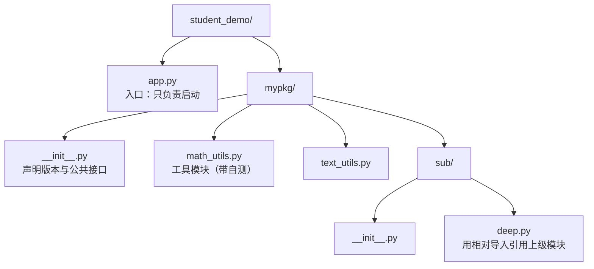

# 模块与包管理：最小可运行示例

> **学习目标**：能够解释「模块与包管理：最小可运行示例」的机制或步骤，并用本节材料验证理解。
>
> **前置知识**：函数与全局变量（02 篇）、类与对象（03 篇）、`try/except ImportError`（04 篇）。
>
> **所属主题**：模块与包管理 · 最小可运行示例

## 本次只学这一点

把的"学员管理系统"拆成标准的多文件工程结构：


**读图要点**：

| 观察 | 含义 |
| --- | --- |
| 入口与包分列两个分支 | `app.py` 属于应用层，`mypkg/` 属于库，这条分界线决定了什么可以被打包发布 |
| 每个文件都有单一职责 | `math_utils` 与 `text_utils` 平级且互不依赖，新增能力是加文件而不是改文件 |
| `sub/deep.py` 是唯一使用相对导入的模块 | 它必须通过包被导入才有效，直接 `python mypkg/sub/deep.py` 会立刻报错 |
| 包内可以嵌套子包 | 嵌套带来分层，也带来更长的相对导入路径，层级不宜过深 |

**`mypkg/__init__.py`**
```python
"""mypkg 的包初始化文件：包被导入时执行，用来定义包的公共接口。"""
__all__ = ["math_utils", "text_utils"]
__version__ = "1.0.0"
```
**`mypkg/math_utils.py`**
```python
"""数学工具模块"""

PI = 3.14159

def add(a, b):
 """求和"""
 return a + b

if __name__ == "__main__":
 # 只有"直接运行本文件"时才执行；被 import 时不执行
 print("math_utils 自测:", add(1, 2))
```
**`mypkg/text_utils.py`**
```python
def shout(text):
 return text.upper() + "!"
```
**`mypkg/sub/deep.py`**
```python
from ..math_utils import add # 相对导入：.. 表示上一级包

def double_add(a, b):
 return add(a, b) * 2
```
**`app.py`（入口，放在 `student_demo/` 根目录）**
```python
import sys

import mypkg # 导入整个包
from mypkg import math_utils # 从包里导入模块
from mypkg.math_utils import add as plus # 导入名字并起别名
from mypkg.sub.deep import double_add # 导入子包中的函数

print("包版本:", mypkg.__version__) # 1.0.0
print("模块方式:", math_utils.add(1, 2)) # 3
print("别名方式:", plus(3, 4)) # 7
print("相对导入:", double_add(1, 2)) # 6
print("__name__ =", __name__) # __main__
print("sys.path[0] =", sys.path[0]) # .../student_demo

import mypkg.math_utils as m2
print("重复导入是同一个对象:", m2 is math_utils) # True
```
在 `student_demo/` 目录下运行 `python app.py`，真实输出：
```text
包版本: 1.0.0
模块方式: 3
别名方式: 7
相对导入: 6
__name__ = __main__
sys.path[0] = C:\...\_staging\_scratch\mod_demo
重复导入是同一个对象: True
```
再运行 `python -m mypkg.math_utils`，输出：
```text
math_utils 自测: 3
```
而如果**直接**运行子包里的文件：
```powershell
python mypkg/sub/deep.py
```
得到：
```text
ImportError: attempted relative import with no known parent package
```
**关键点说明**

| 位置 | 关键点 |
| --- | --- |
| `mypkg/__init__.py` | 包被导入时执行，`__version__` 挂在包对象上，可用 `mypkg.__version__` 读 |
| `math_utils.py` 尾部 | `__name__ == "__main__"` 让自测代码只在直接运行时执行 |
| `from ..math_utils import add` | `..` 表示"上一级包"，只在包内导入时有效 |
| `python -m mypkg.math_utils` | `-m` 把模块当主程序跑，`__name__` 同样是 `"__main__"` |
| `sys.path[0]` | 入口脚本所在目录被自动加入搜索路径，这决定了 `import mypkg` 能否成功 |
| `m2 is math_utils` | 模块只加载一次，两次 `import` 拿到同一个对象 |

## 验证理解

- 合上正文，用自己的话解释本知识点解决的问题及适用边界。
- 若本节含代码、公式或流程，先预测结果，再运行、推导或逐步追踪；项目片段需要沿用原文的依赖与数据。
- 如果缺少变量、术语或完整代码，请查阅[综合原文](../../../../../01-python/05-工程化与实践/05-模块与包管理.md)；代码片段不等同于独立可运行项目。

## 自测与关联复习

- 「模块与包管理：最小可运行示例」为什么需要这种设计？改变一个条件会怎样？
- 找出仍讲不清楚的地方，加入待复习并留下具体问题。
- [本主题目录](../index.md) · [完整示例、常见坑与原文自测](../../../../../01-python/05-工程化与实践/05-模块与包管理.md)
