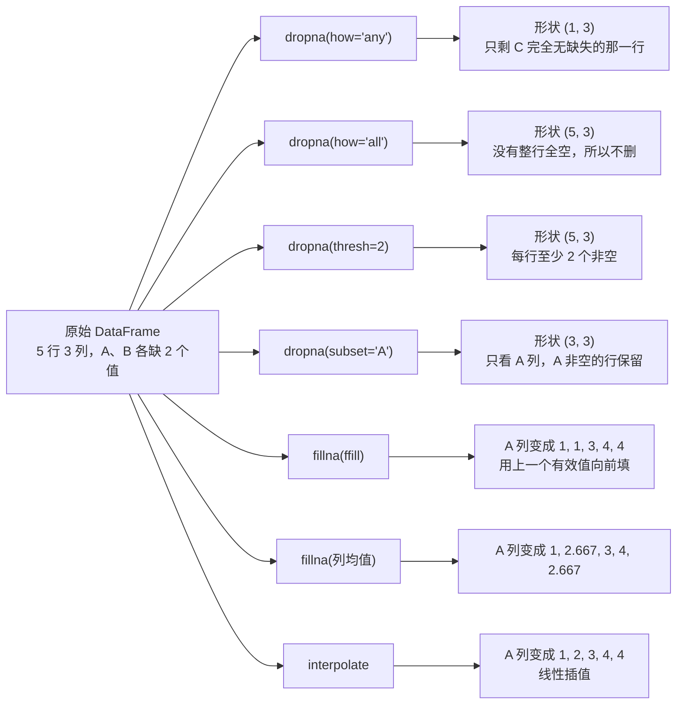

# 缺失值处理

> **学习目标**：能够解释「缺失值处理」的机制或步骤，并用本节材料验证理解。
>
> **前置知识**：NumPy 的 ndarray、广播与 `axis` 语义（11 篇）、列表/字典（01 篇）、文件读写与编码（04 篇）。
>
> **所属主题**：Pandas 数据处理 · 核心概念

## 本次只学这一点

| 步骤 | 方法 | 关键参数 |
| --- | --- | --- |
| 检测 | `df.isnull` / `df.notnull` | 配合 `.sum` 看每列缺失个数 |
| 检测（整体） | `df.isnull.any / .all` | 哪些列有缺失 |
| 删除 | `df.dropna` | `axis`（0 行/1 列）、`how`（`any`/`all`）、`thresh`（至少几个非空）、`subset`（只看这些列） |
| 填充 | `df.fillna(value)` | `value`、`method`（`ffill`/`bfill`）、`limit`、按列传字典 |
| 插值 | `df.interpolate` | `method="linear"` 等，适合时间序列 |
| 类型标记转 NaN | `df.replace("?", np.nan)` | 原始数据常用 `?` `-` `999` 表示缺失 |

实测（5 行 3 列，A、B 各缺 2 个值）：

这张图回答：面对同一个缺值的 DataFrame，不同参数各自会留下几行、把 A 列填成什么样。

**读图要点**：

| 观察 | 含义 |
| --- | --- |
| 同一次删除，`how` 与 `thresh` 给出的形状完全不同 | `how='any'` 最激进（只剩 1 行）、`how='all'` 最宽松（不删），`thresh` 用「至少几个非空」做中间档 |
| `subset` 把判断限定在部分列 | 其他列缺不缺不影响行是否保留，适合「只关心关键字段」的场景 |
| 三种填充给出三种 A 列 | `ffill` 复制上一个有效值、均值填充会引入 2.667 这类非原始值、线性插值按趋势补 |
| 填充一定会改变分布 | `ffill` 让值重复、均值让方差变小，所以填充策略必须写进报告口径 |
| 删除与填充是两种不同的取舍 | 删除损失样本量，填充损失真实性；缺失比例高时还要额外加「是否缺失」的指示列 |

**"用均值填充"的三个前提**（默认这么做，但要知道风险）：

1. 该列是**数值型**且近似对称分布（否则均值会被极值带偏，应考虑中位数）；
2. 缺失是**随机**发生的（MCAR/MAR）；如果是"高收入人群不愿填收入"，均值填充会系统性低估；
3. 缺失比例不高（经验上超过 20~30% 就该考虑删除该列或建"是否缺失"的指示列）。

对**时间序列**，`ffill` / `interpolate` 通常比均值更合理；对**分类列**，用众数或单独建一个 `"Unknown"` 类别。

## 验证理解

- 合上正文，用自己的话解释本知识点解决的问题及适用边界。
- 若本节含代码、公式或流程，先预测结果，再运行、推导或逐步追踪；项目片段需要沿用原文的依赖与数据。
- 如果缺少变量、术语或完整代码，请查阅[综合原文](../../../../../01-python/05-工程化与实践/12-Pandas数据处理.md)；代码片段不等同于独立可运行项目。

## 自测与关联复习

- 「缺失值处理」为什么需要这种设计？改变一个条件会怎样？
- 找出仍讲不清楚的地方，加入待复习并留下具体问题。
- [本主题目录](../index.md) · [完整示例、常见坑与原文自测](../../../../../01-python/05-工程化与实践/12-Pandas数据处理.md)
