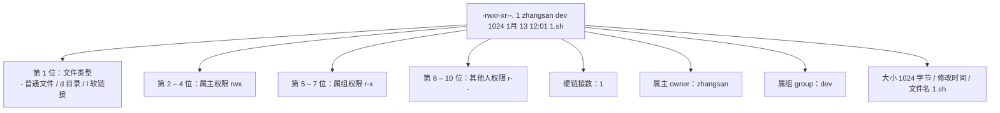

# 用户、用户组与权限模型

> **学习目标**：能够解释「用户、用户组与权限模型」的机制或步骤，并用本节材料验证理解。
>
> **前置知识**：建议先掌握 [01-Linux基础命令](../../../../../02-data/01-Linux与SQL/01-Linux基础命令.md) 中的 `ls/cd/mkdir/cp/mv/rm/find/grep/管道/重定向/vi`。
>
> **所属主题**：-Linux实用操作 · 核心概念

## 本次只学这一点

Linux 用 **UID/GID** 标识身份，`ls -l` 第一列就是权限位：

这张图回答：`ls -l` 那一长串输出里，每个位置到底在说什么。

**读图要点**：

| 观察 | 含义 |
| --- | --- |
| 权限位是「三组三个字符」 | 依次是属主、属组、其他人；每组内部固定 r、w、x 的顺序，没有的权限用 `-` 占位 |
| 第一位与后九位语义完全不同 | 第一位表示文件类型，不是权限；`d` 是目录、`l` 是软链接 |
| 属主与属组是两个独立字段 | 权限位决定「能做什么」，owner / group 决定「对谁生效」，所以改权限和改归属是两条命令 |
| 同一组权限对文件和目录含义不同 | `x` 对文件是「可执行」，对目录是「可进入」，这也是目录权限最容易踩的坑 |
| 数字权限只是九位的另一种写法 | `rwx` 相加得到 7、`r-x` 得到 5，所以 `755` 与 `rwxr-xr-x` 是同一件事 |

`rwx` 对**文件**和**目录**的含义完全不同，这是最容易出错的地方：

| 权限 | 对文件的含义 | 对目录的含义 |
| --- | --- | --- |
| `r` (4) | 可读取文件内容 | 可 `ls` 列出目录内文件名 |
| `w` (2) | 可修改文件内容 | 可在目录内创建/删除/改名文件 |
| `x` (1) | 可作为程序执行 | 可 `cd` 进入该目录、可访问其中文件 |

数字权限就是把 `rwx` 相加：`r=4, w=2, x=1, -=0`，因此 `777` = 所有人可读可写可执行，`644` = 属主读写、其他只读，`755` = 属主全权、其他可读可执行。

## 验证理解

- 合上正文，用自己的话解释本知识点解决的问题及适用边界。
- 若本节含代码、公式或流程，先预测结果，再运行、推导或逐步追踪；项目片段需要沿用原文的依赖与数据。
- 如果缺少变量、术语或完整代码，请查阅[综合原文](../../../../../02-data/01-Linux与SQL/02-Linux实用操作.md)；代码片段不等同于独立可运行项目。

## 自测与关联复习

- 「用户、用户组与权限模型」为什么需要这种设计？改变一个条件会怎样？
- 找出仍讲不清楚的地方，加入待复习并留下具体问题。
- [本主题目录](../index.md) · [完整示例、常见坑与原文自测](../../../../../02-data/01-Linux与SQL/02-Linux实用操作.md)
