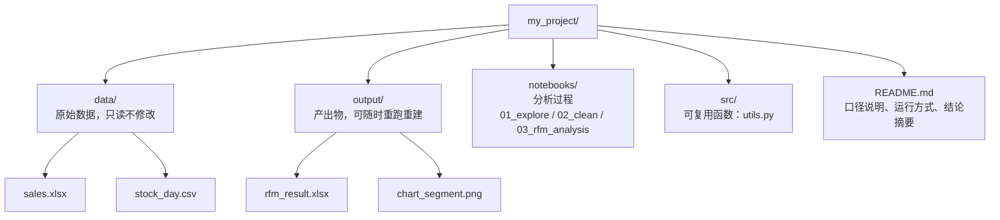

# 项目目录结构（推荐约定）

> **学习目标**：能够解释「项目目录结构（推荐约定）」的机制或步骤，并用本节材料验证理解。
>
> **前置知识**：本目录 [01-Linux基础命令](../../../../../02-data/01-Linux与SQL/01-Linux基础命令.md) ～ [10-RFM用户价值分析实战](../../../../../02-data/04-分析实战/10-RFM用户价值分析实战.md) 的全部内容；会安装软件、使用命令行与 Jupyter。
>
> **所属主题**：-数据分析项目流程 · 可运行示例

## 本次只学这一点

**读图要点**：

| 观察 | 含义 |
| --- | --- |
| 只有 `data/` 是只读的 | 原始数据不修改，任何清洗都在代码里做，这是「可重跑」的前提 |
| `output/` 全部可由代码重建 | 所以它不需要纳入版本管理，删掉重跑即可 |
| `notebooks/` 用序号命名 | 探索 → 清洗 → 分析 的执行顺序被写进文件名，交接时不用问先跑哪个 |
| 函数抽到 `src/` 而不是留在 notebook | 同一段口径被多次使用时，容易出错的复制粘贴会被一个 import 替掉 |
| `README.md` 是交付物的一部分 | 口径、运行方式与结论摘要写在这里，否则半年后没人能复现这份分析 |

约定要点：`data/` 只读不改（保证可重跑）、`output/` 全部可由代码重建、口径与结论写进 `README.md`（方便交接与复现）。

## 验证理解

- 合上正文，用自己的话解释本知识点解决的问题及适用边界。
- 若本节含代码、公式或流程，先预测结果，再运行、推导或逐步追踪；项目片段需要沿用原文的依赖与数据。
- 如果缺少变量、术语或完整代码，请查阅[综合原文](../../../../../02-data/04-分析实战/11-数据分析项目流程.md)；代码片段不等同于独立可运行项目。

## 自测与关联复习

- 「项目目录结构（推荐约定）」为什么需要这种设计？改变一个条件会怎样？
- 找出仍讲不清楚的地方，加入待复习并留下具体问题。
- [本主题目录](../index.md) · [完整示例、常见坑与原文自测](../../../../../02-data/04-分析实战/11-数据分析项目流程.md)
