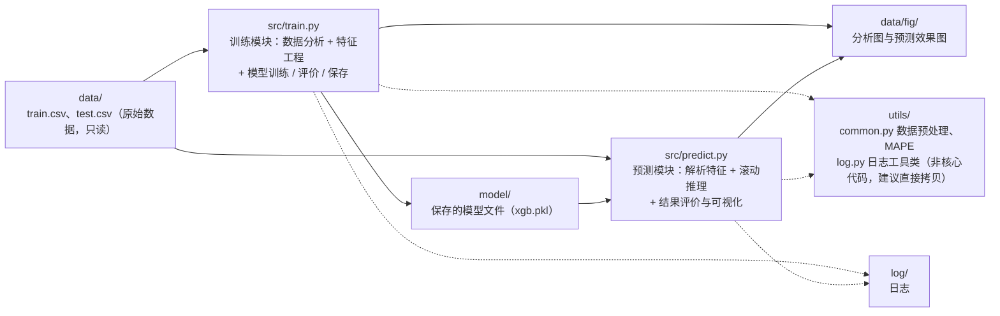

# 项目结构与模块划分

> **学习目标**：能够解释「项目结构与模块划分」的机制或步骤，并用本节材料验证理解。
>
> **前置知识**：pandas 时间序列操作（`str` 切片、`shift`、`to_timedelta`）、特征工程五大组成（见 [09-特征工程](../../../../../03-ml/01-基础与特征工程/09-特征工程.md)）、XGBoost 与网格搜索（见 [06-集成学习](../../../../../03-ml/04-集成与无监督/06-集成学习.md)、[08-模型评估与调优](../../../../../03-ml/03-评估与调优/08-模型评估与调优.md)）。
>
> **所属主题**：数据挖掘案例：电力负荷预测 · 算法细节

## 本次只学这一点

这张图回答的是：几个目录各自负责什么，以及数据从原始 csv 到预测效果图中间经过了哪几个模块。

**读图要点**：

| 观察 | 含义 |
| --- | --- |
| train.py 与 predict.py 通过 model/ 解耦 | 训练与推理是两个可独立执行的阶段，中间只靠落盘的 xgb.pkl 传递，便于复现与单独重跑 |
| data/ 同时是输入目录与产出目录 | train.csv / test.csv 是输入，fig/ 是产出；原始数据只读、产出随时可重建，这条约定避免了「跑一次污染一次数据」 |
| utils/ 被两个模块共用 | 数据预处理、MAPE、日志都放在这里，保证训练与预测用的是同一套特征解析与评价口径 |
| predict.py 必须自己重新解析特征 | 没有可复用的特征流水线对象，预测时要按训练时同样的列顺序重建特征，这也是滚动预测最容易出错的地方 |
| 目录里没有配置文件 | 超参与路径都写在代码里，小项目够用；但换数据集时要改代码而不是改配置，这是它规模再大就必须重构的原因 |

## 验证理解

- 合上正文，用自己的话解释本知识点解决的问题及适用边界。
- 若本节含代码、公式或流程，先预测结果，再运行、推导或逐步追踪；项目片段需要沿用原文的依赖与数据。
- 如果缺少变量、术语或完整代码，请查阅[综合原文](../../../../../03-ml/06-案例与面试/10-数据挖掘案例-电力负荷预测.md)；代码片段不等同于独立可运行项目。

## 自测与关联复习

- 「项目结构与模块划分」为什么需要这种设计？改变一个条件会怎样？
- 找出仍讲不清楚的地方，加入待复习并留下具体问题。
- [本主题目录](../index.md) · [完整示例、常见坑与原文自测](../../../../../03-ml/06-案例与面试/10-数据挖掘案例-电力负荷预测.md)
