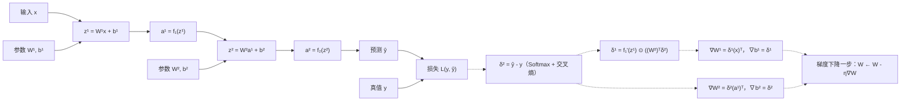

# 链式法则与计算图

> **学习目标**：能够解释「链式法则与计算图」的机制或步骤，并用本节材料验证理解。
>
> **前置知识**：矩阵与向量求导（分母布局、Jacobian）、多元链式法则、Logistic/Tanh/ReLU 的导数、Softmax 与交叉熵、Frobenius 范数与 $\ell_2$ 正则化、凸/非凸优化与局部最优的基本概念。
>
> **所属主题**：-反向传播与梯度下降 · 算法细节

## 本次只学这一点

若 $u=g(v)$、$v=h(\theta)$，则 $\partial u/\partial \theta=(\partial u/\partial v)(\partial v/\partial \theta)$。写成神经网络的求和形式：$\dfrac{\partial \mathcal{L}}{\partial w^{(l)}_{ij}}=\sum_{k}\dfrac{\partial \mathcal{L}}{\partial z^{(l)}_k}\cdot\dfrac{\partial z^{(l)}_k}{\partial w^{(l)}_{ij}}$。在计算图上，这就是"损失节点到参数节点之间所有路径的局部导数连乘，再把多条路径相加"（教材公式 4.75）。例如复合函数 $y=1/(1+\exp(-(wx+b)))$ 可拆成 $h_1=wx$、$h_2=h_1+b$、$h_3=-h_2$、$h_4=\exp(h_3)$、$h_5=h_4+1$、$h_6=1/h_5$，每个节点的局部导数都极其简单（$\partial h_4/\partial h_3=h_4$、$\partial h_6/\partial h_5=-1/h_5^2$），取 $x=1,w=0,b=0$ 连乘得 $\partial y/\partial w=1\times(-0.25)\times1\times1\times(-1)\times1\times1=0.25$。

这张图回答的是：一次训练迭代里数据怎么前向走、梯度怎么反向流，以及哪些量必须在前向时缓存下来供反向使用。

**读图要点**：

| 观察 | 含义 |
| --- | --- |
| 实线是前向、虚线是反向 | 两趟遍历共用同一张图，反向只是沿边把局部导数乘起来、多条路径再相加 |
| 前向必须缓存 z 与 a | 反向算 ∇W = δ(a)ᵀ 时要直接取用中间激活值，不缓存就只能重算一遍前向 |
| δ 是整条链的「中间货币」 | 每层只算一个 δ 就被后一层复用，把「损失到某个参数」的长链切成两段，这是 O(C) 的关键 |
| 输出层的 δ 格外干净：ŷ − y | Softmax 与交叉熵的 Jacobian 正好互相约掉，这就是这对组合比平方误差更常用的原因之一 |
| 代价与参数量无关 | 一次前向加一次反向即可拿到全部梯度，与逐个参数做数值扰动（O(nC)）形成鲜明对比 |

## 验证理解

- 合上正文，用自己的话解释本知识点解决的问题及适用边界。
- 若本节含代码、公式或流程，先预测结果，再运行、推导或逐步追踪；项目片段需要沿用原文的依赖与数据。
- 如果缺少变量、术语或完整代码，请查阅[综合原文](../../../../../04-dl/01-基础与反向传播/03-反向传播与梯度下降.md)；代码片段不等同于独立可运行项目。

## 自测与关联复习

- 「链式法则与计算图」为什么需要这种设计？改变一个条件会怎样？
- 找出仍讲不清楚的地方，加入待复习并留下具体问题。
- [本主题目录](../index.md) · [完整示例、常见坑与原文自测](../../../../../04-dl/01-基础与反向传播/03-反向传播与梯度下降.md)
