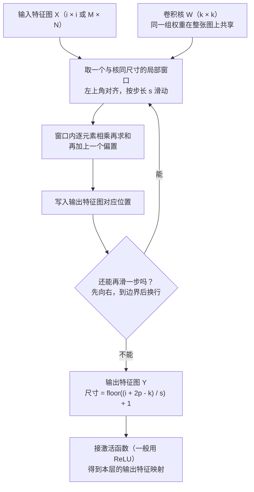

# 二维卷积与互相关

> **学习目标**：能够解释「二维卷积与互相关」的机制或步骤，并用本节材料验证理解。
>
> **前置知识**：全连接前馈网络与反向传播（第 4 章）、梯度下降与 ReLU、张量的维度概念（NCHW）、numpy/PyTorch 基础张量操作。
>
> **所属主题**：-CNN卷积神经网络 · 算法细节

## 本次只学这一点

给定图像 $X\in\mathbb{R}^{M\times N}$ 与卷积核 $W\in\mathbb{R}^{m\times n}$（一般 $m\ll M,\ n\ll N$），**二维卷积**为 $y_{ij} = \sum_{u=1}^{m}\sum_{v=1}^{n} w_{uv} x_{i-u+1,\, j-v+1}$，而**互相关（cross-correlation）**为 $y_{ij} = \sum_{u=1}^{m}\sum_{v=1}^{n} w_{uv} x_{i+u-1,\, j+v-1} = (\boldsymbol{W}\otimes \boldsymbol{X})_{ij}$。两者只差一次 180° 旋转：

$$\boldsymbol{Y} = \boldsymbol{W}\otimes \boldsymbol{X} = \mathrm{rot180}(\boldsymbol{W}) * \boldsymbol{X},$$

其中 $\mathrm{rot180}(\cdot)$ 表示上下、左右同时颠倒（即旋转 180°）。教材用 $\otimes$ 表示**不翻转卷积（互相关）**，用 $*$ 表示真正的翻转卷积。

**为什么框架实现互相关？** 因为卷积核是**可学习的参数**。"用 $W$ 做真卷积"与"用 $\mathrm{rot180}(W)$ 做互相关"得到完全相同的结果；既然 $W$ 的取值由训练决定，网络完全可以自己学出一个"已经翻转过"的核来等价替代。所以翻转与否**不改变模型能力**，只影响权重矩阵里参数的下标顺序。省掉翻转就省掉一次访存与拷贝，因此 PyTorch/TensorFlow 的 `conv2d` 全部是互相关。教材据此约定：**除非特别声明，本书的"卷积"都指互相关，符号记作 $\otimes$**。

这张图回答的是：卷积核在一张输入特征图上「怎么滑、每一步算什么、结果写到哪里」，以及输出尺寸是谁决定的。

**读图要点**：

| 观察 | 含义 |
| --- | --- |
| 卷积核在整张图上共享同一组权重 | 一个核就是一个特征检测器，要提取 D′ 种特征就得用 D′ 个核，而参数量与图像大小无关 |
| 每次只取一个与核同尺寸的局部窗口 | 这就是局部连接：连接数从 n_l × n_(l−1) 降到 n_l × K |
| 输出尺寸由 i、k、s、p 共同决定 | 公式必须取整，滑不完的剩余部分直接丢弃，这是「卷积后尺寸对不上」最常见的来源 |
| 多通道时输出通道必须看完全部输入通道 | 跨通道信息在求和这一步融合，因此第 p 个输出特征图的参数量是 k × k × D + 1 |
| 前向是互相关、反向要翻转 | 对输入的梯度需要对误差项做宽卷积并把核旋转 180°，这正是转置卷积的出发点 |

## 验证理解

- 合上正文，用自己的话解释本知识点解决的问题及适用边界。
- 若本节含代码、公式或流程，先预测结果，再运行、推导或逐步追踪；项目片段需要沿用原文的依赖与数据。
- 如果缺少变量、术语或完整代码，请查阅[综合原文](../../../../../04-dl/03-CNN与视觉/05-CNN卷积神经网络.md)；代码片段不等同于独立可运行项目。

## 自测与关联复习

- 「二维卷积与互相关」为什么需要这种设计？改变一个条件会怎样？
- 找出仍讲不清楚的地方，加入待复习并留下具体问题。
- [本主题目录](../index.md) · [完整示例、常见坑与原文自测](../../../../../04-dl/03-CNN与视觉/05-CNN卷积神经网络.md)
