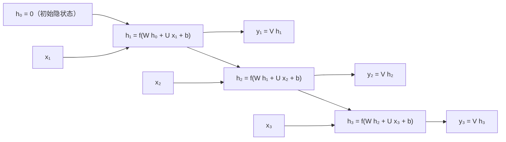

# 简单循环网络（SRN）与按时间展开

> **学习目标**：能够解释「简单循环网络（SRN）与按时间展开」的机制或步骤，并用本节材料验证理解。
>
> **前置知识**：多层前馈网络与反向传播、链式法则与 Jacobian、Logistic/Tanh 及其导数、梯度下降与学习率、PyTorch 的 `nn.Module` 与张量维度。
>
> **所属主题**：-RNN与序列模型 · 算法细节

## 本次只学这一点

SRN（Elman, 1990）是最简单的循环网络：只有一个隐藏层，但隐藏层到隐藏层存在反馈连接。令 $x_t\in\mathbb{R}^M$ 为 $t$ 时刻输入，$h_t\in\mathbb{R}^D$ 为隐状态，则

$$z_t = W h_{t-1} + U x_t + b,\qquad h_t = f(z_t)$$

其中 $W\in\mathbb{R}^{D\times D}$ 是**状态-状态**权重矩阵（反馈边上的权重），$U\in\mathbb{R}^{D\times M}$ 是**状态-输入**权重矩阵，$b\in\mathbb{R}^D$ 为偏置，$f(\cdot)$ 通常取 Logistic 或 Tanh。写成一行即教材式(6.7)：$h_t=f\big(Wh_{t-1}+Ux_t+b\big)$，初值 $h_0=\mathbf{0}$。若再加输出层 $y_t=Vh_t$，就得到完整的两层结构。

**手推：参数共享与展开等价**。把 $t=1,2,3$ 依次代入：

$$h_1=f(Ux_1+b),\quad h_2=f(Wh_1+Ux_2+b),\quad h_3=f(Wh_2+Ux_3+b)$$

把 $h_1,h_2$ 层层代入 $h_3$ 可得

$$h_3=f\Big(W\,f\big(W\,f(Ux_1+b)+Ux_2+b\big)+Ux_3+b\Big)$$

这是一个深度为 3 的前馈网络，每层输入都是 $[h_{t-1};x_t]$，且**每一层用的是同一个 $W$ 和同一个 $U$**。因此反向传播时，$\partial\mathcal{L}/\partial W$ 必须把每个时刻的贡献全部累加——这正是 BPTT 与普通 BP 的唯一区别。

这张图回答的是：一个循环网络「按时间展开」之后长什么样，同一组参数在每个时间步是怎么被复用的。

**读图要点**：

| 观察 | 含义 |
| --- | --- |
| 三个时间步用的是同一组 W、U、V | 参数共享让序列长度不改变参数量，这也是同一个模型能处理任意长度输入的原因 |
| 展开后就是一个深度为 T 的前馈网络 | 每层的输入都是 [h_(t−1); x_t]，于是梯度消失与爆炸的问题原样继承自深网络 |
| h_t 是唯一的记忆通道 | 历史信息全靠这一个定长向量向后传，长序列里早期信息会被反复覆盖，这正是长程依赖问题的根源 |
| BPTT 与普通 BP 的唯一区别是「对 t 求和」 | ∂L/∂W 必须把每个时刻的贡献全部累加，因为 W 在每一个时刻都参与了计算 |
| h₀ 取零向量是约定而不是必须 | 它决定了第一条输出里「历史」部分的先验，实践中也常用可学习的初值 |

## 验证理解

- 合上正文，用自己的话解释本知识点解决的问题及适用边界。
- 若本节含代码、公式或流程，先预测结果，再运行、推导或逐步追踪；项目片段需要沿用原文的依赖与数据。
- 如果缺少变量、术语或完整代码，请查阅[综合原文](../../../../../04-dl/04-序列与注意力/06-RNN与序列模型.md)；代码片段不等同于独立可运行项目。

## 自测与关联复习

- 「简单循环网络（SRN）与按时间展开」为什么需要这种设计？改变一个条件会怎样？
- 找出仍讲不清楚的地方，加入待复习并留下具体问题。
- [本主题目录](../index.md) · [完整示例、常见坑与原文自测](../../../../../04-dl/04-序列与注意力/06-RNN与序列模型.md)
