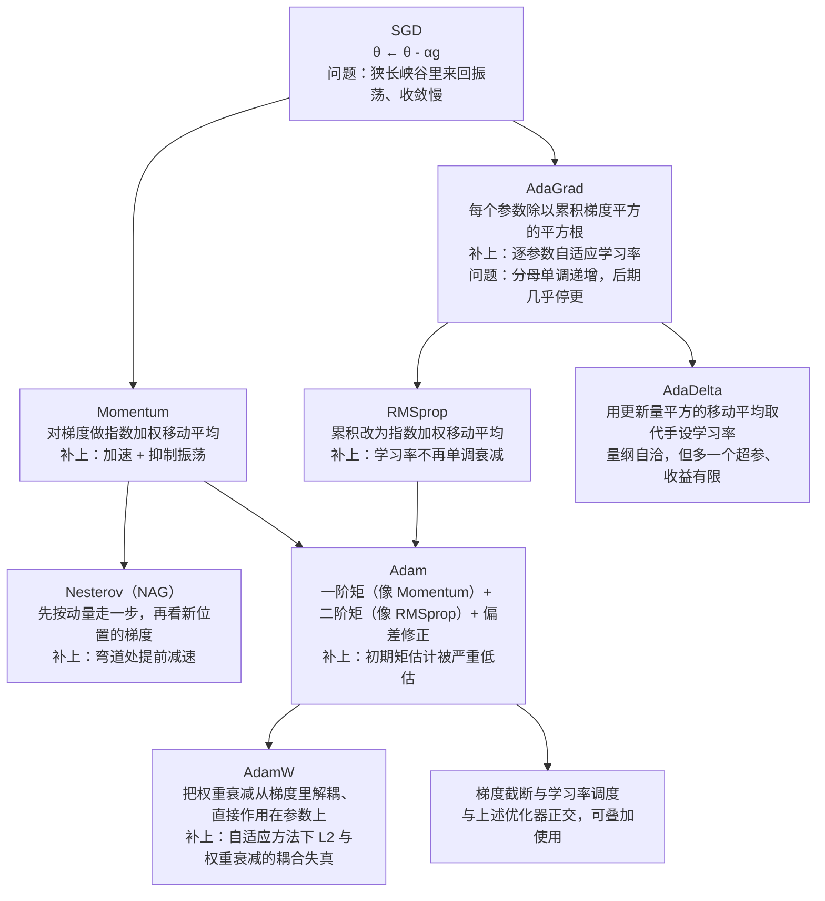

# 统一公式与优化算法汇总

> **学习目标**：能够解释「统一公式与优化算法汇总」的机制或步骤，并用本节材料验证理解。
>
> **前置知识**：梯度下降与反向传播、链式法则、Hessian 矩阵与半正定、期望与方差、Softmax 与交叉熵、PyTorch 的 `nn.Module` / `optim` / `scheduler` 基本用法。
>
> **所属主题**：-优化器与正则化 · 算法细节

## 本次只学这一点

教材把所有一阶方法写成同一个模板 $\Delta\theta_t=-\frac{\alpha_t}{\sqrt{G_t}+\epsilon}M_t$，其中 $G_t=\phi(g_1,\dots,g_t)$ 是学习率缩放项、$M_t=\psi(g_1,\dots,g_t)$ 是参数更新方向：

| 类别 | 算法 | 学习率 $\alpha_t$ | $G_t$ | 更新方向 $M_t$ |
| --- | --- | --- | --- | --- |
| 固定/衰减学习率 | 小批量 SGD | 常数或衰减 | $1$（不缩放） | $g_t$ |
| 固定衰减学习率 | 分段常数 / 逆时 / （自然）指数 / 余弦衰减 | 见 2.2 | $1$ | $g_t$ |
| 周期性学习率 | 循环学习率、SGDR | 周期升降 | $1$ | $g_t$ |
| 自适应学习率 | AdaGrad | 常数 $\alpha$ | $\sum_{\tau\le t}g_\tau\odot g_\tau$ | $g_t$ |
| 自适应学习率 | RMSprop | 常数 $\alpha$ | $\beta G_{t-1}+(1-\beta)g_t\odot g_t$ | $g_t$ |
| 自适应学习率 | AdaDelta | 无初始 $\alpha$，用 $\sqrt{\Delta x^2_{t-1}+\epsilon}$ | 同 RMSprop | $g_t$ |
| 梯度估计修正 | 动量法 / Nesterov | $\alpha$ | $1$ | $\rho M_{t-1}+g_t$ ／ $\rho M_{t-1}+g(\theta_{t-1}+\rho\Delta\theta_{t-1})$ |
| 梯度估计修正 | 梯度截断 | $\alpha$ | $1$ | $\mathrm{clip}(g_t)$ |
| 综合方法 | Adam | $\alpha$（可衰减） | $\hat v_t$（带偏差修正的二阶矩） | $\hat m_t$（带偏差修正的一阶矩） |

这张图回答的是：从最朴素的 SGD 到 AdamW，每个优化器分别补上了前一个的哪个短板。

**读图要点**：

| 观察 | 含义 |
| --- | --- |
| SGD 之后有两条独立分支 | 一条修「更新方向」（动量与 Nesterov），一条修「每个参数的学习率尺度」（AdaGrad 及其后继），Adam 是两条分支的合流 |
| 动量的作用是「加速 + 抑制振荡」 | 梯度长期同方向时有效步长放大到 α/(1−ρ)，来回变号的方向幅度被压掉近一半，所以换动量后常要把 α 调小 |
| AdaGrad 的病根是分母单调递增 | 累积平方和只增不减，后期有效学习率趋零，「还没到最优点就提前罢工」；RMSprop 用指数加权移动平均修掉它 |
| Adam 真正新增的东西是偏差修正 | 一阶矩来自动量、二阶矩来自 RMSprop，`m_0=0` 造成的初期低估靠除以 1−β^t 修正，否则第一步几乎不动 |
| AdamW 修的是「L2 与权重衰减的耦合」 | 在自适应方法里 λθ 会先进入 m、v 再被逐参数缩放，正则强度失真；解耦后直接衰减参数，二者才重新等价 |

## 验证理解

- 合上正文，用自己的话解释本知识点解决的问题及适用边界。
- 若本节含代码、公式或流程，先预测结果，再运行、推导或逐步追踪；项目片段需要沿用原文的依赖与数据。
- 如果缺少变量、术语或完整代码，请查阅[综合原文](../../../../../04-dl/02-优化与训练/04-优化器与正则化.md)；代码片段不等同于独立可运行项目。

## 自测与关联复习

- 「统一公式与优化算法汇总」为什么需要这种设计？改变一个条件会怎样？
- 找出仍讲不清楚的地方，加入待复习并留下具体问题。
- [本主题目录](../index.md) · [完整示例、常见坑与原文自测](../../../../../04-dl/02-优化与训练/04-优化器与正则化.md)
