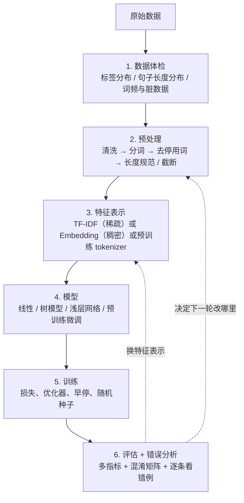

# 文本分类的通用流水线

> **学习目标**：能够解释「文本分类的通用流水线」的机制或步骤，并用本节材料验证理解。
>
> **前置知识**：第 02 篇分词、第 03 篇 TF-IDF 与稀疏矩阵、第 04 篇词向量与 FastText、sklearn 的基本用法。
>
> **所属主题**：文本分类实战 · 核心概念

## 本次只学这一点

这张图回答：一条分类流水线里，哪些步骤在动数据、哪些在动模型，以及做完评估之后要回到哪里。

**读图要点**：

| 观察 | 含义 |
| --- | --- |
| 第 1 步与第 6 步是「看数据」的两端 | 前者决定特征与模型是否可行，后者决定下一轮改什么；中间的模型选择反而更早被固定 |
| 第 3 步是三选一 | TF-IDF / Embedding / 预训练 tokenizer 决定了第 4 步能选什么模型的上限 |
| 第 5 步是唯一与数据无关的环节 | 它只管损失、优化器、早停与种子，出问题通常表现为结果不稳定而不是结果差 |
| 回边指向第 2、3 步而不是第 4 步 | 分类任务的提升多数来自特征与数据，换模型是最贵、收益最不确定的一步 |
| 第 6 步被跳过就等于放弃改进线索 | 只看一个 accuracy 数字，无法判断错的是哪一类、错在多长文本上 |

第 6 步最容易被跳过，但它决定了下一轮迭代做什么。只看一个 accuracy 数字，等于放弃了所有改进线索。

## 验证理解

- 合上正文，用自己的话解释本知识点解决的问题及适用边界。
- 若本节含代码、公式或流程，先预测结果，再运行、推导或逐步追踪；项目片段需要沿用原文的依赖与数据。
- 如果缺少变量、术语或完整代码，请查阅[综合原文](../../../../../05-nlp/03-任务与信息抽取/05-文本分类实战.md)；代码片段不等同于独立可运行项目。

## 自测与关联复习

- 「文本分类的通用流水线」为什么需要这种设计？改变一个条件会怎样？
- 找出仍讲不清楚的地方，加入待复习并留下具体问题。
- [本主题目录](../index.md) · [完整示例、常见坑与原文自测](../../../../../05-nlp/03-任务与信息抽取/05-文本分类实战.md)
