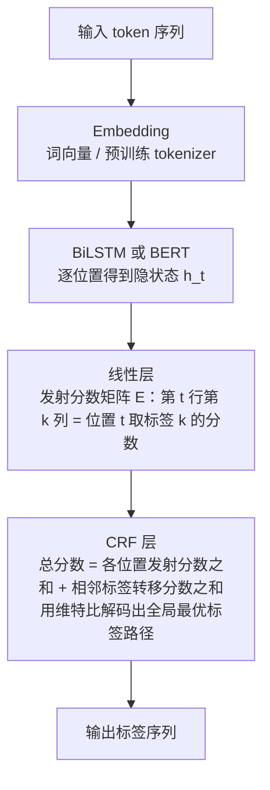

# BiLSTM-CRF 的数据流

> **学习目标**：能够解释「BiLSTM-CRF 的数据流」的机制或步骤，并用本节材料验证理解。
>
> **前置知识**：第 01 篇的词性标注与 NER 两阶段拆解、概率论基础（条件概率、贝叶斯）、softmax 与交叉熵。
>
> **所属主题**：序列标注与实体识别 · 方法细节

## 本次只学这一点

现代序列标注的标准架构把「特征提取」与「标签约束」解耦：

这张图回答：从 token 到标签序列，特征与约束分别在哪一层被加上。

**读图要点**：

| 观察 | 含义 |
| --- | --- |
| 前几层在做「减维」，最后一层在加约束 | Embedding / BiLSTM / 线性层只关心每个位置像哪个标签，CRF 才关心标签之间的组合是否合法 |
| 分数由两部分相加 | 位置分数来自特征（发射分数），相邻分数来自可学习的转移矩阵，二者相加才是整条路径的分数 |
| 线性层的输出宽度由标签数决定 | 隐状态维度 d 在这里被映射到 K 个标签，之后不再有新的特征提取 |
| 图里没画训练路径 | 训练用 CRF 的负对数似然（要算配分函数 Z），推理才用维特比，两者不是同一套计算 |
| 维特比的位置在 CRF 内部 | 它解决的是「在给定分数下找最优路径」，而不是「产生分数」，所以换特征提取器不影响它 |

各组件职责：

| 组件 | 负责 | 不负责 |
|------|------|--------|
| Embedding / BERT | 把 token 变成含上下文的向量 | 标签之间的约束 |
| BiLSTM | 双向建模长距离依赖（前向 + 后向拼接） | 输出合法标签序列 |
| 线性层 | 把 $d$ 维隐状态映射到 $K$ 个标签的分数 | 序列级一致性 |
| CRF 层 | 用可学习转移矩阵 $T$ 约束标签序列，维特比求全局最优 | 特征提取 |

训练时用 CRF 的负对数似然（需要前向算法算 $Z(x)$），而不是逐位置交叉熵；推理时用维特比。

## 验证理解

- 合上正文，用自己的话解释本知识点解决的问题及适用边界。
- 若本节含代码、公式或流程，先预测结果，再运行、推导或逐步追踪；项目片段需要沿用原文的依赖与数据。
- 如果缺少变量、术语或完整代码，请查阅[综合原文](../../../../../05-nlp/03-任务与信息抽取/06-序列标注与实体识别.md)；代码片段不等同于独立可运行项目。

## 自测与关联复习

- 「BiLSTM-CRF 的数据流」为什么需要这种设计？改变一个条件会怎样？
- 找出仍讲不清楚的地方，加入待复习并留下具体问题。
- [本主题目录](../index.md) · [完整示例、常见坑与原文自测](../../../../../05-nlp/03-任务与信息抽取/06-序列标注与实体识别.md)
