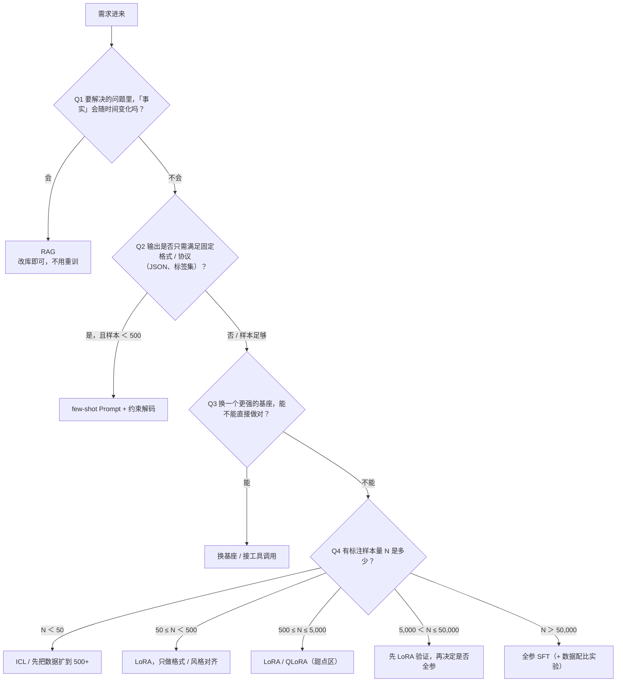

# 决策树

> **学习目标**：能够解释「决策树」的机制或步骤，并用本节材料验证理解。
>
> **前置知识**：Transformer 与注意力机制；预训练语言模型的 MLM / CLM 目标；LoRA 的公式（见《03-LoRA原理与工程实践》）；基本的 PyTorch 训练循环概念。
>
> **所属主题**：微调基础与决策 · 核心概念

## 本次只学这一点

把上面的表压成一棵树：按顺序问四个问题，每个问题的答案都会砍掉一部分候选方案。这张图回答的是「按什么顺序问、每个答案分别通向哪个手段」。

**读图要点**：

| 观察 | 含义 |
| --- | --- |
| Q1 问的是「知识会不会变」而不是「任务难不难」 | 事实会变时微调几乎必然滞后，RAG 改库就能生效，所以它必须排在第一位 |
| Q2 在区分「模式问题」与「能力问题」 | 格式是浅层模式，少量样本的 PEFT 就能学会，不值得上全参 |
| 前三个问题都在排除「不该微调」的情况 | 只有 Q1 到 Q3 都答「否」才进入样本量判断，避免默认把微调当成第一手段 |
| Q4 的区间对应一条容量经验曲线 | 数据越少越该用低容量方法（ICL → LoRA → 全参），否则参数量远多于样本，模型只会背下训练集 |
| 整棵树只负责筛选，不负责承诺效果 | 每一步附加的检查（有没有独立评测集、线上调用量撑不撑得起一次性成本）才是能否落地的真正判据 |

每一步都要附加检查：有独立评测集吗？线上调用量撑得起一次性成本吗？

## 验证理解

- 合上正文，用自己的话解释本知识点解决的问题及适用边界。
- 若本节含代码、公式或流程，先预测结果，再运行、推导或逐步追踪；项目片段需要沿用原文的依赖与数据。
- 如果缺少变量、术语或完整代码，请查阅[综合原文](../../../../../06-llm/02-微调与对齐/01-微调基础与决策.md)；代码片段不等同于独立可运行项目。

## 自测与关联复习

- 「决策树」为什么需要这种设计？改变一个条件会怎样？
- 找出仍讲不清楚的地方，加入待复习并留下具体问题。
- [本主题目录](../index.md) · [完整示例、常见坑与原文自测](../../../../../06-llm/02-微调与对齐/01-微调基础与决策.md)
