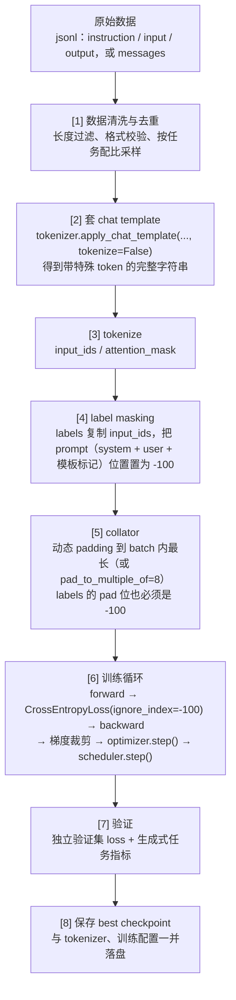

# 完整数据流

> **学习目标**：能够解释「完整数据流」的机制或步骤，并用本节材料验证理解。
>
> **前置知识**：因果语言模型的训练目标；tokenizer 与特殊 token（BOS/EOS/PAD）；交叉熵损失；LoRA 的注入方式（见 [03 篇](../../../../../06-llm/02-微调与对齐/03-LoRA原理与工程实践.md)）与显存账本（见 [02 篇](../../../../../06-llm/02-微调与对齐/02-全参微调与显存账本.md)）。
>
> **所属主题**：SFT 训练循环与框架 · 核心概念

## 本次只学这一点

这张图回答的是：一条原始样本要经过哪些步骤才变成模型真正用来算 loss 的张量，以及每一环最容易出错的地方在哪里。

**读图要点**：

| 观察 | 含义 |
| --- | --- |
| chat template 必须在 tokenize 之前完成 | 模板里的特殊 token 是模型预训练时见过的格式，手工拼字符串少一个换行就可能让回答质量暴跌却不报错 |
| label masking 把 prompt 位置置为 -100 | `CrossEntropyLoss` 的 `ignore_index=-100` 会跳过这些位置，于是模型只对回答部分负责 |
| collator 的 padding 位也必须是 -100 | 否则模型会去学「填充符也算答案」，在长短混排的 batch 上尤其明显 |
| 训练循环里没有任何特殊之处 | 最后一步就是普通的前向 + 交叉熵 + 反向 + 梯度裁剪 + 优化器与调度器步进，SFT 的特殊性全在数据侧 |
| 保存要连同 tokenizer 与训练配置一起落盘 | 推理时模板或分词器与训练不一致，是「明明训练好了但效果不对」最常见的原因 |

## 验证理解

- 合上正文，用自己的话解释本知识点解决的问题及适用边界。
- 若本节含代码、公式或流程，先预测结果，再运行、推导或逐步追踪；项目片段需要沿用原文的依赖与数据。
- 如果缺少变量、术语或完整代码，请查阅[综合原文](../../../../../06-llm/02-微调与对齐/05-SFT训练循环与框架.md)；代码片段不等同于独立可运行项目。

## 自测与关联复习

- 「完整数据流」为什么需要这种设计？改变一个条件会怎样？
- 找出仍讲不清楚的地方，加入待复习并留下具体问题。
- [本主题目录](../index.md) · [完整示例、常见坑与原文自测](../../../../../06-llm/02-微调与对齐/05-SFT训练循环与框架.md)
