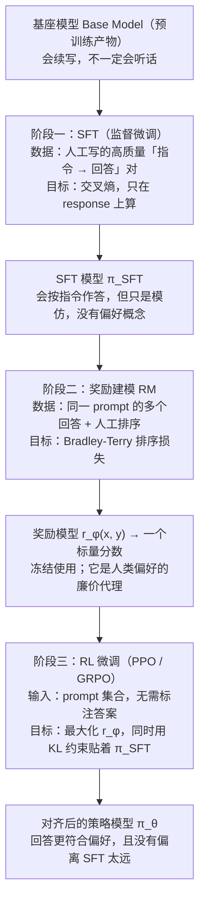

# 后训练三阶段全景

> **学习目标**：能够解释「后训练三阶段全景」的机制或步骤，并用本节材料验证理解。
>
> **前置知识**：Transformer 与自回归语言模型、交叉熵与最大似然、softmax 与对数概率、梯度的基本概念；了解「SFT 微调」是什么。有强化学习的策略（policy）与奖励（reward）概念更好，没有也能读，本文把需要的部分从头推导。
>
> **所属主题**：-对齐概览与RLHF · 核心概念

## 本次只学这一点

这张图回答的是：从基座模型到一个对齐模型，三个阶段各自吃什么数据、优化什么目标、又产出什么。

**读图要点**：

| 观察 | 含义 |
| --- | --- |
| 三阶段是串行依赖，不是并列可选项 | RM 由 SFT 模型初始化才收敛快，RL 又必须有 RM 才能打分，少一环就断链 |
| 监督信号一路在变「粗」 | SFT 是逐 token 交叉熵 → RM 是整条回答一个排序 → RL 是整条回答一个标量奖励，信息越来越稀疏 |
| RM 在第三阶段是冻结的 | 它只是人类偏好的廉价代理，训练中不更新；这也意味着 RM 的偏差会原样传导给策略 |
| KL 约束的对象是 π_SFT 而不是 Base | 贴着 SFT 走，是为了不把监督学习阶段已经学到的格式与语言能力丢掉 |
| 产出是「对齐后的策略」而非「更聪明的模型」 | 这一阶段提升的是有帮助性、无害性与语气，知识上限仍由预训练决定 |

三个阶段的分工可以用一句话记住：**SFT 教格式，RM 学偏好，RL 换目标函数**。

## 验证理解

- 合上正文，用自己的话解释本知识点解决的问题及适用边界。
- 若本节含代码、公式或流程，先预测结果，再运行、推导或逐步追踪；项目片段需要沿用原文的依赖与数据。
- 如果缺少变量、术语或完整代码，请查阅[综合原文](../../../../../06-llm/03-对齐与后训练/01-对齐概览与RLHF.md)；代码片段不等同于独立可运行项目。

## 自测与关联复习

- 「后训练三阶段全景」为什么需要这种设计？改变一个条件会怎样？
- 找出仍讲不清楚的地方，加入待复习并留下具体问题。
- [本主题目录](../index.md) · [完整示例、常见坑与原文自测](../../../../../06-llm/03-对齐与后训练/01-对齐概览与RLHF.md)
