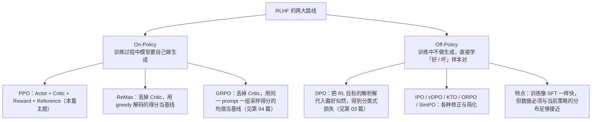

# On-Policy 与 Off-Policy 两条路线

> **学习目标**：能够解释「On-Policy 与 Off-Policy 两条路线」的机制或步骤，并用本节材料验证理解。
>
> **前置知识**：Transformer 与自回归语言模型、交叉熵与最大似然、softmax 与对数概率、梯度的基本概念；了解「SFT 微调」是什么。有强化学习的策略（policy）与奖励（reward）概念更好，没有也能读，本文把需要的部分从头推导。
>
> **所属主题**：-对齐概览与RLHF · 核心概念

## 本次只学这一点

这张图回答的是：RLHF 的两条技术路线各自包含哪些方法，以及它们分别省掉了什么。

**读图要点**：

| 观察 | 含义 |
| --- | --- |
| 分界线是有没有 `model.generate()` | 有生成就是 On-Policy；逐 token 串行生成极慢，这正是 On-Policy 方法耗卡又耗时的主因 |
| On-Policy 一侧的方法都在砍模型数量 | PPO 要四个模型，ReMax 砍掉 Critic，GRPO 再进一步用组内均值当基线 |
| Off-Policy 把代价从算力转移到了数据 | 训练像 SFT 一样快，但要求数据分布与当前策略足够接近，否则目标函数的前提不成立 |
| DPO 及其变体是一族修正而非单个算法 | IPO / cDPO / KTO / ORPO / SimPO 分别针对偏好强度、噪声标签、无配对数据等场景做简化 |
| 两条路线的收益与风险是对称的 | On-Policy 数据完全匹配当前模型、上限更高但昂贵；Off-Policy 便宜但更容易被分布偏移反噬 |

判定标准很简单：**训练循环里有没有 `model.generate()`，有就是 On-Policy**。生成是逐 token 串行进行的，非常慢，这正是 On-Policy 方法耗卡又耗时的主要原因；但代价换来的好处是训练数据「百分之百匹配当前模型自己」，理论上效果上限更高。

## 验证理解

- 合上正文，用自己的话解释本知识点解决的问题及适用边界。
- 若本节含代码、公式或流程，先预测结果，再运行、推导或逐步追踪；项目片段需要沿用原文的依赖与数据。
- 如果缺少变量、术语或完整代码，请查阅[综合原文](../../../../../06-llm/03-对齐与后训练/01-对齐概览与RLHF.md)；代码片段不等同于独立可运行项目。

## 自测与关联复习

- 「On-Policy 与 Off-Policy 两条路线」为什么需要这种设计？改变一个条件会怎样？
- 找出仍讲不清楚的地方，加入待复习并留下具体问题。
- [本主题目录](../index.md) · [完整示例、常见坑与原文自测](../../../../../06-llm/03-对齐与后训练/01-对齐概览与RLHF.md)
