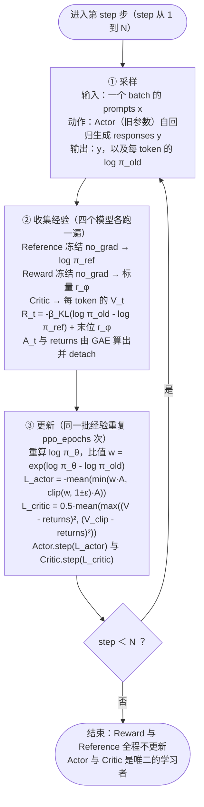

# 训练流程图与每一步的输入输出

> **学习目标**：能够解释「训练流程图与每一步的输入输出」的机制或步骤，并用本节材料验证理解。
>
> **前置知识**：Transformer 与自回归语言模型、交叉熵与最大似然、softmax 与对数概率、梯度的基本概念；了解「SFT 微调」是什么。有强化学习的策略（policy）与奖励（reward）概念更好，没有也能读，本文把需要的部分从头推导。
>
> **所属主题**：-对齐概览与RLHF · 数学推导

## 本次只学这一点

这张图回答的是：PPO 的每一次迭代内部到底发生了什么，四个模型分别在哪个环节被调用，以及同一步经验为什么会被重复使用。

**读图要点**：

| 观察 | 含义 |
| --- | --- |
| 采样与更新之间夹着一次「冻结的前向」 | 旧策略生成的数据要先用其余三个模型打完分、算完优势，才能进入更新；clip 正是用来限制更新后的策略离旧策略有多远 |
| 即时奖励只在最后一个 token 位置加 RM 分数 | 其余位置只有 KL 惩罚项，因为 RM 训练时就是拿整条回答的最后一个有效 token 表示整条回答的分数 |
| 同一批经验会重复用 ppo_epochs 次 | 这是样本效率的来源，也是必须 clip 的原因：重复更新会让新策略越来越偏离旧策略 |
| 优势与 returns 都要 detach | 它们是「目标」而不是被求导的路径，混进计算图会把梯度算错 |
| Reward 与 Reference 全程不更新 | 显存里四份权重因此是硬开销，这正是后续方法想方设法减少模型数量的动机 |

## 验证理解

- 合上正文，用自己的话解释本知识点解决的问题及适用边界。
- 若本节含代码、公式或流程，先预测结果，再运行、推导或逐步追踪；项目片段需要沿用原文的依赖与数据。
- 如果缺少变量、术语或完整代码，请查阅[综合原文](../../../../../06-llm/03-对齐与后训练/01-对齐概览与RLHF.md)；代码片段不等同于独立可运行项目。

## 自测与关联复习

- 「训练流程图与每一步的输入输出」为什么需要这种设计？改变一个条件会怎样？
- 找出仍讲不清楚的地方，加入待复习并留下具体问题。
- [本主题目录](../index.md) · [完整示例、常见坑与原文自测](../../../../../06-llm/03-对齐与后训练/01-对齐概览与RLHF.md)
