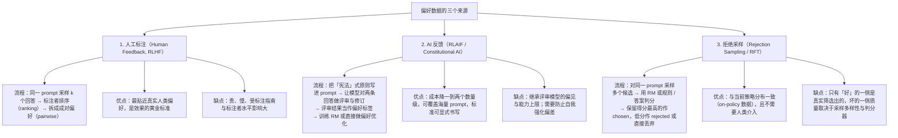

# 偏好数据的三个来源

> **学习目标**：能够解释「偏好数据的三个来源」的机制或步骤，并用本节材料验证理解。
>
> **前置知识**：Sigmoid 与交叉熵、极大似然估计、梯度下降；读过第 01 篇（RLHF 三阶段与四个模型）会更顺。
>
> **所属主题**：-奖励模型与偏好数据 · 核心概念

## 本次只学这一点

这张图回答的是：训练一个奖励模型所需的偏好数据从哪里来，三条来源各自的流程、优点与代价是什么。

**读图要点**：

| 观察 | 含义 |
| --- | --- |
| 三条来源的成本与保真度大致成反比 | 人工标注最贵也最贴近真实偏好，AI 反馈便宜一到两个数量级但继承评审模型的偏见，拒绝采样最省却只保证了「好」的那一侧 |
| 三者的产出最终都被压成成对偏好 | 排序可拆成多对、AI 评审可变成成对、拒绝采样天然成对，统一成 (x, y_w, y_l) 之后 RM 的训练目标才唯一 |
| AI 反馈的固有风险是自我强化 | 评审模型与被评审模型同源时偏差会被反复放大，需要外部信号或人工抽样兜底 |
| 拒绝采样的瓶颈在判分器 | 采样多样性不足或判分器有漏洞时，被丢掉的一侧未必真的更差，RM 会学到错误的方向 |
| 它们共同的前提是「同一 prompt 的多个回答」 | 跨 prompt 比较没有意义，这也是数据划分必须按 prompt 而不是按回答划分的原因 |

**成对偏好（pairwise）是这套体系的基础数据单元**：$(x, y_w, y_l)$，即「prompt $x$ 下，回答 $y_w$ 优于 $y_l$」。它比绝对打分的优势在于：人类比较两条回答比给出一个绝对分数要consistent得多；而且即使标注者的「绝对尺度」不同，比较判断仍可复用。

| 数据形式 | 标注难度 | 可复用性 | 常见用途 |
|---|---|---|---|
| 绝对打分（1–5 分） | 高（尺度难统一） | 低 | 早期的 RM 训练，现已少见 |
| 成对比较（A 好于 B） | 中 | 高 | Bradley-Terry RM 训练的标准形式 |
| 多路排序（k 选排序） | 高 | 最高（可拆成 $O(k^2)$ 对） | InstructGPT 等早期 RLHF |
| 二值标签（好/坏） | 低 | 中 | KTO 等方法（不需要配对） |

## 验证理解

- 合上正文，用自己的话解释本知识点解决的问题及适用边界。
- 若本节含代码、公式或流程，先预测结果，再运行、推导或逐步追踪；项目片段需要沿用原文的依赖与数据。
- 如果缺少变量、术语或完整代码，请查阅[综合原文](../../../../../06-llm/03-对齐与后训练/02-奖励模型与偏好数据.md)；代码片段不等同于独立可运行项目。

## 自测与关联复习

- 「偏好数据的三个来源」为什么需要这种设计？改变一个条件会怎样？
- 找出仍讲不清楚的地方，加入待复习并留下具体问题。
- [本主题目录](../index.md) · [完整示例、常见坑与原文自测](../../../../../06-llm/03-对齐与后训练/02-奖励模型与偏好数据.md)
