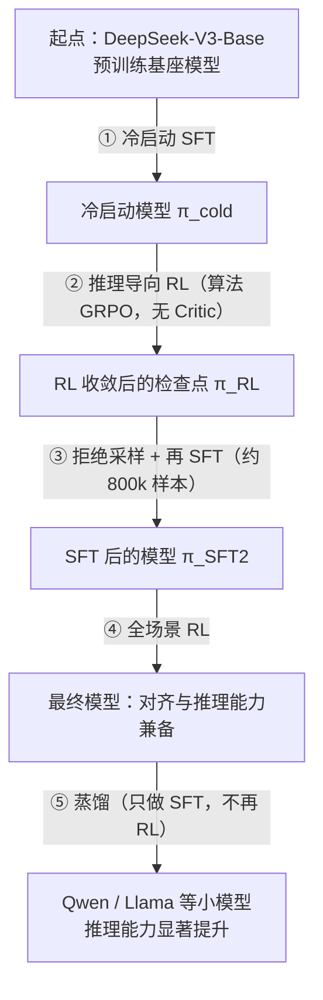

# 推理模型的后训练流水线（以 DeepSeek-R1 类路线为例）

> **学习目标**：能够解释「推理模型的后训练流水线（以 DeepSeek-R1 类路线为例）」的机制或步骤，并用本节材料验证理解。
>
> **前置知识**：第 01 篇（PPO 的四个模型、GAE、KL 惩罚）与第 02 篇（奖励模型与 reward hacking）；对「基线为什么不引入偏差」有印象会更顺。
>
> **所属主题**：-GRPO与推理模型后训练 · 核心概念

## 本次只学这一点

这张图回答的是：从一个「只会续写」的预训练基座，到一个推理能力可用的模型，中间要经过哪几道工序，每一道又解决了什么问题。

**读图要点**：

| 观察 | 含义 |
| --- | --- |
| ① 冷启动排在 RL 之前 | 没有它，RL 早期采出的回答可读性差、中英混杂，奖励信号难以稳定；冷启动先把「先思考再作答」的格式立起来 |
| ② 推理 RL 只用规则奖励 | 准确性奖励 + 格式奖励 + 语言一致性奖励都不依赖神经奖励模型，天然抗 reward hacking，代价是只适用于答案可验证的任务 |
| ③ 拒绝采样是「拿模型自己的好输出当新监督」 | 同一 prompt 采多条、筛出正确且可读的，把 RL 探索到的推理轨迹固化成稳定的数据分布，再 SFT 回去 |
| ④ 全场景 RL 把奖励分成两路 | 推理数据继续用规则奖励，通用数据用奖励模型对齐人类偏好，一边保住推理能力、一边补上安全性与有用性 |
| ⑤ 蒸馏只做 SFT，不再 RL | 小模型早期几乎采不到正确答案（奖励恒为 0、梯度恒为 0），喂「有标签的正确轨迹」比自己探索更可靠 |

**与 R1-Zero 的对比**：R1-Zero 直接跳过第 ① 步，从基座模型直接做 RL。它涌现出强推理行为，但存在可读性差、语言混杂等问题，因此才有了加入冷启动的 R1。**这条对照说明：纯 RL 能激发能力上限，但冷启动决定了输出的可用性与格式可控性。**

## 验证理解

- 合上正文，用自己的话解释本知识点解决的问题及适用边界。
- 若本节含代码、公式或流程，先预测结果，再运行、推导或逐步追踪；项目片段需要沿用原文的依赖与数据。
- 如果缺少变量、术语或完整代码，请查阅[综合原文](../../../../../06-llm/03-对齐与后训练/04-GRPO与推理模型后训练.md)；代码片段不等同于独立可运行项目。

## 自测与关联复习

- 「推理模型的后训练流水线（以 DeepSeek-R1 类路线为例）」为什么需要这种设计？改变一个条件会怎样？
- 找出仍讲不清楚的地方，加入待复习并留下具体问题。
- [本主题目录](../index.md) · [完整示例、常见坑与原文自测](../../../../../06-llm/03-对齐与后训练/04-GRPO与推理模型后训练.md)
