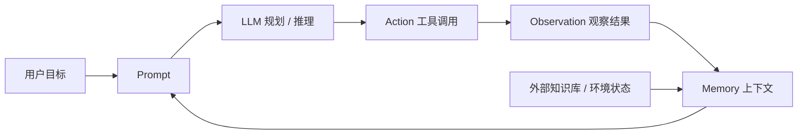

# 感知—决策—行动闭环

> **学习目标**：能够解释「感知—决策—行动闭环」的机制或步骤，并用本节材料验证理解。
>
> **前置知识**：[../llm/05-大模型API与调用实践.md](../../../../../06-llm/06-提示工程/05-大模型API与调用实践.md) 的消息角色与 API 调用、[../llm/04-提示词工程.md](../../../../../06-llm/06-提示工程/04-提示词工程.md) 的 system prompt 用法、本目录 [02-Function-Calling与工具调用](../../../../../07-agent/02-工具与规划/02-Function-Calling与工具调用.md)。
>
> **所属主题**：-Agent基础范式与ReAct循环 · 关键机制

## 本次只学这一点

把五要素落成一个循环，就是 Agent 的运行骨架：

**读图要点**：

| 观察 | 含义 |
| --- | --- |
| Memory 是唯一被两处写入的节点 | 它既接收 Observation（本轮动手的结果），也接收外部知识库 / 环境状态（本轮之外的事实） |
| 闭环边是 Memory → Prompt | 上下文不是每轮重建的，而是累积起来后重新拼进 Prompt |
| Action → Observation 是唯一对外的边 | 其余环节都发生在模型内部或代码内部，只有这条边会带回新信息 |
| 退出条件不在这张图里 | 目标是否达成由 LLM 自己判断（另有步数、超时、人工介入兜底），所以它是一个「模型自评」的循环 |

循环的退出条件是 **Agent 认为目标已达成**（或达到最大步数 / 超时 / 需要人类介入）。在 Function Call 章节讲同一件事时用的是「是否需要调用外部信息」的判定节点——判定为「否」则直接输出，判定为「是」则选择 API、执行、再回到模型。

## 验证理解

- 合上正文，用自己的话解释本知识点解决的问题及适用边界。
- 若本节含代码、公式或流程，先预测结果，再运行、推导或逐步追踪；项目片段需要沿用原文的依赖与数据。
- 如果缺少变量、术语或完整代码，请查阅[综合原文](../../../../../07-agent/01-基础范式/01-Agent基础范式与ReAct循环.md)；代码片段不等同于独立可运行项目。

## 自测与关联复习

- 「感知—决策—行动闭环」为什么需要这种设计？改变一个条件会怎样？
- 找出仍讲不清楚的地方，加入待复习并留下具体问题。
- [本主题目录](../index.md) · [完整示例、常见坑与原文自测](../../../../../07-agent/01-基础范式/01-Agent基础范式与ReAct循环.md)
