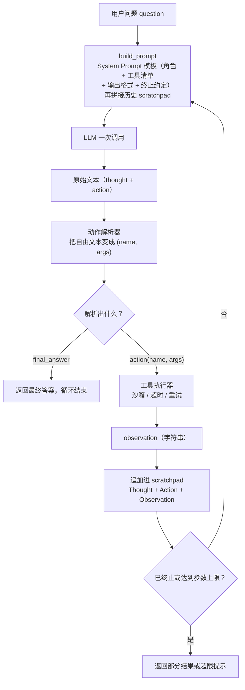

# 从零实现一个最小 Agent：核心思想

> **学习目标**：能够解释「从零实现一个最小 Agent：核心思想」的机制或步骤，并用本节材料验证理解。
>
> **前置知识**：Python 的 AST 与异常处理、JSON Schema 基本概念、LLM 的采样与上下文窗口、[ReAct / Plan-and-Execute / Reflexion 的术语定义](../../../../../07-agent/90-cheatsheet/glossary.md)
>
> **所属主题**：从零实现一个最小 Agent · 核心思想

## 本次只学这一点

Agent 的循环可以完整画成下面这张图。它只有四条边是「新东西」，其余都是普通工程：

这张图回答的是：一次决策从「拿到问题」到「问出下一个问题」，中间被谁接了几手，哪一步才是真正的新东西。

**读图要点**：

| 观察 | 含义 |
| --- | --- |
| scratchpad 是除用户问题之外唯一回到 LLM 的边 | 模型看到的全部历史都来自这串字符串；「Agent 有记忆」在最小实现里就是它 |
| 动作解析器是唯一的决策分岔点 | `final_answer` 走终止、`action` 走执行，解析错了整轮循环的方向就错了 |
| 工具执行器不直接产出答案 | 它只产出 observation 字符串，再由 scratchpad 回到下一轮，模型才真正「看到」结果 |
| 循环没有天然终点 | 出口只有两条边：模型宣布 `final_answer`，或步数上限兜底；缺一个就会无限转 |
| 四个组成部分恰好各占一段 | System Prompt 在 `build_prompt` 里，解析器、执行器、终止判定各占一条边，没有第五个隐藏角色 |

循环里真正不可替代的东西只有一样：**scratchpad**。它是模型看到的全部记忆，是一段不断变长的纯文本。所谓「Agent 有记忆」，在最小实现里就是这串字符串。

上半圈的决策风格有三种经典范式，差别只在「什么时候做规划、什么时候做反思」：

| 范式 | 一句话机制 | 适用场景 | 主要代价 | 典型失败模式 |
| --- | --- | --- | --- | --- |
| ReAct | 每个动作前先写一句 Thought，推理与行动交错进行 | 步数少、环境反馈密集、路径不确定的探索型任务 | 每步一次 LLM 调用，token 随步数线性增长 | 反复执行同一动作；Thought 说要做 A、Action 却写了 B |
| Plan-and-Execute | 先一次性产出 N 步计划，再逐步执行，必要时重规划 | 步骤多且大体可预判、需要并行或成本可控的长任务 | 计划在早期就被固定，环境一变整盘作废；重规划贵 | 计划超出工具实际能力；计划太长，执行到中段就跑偏 |
| Reflexion | 失败后让模型用自然语言写「我为什么失败」，把这段反思塞回下一轮 | 有明确成功判据、允许重试的任务（写代码、解谜题） | 需要一个额外评估器来判定失败；反思文本会持续占用上下文 | 反思空泛（「我应该更小心」）；同一错误反思三轮仍不改 |

三者的关系不是三选一。生产系统里常见的组合是：**Plan 产出初始任务分解，ReAct 作为执行时的内层循环，Reflexion 在单步失败后做一次修补**。

## 验证理解

- 合上正文，用自己的话解释本知识点解决的问题及适用边界。
- 若本节含代码、公式或流程，先预测结果，再运行、推导或逐步追踪；项目片段需要沿用原文的依赖与数据。
- 如果缺少变量、术语或完整代码，请查阅[综合原文](../../../../../07-agent/01-基础范式/01-从零实现一个最小Agent.md)；代码片段不等同于独立可运行项目。

## 自测与关联复习

- 「从零实现一个最小 Agent：核心思想」为什么需要这种设计？改变一个条件会怎样？
- 找出仍讲不清楚的地方，加入待复习并留下具体问题。
- [本主题目录](../index.md) · [完整示例、常见坑与原文自测](../../../../../07-agent/01-基础范式/01-从零实现一个最小Agent.md)
