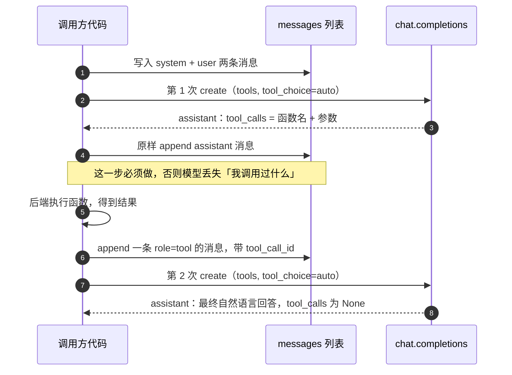

# 消息状态机

> **学习目标**：能够解释「消息状态机」的机制或步骤，并用本节材料验证理解。
>
> **前置知识**：[01-Agent基础范式与ReAct循环](../../../../../07-agent/01-基础范式/01-Agent基础范式与ReAct循环.md) 的 Action 环节、[../llm/05-大模型API与调用实践.md](../../../../../06-llm/06-提示工程/05-大模型API与调用实践.md) 的 `messages` 角色约定。
>
> **所属主题**：-Function-Calling与工具调用 · 关键机制

## 本次只学这一点

Function Calling 的往返本质上是在维护一个 `messages` 列表，靠角色区分「谁说的话」：

| role | 内容 | 由谁写入 | 备注 |
| --- | --- | --- | --- |
| `system` | 角色与行为约束 | 开发者 | 例如「不要自己编造内容，提示用户明确输入」 |
| `user` | 用户问题 | 开发者 | 例如「今天北京的天气如何」 |
| `assistant` | 模型的第一次回复 | 由 `message.model_dump()` 原样写入 | **必须包含 tool_calls**，否则模型会丢失上下文 |
| `tool` | 函数执行结果 | 开发者 | 必须带 `tool_call_id`（部分实现还需 `name`） |

时序：

这段往返用时序图看得最清楚：谁在什么时候往 `messages` 里写了什么。

**读图要点**：

| 观察 | 含义 |
| --- | --- |
| 两次 create 之间夹着两次 append | 无状态接口里「上下文」完全由调用方手工拼装，漏一次 append 模型就看不到中间状态 |
| assistant 消息必须原样回灌 | 它带着 `tool_calls` 的 id，第二轮的 tool 消息靠这个 id 才能和调用对上号 |
| role=tool 的消息只能由后端写 | 第 4 步的主语是后端系统而不是模型，这是最常见的面试考点 |
| 自然语言回答出现在第二轮 | 模型不是「一次生成完」，而是「先要数据、拿到结果后再组织语言」 |
| tool_calls 为 None 是终态标志 | 调用方靠这个字段判断该收尾还是该继续循环 |

## 验证理解

- 合上正文，用自己的话解释本知识点解决的问题及适用边界。
- 若本节含代码、公式或流程，先预测结果，再运行、推导或逐步追踪；项目片段需要沿用原文的依赖与数据。
- 如果缺少变量、术语或完整代码，请查阅[综合原文](../../../../../07-agent/02-工具与规划/02-Function-Calling与工具调用.md)；代码片段不等同于独立可运行项目。

## 自测与关联复习

- 「消息状态机」为什么需要这种设计？改变一个条件会怎样？
- 找出仍讲不清楚的地方，加入待复习并留下具体问题。
- [本主题目录](../index.md) · [完整示例、常见坑与原文自测](../../../../../07-agent/02-工具与规划/02-Function-Calling与工具调用.md)
