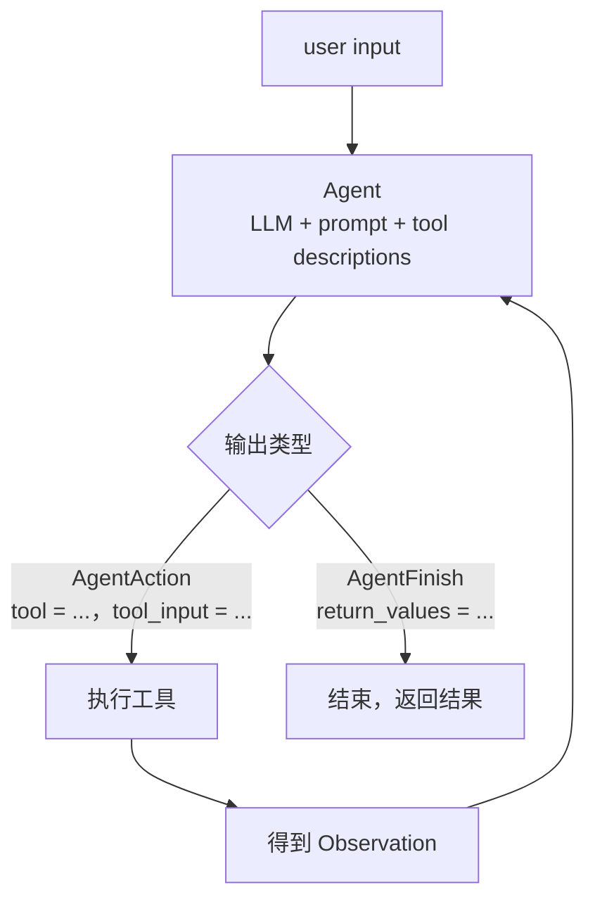

# AgentExecutor 的循环

> **学习目标**：能够解释「AgentExecutor 的循环」的机制或步骤，并用本节材料验证理解。
>
> **前置知识**：[02-Function-Calling与工具调用](../../../../../07-agent/02-工具与规划/02-Function-Calling与工具调用.md) 的工具协议、[01-Agent基础范式与ReAct循环](../../../../../07-agent/01-基础范式/01-Agent基础范式与ReAct循环.md) 的 ReAct 结构、[../llm/08-LangChain基础.md](../../../../../06-llm/07-检索增强RAG/08-LangChain基础.md)。
>
> **所属主题**：-LangChain与工具编排 · 关键机制

## 本次只学这一点

AgentExecutor 把「思考 → 选工具 → 执行 → 观察」做成一个受控循环：

这张图回答：一次「让模型自己决定调哪个工具」的过程，出口有几个、回到起点的边有几条。

**读图要点**：

| 观察 | 含义 |
| --- | --- |
| 回到 Agent 的只有 AgentAction 一条路 | 工具执行完必须重新进模型，模型才有机会判断「信息够了没有」 |
| AgentFinish 直接出循环 | 终止由模型自己宣布，所以「循环必须有停止标准」说的就是这条边 |
| 工具描述写在 Agent 节点内部 | 它不是独立组件而是 prompt 的一部分，描述含糊会直接改变分叉结果 |
| 图里只有两个出口 | 运行时还有第三个出口（迭代上限）没画出来，但工程上必须补，否则死循环 |

两个关键约束：

1. **工具描述就是提示词的组成部分**。`zero-shot-react-description` 完全依赖 description 挑选工具，所以描述含糊必然选错。
2. **循环必须有停止标准**（AgentFinish 或迭代上限），否则会不停调工具。

## 验证理解

- 合上正文，用自己的话解释本知识点解决的问题及适用边界。
- 若本节含代码、公式或流程，先预测结果，再运行、推导或逐步追踪；项目片段需要沿用原文的依赖与数据。
- 如果缺少变量、术语或完整代码，请查阅[综合原文](../../../../../07-agent/03-记忆与多智能体/03-LangChain与工具编排.md)；代码片段不等同于独立可运行项目。

## 自测与关联复习

- 「AgentExecutor 的循环」为什么需要这种设计？改变一个条件会怎样？
- 找出仍讲不清楚的地方，加入待复习并留下具体问题。
- [本主题目录](../index.md) · [完整示例、常见坑与原文自测](../../../../../07-agent/03-记忆与多智能体/03-LangChain与工具编排.md)
