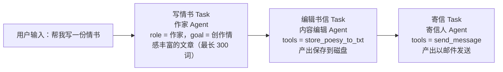

# 多 Agent 编排：CrewAI 的五件套

> **学习目标**：能够解释「多 Agent 编排：CrewAI 的五件套」的机制或步骤，并用本节材料验证理解。
>
> **前置知识**：[02-Function-Calling与工具调用](../../../../../07-agent/02-工具与规划/02-Function-Calling与工具调用.md) 的工具协议、[01-Agent基础范式与ReAct循环](../../../../../07-agent/01-基础范式/01-Agent基础范式与ReAct循环.md) 的 ReAct 结构、[../llm/08-LangChain基础.md](../../../../../06-llm/07-检索增强RAG/08-LangChain基础.md)。
>
> **所属主题**：-LangChain与工具编排 · 关键机制

## 本次只学这一点

第十章用 CrewAI 实现「自动写情书并发送邮件」。CrewAI 是一个**多角色 agent 框架**，为角色扮演中的 AI 代理提供自动化设置，通过促进代理之间的合作共同解决复杂问题。

| 组件 | 英文 | 职责（原文要点） |
| --- | --- | --- |
| 代理 | Agent | 每个 Agent 都有自己独特的个性、背景故事和技能 |
| 任务 | Task | 每个任务都有明确的目标和要求，并被分解成小而专注的子任务 |
| 执行容器 | Crew | 代理人、任务和过程相结合的容器层，是任务执行的实际场所 |
| 流程 | Process | 任务的分解、资源的分配、沟通协调 |
| 工具 | Tools | 根据特定情况和任务要求定制化代理工具 |

项目流水线：

这张图回答：三个 Agent 之间到底靠什么串起来，以及 `Process.sequential` 把它们排成了什么形状。

**读图要点**：

| 观察 | 含义 |
| --- | --- |
| 任务是一条链，不是并行分支 | `Process.sequential` 决定按 tasks 列表顺序执行，上一个任务的输出会作为附加内容传给下一个 |
| 每个 Task 绑定一个 Agent 和一个工具 | 工具挂在 Agent 上而不是 Task 上，所以同一个 Agent 在不同任务里能用的工具是一样的 |
| 中间那个 Task 有落盘副作用 | `store_poesy_to_txt` 把编辑结果写到磁盘，后面的寄信任务读的正是这份产物 |
| 只有最后一个 Agent 允许委派 | `allow_delegation` 为 True 的是寄信人，前两个 Agent 不能把子任务甩给别人 |
| 用户输入只进第一个任务 | 后续任务靠上下文传递而不是重新解析原始请求，所以中间任何一步失真都会往后传 |

三个 Agent 的关键参数对比：

| Agent | role | goal | tools | allow_delegation |
| --- | --- | --- | --- | --- |
| poet | 作家 | 根据用户需求创作情感丰富的文章（最长 300 词） | 无 | False |
| letter_writer | 内容编辑 | 对作家撰写的文章内容进行精心编辑 | `store_poesy_to_txt` | False |
| sender | 寄信人 | 将编辑好的书信以邮件形式发送 | `send_message` | True |

`backstory` 字段用来给角色注入人设（如「你作为一名著名的作家，拥有千万级别的粉丝」），本质上是一段 system prompt。

## 验证理解

- 合上正文，用自己的话解释本知识点解决的问题及适用边界。
- 若本节含代码、公式或流程，先预测结果，再运行、推导或逐步追踪；项目片段需要沿用原文的依赖与数据。
- 如果缺少变量、术语或完整代码，请查阅[综合原文](../../../../../07-agent/03-记忆与多智能体/03-LangChain与工具编排.md)；代码片段不等同于独立可运行项目。

## 自测与关联复习

- 「多 Agent 编排：CrewAI 的五件套」为什么需要这种设计？改变一个条件会怎样？
- 找出仍讲不清楚的地方，加入待复习并留下具体问题。
- [本主题目录](../index.md) · [完整示例、常见坑与原文自测](../../../../../07-agent/03-记忆与多智能体/03-LangChain与工具编排.md)
