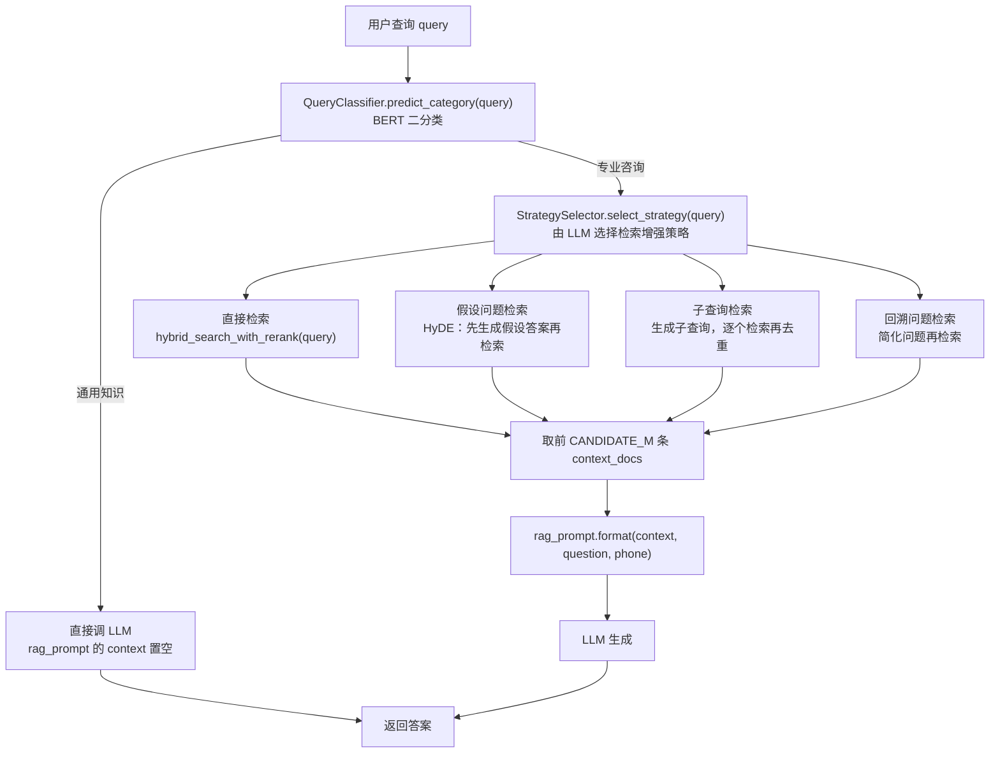

# RAG 的模块协作

> **学习目标**：能够解释「RAG 的模块协作」的机制或步骤，并用本节材料验证理解。
>
> **前置知识**：[05-Agent的记忆与知识管理](../../../../../07-agent/03-记忆与多智能体/05-Agent的记忆与知识管理.md) 的外部知识记忆、[04-Agent的规划与任务分解](../../../../../07-agent/02-工具与规划/04-Agent的规划与任务分解.md) 的查询改写策略、[../llm/07-向量数据库与Milvus.md](../../../../../06-llm/07-检索增强RAG/07-向量数据库与Milvus.md)。
>
> **所属主题**：-RAG作为Agent的知识获取手段 · 核心概念

## 本次只学这一点

`rag_system.py` 的 `generate_answer` 串起了全部模块：

这张图回答：一次查询进来之后，会在哪几个分岔点上被决定走哪条路。

**读图要点**：

| 观察 | 含义 |
| --- | --- |
| 分类器排在检索之前 | 通用知识直接问模型，一次检索都不做——这是省成本、避噪声的第一道闸门 |
| 四条策略边互斥 | StrategySelector 每次只选一条，所以同一次查询只有一条检索路径被激活 |
| 四条路径汇到同一个 context 变量 | 策略差异被收敛成「一组上下文文档」，下游的 prompt 与生成逻辑完全复用 |
| 通用知识分支绕过了策略选择与向量库 | 两个分支在同一个「返回答案」节点收口，调用方不需要区分自己走的是哪条 |
| 两道前置判断位置不同 | 分类决定「要不要检索」，策略选择决定「怎么检索」，是成本与召回两个不同方向的优化 |

| 模块 | 类 | 职责 |
| --- | --- | --- |
| `document_processor.py` | 函数式 | 多格式加载 + 分层切分（父块 / 子块） |
| `vector_store.py` | `VectorStore` | 集合管理、写入、混合检索 + 重排 |
| `prompts.py` | `RAGPrompts` | 集中管理 4 个 Prompt 模板 |
| `query_classifier.py` | `QueryClassifier` | BERT 二分类，决定是否走 RAG |
| `strategy_selector.py` | `StrategySelector` | LLM 选择检索增强策略 |
| `rag_system.py` | `RAGSystem` | 编排上述模块，产出最终答案 |

两道前置判断（分类 + 策略）是这套系统相对「无脑检索」的主要增量：**不必要检索的问题不检索**（省成本、避免噪声），**需要改写的问题先改写**（提高召回）。

## 验证理解

- 合上正文，用自己的话解释本知识点解决的问题及适用边界。
- 若本节含代码、公式或流程，先预测结果，再运行、推导或逐步追踪；项目片段需要沿用原文的依赖与数据。
- 如果缺少变量、术语或完整代码，请查阅[综合原文](../../../../../07-agent/03-记忆与多智能体/06-RAG作为Agent的知识获取手段.md)；代码片段不等同于独立可运行项目。

## 自测与关联复习

- 「RAG 的模块协作」为什么需要这种设计？改变一个条件会怎样？
- 找出仍讲不清楚的地方，加入待复习并留下具体问题。
- [本主题目录](../index.md) · [完整示例、常见坑与原文自测](../../../../../07-agent/03-记忆与多智能体/06-RAG作为Agent的知识获取手段.md)
