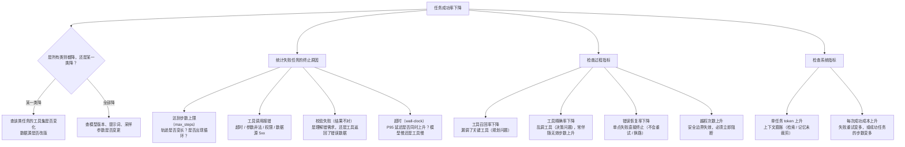

# 指标的归因链：从「变差了」到「哪里坏了」

> **学习目标**：能够解释「指标的归因链：从「变差了」到「哪里坏了」」的机制或步骤，并用本节材料验证理解。
>
> **前置知识**：[01-为什么Agent评测比LLM评测难](../../../../../07-agent/05-评测/01-为什么Agent评测比LLM评测难.md) 的结果层 / 过程层 / 系统层三分法与四象限判定。
>
> **所属主题**：-评测指标设计 · 关键机制

## 本次只学这一点

结果指标只会告诉你「坏了」，过程指标才能告诉你「哪里坏了」。下钻决策树：

这张图回答：看到「任务成功率下降」之后，按什么顺序问下去，才能定位到具体坏在哪一环。

**读图要点**：

| 观察 | 含义 |
| --- | --- |
| 每一条边都对应一个可自动计算的指标 | 只有能定位到叶子节点，迭代才不会退化成「换个 prompt 试试」 |
| 第一条判断把「某一类降」和「全部降」分开 | 前者指向数据源或工具集变化，后者指向模型与采样参数变更，修复动作完全不同 |
| 终止原因按「谁的时间被耗掉」分组 | 步数上限是规划问题、工具报错是集成问题、wall-clock 超时是性能问题 |
| 越权次数单独挂在过程指标下 | 它是唯一需要立即阻断、而不是调 prompt 的指标 |
| 系统指标放在最后一层 | 过程指标回答「坏在哪」，系统指标回答「贵不贵」，两者不能互相替代 |

这张树的价值在于：**每一步都对应一个可自动计算的指标**。只有当指标能定位到叶子节点，迭代才不会变成「换个 prompt 试试」。

## 验证理解

- 合上正文，用自己的话解释本知识点解决的问题及适用边界。
- 若本节含代码、公式或流程，先预测结果，再运行、推导或逐步追踪；项目片段需要沿用原文的依赖与数据。
- 如果缺少变量、术语或完整代码，请查阅[综合原文](../../../../../07-agent/05-评测/02-评测指标设计.md)；代码片段不等同于独立可运行项目。

## 自测与关联复习

- 「指标的归因链：从「变差了」到「哪里坏了」」为什么需要这种设计？改变一个条件会怎样？
- 找出仍讲不清楚的地方，加入待复习并留下具体问题。
- [本主题目录](../index.md) · [完整示例、常见坑与原文自测](../../../../../07-agent/05-评测/02-评测指标设计.md)
