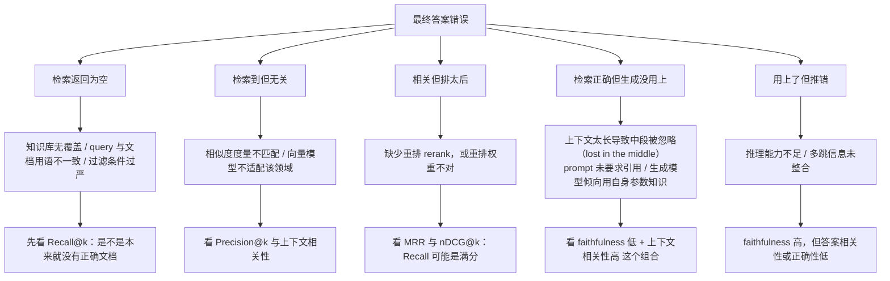

# 检索失败的归因链

> **学习目标**：能够解释「检索失败的归因链」的机制或步骤，并用本节材料验证理解。
>
> **前置知识**：[06-RAG作为Agent的知识获取手段](../../../../../07-agent/03-记忆与多智能体/06-RAG作为Agent的知识获取手段.md) 的检索链路、[02-评测指标设计](../../../../../07-agent/05-评测/02-评测指标设计.md) 的指标口径、[03-评测方法-单元测试与LLM即裁判](../../../../../07-agent/05-评测/03-评测方法-单元测试与LLM即裁判.md) 的 Judge 校准。
>
> **所属主题**：-RAG与多轮对话评测 · 关键机制

## 本次只学这一点

「RAG 回答错了」是最没有信息量的一句话。逐层下钻才能定位：

这张图回答：「RAG 答错了」这句话可以拆成哪几种互不相同的病因，以及每种病因该看哪个指标。

**读图要点**：

| 观察 | 含义 |
| --- | --- |
| 五种病因是并列的，不是递进的 | 它们分别落在检索链的不同环节，必须先确定是哪一种再动手，否则会改错东西 |
| 每个叶子都配了一个指标 | 病因判断不靠感觉，靠「哪个指标低」 |
| 「相关但排太后」这一支 Recall 可能是满分 | 只盯召回率会漏掉排序问题，必须同时看 MRR / nDCG |
| 「检索正确但生成没用上」这一支最长 | 它同时受上下文长度、prompt 约束和模型偏置三件事影响，是 RAG 里最难改的一类 |
| Recall@k 与 faithfulness 的组合最有用 | Recall 高而 faithfulness 低是生成问题；Recall 低而上下文相关性高是召回问题 |

两个可诊断的「指标组合」特别有用：

| 指标组合 | 指向的病因 |
| --- | --- |
| Recall@k 高、MRR 低、答案错 | **排序问题**：正确文档被埋在末尾 → 上重排模型 |
| Recall@k 低、上下文相关性高 | **召回问题**：检索到的都相关但不全 → 扩充召回、改 query、补知识库 |
| Recall@k 高、faithfulness 低 | **生成问题**：有证据不用，凭空生成 → 强化引用约束、压缩上下文、换生成模型 |
| faithfulness 高、答案相关性低 | **理解问题**：忠实于上下文但答非所问 → 改进问题理解与指令遵循 |

## 验证理解

- 合上正文，用自己的话解释本知识点解决的问题及适用边界。
- 若本节含代码、公式或流程，先预测结果，再运行、推导或逐步追踪；项目片段需要沿用原文的依赖与数据。
- 如果缺少变量、术语或完整代码，请查阅[综合原文](../../../../../07-agent/05-评测/05-RAG与多轮对话评测.md)；代码片段不等同于独立可运行项目。

## 自测与关联复习

- 「检索失败的归因链」为什么需要这种设计？改变一个条件会怎样？
- 找出仍讲不清楚的地方，加入待复习并留下具体问题。
- [本主题目录](../index.md) · [完整示例、常见坑与原文自测](../../../../../07-agent/05-评测/05-RAG与多轮对话评测.md)
